# Kibana plugin dependency diagrams


## actions

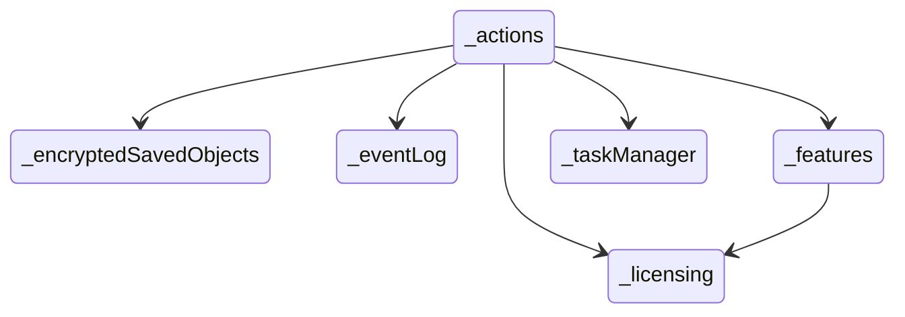


## advancedSettings

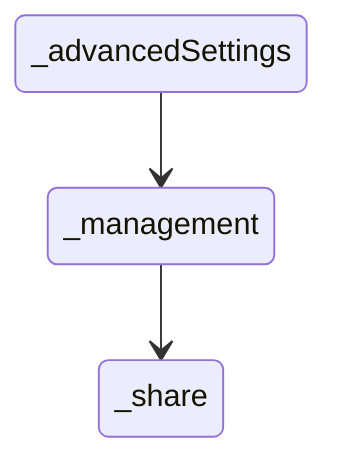


## aiops

```mermaid
stateDiagram
direction TB
accTitle: aiops dependencies
  _aiops --> _charts
  _aiops --> _data
  _aiops --> _lens
  _aiops --> _licensing
  _aiops --> _uiActions
  _aiops --> _unifiedFieldList
  _charts --> _expressions
  _controls --> _data
  _controls --> _dataViews
  _controls --> _embeddable
  _controls --> _expressions
  _controls --> _kibanaReact
  _controls --> _presentationUtil
  _controls --> _savedObjects
  _controls --> _uiActions
  _controls --> _unifiedSearch
  _dashboard --> _controls
  _dashboard --> _data
  _dashboard --> _dataViewEditor
  _dashboard --> _dataViews
  _dashboard --> _embeddable
  _dashboard --> _inspector
  _dashboard --> _navigation
  _dashboard --> _presentationUtil
  _dashboard --> _savedObjects
  _dashboard --> _savedObjectsFinder
  _dashboard --> _savedObjectsManagement
  _dashboard --> _screenshotMode
  _dashboard --> _share
  _dashboard --> _uiActions
  _dashboard --> _unifiedSearch
  _dashboard --> _urlForwarding
  _dashboard --> _visualizations
  _data --> _bfetch
  _data --> _dataViews
  _data --> _expressions
  _data --> _fieldFormats
  _data --> _inspector
  _data --> _management
  _data --> _screenshotMode
  _data --> _share
  _data --> _uiActions
  _dataViewEditor --> _data
  _dataViewEditor --> _dataViews
  _dataViewFieldEditor --> _data
  _dataViewFieldEditor --> _dataViews
  _dataViewFieldEditor --> _fieldFormats
  _dataViews --> _expressions
  _dataViews --> _fieldFormats
  _embeddable --> _data
  _embeddable --> _inspector
  _embeddable --> _savedObjectsFinder
  _embeddable --> _savedObjectsManagement
  _embeddable --> _uiActions
  _eventAnnotation --> _data
  _eventAnnotation --> _expressions
  _expressionGauge --> _charts
  _expressionGauge --> _data
  _expressionGauge --> _expressions
  _expressionGauge --> _fieldFormats
  _expressionGauge --> _presentationUtil
  _expressionGauge --> _visualizations
  _expressionHeatmap --> _charts
  _expressionHeatmap --> _data
  _expressionHeatmap --> _expressions
  _expressionHeatmap --> _fieldFormats
  _expressionHeatmap --> _presentationUtil
  _expressionHeatmap --> _visualizations
  _expressionMetricVis --> _charts
  _expressionMetricVis --> _expressions
  _expressionMetricVis --> _fieldFormats
  _expressionMetricVis --> _presentationUtil
  _expressionMetricVis --> _visualizations
  _expressionXY --> _charts
  _expressionXY --> _data
  _expressionXY --> _eventAnnotation
  _expressionXY --> _expressions
  _expressionXY --> _fieldFormats
  _expressionXY --> _uiActions
  _expressionXY --> _visualizations
  _inspector --> _share
  _lens --> _charts
  _lens --> _contentManagement
  _lens --> _dashboard
  _lens --> _data
  _lens --> _dataViewEditor
  _lens --> _dataViewFieldEditor
  _lens --> _dataViews
  _lens --> _embeddable
  _lens --> _eventAnnotation
  _lens --> _expressionGauge
  _lens --> _expressionHeatmap
  _lens --> _expressionMetricVis
  _lens --> _expressionXY
  _lens --> _expressions
  _lens --> _fieldFormats
  _lens --> _inspector
  _lens --> _navigation
  _lens --> _presentationUtil
  _lens --> _share
  _lens --> _uiActions
  _lens --> _uiActionsEnhanced
  _lens --> _unifiedFieldList
  _lens --> _unifiedSearch
  _lens --> _urlForwarding
  _lens --> _visualizations
  _management --> _share
  _navigation --> _unifiedSearch
  _presentationUtil --> _dataViews
  _presentationUtil --> _embeddable
  _presentationUtil --> _expressions
  _presentationUtil --> _kibanaReact
  _presentationUtil --> _savedObjects
  _presentationUtil --> _uiActions
  _savedObjects --> _data
  _savedObjects --> _dataViews
  _savedObjectsManagement --> _data
  _savedObjectsManagement --> _dataViews
  _savedObjectsManagement --> _management
  _uiActions --> _dataViews
  _uiActionsEnhanced --> _embeddable
  _uiActionsEnhanced --> _uiActions
  _unifiedFieldList --> _charts
  _unifiedFieldList --> _data
  _unifiedFieldList --> _dataViews
  _unifiedFieldList --> _fieldFormats
  _unifiedFieldList --> _uiActions
  _unifiedSearch --> _data
  _unifiedSearch --> _dataViews
  _unifiedSearch --> _savedObjectsManagement
  _unifiedSearch --> _screenshotMode
  _unifiedSearch --> _uiActions
  _visualizations --> _charts
  _visualizations --> _contentManagement
  _visualizations --> _data
  _visualizations --> _dataViewEditor
  _visualizations --> _dataViews
  _visualizations --> _embeddable
  _visualizations --> _expressions
  _visualizations --> _fieldFormats
  _visualizations --> _inspector
  _visualizations --> _navigation
  _visualizations --> _presentationUtil
  _visualizations --> _savedObjects
  _visualizations --> _savedObjectsFinder
  _visualizations --> _savedObjectsManagement
  _visualizations --> _screenshotMode
  _visualizations --> _uiActions
  _visualizations --> _unifiedSearch
  _visualizations --> _urlForwarding
  _visualizations --> _usageCollection
```


## alerting

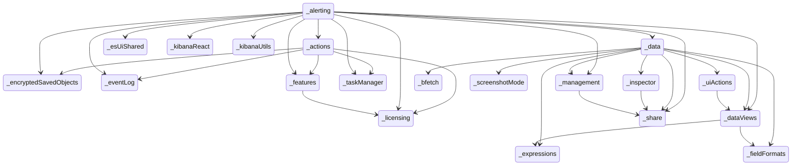


## apm

```mermaid
stateDiagram
direction TB
accTitle: apm dependencies
  _actions --> _encryptedSavedObjects
  _actions --> _eventLog
  _actions --> _features
  _actions --> _licensing
  _actions --> _taskManager
  _advancedSettings --> _management
  _alerting --> _actions
  _alerting --> _data
  _alerting --> _dataViews
  _alerting --> _encryptedSavedObjects
  _alerting --> _esUiShared
  _alerting --> _eventLog
  _alerting --> _features
  _alerting --> _kibanaReact
  _alerting --> _kibanaUtils
  _alerting --> _licensing
  _alerting --> _management
  _alerting --> _share
  _alerting --> _taskManager
  _apm --> _advancedSettings
  _apm --> _data
  _apm --> _dataViews
  _apm --> _embeddable
  _apm --> _exploratoryView
  _apm --> _features
  _apm --> _infra
  _apm --> _inspector
  _apm --> _lens
  _apm --> _licensing
  _apm --> _maps
  _apm --> _observability
  _apm --> _observabilityShared
  _apm --> _ruleRegistry
  _apm --> _share
  _apm --> _triggersActionsUi
  _apm --> _unifiedFieldList
  _apm --> _unifiedSearch
  _cases --> _actions
  _cases --> _data
  _cases --> _embeddable
  _cases --> _esUiShared
  _cases --> _features
  _cases --> _files
  _cases --> _kibanaReact
  _cases --> _kibanaUtils
  _cases --> _lens
  _cases --> _licensing
  _cases --> _management
  _cases --> _notifications
  _cases --> _ruleRegistry
  _cases --> _savedObjectsFinder
  _cases --> _savedObjectsManagement
  _cases --> _security
  _cases --> _triggersActionsUi
  _charts --> _expressions
  _controls --> _data
  _controls --> _dataViews
  _controls --> _embeddable
  _controls --> _expressions
  _controls --> _kibanaReact
  _controls --> _presentationUtil
  _controls --> _savedObjects
  _controls --> _uiActions
  _controls --> _unifiedSearch
  _dashboard --> _controls
  _dashboard --> _data
  _dashboard --> _dataViewEditor
  _dashboard --> _dataViews
  _dashboard --> _embeddable
  _dashboard --> _inspector
  _dashboard --> _navigation
  _dashboard --> _presentationUtil
  _dashboard --> _savedObjects
  _dashboard --> _savedObjectsFinder
  _dashboard --> _savedObjectsManagement
  _dashboard --> _screenshotMode
  _dashboard --> _share
  _dashboard --> _uiActions
  _dashboard --> _unifiedSearch
  _dashboard --> _urlForwarding
  _dashboard --> _visualizations
  _data --> _bfetch
  _data --> _dataViews
  _data --> _expressions
  _data --> _fieldFormats
  _data --> _inspector
  _data --> _management
  _data --> _screenshotMode
  _data --> _share
  _data --> _uiActions
  _dataViewEditor --> _data
  _dataViewEditor --> _dataViews
  _dataViewFieldEditor --> _data
  _dataViewFieldEditor --> _dataViews
  _dataViewFieldEditor --> _fieldFormats
  _dataViews --> _expressions
  _dataViews --> _fieldFormats
  _discover --> _charts
  _discover --> _data
  _discover --> _dataViewEditor
  _discover --> _dataViewFieldEditor
  _discover --> _dataViews
  _discover --> _embeddable
  _discover --> _expressions
  _discover --> _fieldFormats
  _discover --> _inspector
  _discover --> _navigation
  _discover --> _savedObjects
  _discover --> _savedObjectsFinder
  _discover --> _savedObjectsManagement
  _discover --> _uiActions
  _discover --> _unifiedFieldList
  _discover --> _unifiedHistogram
  _discover --> _unifiedSearch
  _discover --> _urlForwarding
  _embeddable --> _data
  _embeddable --> _inspector
  _embeddable --> _savedObjectsFinder
  _embeddable --> _savedObjectsManagement
  _embeddable --> _uiActions
  _eventAnnotation --> _data
  _eventAnnotation --> _expressions
  _exploratoryView --> _alerting
  _exploratoryView --> _cases
  _exploratoryView --> _charts
  _exploratoryView --> _data
  _exploratoryView --> _dataViews
  _exploratoryView --> _features
  _exploratoryView --> _files
  _exploratoryView --> _guidedOnboarding
  _exploratoryView --> _inspector
  _exploratoryView --> _lens
  _exploratoryView --> _observabilityShared
  _exploratoryView --> _security
  _exploratoryView --> _share
  _exploratoryView --> _triggersActionsUi
  _exploratoryView --> _unifiedSearch
  _expressionGauge --> _charts
  _expressionGauge --> _data
  _expressionGauge --> _expressions
  _expressionGauge --> _fieldFormats
  _expressionGauge --> _presentationUtil
  _expressionGauge --> _visualizations
  _expressionHeatmap --> _charts
  _expressionHeatmap --> _data
  _expressionHeatmap --> _expressions
  _expressionHeatmap --> _fieldFormats
  _expressionHeatmap --> _presentationUtil
  _expressionHeatmap --> _visualizations
  _expressionMetricVis --> _charts
  _expressionMetricVis --> _expressions
  _expressionMetricVis --> _fieldFormats
  _expressionMetricVis --> _presentationUtil
  _expressionMetricVis --> _visualizations
  _expressionXY --> _charts
  _expressionXY --> _data
  _expressionXY --> _eventAnnotation
  _expressionXY --> _expressions
  _expressionXY --> _fieldFormats
  _expressionXY --> _uiActions
  _expressionXY --> _visualizations
  _features --> _licensing
  _fileUpload --> _data
  _fileUpload --> _usageCollection
  _infra --> _alerting
  _infra --> _cases
  _infra --> _charts
  _infra --> _data
  _infra --> _dataViews
  _infra --> _discover
  _infra --> _embeddable
  _infra --> _features
  _infra --> _lens
  _infra --> _observability
  _infra --> _observabilityShared
  _infra --> _ruleRegistry
  _infra --> _security
  _infra --> _share
  _infra --> _triggersActionsUi
  _infra --> _unifiedSearch
  _infra --> _usageCollection
  _infra --> _visTypeTimeseries
  _inspector --> _share
  _lens --> _charts
  _lens --> _contentManagement
  _lens --> _dashboard
  _lens --> _data
  _lens --> _dataViewEditor
  _lens --> _dataViewFieldEditor
  _lens --> _dataViews
  _lens --> _embeddable
  _lens --> _eventAnnotation
  _lens --> _expressionGauge
  _lens --> _expressionHeatmap
  _lens --> _expressionMetricVis
  _lens --> _expressionXY
  _lens --> _expressions
  _lens --> _fieldFormats
  _lens --> _inspector
  _lens --> _navigation
  _lens --> _presentationUtil
  _lens --> _share
  _lens --> _uiActions
  _lens --> _uiActionsEnhanced
  _lens --> _unifiedFieldList
  _lens --> _unifiedSearch
  _lens --> _urlForwarding
  _lens --> _visualizations
  _management --> _share
  _maps --> _contentManagement
  _maps --> _controls
  _maps --> _dashboard
  _maps --> _data
  _maps --> _embeddable
  _maps --> _expressions
  _maps --> _features
  _maps --> _fieldFormats
  _maps --> _fileUpload
  _maps --> _inspector
  _maps --> _lens
  _maps --> _licensing
  _maps --> _mapsEms
  _maps --> _navigation
  _maps --> _presentationUtil
  _maps --> _savedObjects
  _maps --> _share
  _maps --> _uiActions
  _maps --> _unifiedSearch
  _maps --> _visualizations
  _navigation --> _unifiedSearch
  _notifications --> _actions
  _notifications --> _licensing
  _observability --> _alerting
  _observability --> _cases
  _observability --> _charts
  _observability --> _data
  _observability --> _dataViews
  _observability --> _embeddable
  _observability --> _exploratoryView
  _observability --> _features
  _observability --> _files
  _observability --> _guidedOnboarding
  _observability --> _inspector
  _observability --> _lens
  _observability --> _observabilityShared
  _observability --> _ruleRegistry
  _observability --> _security
  _observability --> _share
  _observability --> _triggersActionsUi
  _observability --> _unifiedSearch
  _observability --> _visualizations
  _observabilityShared --> _cases
  _observabilityShared --> _guidedOnboarding
  _presentationUtil --> _dataViews
  _presentationUtil --> _embeddable
  _presentationUtil --> _expressions
  _presentationUtil --> _kibanaReact
  _presentationUtil --> _savedObjects
  _presentationUtil --> _uiActions
  _ruleRegistry --> _alerting
  _ruleRegistry --> _data
  _ruleRegistry --> _triggersActionsUi
  _savedObjects --> _data
  _savedObjects --> _dataViews
  _savedObjectsManagement --> _data
  _savedObjectsManagement --> _dataViews
  _savedObjectsManagement --> _management
  _security --> _features
  _security --> _licensing
  _security --> _taskManager
  _triggersActionsUi --> _actions
  _triggersActionsUi --> _alerting
  _triggersActionsUi --> _charts
  _triggersActionsUi --> _data
  _triggersActionsUi --> _dataViewEditor
  _triggersActionsUi --> _dataViews
  _triggersActionsUi --> _kibanaReact
  _triggersActionsUi --> _kibanaUtils
  _triggersActionsUi --> _management
  _triggersActionsUi --> _savedObjects
  _triggersActionsUi --> _unifiedSearch
  _uiActions --> _dataViews
  _uiActionsEnhanced --> _embeddable
  _uiActionsEnhanced --> _uiActions
  _unifiedFieldList --> _charts
  _unifiedFieldList --> _data
  _unifiedFieldList --> _dataViews
  _unifiedFieldList --> _fieldFormats
  _unifiedFieldList --> _uiActions
  _unifiedSearch --> _data
  _unifiedSearch --> _dataViews
  _unifiedSearch --> _savedObjectsManagement
  _unifiedSearch --> _screenshotMode
  _unifiedSearch --> _uiActions
  _visTypeTimeseries --> _charts
  _visTypeTimeseries --> _data
  _visTypeTimeseries --> _dataViews
  _visTypeTimeseries --> _expressions
  _visTypeTimeseries --> _fieldFormats
  _visTypeTimeseries --> _inspector
  _visTypeTimeseries --> _unifiedSearch
  _visTypeTimeseries --> _usageCollection
  _visTypeTimeseries --> _visualizations
  _visualizations --> _charts
  _visualizations --> _contentManagement
  _visualizations --> _data
  _visualizations --> _dataViewEditor
  _visualizations --> _dataViews
  _visualizations --> _embeddable
  _visualizations --> _expressions
  _visualizations --> _fieldFormats
  _visualizations --> _inspector
  _visualizations --> _navigation
  _visualizations --> _presentationUtil
  _visualizations --> _savedObjects
  _visualizations --> _savedObjectsFinder
  _visualizations --> _savedObjectsManagement
  _visualizations --> _screenshotMode
  _visualizations --> _uiActions
  _visualizations --> _unifiedSearch
  _visualizations --> _urlForwarding
  _visualizations --> _usageCollection
```


## assetManager

```mermaid
stateDiagram
direction TB
accTitle: assetManager dependencies
```


## banners

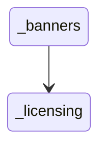


## bfetch

```mermaid
stateDiagram
direction TB
accTitle: bfetch dependencies
```


## canvas

```mermaid
stateDiagram
direction TB
accTitle: canvas dependencies
  _canvas --> _bfetch
  _canvas --> _charts
  _canvas --> _data
  _canvas --> _dataViews
  _canvas --> _embeddable
  _canvas --> _expressionError
  _canvas --> _expressionImage
  _canvas --> _expressionMetric
  _canvas --> _expressionRepeatImage
  _canvas --> _expressionRevealImage
  _canvas --> _expressionShape
  _canvas --> _expressions
  _canvas --> _features
  _canvas --> _inspector
  _canvas --> _presentationUtil
  _canvas --> _savedObjectsFinder
  _canvas --> _savedObjectsManagement
  _canvas --> _share
  _canvas --> _uiActions
  _canvas --> _visualizations
  _charts --> _expressions
  _data --> _bfetch
  _data --> _dataViews
  _data --> _expressions
  _data --> _fieldFormats
  _data --> _inspector
  _data --> _management
  _data --> _screenshotMode
  _data --> _share
  _data --> _uiActions
  _dataViewEditor --> _data
  _dataViewEditor --> _dataViews
  _dataViews --> _expressions
  _dataViews --> _fieldFormats
  _embeddable --> _data
  _embeddable --> _inspector
  _embeddable --> _savedObjectsFinder
  _embeddable --> _savedObjectsManagement
  _embeddable --> _uiActions
  _expressionError --> _expressions
  _expressionError --> _presentationUtil
  _expressionImage --> _expressions
  _expressionImage --> _presentationUtil
  _expressionMetric --> _expressions
  _expressionMetric --> _presentationUtil
  _expressionRepeatImage --> _expressions
  _expressionRepeatImage --> _presentationUtil
  _expressionRevealImage --> _expressions
  _expressionRevealImage --> _presentationUtil
  _expressionShape --> _expressions
  _expressionShape --> _presentationUtil
  _features --> _licensing
  _inspector --> _share
  _management --> _share
  _navigation --> _unifiedSearch
  _presentationUtil --> _dataViews
  _presentationUtil --> _embeddable
  _presentationUtil --> _expressions
  _presentationUtil --> _kibanaReact
  _presentationUtil --> _savedObjects
  _presentationUtil --> _uiActions
  _savedObjects --> _data
  _savedObjects --> _dataViews
  _savedObjectsManagement --> _data
  _savedObjectsManagement --> _dataViews
  _savedObjectsManagement --> _management
  _uiActions --> _dataViews
  _unifiedSearch --> _data
  _unifiedSearch --> _dataViews
  _unifiedSearch --> _savedObjectsManagement
  _unifiedSearch --> _screenshotMode
  _unifiedSearch --> _uiActions
  _visualizations --> _charts
  _visualizations --> _contentManagement
  _visualizations --> _data
  _visualizations --> _dataViewEditor
  _visualizations --> _dataViews
  _visualizations --> _embeddable
  _visualizations --> _expressions
  _visualizations --> _fieldFormats
  _visualizations --> _inspector
  _visualizations --> _navigation
  _visualizations --> _presentationUtil
  _visualizations --> _savedObjects
  _visualizations --> _savedObjectsFinder
  _visualizations --> _savedObjectsManagement
  _visualizations --> _screenshotMode
  _visualizations --> _uiActions
  _visualizations --> _unifiedSearch
  _visualizations --> _urlForwarding
  _visualizations --> _usageCollection
```


## cases

```mermaid
stateDiagram
direction TB
accTitle: cases dependencies
  _actions --> _encryptedSavedObjects
  _actions --> _eventLog
  _actions --> _features
  _actions --> _licensing
  _actions --> _taskManager
  _alerting --> _actions
  _alerting --> _data
  _alerting --> _dataViews
  _alerting --> _encryptedSavedObjects
  _alerting --> _esUiShared
  _alerting --> _eventLog
  _alerting --> _features
  _alerting --> _kibanaReact
  _alerting --> _kibanaUtils
  _alerting --> _licensing
  _alerting --> _management
  _alerting --> _share
  _alerting --> _taskManager
  _cases --> _actions
  _cases --> _data
  _cases --> _embeddable
  _cases --> _esUiShared
  _cases --> _features
  _cases --> _files
  _cases --> _kibanaReact
  _cases --> _kibanaUtils
  _cases --> _lens
  _cases --> _licensing
  _cases --> _management
  _cases --> _notifications
  _cases --> _ruleRegistry
  _cases --> _savedObjectsFinder
  _cases --> _savedObjectsManagement
  _cases --> _security
  _cases --> _triggersActionsUi
  _charts --> _expressions
  _controls --> _data
  _controls --> _dataViews
  _controls --> _embeddable
  _controls --> _expressions
  _controls --> _kibanaReact
  _controls --> _presentationUtil
  _controls --> _savedObjects
  _controls --> _uiActions
  _controls --> _unifiedSearch
  _dashboard --> _controls
  _dashboard --> _data
  _dashboard --> _dataViewEditor
  _dashboard --> _dataViews
  _dashboard --> _embeddable
  _dashboard --> _inspector
  _dashboard --> _navigation
  _dashboard --> _presentationUtil
  _dashboard --> _savedObjects
  _dashboard --> _savedObjectsFinder
  _dashboard --> _savedObjectsManagement
  _dashboard --> _screenshotMode
  _dashboard --> _share
  _dashboard --> _uiActions
  _dashboard --> _unifiedSearch
  _dashboard --> _urlForwarding
  _dashboard --> _visualizations
  _data --> _bfetch
  _data --> _dataViews
  _data --> _expressions
  _data --> _fieldFormats
  _data --> _inspector
  _data --> _management
  _data --> _screenshotMode
  _data --> _share
  _data --> _uiActions
  _dataViewEditor --> _data
  _dataViewEditor --> _dataViews
  _dataViewFieldEditor --> _data
  _dataViewFieldEditor --> _dataViews
  _dataViewFieldEditor --> _fieldFormats
  _dataViews --> _expressions
  _dataViews --> _fieldFormats
  _embeddable --> _data
  _embeddable --> _inspector
  _embeddable --> _savedObjectsFinder
  _embeddable --> _savedObjectsManagement
  _embeddable --> _uiActions
  _eventAnnotation --> _data
  _eventAnnotation --> _expressions
  _expressionGauge --> _charts
  _expressionGauge --> _data
  _expressionGauge --> _expressions
  _expressionGauge --> _fieldFormats
  _expressionGauge --> _presentationUtil
  _expressionGauge --> _visualizations
  _expressionHeatmap --> _charts
  _expressionHeatmap --> _data
  _expressionHeatmap --> _expressions
  _expressionHeatmap --> _fieldFormats
  _expressionHeatmap --> _presentationUtil
  _expressionHeatmap --> _visualizations
  _expressionMetricVis --> _charts
  _expressionMetricVis --> _expressions
  _expressionMetricVis --> _fieldFormats
  _expressionMetricVis --> _presentationUtil
  _expressionMetricVis --> _visualizations
  _expressionXY --> _charts
  _expressionXY --> _data
  _expressionXY --> _eventAnnotation
  _expressionXY --> _expressions
  _expressionXY --> _fieldFormats
  _expressionXY --> _uiActions
  _expressionXY --> _visualizations
  _features --> _licensing
  _inspector --> _share
  _lens --> _charts
  _lens --> _contentManagement
  _lens --> _dashboard
  _lens --> _data
  _lens --> _dataViewEditor
  _lens --> _dataViewFieldEditor
  _lens --> _dataViews
  _lens --> _embeddable
  _lens --> _eventAnnotation
  _lens --> _expressionGauge
  _lens --> _expressionHeatmap
  _lens --> _expressionMetricVis
  _lens --> _expressionXY
  _lens --> _expressions
  _lens --> _fieldFormats
  _lens --> _inspector
  _lens --> _navigation
  _lens --> _presentationUtil
  _lens --> _share
  _lens --> _uiActions
  _lens --> _uiActionsEnhanced
  _lens --> _unifiedFieldList
  _lens --> _unifiedSearch
  _lens --> _urlForwarding
  _lens --> _visualizations
  _management --> _share
  _navigation --> _unifiedSearch
  _notifications --> _actions
  _notifications --> _licensing
  _presentationUtil --> _dataViews
  _presentationUtil --> _embeddable
  _presentationUtil --> _expressions
  _presentationUtil --> _kibanaReact
  _presentationUtil --> _savedObjects
  _presentationUtil --> _uiActions
  _ruleRegistry --> _alerting
  _ruleRegistry --> _data
  _ruleRegistry --> _triggersActionsUi
  _savedObjects --> _data
  _savedObjects --> _dataViews
  _savedObjectsManagement --> _data
  _savedObjectsManagement --> _dataViews
  _savedObjectsManagement --> _management
  _security --> _features
  _security --> _licensing
  _security --> _taskManager
  _triggersActionsUi --> _actions
  _triggersActionsUi --> _alerting
  _triggersActionsUi --> _charts
  _triggersActionsUi --> _data
  _triggersActionsUi --> _dataViewEditor
  _triggersActionsUi --> _dataViews
  _triggersActionsUi --> _kibanaReact
  _triggersActionsUi --> _kibanaUtils
  _triggersActionsUi --> _management
  _triggersActionsUi --> _savedObjects
  _triggersActionsUi --> _unifiedSearch
  _uiActions --> _dataViews
  _uiActionsEnhanced --> _embeddable
  _uiActionsEnhanced --> _uiActions
  _unifiedFieldList --> _charts
  _unifiedFieldList --> _data
  _unifiedFieldList --> _dataViews
  _unifiedFieldList --> _fieldFormats
  _unifiedFieldList --> _uiActions
  _unifiedSearch --> _data
  _unifiedSearch --> _dataViews
  _unifiedSearch --> _savedObjectsManagement
  _unifiedSearch --> _screenshotMode
  _unifiedSearch --> _uiActions
  _visualizations --> _charts
  _visualizations --> _contentManagement
  _visualizations --> _data
  _visualizations --> _dataViewEditor
  _visualizations --> _dataViews
  _visualizations --> _embeddable
  _visualizations --> _expressions
  _visualizations --> _fieldFormats
  _visualizations --> _inspector
  _visualizations --> _navigation
  _visualizations --> _presentationUtil
  _visualizations --> _savedObjects
  _visualizations --> _savedObjectsFinder
  _visualizations --> _savedObjectsManagement
  _visualizations --> _screenshotMode
  _visualizations --> _uiActions
  _visualizations --> _unifiedSearch
  _visualizations --> _urlForwarding
  _visualizations --> _usageCollection
```


## charts

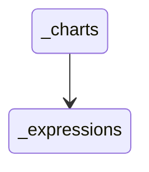


## cloud

```mermaid
stateDiagram
direction TB
accTitle: cloud dependencies
```


## cloudChat

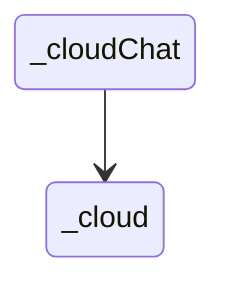


## cloudDataMigration

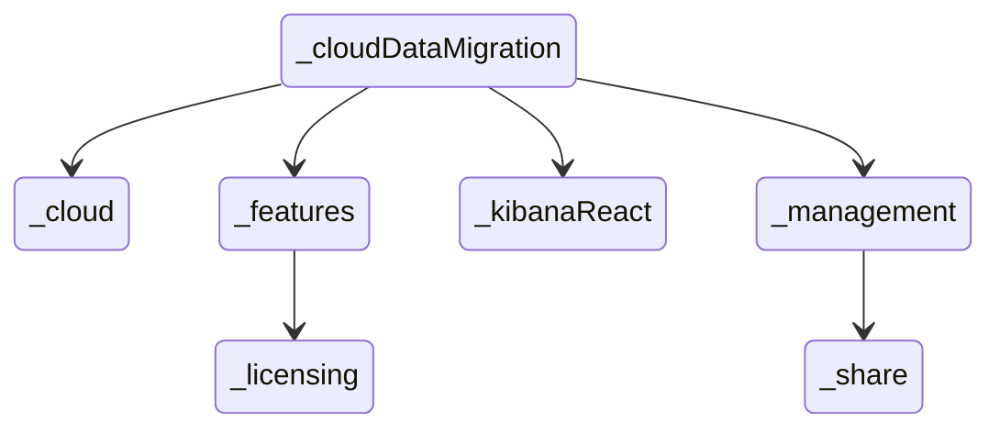


## cloudDefend

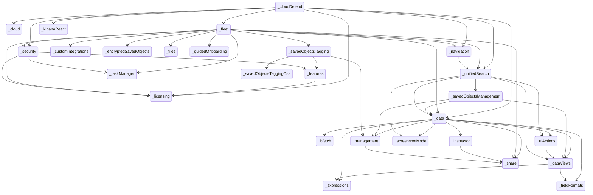


## cloudExperiments

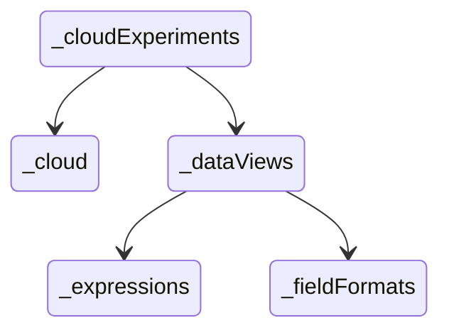


## cloudFullStory

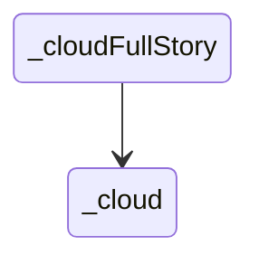


## cloudGainsight

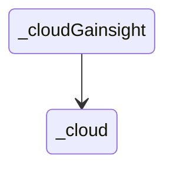


## cloudLinks

```mermaid
stateDiagram
direction TB
accTitle: cloudLinks dependencies
```


## cloudSecurityPosture

```mermaid
stateDiagram
direction TB
accTitle: cloudSecurityPosture dependencies
  _charts --> _expressions
  _cloudSecurityPosture --> _charts
  _cloudSecurityPosture --> _cloud
  _cloudSecurityPosture --> _data
  _cloudSecurityPosture --> _discover
  _cloudSecurityPosture --> _fleet
  _cloudSecurityPosture --> _licensing
  _cloudSecurityPosture --> _navigation
  _cloudSecurityPosture --> _security
  _cloudSecurityPosture --> _taskManager
  _cloudSecurityPosture --> _unifiedSearch
  _data --> _bfetch
  _data --> _dataViews
  _data --> _expressions
  _data --> _fieldFormats
  _data --> _inspector
  _data --> _management
  _data --> _screenshotMode
  _data --> _share
  _data --> _uiActions
  _dataViewEditor --> _data
  _dataViewEditor --> _dataViews
  _dataViewFieldEditor --> _data
  _dataViewFieldEditor --> _dataViews
  _dataViewFieldEditor --> _fieldFormats
  _dataViews --> _expressions
  _dataViews --> _fieldFormats
  _discover --> _charts
  _discover --> _data
  _discover --> _dataViewEditor
  _discover --> _dataViewFieldEditor
  _discover --> _dataViews
  _discover --> _embeddable
  _discover --> _expressions
  _discover --> _fieldFormats
  _discover --> _inspector
  _discover --> _navigation
  _discover --> _savedObjects
  _discover --> _savedObjectsFinder
  _discover --> _savedObjectsManagement
  _discover --> _uiActions
  _discover --> _unifiedFieldList
  _discover --> _unifiedHistogram
  _discover --> _unifiedSearch
  _discover --> _urlForwarding
  _embeddable --> _data
  _embeddable --> _inspector
  _embeddable --> _savedObjectsFinder
  _embeddable --> _savedObjectsManagement
  _embeddable --> _uiActions
  _features --> _licensing
  _fleet --> _customIntegrations
  _fleet --> _data
  _fleet --> _encryptedSavedObjects
  _fleet --> _files
  _fleet --> _guidedOnboarding
  _fleet --> _licensing
  _fleet --> _navigation
  _fleet --> _savedObjectsTagging
  _fleet --> _security
  _fleet --> _share
  _fleet --> _taskManager
  _fleet --> _unifiedSearch
  _inspector --> _share
  _management --> _share
  _navigation --> _unifiedSearch
  _savedObjects --> _data
  _savedObjects --> _dataViews
  _savedObjectsManagement --> _data
  _savedObjectsManagement --> _dataViews
  _savedObjectsManagement --> _management
  _savedObjectsTagging --> _features
  _savedObjectsTagging --> _management
  _savedObjectsTagging --> _savedObjectsTaggingOss
  _security --> _features
  _security --> _licensing
  _security --> _taskManager
  _uiActions --> _dataViews
  _unifiedFieldList --> _charts
  _unifiedFieldList --> _data
  _unifiedFieldList --> _dataViews
  _unifiedFieldList --> _fieldFormats
  _unifiedFieldList --> _uiActions
  _unifiedSearch --> _data
  _unifiedSearch --> _dataViews
  _unifiedSearch --> _savedObjectsManagement
  _unifiedSearch --> _screenshotMode
  _unifiedSearch --> _uiActions
```


## console

```mermaid
stateDiagram
direction TB
accTitle: console dependencies
  _console --> _devTools
  _console --> _share
  _devTools --> _urlForwarding
```


## contentManagement

```mermaid
stateDiagram
direction TB
accTitle: contentManagement dependencies
```


## controls

```mermaid
stateDiagram
direction TB
accTitle: controls dependencies
  _controls --> _data
  _controls --> _dataViews
  _controls --> _embeddable
  _controls --> _expressions
  _controls --> _kibanaReact
  _controls --> _presentationUtil
  _controls --> _savedObjects
  _controls --> _uiActions
  _controls --> _unifiedSearch
  _data --> _bfetch
  _data --> _dataViews
  _data --> _expressions
  _data --> _fieldFormats
  _data --> _inspector
  _data --> _management
  _data --> _screenshotMode
  _data --> _share
  _data --> _uiActions
  _dataViews --> _expressions
  _dataViews --> _fieldFormats
  _embeddable --> _data
  _embeddable --> _inspector
  _embeddable --> _savedObjectsFinder
  _embeddable --> _savedObjectsManagement
  _embeddable --> _uiActions
  _inspector --> _share
  _management --> _share
  _presentationUtil --> _dataViews
  _presentationUtil --> _embeddable
  _presentationUtil --> _expressions
  _presentationUtil --> _kibanaReact
  _presentationUtil --> _savedObjects
  _presentationUtil --> _uiActions
  _savedObjects --> _data
  _savedObjects --> _dataViews
  _savedObjectsManagement --> _data
  _savedObjectsManagement --> _dataViews
  _savedObjectsManagement --> _management
  _uiActions --> _dataViews
  _unifiedSearch --> _data
  _unifiedSearch --> _dataViews
  _unifiedSearch --> _savedObjectsManagement
  _unifiedSearch --> _screenshotMode
  _unifiedSearch --> _uiActions
```


## crossClusterReplication

```mermaid
stateDiagram
direction TB
accTitle: crossClusterReplication dependencies
  _crossClusterReplication --> _features
  _crossClusterReplication --> _home
  _crossClusterReplication --> _indexManagement
  _crossClusterReplication --> _licenseApiGuard
  _crossClusterReplication --> _licensing
  _crossClusterReplication --> _management
  _crossClusterReplication --> _remoteClusters
  _dataViews --> _expressions
  _dataViews --> _fieldFormats
  _features --> _licensing
  _home --> _dataViews
  _home --> _share
  _home --> _urlForwarding
  _indexManagement --> _features
  _indexManagement --> _home
  _indexManagement --> _management
  _indexManagement --> _share
  _management --> _share
  _remoteClusters --> _features
  _remoteClusters --> _indexManagement
  _remoteClusters --> _licensing
  _remoteClusters --> _management
  _remoteClusters --> _share
```


## customBranding

```mermaid
stateDiagram
direction TB
accTitle: customBranding dependencies
  _customBranding --> _licenseApiGuard
  _customBranding --> _licensing
```


## customIntegrations

```mermaid
stateDiagram
direction TB
accTitle: customIntegrations dependencies
```


## dashboard

```mermaid
stateDiagram
direction TB
accTitle: dashboard dependencies
  _charts --> _expressions
  _controls --> _data
  _controls --> _dataViews
  _controls --> _embeddable
  _controls --> _expressions
  _controls --> _kibanaReact
  _controls --> _presentationUtil
  _controls --> _savedObjects
  _controls --> _uiActions
  _controls --> _unifiedSearch
  _dashboard --> _controls
  _dashboard --> _data
  _dashboard --> _dataViewEditor
  _dashboard --> _dataViews
  _dashboard --> _embeddable
  _dashboard --> _inspector
  _dashboard --> _navigation
  _dashboard --> _presentationUtil
  _dashboard --> _savedObjects
  _dashboard --> _savedObjectsFinder
  _dashboard --> _savedObjectsManagement
  _dashboard --> _screenshotMode
  _dashboard --> _share
  _dashboard --> _uiActions
  _dashboard --> _unifiedSearch
  _dashboard --> _urlForwarding
  _dashboard --> _visualizations
  _data --> _bfetch
  _data --> _dataViews
  _data --> _expressions
  _data --> _fieldFormats
  _data --> _inspector
  _data --> _management
  _data --> _screenshotMode
  _data --> _share
  _data --> _uiActions
  _dataViewEditor --> _data
  _dataViewEditor --> _dataViews
  _dataViews --> _expressions
  _dataViews --> _fieldFormats
  _embeddable --> _data
  _embeddable --> _inspector
  _embeddable --> _savedObjectsFinder
  _embeddable --> _savedObjectsManagement
  _embeddable --> _uiActions
  _inspector --> _share
  _management --> _share
  _navigation --> _unifiedSearch
  _presentationUtil --> _dataViews
  _presentationUtil --> _embeddable
  _presentationUtil --> _expressions
  _presentationUtil --> _kibanaReact
  _presentationUtil --> _savedObjects
  _presentationUtil --> _uiActions
  _savedObjects --> _data
  _savedObjects --> _dataViews
  _savedObjectsManagement --> _data
  _savedObjectsManagement --> _dataViews
  _savedObjectsManagement --> _management
  _uiActions --> _dataViews
  _unifiedSearch --> _data
  _unifiedSearch --> _dataViews
  _unifiedSearch --> _savedObjectsManagement
  _unifiedSearch --> _screenshotMode
  _unifiedSearch --> _uiActions
  _visualizations --> _charts
  _visualizations --> _contentManagement
  _visualizations --> _data
  _visualizations --> _dataViewEditor
  _visualizations --> _dataViews
  _visualizations --> _embeddable
  _visualizations --> _expressions
  _visualizations --> _fieldFormats
  _visualizations --> _inspector
  _visualizations --> _navigation
  _visualizations --> _presentationUtil
  _visualizations --> _savedObjects
  _visualizations --> _savedObjectsFinder
  _visualizations --> _savedObjectsManagement
  _visualizations --> _screenshotMode
  _visualizations --> _uiActions
  _visualizations --> _unifiedSearch
  _visualizations --> _urlForwarding
  _visualizations --> _usageCollection
```


## dashboardEnhanced

```mermaid
stateDiagram
direction TB
accTitle: dashboardEnhanced dependencies
  _charts --> _expressions
  _controls --> _data
  _controls --> _dataViews
  _controls --> _embeddable
  _controls --> _expressions
  _controls --> _kibanaReact
  _controls --> _presentationUtil
  _controls --> _savedObjects
  _controls --> _uiActions
  _controls --> _unifiedSearch
  _dashboard --> _controls
  _dashboard --> _data
  _dashboard --> _dataViewEditor
  _dashboard --> _dataViews
  _dashboard --> _embeddable
  _dashboard --> _inspector
  _dashboard --> _navigation
  _dashboard --> _presentationUtil
  _dashboard --> _savedObjects
  _dashboard --> _savedObjectsFinder
  _dashboard --> _savedObjectsManagement
  _dashboard --> _screenshotMode
  _dashboard --> _share
  _dashboard --> _uiActions
  _dashboard --> _unifiedSearch
  _dashboard --> _urlForwarding
  _dashboard --> _visualizations
  _dashboardEnhanced --> _dashboard
  _dashboardEnhanced --> _data
  _dashboardEnhanced --> _embeddable
  _dashboardEnhanced --> _share
  _dashboardEnhanced --> _uiActionsEnhanced
  _dashboardEnhanced --> _unifiedSearch
  _data --> _bfetch
  _data --> _dataViews
  _data --> _expressions
  _data --> _fieldFormats
  _data --> _inspector
  _data --> _management
  _data --> _screenshotMode
  _data --> _share
  _data --> _uiActions
  _dataViewEditor --> _data
  _dataViewEditor --> _dataViews
  _dataViews --> _expressions
  _dataViews --> _fieldFormats
  _embeddable --> _data
  _embeddable --> _inspector
  _embeddable --> _savedObjectsFinder
  _embeddable --> _savedObjectsManagement
  _embeddable --> _uiActions
  _inspector --> _share
  _management --> _share
  _navigation --> _unifiedSearch
  _presentationUtil --> _dataViews
  _presentationUtil --> _embeddable
  _presentationUtil --> _expressions
  _presentationUtil --> _kibanaReact
  _presentationUtil --> _savedObjects
  _presentationUtil --> _uiActions
  _savedObjects --> _data
  _savedObjects --> _dataViews
  _savedObjectsManagement --> _data
  _savedObjectsManagement --> _dataViews
  _savedObjectsManagement --> _management
  _uiActions --> _dataViews
  _uiActionsEnhanced --> _embeddable
  _uiActionsEnhanced --> _uiActions
  _unifiedSearch --> _data
  _unifiedSearch --> _dataViews
  _unifiedSearch --> _savedObjectsManagement
  _unifiedSearch --> _screenshotMode
  _unifiedSearch --> _uiActions
  _visualizations --> _charts
  _visualizations --> _contentManagement
  _visualizations --> _data
  _visualizations --> _dataViewEditor
  _visualizations --> _dataViews
  _visualizations --> _embeddable
  _visualizations --> _expressions
  _visualizations --> _fieldFormats
  _visualizations --> _inspector
  _visualizations --> _navigation
  _visualizations --> _presentationUtil
  _visualizations --> _savedObjects
  _visualizations --> _savedObjectsFinder
  _visualizations --> _savedObjectsManagement
  _visualizations --> _screenshotMode
  _visualizations --> _uiActions
  _visualizations --> _unifiedSearch
  _visualizations --> _urlForwarding
  _visualizations --> _usageCollection
```


## data

```mermaid
stateDiagram
direction TB
accTitle: data dependencies
  _data --> _bfetch
  _data --> _dataViews
  _data --> _expressions
  _data --> _fieldFormats
  _data --> _inspector
  _data --> _management
  _data --> _screenshotMode
  _data --> _share
  _data --> _uiActions
  _dataViews --> _expressions
  _dataViews --> _fieldFormats
  _inspector --> _share
  _management --> _share
  _uiActions --> _dataViews
```


## dataViewEditor

```mermaid
stateDiagram
direction TB
accTitle: dataViewEditor dependencies
  _data --> _bfetch
  _data --> _dataViews
  _data --> _expressions
  _data --> _fieldFormats
  _data --> _inspector
  _data --> _management
  _data --> _screenshotMode
  _data --> _share
  _data --> _uiActions
  _dataViewEditor --> _data
  _dataViewEditor --> _dataViews
  _dataViews --> _expressions
  _dataViews --> _fieldFormats
  _inspector --> _share
  _management --> _share
  _uiActions --> _dataViews
```


## dataViewFieldEditor

```mermaid
stateDiagram
direction TB
accTitle: dataViewFieldEditor dependencies
  _data --> _bfetch
  _data --> _dataViews
  _data --> _expressions
  _data --> _fieldFormats
  _data --> _inspector
  _data --> _management
  _data --> _screenshotMode
  _data --> _share
  _data --> _uiActions
  _dataViewFieldEditor --> _data
  _dataViewFieldEditor --> _dataViews
  _dataViewFieldEditor --> _fieldFormats
  _dataViews --> _expressions
  _dataViews --> _fieldFormats
  _inspector --> _share
  _management --> _share
  _uiActions --> _dataViews
```


## dataViewManagement

```mermaid
stateDiagram
direction TB
accTitle: dataViewManagement dependencies
  _data --> _bfetch
  _data --> _dataViews
  _data --> _expressions
  _data --> _fieldFormats
  _data --> _inspector
  _data --> _management
  _data --> _screenshotMode
  _data --> _share
  _data --> _uiActions
  _dataViewEditor --> _data
  _dataViewEditor --> _dataViews
  _dataViewFieldEditor --> _data
  _dataViewFieldEditor --> _dataViews
  _dataViewFieldEditor --> _fieldFormats
  _dataViewManagement --> _data
  _dataViewManagement --> _dataViewEditor
  _dataViewManagement --> _dataViewFieldEditor
  _dataViewManagement --> _dataViews
  _dataViewManagement --> _fieldFormats
  _dataViewManagement --> _management
  _dataViewManagement --> _savedObjectsManagement
  _dataViewManagement --> _unifiedSearch
  _dataViewManagement --> _urlForwarding
  _dataViews --> _expressions
  _dataViews --> _fieldFormats
  _inspector --> _share
  _management --> _share
  _savedObjectsManagement --> _data
  _savedObjectsManagement --> _dataViews
  _savedObjectsManagement --> _management
  _uiActions --> _dataViews
  _unifiedSearch --> _data
  _unifiedSearch --> _dataViews
  _unifiedSearch --> _savedObjectsManagement
  _unifiedSearch --> _screenshotMode
  _unifiedSearch --> _uiActions
```


## dataViews

```mermaid
stateDiagram
direction TB
accTitle: dataViews dependencies
  _dataViews --> _expressions
  _dataViews --> _fieldFormats
```


## dataVisualizer

```mermaid
stateDiagram
direction TB
accTitle: dataVisualizer dependencies
  _charts --> _expressions
  _data --> _bfetch
  _data --> _dataViews
  _data --> _expressions
  _data --> _fieldFormats
  _data --> _inspector
  _data --> _management
  _data --> _screenshotMode
  _data --> _share
  _data --> _uiActions
  _dataViewEditor --> _data
  _dataViewEditor --> _dataViews
  _dataViewFieldEditor --> _data
  _dataViewFieldEditor --> _dataViews
  _dataViewFieldEditor --> _fieldFormats
  _dataViews --> _expressions
  _dataViews --> _fieldFormats
  _dataVisualizer --> _charts
  _dataVisualizer --> _data
  _dataVisualizer --> _discover
  _dataVisualizer --> _embeddable
  _dataVisualizer --> _fileUpload
  _dataVisualizer --> _share
  _dataVisualizer --> _uiActions
  _dataVisualizer --> _unifiedSearch
  _dataVisualizer --> _usageCollection
  _discover --> _charts
  _discover --> _data
  _discover --> _dataViewEditor
  _discover --> _dataViewFieldEditor
  _discover --> _dataViews
  _discover --> _embeddable
  _discover --> _expressions
  _discover --> _fieldFormats
  _discover --> _inspector
  _discover --> _navigation
  _discover --> _savedObjects
  _discover --> _savedObjectsFinder
  _discover --> _savedObjectsManagement
  _discover --> _uiActions
  _discover --> _unifiedFieldList
  _discover --> _unifiedHistogram
  _discover --> _unifiedSearch
  _discover --> _urlForwarding
  _embeddable --> _data
  _embeddable --> _inspector
  _embeddable --> _savedObjectsFinder
  _embeddable --> _savedObjectsManagement
  _embeddable --> _uiActions
  _fileUpload --> _data
  _fileUpload --> _usageCollection
  _inspector --> _share
  _management --> _share
  _navigation --> _unifiedSearch
  _savedObjects --> _data
  _savedObjects --> _dataViews
  _savedObjectsManagement --> _data
  _savedObjectsManagement --> _dataViews
  _savedObjectsManagement --> _management
  _uiActions --> _dataViews
  _unifiedFieldList --> _charts
  _unifiedFieldList --> _data
  _unifiedFieldList --> _dataViews
  _unifiedFieldList --> _fieldFormats
  _unifiedFieldList --> _uiActions
  _unifiedSearch --> _data
  _unifiedSearch --> _dataViews
  _unifiedSearch --> _savedObjectsManagement
  _unifiedSearch --> _screenshotMode
  _unifiedSearch --> _uiActions
```


## devTools

```mermaid
stateDiagram
direction TB
accTitle: devTools dependencies
  _devTools --> _urlForwarding
```


## discover

```mermaid
stateDiagram
direction TB
accTitle: discover dependencies
  _charts --> _expressions
  _data --> _bfetch
  _data --> _dataViews
  _data --> _expressions
  _data --> _fieldFormats
  _data --> _inspector
  _data --> _management
  _data --> _screenshotMode
  _data --> _share
  _data --> _uiActions
  _dataViewEditor --> _data
  _dataViewEditor --> _dataViews
  _dataViewFieldEditor --> _data
  _dataViewFieldEditor --> _dataViews
  _dataViewFieldEditor --> _fieldFormats
  _dataViews --> _expressions
  _dataViews --> _fieldFormats
  _discover --> _charts
  _discover --> _data
  _discover --> _dataViewEditor
  _discover --> _dataViewFieldEditor
  _discover --> _dataViews
  _discover --> _embeddable
  _discover --> _expressions
  _discover --> _fieldFormats
  _discover --> _inspector
  _discover --> _navigation
  _discover --> _savedObjects
  _discover --> _savedObjectsFinder
  _discover --> _savedObjectsManagement
  _discover --> _uiActions
  _discover --> _unifiedFieldList
  _discover --> _unifiedHistogram
  _discover --> _unifiedSearch
  _discover --> _urlForwarding
  _embeddable --> _data
  _embeddable --> _inspector
  _embeddable --> _savedObjectsFinder
  _embeddable --> _savedObjectsManagement
  _embeddable --> _uiActions
  _inspector --> _share
  _management --> _share
  _navigation --> _unifiedSearch
  _savedObjects --> _data
  _savedObjects --> _dataViews
  _savedObjectsManagement --> _data
  _savedObjectsManagement --> _dataViews
  _savedObjectsManagement --> _management
  _uiActions --> _dataViews
  _unifiedFieldList --> _charts
  _unifiedFieldList --> _data
  _unifiedFieldList --> _dataViews
  _unifiedFieldList --> _fieldFormats
  _unifiedFieldList --> _uiActions
  _unifiedSearch --> _data
  _unifiedSearch --> _dataViews
  _unifiedSearch --> _savedObjectsManagement
  _unifiedSearch --> _screenshotMode
  _unifiedSearch --> _uiActions
```


## discoverEnhanced

```mermaid
stateDiagram
direction TB
accTitle: discoverEnhanced dependencies
  _charts --> _expressions
  _data --> _bfetch
  _data --> _dataViews
  _data --> _expressions
  _data --> _fieldFormats
  _data --> _inspector
  _data --> _management
  _data --> _screenshotMode
  _data --> _share
  _data --> _uiActions
  _dataViewEditor --> _data
  _dataViewEditor --> _dataViews
  _dataViewFieldEditor --> _data
  _dataViewFieldEditor --> _dataViews
  _dataViewFieldEditor --> _fieldFormats
  _dataViews --> _expressions
  _dataViews --> _fieldFormats
  _discover --> _charts
  _discover --> _data
  _discover --> _dataViewEditor
  _discover --> _dataViewFieldEditor
  _discover --> _dataViews
  _discover --> _embeddable
  _discover --> _expressions
  _discover --> _fieldFormats
  _discover --> _inspector
  _discover --> _navigation
  _discover --> _savedObjects
  _discover --> _savedObjectsFinder
  _discover --> _savedObjectsManagement
  _discover --> _uiActions
  _discover --> _unifiedFieldList
  _discover --> _unifiedHistogram
  _discover --> _unifiedSearch
  _discover --> _urlForwarding
  _discoverEnhanced --> _discover
  _discoverEnhanced --> _embeddable
  _discoverEnhanced --> _uiActions
  _embeddable --> _data
  _embeddable --> _inspector
  _embeddable --> _savedObjectsFinder
  _embeddable --> _savedObjectsManagement
  _embeddable --> _uiActions
  _inspector --> _share
  _management --> _share
  _navigation --> _unifiedSearch
  _savedObjects --> _data
  _savedObjects --> _dataViews
  _savedObjectsManagement --> _data
  _savedObjectsManagement --> _dataViews
  _savedObjectsManagement --> _management
  _uiActions --> _dataViews
  _unifiedFieldList --> _charts
  _unifiedFieldList --> _data
  _unifiedFieldList --> _dataViews
  _unifiedFieldList --> _fieldFormats
  _unifiedFieldList --> _uiActions
  _unifiedSearch --> _data
  _unifiedSearch --> _dataViews
  _unifiedSearch --> _savedObjectsManagement
  _unifiedSearch --> _screenshotMode
  _unifiedSearch --> _uiActions
```


## ecsDataQualityDashboard

```mermaid
stateDiagram
direction TB
accTitle: ecsDataQualityDashboard dependencies
  _data --> _bfetch
  _data --> _dataViews
  _data --> _expressions
  _data --> _fieldFormats
  _data --> _inspector
  _data --> _management
  _data --> _screenshotMode
  _data --> _share
  _data --> _uiActions
  _dataViews --> _expressions
  _dataViews --> _fieldFormats
  _ecsDataQualityDashboard --> _data
  _inspector --> _share
  _management --> _share
  _uiActions --> _dataViews
```


## embeddable

```mermaid
stateDiagram
direction TB
accTitle: embeddable dependencies
  _data --> _bfetch
  _data --> _dataViews
  _data --> _expressions
  _data --> _fieldFormats
  _data --> _inspector
  _data --> _management
  _data --> _screenshotMode
  _data --> _share
  _data --> _uiActions
  _dataViews --> _expressions
  _dataViews --> _fieldFormats
  _embeddable --> _data
  _embeddable --> _inspector
  _embeddable --> _savedObjectsFinder
  _embeddable --> _savedObjectsManagement
  _embeddable --> _uiActions
  _inspector --> _share
  _management --> _share
  _savedObjectsManagement --> _data
  _savedObjectsManagement --> _dataViews
  _savedObjectsManagement --> _management
  _uiActions --> _dataViews
```


## embeddableEnhanced

```mermaid
stateDiagram
direction TB
accTitle: embeddableEnhanced dependencies
  _data --> _bfetch
  _data --> _dataViews
  _data --> _expressions
  _data --> _fieldFormats
  _data --> _inspector
  _data --> _management
  _data --> _screenshotMode
  _data --> _share
  _data --> _uiActions
  _dataViews --> _expressions
  _dataViews --> _fieldFormats
  _embeddable --> _data
  _embeddable --> _inspector
  _embeddable --> _savedObjectsFinder
  _embeddable --> _savedObjectsManagement
  _embeddable --> _uiActions
  _embeddableEnhanced --> _embeddable
  _embeddableEnhanced --> _kibanaReact
  _embeddableEnhanced --> _uiActions
  _embeddableEnhanced --> _uiActionsEnhanced
  _inspector --> _share
  _management --> _share
  _savedObjectsManagement --> _data
  _savedObjectsManagement --> _dataViews
  _savedObjectsManagement --> _management
  _uiActions --> _dataViews
  _uiActionsEnhanced --> _embeddable
  _uiActionsEnhanced --> _uiActions
```


## encryptedSavedObjects

```mermaid
stateDiagram
direction TB
accTitle: encryptedSavedObjects dependencies
```


## enterpriseSearch

```mermaid
stateDiagram
direction TB
accTitle: enterpriseSearch dependencies
  _actions --> _encryptedSavedObjects
  _actions --> _eventLog
  _actions --> _features
  _actions --> _licensing
  _actions --> _taskManager
  _alerting --> _actions
  _alerting --> _data
  _alerting --> _dataViews
  _alerting --> _encryptedSavedObjects
  _alerting --> _esUiShared
  _alerting --> _eventLog
  _alerting --> _features
  _alerting --> _kibanaReact
  _alerting --> _kibanaUtils
  _alerting --> _licensing
  _alerting --> _management
  _alerting --> _share
  _alerting --> _taskManager
  _cases --> _actions
  _cases --> _data
  _cases --> _embeddable
  _cases --> _esUiShared
  _cases --> _features
  _cases --> _files
  _cases --> _kibanaReact
  _cases --> _kibanaUtils
  _cases --> _lens
  _cases --> _licensing
  _cases --> _management
  _cases --> _notifications
  _cases --> _ruleRegistry
  _cases --> _savedObjectsFinder
  _cases --> _savedObjectsManagement
  _cases --> _security
  _cases --> _triggersActionsUi
  _charts --> _expressions
  _controls --> _data
  _controls --> _dataViews
  _controls --> _embeddable
  _controls --> _expressions
  _controls --> _kibanaReact
  _controls --> _presentationUtil
  _controls --> _savedObjects
  _controls --> _uiActions
  _controls --> _unifiedSearch
  _dashboard --> _controls
  _dashboard --> _data
  _dashboard --> _dataViewEditor
  _dashboard --> _dataViews
  _dashboard --> _embeddable
  _dashboard --> _inspector
  _dashboard --> _navigation
  _dashboard --> _presentationUtil
  _dashboard --> _savedObjects
  _dashboard --> _savedObjectsFinder
  _dashboard --> _savedObjectsManagement
  _dashboard --> _screenshotMode
  _dashboard --> _share
  _dashboard --> _uiActions
  _dashboard --> _unifiedSearch
  _dashboard --> _urlForwarding
  _dashboard --> _visualizations
  _data --> _bfetch
  _data --> _dataViews
  _data --> _expressions
  _data --> _fieldFormats
  _data --> _inspector
  _data --> _management
  _data --> _screenshotMode
  _data --> _share
  _data --> _uiActions
  _dataViewEditor --> _data
  _dataViewEditor --> _dataViews
  _dataViewFieldEditor --> _data
  _dataViewFieldEditor --> _dataViews
  _dataViewFieldEditor --> _fieldFormats
  _dataViews --> _expressions
  _dataViews --> _fieldFormats
  _discover --> _charts
  _discover --> _data
  _discover --> _dataViewEditor
  _discover --> _dataViewFieldEditor
  _discover --> _dataViews
  _discover --> _embeddable
  _discover --> _expressions
  _discover --> _fieldFormats
  _discover --> _inspector
  _discover --> _navigation
  _discover --> _savedObjects
  _discover --> _savedObjectsFinder
  _discover --> _savedObjectsManagement
  _discover --> _uiActions
  _discover --> _unifiedFieldList
  _discover --> _unifiedHistogram
  _discover --> _unifiedSearch
  _discover --> _urlForwarding
  _embeddable --> _data
  _embeddable --> _inspector
  _embeddable --> _savedObjectsFinder
  _embeddable --> _savedObjectsManagement
  _embeddable --> _uiActions
  _enterpriseSearch --> _charts
  _enterpriseSearch --> _cloud
  _enterpriseSearch --> _data
  _enterpriseSearch --> _discover
  _enterpriseSearch --> _embeddable
  _enterpriseSearch --> _esUiShared
  _enterpriseSearch --> _features
  _enterpriseSearch --> _guidedOnboarding
  _enterpriseSearch --> _infra
  _enterpriseSearch --> _lens
  _enterpriseSearch --> _licensing
  _enterpriseSearch --> _security
  _eventAnnotation --> _data
  _eventAnnotation --> _expressions
  _exploratoryView --> _alerting
  _exploratoryView --> _cases
  _exploratoryView --> _charts
  _exploratoryView --> _data
  _exploratoryView --> _dataViews
  _exploratoryView --> _features
  _exploratoryView --> _files
  _exploratoryView --> _guidedOnboarding
  _exploratoryView --> _inspector
  _exploratoryView --> _lens
  _exploratoryView --> _observabilityShared
  _exploratoryView --> _security
  _exploratoryView --> _share
  _exploratoryView --> _triggersActionsUi
  _exploratoryView --> _unifiedSearch
  _expressionGauge --> _charts
  _expressionGauge --> _data
  _expressionGauge --> _expressions
  _expressionGauge --> _fieldFormats
  _expressionGauge --> _presentationUtil
  _expressionGauge --> _visualizations
  _expressionHeatmap --> _charts
  _expressionHeatmap --> _data
  _expressionHeatmap --> _expressions
  _expressionHeatmap --> _fieldFormats
  _expressionHeatmap --> _presentationUtil
  _expressionHeatmap --> _visualizations
  _expressionMetricVis --> _charts
  _expressionMetricVis --> _expressions
  _expressionMetricVis --> _fieldFormats
  _expressionMetricVis --> _presentationUtil
  _expressionMetricVis --> _visualizations
  _expressionXY --> _charts
  _expressionXY --> _data
  _expressionXY --> _eventAnnotation
  _expressionXY --> _expressions
  _expressionXY --> _fieldFormats
  _expressionXY --> _uiActions
  _expressionXY --> _visualizations
  _features --> _licensing
  _infra --> _alerting
  _infra --> _cases
  _infra --> _charts
  _infra --> _data
  _infra --> _dataViews
  _infra --> _discover
  _infra --> _embeddable
  _infra --> _features
  _infra --> _lens
  _infra --> _observability
  _infra --> _observabilityShared
  _infra --> _ruleRegistry
  _infra --> _security
  _infra --> _share
  _infra --> _triggersActionsUi
  _infra --> _unifiedSearch
  _infra --> _usageCollection
  _infra --> _visTypeTimeseries
  _inspector --> _share
  _lens --> _charts
  _lens --> _contentManagement
  _lens --> _dashboard
  _lens --> _data
  _lens --> _dataViewEditor
  _lens --> _dataViewFieldEditor
  _lens --> _dataViews
  _lens --> _embeddable
  _lens --> _eventAnnotation
  _lens --> _expressionGauge
  _lens --> _expressionHeatmap
  _lens --> _expressionMetricVis
  _lens --> _expressionXY
  _lens --> _expressions
  _lens --> _fieldFormats
  _lens --> _inspector
  _lens --> _navigation
  _lens --> _presentationUtil
  _lens --> _share
  _lens --> _uiActions
  _lens --> _uiActionsEnhanced
  _lens --> _unifiedFieldList
  _lens --> _unifiedSearch
  _lens --> _urlForwarding
  _lens --> _visualizations
  _management --> _share
  _navigation --> _unifiedSearch
  _notifications --> _actions
  _notifications --> _licensing
  _observability --> _alerting
  _observability --> _cases
  _observability --> _charts
  _observability --> _data
  _observability --> _dataViews
  _observability --> _embeddable
  _observability --> _exploratoryView
  _observability --> _features
  _observability --> _files
  _observability --> _guidedOnboarding
  _observability --> _inspector
  _observability --> _lens
  _observability --> _observabilityShared
  _observability --> _ruleRegistry
  _observability --> _security
  _observability --> _share
  _observability --> _triggersActionsUi
  _observability --> _unifiedSearch
  _observability --> _visualizations
  _observabilityShared --> _cases
  _observabilityShared --> _guidedOnboarding
  _presentationUtil --> _dataViews
  _presentationUtil --> _embeddable
  _presentationUtil --> _expressions
  _presentationUtil --> _kibanaReact
  _presentationUtil --> _savedObjects
  _presentationUtil --> _uiActions
  _ruleRegistry --> _alerting
  _ruleRegistry --> _data
  _ruleRegistry --> _triggersActionsUi
  _savedObjects --> _data
  _savedObjects --> _dataViews
  _savedObjectsManagement --> _data
  _savedObjectsManagement --> _dataViews
  _savedObjectsManagement --> _management
  _security --> _features
  _security --> _licensing
  _security --> _taskManager
  _triggersActionsUi --> _actions
  _triggersActionsUi --> _alerting
  _triggersActionsUi --> _charts
  _triggersActionsUi --> _data
  _triggersActionsUi --> _dataViewEditor
  _triggersActionsUi --> _dataViews
  _triggersActionsUi --> _kibanaReact
  _triggersActionsUi --> _kibanaUtils
  _triggersActionsUi --> _management
  _triggersActionsUi --> _savedObjects
  _triggersActionsUi --> _unifiedSearch
  _uiActions --> _dataViews
  _uiActionsEnhanced --> _embeddable
  _uiActionsEnhanced --> _uiActions
  _unifiedFieldList --> _charts
  _unifiedFieldList --> _data
  _unifiedFieldList --> _dataViews
  _unifiedFieldList --> _fieldFormats
  _unifiedFieldList --> _uiActions
  _unifiedSearch --> _data
  _unifiedSearch --> _dataViews
  _unifiedSearch --> _savedObjectsManagement
  _unifiedSearch --> _screenshotMode
  _unifiedSearch --> _uiActions
  _visTypeTimeseries --> _charts
  _visTypeTimeseries --> _data
  _visTypeTimeseries --> _dataViews
  _visTypeTimeseries --> _expressions
  _visTypeTimeseries --> _fieldFormats
  _visTypeTimeseries --> _inspector
  _visTypeTimeseries --> _unifiedSearch
  _visTypeTimeseries --> _usageCollection
  _visTypeTimeseries --> _visualizations
  _visualizations --> _charts
  _visualizations --> _contentManagement
  _visualizations --> _data
  _visualizations --> _dataViewEditor
  _visualizations --> _dataViews
  _visualizations --> _embeddable
  _visualizations --> _expressions
  _visualizations --> _fieldFormats
  _visualizations --> _inspector
  _visualizations --> _navigation
  _visualizations --> _presentationUtil
  _visualizations --> _savedObjects
  _visualizations --> _savedObjectsFinder
  _visualizations --> _savedObjectsManagement
  _visualizations --> _screenshotMode
  _visualizations --> _uiActions
  _visualizations --> _unifiedSearch
  _visualizations --> _urlForwarding
  _visualizations --> _usageCollection
```


## esUiShared

```mermaid
stateDiagram
direction TB
accTitle: esUiShared dependencies
```


## eventAnnotation

```mermaid
stateDiagram
direction TB
accTitle: eventAnnotation dependencies
  _data --> _bfetch
  _data --> _dataViews
  _data --> _expressions
  _data --> _fieldFormats
  _data --> _inspector
  _data --> _management
  _data --> _screenshotMode
  _data --> _share
  _data --> _uiActions
  _dataViews --> _expressions
  _dataViews --> _fieldFormats
  _eventAnnotation --> _data
  _eventAnnotation --> _expressions
  _inspector --> _share
  _management --> _share
  _uiActions --> _dataViews
```


## eventLog

```mermaid
stateDiagram
direction TB
accTitle: eventLog dependencies
```


## exploratoryView

```mermaid
stateDiagram
direction TB
accTitle: exploratoryView dependencies
  _actions --> _encryptedSavedObjects
  _actions --> _eventLog
  _actions --> _features
  _actions --> _licensing
  _actions --> _taskManager
  _alerting --> _actions
  _alerting --> _data
  _alerting --> _dataViews
  _alerting --> _encryptedSavedObjects
  _alerting --> _esUiShared
  _alerting --> _eventLog
  _alerting --> _features
  _alerting --> _kibanaReact
  _alerting --> _kibanaUtils
  _alerting --> _licensing
  _alerting --> _management
  _alerting --> _share
  _alerting --> _taskManager
  _cases --> _actions
  _cases --> _data
  _cases --> _embeddable
  _cases --> _esUiShared
  _cases --> _features
  _cases --> _files
  _cases --> _kibanaReact
  _cases --> _kibanaUtils
  _cases --> _lens
  _cases --> _licensing
  _cases --> _management
  _cases --> _notifications
  _cases --> _ruleRegistry
  _cases --> _savedObjectsFinder
  _cases --> _savedObjectsManagement
  _cases --> _security
  _cases --> _triggersActionsUi
  _charts --> _expressions
  _controls --> _data
  _controls --> _dataViews
  _controls --> _embeddable
  _controls --> _expressions
  _controls --> _kibanaReact
  _controls --> _presentationUtil
  _controls --> _savedObjects
  _controls --> _uiActions
  _controls --> _unifiedSearch
  _dashboard --> _controls
  _dashboard --> _data
  _dashboard --> _dataViewEditor
  _dashboard --> _dataViews
  _dashboard --> _embeddable
  _dashboard --> _inspector
  _dashboard --> _navigation
  _dashboard --> _presentationUtil
  _dashboard --> _savedObjects
  _dashboard --> _savedObjectsFinder
  _dashboard --> _savedObjectsManagement
  _dashboard --> _screenshotMode
  _dashboard --> _share
  _dashboard --> _uiActions
  _dashboard --> _unifiedSearch
  _dashboard --> _urlForwarding
  _dashboard --> _visualizations
  _data --> _bfetch
  _data --> _dataViews
  _data --> _expressions
  _data --> _fieldFormats
  _data --> _inspector
  _data --> _management
  _data --> _screenshotMode
  _data --> _share
  _data --> _uiActions
  _dataViewEditor --> _data
  _dataViewEditor --> _dataViews
  _dataViewFieldEditor --> _data
  _dataViewFieldEditor --> _dataViews
  _dataViewFieldEditor --> _fieldFormats
  _dataViews --> _expressions
  _dataViews --> _fieldFormats
  _embeddable --> _data
  _embeddable --> _inspector
  _embeddable --> _savedObjectsFinder
  _embeddable --> _savedObjectsManagement
  _embeddable --> _uiActions
  _eventAnnotation --> _data
  _eventAnnotation --> _expressions
  _exploratoryView --> _alerting
  _exploratoryView --> _cases
  _exploratoryView --> _charts
  _exploratoryView --> _data
  _exploratoryView --> _dataViews
  _exploratoryView --> _features
  _exploratoryView --> _files
  _exploratoryView --> _guidedOnboarding
  _exploratoryView --> _inspector
  _exploratoryView --> _lens
  _exploratoryView --> _observabilityShared
  _exploratoryView --> _security
  _exploratoryView --> _share
  _exploratoryView --> _triggersActionsUi
  _exploratoryView --> _unifiedSearch
  _expressionGauge --> _charts
  _expressionGauge --> _data
  _expressionGauge --> _expressions
  _expressionGauge --> _fieldFormats
  _expressionGauge --> _presentationUtil
  _expressionGauge --> _visualizations
  _expressionHeatmap --> _charts
  _expressionHeatmap --> _data
  _expressionHeatmap --> _expressions
  _expressionHeatmap --> _fieldFormats
  _expressionHeatmap --> _presentationUtil
  _expressionHeatmap --> _visualizations
  _expressionMetricVis --> _charts
  _expressionMetricVis --> _expressions
  _expressionMetricVis --> _fieldFormats
  _expressionMetricVis --> _presentationUtil
  _expressionMetricVis --> _visualizations
  _expressionXY --> _charts
  _expressionXY --> _data
  _expressionXY --> _eventAnnotation
  _expressionXY --> _expressions
  _expressionXY --> _fieldFormats
  _expressionXY --> _uiActions
  _expressionXY --> _visualizations
  _features --> _licensing
  _inspector --> _share
  _lens --> _charts
  _lens --> _contentManagement
  _lens --> _dashboard
  _lens --> _data
  _lens --> _dataViewEditor
  _lens --> _dataViewFieldEditor
  _lens --> _dataViews
  _lens --> _embeddable
  _lens --> _eventAnnotation
  _lens --> _expressionGauge
  _lens --> _expressionHeatmap
  _lens --> _expressionMetricVis
  _lens --> _expressionXY
  _lens --> _expressions
  _lens --> _fieldFormats
  _lens --> _inspector
  _lens --> _navigation
  _lens --> _presentationUtil
  _lens --> _share
  _lens --> _uiActions
  _lens --> _uiActionsEnhanced
  _lens --> _unifiedFieldList
  _lens --> _unifiedSearch
  _lens --> _urlForwarding
  _lens --> _visualizations
  _management --> _share
  _navigation --> _unifiedSearch
  _notifications --> _actions
  _notifications --> _licensing
  _observabilityShared --> _cases
  _observabilityShared --> _guidedOnboarding
  _presentationUtil --> _dataViews
  _presentationUtil --> _embeddable
  _presentationUtil --> _expressions
  _presentationUtil --> _kibanaReact
  _presentationUtil --> _savedObjects
  _presentationUtil --> _uiActions
  _ruleRegistry --> _alerting
  _ruleRegistry --> _data
  _ruleRegistry --> _triggersActionsUi
  _savedObjects --> _data
  _savedObjects --> _dataViews
  _savedObjectsManagement --> _data
  _savedObjectsManagement --> _dataViews
  _savedObjectsManagement --> _management
  _security --> _features
  _security --> _licensing
  _security --> _taskManager
  _triggersActionsUi --> _actions
  _triggersActionsUi --> _alerting
  _triggersActionsUi --> _charts
  _triggersActionsUi --> _data
  _triggersActionsUi --> _dataViewEditor
  _triggersActionsUi --> _dataViews
  _triggersActionsUi --> _kibanaReact
  _triggersActionsUi --> _kibanaUtils
  _triggersActionsUi --> _management
  _triggersActionsUi --> _savedObjects
  _triggersActionsUi --> _unifiedSearch
  _uiActions --> _dataViews
  _uiActionsEnhanced --> _embeddable
  _uiActionsEnhanced --> _uiActions
  _unifiedFieldList --> _charts
  _unifiedFieldList --> _data
  _unifiedFieldList --> _dataViews
  _unifiedFieldList --> _fieldFormats
  _unifiedFieldList --> _uiActions
  _unifiedSearch --> _data
  _unifiedSearch --> _dataViews
  _unifiedSearch --> _savedObjectsManagement
  _unifiedSearch --> _screenshotMode
  _unifiedSearch --> _uiActions
  _visualizations --> _charts
  _visualizations --> _contentManagement
  _visualizations --> _data
  _visualizations --> _dataViewEditor
  _visualizations --> _dataViews
  _visualizations --> _embeddable
  _visualizations --> _expressions
  _visualizations --> _fieldFormats
  _visualizations --> _inspector
  _visualizations --> _navigation
  _visualizations --> _presentationUtil
  _visualizations --> _savedObjects
  _visualizations --> _savedObjectsFinder
  _visualizations --> _savedObjectsManagement
  _visualizations --> _screenshotMode
  _visualizations --> _uiActions
  _visualizations --> _unifiedSearch
  _visualizations --> _urlForwarding
  _visualizations --> _usageCollection
```


## expressionError

```mermaid
stateDiagram
direction TB
accTitle: expressionError dependencies
  _data --> _bfetch
  _data --> _dataViews
  _data --> _expressions
  _data --> _fieldFormats
  _data --> _inspector
  _data --> _management
  _data --> _screenshotMode
  _data --> _share
  _data --> _uiActions
  _dataViews --> _expressions
  _dataViews --> _fieldFormats
  _embeddable --> _data
  _embeddable --> _inspector
  _embeddable --> _savedObjectsFinder
  _embeddable --> _savedObjectsManagement
  _embeddable --> _uiActions
  _expressionError --> _expressions
  _expressionError --> _presentationUtil
  _inspector --> _share
  _management --> _share
  _presentationUtil --> _dataViews
  _presentationUtil --> _embeddable
  _presentationUtil --> _expressions
  _presentationUtil --> _kibanaReact
  _presentationUtil --> _savedObjects
  _presentationUtil --> _uiActions
  _savedObjects --> _data
  _savedObjects --> _dataViews
  _savedObjectsManagement --> _data
  _savedObjectsManagement --> _dataViews
  _savedObjectsManagement --> _management
  _uiActions --> _dataViews
```


## expressionGauge

```mermaid
stateDiagram
direction TB
accTitle: expressionGauge dependencies
  _charts --> _expressions
  _data --> _bfetch
  _data --> _dataViews
  _data --> _expressions
  _data --> _fieldFormats
  _data --> _inspector
  _data --> _management
  _data --> _screenshotMode
  _data --> _share
  _data --> _uiActions
  _dataViewEditor --> _data
  _dataViewEditor --> _dataViews
  _dataViews --> _expressions
  _dataViews --> _fieldFormats
  _embeddable --> _data
  _embeddable --> _inspector
  _embeddable --> _savedObjectsFinder
  _embeddable --> _savedObjectsManagement
  _embeddable --> _uiActions
  _expressionGauge --> _charts
  _expressionGauge --> _data
  _expressionGauge --> _expressions
  _expressionGauge --> _fieldFormats
  _expressionGauge --> _presentationUtil
  _expressionGauge --> _visualizations
  _inspector --> _share
  _management --> _share
  _navigation --> _unifiedSearch
  _presentationUtil --> _dataViews
  _presentationUtil --> _embeddable
  _presentationUtil --> _expressions
  _presentationUtil --> _kibanaReact
  _presentationUtil --> _savedObjects
  _presentationUtil --> _uiActions
  _savedObjects --> _data
  _savedObjects --> _dataViews
  _savedObjectsManagement --> _data
  _savedObjectsManagement --> _dataViews
  _savedObjectsManagement --> _management
  _uiActions --> _dataViews
  _unifiedSearch --> _data
  _unifiedSearch --> _dataViews
  _unifiedSearch --> _savedObjectsManagement
  _unifiedSearch --> _screenshotMode
  _unifiedSearch --> _uiActions
  _visualizations --> _charts
  _visualizations --> _contentManagement
  _visualizations --> _data
  _visualizations --> _dataViewEditor
  _visualizations --> _dataViews
  _visualizations --> _embeddable
  _visualizations --> _expressions
  _visualizations --> _fieldFormats
  _visualizations --> _inspector
  _visualizations --> _navigation
  _visualizations --> _presentationUtil
  _visualizations --> _savedObjects
  _visualizations --> _savedObjectsFinder
  _visualizations --> _savedObjectsManagement
  _visualizations --> _screenshotMode
  _visualizations --> _uiActions
  _visualizations --> _unifiedSearch
  _visualizations --> _urlForwarding
  _visualizations --> _usageCollection
```


## expressionHeatmap

```mermaid
stateDiagram
direction TB
accTitle: expressionHeatmap dependencies
  _charts --> _expressions
  _data --> _bfetch
  _data --> _dataViews
  _data --> _expressions
  _data --> _fieldFormats
  _data --> _inspector
  _data --> _management
  _data --> _screenshotMode
  _data --> _share
  _data --> _uiActions
  _dataViewEditor --> _data
  _dataViewEditor --> _dataViews
  _dataViews --> _expressions
  _dataViews --> _fieldFormats
  _embeddable --> _data
  _embeddable --> _inspector
  _embeddable --> _savedObjectsFinder
  _embeddable --> _savedObjectsManagement
  _embeddable --> _uiActions
  _expressionHeatmap --> _charts
  _expressionHeatmap --> _data
  _expressionHeatmap --> _expressions
  _expressionHeatmap --> _fieldFormats
  _expressionHeatmap --> _presentationUtil
  _expressionHeatmap --> _visualizations
  _inspector --> _share
  _management --> _share
  _navigation --> _unifiedSearch
  _presentationUtil --> _dataViews
  _presentationUtil --> _embeddable
  _presentationUtil --> _expressions
  _presentationUtil --> _kibanaReact
  _presentationUtil --> _savedObjects
  _presentationUtil --> _uiActions
  _savedObjects --> _data
  _savedObjects --> _dataViews
  _savedObjectsManagement --> _data
  _savedObjectsManagement --> _dataViews
  _savedObjectsManagement --> _management
  _uiActions --> _dataViews
  _unifiedSearch --> _data
  _unifiedSearch --> _dataViews
  _unifiedSearch --> _savedObjectsManagement
  _unifiedSearch --> _screenshotMode
  _unifiedSearch --> _uiActions
  _visualizations --> _charts
  _visualizations --> _contentManagement
  _visualizations --> _data
  _visualizations --> _dataViewEditor
  _visualizations --> _dataViews
  _visualizations --> _embeddable
  _visualizations --> _expressions
  _visualizations --> _fieldFormats
  _visualizations --> _inspector
  _visualizations --> _navigation
  _visualizations --> _presentationUtil
  _visualizations --> _savedObjects
  _visualizations --> _savedObjectsFinder
  _visualizations --> _savedObjectsManagement
  _visualizations --> _screenshotMode
  _visualizations --> _uiActions
  _visualizations --> _unifiedSearch
  _visualizations --> _urlForwarding
  _visualizations --> _usageCollection
```


## expressionImage

```mermaid
stateDiagram
direction TB
accTitle: expressionImage dependencies
  _data --> _bfetch
  _data --> _dataViews
  _data --> _expressions
  _data --> _fieldFormats
  _data --> _inspector
  _data --> _management
  _data --> _screenshotMode
  _data --> _share
  _data --> _uiActions
  _dataViews --> _expressions
  _dataViews --> _fieldFormats
  _embeddable --> _data
  _embeddable --> _inspector
  _embeddable --> _savedObjectsFinder
  _embeddable --> _savedObjectsManagement
  _embeddable --> _uiActions
  _expressionImage --> _expressions
  _expressionImage --> _presentationUtil
  _inspector --> _share
  _management --> _share
  _presentationUtil --> _dataViews
  _presentationUtil --> _embeddable
  _presentationUtil --> _expressions
  _presentationUtil --> _kibanaReact
  _presentationUtil --> _savedObjects
  _presentationUtil --> _uiActions
  _savedObjects --> _data
  _savedObjects --> _dataViews
  _savedObjectsManagement --> _data
  _savedObjectsManagement --> _dataViews
  _savedObjectsManagement --> _management
  _uiActions --> _dataViews
```


## expressionLegacyMetricVis

```mermaid
stateDiagram
direction TB
accTitle: expressionLegacyMetricVis dependencies
  _charts --> _expressions
  _data --> _bfetch
  _data --> _dataViews
  _data --> _expressions
  _data --> _fieldFormats
  _data --> _inspector
  _data --> _management
  _data --> _screenshotMode
  _data --> _share
  _data --> _uiActions
  _dataViewEditor --> _data
  _dataViewEditor --> _dataViews
  _dataViews --> _expressions
  _dataViews --> _fieldFormats
  _embeddable --> _data
  _embeddable --> _inspector
  _embeddable --> _savedObjectsFinder
  _embeddable --> _savedObjectsManagement
  _embeddable --> _uiActions
  _expressionLegacyMetricVis --> _charts
  _expressionLegacyMetricVis --> _expressions
  _expressionLegacyMetricVis --> _fieldFormats
  _expressionLegacyMetricVis --> _presentationUtil
  _expressionLegacyMetricVis --> _visualizations
  _inspector --> _share
  _management --> _share
  _navigation --> _unifiedSearch
  _presentationUtil --> _dataViews
  _presentationUtil --> _embeddable
  _presentationUtil --> _expressions
  _presentationUtil --> _kibanaReact
  _presentationUtil --> _savedObjects
  _presentationUtil --> _uiActions
  _savedObjects --> _data
  _savedObjects --> _dataViews
  _savedObjectsManagement --> _data
  _savedObjectsManagement --> _dataViews
  _savedObjectsManagement --> _management
  _uiActions --> _dataViews
  _unifiedSearch --> _data
  _unifiedSearch --> _dataViews
  _unifiedSearch --> _savedObjectsManagement
  _unifiedSearch --> _screenshotMode
  _unifiedSearch --> _uiActions
  _visualizations --> _charts
  _visualizations --> _contentManagement
  _visualizations --> _data
  _visualizations --> _dataViewEditor
  _visualizations --> _dataViews
  _visualizations --> _embeddable
  _visualizations --> _expressions
  _visualizations --> _fieldFormats
  _visualizations --> _inspector
  _visualizations --> _navigation
  _visualizations --> _presentationUtil
  _visualizations --> _savedObjects
  _visualizations --> _savedObjectsFinder
  _visualizations --> _savedObjectsManagement
  _visualizations --> _screenshotMode
  _visualizations --> _uiActions
  _visualizations --> _unifiedSearch
  _visualizations --> _urlForwarding
  _visualizations --> _usageCollection
```


## expressionMetric

```mermaid
stateDiagram
direction TB
accTitle: expressionMetric dependencies
  _data --> _bfetch
  _data --> _dataViews
  _data --> _expressions
  _data --> _fieldFormats
  _data --> _inspector
  _data --> _management
  _data --> _screenshotMode
  _data --> _share
  _data --> _uiActions
  _dataViews --> _expressions
  _dataViews --> _fieldFormats
  _embeddable --> _data
  _embeddable --> _inspector
  _embeddable --> _savedObjectsFinder
  _embeddable --> _savedObjectsManagement
  _embeddable --> _uiActions
  _expressionMetric --> _expressions
  _expressionMetric --> _presentationUtil
  _inspector --> _share
  _management --> _share
  _presentationUtil --> _dataViews
  _presentationUtil --> _embeddable
  _presentationUtil --> _expressions
  _presentationUtil --> _kibanaReact
  _presentationUtil --> _savedObjects
  _presentationUtil --> _uiActions
  _savedObjects --> _data
  _savedObjects --> _dataViews
  _savedObjectsManagement --> _data
  _savedObjectsManagement --> _dataViews
  _savedObjectsManagement --> _management
  _uiActions --> _dataViews
```


## expressionMetricVis

```mermaid
stateDiagram
direction TB
accTitle: expressionMetricVis dependencies
  _charts --> _expressions
  _data --> _bfetch
  _data --> _dataViews
  _data --> _expressions
  _data --> _fieldFormats
  _data --> _inspector
  _data --> _management
  _data --> _screenshotMode
  _data --> _share
  _data --> _uiActions
  _dataViewEditor --> _data
  _dataViewEditor --> _dataViews
  _dataViews --> _expressions
  _dataViews --> _fieldFormats
  _embeddable --> _data
  _embeddable --> _inspector
  _embeddable --> _savedObjectsFinder
  _embeddable --> _savedObjectsManagement
  _embeddable --> _uiActions
  _expressionMetricVis --> _charts
  _expressionMetricVis --> _expressions
  _expressionMetricVis --> _fieldFormats
  _expressionMetricVis --> _presentationUtil
  _expressionMetricVis --> _visualizations
  _inspector --> _share
  _management --> _share
  _navigation --> _unifiedSearch
  _presentationUtil --> _dataViews
  _presentationUtil --> _embeddable
  _presentationUtil --> _expressions
  _presentationUtil --> _kibanaReact
  _presentationUtil --> _savedObjects
  _presentationUtil --> _uiActions
  _savedObjects --> _data
  _savedObjects --> _dataViews
  _savedObjectsManagement --> _data
  _savedObjectsManagement --> _dataViews
  _savedObjectsManagement --> _management
  _uiActions --> _dataViews
  _unifiedSearch --> _data
  _unifiedSearch --> _dataViews
  _unifiedSearch --> _savedObjectsManagement
  _unifiedSearch --> _screenshotMode
  _unifiedSearch --> _uiActions
  _visualizations --> _charts
  _visualizations --> _contentManagement
  _visualizations --> _data
  _visualizations --> _dataViewEditor
  _visualizations --> _dataViews
  _visualizations --> _embeddable
  _visualizations --> _expressions
  _visualizations --> _fieldFormats
  _visualizations --> _inspector
  _visualizations --> _navigation
  _visualizations --> _presentationUtil
  _visualizations --> _savedObjects
  _visualizations --> _savedObjectsFinder
  _visualizations --> _savedObjectsManagement
  _visualizations --> _screenshotMode
  _visualizations --> _uiActions
  _visualizations --> _unifiedSearch
  _visualizations --> _urlForwarding
  _visualizations --> _usageCollection
```


## expressionPartitionVis

```mermaid
stateDiagram
direction TB
accTitle: expressionPartitionVis dependencies
  _charts --> _expressions
  _data --> _bfetch
  _data --> _dataViews
  _data --> _expressions
  _data --> _fieldFormats
  _data --> _inspector
  _data --> _management
  _data --> _screenshotMode
  _data --> _share
  _data --> _uiActions
  _dataViewEditor --> _data
  _dataViewEditor --> _dataViews
  _dataViews --> _expressions
  _dataViews --> _fieldFormats
  _embeddable --> _data
  _embeddable --> _inspector
  _embeddable --> _savedObjectsFinder
  _embeddable --> _savedObjectsManagement
  _embeddable --> _uiActions
  _expressionPartitionVis --> _charts
  _expressionPartitionVis --> _data
  _expressionPartitionVis --> _expressions
  _expressionPartitionVis --> _fieldFormats
  _expressionPartitionVis --> _presentationUtil
  _expressionPartitionVis --> _visualizations
  _inspector --> _share
  _management --> _share
  _navigation --> _unifiedSearch
  _presentationUtil --> _dataViews
  _presentationUtil --> _embeddable
  _presentationUtil --> _expressions
  _presentationUtil --> _kibanaReact
  _presentationUtil --> _savedObjects
  _presentationUtil --> _uiActions
  _savedObjects --> _data
  _savedObjects --> _dataViews
  _savedObjectsManagement --> _data
  _savedObjectsManagement --> _dataViews
  _savedObjectsManagement --> _management
  _uiActions --> _dataViews
  _unifiedSearch --> _data
  _unifiedSearch --> _dataViews
  _unifiedSearch --> _savedObjectsManagement
  _unifiedSearch --> _screenshotMode
  _unifiedSearch --> _uiActions
  _visualizations --> _charts
  _visualizations --> _contentManagement
  _visualizations --> _data
  _visualizations --> _dataViewEditor
  _visualizations --> _dataViews
  _visualizations --> _embeddable
  _visualizations --> _expressions
  _visualizations --> _fieldFormats
  _visualizations --> _inspector
  _visualizations --> _navigation
  _visualizations --> _presentationUtil
  _visualizations --> _savedObjects
  _visualizations --> _savedObjectsFinder
  _visualizations --> _savedObjectsManagement
  _visualizations --> _screenshotMode
  _visualizations --> _uiActions
  _visualizations --> _unifiedSearch
  _visualizations --> _urlForwarding
  _visualizations --> _usageCollection
```


## expressionRepeatImage

```mermaid
stateDiagram
direction TB
accTitle: expressionRepeatImage dependencies
  _data --> _bfetch
  _data --> _dataViews
  _data --> _expressions
  _data --> _fieldFormats
  _data --> _inspector
  _data --> _management
  _data --> _screenshotMode
  _data --> _share
  _data --> _uiActions
  _dataViews --> _expressions
  _dataViews --> _fieldFormats
  _embeddable --> _data
  _embeddable --> _inspector
  _embeddable --> _savedObjectsFinder
  _embeddable --> _savedObjectsManagement
  _embeddable --> _uiActions
  _expressionRepeatImage --> _expressions
  _expressionRepeatImage --> _presentationUtil
  _inspector --> _share
  _management --> _share
  _presentationUtil --> _dataViews
  _presentationUtil --> _embeddable
  _presentationUtil --> _expressions
  _presentationUtil --> _kibanaReact
  _presentationUtil --> _savedObjects
  _presentationUtil --> _uiActions
  _savedObjects --> _data
  _savedObjects --> _dataViews
  _savedObjectsManagement --> _data
  _savedObjectsManagement --> _dataViews
  _savedObjectsManagement --> _management
  _uiActions --> _dataViews
```


## expressionRevealImage

```mermaid
stateDiagram
direction TB
accTitle: expressionRevealImage dependencies
  _data --> _bfetch
  _data --> _dataViews
  _data --> _expressions
  _data --> _fieldFormats
  _data --> _inspector
  _data --> _management
  _data --> _screenshotMode
  _data --> _share
  _data --> _uiActions
  _dataViews --> _expressions
  _dataViews --> _fieldFormats
  _embeddable --> _data
  _embeddable --> _inspector
  _embeddable --> _savedObjectsFinder
  _embeddable --> _savedObjectsManagement
  _embeddable --> _uiActions
  _expressionRevealImage --> _expressions
  _expressionRevealImage --> _presentationUtil
  _inspector --> _share
  _management --> _share
  _presentationUtil --> _dataViews
  _presentationUtil --> _embeddable
  _presentationUtil --> _expressions
  _presentationUtil --> _kibanaReact
  _presentationUtil --> _savedObjects
  _presentationUtil --> _uiActions
  _savedObjects --> _data
  _savedObjects --> _dataViews
  _savedObjectsManagement --> _data
  _savedObjectsManagement --> _dataViews
  _savedObjectsManagement --> _management
  _uiActions --> _dataViews
```


## expressionShape

```mermaid
stateDiagram
direction TB
accTitle: expressionShape dependencies
  _data --> _bfetch
  _data --> _dataViews
  _data --> _expressions
  _data --> _fieldFormats
  _data --> _inspector
  _data --> _management
  _data --> _screenshotMode
  _data --> _share
  _data --> _uiActions
  _dataViews --> _expressions
  _dataViews --> _fieldFormats
  _embeddable --> _data
  _embeddable --> _inspector
  _embeddable --> _savedObjectsFinder
  _embeddable --> _savedObjectsManagement
  _embeddable --> _uiActions
  _expressionShape --> _expressions
  _expressionShape --> _presentationUtil
  _inspector --> _share
  _management --> _share
  _presentationUtil --> _dataViews
  _presentationUtil --> _embeddable
  _presentationUtil --> _expressions
  _presentationUtil --> _kibanaReact
  _presentationUtil --> _savedObjects
  _presentationUtil --> _uiActions
  _savedObjects --> _data
  _savedObjects --> _dataViews
  _savedObjectsManagement --> _data
  _savedObjectsManagement --> _dataViews
  _savedObjectsManagement --> _management
  _uiActions --> _dataViews
```


## expressionTagcloud

```mermaid
stateDiagram
direction TB
accTitle: expressionTagcloud dependencies
  _charts --> _expressions
  _data --> _bfetch
  _data --> _dataViews
  _data --> _expressions
  _data --> _fieldFormats
  _data --> _inspector
  _data --> _management
  _data --> _screenshotMode
  _data --> _share
  _data --> _uiActions
  _dataViewEditor --> _data
  _dataViewEditor --> _dataViews
  _dataViews --> _expressions
  _dataViews --> _fieldFormats
  _embeddable --> _data
  _embeddable --> _inspector
  _embeddable --> _savedObjectsFinder
  _embeddable --> _savedObjectsManagement
  _embeddable --> _uiActions
  _expressionTagcloud --> _charts
  _expressionTagcloud --> _expressions
  _expressionTagcloud --> _fieldFormats
  _expressionTagcloud --> _presentationUtil
  _expressionTagcloud --> _visualizations
  _inspector --> _share
  _management --> _share
  _navigation --> _unifiedSearch
  _presentationUtil --> _dataViews
  _presentationUtil --> _embeddable
  _presentationUtil --> _expressions
  _presentationUtil --> _kibanaReact
  _presentationUtil --> _savedObjects
  _presentationUtil --> _uiActions
  _savedObjects --> _data
  _savedObjects --> _dataViews
  _savedObjectsManagement --> _data
  _savedObjectsManagement --> _dataViews
  _savedObjectsManagement --> _management
  _uiActions --> _dataViews
  _unifiedSearch --> _data
  _unifiedSearch --> _dataViews
  _unifiedSearch --> _savedObjectsManagement
  _unifiedSearch --> _screenshotMode
  _unifiedSearch --> _uiActions
  _visualizations --> _charts
  _visualizations --> _contentManagement
  _visualizations --> _data
  _visualizations --> _dataViewEditor
  _visualizations --> _dataViews
  _visualizations --> _embeddable
  _visualizations --> _expressions
  _visualizations --> _fieldFormats
  _visualizations --> _inspector
  _visualizations --> _navigation
  _visualizations --> _presentationUtil
  _visualizations --> _savedObjects
  _visualizations --> _savedObjectsFinder
  _visualizations --> _savedObjectsManagement
  _visualizations --> _screenshotMode
  _visualizations --> _uiActions
  _visualizations --> _unifiedSearch
  _visualizations --> _urlForwarding
  _visualizations --> _usageCollection
```


## expressionXY

```mermaid
stateDiagram
direction TB
accTitle: expressionXY dependencies
  _charts --> _expressions
  _data --> _bfetch
  _data --> _dataViews
  _data --> _expressions
  _data --> _fieldFormats
  _data --> _inspector
  _data --> _management
  _data --> _screenshotMode
  _data --> _share
  _data --> _uiActions
  _dataViewEditor --> _data
  _dataViewEditor --> _dataViews
  _dataViews --> _expressions
  _dataViews --> _fieldFormats
  _embeddable --> _data
  _embeddable --> _inspector
  _embeddable --> _savedObjectsFinder
  _embeddable --> _savedObjectsManagement
  _embeddable --> _uiActions
  _eventAnnotation --> _data
  _eventAnnotation --> _expressions
  _expressionXY --> _charts
  _expressionXY --> _data
  _expressionXY --> _eventAnnotation
  _expressionXY --> _expressions
  _expressionXY --> _fieldFormats
  _expressionXY --> _uiActions
  _expressionXY --> _visualizations
  _inspector --> _share
  _management --> _share
  _navigation --> _unifiedSearch
  _presentationUtil --> _dataViews
  _presentationUtil --> _embeddable
  _presentationUtil --> _expressions
  _presentationUtil --> _kibanaReact
  _presentationUtil --> _savedObjects
  _presentationUtil --> _uiActions
  _savedObjects --> _data
  _savedObjects --> _dataViews
  _savedObjectsManagement --> _data
  _savedObjectsManagement --> _dataViews
  _savedObjectsManagement --> _management
  _uiActions --> _dataViews
  _unifiedSearch --> _data
  _unifiedSearch --> _dataViews
  _unifiedSearch --> _savedObjectsManagement
  _unifiedSearch --> _screenshotMode
  _unifiedSearch --> _uiActions
  _visualizations --> _charts
  _visualizations --> _contentManagement
  _visualizations --> _data
  _visualizations --> _dataViewEditor
  _visualizations --> _dataViews
  _visualizations --> _embeddable
  _visualizations --> _expressions
  _visualizations --> _fieldFormats
  _visualizations --> _inspector
  _visualizations --> _navigation
  _visualizations --> _presentationUtil
  _visualizations --> _savedObjects
  _visualizations --> _savedObjectsFinder
  _visualizations --> _savedObjectsManagement
  _visualizations --> _screenshotMode
  _visualizations --> _uiActions
  _visualizations --> _unifiedSearch
  _visualizations --> _urlForwarding
  _visualizations --> _usageCollection
```


## expressions

```mermaid
stateDiagram
direction TB
accTitle: expressions dependencies
```


## features

```mermaid
stateDiagram
direction TB
accTitle: features dependencies
  _features --> _licensing
```


## fieldFormats

```mermaid
stateDiagram
direction TB
accTitle: fieldFormats dependencies
```


## fileUpload

```mermaid
stateDiagram
direction TB
accTitle: fileUpload dependencies
  _data --> _bfetch
  _data --> _dataViews
  _data --> _expressions
  _data --> _fieldFormats
  _data --> _inspector
  _data --> _management
  _data --> _screenshotMode
  _data --> _share
  _data --> _uiActions
  _dataViews --> _expressions
  _dataViews --> _fieldFormats
  _fileUpload --> _data
  _fileUpload --> _usageCollection
  _inspector --> _share
  _management --> _share
  _uiActions --> _dataViews
```


## files

```mermaid
stateDiagram
direction TB
accTitle: files dependencies
```


## filesManagement

```mermaid
stateDiagram
direction TB
accTitle: filesManagement dependencies
  _filesManagement --> _files
  _filesManagement --> _management
  _management --> _share
```


## fleet

```mermaid
stateDiagram
direction TB
accTitle: fleet dependencies
  _data --> _bfetch
  _data --> _dataViews
  _data --> _expressions
  _data --> _fieldFormats
  _data --> _inspector
  _data --> _management
  _data --> _screenshotMode
  _data --> _share
  _data --> _uiActions
  _dataViews --> _expressions
  _dataViews --> _fieldFormats
  _features --> _licensing
  _fleet --> _customIntegrations
  _fleet --> _data
  _fleet --> _encryptedSavedObjects
  _fleet --> _files
  _fleet --> _guidedOnboarding
  _fleet --> _licensing
  _fleet --> _navigation
  _fleet --> _savedObjectsTagging
  _fleet --> _security
  _fleet --> _share
  _fleet --> _taskManager
  _fleet --> _unifiedSearch
  _inspector --> _share
  _management --> _share
  _navigation --> _unifiedSearch
  _savedObjectsManagement --> _data
  _savedObjectsManagement --> _dataViews
  _savedObjectsManagement --> _management
  _savedObjectsTagging --> _features
  _savedObjectsTagging --> _management
  _savedObjectsTagging --> _savedObjectsTaggingOss
  _security --> _features
  _security --> _licensing
  _security --> _taskManager
  _uiActions --> _dataViews
  _unifiedSearch --> _data
  _unifiedSearch --> _dataViews
  _unifiedSearch --> _savedObjectsManagement
  _unifiedSearch --> _screenshotMode
  _unifiedSearch --> _uiActions
```


## ftrApis

```mermaid
stateDiagram
direction TB
accTitle: ftrApis dependencies
```


## globalSearch

```mermaid
stateDiagram
direction TB
accTitle: globalSearch dependencies
  _globalSearch --> _licensing
```


## globalSearchBar

```mermaid
stateDiagram
direction TB
accTitle: globalSearchBar dependencies
  _globalSearch --> _licensing
  _globalSearchBar --> _globalSearch
```


## globalSearchProviders

```mermaid
stateDiagram
direction TB
accTitle: globalSearchProviders dependencies
  _globalSearch --> _licensing
  _globalSearchProviders --> _globalSearch
```


## graph

```mermaid
stateDiagram
direction TB
accTitle: graph dependencies
  _data --> _bfetch
  _data --> _dataViews
  _data --> _expressions
  _data --> _fieldFormats
  _data --> _inspector
  _data --> _management
  _data --> _screenshotMode
  _data --> _share
  _data --> _uiActions
  _dataViews --> _expressions
  _dataViews --> _fieldFormats
  _graph --> _data
  _graph --> _inspector
  _graph --> _licensing
  _graph --> _navigation
  _graph --> _savedObjects
  _graph --> _savedObjectsFinder
  _graph --> _savedObjectsManagement
  _graph --> _unifiedSearch
  _inspector --> _share
  _management --> _share
  _navigation --> _unifiedSearch
  _savedObjects --> _data
  _savedObjects --> _dataViews
  _savedObjectsManagement --> _data
  _savedObjectsManagement --> _dataViews
  _savedObjectsManagement --> _management
  _uiActions --> _dataViews
  _unifiedSearch --> _data
  _unifiedSearch --> _dataViews
  _unifiedSearch --> _savedObjectsManagement
  _unifiedSearch --> _screenshotMode
  _unifiedSearch --> _uiActions
```


## grokdebugger

```mermaid
stateDiagram
direction TB
accTitle: grokdebugger dependencies
  _dataViews --> _expressions
  _dataViews --> _fieldFormats
  _devTools --> _urlForwarding
  _grokdebugger --> _devTools
  _grokdebugger --> _home
  _grokdebugger --> _licensing
  _home --> _dataViews
  _home --> _share
  _home --> _urlForwarding
```


## guidedOnboarding

```mermaid
stateDiagram
direction TB
accTitle: guidedOnboarding dependencies
```


## home

```mermaid
stateDiagram
direction TB
accTitle: home dependencies
  _dataViews --> _expressions
  _dataViews --> _fieldFormats
  _home --> _dataViews
  _home --> _share
  _home --> _urlForwarding
```


## imageEmbeddable

```mermaid
stateDiagram
direction TB
accTitle: imageEmbeddable dependencies
  _data --> _bfetch
  _data --> _dataViews
  _data --> _expressions
  _data --> _fieldFormats
  _data --> _inspector
  _data --> _management
  _data --> _screenshotMode
  _data --> _share
  _data --> _uiActions
  _dataViews --> _expressions
  _dataViews --> _fieldFormats
  _embeddable --> _data
  _embeddable --> _inspector
  _embeddable --> _savedObjectsFinder
  _embeddable --> _savedObjectsManagement
  _embeddable --> _uiActions
  _imageEmbeddable --> _embeddable
  _imageEmbeddable --> _files
  _imageEmbeddable --> _uiActions
  _inspector --> _share
  _management --> _share
  _savedObjectsManagement --> _data
  _savedObjectsManagement --> _dataViews
  _savedObjectsManagement --> _management
  _uiActions --> _dataViews
```


## indexLifecycleManagement

```mermaid
stateDiagram
direction TB
accTitle: indexLifecycleManagement dependencies
  _features --> _licensing
  _indexLifecycleManagement --> _features
  _indexLifecycleManagement --> _licensing
  _indexLifecycleManagement --> _management
  _indexLifecycleManagement --> _share
  _management --> _share
```


## indexManagement

```mermaid
stateDiagram
direction TB
accTitle: indexManagement dependencies
  _dataViews --> _expressions
  _dataViews --> _fieldFormats
  _features --> _licensing
  _home --> _dataViews
  _home --> _share
  _home --> _urlForwarding
  _indexManagement --> _features
  _indexManagement --> _home
  _indexManagement --> _management
  _indexManagement --> _share
  _management --> _share
```


## infra

```mermaid
stateDiagram
direction TB
accTitle: infra dependencies
  _actions --> _encryptedSavedObjects
  _actions --> _eventLog
  _actions --> _features
  _actions --> _licensing
  _actions --> _taskManager
  _alerting --> _actions
  _alerting --> _data
  _alerting --> _dataViews
  _alerting --> _encryptedSavedObjects
  _alerting --> _esUiShared
  _alerting --> _eventLog
  _alerting --> _features
  _alerting --> _kibanaReact
  _alerting --> _kibanaUtils
  _alerting --> _licensing
  _alerting --> _management
  _alerting --> _share
  _alerting --> _taskManager
  _cases --> _actions
  _cases --> _data
  _cases --> _embeddable
  _cases --> _esUiShared
  _cases --> _features
  _cases --> _files
  _cases --> _kibanaReact
  _cases --> _kibanaUtils
  _cases --> _lens
  _cases --> _licensing
  _cases --> _management
  _cases --> _notifications
  _cases --> _ruleRegistry
  _cases --> _savedObjectsFinder
  _cases --> _savedObjectsManagement
  _cases --> _security
  _cases --> _triggersActionsUi
  _charts --> _expressions
  _controls --> _data
  _controls --> _dataViews
  _controls --> _embeddable
  _controls --> _expressions
  _controls --> _kibanaReact
  _controls --> _presentationUtil
  _controls --> _savedObjects
  _controls --> _uiActions
  _controls --> _unifiedSearch
  _dashboard --> _controls
  _dashboard --> _data
  _dashboard --> _dataViewEditor
  _dashboard --> _dataViews
  _dashboard --> _embeddable
  _dashboard --> _inspector
  _dashboard --> _navigation
  _dashboard --> _presentationUtil
  _dashboard --> _savedObjects
  _dashboard --> _savedObjectsFinder
  _dashboard --> _savedObjectsManagement
  _dashboard --> _screenshotMode
  _dashboard --> _share
  _dashboard --> _uiActions
  _dashboard --> _unifiedSearch
  _dashboard --> _urlForwarding
  _dashboard --> _visualizations
  _data --> _bfetch
  _data --> _dataViews
  _data --> _expressions
  _data --> _fieldFormats
  _data --> _inspector
  _data --> _management
  _data --> _screenshotMode
  _data --> _share
  _data --> _uiActions
  _dataViewEditor --> _data
  _dataViewEditor --> _dataViews
  _dataViewFieldEditor --> _data
  _dataViewFieldEditor --> _dataViews
  _dataViewFieldEditor --> _fieldFormats
  _dataViews --> _expressions
  _dataViews --> _fieldFormats
  _discover --> _charts
  _discover --> _data
  _discover --> _dataViewEditor
  _discover --> _dataViewFieldEditor
  _discover --> _dataViews
  _discover --> _embeddable
  _discover --> _expressions
  _discover --> _fieldFormats
  _discover --> _inspector
  _discover --> _navigation
  _discover --> _savedObjects
  _discover --> _savedObjectsFinder
  _discover --> _savedObjectsManagement
  _discover --> _uiActions
  _discover --> _unifiedFieldList
  _discover --> _unifiedHistogram
  _discover --> _unifiedSearch
  _discover --> _urlForwarding
  _embeddable --> _data
  _embeddable --> _inspector
  _embeddable --> _savedObjectsFinder
  _embeddable --> _savedObjectsManagement
  _embeddable --> _uiActions
  _eventAnnotation --> _data
  _eventAnnotation --> _expressions
  _exploratoryView --> _alerting
  _exploratoryView --> _cases
  _exploratoryView --> _charts
  _exploratoryView --> _data
  _exploratoryView --> _dataViews
  _exploratoryView --> _features
  _exploratoryView --> _files
  _exploratoryView --> _guidedOnboarding
  _exploratoryView --> _inspector
  _exploratoryView --> _lens
  _exploratoryView --> _observabilityShared
  _exploratoryView --> _security
  _exploratoryView --> _share
  _exploratoryView --> _triggersActionsUi
  _exploratoryView --> _unifiedSearch
  _expressionGauge --> _charts
  _expressionGauge --> _data
  _expressionGauge --> _expressions
  _expressionGauge --> _fieldFormats
  _expressionGauge --> _presentationUtil
  _expressionGauge --> _visualizations
  _expressionHeatmap --> _charts
  _expressionHeatmap --> _data
  _expressionHeatmap --> _expressions
  _expressionHeatmap --> _fieldFormats
  _expressionHeatmap --> _presentationUtil
  _expressionHeatmap --> _visualizations
  _expressionMetricVis --> _charts
  _expressionMetricVis --> _expressions
  _expressionMetricVis --> _fieldFormats
  _expressionMetricVis --> _presentationUtil
  _expressionMetricVis --> _visualizations
  _expressionXY --> _charts
  _expressionXY --> _data
  _expressionXY --> _eventAnnotation
  _expressionXY --> _expressions
  _expressionXY --> _fieldFormats
  _expressionXY --> _uiActions
  _expressionXY --> _visualizations
  _features --> _licensing
  _infra --> _alerting
  _infra --> _cases
  _infra --> _charts
  _infra --> _data
  _infra --> _dataViews
  _infra --> _discover
  _infra --> _embeddable
  _infra --> _features
  _infra --> _lens
  _infra --> _observability
  _infra --> _observabilityShared
  _infra --> _ruleRegistry
  _infra --> _security
  _infra --> _share
  _infra --> _triggersActionsUi
  _infra --> _unifiedSearch
  _infra --> _usageCollection
  _infra --> _visTypeTimeseries
  _inspector --> _share
  _lens --> _charts
  _lens --> _contentManagement
  _lens --> _dashboard
  _lens --> _data
  _lens --> _dataViewEditor
  _lens --> _dataViewFieldEditor
  _lens --> _dataViews
  _lens --> _embeddable
  _lens --> _eventAnnotation
  _lens --> _expressionGauge
  _lens --> _expressionHeatmap
  _lens --> _expressionMetricVis
  _lens --> _expressionXY
  _lens --> _expressions
  _lens --> _fieldFormats
  _lens --> _inspector
  _lens --> _navigation
  _lens --> _presentationUtil
  _lens --> _share
  _lens --> _uiActions
  _lens --> _uiActionsEnhanced
  _lens --> _unifiedFieldList
  _lens --> _unifiedSearch
  _lens --> _urlForwarding
  _lens --> _visualizations
  _management --> _share
  _navigation --> _unifiedSearch
  _notifications --> _actions
  _notifications --> _licensing
  _observability --> _alerting
  _observability --> _cases
  _observability --> _charts
  _observability --> _data
  _observability --> _dataViews
  _observability --> _embeddable
  _observability --> _exploratoryView
  _observability --> _features
  _observability --> _files
  _observability --> _guidedOnboarding
  _observability --> _inspector
  _observability --> _lens
  _observability --> _observabilityShared
  _observability --> _ruleRegistry
  _observability --> _security
  _observability --> _share
  _observability --> _triggersActionsUi
  _observability --> _unifiedSearch
  _observability --> _visualizations
  _observabilityShared --> _cases
  _observabilityShared --> _guidedOnboarding
  _presentationUtil --> _dataViews
  _presentationUtil --> _embeddable
  _presentationUtil --> _expressions
  _presentationUtil --> _kibanaReact
  _presentationUtil --> _savedObjects
  _presentationUtil --> _uiActions
  _ruleRegistry --> _alerting
  _ruleRegistry --> _data
  _ruleRegistry --> _triggersActionsUi
  _savedObjects --> _data
  _savedObjects --> _dataViews
  _savedObjectsManagement --> _data
  _savedObjectsManagement --> _dataViews
  _savedObjectsManagement --> _management
  _security --> _features
  _security --> _licensing
  _security --> _taskManager
  _triggersActionsUi --> _actions
  _triggersActionsUi --> _alerting
  _triggersActionsUi --> _charts
  _triggersActionsUi --> _data
  _triggersActionsUi --> _dataViewEditor
  _triggersActionsUi --> _dataViews
  _triggersActionsUi --> _kibanaReact
  _triggersActionsUi --> _kibanaUtils
  _triggersActionsUi --> _management
  _triggersActionsUi --> _savedObjects
  _triggersActionsUi --> _unifiedSearch
  _uiActions --> _dataViews
  _uiActionsEnhanced --> _embeddable
  _uiActionsEnhanced --> _uiActions
  _unifiedFieldList --> _charts
  _unifiedFieldList --> _data
  _unifiedFieldList --> _dataViews
  _unifiedFieldList --> _fieldFormats
  _unifiedFieldList --> _uiActions
  _unifiedSearch --> _data
  _unifiedSearch --> _dataViews
  _unifiedSearch --> _savedObjectsManagement
  _unifiedSearch --> _screenshotMode
  _unifiedSearch --> _uiActions
  _visTypeTimeseries --> _charts
  _visTypeTimeseries --> _data
  _visTypeTimeseries --> _dataViews
  _visTypeTimeseries --> _expressions
  _visTypeTimeseries --> _fieldFormats
  _visTypeTimeseries --> _inspector
  _visTypeTimeseries --> _unifiedSearch
  _visTypeTimeseries --> _usageCollection
  _visTypeTimeseries --> _visualizations
  _visualizations --> _charts
  _visualizations --> _contentManagement
  _visualizations --> _data
  _visualizations --> _dataViewEditor
  _visualizations --> _dataViews
  _visualizations --> _embeddable
  _visualizations --> _expressions
  _visualizations --> _fieldFormats
  _visualizations --> _inspector
  _visualizations --> _navigation
  _visualizations --> _presentationUtil
  _visualizations --> _savedObjects
  _visualizations --> _savedObjectsFinder
  _visualizations --> _savedObjectsManagement
  _visualizations --> _screenshotMode
  _visualizations --> _uiActions
  _visualizations --> _unifiedSearch
  _visualizations --> _urlForwarding
  _visualizations --> _usageCollection
```


## ingestPipelines

```mermaid
stateDiagram
direction TB
accTitle: ingestPipelines dependencies
  _data --> _bfetch
  _data --> _dataViews
  _data --> _expressions
  _data --> _fieldFormats
  _data --> _inspector
  _data --> _management
  _data --> _screenshotMode
  _data --> _share
  _data --> _uiActions
  _dataViews --> _expressions
  _dataViews --> _fieldFormats
  _features --> _licensing
  _fileUpload --> _data
  _fileUpload --> _usageCollection
  _ingestPipelines --> _features
  _ingestPipelines --> _fileUpload
  _ingestPipelines --> _licensing
  _ingestPipelines --> _management
  _ingestPipelines --> _share
  _inspector --> _share
  _management --> _share
  _uiActions --> _dataViews
```


## inputControlVis

```mermaid
stateDiagram
direction TB
accTitle: inputControlVis dependencies
  _charts --> _expressions
  _data --> _bfetch
  _data --> _dataViews
  _data --> _expressions
  _data --> _fieldFormats
  _data --> _inspector
  _data --> _management
  _data --> _screenshotMode
  _data --> _share
  _data --> _uiActions
  _dataViewEditor --> _data
  _dataViewEditor --> _dataViews
  _dataViews --> _expressions
  _dataViews --> _fieldFormats
  _embeddable --> _data
  _embeddable --> _inspector
  _embeddable --> _savedObjectsFinder
  _embeddable --> _savedObjectsManagement
  _embeddable --> _uiActions
  _inputControlVis --> _data
  _inputControlVis --> _expressions
  _inputControlVis --> _unifiedSearch
  _inputControlVis --> _visDefaultEditor
  _inputControlVis --> _visualizations
  _inspector --> _share
  _management --> _share
  _navigation --> _unifiedSearch
  _presentationUtil --> _dataViews
  _presentationUtil --> _embeddable
  _presentationUtil --> _expressions
  _presentationUtil --> _kibanaReact
  _presentationUtil --> _savedObjects
  _presentationUtil --> _uiActions
  _savedObjects --> _data
  _savedObjects --> _dataViews
  _savedObjectsManagement --> _data
  _savedObjectsManagement --> _dataViews
  _savedObjectsManagement --> _management
  _uiActions --> _dataViews
  _unifiedSearch --> _data
  _unifiedSearch --> _dataViews
  _unifiedSearch --> _savedObjectsManagement
  _unifiedSearch --> _screenshotMode
  _unifiedSearch --> _uiActions
  _visDefaultEditor --> _dataViews
  _visualizations --> _charts
  _visualizations --> _contentManagement
  _visualizations --> _data
  _visualizations --> _dataViewEditor
  _visualizations --> _dataViews
  _visualizations --> _embeddable
  _visualizations --> _expressions
  _visualizations --> _fieldFormats
  _visualizations --> _inspector
  _visualizations --> _navigation
  _visualizations --> _presentationUtil
  _visualizations --> _savedObjects
  _visualizations --> _savedObjectsFinder
  _visualizations --> _savedObjectsManagement
  _visualizations --> _screenshotMode
  _visualizations --> _uiActions
  _visualizations --> _unifiedSearch
  _visualizations --> _urlForwarding
  _visualizations --> _usageCollection
```


## inspector

```mermaid
stateDiagram
direction TB
accTitle: inspector dependencies
  _inspector --> _share
```


## interactiveSetup

```mermaid
stateDiagram
direction TB
accTitle: interactiveSetup dependencies
```


## kibanaOverview

```mermaid
stateDiagram
direction TB
accTitle: kibanaOverview dependencies
  _data --> _bfetch
  _data --> _dataViews
  _data --> _expressions
  _data --> _fieldFormats
  _data --> _inspector
  _data --> _management
  _data --> _screenshotMode
  _data --> _share
  _data --> _uiActions
  _dataViewEditor --> _data
  _dataViewEditor --> _dataViews
  _dataViews --> _expressions
  _dataViews --> _fieldFormats
  _home --> _dataViews
  _home --> _share
  _home --> _urlForwarding
  _inspector --> _share
  _kibanaOverview --> _dataViewEditor
  _kibanaOverview --> _dataViews
  _kibanaOverview --> _home
  _kibanaOverview --> _navigation
  _kibanaOverview --> _share
  _management --> _share
  _navigation --> _unifiedSearch
  _savedObjectsManagement --> _data
  _savedObjectsManagement --> _dataViews
  _savedObjectsManagement --> _management
  _uiActions --> _dataViews
  _unifiedSearch --> _data
  _unifiedSearch --> _dataViews
  _unifiedSearch --> _savedObjectsManagement
  _unifiedSearch --> _screenshotMode
  _unifiedSearch --> _uiActions
```


## kibanaReact

```mermaid
stateDiagram
direction TB
accTitle: kibanaReact dependencies
```


## kibanaUsageCollection

```mermaid
stateDiagram
direction TB
accTitle: kibanaUsageCollection dependencies
  _kibanaUsageCollection --> _usageCollection
```


## kibanaUtils

```mermaid
stateDiagram
direction TB
accTitle: kibanaUtils dependencies
```


## kubernetesSecurity

```mermaid
stateDiagram
direction TB
accTitle: kubernetesSecurity dependencies
  _actions --> _encryptedSavedObjects
  _actions --> _eventLog
  _actions --> _features
  _actions --> _licensing
  _actions --> _taskManager
  _alerting --> _actions
  _alerting --> _data
  _alerting --> _dataViews
  _alerting --> _encryptedSavedObjects
  _alerting --> _esUiShared
  _alerting --> _eventLog
  _alerting --> _features
  _alerting --> _kibanaReact
  _alerting --> _kibanaUtils
  _alerting --> _licensing
  _alerting --> _management
  _alerting --> _share
  _alerting --> _taskManager
  _cases --> _actions
  _cases --> _data
  _cases --> _embeddable
  _cases --> _esUiShared
  _cases --> _features
  _cases --> _files
  _cases --> _kibanaReact
  _cases --> _kibanaUtils
  _cases --> _lens
  _cases --> _licensing
  _cases --> _management
  _cases --> _notifications
  _cases --> _ruleRegistry
  _cases --> _savedObjectsFinder
  _cases --> _savedObjectsManagement
  _cases --> _security
  _cases --> _triggersActionsUi
  _charts --> _expressions
  _controls --> _data
  _controls --> _dataViews
  _controls --> _embeddable
  _controls --> _expressions
  _controls --> _kibanaReact
  _controls --> _presentationUtil
  _controls --> _savedObjects
  _controls --> _uiActions
  _controls --> _unifiedSearch
  _dashboard --> _controls
  _dashboard --> _data
  _dashboard --> _dataViewEditor
  _dashboard --> _dataViews
  _dashboard --> _embeddable
  _dashboard --> _inspector
  _dashboard --> _navigation
  _dashboard --> _presentationUtil
  _dashboard --> _savedObjects
  _dashboard --> _savedObjectsFinder
  _dashboard --> _savedObjectsManagement
  _dashboard --> _screenshotMode
  _dashboard --> _share
  _dashboard --> _uiActions
  _dashboard --> _unifiedSearch
  _dashboard --> _urlForwarding
  _dashboard --> _visualizations
  _data --> _bfetch
  _data --> _dataViews
  _data --> _expressions
  _data --> _fieldFormats
  _data --> _inspector
  _data --> _management
  _data --> _screenshotMode
  _data --> _share
  _data --> _uiActions
  _dataViewEditor --> _data
  _dataViewEditor --> _dataViews
  _dataViewFieldEditor --> _data
  _dataViewFieldEditor --> _dataViews
  _dataViewFieldEditor --> _fieldFormats
  _dataViews --> _expressions
  _dataViews --> _fieldFormats
  _embeddable --> _data
  _embeddable --> _inspector
  _embeddable --> _savedObjectsFinder
  _embeddable --> _savedObjectsManagement
  _embeddable --> _uiActions
  _eventAnnotation --> _data
  _eventAnnotation --> _expressions
  _expressionGauge --> _charts
  _expressionGauge --> _data
  _expressionGauge --> _expressions
  _expressionGauge --> _fieldFormats
  _expressionGauge --> _presentationUtil
  _expressionGauge --> _visualizations
  _expressionHeatmap --> _charts
  _expressionHeatmap --> _data
  _expressionHeatmap --> _expressions
  _expressionHeatmap --> _fieldFormats
  _expressionHeatmap --> _presentationUtil
  _expressionHeatmap --> _visualizations
  _expressionMetricVis --> _charts
  _expressionMetricVis --> _expressions
  _expressionMetricVis --> _fieldFormats
  _expressionMetricVis --> _presentationUtil
  _expressionMetricVis --> _visualizations
  _expressionXY --> _charts
  _expressionXY --> _data
  _expressionXY --> _eventAnnotation
  _expressionXY --> _expressions
  _expressionXY --> _fieldFormats
  _expressionXY --> _uiActions
  _expressionXY --> _visualizations
  _features --> _licensing
  _inspector --> _share
  _kubernetesSecurity --> _data
  _kubernetesSecurity --> _ruleRegistry
  _kubernetesSecurity --> _sessionView
  _kubernetesSecurity --> _timelines
  _lens --> _charts
  _lens --> _contentManagement
  _lens --> _dashboard
  _lens --> _data
  _lens --> _dataViewEditor
  _lens --> _dataViewFieldEditor
  _lens --> _dataViews
  _lens --> _embeddable
  _lens --> _eventAnnotation
  _lens --> _expressionGauge
  _lens --> _expressionHeatmap
  _lens --> _expressionMetricVis
  _lens --> _expressionXY
  _lens --> _expressions
  _lens --> _fieldFormats
  _lens --> _inspector
  _lens --> _navigation
  _lens --> _presentationUtil
  _lens --> _share
  _lens --> _uiActions
  _lens --> _uiActionsEnhanced
  _lens --> _unifiedFieldList
  _lens --> _unifiedSearch
  _lens --> _urlForwarding
  _lens --> _visualizations
  _management --> _share
  _navigation --> _unifiedSearch
  _notifications --> _actions
  _notifications --> _licensing
  _presentationUtil --> _dataViews
  _presentationUtil --> _embeddable
  _presentationUtil --> _expressions
  _presentationUtil --> _kibanaReact
  _presentationUtil --> _savedObjects
  _presentationUtil --> _uiActions
  _ruleRegistry --> _alerting
  _ruleRegistry --> _data
  _ruleRegistry --> _triggersActionsUi
  _savedObjects --> _data
  _savedObjects --> _dataViews
  _savedObjectsManagement --> _data
  _savedObjectsManagement --> _dataViews
  _savedObjectsManagement --> _management
  _security --> _features
  _security --> _licensing
  _security --> _taskManager
  _sessionView --> _data
  _sessionView --> _ruleRegistry
  _sessionView --> _timelines
  _timelines --> _alerting
  _timelines --> _cases
  _timelines --> _data
  _timelines --> _kibanaReact
  _timelines --> _kibanaUtils
  _triggersActionsUi --> _actions
  _triggersActionsUi --> _alerting
  _triggersActionsUi --> _charts
  _triggersActionsUi --> _data
  _triggersActionsUi --> _dataViewEditor
  _triggersActionsUi --> _dataViews
  _triggersActionsUi --> _kibanaReact
  _triggersActionsUi --> _kibanaUtils
  _triggersActionsUi --> _management
  _triggersActionsUi --> _savedObjects
  _triggersActionsUi --> _unifiedSearch
  _uiActions --> _dataViews
  _uiActionsEnhanced --> _embeddable
  _uiActionsEnhanced --> _uiActions
  _unifiedFieldList --> _charts
  _unifiedFieldList --> _data
  _unifiedFieldList --> _dataViews
  _unifiedFieldList --> _fieldFormats
  _unifiedFieldList --> _uiActions
  _unifiedSearch --> _data
  _unifiedSearch --> _dataViews
  _unifiedSearch --> _savedObjectsManagement
  _unifiedSearch --> _screenshotMode
  _unifiedSearch --> _uiActions
  _visualizations --> _charts
  _visualizations --> _contentManagement
  _visualizations --> _data
  _visualizations --> _dataViewEditor
  _visualizations --> _dataViews
  _visualizations --> _embeddable
  _visualizations --> _expressions
  _visualizations --> _fieldFormats
  _visualizations --> _inspector
  _visualizations --> _navigation
  _visualizations --> _presentationUtil
  _visualizations --> _savedObjects
  _visualizations --> _savedObjectsFinder
  _visualizations --> _savedObjectsManagement
  _visualizations --> _screenshotMode
  _visualizations --> _uiActions
  _visualizations --> _unifiedSearch
  _visualizations --> _urlForwarding
  _visualizations --> _usageCollection
```


## lens

```mermaid
stateDiagram
direction TB
accTitle: lens dependencies
  _charts --> _expressions
  _controls --> _data
  _controls --> _dataViews
  _controls --> _embeddable
  _controls --> _expressions
  _controls --> _kibanaReact
  _controls --> _presentationUtil
  _controls --> _savedObjects
  _controls --> _uiActions
  _controls --> _unifiedSearch
  _dashboard --> _controls
  _dashboard --> _data
  _dashboard --> _dataViewEditor
  _dashboard --> _dataViews
  _dashboard --> _embeddable
  _dashboard --> _inspector
  _dashboard --> _navigation
  _dashboard --> _presentationUtil
  _dashboard --> _savedObjects
  _dashboard --> _savedObjectsFinder
  _dashboard --> _savedObjectsManagement
  _dashboard --> _screenshotMode
  _dashboard --> _share
  _dashboard --> _uiActions
  _dashboard --> _unifiedSearch
  _dashboard --> _urlForwarding
  _dashboard --> _visualizations
  _data --> _bfetch
  _data --> _dataViews
  _data --> _expressions
  _data --> _fieldFormats
  _data --> _inspector
  _data --> _management
  _data --> _screenshotMode
  _data --> _share
  _data --> _uiActions
  _dataViewEditor --> _data
  _dataViewEditor --> _dataViews
  _dataViewFieldEditor --> _data
  _dataViewFieldEditor --> _dataViews
  _dataViewFieldEditor --> _fieldFormats
  _dataViews --> _expressions
  _dataViews --> _fieldFormats
  _embeddable --> _data
  _embeddable --> _inspector
  _embeddable --> _savedObjectsFinder
  _embeddable --> _savedObjectsManagement
  _embeddable --> _uiActions
  _eventAnnotation --> _data
  _eventAnnotation --> _expressions
  _expressionGauge --> _charts
  _expressionGauge --> _data
  _expressionGauge --> _expressions
  _expressionGauge --> _fieldFormats
  _expressionGauge --> _presentationUtil
  _expressionGauge --> _visualizations
  _expressionHeatmap --> _charts
  _expressionHeatmap --> _data
  _expressionHeatmap --> _expressions
  _expressionHeatmap --> _fieldFormats
  _expressionHeatmap --> _presentationUtil
  _expressionHeatmap --> _visualizations
  _expressionMetricVis --> _charts
  _expressionMetricVis --> _expressions
  _expressionMetricVis --> _fieldFormats
  _expressionMetricVis --> _presentationUtil
  _expressionMetricVis --> _visualizations
  _expressionXY --> _charts
  _expressionXY --> _data
  _expressionXY --> _eventAnnotation
  _expressionXY --> _expressions
  _expressionXY --> _fieldFormats
  _expressionXY --> _uiActions
  _expressionXY --> _visualizations
  _inspector --> _share
  _lens --> _charts
  _lens --> _contentManagement
  _lens --> _dashboard
  _lens --> _data
  _lens --> _dataViewEditor
  _lens --> _dataViewFieldEditor
  _lens --> _dataViews
  _lens --> _embeddable
  _lens --> _eventAnnotation
  _lens --> _expressionGauge
  _lens --> _expressionHeatmap
  _lens --> _expressionMetricVis
  _lens --> _expressionXY
  _lens --> _expressions
  _lens --> _fieldFormats
  _lens --> _inspector
  _lens --> _navigation
  _lens --> _presentationUtil
  _lens --> _share
  _lens --> _uiActions
  _lens --> _uiActionsEnhanced
  _lens --> _unifiedFieldList
  _lens --> _unifiedSearch
  _lens --> _urlForwarding
  _lens --> _visualizations
  _management --> _share
  _navigation --> _unifiedSearch
  _presentationUtil --> _dataViews
  _presentationUtil --> _embeddable
  _presentationUtil --> _expressions
  _presentationUtil --> _kibanaReact
  _presentationUtil --> _savedObjects
  _presentationUtil --> _uiActions
  _savedObjects --> _data
  _savedObjects --> _dataViews
  _savedObjectsManagement --> _data
  _savedObjectsManagement --> _dataViews
  _savedObjectsManagement --> _management
  _uiActions --> _dataViews
  _uiActionsEnhanced --> _embeddable
  _uiActionsEnhanced --> _uiActions
  _unifiedFieldList --> _charts
  _unifiedFieldList --> _data
  _unifiedFieldList --> _dataViews
  _unifiedFieldList --> _fieldFormats
  _unifiedFieldList --> _uiActions
  _unifiedSearch --> _data
  _unifiedSearch --> _dataViews
  _unifiedSearch --> _savedObjectsManagement
  _unifiedSearch --> _screenshotMode
  _unifiedSearch --> _uiActions
  _visualizations --> _charts
  _visualizations --> _contentManagement
  _visualizations --> _data
  _visualizations --> _dataViewEditor
  _visualizations --> _dataViews
  _visualizations --> _embeddable
  _visualizations --> _expressions
  _visualizations --> _fieldFormats
  _visualizations --> _inspector
  _visualizations --> _navigation
  _visualizations --> _presentationUtil
  _visualizations --> _savedObjects
  _visualizations --> _savedObjectsFinder
  _visualizations --> _savedObjectsManagement
  _visualizations --> _screenshotMode
  _visualizations --> _uiActions
  _visualizations --> _unifiedSearch
  _visualizations --> _urlForwarding
  _visualizations --> _usageCollection
```


## licenseApiGuard

```mermaid
stateDiagram
direction TB
accTitle: licenseApiGuard dependencies
```


## licenseManagement

```mermaid
stateDiagram
direction TB
accTitle: licenseManagement dependencies
  _dataViews --> _expressions
  _dataViews --> _fieldFormats
  _features --> _licensing
  _home --> _dataViews
  _home --> _share
  _home --> _urlForwarding
  _licenseManagement --> _features
  _licenseManagement --> _home
  _licenseManagement --> _licensing
  _licenseManagement --> _management
  _licenseManagement --> _share
  _management --> _share
```


## licensing

```mermaid
stateDiagram
direction TB
accTitle: licensing dependencies
```


## lists

```mermaid
stateDiagram
direction TB
accTitle: lists dependencies
```


## logstash

```mermaid
stateDiagram
direction TB
accTitle: logstash dependencies
  _features --> _licensing
  _logstash --> _features
  _logstash --> _licensing
  _logstash --> _management
  _management --> _share
```


## management

```mermaid
stateDiagram
direction TB
accTitle: management dependencies
  _management --> _share
```


## maps

```mermaid
stateDiagram
direction TB
accTitle: maps dependencies
  _charts --> _expressions
  _controls --> _data
  _controls --> _dataViews
  _controls --> _embeddable
  _controls --> _expressions
  _controls --> _kibanaReact
  _controls --> _presentationUtil
  _controls --> _savedObjects
  _controls --> _uiActions
  _controls --> _unifiedSearch
  _dashboard --> _controls
  _dashboard --> _data
  _dashboard --> _dataViewEditor
  _dashboard --> _dataViews
  _dashboard --> _embeddable
  _dashboard --> _inspector
  _dashboard --> _navigation
  _dashboard --> _presentationUtil
  _dashboard --> _savedObjects
  _dashboard --> _savedObjectsFinder
  _dashboard --> _savedObjectsManagement
  _dashboard --> _screenshotMode
  _dashboard --> _share
  _dashboard --> _uiActions
  _dashboard --> _unifiedSearch
  _dashboard --> _urlForwarding
  _dashboard --> _visualizations
  _data --> _bfetch
  _data --> _dataViews
  _data --> _expressions
  _data --> _fieldFormats
  _data --> _inspector
  _data --> _management
  _data --> _screenshotMode
  _data --> _share
  _data --> _uiActions
  _dataViewEditor --> _data
  _dataViewEditor --> _dataViews
  _dataViewFieldEditor --> _data
  _dataViewFieldEditor --> _dataViews
  _dataViewFieldEditor --> _fieldFormats
  _dataViews --> _expressions
  _dataViews --> _fieldFormats
  _embeddable --> _data
  _embeddable --> _inspector
  _embeddable --> _savedObjectsFinder
  _embeddable --> _savedObjectsManagement
  _embeddable --> _uiActions
  _eventAnnotation --> _data
  _eventAnnotation --> _expressions
  _expressionGauge --> _charts
  _expressionGauge --> _data
  _expressionGauge --> _expressions
  _expressionGauge --> _fieldFormats
  _expressionGauge --> _presentationUtil
  _expressionGauge --> _visualizations
  _expressionHeatmap --> _charts
  _expressionHeatmap --> _data
  _expressionHeatmap --> _expressions
  _expressionHeatmap --> _fieldFormats
  _expressionHeatmap --> _presentationUtil
  _expressionHeatmap --> _visualizations
  _expressionMetricVis --> _charts
  _expressionMetricVis --> _expressions
  _expressionMetricVis --> _fieldFormats
  _expressionMetricVis --> _presentationUtil
  _expressionMetricVis --> _visualizations
  _expressionXY --> _charts
  _expressionXY --> _data
  _expressionXY --> _eventAnnotation
  _expressionXY --> _expressions
  _expressionXY --> _fieldFormats
  _expressionXY --> _uiActions
  _expressionXY --> _visualizations
  _features --> _licensing
  _fileUpload --> _data
  _fileUpload --> _usageCollection
  _inspector --> _share
  _lens --> _charts
  _lens --> _contentManagement
  _lens --> _dashboard
  _lens --> _data
  _lens --> _dataViewEditor
  _lens --> _dataViewFieldEditor
  _lens --> _dataViews
  _lens --> _embeddable
  _lens --> _eventAnnotation
  _lens --> _expressionGauge
  _lens --> _expressionHeatmap
  _lens --> _expressionMetricVis
  _lens --> _expressionXY
  _lens --> _expressions
  _lens --> _fieldFormats
  _lens --> _inspector
  _lens --> _navigation
  _lens --> _presentationUtil
  _lens --> _share
  _lens --> _uiActions
  _lens --> _uiActionsEnhanced
  _lens --> _unifiedFieldList
  _lens --> _unifiedSearch
  _lens --> _urlForwarding
  _lens --> _visualizations
  _management --> _share
  _maps --> _contentManagement
  _maps --> _controls
  _maps --> _dashboard
  _maps --> _data
  _maps --> _embeddable
  _maps --> _expressions
  _maps --> _features
  _maps --> _fieldFormats
  _maps --> _fileUpload
  _maps --> _inspector
  _maps --> _lens
  _maps --> _licensing
  _maps --> _mapsEms
  _maps --> _navigation
  _maps --> _presentationUtil
  _maps --> _savedObjects
  _maps --> _share
  _maps --> _uiActions
  _maps --> _unifiedSearch
  _maps --> _visualizations
  _navigation --> _unifiedSearch
  _presentationUtil --> _dataViews
  _presentationUtil --> _embeddable
  _presentationUtil --> _expressions
  _presentationUtil --> _kibanaReact
  _presentationUtil --> _savedObjects
  _presentationUtil --> _uiActions
  _savedObjects --> _data
  _savedObjects --> _dataViews
  _savedObjectsManagement --> _data
  _savedObjectsManagement --> _dataViews
  _savedObjectsManagement --> _management
  _uiActions --> _dataViews
  _uiActionsEnhanced --> _embeddable
  _uiActionsEnhanced --> _uiActions
  _unifiedFieldList --> _charts
  _unifiedFieldList --> _data
  _unifiedFieldList --> _dataViews
  _unifiedFieldList --> _fieldFormats
  _unifiedFieldList --> _uiActions
  _unifiedSearch --> _data
  _unifiedSearch --> _dataViews
  _unifiedSearch --> _savedObjectsManagement
  _unifiedSearch --> _screenshotMode
  _unifiedSearch --> _uiActions
  _visualizations --> _charts
  _visualizations --> _contentManagement
  _visualizations --> _data
  _visualizations --> _dataViewEditor
  _visualizations --> _dataViews
  _visualizations --> _embeddable
  _visualizations --> _expressions
  _visualizations --> _fieldFormats
  _visualizations --> _inspector
  _visualizations --> _navigation
  _visualizations --> _presentationUtil
  _visualizations --> _savedObjects
  _visualizations --> _savedObjectsFinder
  _visualizations --> _savedObjectsManagement
  _visualizations --> _screenshotMode
  _visualizations --> _uiActions
  _visualizations --> _unifiedSearch
  _visualizations --> _urlForwarding
  _visualizations --> _usageCollection
```


## mapsEms

```mermaid
stateDiagram
direction TB
accTitle: mapsEms dependencies
```


## ml

```mermaid
stateDiagram
direction TB
accTitle: ml dependencies
  _actions --> _encryptedSavedObjects
  _actions --> _eventLog
  _actions --> _features
  _actions --> _licensing
  _actions --> _taskManager
  _aiops --> _charts
  _aiops --> _data
  _aiops --> _lens
  _aiops --> _licensing
  _aiops --> _uiActions
  _aiops --> _unifiedFieldList
  _alerting --> _actions
  _alerting --> _data
  _alerting --> _dataViews
  _alerting --> _encryptedSavedObjects
  _alerting --> _esUiShared
  _alerting --> _eventLog
  _alerting --> _features
  _alerting --> _kibanaReact
  _alerting --> _kibanaUtils
  _alerting --> _licensing
  _alerting --> _management
  _alerting --> _share
  _alerting --> _taskManager
  _charts --> _expressions
  _controls --> _data
  _controls --> _dataViews
  _controls --> _embeddable
  _controls --> _expressions
  _controls --> _kibanaReact
  _controls --> _presentationUtil
  _controls --> _savedObjects
  _controls --> _uiActions
  _controls --> _unifiedSearch
  _dashboard --> _controls
  _dashboard --> _data
  _dashboard --> _dataViewEditor
  _dashboard --> _dataViews
  _dashboard --> _embeddable
  _dashboard --> _inspector
  _dashboard --> _navigation
  _dashboard --> _presentationUtil
  _dashboard --> _savedObjects
  _dashboard --> _savedObjectsFinder
  _dashboard --> _savedObjectsManagement
  _dashboard --> _screenshotMode
  _dashboard --> _share
  _dashboard --> _uiActions
  _dashboard --> _unifiedSearch
  _dashboard --> _urlForwarding
  _dashboard --> _visualizations
  _data --> _bfetch
  _data --> _dataViews
  _data --> _expressions
  _data --> _fieldFormats
  _data --> _inspector
  _data --> _management
  _data --> _screenshotMode
  _data --> _share
  _data --> _uiActions
  _dataViewEditor --> _data
  _dataViewEditor --> _dataViews
  _dataViewFieldEditor --> _data
  _dataViewFieldEditor --> _dataViews
  _dataViewFieldEditor --> _fieldFormats
  _dataViews --> _expressions
  _dataViews --> _fieldFormats
  _dataVisualizer --> _charts
  _dataVisualizer --> _data
  _dataVisualizer --> _discover
  _dataVisualizer --> _embeddable
  _dataVisualizer --> _fileUpload
  _dataVisualizer --> _share
  _dataVisualizer --> _uiActions
  _dataVisualizer --> _unifiedSearch
  _dataVisualizer --> _usageCollection
  _discover --> _charts
  _discover --> _data
  _discover --> _dataViewEditor
  _discover --> _dataViewFieldEditor
  _discover --> _dataViews
  _discover --> _embeddable
  _discover --> _expressions
  _discover --> _fieldFormats
  _discover --> _inspector
  _discover --> _navigation
  _discover --> _savedObjects
  _discover --> _savedObjectsFinder
  _discover --> _savedObjectsManagement
  _discover --> _uiActions
  _discover --> _unifiedFieldList
  _discover --> _unifiedHistogram
  _discover --> _unifiedSearch
  _discover --> _urlForwarding
  _embeddable --> _data
  _embeddable --> _inspector
  _embeddable --> _savedObjectsFinder
  _embeddable --> _savedObjectsManagement
  _embeddable --> _uiActions
  _eventAnnotation --> _data
  _eventAnnotation --> _expressions
  _expressionGauge --> _charts
  _expressionGauge --> _data
  _expressionGauge --> _expressions
  _expressionGauge --> _fieldFormats
  _expressionGauge --> _presentationUtil
  _expressionGauge --> _visualizations
  _expressionHeatmap --> _charts
  _expressionHeatmap --> _data
  _expressionHeatmap --> _expressions
  _expressionHeatmap --> _fieldFormats
  _expressionHeatmap --> _presentationUtil
  _expressionHeatmap --> _visualizations
  _expressionMetricVis --> _charts
  _expressionMetricVis --> _expressions
  _expressionMetricVis --> _fieldFormats
  _expressionMetricVis --> _presentationUtil
  _expressionMetricVis --> _visualizations
  _expressionXY --> _charts
  _expressionXY --> _data
  _expressionXY --> _eventAnnotation
  _expressionXY --> _expressions
  _expressionXY --> _fieldFormats
  _expressionXY --> _uiActions
  _expressionXY --> _visualizations
  _features --> _licensing
  _fileUpload --> _data
  _fileUpload --> _usageCollection
  _inspector --> _share
  _lens --> _charts
  _lens --> _contentManagement
  _lens --> _dashboard
  _lens --> _data
  _lens --> _dataViewEditor
  _lens --> _dataViewFieldEditor
  _lens --> _dataViews
  _lens --> _embeddable
  _lens --> _eventAnnotation
  _lens --> _expressionGauge
  _lens --> _expressionHeatmap
  _lens --> _expressionMetricVis
  _lens --> _expressionXY
  _lens --> _expressions
  _lens --> _fieldFormats
  _lens --> _inspector
  _lens --> _navigation
  _lens --> _presentationUtil
  _lens --> _share
  _lens --> _uiActions
  _lens --> _uiActionsEnhanced
  _lens --> _unifiedFieldList
  _lens --> _unifiedSearch
  _lens --> _urlForwarding
  _lens --> _visualizations
  _management --> _share
  _ml --> _aiops
  _ml --> _charts
  _ml --> _cloud
  _ml --> _data
  _ml --> _dataViews
  _ml --> _dataVisualizer
  _ml --> _discover
  _ml --> _embeddable
  _ml --> _features
  _ml --> _fieldFormats
  _ml --> _lens
  _ml --> _licensing
  _ml --> _savedObjectsFinder
  _ml --> _savedObjectsManagement
  _ml --> _share
  _ml --> _taskManager
  _ml --> _triggersActionsUi
  _ml --> _uiActions
  _ml --> _unifiedSearch
  _navigation --> _unifiedSearch
  _presentationUtil --> _dataViews
  _presentationUtil --> _embeddable
  _presentationUtil --> _expressions
  _presentationUtil --> _kibanaReact
  _presentationUtil --> _savedObjects
  _presentationUtil --> _uiActions
  _savedObjects --> _data
  _savedObjects --> _dataViews
  _savedObjectsManagement --> _data
  _savedObjectsManagement --> _dataViews
  _savedObjectsManagement --> _management
  _triggersActionsUi --> _actions
  _triggersActionsUi --> _alerting
  _triggersActionsUi --> _charts
  _triggersActionsUi --> _data
  _triggersActionsUi --> _dataViewEditor
  _triggersActionsUi --> _dataViews
  _triggersActionsUi --> _kibanaReact
  _triggersActionsUi --> _kibanaUtils
  _triggersActionsUi --> _management
  _triggersActionsUi --> _savedObjects
  _triggersActionsUi --> _unifiedSearch
  _uiActions --> _dataViews
  _uiActionsEnhanced --> _embeddable
  _uiActionsEnhanced --> _uiActions
  _unifiedFieldList --> _charts
  _unifiedFieldList --> _data
  _unifiedFieldList --> _dataViews
  _unifiedFieldList --> _fieldFormats
  _unifiedFieldList --> _uiActions
  _unifiedSearch --> _data
  _unifiedSearch --> _dataViews
  _unifiedSearch --> _savedObjectsManagement
  _unifiedSearch --> _screenshotMode
  _unifiedSearch --> _uiActions
  _visualizations --> _charts
  _visualizations --> _contentManagement
  _visualizations --> _data
  _visualizations --> _dataViewEditor
  _visualizations --> _dataViews
  _visualizations --> _embeddable
  _visualizations --> _expressions
  _visualizations --> _fieldFormats
  _visualizations --> _inspector
  _visualizations --> _navigation
  _visualizations --> _presentationUtil
  _visualizations --> _savedObjects
  _visualizations --> _savedObjectsFinder
  _visualizations --> _savedObjectsManagement
  _visualizations --> _screenshotMode
  _visualizations --> _uiActions
  _visualizations --> _unifiedSearch
  _visualizations --> _urlForwarding
  _visualizations --> _usageCollection
```


## monitoring

```mermaid
stateDiagram
direction TB
accTitle: monitoring dependencies
  _actions --> _encryptedSavedObjects
  _actions --> _eventLog
  _actions --> _features
  _actions --> _licensing
  _actions --> _taskManager
  _alerting --> _actions
  _alerting --> _data
  _alerting --> _dataViews
  _alerting --> _encryptedSavedObjects
  _alerting --> _esUiShared
  _alerting --> _eventLog
  _alerting --> _features
  _alerting --> _kibanaReact
  _alerting --> _kibanaUtils
  _alerting --> _licensing
  _alerting --> _management
  _alerting --> _share
  _alerting --> _taskManager
  _cases --> _actions
  _cases --> _data
  _cases --> _embeddable
  _cases --> _esUiShared
  _cases --> _features
  _cases --> _files
  _cases --> _kibanaReact
  _cases --> _kibanaUtils
  _cases --> _lens
  _cases --> _licensing
  _cases --> _management
  _cases --> _notifications
  _cases --> _ruleRegistry
  _cases --> _savedObjectsFinder
  _cases --> _savedObjectsManagement
  _cases --> _security
  _cases --> _triggersActionsUi
  _charts --> _expressions
  _controls --> _data
  _controls --> _dataViews
  _controls --> _embeddable
  _controls --> _expressions
  _controls --> _kibanaReact
  _controls --> _presentationUtil
  _controls --> _savedObjects
  _controls --> _uiActions
  _controls --> _unifiedSearch
  _dashboard --> _controls
  _dashboard --> _data
  _dashboard --> _dataViewEditor
  _dashboard --> _dataViews
  _dashboard --> _embeddable
  _dashboard --> _inspector
  _dashboard --> _navigation
  _dashboard --> _presentationUtil
  _dashboard --> _savedObjects
  _dashboard --> _savedObjectsFinder
  _dashboard --> _savedObjectsManagement
  _dashboard --> _screenshotMode
  _dashboard --> _share
  _dashboard --> _uiActions
  _dashboard --> _unifiedSearch
  _dashboard --> _urlForwarding
  _dashboard --> _visualizations
  _data --> _bfetch
  _data --> _dataViews
  _data --> _expressions
  _data --> _fieldFormats
  _data --> _inspector
  _data --> _management
  _data --> _screenshotMode
  _data --> _share
  _data --> _uiActions
  _dataViewEditor --> _data
  _dataViewEditor --> _dataViews
  _dataViewFieldEditor --> _data
  _dataViewFieldEditor --> _dataViews
  _dataViewFieldEditor --> _fieldFormats
  _dataViews --> _expressions
  _dataViews --> _fieldFormats
  _embeddable --> _data
  _embeddable --> _inspector
  _embeddable --> _savedObjectsFinder
  _embeddable --> _savedObjectsManagement
  _embeddable --> _uiActions
  _eventAnnotation --> _data
  _eventAnnotation --> _expressions
  _exploratoryView --> _alerting
  _exploratoryView --> _cases
  _exploratoryView --> _charts
  _exploratoryView --> _data
  _exploratoryView --> _dataViews
  _exploratoryView --> _features
  _exploratoryView --> _files
  _exploratoryView --> _guidedOnboarding
  _exploratoryView --> _inspector
  _exploratoryView --> _lens
  _exploratoryView --> _observabilityShared
  _exploratoryView --> _security
  _exploratoryView --> _share
  _exploratoryView --> _triggersActionsUi
  _exploratoryView --> _unifiedSearch
  _expressionGauge --> _charts
  _expressionGauge --> _data
  _expressionGauge --> _expressions
  _expressionGauge --> _fieldFormats
  _expressionGauge --> _presentationUtil
  _expressionGauge --> _visualizations
  _expressionHeatmap --> _charts
  _expressionHeatmap --> _data
  _expressionHeatmap --> _expressions
  _expressionHeatmap --> _fieldFormats
  _expressionHeatmap --> _presentationUtil
  _expressionHeatmap --> _visualizations
  _expressionMetricVis --> _charts
  _expressionMetricVis --> _expressions
  _expressionMetricVis --> _fieldFormats
  _expressionMetricVis --> _presentationUtil
  _expressionMetricVis --> _visualizations
  _expressionXY --> _charts
  _expressionXY --> _data
  _expressionXY --> _eventAnnotation
  _expressionXY --> _expressions
  _expressionXY --> _fieldFormats
  _expressionXY --> _uiActions
  _expressionXY --> _visualizations
  _features --> _licensing
  _inspector --> _share
  _lens --> _charts
  _lens --> _contentManagement
  _lens --> _dashboard
  _lens --> _data
  _lens --> _dataViewEditor
  _lens --> _dataViewFieldEditor
  _lens --> _dataViews
  _lens --> _embeddable
  _lens --> _eventAnnotation
  _lens --> _expressionGauge
  _lens --> _expressionHeatmap
  _lens --> _expressionMetricVis
  _lens --> _expressionXY
  _lens --> _expressions
  _lens --> _fieldFormats
  _lens --> _inspector
  _lens --> _navigation
  _lens --> _presentationUtil
  _lens --> _share
  _lens --> _uiActions
  _lens --> _uiActionsEnhanced
  _lens --> _unifiedFieldList
  _lens --> _unifiedSearch
  _lens --> _urlForwarding
  _lens --> _visualizations
  _management --> _share
  _monitoring --> _data
  _monitoring --> _dataViews
  _monitoring --> _features
  _monitoring --> _licensing
  _monitoring --> _navigation
  _monitoring --> _observability
  _monitoring --> _unifiedSearch
  _navigation --> _unifiedSearch
  _notifications --> _actions
  _notifications --> _licensing
  _observability --> _alerting
  _observability --> _cases
  _observability --> _charts
  _observability --> _data
  _observability --> _dataViews
  _observability --> _embeddable
  _observability --> _exploratoryView
  _observability --> _features
  _observability --> _files
  _observability --> _guidedOnboarding
  _observability --> _inspector
  _observability --> _lens
  _observability --> _observabilityShared
  _observability --> _ruleRegistry
  _observability --> _security
  _observability --> _share
  _observability --> _triggersActionsUi
  _observability --> _unifiedSearch
  _observability --> _visualizations
  _observabilityShared --> _cases
  _observabilityShared --> _guidedOnboarding
  _presentationUtil --> _dataViews
  _presentationUtil --> _embeddable
  _presentationUtil --> _expressions
  _presentationUtil --> _kibanaReact
  _presentationUtil --> _savedObjects
  _presentationUtil --> _uiActions
  _ruleRegistry --> _alerting
  _ruleRegistry --> _data
  _ruleRegistry --> _triggersActionsUi
  _savedObjects --> _data
  _savedObjects --> _dataViews
  _savedObjectsManagement --> _data
  _savedObjectsManagement --> _dataViews
  _savedObjectsManagement --> _management
  _security --> _features
  _security --> _licensing
  _security --> _taskManager
  _triggersActionsUi --> _actions
  _triggersActionsUi --> _alerting
  _triggersActionsUi --> _charts
  _triggersActionsUi --> _data
  _triggersActionsUi --> _dataViewEditor
  _triggersActionsUi --> _dataViews
  _triggersActionsUi --> _kibanaReact
  _triggersActionsUi --> _kibanaUtils
  _triggersActionsUi --> _management
  _triggersActionsUi --> _savedObjects
  _triggersActionsUi --> _unifiedSearch
  _uiActions --> _dataViews
  _uiActionsEnhanced --> _embeddable
  _uiActionsEnhanced --> _uiActions
  _unifiedFieldList --> _charts
  _unifiedFieldList --> _data
  _unifiedFieldList --> _dataViews
  _unifiedFieldList --> _fieldFormats
  _unifiedFieldList --> _uiActions
  _unifiedSearch --> _data
  _unifiedSearch --> _dataViews
  _unifiedSearch --> _savedObjectsManagement
  _unifiedSearch --> _screenshotMode
  _unifiedSearch --> _uiActions
  _visualizations --> _charts
  _visualizations --> _contentManagement
  _visualizations --> _data
  _visualizations --> _dataViewEditor
  _visualizations --> _dataViews
  _visualizations --> _embeddable
  _visualizations --> _expressions
  _visualizations --> _fieldFormats
  _visualizations --> _inspector
  _visualizations --> _navigation
  _visualizations --> _presentationUtil
  _visualizations --> _savedObjects
  _visualizations --> _savedObjectsFinder
  _visualizations --> _savedObjectsManagement
  _visualizations --> _screenshotMode
  _visualizations --> _uiActions
  _visualizations --> _unifiedSearch
  _visualizations --> _urlForwarding
  _visualizations --> _usageCollection
```


## monitoringCollection

```mermaid
stateDiagram
direction TB
accTitle: monitoringCollection dependencies
```


## navigation

```mermaid
stateDiagram
direction TB
accTitle: navigation dependencies
  _data --> _bfetch
  _data --> _dataViews
  _data --> _expressions
  _data --> _fieldFormats
  _data --> _inspector
  _data --> _management
  _data --> _screenshotMode
  _data --> _share
  _data --> _uiActions
  _dataViews --> _expressions
  _dataViews --> _fieldFormats
  _inspector --> _share
  _management --> _share
  _navigation --> _unifiedSearch
  _savedObjectsManagement --> _data
  _savedObjectsManagement --> _dataViews
  _savedObjectsManagement --> _management
  _uiActions --> _dataViews
  _unifiedSearch --> _data
  _unifiedSearch --> _dataViews
  _unifiedSearch --> _savedObjectsManagement
  _unifiedSearch --> _screenshotMode
  _unifiedSearch --> _uiActions
```


## newsfeed

```mermaid
stateDiagram
direction TB
accTitle: newsfeed dependencies
  _newsfeed --> _screenshotMode
```


## notifications

```mermaid
stateDiagram
direction TB
accTitle: notifications dependencies
  _actions --> _encryptedSavedObjects
  _actions --> _eventLog
  _actions --> _features
  _actions --> _licensing
  _actions --> _taskManager
  _features --> _licensing
  _notifications --> _actions
  _notifications --> _licensing
```


## observability

```mermaid
stateDiagram
direction TB
accTitle: observability dependencies
  _actions --> _encryptedSavedObjects
  _actions --> _eventLog
  _actions --> _features
  _actions --> _licensing
  _actions --> _taskManager
  _alerting --> _actions
  _alerting --> _data
  _alerting --> _dataViews
  _alerting --> _encryptedSavedObjects
  _alerting --> _esUiShared
  _alerting --> _eventLog
  _alerting --> _features
  _alerting --> _kibanaReact
  _alerting --> _kibanaUtils
  _alerting --> _licensing
  _alerting --> _management
  _alerting --> _share
  _alerting --> _taskManager
  _cases --> _actions
  _cases --> _data
  _cases --> _embeddable
  _cases --> _esUiShared
  _cases --> _features
  _cases --> _files
  _cases --> _kibanaReact
  _cases --> _kibanaUtils
  _cases --> _lens
  _cases --> _licensing
  _cases --> _management
  _cases --> _notifications
  _cases --> _ruleRegistry
  _cases --> _savedObjectsFinder
  _cases --> _savedObjectsManagement
  _cases --> _security
  _cases --> _triggersActionsUi
  _charts --> _expressions
  _controls --> _data
  _controls --> _dataViews
  _controls --> _embeddable
  _controls --> _expressions
  _controls --> _kibanaReact
  _controls --> _presentationUtil
  _controls --> _savedObjects
  _controls --> _uiActions
  _controls --> _unifiedSearch
  _dashboard --> _controls
  _dashboard --> _data
  _dashboard --> _dataViewEditor
  _dashboard --> _dataViews
  _dashboard --> _embeddable
  _dashboard --> _inspector
  _dashboard --> _navigation
  _dashboard --> _presentationUtil
  _dashboard --> _savedObjects
  _dashboard --> _savedObjectsFinder
  _dashboard --> _savedObjectsManagement
  _dashboard --> _screenshotMode
  _dashboard --> _share
  _dashboard --> _uiActions
  _dashboard --> _unifiedSearch
  _dashboard --> _urlForwarding
  _dashboard --> _visualizations
  _data --> _bfetch
  _data --> _dataViews
  _data --> _expressions
  _data --> _fieldFormats
  _data --> _inspector
  _data --> _management
  _data --> _screenshotMode
  _data --> _share
  _data --> _uiActions
  _dataViewEditor --> _data
  _dataViewEditor --> _dataViews
  _dataViewFieldEditor --> _data
  _dataViewFieldEditor --> _dataViews
  _dataViewFieldEditor --> _fieldFormats
  _dataViews --> _expressions
  _dataViews --> _fieldFormats
  _embeddable --> _data
  _embeddable --> _inspector
  _embeddable --> _savedObjectsFinder
  _embeddable --> _savedObjectsManagement
  _embeddable --> _uiActions
  _eventAnnotation --> _data
  _eventAnnotation --> _expressions
  _exploratoryView --> _alerting
  _exploratoryView --> _cases
  _exploratoryView --> _charts
  _exploratoryView --> _data
  _exploratoryView --> _dataViews
  _exploratoryView --> _features
  _exploratoryView --> _files
  _exploratoryView --> _guidedOnboarding
  _exploratoryView --> _inspector
  _exploratoryView --> _lens
  _exploratoryView --> _observabilityShared
  _exploratoryView --> _security
  _exploratoryView --> _share
  _exploratoryView --> _triggersActionsUi
  _exploratoryView --> _unifiedSearch
  _expressionGauge --> _charts
  _expressionGauge --> _data
  _expressionGauge --> _expressions
  _expressionGauge --> _fieldFormats
  _expressionGauge --> _presentationUtil
  _expressionGauge --> _visualizations
  _expressionHeatmap --> _charts
  _expressionHeatmap --> _data
  _expressionHeatmap --> _expressions
  _expressionHeatmap --> _fieldFormats
  _expressionHeatmap --> _presentationUtil
  _expressionHeatmap --> _visualizations
  _expressionMetricVis --> _charts
  _expressionMetricVis --> _expressions
  _expressionMetricVis --> _fieldFormats
  _expressionMetricVis --> _presentationUtil
  _expressionMetricVis --> _visualizations
  _expressionXY --> _charts
  _expressionXY --> _data
  _expressionXY --> _eventAnnotation
  _expressionXY --> _expressions
  _expressionXY --> _fieldFormats
  _expressionXY --> _uiActions
  _expressionXY --> _visualizations
  _features --> _licensing
  _inspector --> _share
  _lens --> _charts
  _lens --> _contentManagement
  _lens --> _dashboard
  _lens --> _data
  _lens --> _dataViewEditor
  _lens --> _dataViewFieldEditor
  _lens --> _dataViews
  _lens --> _embeddable
  _lens --> _eventAnnotation
  _lens --> _expressionGauge
  _lens --> _expressionHeatmap
  _lens --> _expressionMetricVis
  _lens --> _expressionXY
  _lens --> _expressions
  _lens --> _fieldFormats
  _lens --> _inspector
  _lens --> _navigation
  _lens --> _presentationUtil
  _lens --> _share
  _lens --> _uiActions
  _lens --> _uiActionsEnhanced
  _lens --> _unifiedFieldList
  _lens --> _unifiedSearch
  _lens --> _urlForwarding
  _lens --> _visualizations
  _management --> _share
  _navigation --> _unifiedSearch
  _notifications --> _actions
  _notifications --> _licensing
  _observability --> _alerting
  _observability --> _cases
  _observability --> _charts
  _observability --> _data
  _observability --> _dataViews
  _observability --> _embeddable
  _observability --> _exploratoryView
  _observability --> _features
  _observability --> _files
  _observability --> _guidedOnboarding
  _observability --> _inspector
  _observability --> _lens
  _observability --> _observabilityShared
  _observability --> _ruleRegistry
  _observability --> _security
  _observability --> _share
  _observability --> _triggersActionsUi
  _observability --> _unifiedSearch
  _observability --> _visualizations
  _observabilityShared --> _cases
  _observabilityShared --> _guidedOnboarding
  _presentationUtil --> _dataViews
  _presentationUtil --> _embeddable
  _presentationUtil --> _expressions
  _presentationUtil --> _kibanaReact
  _presentationUtil --> _savedObjects
  _presentationUtil --> _uiActions
  _ruleRegistry --> _alerting
  _ruleRegistry --> _data
  _ruleRegistry --> _triggersActionsUi
  _savedObjects --> _data
  _savedObjects --> _dataViews
  _savedObjectsManagement --> _data
  _savedObjectsManagement --> _dataViews
  _savedObjectsManagement --> _management
  _security --> _features
  _security --> _licensing
  _security --> _taskManager
  _triggersActionsUi --> _actions
  _triggersActionsUi --> _alerting
  _triggersActionsUi --> _charts
  _triggersActionsUi --> _data
  _triggersActionsUi --> _dataViewEditor
  _triggersActionsUi --> _dataViews
  _triggersActionsUi --> _kibanaReact
  _triggersActionsUi --> _kibanaUtils
  _triggersActionsUi --> _management
  _triggersActionsUi --> _savedObjects
  _triggersActionsUi --> _unifiedSearch
  _uiActions --> _dataViews
  _uiActionsEnhanced --> _embeddable
  _uiActionsEnhanced --> _uiActions
  _unifiedFieldList --> _charts
  _unifiedFieldList --> _data
  _unifiedFieldList --> _dataViews
  _unifiedFieldList --> _fieldFormats
  _unifiedFieldList --> _uiActions
  _unifiedSearch --> _data
  _unifiedSearch --> _dataViews
  _unifiedSearch --> _savedObjectsManagement
  _unifiedSearch --> _screenshotMode
  _unifiedSearch --> _uiActions
  _visualizations --> _charts
  _visualizations --> _contentManagement
  _visualizations --> _data
  _visualizations --> _dataViewEditor
  _visualizations --> _dataViews
  _visualizations --> _embeddable
  _visualizations --> _expressions
  _visualizations --> _fieldFormats
  _visualizations --> _inspector
  _visualizations --> _navigation
  _visualizations --> _presentationUtil
  _visualizations --> _savedObjects
  _visualizations --> _savedObjectsFinder
  _visualizations --> _savedObjectsManagement
  _visualizations --> _screenshotMode
  _visualizations --> _uiActions
  _visualizations --> _unifiedSearch
  _visualizations --> _urlForwarding
  _visualizations --> _usageCollection
```


## observabilityOnboarding

```mermaid
stateDiagram
direction TB
accTitle: observabilityOnboarding dependencies
  _actions --> _encryptedSavedObjects
  _actions --> _eventLog
  _actions --> _features
  _actions --> _licensing
  _actions --> _taskManager
  _alerting --> _actions
  _alerting --> _data
  _alerting --> _dataViews
  _alerting --> _encryptedSavedObjects
  _alerting --> _esUiShared
  _alerting --> _eventLog
  _alerting --> _features
  _alerting --> _kibanaReact
  _alerting --> _kibanaUtils
  _alerting --> _licensing
  _alerting --> _management
  _alerting --> _share
  _alerting --> _taskManager
  _cases --> _actions
  _cases --> _data
  _cases --> _embeddable
  _cases --> _esUiShared
  _cases --> _features
  _cases --> _files
  _cases --> _kibanaReact
  _cases --> _kibanaUtils
  _cases --> _lens
  _cases --> _licensing
  _cases --> _management
  _cases --> _notifications
  _cases --> _ruleRegistry
  _cases --> _savedObjectsFinder
  _cases --> _savedObjectsManagement
  _cases --> _security
  _cases --> _triggersActionsUi
  _charts --> _expressions
  _controls --> _data
  _controls --> _dataViews
  _controls --> _embeddable
  _controls --> _expressions
  _controls --> _kibanaReact
  _controls --> _presentationUtil
  _controls --> _savedObjects
  _controls --> _uiActions
  _controls --> _unifiedSearch
  _dashboard --> _controls
  _dashboard --> _data
  _dashboard --> _dataViewEditor
  _dashboard --> _dataViews
  _dashboard --> _embeddable
  _dashboard --> _inspector
  _dashboard --> _navigation
  _dashboard --> _presentationUtil
  _dashboard --> _savedObjects
  _dashboard --> _savedObjectsFinder
  _dashboard --> _savedObjectsManagement
  _dashboard --> _screenshotMode
  _dashboard --> _share
  _dashboard --> _uiActions
  _dashboard --> _unifiedSearch
  _dashboard --> _urlForwarding
  _dashboard --> _visualizations
  _data --> _bfetch
  _data --> _dataViews
  _data --> _expressions
  _data --> _fieldFormats
  _data --> _inspector
  _data --> _management
  _data --> _screenshotMode
  _data --> _share
  _data --> _uiActions
  _dataViewEditor --> _data
  _dataViewEditor --> _dataViews
  _dataViewFieldEditor --> _data
  _dataViewFieldEditor --> _dataViews
  _dataViewFieldEditor --> _fieldFormats
  _dataViews --> _expressions
  _dataViews --> _fieldFormats
  _embeddable --> _data
  _embeddable --> _inspector
  _embeddable --> _savedObjectsFinder
  _embeddable --> _savedObjectsManagement
  _embeddable --> _uiActions
  _eventAnnotation --> _data
  _eventAnnotation --> _expressions
  _exploratoryView --> _alerting
  _exploratoryView --> _cases
  _exploratoryView --> _charts
  _exploratoryView --> _data
  _exploratoryView --> _dataViews
  _exploratoryView --> _features
  _exploratoryView --> _files
  _exploratoryView --> _guidedOnboarding
  _exploratoryView --> _inspector
  _exploratoryView --> _lens
  _exploratoryView --> _observabilityShared
  _exploratoryView --> _security
  _exploratoryView --> _share
  _exploratoryView --> _triggersActionsUi
  _exploratoryView --> _unifiedSearch
  _expressionGauge --> _charts
  _expressionGauge --> _data
  _expressionGauge --> _expressions
  _expressionGauge --> _fieldFormats
  _expressionGauge --> _presentationUtil
  _expressionGauge --> _visualizations
  _expressionHeatmap --> _charts
  _expressionHeatmap --> _data
  _expressionHeatmap --> _expressions
  _expressionHeatmap --> _fieldFormats
  _expressionHeatmap --> _presentationUtil
  _expressionHeatmap --> _visualizations
  _expressionMetricVis --> _charts
  _expressionMetricVis --> _expressions
  _expressionMetricVis --> _fieldFormats
  _expressionMetricVis --> _presentationUtil
  _expressionMetricVis --> _visualizations
  _expressionXY --> _charts
  _expressionXY --> _data
  _expressionXY --> _eventAnnotation
  _expressionXY --> _expressions
  _expressionXY --> _fieldFormats
  _expressionXY --> _uiActions
  _expressionXY --> _visualizations
  _features --> _licensing
  _inspector --> _share
  _lens --> _charts
  _lens --> _contentManagement
  _lens --> _dashboard
  _lens --> _data
  _lens --> _dataViewEditor
  _lens --> _dataViewFieldEditor
  _lens --> _dataViews
  _lens --> _embeddable
  _lens --> _eventAnnotation
  _lens --> _expressionGauge
  _lens --> _expressionHeatmap
  _lens --> _expressionMetricVis
  _lens --> _expressionXY
  _lens --> _expressions
  _lens --> _fieldFormats
  _lens --> _inspector
  _lens --> _navigation
  _lens --> _presentationUtil
  _lens --> _share
  _lens --> _uiActions
  _lens --> _uiActionsEnhanced
  _lens --> _unifiedFieldList
  _lens --> _unifiedSearch
  _lens --> _urlForwarding
  _lens --> _visualizations
  _management --> _share
  _navigation --> _unifiedSearch
  _notifications --> _actions
  _notifications --> _licensing
  _observability --> _alerting
  _observability --> _cases
  _observability --> _charts
  _observability --> _data
  _observability --> _dataViews
  _observability --> _embeddable
  _observability --> _exploratoryView
  _observability --> _features
  _observability --> _files
  _observability --> _guidedOnboarding
  _observability --> _inspector
  _observability --> _lens
  _observability --> _observabilityShared
  _observability --> _ruleRegistry
  _observability --> _security
  _observability --> _share
  _observability --> _triggersActionsUi
  _observability --> _unifiedSearch
  _observability --> _visualizations
  _observabilityOnboarding --> _data
  _observabilityOnboarding --> _observability
  _observabilityShared --> _cases
  _observabilityShared --> _guidedOnboarding
  _presentationUtil --> _dataViews
  _presentationUtil --> _embeddable
  _presentationUtil --> _expressions
  _presentationUtil --> _kibanaReact
  _presentationUtil --> _savedObjects
  _presentationUtil --> _uiActions
  _ruleRegistry --> _alerting
  _ruleRegistry --> _data
  _ruleRegistry --> _triggersActionsUi
  _savedObjects --> _data
  _savedObjects --> _dataViews
  _savedObjectsManagement --> _data
  _savedObjectsManagement --> _dataViews
  _savedObjectsManagement --> _management
  _security --> _features
  _security --> _licensing
  _security --> _taskManager
  _triggersActionsUi --> _actions
  _triggersActionsUi --> _alerting
  _triggersActionsUi --> _charts
  _triggersActionsUi --> _data
  _triggersActionsUi --> _dataViewEditor
  _triggersActionsUi --> _dataViews
  _triggersActionsUi --> _kibanaReact
  _triggersActionsUi --> _kibanaUtils
  _triggersActionsUi --> _management
  _triggersActionsUi --> _savedObjects
  _triggersActionsUi --> _unifiedSearch
  _uiActions --> _dataViews
  _uiActionsEnhanced --> _embeddable
  _uiActionsEnhanced --> _uiActions
  _unifiedFieldList --> _charts
  _unifiedFieldList --> _data
  _unifiedFieldList --> _dataViews
  _unifiedFieldList --> _fieldFormats
  _unifiedFieldList --> _uiActions
  _unifiedSearch --> _data
  _unifiedSearch --> _dataViews
  _unifiedSearch --> _savedObjectsManagement
  _unifiedSearch --> _screenshotMode
  _unifiedSearch --> _uiActions
  _visualizations --> _charts
  _visualizations --> _contentManagement
  _visualizations --> _data
  _visualizations --> _dataViewEditor
  _visualizations --> _dataViews
  _visualizations --> _embeddable
  _visualizations --> _expressions
  _visualizations --> _fieldFormats
  _visualizations --> _inspector
  _visualizations --> _navigation
  _visualizations --> _presentationUtil
  _visualizations --> _savedObjects
  _visualizations --> _savedObjectsFinder
  _visualizations --> _savedObjectsManagement
  _visualizations --> _screenshotMode
  _visualizations --> _uiActions
  _visualizations --> _unifiedSearch
  _visualizations --> _urlForwarding
  _visualizations --> _usageCollection
```


## observabilityShared

```mermaid
stateDiagram
direction TB
accTitle: observabilityShared dependencies
  _actions --> _encryptedSavedObjects
  _actions --> _eventLog
  _actions --> _features
  _actions --> _licensing
  _actions --> _taskManager
  _alerting --> _actions
  _alerting --> _data
  _alerting --> _dataViews
  _alerting --> _encryptedSavedObjects
  _alerting --> _esUiShared
  _alerting --> _eventLog
  _alerting --> _features
  _alerting --> _kibanaReact
  _alerting --> _kibanaUtils
  _alerting --> _licensing
  _alerting --> _management
  _alerting --> _share
  _alerting --> _taskManager
  _cases --> _actions
  _cases --> _data
  _cases --> _embeddable
  _cases --> _esUiShared
  _cases --> _features
  _cases --> _files
  _cases --> _kibanaReact
  _cases --> _kibanaUtils
  _cases --> _lens
  _cases --> _licensing
  _cases --> _management
  _cases --> _notifications
  _cases --> _ruleRegistry
  _cases --> _savedObjectsFinder
  _cases --> _savedObjectsManagement
  _cases --> _security
  _cases --> _triggersActionsUi
  _charts --> _expressions
  _controls --> _data
  _controls --> _dataViews
  _controls --> _embeddable
  _controls --> _expressions
  _controls --> _kibanaReact
  _controls --> _presentationUtil
  _controls --> _savedObjects
  _controls --> _uiActions
  _controls --> _unifiedSearch
  _dashboard --> _controls
  _dashboard --> _data
  _dashboard --> _dataViewEditor
  _dashboard --> _dataViews
  _dashboard --> _embeddable
  _dashboard --> _inspector
  _dashboard --> _navigation
  _dashboard --> _presentationUtil
  _dashboard --> _savedObjects
  _dashboard --> _savedObjectsFinder
  _dashboard --> _savedObjectsManagement
  _dashboard --> _screenshotMode
  _dashboard --> _share
  _dashboard --> _uiActions
  _dashboard --> _unifiedSearch
  _dashboard --> _urlForwarding
  _dashboard --> _visualizations
  _data --> _bfetch
  _data --> _dataViews
  _data --> _expressions
  _data --> _fieldFormats
  _data --> _inspector
  _data --> _management
  _data --> _screenshotMode
  _data --> _share
  _data --> _uiActions
  _dataViewEditor --> _data
  _dataViewEditor --> _dataViews
  _dataViewFieldEditor --> _data
  _dataViewFieldEditor --> _dataViews
  _dataViewFieldEditor --> _fieldFormats
  _dataViews --> _expressions
  _dataViews --> _fieldFormats
  _embeddable --> _data
  _embeddable --> _inspector
  _embeddable --> _savedObjectsFinder
  _embeddable --> _savedObjectsManagement
  _embeddable --> _uiActions
  _eventAnnotation --> _data
  _eventAnnotation --> _expressions
  _expressionGauge --> _charts
  _expressionGauge --> _data
  _expressionGauge --> _expressions
  _expressionGauge --> _fieldFormats
  _expressionGauge --> _presentationUtil
  _expressionGauge --> _visualizations
  _expressionHeatmap --> _charts
  _expressionHeatmap --> _data
  _expressionHeatmap --> _expressions
  _expressionHeatmap --> _fieldFormats
  _expressionHeatmap --> _presentationUtil
  _expressionHeatmap --> _visualizations
  _expressionMetricVis --> _charts
  _expressionMetricVis --> _expressions
  _expressionMetricVis --> _fieldFormats
  _expressionMetricVis --> _presentationUtil
  _expressionMetricVis --> _visualizations
  _expressionXY --> _charts
  _expressionXY --> _data
  _expressionXY --> _eventAnnotation
  _expressionXY --> _expressions
  _expressionXY --> _fieldFormats
  _expressionXY --> _uiActions
  _expressionXY --> _visualizations
  _features --> _licensing
  _inspector --> _share
  _lens --> _charts
  _lens --> _contentManagement
  _lens --> _dashboard
  _lens --> _data
  _lens --> _dataViewEditor
  _lens --> _dataViewFieldEditor
  _lens --> _dataViews
  _lens --> _embeddable
  _lens --> _eventAnnotation
  _lens --> _expressionGauge
  _lens --> _expressionHeatmap
  _lens --> _expressionMetricVis
  _lens --> _expressionXY
  _lens --> _expressions
  _lens --> _fieldFormats
  _lens --> _inspector
  _lens --> _navigation
  _lens --> _presentationUtil
  _lens --> _share
  _lens --> _uiActions
  _lens --> _uiActionsEnhanced
  _lens --> _unifiedFieldList
  _lens --> _unifiedSearch
  _lens --> _urlForwarding
  _lens --> _visualizations
  _management --> _share
  _navigation --> _unifiedSearch
  _notifications --> _actions
  _notifications --> _licensing
  _observabilityShared --> _cases
  _observabilityShared --> _guidedOnboarding
  _presentationUtil --> _dataViews
  _presentationUtil --> _embeddable
  _presentationUtil --> _expressions
  _presentationUtil --> _kibanaReact
  _presentationUtil --> _savedObjects
  _presentationUtil --> _uiActions
  _ruleRegistry --> _alerting
  _ruleRegistry --> _data
  _ruleRegistry --> _triggersActionsUi
  _savedObjects --> _data
  _savedObjects --> _dataViews
  _savedObjectsManagement --> _data
  _savedObjectsManagement --> _dataViews
  _savedObjectsManagement --> _management
  _security --> _features
  _security --> _licensing
  _security --> _taskManager
  _triggersActionsUi --> _actions
  _triggersActionsUi --> _alerting
  _triggersActionsUi --> _charts
  _triggersActionsUi --> _data
  _triggersActionsUi --> _dataViewEditor
  _triggersActionsUi --> _dataViews
  _triggersActionsUi --> _kibanaReact
  _triggersActionsUi --> _kibanaUtils
  _triggersActionsUi --> _management
  _triggersActionsUi --> _savedObjects
  _triggersActionsUi --> _unifiedSearch
  _uiActions --> _dataViews
  _uiActionsEnhanced --> _embeddable
  _uiActionsEnhanced --> _uiActions
  _unifiedFieldList --> _charts
  _unifiedFieldList --> _data
  _unifiedFieldList --> _dataViews
  _unifiedFieldList --> _fieldFormats
  _unifiedFieldList --> _uiActions
  _unifiedSearch --> _data
  _unifiedSearch --> _dataViews
  _unifiedSearch --> _savedObjectsManagement
  _unifiedSearch --> _screenshotMode
  _unifiedSearch --> _uiActions
  _visualizations --> _charts
  _visualizations --> _contentManagement
  _visualizations --> _data
  _visualizations --> _dataViewEditor
  _visualizations --> _dataViews
  _visualizations --> _embeddable
  _visualizations --> _expressions
  _visualizations --> _fieldFormats
  _visualizations --> _inspector
  _visualizations --> _navigation
  _visualizations --> _presentationUtil
  _visualizations --> _savedObjects
  _visualizations --> _savedObjectsFinder
  _visualizations --> _savedObjectsManagement
  _visualizations --> _screenshotMode
  _visualizations --> _uiActions
  _visualizations --> _unifiedSearch
  _visualizations --> _urlForwarding
  _visualizations --> _usageCollection
```


## osquery

```mermaid
stateDiagram
direction TB
accTitle: osquery dependencies
  _actions --> _encryptedSavedObjects
  _actions --> _eventLog
  _actions --> _features
  _actions --> _licensing
  _actions --> _taskManager
  _alerting --> _actions
  _alerting --> _data
  _alerting --> _dataViews
  _alerting --> _encryptedSavedObjects
  _alerting --> _esUiShared
  _alerting --> _eventLog
  _alerting --> _features
  _alerting --> _kibanaReact
  _alerting --> _kibanaUtils
  _alerting --> _licensing
  _alerting --> _management
  _alerting --> _share
  _alerting --> _taskManager
  _charts --> _expressions
  _data --> _bfetch
  _data --> _dataViews
  _data --> _expressions
  _data --> _fieldFormats
  _data --> _inspector
  _data --> _management
  _data --> _screenshotMode
  _data --> _share
  _data --> _uiActions
  _dataViewEditor --> _data
  _dataViewEditor --> _dataViews
  _dataViewFieldEditor --> _data
  _dataViewFieldEditor --> _dataViews
  _dataViewFieldEditor --> _fieldFormats
  _dataViews --> _expressions
  _dataViews --> _fieldFormats
  _discover --> _charts
  _discover --> _data
  _discover --> _dataViewEditor
  _discover --> _dataViewFieldEditor
  _discover --> _dataViews
  _discover --> _embeddable
  _discover --> _expressions
  _discover --> _fieldFormats
  _discover --> _inspector
  _discover --> _navigation
  _discover --> _savedObjects
  _discover --> _savedObjectsFinder
  _discover --> _savedObjectsManagement
  _discover --> _uiActions
  _discover --> _unifiedFieldList
  _discover --> _unifiedHistogram
  _discover --> _unifiedSearch
  _discover --> _urlForwarding
  _embeddable --> _data
  _embeddable --> _inspector
  _embeddable --> _savedObjectsFinder
  _embeddable --> _savedObjectsManagement
  _embeddable --> _uiActions
  _features --> _licensing
  _inspector --> _share
  _management --> _share
  _navigation --> _unifiedSearch
  _osquery --> _actions
  _osquery --> _data
  _osquery --> _dataViews
  _osquery --> _discover
  _osquery --> _features
  _osquery --> _licensing
  _osquery --> _navigation
  _osquery --> _ruleRegistry
  _osquery --> _security
  _osquery --> _taskManager
  _osquery --> _triggersActionsUi
  _ruleRegistry --> _alerting
  _ruleRegistry --> _data
  _ruleRegistry --> _triggersActionsUi
  _savedObjects --> _data
  _savedObjects --> _dataViews
  _savedObjectsManagement --> _data
  _savedObjectsManagement --> _dataViews
  _savedObjectsManagement --> _management
  _security --> _features
  _security --> _licensing
  _security --> _taskManager
  _triggersActionsUi --> _actions
  _triggersActionsUi --> _alerting
  _triggersActionsUi --> _charts
  _triggersActionsUi --> _data
  _triggersActionsUi --> _dataViewEditor
  _triggersActionsUi --> _dataViews
  _triggersActionsUi --> _kibanaReact
  _triggersActionsUi --> _kibanaUtils
  _triggersActionsUi --> _management
  _triggersActionsUi --> _savedObjects
  _triggersActionsUi --> _unifiedSearch
  _uiActions --> _dataViews
  _unifiedFieldList --> _charts
  _unifiedFieldList --> _data
  _unifiedFieldList --> _dataViews
  _unifiedFieldList --> _fieldFormats
  _unifiedFieldList --> _uiActions
  _unifiedSearch --> _data
  _unifiedSearch --> _dataViews
  _unifiedSearch --> _savedObjectsManagement
  _unifiedSearch --> _screenshotMode
  _unifiedSearch --> _uiActions
```


## painlessLab

```mermaid
stateDiagram
direction TB
accTitle: painlessLab dependencies
  _dataViews --> _expressions
  _dataViews --> _fieldFormats
  _devTools --> _urlForwarding
  _home --> _dataViews
  _home --> _share
  _home --> _urlForwarding
  _painlessLab --> _devTools
  _painlessLab --> _home
  _painlessLab --> _licensing
```


## presentationUtil

```mermaid
stateDiagram
direction TB
accTitle: presentationUtil dependencies
  _data --> _bfetch
  _data --> _dataViews
  _data --> _expressions
  _data --> _fieldFormats
  _data --> _inspector
  _data --> _management
  _data --> _screenshotMode
  _data --> _share
  _data --> _uiActions
  _dataViews --> _expressions
  _dataViews --> _fieldFormats
  _embeddable --> _data
  _embeddable --> _inspector
  _embeddable --> _savedObjectsFinder
  _embeddable --> _savedObjectsManagement
  _embeddable --> _uiActions
  _inspector --> _share
  _management --> _share
  _presentationUtil --> _dataViews
  _presentationUtil --> _embeddable
  _presentationUtil --> _expressions
  _presentationUtil --> _kibanaReact
  _presentationUtil --> _savedObjects
  _presentationUtil --> _uiActions
  _savedObjects --> _data
  _savedObjects --> _dataViews
  _savedObjectsManagement --> _data
  _savedObjectsManagement --> _dataViews
  _savedObjectsManagement --> _management
  _uiActions --> _dataViews
```


## profiling

```mermaid
stateDiagram
direction TB
accTitle: profiling dependencies
  _actions --> _encryptedSavedObjects
  _actions --> _eventLog
  _actions --> _features
  _actions --> _licensing
  _actions --> _taskManager
  _alerting --> _actions
  _alerting --> _data
  _alerting --> _dataViews
  _alerting --> _encryptedSavedObjects
  _alerting --> _esUiShared
  _alerting --> _eventLog
  _alerting --> _features
  _alerting --> _kibanaReact
  _alerting --> _kibanaUtils
  _alerting --> _licensing
  _alerting --> _management
  _alerting --> _share
  _alerting --> _taskManager
  _cases --> _actions
  _cases --> _data
  _cases --> _embeddable
  _cases --> _esUiShared
  _cases --> _features
  _cases --> _files
  _cases --> _kibanaReact
  _cases --> _kibanaUtils
  _cases --> _lens
  _cases --> _licensing
  _cases --> _management
  _cases --> _notifications
  _cases --> _ruleRegistry
  _cases --> _savedObjectsFinder
  _cases --> _savedObjectsManagement
  _cases --> _security
  _cases --> _triggersActionsUi
  _charts --> _expressions
  _controls --> _data
  _controls --> _dataViews
  _controls --> _embeddable
  _controls --> _expressions
  _controls --> _kibanaReact
  _controls --> _presentationUtil
  _controls --> _savedObjects
  _controls --> _uiActions
  _controls --> _unifiedSearch
  _dashboard --> _controls
  _dashboard --> _data
  _dashboard --> _dataViewEditor
  _dashboard --> _dataViews
  _dashboard --> _embeddable
  _dashboard --> _inspector
  _dashboard --> _navigation
  _dashboard --> _presentationUtil
  _dashboard --> _savedObjects
  _dashboard --> _savedObjectsFinder
  _dashboard --> _savedObjectsManagement
  _dashboard --> _screenshotMode
  _dashboard --> _share
  _dashboard --> _uiActions
  _dashboard --> _unifiedSearch
  _dashboard --> _urlForwarding
  _dashboard --> _visualizations
  _data --> _bfetch
  _data --> _dataViews
  _data --> _expressions
  _data --> _fieldFormats
  _data --> _inspector
  _data --> _management
  _data --> _screenshotMode
  _data --> _share
  _data --> _uiActions
  _dataViewEditor --> _data
  _dataViewEditor --> _dataViews
  _dataViewFieldEditor --> _data
  _dataViewFieldEditor --> _dataViews
  _dataViewFieldEditor --> _fieldFormats
  _dataViews --> _expressions
  _dataViews --> _fieldFormats
  _embeddable --> _data
  _embeddable --> _inspector
  _embeddable --> _savedObjectsFinder
  _embeddable --> _savedObjectsManagement
  _embeddable --> _uiActions
  _eventAnnotation --> _data
  _eventAnnotation --> _expressions
  _exploratoryView --> _alerting
  _exploratoryView --> _cases
  _exploratoryView --> _charts
  _exploratoryView --> _data
  _exploratoryView --> _dataViews
  _exploratoryView --> _features
  _exploratoryView --> _files
  _exploratoryView --> _guidedOnboarding
  _exploratoryView --> _inspector
  _exploratoryView --> _lens
  _exploratoryView --> _observabilityShared
  _exploratoryView --> _security
  _exploratoryView --> _share
  _exploratoryView --> _triggersActionsUi
  _exploratoryView --> _unifiedSearch
  _expressionGauge --> _charts
  _expressionGauge --> _data
  _expressionGauge --> _expressions
  _expressionGauge --> _fieldFormats
  _expressionGauge --> _presentationUtil
  _expressionGauge --> _visualizations
  _expressionHeatmap --> _charts
  _expressionHeatmap --> _data
  _expressionHeatmap --> _expressions
  _expressionHeatmap --> _fieldFormats
  _expressionHeatmap --> _presentationUtil
  _expressionHeatmap --> _visualizations
  _expressionMetricVis --> _charts
  _expressionMetricVis --> _expressions
  _expressionMetricVis --> _fieldFormats
  _expressionMetricVis --> _presentationUtil
  _expressionMetricVis --> _visualizations
  _expressionXY --> _charts
  _expressionXY --> _data
  _expressionXY --> _eventAnnotation
  _expressionXY --> _expressions
  _expressionXY --> _fieldFormats
  _expressionXY --> _uiActions
  _expressionXY --> _visualizations
  _features --> _licensing
  _fleet --> _customIntegrations
  _fleet --> _data
  _fleet --> _encryptedSavedObjects
  _fleet --> _files
  _fleet --> _guidedOnboarding
  _fleet --> _licensing
  _fleet --> _navigation
  _fleet --> _savedObjectsTagging
  _fleet --> _security
  _fleet --> _share
  _fleet --> _taskManager
  _fleet --> _unifiedSearch
  _inspector --> _share
  _lens --> _charts
  _lens --> _contentManagement
  _lens --> _dashboard
  _lens --> _data
  _lens --> _dataViewEditor
  _lens --> _dataViewFieldEditor
  _lens --> _dataViews
  _lens --> _embeddable
  _lens --> _eventAnnotation
  _lens --> _expressionGauge
  _lens --> _expressionHeatmap
  _lens --> _expressionMetricVis
  _lens --> _expressionXY
  _lens --> _expressions
  _lens --> _fieldFormats
  _lens --> _inspector
  _lens --> _navigation
  _lens --> _presentationUtil
  _lens --> _share
  _lens --> _uiActions
  _lens --> _uiActionsEnhanced
  _lens --> _unifiedFieldList
  _lens --> _unifiedSearch
  _lens --> _urlForwarding
  _lens --> _visualizations
  _management --> _share
  _navigation --> _unifiedSearch
  _notifications --> _actions
  _notifications --> _licensing
  _observability --> _alerting
  _observability --> _cases
  _observability --> _charts
  _observability --> _data
  _observability --> _dataViews
  _observability --> _embeddable
  _observability --> _exploratoryView
  _observability --> _features
  _observability --> _files
  _observability --> _guidedOnboarding
  _observability --> _inspector
  _observability --> _lens
  _observability --> _observabilityShared
  _observability --> _ruleRegistry
  _observability --> _security
  _observability --> _share
  _observability --> _triggersActionsUi
  _observability --> _unifiedSearch
  _observability --> _visualizations
  _observabilityShared --> _cases
  _observabilityShared --> _guidedOnboarding
  _presentationUtil --> _dataViews
  _presentationUtil --> _embeddable
  _presentationUtil --> _expressions
  _presentationUtil --> _kibanaReact
  _presentationUtil --> _savedObjects
  _presentationUtil --> _uiActions
  _profiling --> _charts
  _profiling --> _cloud
  _profiling --> _data
  _profiling --> _dataViews
  _profiling --> _features
  _profiling --> _fleet
  _profiling --> _kibanaReact
  _profiling --> _kibanaUtils
  _profiling --> _licensing
  _profiling --> _navigation
  _profiling --> _observability
  _profiling --> _observabilityShared
  _profiling --> _share
  _profiling --> _spaces
  _profiling --> _unifiedSearch
  _ruleRegistry --> _alerting
  _ruleRegistry --> _data
  _ruleRegistry --> _triggersActionsUi
  _savedObjects --> _data
  _savedObjects --> _dataViews
  _savedObjectsManagement --> _data
  _savedObjectsManagement --> _dataViews
  _savedObjectsManagement --> _management
  _savedObjectsTagging --> _features
  _savedObjectsTagging --> _management
  _savedObjectsTagging --> _savedObjectsTaggingOss
  _security --> _features
  _security --> _licensing
  _security --> _taskManager
  _spaces --> _features
  _spaces --> _licensing
  _triggersActionsUi --> _actions
  _triggersActionsUi --> _alerting
  _triggersActionsUi --> _charts
  _triggersActionsUi --> _data
  _triggersActionsUi --> _dataViewEditor
  _triggersActionsUi --> _dataViews
  _triggersActionsUi --> _kibanaReact
  _triggersActionsUi --> _kibanaUtils
  _triggersActionsUi --> _management
  _triggersActionsUi --> _savedObjects
  _triggersActionsUi --> _unifiedSearch
  _uiActions --> _dataViews
  _uiActionsEnhanced --> _embeddable
  _uiActionsEnhanced --> _uiActions
  _unifiedFieldList --> _charts
  _unifiedFieldList --> _data
  _unifiedFieldList --> _dataViews
  _unifiedFieldList --> _fieldFormats
  _unifiedFieldList --> _uiActions
  _unifiedSearch --> _data
  _unifiedSearch --> _dataViews
  _unifiedSearch --> _savedObjectsManagement
  _unifiedSearch --> _screenshotMode
  _unifiedSearch --> _uiActions
  _visualizations --> _charts
  _visualizations --> _contentManagement
  _visualizations --> _data
  _visualizations --> _dataViewEditor
  _visualizations --> _dataViews
  _visualizations --> _embeddable
  _visualizations --> _expressions
  _visualizations --> _fieldFormats
  _visualizations --> _inspector
  _visualizations --> _navigation
  _visualizations --> _presentationUtil
  _visualizations --> _savedObjects
  _visualizations --> _savedObjectsFinder
  _visualizations --> _savedObjectsManagement
  _visualizations --> _screenshotMode
  _visualizations --> _uiActions
  _visualizations --> _unifiedSearch
  _visualizations --> _urlForwarding
  _visualizations --> _usageCollection
```


## remoteClusters

```mermaid
stateDiagram
direction TB
accTitle: remoteClusters dependencies
  _dataViews --> _expressions
  _dataViews --> _fieldFormats
  _features --> _licensing
  _home --> _dataViews
  _home --> _share
  _home --> _urlForwarding
  _indexManagement --> _features
  _indexManagement --> _home
  _indexManagement --> _management
  _indexManagement --> _share
  _management --> _share
  _remoteClusters --> _features
  _remoteClusters --> _indexManagement
  _remoteClusters --> _licensing
  _remoteClusters --> _management
  _remoteClusters --> _share
```


## reporting

```mermaid
stateDiagram
direction TB
accTitle: reporting dependencies
  _charts --> _expressions
  _data --> _bfetch
  _data --> _dataViews
  _data --> _expressions
  _data --> _fieldFormats
  _data --> _inspector
  _data --> _management
  _data --> _screenshotMode
  _data --> _share
  _data --> _uiActions
  _dataViewEditor --> _data
  _dataViewEditor --> _dataViews
  _dataViewFieldEditor --> _data
  _dataViewFieldEditor --> _dataViews
  _dataViewFieldEditor --> _fieldFormats
  _dataViews --> _expressions
  _dataViews --> _fieldFormats
  _discover --> _charts
  _discover --> _data
  _discover --> _dataViewEditor
  _discover --> _dataViewFieldEditor
  _discover --> _dataViews
  _discover --> _embeddable
  _discover --> _expressions
  _discover --> _fieldFormats
  _discover --> _inspector
  _discover --> _navigation
  _discover --> _savedObjects
  _discover --> _savedObjectsFinder
  _discover --> _savedObjectsManagement
  _discover --> _uiActions
  _discover --> _unifiedFieldList
  _discover --> _unifiedHistogram
  _discover --> _unifiedSearch
  _discover --> _urlForwarding
  _embeddable --> _data
  _embeddable --> _inspector
  _embeddable --> _savedObjectsFinder
  _embeddable --> _savedObjectsManagement
  _embeddable --> _uiActions
  _features --> _licensing
  _home --> _dataViews
  _home --> _share
  _home --> _urlForwarding
  _inspector --> _share
  _management --> _share
  _navigation --> _unifiedSearch
  _reporting --> _data
  _reporting --> _discover
  _reporting --> _embeddable
  _reporting --> _esUiShared
  _reporting --> _features
  _reporting --> _fieldFormats
  _reporting --> _home
  _reporting --> _licensing
  _reporting --> _management
  _reporting --> _screenshotMode
  _reporting --> _screenshotting
  _reporting --> _share
  _reporting --> _taskManager
  _reporting --> _uiActions
  _savedObjects --> _data
  _savedObjects --> _dataViews
  _savedObjectsManagement --> _data
  _savedObjectsManagement --> _dataViews
  _savedObjectsManagement --> _management
  _screenshotting --> _expressions
  _screenshotting --> _screenshotMode
  _uiActions --> _dataViews
  _unifiedFieldList --> _charts
  _unifiedFieldList --> _data
  _unifiedFieldList --> _dataViews
  _unifiedFieldList --> _fieldFormats
  _unifiedFieldList --> _uiActions
  _unifiedSearch --> _data
  _unifiedSearch --> _dataViews
  _unifiedSearch --> _savedObjectsManagement
  _unifiedSearch --> _screenshotMode
  _unifiedSearch --> _uiActions
```


## rollup

```mermaid
stateDiagram
direction TB
accTitle: rollup dependencies
  _features --> _licensing
  _management --> _share
  _rollup --> _features
  _rollup --> _licensing
  _rollup --> _management
```


## ruleRegistry

```mermaid
stateDiagram
direction TB
accTitle: ruleRegistry dependencies
  _actions --> _encryptedSavedObjects
  _actions --> _eventLog
  _actions --> _features
  _actions --> _licensing
  _actions --> _taskManager
  _alerting --> _actions
  _alerting --> _data
  _alerting --> _dataViews
  _alerting --> _encryptedSavedObjects
  _alerting --> _esUiShared
  _alerting --> _eventLog
  _alerting --> _features
  _alerting --> _kibanaReact
  _alerting --> _kibanaUtils
  _alerting --> _licensing
  _alerting --> _management
  _alerting --> _share
  _alerting --> _taskManager
  _charts --> _expressions
  _data --> _bfetch
  _data --> _dataViews
  _data --> _expressions
  _data --> _fieldFormats
  _data --> _inspector
  _data --> _management
  _data --> _screenshotMode
  _data --> _share
  _data --> _uiActions
  _dataViewEditor --> _data
  _dataViewEditor --> _dataViews
  _dataViews --> _expressions
  _dataViews --> _fieldFormats
  _features --> _licensing
  _inspector --> _share
  _management --> _share
  _ruleRegistry --> _alerting
  _ruleRegistry --> _data
  _ruleRegistry --> _triggersActionsUi
  _savedObjects --> _data
  _savedObjects --> _dataViews
  _savedObjectsManagement --> _data
  _savedObjectsManagement --> _dataViews
  _savedObjectsManagement --> _management
  _triggersActionsUi --> _actions
  _triggersActionsUi --> _alerting
  _triggersActionsUi --> _charts
  _triggersActionsUi --> _data
  _triggersActionsUi --> _dataViewEditor
  _triggersActionsUi --> _dataViews
  _triggersActionsUi --> _kibanaReact
  _triggersActionsUi --> _kibanaUtils
  _triggersActionsUi --> _management
  _triggersActionsUi --> _savedObjects
  _triggersActionsUi --> _unifiedSearch
  _uiActions --> _dataViews
  _unifiedSearch --> _data
  _unifiedSearch --> _dataViews
  _unifiedSearch --> _savedObjectsManagement
  _unifiedSearch --> _screenshotMode
  _unifiedSearch --> _uiActions
```


## runtimeFields

```mermaid
stateDiagram
direction TB
accTitle: runtimeFields dependencies
```


## savedObjects

```mermaid
stateDiagram
direction TB
accTitle: savedObjects dependencies
  _data --> _bfetch
  _data --> _dataViews
  _data --> _expressions
  _data --> _fieldFormats
  _data --> _inspector
  _data --> _management
  _data --> _screenshotMode
  _data --> _share
  _data --> _uiActions
  _dataViews --> _expressions
  _dataViews --> _fieldFormats
  _inspector --> _share
  _management --> _share
  _savedObjects --> _data
  _savedObjects --> _dataViews
  _uiActions --> _dataViews
```


## savedObjectsFinder

```mermaid
stateDiagram
direction TB
accTitle: savedObjectsFinder dependencies
```


## savedObjectsManagement

```mermaid
stateDiagram
direction TB
accTitle: savedObjectsManagement dependencies
  _data --> _bfetch
  _data --> _dataViews
  _data --> _expressions
  _data --> _fieldFormats
  _data --> _inspector
  _data --> _management
  _data --> _screenshotMode
  _data --> _share
  _data --> _uiActions
  _dataViews --> _expressions
  _dataViews --> _fieldFormats
  _inspector --> _share
  _management --> _share
  _savedObjectsManagement --> _data
  _savedObjectsManagement --> _dataViews
  _savedObjectsManagement --> _management
  _uiActions --> _dataViews
```


## savedObjectsTagging

```mermaid
stateDiagram
direction TB
accTitle: savedObjectsTagging dependencies
  _features --> _licensing
  _management --> _share
  _savedObjectsTagging --> _features
  _savedObjectsTagging --> _management
  _savedObjectsTagging --> _savedObjectsTaggingOss
```


## savedObjectsTaggingOss

```mermaid
stateDiagram
direction TB
accTitle: savedObjectsTaggingOss dependencies
```


## savedSearch

```mermaid
stateDiagram
direction TB
accTitle: savedSearch dependencies
  _data --> _bfetch
  _data --> _dataViews
  _data --> _expressions
  _data --> _fieldFormats
  _data --> _inspector
  _data --> _management
  _data --> _screenshotMode
  _data --> _share
  _data --> _uiActions
  _dataViews --> _expressions
  _dataViews --> _fieldFormats
  _inspector --> _share
  _management --> _share
  _savedSearch --> _data
  _uiActions --> _dataViews
```


## screenshotMode

```mermaid
stateDiagram
direction TB
accTitle: screenshotMode dependencies
```


## screenshotting

```mermaid
stateDiagram
direction TB
accTitle: screenshotting dependencies
  _screenshotting --> _expressions
  _screenshotting --> _screenshotMode
```


## searchprofiler

```mermaid
stateDiagram
direction TB
accTitle: searchprofiler dependencies
  _dataViews --> _expressions
  _dataViews --> _fieldFormats
  _devTools --> _urlForwarding
  _home --> _dataViews
  _home --> _share
  _home --> _urlForwarding
  _searchprofiler --> _devTools
  _searchprofiler --> _home
  _searchprofiler --> _licensing
  _searchprofiler --> _share
```


## security

```mermaid
stateDiagram
direction TB
accTitle: security dependencies
  _features --> _licensing
  _security --> _features
  _security --> _licensing
  _security --> _taskManager
```


## securitySolution

```mermaid
stateDiagram
direction TB
accTitle: securitySolution dependencies
  _actions --> _encryptedSavedObjects
  _actions --> _eventLog
  _actions --> _features
  _actions --> _licensing
  _actions --> _taskManager
  _alerting --> _actions
  _alerting --> _data
  _alerting --> _dataViews
  _alerting --> _encryptedSavedObjects
  _alerting --> _esUiShared
  _alerting --> _eventLog
  _alerting --> _features
  _alerting --> _kibanaReact
  _alerting --> _kibanaUtils
  _alerting --> _licensing
  _alerting --> _management
  _alerting --> _share
  _alerting --> _taskManager
  _cases --> _actions
  _cases --> _data
  _cases --> _embeddable
  _cases --> _esUiShared
  _cases --> _features
  _cases --> _files
  _cases --> _kibanaReact
  _cases --> _kibanaUtils
  _cases --> _lens
  _cases --> _licensing
  _cases --> _management
  _cases --> _notifications
  _cases --> _ruleRegistry
  _cases --> _savedObjectsFinder
  _cases --> _savedObjectsManagement
  _cases --> _security
  _cases --> _triggersActionsUi
  _charts --> _expressions
  _cloudDefend --> _cloud
  _cloudDefend --> _data
  _cloudDefend --> _fleet
  _cloudDefend --> _kibanaReact
  _cloudDefend --> _licensing
  _cloudDefend --> _navigation
  _cloudDefend --> _security
  _cloudDefend --> _unifiedSearch
  _cloudSecurityPosture --> _charts
  _cloudSecurityPosture --> _cloud
  _cloudSecurityPosture --> _data
  _cloudSecurityPosture --> _discover
  _cloudSecurityPosture --> _fleet
  _cloudSecurityPosture --> _licensing
  _cloudSecurityPosture --> _navigation
  _cloudSecurityPosture --> _security
  _cloudSecurityPosture --> _taskManager
  _cloudSecurityPosture --> _unifiedSearch
  _controls --> _data
  _controls --> _dataViews
  _controls --> _embeddable
  _controls --> _expressions
  _controls --> _kibanaReact
  _controls --> _presentationUtil
  _controls --> _savedObjects
  _controls --> _uiActions
  _controls --> _unifiedSearch
  _dashboard --> _controls
  _dashboard --> _data
  _dashboard --> _dataViewEditor
  _dashboard --> _dataViews
  _dashboard --> _embeddable
  _dashboard --> _inspector
  _dashboard --> _navigation
  _dashboard --> _presentationUtil
  _dashboard --> _savedObjects
  _dashboard --> _savedObjectsFinder
  _dashboard --> _savedObjectsManagement
  _dashboard --> _screenshotMode
  _dashboard --> _share
  _dashboard --> _uiActions
  _dashboard --> _unifiedSearch
  _dashboard --> _urlForwarding
  _dashboard --> _visualizations
  _data --> _bfetch
  _data --> _dataViews
  _data --> _expressions
  _data --> _fieldFormats
  _data --> _inspector
  _data --> _management
  _data --> _screenshotMode
  _data --> _share
  _data --> _uiActions
  _dataViewEditor --> _data
  _dataViewEditor --> _dataViews
  _dataViewFieldEditor --> _data
  _dataViewFieldEditor --> _dataViews
  _dataViewFieldEditor --> _fieldFormats
  _dataViews --> _expressions
  _dataViews --> _fieldFormats
  _discover --> _charts
  _discover --> _data
  _discover --> _dataViewEditor
  _discover --> _dataViewFieldEditor
  _discover --> _dataViews
  _discover --> _embeddable
  _discover --> _expressions
  _discover --> _fieldFormats
  _discover --> _inspector
  _discover --> _navigation
  _discover --> _savedObjects
  _discover --> _savedObjectsFinder
  _discover --> _savedObjectsManagement
  _discover --> _uiActions
  _discover --> _unifiedFieldList
  _discover --> _unifiedHistogram
  _discover --> _unifiedSearch
  _discover --> _urlForwarding
  _ecsDataQualityDashboard --> _data
  _embeddable --> _data
  _embeddable --> _inspector
  _embeddable --> _savedObjectsFinder
  _embeddable --> _savedObjectsManagement
  _embeddable --> _uiActions
  _eventAnnotation --> _data
  _eventAnnotation --> _expressions
  _expressionGauge --> _charts
  _expressionGauge --> _data
  _expressionGauge --> _expressions
  _expressionGauge --> _fieldFormats
  _expressionGauge --> _presentationUtil
  _expressionGauge --> _visualizations
  _expressionHeatmap --> _charts
  _expressionHeatmap --> _data
  _expressionHeatmap --> _expressions
  _expressionHeatmap --> _fieldFormats
  _expressionHeatmap --> _presentationUtil
  _expressionHeatmap --> _visualizations
  _expressionMetricVis --> _charts
  _expressionMetricVis --> _expressions
  _expressionMetricVis --> _fieldFormats
  _expressionMetricVis --> _presentationUtil
  _expressionMetricVis --> _visualizations
  _expressionXY --> _charts
  _expressionXY --> _data
  _expressionXY --> _eventAnnotation
  _expressionXY --> _expressions
  _expressionXY --> _fieldFormats
  _expressionXY --> _uiActions
  _expressionXY --> _visualizations
  _features --> _licensing
  _fileUpload --> _data
  _fileUpload --> _usageCollection
  _fleet --> _customIntegrations
  _fleet --> _data
  _fleet --> _encryptedSavedObjects
  _fleet --> _files
  _fleet --> _guidedOnboarding
  _fleet --> _licensing
  _fleet --> _navigation
  _fleet --> _savedObjectsTagging
  _fleet --> _security
  _fleet --> _share
  _fleet --> _taskManager
  _fleet --> _unifiedSearch
  _inspector --> _share
  _kubernetesSecurity --> _data
  _kubernetesSecurity --> _ruleRegistry
  _kubernetesSecurity --> _sessionView
  _kubernetesSecurity --> _timelines
  _lens --> _charts
  _lens --> _contentManagement
  _lens --> _dashboard
  _lens --> _data
  _lens --> _dataViewEditor
  _lens --> _dataViewFieldEditor
  _lens --> _dataViews
  _lens --> _embeddable
  _lens --> _eventAnnotation
  _lens --> _expressionGauge
  _lens --> _expressionHeatmap
  _lens --> _expressionMetricVis
  _lens --> _expressionXY
  _lens --> _expressions
  _lens --> _fieldFormats
  _lens --> _inspector
  _lens --> _navigation
  _lens --> _presentationUtil
  _lens --> _share
  _lens --> _uiActions
  _lens --> _uiActionsEnhanced
  _lens --> _unifiedFieldList
  _lens --> _unifiedSearch
  _lens --> _urlForwarding
  _lens --> _visualizations
  _management --> _share
  _maps --> _contentManagement
  _maps --> _controls
  _maps --> _dashboard
  _maps --> _data
  _maps --> _embeddable
  _maps --> _expressions
  _maps --> _features
  _maps --> _fieldFormats
  _maps --> _fileUpload
  _maps --> _inspector
  _maps --> _lens
  _maps --> _licensing
  _maps --> _mapsEms
  _maps --> _navigation
  _maps --> _presentationUtil
  _maps --> _savedObjects
  _maps --> _share
  _maps --> _uiActions
  _maps --> _unifiedSearch
  _maps --> _visualizations
  _navigation --> _unifiedSearch
  _notifications --> _actions
  _notifications --> _licensing
  _presentationUtil --> _dataViews
  _presentationUtil --> _embeddable
  _presentationUtil --> _expressions
  _presentationUtil --> _kibanaReact
  _presentationUtil --> _savedObjects
  _presentationUtil --> _uiActions
  _ruleRegistry --> _alerting
  _ruleRegistry --> _data
  _ruleRegistry --> _triggersActionsUi
  _savedObjects --> _data
  _savedObjects --> _dataViews
  _savedObjectsManagement --> _data
  _savedObjectsManagement --> _dataViews
  _savedObjectsManagement --> _management
  _savedObjectsTagging --> _features
  _savedObjectsTagging --> _management
  _savedObjectsTagging --> _savedObjectsTaggingOss
  _security --> _features
  _security --> _licensing
  _security --> _taskManager
  _securitySolution --> _actions
  _securitySolution --> _alerting
  _securitySolution --> _cases
  _securitySolution --> _cloud
  _securitySolution --> _cloudDefend
  _securitySolution --> _cloudSecurityPosture
  _securitySolution --> _controls
  _securitySolution --> _dashboard
  _securitySolution --> _data
  _securitySolution --> _dataViews
  _securitySolution --> _ecsDataQualityDashboard
  _securitySolution --> _embeddable
  _securitySolution --> _eventLog
  _securitySolution --> _features
  _securitySolution --> _files
  _securitySolution --> _guidedOnboarding
  _securitySolution --> _inspector
  _securitySolution --> _kubernetesSecurity
  _securitySolution --> _lens
  _securitySolution --> _licensing
  _securitySolution --> _maps
  _securitySolution --> _ruleRegistry
  _securitySolution --> _savedObjectsManagement
  _securitySolution --> _sessionView
  _securitySolution --> _spaces
  _securitySolution --> _taskManager
  _securitySolution --> _threatIntelligence
  _securitySolution --> _timelines
  _securitySolution --> _triggersActionsUi
  _securitySolution --> _uiActions
  _securitySolution --> _unifiedSearch
  _sessionView --> _data
  _sessionView --> _ruleRegistry
  _sessionView --> _timelines
  _spaces --> _features
  _spaces --> _licensing
  _threatIntelligence --> _cases
  _threatIntelligence --> _data
  _threatIntelligence --> _dataViews
  _threatIntelligence --> _inspector
  _threatIntelligence --> _kibanaReact
  _threatIntelligence --> _kibanaUtils
  _threatIntelligence --> _navigation
  _threatIntelligence --> _triggersActionsUi
  _timelines --> _alerting
  _timelines --> _cases
  _timelines --> _data
  _timelines --> _kibanaReact
  _timelines --> _kibanaUtils
  _triggersActionsUi --> _actions
  _triggersActionsUi --> _alerting
  _triggersActionsUi --> _charts
  _triggersActionsUi --> _data
  _triggersActionsUi --> _dataViewEditor
  _triggersActionsUi --> _dataViews
  _triggersActionsUi --> _kibanaReact
  _triggersActionsUi --> _kibanaUtils
  _triggersActionsUi --> _management
  _triggersActionsUi --> _savedObjects
  _triggersActionsUi --> _unifiedSearch
  _uiActions --> _dataViews
  _uiActionsEnhanced --> _embeddable
  _uiActionsEnhanced --> _uiActions
  _unifiedFieldList --> _charts
  _unifiedFieldList --> _data
  _unifiedFieldList --> _dataViews
  _unifiedFieldList --> _fieldFormats
  _unifiedFieldList --> _uiActions
  _unifiedSearch --> _data
  _unifiedSearch --> _dataViews
  _unifiedSearch --> _savedObjectsManagement
  _unifiedSearch --> _screenshotMode
  _unifiedSearch --> _uiActions
  _visualizations --> _charts
  _visualizations --> _contentManagement
  _visualizations --> _data
  _visualizations --> _dataViewEditor
  _visualizations --> _dataViews
  _visualizations --> _embeddable
  _visualizations --> _expressions
  _visualizations --> _fieldFormats
  _visualizations --> _inspector
  _visualizations --> _navigation
  _visualizations --> _presentationUtil
  _visualizations --> _savedObjects
  _visualizations --> _savedObjectsFinder
  _visualizations --> _savedObjectsManagement
  _visualizations --> _screenshotMode
  _visualizations --> _uiActions
  _visualizations --> _unifiedSearch
  _visualizations --> _urlForwarding
  _visualizations --> _usageCollection
```


## serverless

```mermaid
stateDiagram
direction TB
accTitle: serverless dependencies
  _management --> _share
  _serverless --> _kibanaReact
  _serverless --> _management
```


## serverlessObservability

```mermaid
stateDiagram
direction TB
accTitle: serverlessObservability dependencies
  _actions --> _encryptedSavedObjects
  _actions --> _eventLog
  _actions --> _features
  _actions --> _licensing
  _actions --> _taskManager
  _alerting --> _actions
  _alerting --> _data
  _alerting --> _dataViews
  _alerting --> _encryptedSavedObjects
  _alerting --> _esUiShared
  _alerting --> _eventLog
  _alerting --> _features
  _alerting --> _kibanaReact
  _alerting --> _kibanaUtils
  _alerting --> _licensing
  _alerting --> _management
  _alerting --> _share
  _alerting --> _taskManager
  _cases --> _actions
  _cases --> _data
  _cases --> _embeddable
  _cases --> _esUiShared
  _cases --> _features
  _cases --> _files
  _cases --> _kibanaReact
  _cases --> _kibanaUtils
  _cases --> _lens
  _cases --> _licensing
  _cases --> _management
  _cases --> _notifications
  _cases --> _ruleRegistry
  _cases --> _savedObjectsFinder
  _cases --> _savedObjectsManagement
  _cases --> _security
  _cases --> _triggersActionsUi
  _charts --> _expressions
  _controls --> _data
  _controls --> _dataViews
  _controls --> _embeddable
  _controls --> _expressions
  _controls --> _kibanaReact
  _controls --> _presentationUtil
  _controls --> _savedObjects
  _controls --> _uiActions
  _controls --> _unifiedSearch
  _dashboard --> _controls
  _dashboard --> _data
  _dashboard --> _dataViewEditor
  _dashboard --> _dataViews
  _dashboard --> _embeddable
  _dashboard --> _inspector
  _dashboard --> _navigation
  _dashboard --> _presentationUtil
  _dashboard --> _savedObjects
  _dashboard --> _savedObjectsFinder
  _dashboard --> _savedObjectsManagement
  _dashboard --> _screenshotMode
  _dashboard --> _share
  _dashboard --> _uiActions
  _dashboard --> _unifiedSearch
  _dashboard --> _urlForwarding
  _dashboard --> _visualizations
  _data --> _bfetch
  _data --> _dataViews
  _data --> _expressions
  _data --> _fieldFormats
  _data --> _inspector
  _data --> _management
  _data --> _screenshotMode
  _data --> _share
  _data --> _uiActions
  _dataViewEditor --> _data
  _dataViewEditor --> _dataViews
  _dataViewFieldEditor --> _data
  _dataViewFieldEditor --> _dataViews
  _dataViewFieldEditor --> _fieldFormats
  _dataViews --> _expressions
  _dataViews --> _fieldFormats
  _embeddable --> _data
  _embeddable --> _inspector
  _embeddable --> _savedObjectsFinder
  _embeddable --> _savedObjectsManagement
  _embeddable --> _uiActions
  _eventAnnotation --> _data
  _eventAnnotation --> _expressions
  _expressionGauge --> _charts
  _expressionGauge --> _data
  _expressionGauge --> _expressions
  _expressionGauge --> _fieldFormats
  _expressionGauge --> _presentationUtil
  _expressionGauge --> _visualizations
  _expressionHeatmap --> _charts
  _expressionHeatmap --> _data
  _expressionHeatmap --> _expressions
  _expressionHeatmap --> _fieldFormats
  _expressionHeatmap --> _presentationUtil
  _expressionHeatmap --> _visualizations
  _expressionMetricVis --> _charts
  _expressionMetricVis --> _expressions
  _expressionMetricVis --> _fieldFormats
  _expressionMetricVis --> _presentationUtil
  _expressionMetricVis --> _visualizations
  _expressionXY --> _charts
  _expressionXY --> _data
  _expressionXY --> _eventAnnotation
  _expressionXY --> _expressions
  _expressionXY --> _fieldFormats
  _expressionXY --> _uiActions
  _expressionXY --> _visualizations
  _features --> _licensing
  _inspector --> _share
  _lens --> _charts
  _lens --> _contentManagement
  _lens --> _dashboard
  _lens --> _data
  _lens --> _dataViewEditor
  _lens --> _dataViewFieldEditor
  _lens --> _dataViews
  _lens --> _embeddable
  _lens --> _eventAnnotation
  _lens --> _expressionGauge
  _lens --> _expressionHeatmap
  _lens --> _expressionMetricVis
  _lens --> _expressionXY
  _lens --> _expressions
  _lens --> _fieldFormats
  _lens --> _inspector
  _lens --> _navigation
  _lens --> _presentationUtil
  _lens --> _share
  _lens --> _uiActions
  _lens --> _uiActionsEnhanced
  _lens --> _unifiedFieldList
  _lens --> _unifiedSearch
  _lens --> _urlForwarding
  _lens --> _visualizations
  _management --> _share
  _navigation --> _unifiedSearch
  _notifications --> _actions
  _notifications --> _licensing
  _observabilityShared --> _cases
  _observabilityShared --> _guidedOnboarding
  _presentationUtil --> _dataViews
  _presentationUtil --> _embeddable
  _presentationUtil --> _expressions
  _presentationUtil --> _kibanaReact
  _presentationUtil --> _savedObjects
  _presentationUtil --> _uiActions
  _ruleRegistry --> _alerting
  _ruleRegistry --> _data
  _ruleRegistry --> _triggersActionsUi
  _savedObjects --> _data
  _savedObjects --> _dataViews
  _savedObjectsManagement --> _data
  _savedObjectsManagement --> _dataViews
  _savedObjectsManagement --> _management
  _security --> _features
  _security --> _licensing
  _security --> _taskManager
  _serverless --> _kibanaReact
  _serverless --> _management
  _serverlessObservability --> _observabilityShared
  _serverlessObservability --> _serverless
  _triggersActionsUi --> _actions
  _triggersActionsUi --> _alerting
  _triggersActionsUi --> _charts
  _triggersActionsUi --> _data
  _triggersActionsUi --> _dataViewEditor
  _triggersActionsUi --> _dataViews
  _triggersActionsUi --> _kibanaReact
  _triggersActionsUi --> _kibanaUtils
  _triggersActionsUi --> _management
  _triggersActionsUi --> _savedObjects
  _triggersActionsUi --> _unifiedSearch
  _uiActions --> _dataViews
  _uiActionsEnhanced --> _embeddable
  _uiActionsEnhanced --> _uiActions
  _unifiedFieldList --> _charts
  _unifiedFieldList --> _data
  _unifiedFieldList --> _dataViews
  _unifiedFieldList --> _fieldFormats
  _unifiedFieldList --> _uiActions
  _unifiedSearch --> _data
  _unifiedSearch --> _dataViews
  _unifiedSearch --> _savedObjectsManagement
  _unifiedSearch --> _screenshotMode
  _unifiedSearch --> _uiActions
  _visualizations --> _charts
  _visualizations --> _contentManagement
  _visualizations --> _data
  _visualizations --> _dataViewEditor
  _visualizations --> _dataViews
  _visualizations --> _embeddable
  _visualizations --> _expressions
  _visualizations --> _fieldFormats
  _visualizations --> _inspector
  _visualizations --> _navigation
  _visualizations --> _presentationUtil
  _visualizations --> _savedObjects
  _visualizations --> _savedObjectsFinder
  _visualizations --> _savedObjectsManagement
  _visualizations --> _screenshotMode
  _visualizations --> _uiActions
  _visualizations --> _unifiedSearch
  _visualizations --> _urlForwarding
  _visualizations --> _usageCollection
```


## serverlessSearch

```mermaid
stateDiagram
direction TB
accTitle: serverlessSearch dependencies
  _actions --> _encryptedSavedObjects
  _actions --> _eventLog
  _actions --> _features
  _actions --> _licensing
  _actions --> _taskManager
  _alerting --> _actions
  _alerting --> _data
  _alerting --> _dataViews
  _alerting --> _encryptedSavedObjects
  _alerting --> _esUiShared
  _alerting --> _eventLog
  _alerting --> _features
  _alerting --> _kibanaReact
  _alerting --> _kibanaUtils
  _alerting --> _licensing
  _alerting --> _management
  _alerting --> _share
  _alerting --> _taskManager
  _cases --> _actions
  _cases --> _data
  _cases --> _embeddable
  _cases --> _esUiShared
  _cases --> _features
  _cases --> _files
  _cases --> _kibanaReact
  _cases --> _kibanaUtils
  _cases --> _lens
  _cases --> _licensing
  _cases --> _management
  _cases --> _notifications
  _cases --> _ruleRegistry
  _cases --> _savedObjectsFinder
  _cases --> _savedObjectsManagement
  _cases --> _security
  _cases --> _triggersActionsUi
  _charts --> _expressions
  _controls --> _data
  _controls --> _dataViews
  _controls --> _embeddable
  _controls --> _expressions
  _controls --> _kibanaReact
  _controls --> _presentationUtil
  _controls --> _savedObjects
  _controls --> _uiActions
  _controls --> _unifiedSearch
  _dashboard --> _controls
  _dashboard --> _data
  _dashboard --> _dataViewEditor
  _dashboard --> _dataViews
  _dashboard --> _embeddable
  _dashboard --> _inspector
  _dashboard --> _navigation
  _dashboard --> _presentationUtil
  _dashboard --> _savedObjects
  _dashboard --> _savedObjectsFinder
  _dashboard --> _savedObjectsManagement
  _dashboard --> _screenshotMode
  _dashboard --> _share
  _dashboard --> _uiActions
  _dashboard --> _unifiedSearch
  _dashboard --> _urlForwarding
  _dashboard --> _visualizations
  _data --> _bfetch
  _data --> _dataViews
  _data --> _expressions
  _data --> _fieldFormats
  _data --> _inspector
  _data --> _management
  _data --> _screenshotMode
  _data --> _share
  _data --> _uiActions
  _dataViewEditor --> _data
  _dataViewEditor --> _dataViews
  _dataViewFieldEditor --> _data
  _dataViewFieldEditor --> _dataViews
  _dataViewFieldEditor --> _fieldFormats
  _dataViews --> _expressions
  _dataViews --> _fieldFormats
  _discover --> _charts
  _discover --> _data
  _discover --> _dataViewEditor
  _discover --> _dataViewFieldEditor
  _discover --> _dataViews
  _discover --> _embeddable
  _discover --> _expressions
  _discover --> _fieldFormats
  _discover --> _inspector
  _discover --> _navigation
  _discover --> _savedObjects
  _discover --> _savedObjectsFinder
  _discover --> _savedObjectsManagement
  _discover --> _uiActions
  _discover --> _unifiedFieldList
  _discover --> _unifiedHistogram
  _discover --> _unifiedSearch
  _discover --> _urlForwarding
  _embeddable --> _data
  _embeddable --> _inspector
  _embeddable --> _savedObjectsFinder
  _embeddable --> _savedObjectsManagement
  _embeddable --> _uiActions
  _enterpriseSearch --> _charts
  _enterpriseSearch --> _cloud
  _enterpriseSearch --> _data
  _enterpriseSearch --> _discover
  _enterpriseSearch --> _embeddable
  _enterpriseSearch --> _esUiShared
  _enterpriseSearch --> _features
  _enterpriseSearch --> _guidedOnboarding
  _enterpriseSearch --> _infra
  _enterpriseSearch --> _lens
  _enterpriseSearch --> _licensing
  _enterpriseSearch --> _security
  _eventAnnotation --> _data
  _eventAnnotation --> _expressions
  _exploratoryView --> _alerting
  _exploratoryView --> _cases
  _exploratoryView --> _charts
  _exploratoryView --> _data
  _exploratoryView --> _dataViews
  _exploratoryView --> _features
  _exploratoryView --> _files
  _exploratoryView --> _guidedOnboarding
  _exploratoryView --> _inspector
  _exploratoryView --> _lens
  _exploratoryView --> _observabilityShared
  _exploratoryView --> _security
  _exploratoryView --> _share
  _exploratoryView --> _triggersActionsUi
  _exploratoryView --> _unifiedSearch
  _expressionGauge --> _charts
  _expressionGauge --> _data
  _expressionGauge --> _expressions
  _expressionGauge --> _fieldFormats
  _expressionGauge --> _presentationUtil
  _expressionGauge --> _visualizations
  _expressionHeatmap --> _charts
  _expressionHeatmap --> _data
  _expressionHeatmap --> _expressions
  _expressionHeatmap --> _fieldFormats
  _expressionHeatmap --> _presentationUtil
  _expressionHeatmap --> _visualizations
  _expressionMetricVis --> _charts
  _expressionMetricVis --> _expressions
  _expressionMetricVis --> _fieldFormats
  _expressionMetricVis --> _presentationUtil
  _expressionMetricVis --> _visualizations
  _expressionXY --> _charts
  _expressionXY --> _data
  _expressionXY --> _eventAnnotation
  _expressionXY --> _expressions
  _expressionXY --> _fieldFormats
  _expressionXY --> _uiActions
  _expressionXY --> _visualizations
  _features --> _licensing
  _infra --> _alerting
  _infra --> _cases
  _infra --> _charts
  _infra --> _data
  _infra --> _dataViews
  _infra --> _discover
  _infra --> _embeddable
  _infra --> _features
  _infra --> _lens
  _infra --> _observability
  _infra --> _observabilityShared
  _infra --> _ruleRegistry
  _infra --> _security
  _infra --> _share
  _infra --> _triggersActionsUi
  _infra --> _unifiedSearch
  _infra --> _usageCollection
  _infra --> _visTypeTimeseries
  _inspector --> _share
  _lens --> _charts
  _lens --> _contentManagement
  _lens --> _dashboard
  _lens --> _data
  _lens --> _dataViewEditor
  _lens --> _dataViewFieldEditor
  _lens --> _dataViews
  _lens --> _embeddable
  _lens --> _eventAnnotation
  _lens --> _expressionGauge
  _lens --> _expressionHeatmap
  _lens --> _expressionMetricVis
  _lens --> _expressionXY
  _lens --> _expressions
  _lens --> _fieldFormats
  _lens --> _inspector
  _lens --> _navigation
  _lens --> _presentationUtil
  _lens --> _share
  _lens --> _uiActions
  _lens --> _uiActionsEnhanced
  _lens --> _unifiedFieldList
  _lens --> _unifiedSearch
  _lens --> _urlForwarding
  _lens --> _visualizations
  _management --> _share
  _navigation --> _unifiedSearch
  _notifications --> _actions
  _notifications --> _licensing
  _observability --> _alerting
  _observability --> _cases
  _observability --> _charts
  _observability --> _data
  _observability --> _dataViews
  _observability --> _embeddable
  _observability --> _exploratoryView
  _observability --> _features
  _observability --> _files
  _observability --> _guidedOnboarding
  _observability --> _inspector
  _observability --> _lens
  _observability --> _observabilityShared
  _observability --> _ruleRegistry
  _observability --> _security
  _observability --> _share
  _observability --> _triggersActionsUi
  _observability --> _unifiedSearch
  _observability --> _visualizations
  _observabilityShared --> _cases
  _observabilityShared --> _guidedOnboarding
  _presentationUtil --> _dataViews
  _presentationUtil --> _embeddable
  _presentationUtil --> _expressions
  _presentationUtil --> _kibanaReact
  _presentationUtil --> _savedObjects
  _presentationUtil --> _uiActions
  _ruleRegistry --> _alerting
  _ruleRegistry --> _data
  _ruleRegistry --> _triggersActionsUi
  _savedObjects --> _data
  _savedObjects --> _dataViews
  _savedObjectsManagement --> _data
  _savedObjectsManagement --> _dataViews
  _savedObjectsManagement --> _management
  _security --> _features
  _security --> _licensing
  _security --> _taskManager
  _serverless --> _kibanaReact
  _serverless --> _management
  _serverlessSearch --> _enterpriseSearch
  _serverlessSearch --> _management
  _serverlessSearch --> _serverless
  _triggersActionsUi --> _actions
  _triggersActionsUi --> _alerting
  _triggersActionsUi --> _charts
  _triggersActionsUi --> _data
  _triggersActionsUi --> _dataViewEditor
  _triggersActionsUi --> _dataViews
  _triggersActionsUi --> _kibanaReact
  _triggersActionsUi --> _kibanaUtils
  _triggersActionsUi --> _management
  _triggersActionsUi --> _savedObjects
  _triggersActionsUi --> _unifiedSearch
  _uiActions --> _dataViews
  _uiActionsEnhanced --> _embeddable
  _uiActionsEnhanced --> _uiActions
  _unifiedFieldList --> _charts
  _unifiedFieldList --> _data
  _unifiedFieldList --> _dataViews
  _unifiedFieldList --> _fieldFormats
  _unifiedFieldList --> _uiActions
  _unifiedSearch --> _data
  _unifiedSearch --> _dataViews
  _unifiedSearch --> _savedObjectsManagement
  _unifiedSearch --> _screenshotMode
  _unifiedSearch --> _uiActions
  _visTypeTimeseries --> _charts
  _visTypeTimeseries --> _data
  _visTypeTimeseries --> _dataViews
  _visTypeTimeseries --> _expressions
  _visTypeTimeseries --> _fieldFormats
  _visTypeTimeseries --> _inspector
  _visTypeTimeseries --> _unifiedSearch
  _visTypeTimeseries --> _usageCollection
  _visTypeTimeseries --> _visualizations
  _visualizations --> _charts
  _visualizations --> _contentManagement
  _visualizations --> _data
  _visualizations --> _dataViewEditor
  _visualizations --> _dataViews
  _visualizations --> _embeddable
  _visualizations --> _expressions
  _visualizations --> _fieldFormats
  _visualizations --> _inspector
  _visualizations --> _navigation
  _visualizations --> _presentationUtil
  _visualizations --> _savedObjects
  _visualizations --> _savedObjectsFinder
  _visualizations --> _savedObjectsManagement
  _visualizations --> _screenshotMode
  _visualizations --> _uiActions
  _visualizations --> _unifiedSearch
  _visualizations --> _urlForwarding
  _visualizations --> _usageCollection
```


## serverlessSecurity

```mermaid
stateDiagram
direction TB
accTitle: serverlessSecurity dependencies
  _actions --> _encryptedSavedObjects
  _actions --> _eventLog
  _actions --> _features
  _actions --> _licensing
  _actions --> _taskManager
  _alerting --> _actions
  _alerting --> _data
  _alerting --> _dataViews
  _alerting --> _encryptedSavedObjects
  _alerting --> _esUiShared
  _alerting --> _eventLog
  _alerting --> _features
  _alerting --> _kibanaReact
  _alerting --> _kibanaUtils
  _alerting --> _licensing
  _alerting --> _management
  _alerting --> _share
  _alerting --> _taskManager
  _cases --> _actions
  _cases --> _data
  _cases --> _embeddable
  _cases --> _esUiShared
  _cases --> _features
  _cases --> _files
  _cases --> _kibanaReact
  _cases --> _kibanaUtils
  _cases --> _lens
  _cases --> _licensing
  _cases --> _management
  _cases --> _notifications
  _cases --> _ruleRegistry
  _cases --> _savedObjectsFinder
  _cases --> _savedObjectsManagement
  _cases --> _security
  _cases --> _triggersActionsUi
  _charts --> _expressions
  _cloudDefend --> _cloud
  _cloudDefend --> _data
  _cloudDefend --> _fleet
  _cloudDefend --> _kibanaReact
  _cloudDefend --> _licensing
  _cloudDefend --> _navigation
  _cloudDefend --> _security
  _cloudDefend --> _unifiedSearch
  _cloudSecurityPosture --> _charts
  _cloudSecurityPosture --> _cloud
  _cloudSecurityPosture --> _data
  _cloudSecurityPosture --> _discover
  _cloudSecurityPosture --> _fleet
  _cloudSecurityPosture --> _licensing
  _cloudSecurityPosture --> _navigation
  _cloudSecurityPosture --> _security
  _cloudSecurityPosture --> _taskManager
  _cloudSecurityPosture --> _unifiedSearch
  _controls --> _data
  _controls --> _dataViews
  _controls --> _embeddable
  _controls --> _expressions
  _controls --> _kibanaReact
  _controls --> _presentationUtil
  _controls --> _savedObjects
  _controls --> _uiActions
  _controls --> _unifiedSearch
  _dashboard --> _controls
  _dashboard --> _data
  _dashboard --> _dataViewEditor
  _dashboard --> _dataViews
  _dashboard --> _embeddable
  _dashboard --> _inspector
  _dashboard --> _navigation
  _dashboard --> _presentationUtil
  _dashboard --> _savedObjects
  _dashboard --> _savedObjectsFinder
  _dashboard --> _savedObjectsManagement
  _dashboard --> _screenshotMode
  _dashboard --> _share
  _dashboard --> _uiActions
  _dashboard --> _unifiedSearch
  _dashboard --> _urlForwarding
  _dashboard --> _visualizations
  _data --> _bfetch
  _data --> _dataViews
  _data --> _expressions
  _data --> _fieldFormats
  _data --> _inspector
  _data --> _management
  _data --> _screenshotMode
  _data --> _share
  _data --> _uiActions
  _dataViewEditor --> _data
  _dataViewEditor --> _dataViews
  _dataViewFieldEditor --> _data
  _dataViewFieldEditor --> _dataViews
  _dataViewFieldEditor --> _fieldFormats
  _dataViews --> _expressions
  _dataViews --> _fieldFormats
  _discover --> _charts
  _discover --> _data
  _discover --> _dataViewEditor
  _discover --> _dataViewFieldEditor
  _discover --> _dataViews
  _discover --> _embeddable
  _discover --> _expressions
  _discover --> _fieldFormats
  _discover --> _inspector
  _discover --> _navigation
  _discover --> _savedObjects
  _discover --> _savedObjectsFinder
  _discover --> _savedObjectsManagement
  _discover --> _uiActions
  _discover --> _unifiedFieldList
  _discover --> _unifiedHistogram
  _discover --> _unifiedSearch
  _discover --> _urlForwarding
  _ecsDataQualityDashboard --> _data
  _embeddable --> _data
  _embeddable --> _inspector
  _embeddable --> _savedObjectsFinder
  _embeddable --> _savedObjectsManagement
  _embeddable --> _uiActions
  _eventAnnotation --> _data
  _eventAnnotation --> _expressions
  _expressionGauge --> _charts
  _expressionGauge --> _data
  _expressionGauge --> _expressions
  _expressionGauge --> _fieldFormats
  _expressionGauge --> _presentationUtil
  _expressionGauge --> _visualizations
  _expressionHeatmap --> _charts
  _expressionHeatmap --> _data
  _expressionHeatmap --> _expressions
  _expressionHeatmap --> _fieldFormats
  _expressionHeatmap --> _presentationUtil
  _expressionHeatmap --> _visualizations
  _expressionMetricVis --> _charts
  _expressionMetricVis --> _expressions
  _expressionMetricVis --> _fieldFormats
  _expressionMetricVis --> _presentationUtil
  _expressionMetricVis --> _visualizations
  _expressionXY --> _charts
  _expressionXY --> _data
  _expressionXY --> _eventAnnotation
  _expressionXY --> _expressions
  _expressionXY --> _fieldFormats
  _expressionXY --> _uiActions
  _expressionXY --> _visualizations
  _features --> _licensing
  _fileUpload --> _data
  _fileUpload --> _usageCollection
  _fleet --> _customIntegrations
  _fleet --> _data
  _fleet --> _encryptedSavedObjects
  _fleet --> _files
  _fleet --> _guidedOnboarding
  _fleet --> _licensing
  _fleet --> _navigation
  _fleet --> _savedObjectsTagging
  _fleet --> _security
  _fleet --> _share
  _fleet --> _taskManager
  _fleet --> _unifiedSearch
  _inspector --> _share
  _kubernetesSecurity --> _data
  _kubernetesSecurity --> _ruleRegistry
  _kubernetesSecurity --> _sessionView
  _kubernetesSecurity --> _timelines
  _lens --> _charts
  _lens --> _contentManagement
  _lens --> _dashboard
  _lens --> _data
  _lens --> _dataViewEditor
  _lens --> _dataViewFieldEditor
  _lens --> _dataViews
  _lens --> _embeddable
  _lens --> _eventAnnotation
  _lens --> _expressionGauge
  _lens --> _expressionHeatmap
  _lens --> _expressionMetricVis
  _lens --> _expressionXY
  _lens --> _expressions
  _lens --> _fieldFormats
  _lens --> _inspector
  _lens --> _navigation
  _lens --> _presentationUtil
  _lens --> _share
  _lens --> _uiActions
  _lens --> _uiActionsEnhanced
  _lens --> _unifiedFieldList
  _lens --> _unifiedSearch
  _lens --> _urlForwarding
  _lens --> _visualizations
  _management --> _share
  _maps --> _contentManagement
  _maps --> _controls
  _maps --> _dashboard
  _maps --> _data
  _maps --> _embeddable
  _maps --> _expressions
  _maps --> _features
  _maps --> _fieldFormats
  _maps --> _fileUpload
  _maps --> _inspector
  _maps --> _lens
  _maps --> _licensing
  _maps --> _mapsEms
  _maps --> _navigation
  _maps --> _presentationUtil
  _maps --> _savedObjects
  _maps --> _share
  _maps --> _uiActions
  _maps --> _unifiedSearch
  _maps --> _visualizations
  _navigation --> _unifiedSearch
  _notifications --> _actions
  _notifications --> _licensing
  _presentationUtil --> _dataViews
  _presentationUtil --> _embeddable
  _presentationUtil --> _expressions
  _presentationUtil --> _kibanaReact
  _presentationUtil --> _savedObjects
  _presentationUtil --> _uiActions
  _ruleRegistry --> _alerting
  _ruleRegistry --> _data
  _ruleRegistry --> _triggersActionsUi
  _savedObjects --> _data
  _savedObjects --> _dataViews
  _savedObjectsManagement --> _data
  _savedObjectsManagement --> _dataViews
  _savedObjectsManagement --> _management
  _savedObjectsTagging --> _features
  _savedObjectsTagging --> _management
  _savedObjectsTagging --> _savedObjectsTaggingOss
  _security --> _features
  _security --> _licensing
  _security --> _taskManager
  _securitySolution --> _actions
  _securitySolution --> _alerting
  _securitySolution --> _cases
  _securitySolution --> _cloud
  _securitySolution --> _cloudDefend
  _securitySolution --> _cloudSecurityPosture
  _securitySolution --> _controls
  _securitySolution --> _dashboard
  _securitySolution --> _data
  _securitySolution --> _dataViews
  _securitySolution --> _ecsDataQualityDashboard
  _securitySolution --> _embeddable
  _securitySolution --> _eventLog
  _securitySolution --> _features
  _securitySolution --> _files
  _securitySolution --> _guidedOnboarding
  _securitySolution --> _inspector
  _securitySolution --> _kubernetesSecurity
  _securitySolution --> _lens
  _securitySolution --> _licensing
  _securitySolution --> _maps
  _securitySolution --> _ruleRegistry
  _securitySolution --> _savedObjectsManagement
  _securitySolution --> _sessionView
  _securitySolution --> _spaces
  _securitySolution --> _taskManager
  _securitySolution --> _threatIntelligence
  _securitySolution --> _timelines
  _securitySolution --> _triggersActionsUi
  _securitySolution --> _uiActions
  _securitySolution --> _unifiedSearch
  _serverless --> _kibanaReact
  _serverless --> _management
  _serverlessSecurity --> _kibanaReact
  _serverlessSecurity --> _security
  _serverlessSecurity --> _securitySolution
  _serverlessSecurity --> _serverless
  _sessionView --> _data
  _sessionView --> _ruleRegistry
  _sessionView --> _timelines
  _spaces --> _features
  _spaces --> _licensing
  _threatIntelligence --> _cases
  _threatIntelligence --> _data
  _threatIntelligence --> _dataViews
  _threatIntelligence --> _inspector
  _threatIntelligence --> _kibanaReact
  _threatIntelligence --> _kibanaUtils
  _threatIntelligence --> _navigation
  _threatIntelligence --> _triggersActionsUi
  _timelines --> _alerting
  _timelines --> _cases
  _timelines --> _data
  _timelines --> _kibanaReact
  _timelines --> _kibanaUtils
  _triggersActionsUi --> _actions
  _triggersActionsUi --> _alerting
  _triggersActionsUi --> _charts
  _triggersActionsUi --> _data
  _triggersActionsUi --> _dataViewEditor
  _triggersActionsUi --> _dataViews
  _triggersActionsUi --> _kibanaReact
  _triggersActionsUi --> _kibanaUtils
  _triggersActionsUi --> _management
  _triggersActionsUi --> _savedObjects
  _triggersActionsUi --> _unifiedSearch
  _uiActions --> _dataViews
  _uiActionsEnhanced --> _embeddable
  _uiActionsEnhanced --> _uiActions
  _unifiedFieldList --> _charts
  _unifiedFieldList --> _data
  _unifiedFieldList --> _dataViews
  _unifiedFieldList --> _fieldFormats
  _unifiedFieldList --> _uiActions
  _unifiedSearch --> _data
  _unifiedSearch --> _dataViews
  _unifiedSearch --> _savedObjectsManagement
  _unifiedSearch --> _screenshotMode
  _unifiedSearch --> _uiActions
  _visualizations --> _charts
  _visualizations --> _contentManagement
  _visualizations --> _data
  _visualizations --> _dataViewEditor
  _visualizations --> _dataViews
  _visualizations --> _embeddable
  _visualizations --> _expressions
  _visualizations --> _fieldFormats
  _visualizations --> _inspector
  _visualizations --> _navigation
  _visualizations --> _presentationUtil
  _visualizations --> _savedObjects
  _visualizations --> _savedObjectsFinder
  _visualizations --> _savedObjectsManagement
  _visualizations --> _screenshotMode
  _visualizations --> _uiActions
  _visualizations --> _unifiedSearch
  _visualizations --> _urlForwarding
  _visualizations --> _usageCollection
```


## sessionView

```mermaid
stateDiagram
direction TB
accTitle: sessionView dependencies
  _actions --> _encryptedSavedObjects
  _actions --> _eventLog
  _actions --> _features
  _actions --> _licensing
  _actions --> _taskManager
  _alerting --> _actions
  _alerting --> _data
  _alerting --> _dataViews
  _alerting --> _encryptedSavedObjects
  _alerting --> _esUiShared
  _alerting --> _eventLog
  _alerting --> _features
  _alerting --> _kibanaReact
  _alerting --> _kibanaUtils
  _alerting --> _licensing
  _alerting --> _management
  _alerting --> _share
  _alerting --> _taskManager
  _cases --> _actions
  _cases --> _data
  _cases --> _embeddable
  _cases --> _esUiShared
  _cases --> _features
  _cases --> _files
  _cases --> _kibanaReact
  _cases --> _kibanaUtils
  _cases --> _lens
  _cases --> _licensing
  _cases --> _management
  _cases --> _notifications
  _cases --> _ruleRegistry
  _cases --> _savedObjectsFinder
  _cases --> _savedObjectsManagement
  _cases --> _security
  _cases --> _triggersActionsUi
  _charts --> _expressions
  _controls --> _data
  _controls --> _dataViews
  _controls --> _embeddable
  _controls --> _expressions
  _controls --> _kibanaReact
  _controls --> _presentationUtil
  _controls --> _savedObjects
  _controls --> _uiActions
  _controls --> _unifiedSearch
  _dashboard --> _controls
  _dashboard --> _data
  _dashboard --> _dataViewEditor
  _dashboard --> _dataViews
  _dashboard --> _embeddable
  _dashboard --> _inspector
  _dashboard --> _navigation
  _dashboard --> _presentationUtil
  _dashboard --> _savedObjects
  _dashboard --> _savedObjectsFinder
  _dashboard --> _savedObjectsManagement
  _dashboard --> _screenshotMode
  _dashboard --> _share
  _dashboard --> _uiActions
  _dashboard --> _unifiedSearch
  _dashboard --> _urlForwarding
  _dashboard --> _visualizations
  _data --> _bfetch
  _data --> _dataViews
  _data --> _expressions
  _data --> _fieldFormats
  _data --> _inspector
  _data --> _management
  _data --> _screenshotMode
  _data --> _share
  _data --> _uiActions
  _dataViewEditor --> _data
  _dataViewEditor --> _dataViews
  _dataViewFieldEditor --> _data
  _dataViewFieldEditor --> _dataViews
  _dataViewFieldEditor --> _fieldFormats
  _dataViews --> _expressions
  _dataViews --> _fieldFormats
  _embeddable --> _data
  _embeddable --> _inspector
  _embeddable --> _savedObjectsFinder
  _embeddable --> _savedObjectsManagement
  _embeddable --> _uiActions
  _eventAnnotation --> _data
  _eventAnnotation --> _expressions
  _expressionGauge --> _charts
  _expressionGauge --> _data
  _expressionGauge --> _expressions
  _expressionGauge --> _fieldFormats
  _expressionGauge --> _presentationUtil
  _expressionGauge --> _visualizations
  _expressionHeatmap --> _charts
  _expressionHeatmap --> _data
  _expressionHeatmap --> _expressions
  _expressionHeatmap --> _fieldFormats
  _expressionHeatmap --> _presentationUtil
  _expressionHeatmap --> _visualizations
  _expressionMetricVis --> _charts
  _expressionMetricVis --> _expressions
  _expressionMetricVis --> _fieldFormats
  _expressionMetricVis --> _presentationUtil
  _expressionMetricVis --> _visualizations
  _expressionXY --> _charts
  _expressionXY --> _data
  _expressionXY --> _eventAnnotation
  _expressionXY --> _expressions
  _expressionXY --> _fieldFormats
  _expressionXY --> _uiActions
  _expressionXY --> _visualizations
  _features --> _licensing
  _inspector --> _share
  _lens --> _charts
  _lens --> _contentManagement
  _lens --> _dashboard
  _lens --> _data
  _lens --> _dataViewEditor
  _lens --> _dataViewFieldEditor
  _lens --> _dataViews
  _lens --> _embeddable
  _lens --> _eventAnnotation
  _lens --> _expressionGauge
  _lens --> _expressionHeatmap
  _lens --> _expressionMetricVis
  _lens --> _expressionXY
  _lens --> _expressions
  _lens --> _fieldFormats
  _lens --> _inspector
  _lens --> _navigation
  _lens --> _presentationUtil
  _lens --> _share
  _lens --> _uiActions
  _lens --> _uiActionsEnhanced
  _lens --> _unifiedFieldList
  _lens --> _unifiedSearch
  _lens --> _urlForwarding
  _lens --> _visualizations
  _management --> _share
  _navigation --> _unifiedSearch
  _notifications --> _actions
  _notifications --> _licensing
  _presentationUtil --> _dataViews
  _presentationUtil --> _embeddable
  _presentationUtil --> _expressions
  _presentationUtil --> _kibanaReact
  _presentationUtil --> _savedObjects
  _presentationUtil --> _uiActions
  _ruleRegistry --> _alerting
  _ruleRegistry --> _data
  _ruleRegistry --> _triggersActionsUi
  _savedObjects --> _data
  _savedObjects --> _dataViews
  _savedObjectsManagement --> _data
  _savedObjectsManagement --> _dataViews
  _savedObjectsManagement --> _management
  _security --> _features
  _security --> _licensing
  _security --> _taskManager
  _sessionView --> _data
  _sessionView --> _ruleRegistry
  _sessionView --> _timelines
  _timelines --> _alerting
  _timelines --> _cases
  _timelines --> _data
  _timelines --> _kibanaReact
  _timelines --> _kibanaUtils
  _triggersActionsUi --> _actions
  _triggersActionsUi --> _alerting
  _triggersActionsUi --> _charts
  _triggersActionsUi --> _data
  _triggersActionsUi --> _dataViewEditor
  _triggersActionsUi --> _dataViews
  _triggersActionsUi --> _kibanaReact
  _triggersActionsUi --> _kibanaUtils
  _triggersActionsUi --> _management
  _triggersActionsUi --> _savedObjects
  _triggersActionsUi --> _unifiedSearch
  _uiActions --> _dataViews
  _uiActionsEnhanced --> _embeddable
  _uiActionsEnhanced --> _uiActions
  _unifiedFieldList --> _charts
  _unifiedFieldList --> _data
  _unifiedFieldList --> _dataViews
  _unifiedFieldList --> _fieldFormats
  _unifiedFieldList --> _uiActions
  _unifiedSearch --> _data
  _unifiedSearch --> _dataViews
  _unifiedSearch --> _savedObjectsManagement
  _unifiedSearch --> _screenshotMode
  _unifiedSearch --> _uiActions
  _visualizations --> _charts
  _visualizations --> _contentManagement
  _visualizations --> _data
  _visualizations --> _dataViewEditor
  _visualizations --> _dataViews
  _visualizations --> _embeddable
  _visualizations --> _expressions
  _visualizations --> _fieldFormats
  _visualizations --> _inspector
  _visualizations --> _navigation
  _visualizations --> _presentationUtil
  _visualizations --> _savedObjects
  _visualizations --> _savedObjectsFinder
  _visualizations --> _savedObjectsManagement
  _visualizations --> _screenshotMode
  _visualizations --> _uiActions
  _visualizations --> _unifiedSearch
  _visualizations --> _urlForwarding
  _visualizations --> _usageCollection
```


## share

```mermaid
stateDiagram
direction TB
accTitle: share dependencies
```


## snapshotRestore

```mermaid
stateDiagram
direction TB
accTitle: snapshotRestore dependencies
  _features --> _licensing
  _management --> _share
  _snapshotRestore --> _features
  _snapshotRestore --> _licensing
  _snapshotRestore --> _management
  _snapshotRestore --> _share
```


## spaces

```mermaid
stateDiagram
direction TB
accTitle: spaces dependencies
  _features --> _licensing
  _spaces --> _features
  _spaces --> _licensing
```


## stackAlerts

```mermaid
stateDiagram
direction TB
accTitle: stackAlerts dependencies
  _actions --> _encryptedSavedObjects
  _actions --> _eventLog
  _actions --> _features
  _actions --> _licensing
  _actions --> _taskManager
  _alerting --> _actions
  _alerting --> _data
  _alerting --> _dataViews
  _alerting --> _encryptedSavedObjects
  _alerting --> _esUiShared
  _alerting --> _eventLog
  _alerting --> _features
  _alerting --> _kibanaReact
  _alerting --> _kibanaUtils
  _alerting --> _licensing
  _alerting --> _management
  _alerting --> _share
  _alerting --> _taskManager
  _charts --> _expressions
  _data --> _bfetch
  _data --> _dataViews
  _data --> _expressions
  _data --> _fieldFormats
  _data --> _inspector
  _data --> _management
  _data --> _screenshotMode
  _data --> _share
  _data --> _uiActions
  _dataViewEditor --> _data
  _dataViewEditor --> _dataViews
  _dataViews --> _expressions
  _dataViews --> _fieldFormats
  _features --> _licensing
  _inspector --> _share
  _management --> _share
  _savedObjects --> _data
  _savedObjects --> _dataViews
  _savedObjectsManagement --> _data
  _savedObjectsManagement --> _dataViews
  _savedObjectsManagement --> _management
  _stackAlerts --> _alerting
  _stackAlerts --> _data
  _stackAlerts --> _dataViews
  _stackAlerts --> _features
  _stackAlerts --> _kibanaReact
  _stackAlerts --> _kibanaUtils
  _stackAlerts --> _savedObjects
  _stackAlerts --> _triggersActionsUi
  _stackAlerts --> _unifiedSearch
  _triggersActionsUi --> _actions
  _triggersActionsUi --> _alerting
  _triggersActionsUi --> _charts
  _triggersActionsUi --> _data
  _triggersActionsUi --> _dataViewEditor
  _triggersActionsUi --> _dataViews
  _triggersActionsUi --> _kibanaReact
  _triggersActionsUi --> _kibanaUtils
  _triggersActionsUi --> _management
  _triggersActionsUi --> _savedObjects
  _triggersActionsUi --> _unifiedSearch
  _uiActions --> _dataViews
  _unifiedSearch --> _data
  _unifiedSearch --> _dataViews
  _unifiedSearch --> _savedObjectsManagement
  _unifiedSearch --> _screenshotMode
  _unifiedSearch --> _uiActions
```


## stackConnectors

```mermaid
stateDiagram
direction TB
accTitle: stackConnectors dependencies
  _actions --> _encryptedSavedObjects
  _actions --> _eventLog
  _actions --> _features
  _actions --> _licensing
  _actions --> _taskManager
  _alerting --> _actions
  _alerting --> _data
  _alerting --> _dataViews
  _alerting --> _encryptedSavedObjects
  _alerting --> _esUiShared
  _alerting --> _eventLog
  _alerting --> _features
  _alerting --> _kibanaReact
  _alerting --> _kibanaUtils
  _alerting --> _licensing
  _alerting --> _management
  _alerting --> _share
  _alerting --> _taskManager
  _charts --> _expressions
  _data --> _bfetch
  _data --> _dataViews
  _data --> _expressions
  _data --> _fieldFormats
  _data --> _inspector
  _data --> _management
  _data --> _screenshotMode
  _data --> _share
  _data --> _uiActions
  _dataViewEditor --> _data
  _dataViewEditor --> _dataViews
  _dataViews --> _expressions
  _dataViews --> _fieldFormats
  _features --> _licensing
  _inspector --> _share
  _management --> _share
  _savedObjects --> _data
  _savedObjects --> _dataViews
  _savedObjectsManagement --> _data
  _savedObjectsManagement --> _dataViews
  _savedObjectsManagement --> _management
  _stackConnectors --> _actions
  _stackConnectors --> _esUiShared
  _stackConnectors --> _triggersActionsUi
  _triggersActionsUi --> _actions
  _triggersActionsUi --> _alerting
  _triggersActionsUi --> _charts
  _triggersActionsUi --> _data
  _triggersActionsUi --> _dataViewEditor
  _triggersActionsUi --> _dataViews
  _triggersActionsUi --> _kibanaReact
  _triggersActionsUi --> _kibanaUtils
  _triggersActionsUi --> _management
  _triggersActionsUi --> _savedObjects
  _triggersActionsUi --> _unifiedSearch
  _uiActions --> _dataViews
  _unifiedSearch --> _data
  _unifiedSearch --> _dataViews
  _unifiedSearch --> _savedObjectsManagement
  _unifiedSearch --> _screenshotMode
  _unifiedSearch --> _uiActions
```


## synthetics

```mermaid
stateDiagram
direction TB
accTitle: synthetics dependencies
  _actions --> _encryptedSavedObjects
  _actions --> _eventLog
  _actions --> _features
  _actions --> _licensing
  _actions --> _taskManager
  _alerting --> _actions
  _alerting --> _data
  _alerting --> _dataViews
  _alerting --> _encryptedSavedObjects
  _alerting --> _esUiShared
  _alerting --> _eventLog
  _alerting --> _features
  _alerting --> _kibanaReact
  _alerting --> _kibanaUtils
  _alerting --> _licensing
  _alerting --> _management
  _alerting --> _share
  _alerting --> _taskManager
  _cases --> _actions
  _cases --> _data
  _cases --> _embeddable
  _cases --> _esUiShared
  _cases --> _features
  _cases --> _files
  _cases --> _kibanaReact
  _cases --> _kibanaUtils
  _cases --> _lens
  _cases --> _licensing
  _cases --> _management
  _cases --> _notifications
  _cases --> _ruleRegistry
  _cases --> _savedObjectsFinder
  _cases --> _savedObjectsManagement
  _cases --> _security
  _cases --> _triggersActionsUi
  _charts --> _expressions
  _controls --> _data
  _controls --> _dataViews
  _controls --> _embeddable
  _controls --> _expressions
  _controls --> _kibanaReact
  _controls --> _presentationUtil
  _controls --> _savedObjects
  _controls --> _uiActions
  _controls --> _unifiedSearch
  _dashboard --> _controls
  _dashboard --> _data
  _dashboard --> _dataViewEditor
  _dashboard --> _dataViews
  _dashboard --> _embeddable
  _dashboard --> _inspector
  _dashboard --> _navigation
  _dashboard --> _presentationUtil
  _dashboard --> _savedObjects
  _dashboard --> _savedObjectsFinder
  _dashboard --> _savedObjectsManagement
  _dashboard --> _screenshotMode
  _dashboard --> _share
  _dashboard --> _uiActions
  _dashboard --> _unifiedSearch
  _dashboard --> _urlForwarding
  _dashboard --> _visualizations
  _data --> _bfetch
  _data --> _dataViews
  _data --> _expressions
  _data --> _fieldFormats
  _data --> _inspector
  _data --> _management
  _data --> _screenshotMode
  _data --> _share
  _data --> _uiActions
  _dataViewEditor --> _data
  _dataViewEditor --> _dataViews
  _dataViewFieldEditor --> _data
  _dataViewFieldEditor --> _dataViews
  _dataViewFieldEditor --> _fieldFormats
  _dataViews --> _expressions
  _dataViews --> _fieldFormats
  _discover --> _charts
  _discover --> _data
  _discover --> _dataViewEditor
  _discover --> _dataViewFieldEditor
  _discover --> _dataViews
  _discover --> _embeddable
  _discover --> _expressions
  _discover --> _fieldFormats
  _discover --> _inspector
  _discover --> _navigation
  _discover --> _savedObjects
  _discover --> _savedObjectsFinder
  _discover --> _savedObjectsManagement
  _discover --> _uiActions
  _discover --> _unifiedFieldList
  _discover --> _unifiedHistogram
  _discover --> _unifiedSearch
  _discover --> _urlForwarding
  _embeddable --> _data
  _embeddable --> _inspector
  _embeddable --> _savedObjectsFinder
  _embeddable --> _savedObjectsManagement
  _embeddable --> _uiActions
  _eventAnnotation --> _data
  _eventAnnotation --> _expressions
  _exploratoryView --> _alerting
  _exploratoryView --> _cases
  _exploratoryView --> _charts
  _exploratoryView --> _data
  _exploratoryView --> _dataViews
  _exploratoryView --> _features
  _exploratoryView --> _files
  _exploratoryView --> _guidedOnboarding
  _exploratoryView --> _inspector
  _exploratoryView --> _lens
  _exploratoryView --> _observabilityShared
  _exploratoryView --> _security
  _exploratoryView --> _share
  _exploratoryView --> _triggersActionsUi
  _exploratoryView --> _unifiedSearch
  _expressionGauge --> _charts
  _expressionGauge --> _data
  _expressionGauge --> _expressions
  _expressionGauge --> _fieldFormats
  _expressionGauge --> _presentationUtil
  _expressionGauge --> _visualizations
  _expressionHeatmap --> _charts
  _expressionHeatmap --> _data
  _expressionHeatmap --> _expressions
  _expressionHeatmap --> _fieldFormats
  _expressionHeatmap --> _presentationUtil
  _expressionHeatmap --> _visualizations
  _expressionMetricVis --> _charts
  _expressionMetricVis --> _expressions
  _expressionMetricVis --> _fieldFormats
  _expressionMetricVis --> _presentationUtil
  _expressionMetricVis --> _visualizations
  _expressionXY --> _charts
  _expressionXY --> _data
  _expressionXY --> _eventAnnotation
  _expressionXY --> _expressions
  _expressionXY --> _fieldFormats
  _expressionXY --> _uiActions
  _expressionXY --> _visualizations
  _features --> _licensing
  _fleet --> _customIntegrations
  _fleet --> _data
  _fleet --> _encryptedSavedObjects
  _fleet --> _files
  _fleet --> _guidedOnboarding
  _fleet --> _licensing
  _fleet --> _navigation
  _fleet --> _savedObjectsTagging
  _fleet --> _security
  _fleet --> _share
  _fleet --> _taskManager
  _fleet --> _unifiedSearch
  _inspector --> _share
  _lens --> _charts
  _lens --> _contentManagement
  _lens --> _dashboard
  _lens --> _data
  _lens --> _dataViewEditor
  _lens --> _dataViewFieldEditor
  _lens --> _dataViews
  _lens --> _embeddable
  _lens --> _eventAnnotation
  _lens --> _expressionGauge
  _lens --> _expressionHeatmap
  _lens --> _expressionMetricVis
  _lens --> _expressionXY
  _lens --> _expressions
  _lens --> _fieldFormats
  _lens --> _inspector
  _lens --> _navigation
  _lens --> _presentationUtil
  _lens --> _share
  _lens --> _uiActions
  _lens --> _uiActionsEnhanced
  _lens --> _unifiedFieldList
  _lens --> _unifiedSearch
  _lens --> _urlForwarding
  _lens --> _visualizations
  _management --> _share
  _navigation --> _unifiedSearch
  _notifications --> _actions
  _notifications --> _licensing
  _observability --> _alerting
  _observability --> _cases
  _observability --> _charts
  _observability --> _data
  _observability --> _dataViews
  _observability --> _embeddable
  _observability --> _exploratoryView
  _observability --> _features
  _observability --> _files
  _observability --> _guidedOnboarding
  _observability --> _inspector
  _observability --> _lens
  _observability --> _observabilityShared
  _observability --> _ruleRegistry
  _observability --> _security
  _observability --> _share
  _observability --> _triggersActionsUi
  _observability --> _unifiedSearch
  _observability --> _visualizations
  _observabilityShared --> _cases
  _observabilityShared --> _guidedOnboarding
  _presentationUtil --> _dataViews
  _presentationUtil --> _embeddable
  _presentationUtil --> _expressions
  _presentationUtil --> _kibanaReact
  _presentationUtil --> _savedObjects
  _presentationUtil --> _uiActions
  _ruleRegistry --> _alerting
  _ruleRegistry --> _data
  _ruleRegistry --> _triggersActionsUi
  _savedObjects --> _data
  _savedObjects --> _dataViews
  _savedObjectsManagement --> _data
  _savedObjectsManagement --> _dataViews
  _savedObjectsManagement --> _management
  _savedObjectsTagging --> _features
  _savedObjectsTagging --> _management
  _savedObjectsTagging --> _savedObjectsTaggingOss
  _security --> _features
  _security --> _licensing
  _security --> _taskManager
  _synthetics --> _actions
  _synthetics --> _alerting
  _synthetics --> _bfetch
  _synthetics --> _cases
  _synthetics --> _data
  _synthetics --> _dataViews
  _synthetics --> _discover
  _synthetics --> _embeddable
  _synthetics --> _encryptedSavedObjects
  _synthetics --> _exploratoryView
  _synthetics --> _features
  _synthetics --> _fleet
  _synthetics --> _inspector
  _synthetics --> _licensing
  _synthetics --> _observability
  _synthetics --> _observabilityShared
  _synthetics --> _ruleRegistry
  _synthetics --> _security
  _synthetics --> _share
  _synthetics --> _taskManager
  _synthetics --> _triggersActionsUi
  _synthetics --> _unifiedSearch
  _synthetics --> _usageCollection
  _triggersActionsUi --> _actions
  _triggersActionsUi --> _alerting
  _triggersActionsUi --> _charts
  _triggersActionsUi --> _data
  _triggersActionsUi --> _dataViewEditor
  _triggersActionsUi --> _dataViews
  _triggersActionsUi --> _kibanaReact
  _triggersActionsUi --> _kibanaUtils
  _triggersActionsUi --> _management
  _triggersActionsUi --> _savedObjects
  _triggersActionsUi --> _unifiedSearch
  _uiActions --> _dataViews
  _uiActionsEnhanced --> _embeddable
  _uiActionsEnhanced --> _uiActions
  _unifiedFieldList --> _charts
  _unifiedFieldList --> _data
  _unifiedFieldList --> _dataViews
  _unifiedFieldList --> _fieldFormats
  _unifiedFieldList --> _uiActions
  _unifiedSearch --> _data
  _unifiedSearch --> _dataViews
  _unifiedSearch --> _savedObjectsManagement
  _unifiedSearch --> _screenshotMode
  _unifiedSearch --> _uiActions
  _visualizations --> _charts
  _visualizations --> _contentManagement
  _visualizations --> _data
  _visualizations --> _dataViewEditor
  _visualizations --> _dataViews
  _visualizations --> _embeddable
  _visualizations --> _expressions
  _visualizations --> _fieldFormats
  _visualizations --> _inspector
  _visualizations --> _navigation
  _visualizations --> _presentationUtil
  _visualizations --> _savedObjects
  _visualizations --> _savedObjectsFinder
  _visualizations --> _savedObjectsManagement
  _visualizations --> _screenshotMode
  _visualizations --> _uiActions
  _visualizations --> _unifiedSearch
  _visualizations --> _urlForwarding
  _visualizations --> _usageCollection
```


## taskManager

```mermaid
stateDiagram
direction TB
accTitle: taskManager dependencies
```


## telemetry

```mermaid
stateDiagram
direction TB
accTitle: telemetry dependencies
  _telemetry --> _screenshotMode
  _telemetry --> _telemetryCollectionManager
  _telemetry --> _usageCollection
  _telemetryCollectionManager --> _usageCollection
```


## telemetryCollectionManager

```mermaid
stateDiagram
direction TB
accTitle: telemetryCollectionManager dependencies
  _telemetryCollectionManager --> _usageCollection
```


## telemetryCollectionXpack

```mermaid
stateDiagram
direction TB
accTitle: telemetryCollectionXpack dependencies
  _telemetryCollectionManager --> _usageCollection
  _telemetryCollectionXpack --> _telemetryCollectionManager
```


## telemetryManagementSection

```mermaid
stateDiagram
direction TB
accTitle: telemetryManagementSection dependencies
  _advancedSettings --> _management
  _management --> _share
  _telemetry --> _screenshotMode
  _telemetry --> _telemetryCollectionManager
  _telemetry --> _usageCollection
  _telemetryCollectionManager --> _usageCollection
  _telemetryManagementSection --> _advancedSettings
  _telemetryManagementSection --> _telemetry
```


## threatIntelligence

```mermaid
stateDiagram
direction TB
accTitle: threatIntelligence dependencies
  _actions --> _encryptedSavedObjects
  _actions --> _eventLog
  _actions --> _features
  _actions --> _licensing
  _actions --> _taskManager
  _alerting --> _actions
  _alerting --> _data
  _alerting --> _dataViews
  _alerting --> _encryptedSavedObjects
  _alerting --> _esUiShared
  _alerting --> _eventLog
  _alerting --> _features
  _alerting --> _kibanaReact
  _alerting --> _kibanaUtils
  _alerting --> _licensing
  _alerting --> _management
  _alerting --> _share
  _alerting --> _taskManager
  _cases --> _actions
  _cases --> _data
  _cases --> _embeddable
  _cases --> _esUiShared
  _cases --> _features
  _cases --> _files
  _cases --> _kibanaReact
  _cases --> _kibanaUtils
  _cases --> _lens
  _cases --> _licensing
  _cases --> _management
  _cases --> _notifications
  _cases --> _ruleRegistry
  _cases --> _savedObjectsFinder
  _cases --> _savedObjectsManagement
  _cases --> _security
  _cases --> _triggersActionsUi
  _charts --> _expressions
  _controls --> _data
  _controls --> _dataViews
  _controls --> _embeddable
  _controls --> _expressions
  _controls --> _kibanaReact
  _controls --> _presentationUtil
  _controls --> _savedObjects
  _controls --> _uiActions
  _controls --> _unifiedSearch
  _dashboard --> _controls
  _dashboard --> _data
  _dashboard --> _dataViewEditor
  _dashboard --> _dataViews
  _dashboard --> _embeddable
  _dashboard --> _inspector
  _dashboard --> _navigation
  _dashboard --> _presentationUtil
  _dashboard --> _savedObjects
  _dashboard --> _savedObjectsFinder
  _dashboard --> _savedObjectsManagement
  _dashboard --> _screenshotMode
  _dashboard --> _share
  _dashboard --> _uiActions
  _dashboard --> _unifiedSearch
  _dashboard --> _urlForwarding
  _dashboard --> _visualizations
  _data --> _bfetch
  _data --> _dataViews
  _data --> _expressions
  _data --> _fieldFormats
  _data --> _inspector
  _data --> _management
  _data --> _screenshotMode
  _data --> _share
  _data --> _uiActions
  _dataViewEditor --> _data
  _dataViewEditor --> _dataViews
  _dataViewFieldEditor --> _data
  _dataViewFieldEditor --> _dataViews
  _dataViewFieldEditor --> _fieldFormats
  _dataViews --> _expressions
  _dataViews --> _fieldFormats
  _embeddable --> _data
  _embeddable --> _inspector
  _embeddable --> _savedObjectsFinder
  _embeddable --> _savedObjectsManagement
  _embeddable --> _uiActions
  _eventAnnotation --> _data
  _eventAnnotation --> _expressions
  _expressionGauge --> _charts
  _expressionGauge --> _data
  _expressionGauge --> _expressions
  _expressionGauge --> _fieldFormats
  _expressionGauge --> _presentationUtil
  _expressionGauge --> _visualizations
  _expressionHeatmap --> _charts
  _expressionHeatmap --> _data
  _expressionHeatmap --> _expressions
  _expressionHeatmap --> _fieldFormats
  _expressionHeatmap --> _presentationUtil
  _expressionHeatmap --> _visualizations
  _expressionMetricVis --> _charts
  _expressionMetricVis --> _expressions
  _expressionMetricVis --> _fieldFormats
  _expressionMetricVis --> _presentationUtil
  _expressionMetricVis --> _visualizations
  _expressionXY --> _charts
  _expressionXY --> _data
  _expressionXY --> _eventAnnotation
  _expressionXY --> _expressions
  _expressionXY --> _fieldFormats
  _expressionXY --> _uiActions
  _expressionXY --> _visualizations
  _features --> _licensing
  _inspector --> _share
  _lens --> _charts
  _lens --> _contentManagement
  _lens --> _dashboard
  _lens --> _data
  _lens --> _dataViewEditor
  _lens --> _dataViewFieldEditor
  _lens --> _dataViews
  _lens --> _embeddable
  _lens --> _eventAnnotation
  _lens --> _expressionGauge
  _lens --> _expressionHeatmap
  _lens --> _expressionMetricVis
  _lens --> _expressionXY
  _lens --> _expressions
  _lens --> _fieldFormats
  _lens --> _inspector
  _lens --> _navigation
  _lens --> _presentationUtil
  _lens --> _share
  _lens --> _uiActions
  _lens --> _uiActionsEnhanced
  _lens --> _unifiedFieldList
  _lens --> _unifiedSearch
  _lens --> _urlForwarding
  _lens --> _visualizations
  _management --> _share
  _navigation --> _unifiedSearch
  _notifications --> _actions
  _notifications --> _licensing
  _presentationUtil --> _dataViews
  _presentationUtil --> _embeddable
  _presentationUtil --> _expressions
  _presentationUtil --> _kibanaReact
  _presentationUtil --> _savedObjects
  _presentationUtil --> _uiActions
  _ruleRegistry --> _alerting
  _ruleRegistry --> _data
  _ruleRegistry --> _triggersActionsUi
  _savedObjects --> _data
  _savedObjects --> _dataViews
  _savedObjectsManagement --> _data
  _savedObjectsManagement --> _dataViews
  _savedObjectsManagement --> _management
  _security --> _features
  _security --> _licensing
  _security --> _taskManager
  _threatIntelligence --> _cases
  _threatIntelligence --> _data
  _threatIntelligence --> _dataViews
  _threatIntelligence --> _inspector
  _threatIntelligence --> _kibanaReact
  _threatIntelligence --> _kibanaUtils
  _threatIntelligence --> _navigation
  _threatIntelligence --> _triggersActionsUi
  _triggersActionsUi --> _actions
  _triggersActionsUi --> _alerting
  _triggersActionsUi --> _charts
  _triggersActionsUi --> _data
  _triggersActionsUi --> _dataViewEditor
  _triggersActionsUi --> _dataViews
  _triggersActionsUi --> _kibanaReact
  _triggersActionsUi --> _kibanaUtils
  _triggersActionsUi --> _management
  _triggersActionsUi --> _savedObjects
  _triggersActionsUi --> _unifiedSearch
  _uiActions --> _dataViews
  _uiActionsEnhanced --> _embeddable
  _uiActionsEnhanced --> _uiActions
  _unifiedFieldList --> _charts
  _unifiedFieldList --> _data
  _unifiedFieldList --> _dataViews
  _unifiedFieldList --> _fieldFormats
  _unifiedFieldList --> _uiActions
  _unifiedSearch --> _data
  _unifiedSearch --> _dataViews
  _unifiedSearch --> _savedObjectsManagement
  _unifiedSearch --> _screenshotMode
  _unifiedSearch --> _uiActions
  _visualizations --> _charts
  _visualizations --> _contentManagement
  _visualizations --> _data
  _visualizations --> _dataViewEditor
  _visualizations --> _dataViews
  _visualizations --> _embeddable
  _visualizations --> _expressions
  _visualizations --> _fieldFormats
  _visualizations --> _inspector
  _visualizations --> _navigation
  _visualizations --> _presentationUtil
  _visualizations --> _savedObjects
  _visualizations --> _savedObjectsFinder
  _visualizations --> _savedObjectsManagement
  _visualizations --> _screenshotMode
  _visualizations --> _uiActions
  _visualizations --> _unifiedSearch
  _visualizations --> _urlForwarding
  _visualizations --> _usageCollection
```


## timelines

```mermaid
stateDiagram
direction TB
accTitle: timelines dependencies
  _actions --> _encryptedSavedObjects
  _actions --> _eventLog
  _actions --> _features
  _actions --> _licensing
  _actions --> _taskManager
  _alerting --> _actions
  _alerting --> _data
  _alerting --> _dataViews
  _alerting --> _encryptedSavedObjects
  _alerting --> _esUiShared
  _alerting --> _eventLog
  _alerting --> _features
  _alerting --> _kibanaReact
  _alerting --> _kibanaUtils
  _alerting --> _licensing
  _alerting --> _management
  _alerting --> _share
  _alerting --> _taskManager
  _cases --> _actions
  _cases --> _data
  _cases --> _embeddable
  _cases --> _esUiShared
  _cases --> _features
  _cases --> _files
  _cases --> _kibanaReact
  _cases --> _kibanaUtils
  _cases --> _lens
  _cases --> _licensing
  _cases --> _management
  _cases --> _notifications
  _cases --> _ruleRegistry
  _cases --> _savedObjectsFinder
  _cases --> _savedObjectsManagement
  _cases --> _security
  _cases --> _triggersActionsUi
  _charts --> _expressions
  _controls --> _data
  _controls --> _dataViews
  _controls --> _embeddable
  _controls --> _expressions
  _controls --> _kibanaReact
  _controls --> _presentationUtil
  _controls --> _savedObjects
  _controls --> _uiActions
  _controls --> _unifiedSearch
  _dashboard --> _controls
  _dashboard --> _data
  _dashboard --> _dataViewEditor
  _dashboard --> _dataViews
  _dashboard --> _embeddable
  _dashboard --> _inspector
  _dashboard --> _navigation
  _dashboard --> _presentationUtil
  _dashboard --> _savedObjects
  _dashboard --> _savedObjectsFinder
  _dashboard --> _savedObjectsManagement
  _dashboard --> _screenshotMode
  _dashboard --> _share
  _dashboard --> _uiActions
  _dashboard --> _unifiedSearch
  _dashboard --> _urlForwarding
  _dashboard --> _visualizations
  _data --> _bfetch
  _data --> _dataViews
  _data --> _expressions
  _data --> _fieldFormats
  _data --> _inspector
  _data --> _management
  _data --> _screenshotMode
  _data --> _share
  _data --> _uiActions
  _dataViewEditor --> _data
  _dataViewEditor --> _dataViews
  _dataViewFieldEditor --> _data
  _dataViewFieldEditor --> _dataViews
  _dataViewFieldEditor --> _fieldFormats
  _dataViews --> _expressions
  _dataViews --> _fieldFormats
  _embeddable --> _data
  _embeddable --> _inspector
  _embeddable --> _savedObjectsFinder
  _embeddable --> _savedObjectsManagement
  _embeddable --> _uiActions
  _eventAnnotation --> _data
  _eventAnnotation --> _expressions
  _expressionGauge --> _charts
  _expressionGauge --> _data
  _expressionGauge --> _expressions
  _expressionGauge --> _fieldFormats
  _expressionGauge --> _presentationUtil
  _expressionGauge --> _visualizations
  _expressionHeatmap --> _charts
  _expressionHeatmap --> _data
  _expressionHeatmap --> _expressions
  _expressionHeatmap --> _fieldFormats
  _expressionHeatmap --> _presentationUtil
  _expressionHeatmap --> _visualizations
  _expressionMetricVis --> _charts
  _expressionMetricVis --> _expressions
  _expressionMetricVis --> _fieldFormats
  _expressionMetricVis --> _presentationUtil
  _expressionMetricVis --> _visualizations
  _expressionXY --> _charts
  _expressionXY --> _data
  _expressionXY --> _eventAnnotation
  _expressionXY --> _expressions
  _expressionXY --> _fieldFormats
  _expressionXY --> _uiActions
  _expressionXY --> _visualizations
  _features --> _licensing
  _inspector --> _share
  _lens --> _charts
  _lens --> _contentManagement
  _lens --> _dashboard
  _lens --> _data
  _lens --> _dataViewEditor
  _lens --> _dataViewFieldEditor
  _lens --> _dataViews
  _lens --> _embeddable
  _lens --> _eventAnnotation
  _lens --> _expressionGauge
  _lens --> _expressionHeatmap
  _lens --> _expressionMetricVis
  _lens --> _expressionXY
  _lens --> _expressions
  _lens --> _fieldFormats
  _lens --> _inspector
  _lens --> _navigation
  _lens --> _presentationUtil
  _lens --> _share
  _lens --> _uiActions
  _lens --> _uiActionsEnhanced
  _lens --> _unifiedFieldList
  _lens --> _unifiedSearch
  _lens --> _urlForwarding
  _lens --> _visualizations
  _management --> _share
  _navigation --> _unifiedSearch
  _notifications --> _actions
  _notifications --> _licensing
  _presentationUtil --> _dataViews
  _presentationUtil --> _embeddable
  _presentationUtil --> _expressions
  _presentationUtil --> _kibanaReact
  _presentationUtil --> _savedObjects
  _presentationUtil --> _uiActions
  _ruleRegistry --> _alerting
  _ruleRegistry --> _data
  _ruleRegistry --> _triggersActionsUi
  _savedObjects --> _data
  _savedObjects --> _dataViews
  _savedObjectsManagement --> _data
  _savedObjectsManagement --> _dataViews
  _savedObjectsManagement --> _management
  _security --> _features
  _security --> _licensing
  _security --> _taskManager
  _timelines --> _alerting
  _timelines --> _cases
  _timelines --> _data
  _timelines --> _kibanaReact
  _timelines --> _kibanaUtils
  _triggersActionsUi --> _actions
  _triggersActionsUi --> _alerting
  _triggersActionsUi --> _charts
  _triggersActionsUi --> _data
  _triggersActionsUi --> _dataViewEditor
  _triggersActionsUi --> _dataViews
  _triggersActionsUi --> _kibanaReact
  _triggersActionsUi --> _kibanaUtils
  _triggersActionsUi --> _management
  _triggersActionsUi --> _savedObjects
  _triggersActionsUi --> _unifiedSearch
  _uiActions --> _dataViews
  _uiActionsEnhanced --> _embeddable
  _uiActionsEnhanced --> _uiActions
  _unifiedFieldList --> _charts
  _unifiedFieldList --> _data
  _unifiedFieldList --> _dataViews
  _unifiedFieldList --> _fieldFormats
  _unifiedFieldList --> _uiActions
  _unifiedSearch --> _data
  _unifiedSearch --> _dataViews
  _unifiedSearch --> _savedObjectsManagement
  _unifiedSearch --> _screenshotMode
  _unifiedSearch --> _uiActions
  _visualizations --> _charts
  _visualizations --> _contentManagement
  _visualizations --> _data
  _visualizations --> _dataViewEditor
  _visualizations --> _dataViews
  _visualizations --> _embeddable
  _visualizations --> _expressions
  _visualizations --> _fieldFormats
  _visualizations --> _inspector
  _visualizations --> _navigation
  _visualizations --> _presentationUtil
  _visualizations --> _savedObjects
  _visualizations --> _savedObjectsFinder
  _visualizations --> _savedObjectsManagement
  _visualizations --> _screenshotMode
  _visualizations --> _uiActions
  _visualizations --> _unifiedSearch
  _visualizations --> _urlForwarding
  _visualizations --> _usageCollection
```


## transform

```mermaid
stateDiagram
direction TB
accTitle: transform dependencies
  _actions --> _encryptedSavedObjects
  _actions --> _eventLog
  _actions --> _features
  _actions --> _licensing
  _actions --> _taskManager
  _alerting --> _actions
  _alerting --> _data
  _alerting --> _dataViews
  _alerting --> _encryptedSavedObjects
  _alerting --> _esUiShared
  _alerting --> _eventLog
  _alerting --> _features
  _alerting --> _kibanaReact
  _alerting --> _kibanaUtils
  _alerting --> _licensing
  _alerting --> _management
  _alerting --> _share
  _alerting --> _taskManager
  _charts --> _expressions
  _data --> _bfetch
  _data --> _dataViews
  _data --> _expressions
  _data --> _fieldFormats
  _data --> _inspector
  _data --> _management
  _data --> _screenshotMode
  _data --> _share
  _data --> _uiActions
  _dataViewEditor --> _data
  _dataViewEditor --> _dataViews
  _dataViews --> _expressions
  _dataViews --> _fieldFormats
  _features --> _licensing
  _home --> _dataViews
  _home --> _share
  _home --> _urlForwarding
  _inspector --> _share
  _management --> _share
  _savedObjects --> _data
  _savedObjects --> _dataViews
  _savedObjectsManagement --> _data
  _savedObjectsManagement --> _dataViews
  _savedObjectsManagement --> _management
  _transform --> _charts
  _transform --> _data
  _transform --> _dataViews
  _transform --> _features
  _transform --> _fieldFormats
  _transform --> _home
  _transform --> _licensing
  _transform --> _management
  _transform --> _savedObjectsFinder
  _transform --> _savedObjectsManagement
  _transform --> _share
  _transform --> _triggersActionsUi
  _transform --> _unifiedSearch
  _triggersActionsUi --> _actions
  _triggersActionsUi --> _alerting
  _triggersActionsUi --> _charts
  _triggersActionsUi --> _data
  _triggersActionsUi --> _dataViewEditor
  _triggersActionsUi --> _dataViews
  _triggersActionsUi --> _kibanaReact
  _triggersActionsUi --> _kibanaUtils
  _triggersActionsUi --> _management
  _triggersActionsUi --> _savedObjects
  _triggersActionsUi --> _unifiedSearch
  _uiActions --> _dataViews
  _unifiedSearch --> _data
  _unifiedSearch --> _dataViews
  _unifiedSearch --> _savedObjectsManagement
  _unifiedSearch --> _screenshotMode
  _unifiedSearch --> _uiActions
```


## translations

```mermaid
stateDiagram
direction TB
accTitle: translations dependencies
```


## triggersActionsUi

```mermaid
stateDiagram
direction TB
accTitle: triggersActionsUi dependencies
  _actions --> _encryptedSavedObjects
  _actions --> _eventLog
  _actions --> _features
  _actions --> _licensing
  _actions --> _taskManager
  _alerting --> _actions
  _alerting --> _data
  _alerting --> _dataViews
  _alerting --> _encryptedSavedObjects
  _alerting --> _esUiShared
  _alerting --> _eventLog
  _alerting --> _features
  _alerting --> _kibanaReact
  _alerting --> _kibanaUtils
  _alerting --> _licensing
  _alerting --> _management
  _alerting --> _share
  _alerting --> _taskManager
  _charts --> _expressions
  _data --> _bfetch
  _data --> _dataViews
  _data --> _expressions
  _data --> _fieldFormats
  _data --> _inspector
  _data --> _management
  _data --> _screenshotMode
  _data --> _share
  _data --> _uiActions
  _dataViewEditor --> _data
  _dataViewEditor --> _dataViews
  _dataViews --> _expressions
  _dataViews --> _fieldFormats
  _features --> _licensing
  _inspector --> _share
  _management --> _share
  _savedObjects --> _data
  _savedObjects --> _dataViews
  _savedObjectsManagement --> _data
  _savedObjectsManagement --> _dataViews
  _savedObjectsManagement --> _management
  _triggersActionsUi --> _actions
  _triggersActionsUi --> _alerting
  _triggersActionsUi --> _charts
  _triggersActionsUi --> _data
  _triggersActionsUi --> _dataViewEditor
  _triggersActionsUi --> _dataViews
  _triggersActionsUi --> _kibanaReact
  _triggersActionsUi --> _kibanaUtils
  _triggersActionsUi --> _management
  _triggersActionsUi --> _savedObjects
  _triggersActionsUi --> _unifiedSearch
  _uiActions --> _dataViews
  _unifiedSearch --> _data
  _unifiedSearch --> _dataViews
  _unifiedSearch --> _savedObjectsManagement
  _unifiedSearch --> _screenshotMode
  _unifiedSearch --> _uiActions
```


## uiActions

```mermaid
stateDiagram
direction TB
accTitle: uiActions dependencies
  _dataViews --> _expressions
  _dataViews --> _fieldFormats
  _uiActions --> _dataViews
```


## uiActionsEnhanced

```mermaid
stateDiagram
direction TB
accTitle: uiActionsEnhanced dependencies
  _data --> _bfetch
  _data --> _dataViews
  _data --> _expressions
  _data --> _fieldFormats
  _data --> _inspector
  _data --> _management
  _data --> _screenshotMode
  _data --> _share
  _data --> _uiActions
  _dataViews --> _expressions
  _dataViews --> _fieldFormats
  _embeddable --> _data
  _embeddable --> _inspector
  _embeddable --> _savedObjectsFinder
  _embeddable --> _savedObjectsManagement
  _embeddable --> _uiActions
  _inspector --> _share
  _management --> _share
  _savedObjectsManagement --> _data
  _savedObjectsManagement --> _dataViews
  _savedObjectsManagement --> _management
  _uiActions --> _dataViews
  _uiActionsEnhanced --> _embeddable
  _uiActionsEnhanced --> _uiActions
```


## unifiedFieldList

```mermaid
stateDiagram
direction TB
accTitle: unifiedFieldList dependencies
  _charts --> _expressions
  _data --> _bfetch
  _data --> _dataViews
  _data --> _expressions
  _data --> _fieldFormats
  _data --> _inspector
  _data --> _management
  _data --> _screenshotMode
  _data --> _share
  _data --> _uiActions
  _dataViews --> _expressions
  _dataViews --> _fieldFormats
  _inspector --> _share
  _management --> _share
  _uiActions --> _dataViews
  _unifiedFieldList --> _charts
  _unifiedFieldList --> _data
  _unifiedFieldList --> _dataViews
  _unifiedFieldList --> _fieldFormats
  _unifiedFieldList --> _uiActions
```


## unifiedHistogram

```mermaid
stateDiagram
direction TB
accTitle: unifiedHistogram dependencies
```


## unifiedSearch

```mermaid
stateDiagram
direction TB
accTitle: unifiedSearch dependencies
  _data --> _bfetch
  _data --> _dataViews
  _data --> _expressions
  _data --> _fieldFormats
  _data --> _inspector
  _data --> _management
  _data --> _screenshotMode
  _data --> _share
  _data --> _uiActions
  _dataViews --> _expressions
  _dataViews --> _fieldFormats
  _inspector --> _share
  _management --> _share
  _savedObjectsManagement --> _data
  _savedObjectsManagement --> _dataViews
  _savedObjectsManagement --> _management
  _uiActions --> _dataViews
  _unifiedSearch --> _data
  _unifiedSearch --> _dataViews
  _unifiedSearch --> _savedObjectsManagement
  _unifiedSearch --> _screenshotMode
  _unifiedSearch --> _uiActions
```


## upgradeAssistant

```mermaid
stateDiagram
direction TB
accTitle: upgradeAssistant dependencies
  _data --> _bfetch
  _data --> _dataViews
  _data --> _expressions
  _data --> _fieldFormats
  _data --> _inspector
  _data --> _management
  _data --> _screenshotMode
  _data --> _share
  _data --> _uiActions
  _dataViews --> _expressions
  _dataViews --> _fieldFormats
  _features --> _licensing
  _inspector --> _share
  _management --> _share
  _uiActions --> _dataViews
  _upgradeAssistant --> _data
  _upgradeAssistant --> _features
  _upgradeAssistant --> _licensing
  _upgradeAssistant --> _management
  _upgradeAssistant --> _share
```


## urlDrilldown

```mermaid
stateDiagram
direction TB
accTitle: urlDrilldown dependencies
  _data --> _bfetch
  _data --> _dataViews
  _data --> _expressions
  _data --> _fieldFormats
  _data --> _inspector
  _data --> _management
  _data --> _screenshotMode
  _data --> _share
  _data --> _uiActions
  _dataViews --> _expressions
  _dataViews --> _fieldFormats
  _embeddable --> _data
  _embeddable --> _inspector
  _embeddable --> _savedObjectsFinder
  _embeddable --> _savedObjectsManagement
  _embeddable --> _uiActions
  _inspector --> _share
  _management --> _share
  _savedObjectsManagement --> _data
  _savedObjectsManagement --> _dataViews
  _savedObjectsManagement --> _management
  _uiActions --> _dataViews
  _uiActionsEnhanced --> _embeddable
  _uiActionsEnhanced --> _uiActions
  _urlDrilldown --> _embeddable
  _urlDrilldown --> _uiActions
  _urlDrilldown --> _uiActionsEnhanced
```


## urlForwarding

```mermaid
stateDiagram
direction TB
accTitle: urlForwarding dependencies
```


## usageCollection

```mermaid
stateDiagram
direction TB
accTitle: usageCollection dependencies
```


## ux

```mermaid
stateDiagram
direction TB
accTitle: ux dependencies
  _actions --> _encryptedSavedObjects
  _actions --> _eventLog
  _actions --> _features
  _actions --> _licensing
  _actions --> _taskManager
  _advancedSettings --> _management
  _alerting --> _actions
  _alerting --> _data
  _alerting --> _dataViews
  _alerting --> _encryptedSavedObjects
  _alerting --> _esUiShared
  _alerting --> _eventLog
  _alerting --> _features
  _alerting --> _kibanaReact
  _alerting --> _kibanaUtils
  _alerting --> _licensing
  _alerting --> _management
  _alerting --> _share
  _alerting --> _taskManager
  _apm --> _advancedSettings
  _apm --> _data
  _apm --> _dataViews
  _apm --> _embeddable
  _apm --> _exploratoryView
  _apm --> _features
  _apm --> _infra
  _apm --> _inspector
  _apm --> _lens
  _apm --> _licensing
  _apm --> _maps
  _apm --> _observability
  _apm --> _observabilityShared
  _apm --> _ruleRegistry
  _apm --> _share
  _apm --> _triggersActionsUi
  _apm --> _unifiedFieldList
  _apm --> _unifiedSearch
  _cases --> _actions
  _cases --> _data
  _cases --> _embeddable
  _cases --> _esUiShared
  _cases --> _features
  _cases --> _files
  _cases --> _kibanaReact
  _cases --> _kibanaUtils
  _cases --> _lens
  _cases --> _licensing
  _cases --> _management
  _cases --> _notifications
  _cases --> _ruleRegistry
  _cases --> _savedObjectsFinder
  _cases --> _savedObjectsManagement
  _cases --> _security
  _cases --> _triggersActionsUi
  _charts --> _expressions
  _controls --> _data
  _controls --> _dataViews
  _controls --> _embeddable
  _controls --> _expressions
  _controls --> _kibanaReact
  _controls --> _presentationUtil
  _controls --> _savedObjects
  _controls --> _uiActions
  _controls --> _unifiedSearch
  _dashboard --> _controls
  _dashboard --> _data
  _dashboard --> _dataViewEditor
  _dashboard --> _dataViews
  _dashboard --> _embeddable
  _dashboard --> _inspector
  _dashboard --> _navigation
  _dashboard --> _presentationUtil
  _dashboard --> _savedObjects
  _dashboard --> _savedObjectsFinder
  _dashboard --> _savedObjectsManagement
  _dashboard --> _screenshotMode
  _dashboard --> _share
  _dashboard --> _uiActions
  _dashboard --> _unifiedSearch
  _dashboard --> _urlForwarding
  _dashboard --> _visualizations
  _data --> _bfetch
  _data --> _dataViews
  _data --> _expressions
  _data --> _fieldFormats
  _data --> _inspector
  _data --> _management
  _data --> _screenshotMode
  _data --> _share
  _data --> _uiActions
  _dataViewEditor --> _data
  _dataViewEditor --> _dataViews
  _dataViewFieldEditor --> _data
  _dataViewFieldEditor --> _dataViews
  _dataViewFieldEditor --> _fieldFormats
  _dataViews --> _expressions
  _dataViews --> _fieldFormats
  _discover --> _charts
  _discover --> _data
  _discover --> _dataViewEditor
  _discover --> _dataViewFieldEditor
  _discover --> _dataViews
  _discover --> _embeddable
  _discover --> _expressions
  _discover --> _fieldFormats
  _discover --> _inspector
  _discover --> _navigation
  _discover --> _savedObjects
  _discover --> _savedObjectsFinder
  _discover --> _savedObjectsManagement
  _discover --> _uiActions
  _discover --> _unifiedFieldList
  _discover --> _unifiedHistogram
  _discover --> _unifiedSearch
  _discover --> _urlForwarding
  _embeddable --> _data
  _embeddable --> _inspector
  _embeddable --> _savedObjectsFinder
  _embeddable --> _savedObjectsManagement
  _embeddable --> _uiActions
  _eventAnnotation --> _data
  _eventAnnotation --> _expressions
  _exploratoryView --> _alerting
  _exploratoryView --> _cases
  _exploratoryView --> _charts
  _exploratoryView --> _data
  _exploratoryView --> _dataViews
  _exploratoryView --> _features
  _exploratoryView --> _files
  _exploratoryView --> _guidedOnboarding
  _exploratoryView --> _inspector
  _exploratoryView --> _lens
  _exploratoryView --> _observabilityShared
  _exploratoryView --> _security
  _exploratoryView --> _share
  _exploratoryView --> _triggersActionsUi
  _exploratoryView --> _unifiedSearch
  _expressionGauge --> _charts
  _expressionGauge --> _data
  _expressionGauge --> _expressions
  _expressionGauge --> _fieldFormats
  _expressionGauge --> _presentationUtil
  _expressionGauge --> _visualizations
  _expressionHeatmap --> _charts
  _expressionHeatmap --> _data
  _expressionHeatmap --> _expressions
  _expressionHeatmap --> _fieldFormats
  _expressionHeatmap --> _presentationUtil
  _expressionHeatmap --> _visualizations
  _expressionMetricVis --> _charts
  _expressionMetricVis --> _expressions
  _expressionMetricVis --> _fieldFormats
  _expressionMetricVis --> _presentationUtil
  _expressionMetricVis --> _visualizations
  _expressionXY --> _charts
  _expressionXY --> _data
  _expressionXY --> _eventAnnotation
  _expressionXY --> _expressions
  _expressionXY --> _fieldFormats
  _expressionXY --> _uiActions
  _expressionXY --> _visualizations
  _features --> _licensing
  _fileUpload --> _data
  _fileUpload --> _usageCollection
  _infra --> _alerting
  _infra --> _cases
  _infra --> _charts
  _infra --> _data
  _infra --> _dataViews
  _infra --> _discover
  _infra --> _embeddable
  _infra --> _features
  _infra --> _lens
  _infra --> _observability
  _infra --> _observabilityShared
  _infra --> _ruleRegistry
  _infra --> _security
  _infra --> _share
  _infra --> _triggersActionsUi
  _infra --> _unifiedSearch
  _infra --> _usageCollection
  _infra --> _visTypeTimeseries
  _inspector --> _share
  _lens --> _charts
  _lens --> _contentManagement
  _lens --> _dashboard
  _lens --> _data
  _lens --> _dataViewEditor
  _lens --> _dataViewFieldEditor
  _lens --> _dataViews
  _lens --> _embeddable
  _lens --> _eventAnnotation
  _lens --> _expressionGauge
  _lens --> _expressionHeatmap
  _lens --> _expressionMetricVis
  _lens --> _expressionXY
  _lens --> _expressions
  _lens --> _fieldFormats
  _lens --> _inspector
  _lens --> _navigation
  _lens --> _presentationUtil
  _lens --> _share
  _lens --> _uiActions
  _lens --> _uiActionsEnhanced
  _lens --> _unifiedFieldList
  _lens --> _unifiedSearch
  _lens --> _urlForwarding
  _lens --> _visualizations
  _management --> _share
  _maps --> _contentManagement
  _maps --> _controls
  _maps --> _dashboard
  _maps --> _data
  _maps --> _embeddable
  _maps --> _expressions
  _maps --> _features
  _maps --> _fieldFormats
  _maps --> _fileUpload
  _maps --> _inspector
  _maps --> _lens
  _maps --> _licensing
  _maps --> _mapsEms
  _maps --> _navigation
  _maps --> _presentationUtil
  _maps --> _savedObjects
  _maps --> _share
  _maps --> _uiActions
  _maps --> _unifiedSearch
  _maps --> _visualizations
  _navigation --> _unifiedSearch
  _notifications --> _actions
  _notifications --> _licensing
  _observability --> _alerting
  _observability --> _cases
  _observability --> _charts
  _observability --> _data
  _observability --> _dataViews
  _observability --> _embeddable
  _observability --> _exploratoryView
  _observability --> _features
  _observability --> _files
  _observability --> _guidedOnboarding
  _observability --> _inspector
  _observability --> _lens
  _observability --> _observabilityShared
  _observability --> _ruleRegistry
  _observability --> _security
  _observability --> _share
  _observability --> _triggersActionsUi
  _observability --> _unifiedSearch
  _observability --> _visualizations
  _observabilityShared --> _cases
  _observabilityShared --> _guidedOnboarding
  _presentationUtil --> _dataViews
  _presentationUtil --> _embeddable
  _presentationUtil --> _expressions
  _presentationUtil --> _kibanaReact
  _presentationUtil --> _savedObjects
  _presentationUtil --> _uiActions
  _ruleRegistry --> _alerting
  _ruleRegistry --> _data
  _ruleRegistry --> _triggersActionsUi
  _savedObjects --> _data
  _savedObjects --> _dataViews
  _savedObjectsManagement --> _data
  _savedObjectsManagement --> _dataViews
  _savedObjectsManagement --> _management
  _security --> _features
  _security --> _licensing
  _security --> _taskManager
  _triggersActionsUi --> _actions
  _triggersActionsUi --> _alerting
  _triggersActionsUi --> _charts
  _triggersActionsUi --> _data
  _triggersActionsUi --> _dataViewEditor
  _triggersActionsUi --> _dataViews
  _triggersActionsUi --> _kibanaReact
  _triggersActionsUi --> _kibanaUtils
  _triggersActionsUi --> _management
  _triggersActionsUi --> _savedObjects
  _triggersActionsUi --> _unifiedSearch
  _uiActions --> _dataViews
  _uiActionsEnhanced --> _embeddable
  _uiActionsEnhanced --> _uiActions
  _unifiedFieldList --> _charts
  _unifiedFieldList --> _data
  _unifiedFieldList --> _dataViews
  _unifiedFieldList --> _fieldFormats
  _unifiedFieldList --> _uiActions
  _unifiedSearch --> _data
  _unifiedSearch --> _dataViews
  _unifiedSearch --> _savedObjectsManagement
  _unifiedSearch --> _screenshotMode
  _unifiedSearch --> _uiActions
  _ux --> _apm
  _ux --> _data
  _ux --> _dataViews
  _ux --> _embeddable
  _ux --> _exploratoryView
  _ux --> _features
  _ux --> _infra
  _ux --> _inspector
  _ux --> _licensing
  _ux --> _observabilityShared
  _ux --> _triggersActionsUi
  _visTypeTimeseries --> _charts
  _visTypeTimeseries --> _data
  _visTypeTimeseries --> _dataViews
  _visTypeTimeseries --> _expressions
  _visTypeTimeseries --> _fieldFormats
  _visTypeTimeseries --> _inspector
  _visTypeTimeseries --> _unifiedSearch
  _visTypeTimeseries --> _usageCollection
  _visTypeTimeseries --> _visualizations
  _visualizations --> _charts
  _visualizations --> _contentManagement
  _visualizations --> _data
  _visualizations --> _dataViewEditor
  _visualizations --> _dataViews
  _visualizations --> _embeddable
  _visualizations --> _expressions
  _visualizations --> _fieldFormats
  _visualizations --> _inspector
  _visualizations --> _navigation
  _visualizations --> _presentationUtil
  _visualizations --> _savedObjects
  _visualizations --> _savedObjectsFinder
  _visualizations --> _savedObjectsManagement
  _visualizations --> _screenshotMode
  _visualizations --> _uiActions
  _visualizations --> _unifiedSearch
  _visualizations --> _urlForwarding
  _visualizations --> _usageCollection
```


## visDefaultEditor

```mermaid
stateDiagram
direction TB
accTitle: visDefaultEditor dependencies
  _dataViews --> _expressions
  _dataViews --> _fieldFormats
  _visDefaultEditor --> _dataViews
```


## visTypeGauge

```mermaid
stateDiagram
direction TB
accTitle: visTypeGauge dependencies
  _charts --> _expressions
  _data --> _bfetch
  _data --> _dataViews
  _data --> _expressions
  _data --> _fieldFormats
  _data --> _inspector
  _data --> _management
  _data --> _screenshotMode
  _data --> _share
  _data --> _uiActions
  _dataViewEditor --> _data
  _dataViewEditor --> _dataViews
  _dataViews --> _expressions
  _dataViews --> _fieldFormats
  _embeddable --> _data
  _embeddable --> _inspector
  _embeddable --> _savedObjectsFinder
  _embeddable --> _savedObjectsManagement
  _embeddable --> _uiActions
  _inspector --> _share
  _management --> _share
  _navigation --> _unifiedSearch
  _presentationUtil --> _dataViews
  _presentationUtil --> _embeddable
  _presentationUtil --> _expressions
  _presentationUtil --> _kibanaReact
  _presentationUtil --> _savedObjects
  _presentationUtil --> _uiActions
  _savedObjects --> _data
  _savedObjects --> _dataViews
  _savedObjectsManagement --> _data
  _savedObjectsManagement --> _dataViews
  _savedObjectsManagement --> _management
  _uiActions --> _dataViews
  _unifiedSearch --> _data
  _unifiedSearch --> _dataViews
  _unifiedSearch --> _savedObjectsManagement
  _unifiedSearch --> _screenshotMode
  _unifiedSearch --> _uiActions
  _visTypeGauge --> _charts
  _visTypeGauge --> _data
  _visTypeGauge --> _dataViews
  _visTypeGauge --> _expressions
  _visTypeGauge --> _visualizations
  _visualizations --> _charts
  _visualizations --> _contentManagement
  _visualizations --> _data
  _visualizations --> _dataViewEditor
  _visualizations --> _dataViews
  _visualizations --> _embeddable
  _visualizations --> _expressions
  _visualizations --> _fieldFormats
  _visualizations --> _inspector
  _visualizations --> _navigation
  _visualizations --> _presentationUtil
  _visualizations --> _savedObjects
  _visualizations --> _savedObjectsFinder
  _visualizations --> _savedObjectsManagement
  _visualizations --> _screenshotMode
  _visualizations --> _uiActions
  _visualizations --> _unifiedSearch
  _visualizations --> _urlForwarding
  _visualizations --> _usageCollection
```


## visTypeHeatmap

```mermaid
stateDiagram
direction TB
accTitle: visTypeHeatmap dependencies
  _charts --> _expressions
  _data --> _bfetch
  _data --> _dataViews
  _data --> _expressions
  _data --> _fieldFormats
  _data --> _inspector
  _data --> _management
  _data --> _screenshotMode
  _data --> _share
  _data --> _uiActions
  _dataViewEditor --> _data
  _dataViewEditor --> _dataViews
  _dataViews --> _expressions
  _dataViews --> _fieldFormats
  _embeddable --> _data
  _embeddable --> _inspector
  _embeddable --> _savedObjectsFinder
  _embeddable --> _savedObjectsManagement
  _embeddable --> _uiActions
  _inspector --> _share
  _management --> _share
  _navigation --> _unifiedSearch
  _presentationUtil --> _dataViews
  _presentationUtil --> _embeddable
  _presentationUtil --> _expressions
  _presentationUtil --> _kibanaReact
  _presentationUtil --> _savedObjects
  _presentationUtil --> _uiActions
  _savedObjects --> _data
  _savedObjects --> _dataViews
  _savedObjectsManagement --> _data
  _savedObjectsManagement --> _dataViews
  _savedObjectsManagement --> _management
  _uiActions --> _dataViews
  _unifiedSearch --> _data
  _unifiedSearch --> _dataViews
  _unifiedSearch --> _savedObjectsManagement
  _unifiedSearch --> _screenshotMode
  _unifiedSearch --> _uiActions
  _visTypeHeatmap --> _charts
  _visTypeHeatmap --> _data
  _visTypeHeatmap --> _dataViews
  _visTypeHeatmap --> _expressions
  _visTypeHeatmap --> _fieldFormats
  _visTypeHeatmap --> _usageCollection
  _visTypeHeatmap --> _visualizations
  _visualizations --> _charts
  _visualizations --> _contentManagement
  _visualizations --> _data
  _visualizations --> _dataViewEditor
  _visualizations --> _dataViews
  _visualizations --> _embeddable
  _visualizations --> _expressions
  _visualizations --> _fieldFormats
  _visualizations --> _inspector
  _visualizations --> _navigation
  _visualizations --> _presentationUtil
  _visualizations --> _savedObjects
  _visualizations --> _savedObjectsFinder
  _visualizations --> _savedObjectsManagement
  _visualizations --> _screenshotMode
  _visualizations --> _uiActions
  _visualizations --> _unifiedSearch
  _visualizations --> _urlForwarding
  _visualizations --> _usageCollection
```


## visTypeMarkdown

```mermaid
stateDiagram
direction TB
accTitle: visTypeMarkdown dependencies
  _charts --> _expressions
  _data --> _bfetch
  _data --> _dataViews
  _data --> _expressions
  _data --> _fieldFormats
  _data --> _inspector
  _data --> _management
  _data --> _screenshotMode
  _data --> _share
  _data --> _uiActions
  _dataViewEditor --> _data
  _dataViewEditor --> _dataViews
  _dataViews --> _expressions
  _dataViews --> _fieldFormats
  _embeddable --> _data
  _embeddable --> _inspector
  _embeddable --> _savedObjectsFinder
  _embeddable --> _savedObjectsManagement
  _embeddable --> _uiActions
  _inspector --> _share
  _management --> _share
  _navigation --> _unifiedSearch
  _presentationUtil --> _dataViews
  _presentationUtil --> _embeddable
  _presentationUtil --> _expressions
  _presentationUtil --> _kibanaReact
  _presentationUtil --> _savedObjects
  _presentationUtil --> _uiActions
  _savedObjects --> _data
  _savedObjects --> _dataViews
  _savedObjectsManagement --> _data
  _savedObjectsManagement --> _dataViews
  _savedObjectsManagement --> _management
  _uiActions --> _dataViews
  _unifiedSearch --> _data
  _unifiedSearch --> _dataViews
  _unifiedSearch --> _savedObjectsManagement
  _unifiedSearch --> _screenshotMode
  _unifiedSearch --> _uiActions
  _visTypeMarkdown --> _expressions
  _visTypeMarkdown --> _visualizations
  _visualizations --> _charts
  _visualizations --> _contentManagement
  _visualizations --> _data
  _visualizations --> _dataViewEditor
  _visualizations --> _dataViews
  _visualizations --> _embeddable
  _visualizations --> _expressions
  _visualizations --> _fieldFormats
  _visualizations --> _inspector
  _visualizations --> _navigation
  _visualizations --> _presentationUtil
  _visualizations --> _savedObjects
  _visualizations --> _savedObjectsFinder
  _visualizations --> _savedObjectsManagement
  _visualizations --> _screenshotMode
  _visualizations --> _uiActions
  _visualizations --> _unifiedSearch
  _visualizations --> _urlForwarding
  _visualizations --> _usageCollection
```


## visTypeMetric

```mermaid
stateDiagram
direction TB
accTitle: visTypeMetric dependencies
  _charts --> _expressions
  _data --> _bfetch
  _data --> _dataViews
  _data --> _expressions
  _data --> _fieldFormats
  _data --> _inspector
  _data --> _management
  _data --> _screenshotMode
  _data --> _share
  _data --> _uiActions
  _dataViewEditor --> _data
  _dataViewEditor --> _dataViews
  _dataViews --> _expressions
  _dataViews --> _fieldFormats
  _embeddable --> _data
  _embeddable --> _inspector
  _embeddable --> _savedObjectsFinder
  _embeddable --> _savedObjectsManagement
  _embeddable --> _uiActions
  _inspector --> _share
  _management --> _share
  _navigation --> _unifiedSearch
  _presentationUtil --> _dataViews
  _presentationUtil --> _embeddable
  _presentationUtil --> _expressions
  _presentationUtil --> _kibanaReact
  _presentationUtil --> _savedObjects
  _presentationUtil --> _uiActions
  _savedObjects --> _data
  _savedObjects --> _dataViews
  _savedObjectsManagement --> _data
  _savedObjectsManagement --> _dataViews
  _savedObjectsManagement --> _management
  _uiActions --> _dataViews
  _unifiedSearch --> _data
  _unifiedSearch --> _dataViews
  _unifiedSearch --> _savedObjectsManagement
  _unifiedSearch --> _screenshotMode
  _unifiedSearch --> _uiActions
  _visTypeMetric --> _charts
  _visTypeMetric --> _data
  _visTypeMetric --> _dataViews
  _visTypeMetric --> _expressions
  _visTypeMetric --> _visualizations
  _visualizations --> _charts
  _visualizations --> _contentManagement
  _visualizations --> _data
  _visualizations --> _dataViewEditor
  _visualizations --> _dataViews
  _visualizations --> _embeddable
  _visualizations --> _expressions
  _visualizations --> _fieldFormats
  _visualizations --> _inspector
  _visualizations --> _navigation
  _visualizations --> _presentationUtil
  _visualizations --> _savedObjects
  _visualizations --> _savedObjectsFinder
  _visualizations --> _savedObjectsManagement
  _visualizations --> _screenshotMode
  _visualizations --> _uiActions
  _visualizations --> _unifiedSearch
  _visualizations --> _urlForwarding
  _visualizations --> _usageCollection
```


## visTypePie

```mermaid
stateDiagram
direction TB
accTitle: visTypePie dependencies
  _charts --> _expressions
  _data --> _bfetch
  _data --> _dataViews
  _data --> _expressions
  _data --> _fieldFormats
  _data --> _inspector
  _data --> _management
  _data --> _screenshotMode
  _data --> _share
  _data --> _uiActions
  _dataViewEditor --> _data
  _dataViewEditor --> _dataViews
  _dataViews --> _expressions
  _dataViews --> _fieldFormats
  _embeddable --> _data
  _embeddable --> _inspector
  _embeddable --> _savedObjectsFinder
  _embeddable --> _savedObjectsManagement
  _embeddable --> _uiActions
  _expressionPartitionVis --> _charts
  _expressionPartitionVis --> _data
  _expressionPartitionVis --> _expressions
  _expressionPartitionVis --> _fieldFormats
  _expressionPartitionVis --> _presentationUtil
  _expressionPartitionVis --> _visualizations
  _inspector --> _share
  _management --> _share
  _navigation --> _unifiedSearch
  _presentationUtil --> _dataViews
  _presentationUtil --> _embeddable
  _presentationUtil --> _expressions
  _presentationUtil --> _kibanaReact
  _presentationUtil --> _savedObjects
  _presentationUtil --> _uiActions
  _savedObjects --> _data
  _savedObjects --> _dataViews
  _savedObjectsManagement --> _data
  _savedObjectsManagement --> _dataViews
  _savedObjectsManagement --> _management
  _uiActions --> _dataViews
  _unifiedSearch --> _data
  _unifiedSearch --> _dataViews
  _unifiedSearch --> _savedObjectsManagement
  _unifiedSearch --> _screenshotMode
  _unifiedSearch --> _uiActions
  _visTypePie --> _charts
  _visTypePie --> _data
  _visTypePie --> _dataViews
  _visTypePie --> _expressionPartitionVis
  _visTypePie --> _expressions
  _visTypePie --> _usageCollection
  _visTypePie --> _visualizations
  _visualizations --> _charts
  _visualizations --> _contentManagement
  _visualizations --> _data
  _visualizations --> _dataViewEditor
  _visualizations --> _dataViews
  _visualizations --> _embeddable
  _visualizations --> _expressions
  _visualizations --> _fieldFormats
  _visualizations --> _inspector
  _visualizations --> _navigation
  _visualizations --> _presentationUtil
  _visualizations --> _savedObjects
  _visualizations --> _savedObjectsFinder
  _visualizations --> _savedObjectsManagement
  _visualizations --> _screenshotMode
  _visualizations --> _uiActions
  _visualizations --> _unifiedSearch
  _visualizations --> _urlForwarding
  _visualizations --> _usageCollection
```


## visTypeTable

```mermaid
stateDiagram
direction TB
accTitle: visTypeTable dependencies
  _charts --> _expressions
  _data --> _bfetch
  _data --> _dataViews
  _data --> _expressions
  _data --> _fieldFormats
  _data --> _inspector
  _data --> _management
  _data --> _screenshotMode
  _data --> _share
  _data --> _uiActions
  _dataViewEditor --> _data
  _dataViewEditor --> _dataViews
  _dataViews --> _expressions
  _dataViews --> _fieldFormats
  _embeddable --> _data
  _embeddable --> _inspector
  _embeddable --> _savedObjectsFinder
  _embeddable --> _savedObjectsManagement
  _embeddable --> _uiActions
  _inspector --> _share
  _management --> _share
  _navigation --> _unifiedSearch
  _presentationUtil --> _dataViews
  _presentationUtil --> _embeddable
  _presentationUtil --> _expressions
  _presentationUtil --> _kibanaReact
  _presentationUtil --> _savedObjects
  _presentationUtil --> _uiActions
  _savedObjects --> _data
  _savedObjects --> _dataViews
  _savedObjectsManagement --> _data
  _savedObjectsManagement --> _dataViews
  _savedObjectsManagement --> _management
  _uiActions --> _dataViews
  _unifiedSearch --> _data
  _unifiedSearch --> _dataViews
  _unifiedSearch --> _savedObjectsManagement
  _unifiedSearch --> _screenshotMode
  _unifiedSearch --> _uiActions
  _visTypeTable --> _dataViews
  _visTypeTable --> _expressions
  _visTypeTable --> _fieldFormats
  _visTypeTable --> _usageCollection
  _visTypeTable --> _visualizations
  _visualizations --> _charts
  _visualizations --> _contentManagement
  _visualizations --> _data
  _visualizations --> _dataViewEditor
  _visualizations --> _dataViews
  _visualizations --> _embeddable
  _visualizations --> _expressions
  _visualizations --> _fieldFormats
  _visualizations --> _inspector
  _visualizations --> _navigation
  _visualizations --> _presentationUtil
  _visualizations --> _savedObjects
  _visualizations --> _savedObjectsFinder
  _visualizations --> _savedObjectsManagement
  _visualizations --> _screenshotMode
  _visualizations --> _uiActions
  _visualizations --> _unifiedSearch
  _visualizations --> _urlForwarding
  _visualizations --> _usageCollection
```


## visTypeTagcloud

```mermaid
stateDiagram
direction TB
accTitle: visTypeTagcloud dependencies
  _charts --> _expressions
  _data --> _bfetch
  _data --> _dataViews
  _data --> _expressions
  _data --> _fieldFormats
  _data --> _inspector
  _data --> _management
  _data --> _screenshotMode
  _data --> _share
  _data --> _uiActions
  _dataViewEditor --> _data
  _dataViewEditor --> _dataViews
  _dataViews --> _expressions
  _dataViews --> _fieldFormats
  _embeddable --> _data
  _embeddable --> _inspector
  _embeddable --> _savedObjectsFinder
  _embeddable --> _savedObjectsManagement
  _embeddable --> _uiActions
  _inspector --> _share
  _management --> _share
  _navigation --> _unifiedSearch
  _presentationUtil --> _dataViews
  _presentationUtil --> _embeddable
  _presentationUtil --> _expressions
  _presentationUtil --> _kibanaReact
  _presentationUtil --> _savedObjects
  _presentationUtil --> _uiActions
  _savedObjects --> _data
  _savedObjects --> _dataViews
  _savedObjectsManagement --> _data
  _savedObjectsManagement --> _dataViews
  _savedObjectsManagement --> _management
  _uiActions --> _dataViews
  _unifiedSearch --> _data
  _unifiedSearch --> _dataViews
  _unifiedSearch --> _savedObjectsManagement
  _unifiedSearch --> _screenshotMode
  _unifiedSearch --> _uiActions
  _visTypeTagcloud --> _charts
  _visTypeTagcloud --> _data
  _visTypeTagcloud --> _expressions
  _visTypeTagcloud --> _visualizations
  _visualizations --> _charts
  _visualizations --> _contentManagement
  _visualizations --> _data
  _visualizations --> _dataViewEditor
  _visualizations --> _dataViews
  _visualizations --> _embeddable
  _visualizations --> _expressions
  _visualizations --> _fieldFormats
  _visualizations --> _inspector
  _visualizations --> _navigation
  _visualizations --> _presentationUtil
  _visualizations --> _savedObjects
  _visualizations --> _savedObjectsFinder
  _visualizations --> _savedObjectsManagement
  _visualizations --> _screenshotMode
  _visualizations --> _uiActions
  _visualizations --> _unifiedSearch
  _visualizations --> _urlForwarding
  _visualizations --> _usageCollection
```


## visTypeTimelion

```mermaid
stateDiagram
direction TB
accTitle: visTypeTimelion dependencies
  _charts --> _expressions
  _data --> _bfetch
  _data --> _dataViews
  _data --> _expressions
  _data --> _fieldFormats
  _data --> _inspector
  _data --> _management
  _data --> _screenshotMode
  _data --> _share
  _data --> _uiActions
  _dataViewEditor --> _data
  _dataViewEditor --> _dataViews
  _dataViews --> _expressions
  _dataViews --> _fieldFormats
  _embeddable --> _data
  _embeddable --> _inspector
  _embeddable --> _savedObjectsFinder
  _embeddable --> _savedObjectsManagement
  _embeddable --> _uiActions
  _inspector --> _share
  _management --> _share
  _navigation --> _unifiedSearch
  _presentationUtil --> _dataViews
  _presentationUtil --> _embeddable
  _presentationUtil --> _expressions
  _presentationUtil --> _kibanaReact
  _presentationUtil --> _savedObjects
  _presentationUtil --> _uiActions
  _savedObjects --> _data
  _savedObjects --> _dataViews
  _savedObjectsManagement --> _data
  _savedObjectsManagement --> _dataViews
  _savedObjectsManagement --> _management
  _uiActions --> _dataViews
  _unifiedSearch --> _data
  _unifiedSearch --> _dataViews
  _unifiedSearch --> _savedObjectsManagement
  _unifiedSearch --> _screenshotMode
  _unifiedSearch --> _uiActions
  _visTypeTimelion --> _charts
  _visTypeTimelion --> _data
  _visTypeTimelion --> _dataViews
  _visTypeTimelion --> _expressions
  _visTypeTimelion --> _fieldFormats
  _visTypeTimelion --> _visualizations
  _visualizations --> _charts
  _visualizations --> _contentManagement
  _visualizations --> _data
  _visualizations --> _dataViewEditor
  _visualizations --> _dataViews
  _visualizations --> _embeddable
  _visualizations --> _expressions
  _visualizations --> _fieldFormats
  _visualizations --> _inspector
  _visualizations --> _navigation
  _visualizations --> _presentationUtil
  _visualizations --> _savedObjects
  _visualizations --> _savedObjectsFinder
  _visualizations --> _savedObjectsManagement
  _visualizations --> _screenshotMode
  _visualizations --> _uiActions
  _visualizations --> _unifiedSearch
  _visualizations --> _urlForwarding
  _visualizations --> _usageCollection
```


## visTypeTimeseries

```mermaid
stateDiagram
direction TB
accTitle: visTypeTimeseries dependencies
  _charts --> _expressions
  _data --> _bfetch
  _data --> _dataViews
  _data --> _expressions
  _data --> _fieldFormats
  _data --> _inspector
  _data --> _management
  _data --> _screenshotMode
  _data --> _share
  _data --> _uiActions
  _dataViewEditor --> _data
  _dataViewEditor --> _dataViews
  _dataViews --> _expressions
  _dataViews --> _fieldFormats
  _embeddable --> _data
  _embeddable --> _inspector
  _embeddable --> _savedObjectsFinder
  _embeddable --> _savedObjectsManagement
  _embeddable --> _uiActions
  _inspector --> _share
  _management --> _share
  _navigation --> _unifiedSearch
  _presentationUtil --> _dataViews
  _presentationUtil --> _embeddable
  _presentationUtil --> _expressions
  _presentationUtil --> _kibanaReact
  _presentationUtil --> _savedObjects
  _presentationUtil --> _uiActions
  _savedObjects --> _data
  _savedObjects --> _dataViews
  _savedObjectsManagement --> _data
  _savedObjectsManagement --> _dataViews
  _savedObjectsManagement --> _management
  _uiActions --> _dataViews
  _unifiedSearch --> _data
  _unifiedSearch --> _dataViews
  _unifiedSearch --> _savedObjectsManagement
  _unifiedSearch --> _screenshotMode
  _unifiedSearch --> _uiActions
  _visTypeTimeseries --> _charts
  _visTypeTimeseries --> _data
  _visTypeTimeseries --> _dataViews
  _visTypeTimeseries --> _expressions
  _visTypeTimeseries --> _fieldFormats
  _visTypeTimeseries --> _inspector
  _visTypeTimeseries --> _unifiedSearch
  _visTypeTimeseries --> _usageCollection
  _visTypeTimeseries --> _visualizations
  _visualizations --> _charts
  _visualizations --> _contentManagement
  _visualizations --> _data
  _visualizations --> _dataViewEditor
  _visualizations --> _dataViews
  _visualizations --> _embeddable
  _visualizations --> _expressions
  _visualizations --> _fieldFormats
  _visualizations --> _inspector
  _visualizations --> _navigation
  _visualizations --> _presentationUtil
  _visualizations --> _savedObjects
  _visualizations --> _savedObjectsFinder
  _visualizations --> _savedObjectsManagement
  _visualizations --> _screenshotMode
  _visualizations --> _uiActions
  _visualizations --> _unifiedSearch
  _visualizations --> _urlForwarding
  _visualizations --> _usageCollection
```


## visTypeVega

```mermaid
stateDiagram
direction TB
accTitle: visTypeVega dependencies
  _charts --> _expressions
  _data --> _bfetch
  _data --> _dataViews
  _data --> _expressions
  _data --> _fieldFormats
  _data --> _inspector
  _data --> _management
  _data --> _screenshotMode
  _data --> _share
  _data --> _uiActions
  _dataViewEditor --> _data
  _dataViewEditor --> _dataViews
  _dataViews --> _expressions
  _dataViews --> _fieldFormats
  _embeddable --> _data
  _embeddable --> _inspector
  _embeddable --> _savedObjectsFinder
  _embeddable --> _savedObjectsManagement
  _embeddable --> _uiActions
  _inspector --> _share
  _management --> _share
  _navigation --> _unifiedSearch
  _presentationUtil --> _dataViews
  _presentationUtil --> _embeddable
  _presentationUtil --> _expressions
  _presentationUtil --> _kibanaReact
  _presentationUtil --> _savedObjects
  _presentationUtil --> _uiActions
  _savedObjects --> _data
  _savedObjects --> _dataViews
  _savedObjectsManagement --> _data
  _savedObjectsManagement --> _dataViews
  _savedObjectsManagement --> _management
  _uiActions --> _dataViews
  _unifiedSearch --> _data
  _unifiedSearch --> _dataViews
  _unifiedSearch --> _savedObjectsManagement
  _unifiedSearch --> _screenshotMode
  _unifiedSearch --> _uiActions
  _visTypeVega --> _data
  _visTypeVega --> _dataViews
  _visTypeVega --> _expressions
  _visTypeVega --> _inspector
  _visTypeVega --> _mapsEms
  _visTypeVega --> _usageCollection
  _visTypeVega --> _visualizations
  _visualizations --> _charts
  _visualizations --> _contentManagement
  _visualizations --> _data
  _visualizations --> _dataViewEditor
  _visualizations --> _dataViews
  _visualizations --> _embeddable
  _visualizations --> _expressions
  _visualizations --> _fieldFormats
  _visualizations --> _inspector
  _visualizations --> _navigation
  _visualizations --> _presentationUtil
  _visualizations --> _savedObjects
  _visualizations --> _savedObjectsFinder
  _visualizations --> _savedObjectsManagement
  _visualizations --> _screenshotMode
  _visualizations --> _uiActions
  _visualizations --> _unifiedSearch
  _visualizations --> _urlForwarding
  _visualizations --> _usageCollection
```


## visTypeVislib

```mermaid
stateDiagram
direction TB
accTitle: visTypeVislib dependencies
  _charts --> _expressions
  _data --> _bfetch
  _data --> _dataViews
  _data --> _expressions
  _data --> _fieldFormats
  _data --> _inspector
  _data --> _management
  _data --> _screenshotMode
  _data --> _share
  _data --> _uiActions
  _dataViewEditor --> _data
  _dataViewEditor --> _dataViews
  _dataViews --> _expressions
  _dataViews --> _fieldFormats
  _embeddable --> _data
  _embeddable --> _inspector
  _embeddable --> _savedObjectsFinder
  _embeddable --> _savedObjectsManagement
  _embeddable --> _uiActions
  _inspector --> _share
  _management --> _share
  _navigation --> _unifiedSearch
  _presentationUtil --> _dataViews
  _presentationUtil --> _embeddable
  _presentationUtil --> _expressions
  _presentationUtil --> _kibanaReact
  _presentationUtil --> _savedObjects
  _presentationUtil --> _uiActions
  _savedObjects --> _data
  _savedObjects --> _dataViews
  _savedObjectsManagement --> _data
  _savedObjectsManagement --> _dataViews
  _savedObjectsManagement --> _management
  _uiActions --> _dataViews
  _unifiedSearch --> _data
  _unifiedSearch --> _dataViews
  _unifiedSearch --> _savedObjectsManagement
  _unifiedSearch --> _screenshotMode
  _unifiedSearch --> _uiActions
  _visTypeVislib --> _charts
  _visTypeVislib --> _data
  _visTypeVislib --> _expressions
  _visTypeVislib --> _fieldFormats
  _visTypeVislib --> _visualizations
  _visualizations --> _charts
  _visualizations --> _contentManagement
  _visualizations --> _data
  _visualizations --> _dataViewEditor
  _visualizations --> _dataViews
  _visualizations --> _embeddable
  _visualizations --> _expressions
  _visualizations --> _fieldFormats
  _visualizations --> _inspector
  _visualizations --> _navigation
  _visualizations --> _presentationUtil
  _visualizations --> _savedObjects
  _visualizations --> _savedObjectsFinder
  _visualizations --> _savedObjectsManagement
  _visualizations --> _screenshotMode
  _visualizations --> _uiActions
  _visualizations --> _unifiedSearch
  _visualizations --> _urlForwarding
  _visualizations --> _usageCollection
```


## visTypeXy

```mermaid
stateDiagram
direction TB
accTitle: visTypeXy dependencies
  _charts --> _expressions
  _data --> _bfetch
  _data --> _dataViews
  _data --> _expressions
  _data --> _fieldFormats
  _data --> _inspector
  _data --> _management
  _data --> _screenshotMode
  _data --> _share
  _data --> _uiActions
  _dataViewEditor --> _data
  _dataViewEditor --> _dataViews
  _dataViews --> _expressions
  _dataViews --> _fieldFormats
  _embeddable --> _data
  _embeddable --> _inspector
  _embeddable --> _savedObjectsFinder
  _embeddable --> _savedObjectsManagement
  _embeddable --> _uiActions
  _inspector --> _share
  _management --> _share
  _navigation --> _unifiedSearch
  _presentationUtil --> _dataViews
  _presentationUtil --> _embeddable
  _presentationUtil --> _expressions
  _presentationUtil --> _kibanaReact
  _presentationUtil --> _savedObjects
  _presentationUtil --> _uiActions
  _savedObjects --> _data
  _savedObjects --> _dataViews
  _savedObjectsManagement --> _data
  _savedObjectsManagement --> _dataViews
  _savedObjectsManagement --> _management
  _uiActions --> _dataViews
  _unifiedSearch --> _data
  _unifiedSearch --> _dataViews
  _unifiedSearch --> _savedObjectsManagement
  _unifiedSearch --> _screenshotMode
  _unifiedSearch --> _uiActions
  _visTypeXy --> _charts
  _visTypeXy --> _data
  _visTypeXy --> _dataViews
  _visTypeXy --> _expressions
  _visTypeXy --> _visualizations
  _visualizations --> _charts
  _visualizations --> _contentManagement
  _visualizations --> _data
  _visualizations --> _dataViewEditor
  _visualizations --> _dataViews
  _visualizations --> _embeddable
  _visualizations --> _expressions
  _visualizations --> _fieldFormats
  _visualizations --> _inspector
  _visualizations --> _navigation
  _visualizations --> _presentationUtil
  _visualizations --> _savedObjects
  _visualizations --> _savedObjectsFinder
  _visualizations --> _savedObjectsManagement
  _visualizations --> _screenshotMode
  _visualizations --> _uiActions
  _visualizations --> _unifiedSearch
  _visualizations --> _urlForwarding
  _visualizations --> _usageCollection
```


## visualizationUiComponents

```mermaid
stateDiagram
direction TB
accTitle: visualizationUiComponents dependencies
```


## visualizations

```mermaid
stateDiagram
direction TB
accTitle: visualizations dependencies
  _charts --> _expressions
  _data --> _bfetch
  _data --> _dataViews
  _data --> _expressions
  _data --> _fieldFormats
  _data --> _inspector
  _data --> _management
  _data --> _screenshotMode
  _data --> _share
  _data --> _uiActions
  _dataViewEditor --> _data
  _dataViewEditor --> _dataViews
  _dataViews --> _expressions
  _dataViews --> _fieldFormats
  _embeddable --> _data
  _embeddable --> _inspector
  _embeddable --> _savedObjectsFinder
  _embeddable --> _savedObjectsManagement
  _embeddable --> _uiActions
  _inspector --> _share
  _management --> _share
  _navigation --> _unifiedSearch
  _presentationUtil --> _dataViews
  _presentationUtil --> _embeddable
  _presentationUtil --> _expressions
  _presentationUtil --> _kibanaReact
  _presentationUtil --> _savedObjects
  _presentationUtil --> _uiActions
  _savedObjects --> _data
  _savedObjects --> _dataViews
  _savedObjectsManagement --> _data
  _savedObjectsManagement --> _dataViews
  _savedObjectsManagement --> _management
  _uiActions --> _dataViews
  _unifiedSearch --> _data
  _unifiedSearch --> _dataViews
  _unifiedSearch --> _savedObjectsManagement
  _unifiedSearch --> _screenshotMode
  _unifiedSearch --> _uiActions
  _visualizations --> _charts
  _visualizations --> _contentManagement
  _visualizations --> _data
  _visualizations --> _dataViewEditor
  _visualizations --> _dataViews
  _visualizations --> _embeddable
  _visualizations --> _expressions
  _visualizations --> _fieldFormats
  _visualizations --> _inspector
  _visualizations --> _navigation
  _visualizations --> _presentationUtil
  _visualizations --> _savedObjects
  _visualizations --> _savedObjectsFinder
  _visualizations --> _savedObjectsManagement
  _visualizations --> _screenshotMode
  _visualizations --> _uiActions
  _visualizations --> _unifiedSearch
  _visualizations --> _urlForwarding
  _visualizations --> _usageCollection
```


## watcher

```mermaid
stateDiagram
direction TB
accTitle: watcher dependencies
  _charts --> _expressions
  _data --> _bfetch
  _data --> _dataViews
  _data --> _expressions
  _data --> _fieldFormats
  _data --> _inspector
  _data --> _management
  _data --> _screenshotMode
  _data --> _share
  _data --> _uiActions
  _dataViews --> _expressions
  _dataViews --> _fieldFormats
  _features --> _licensing
  _home --> _dataViews
  _home --> _share
  _home --> _urlForwarding
  _inspector --> _share
  _management --> _share
  _uiActions --> _dataViews
  _watcher --> _charts
  _watcher --> _data
  _watcher --> _features
  _watcher --> _home
  _watcher --> _licenseApiGuard
  _watcher --> _licensing
  _watcher --> _management
```

