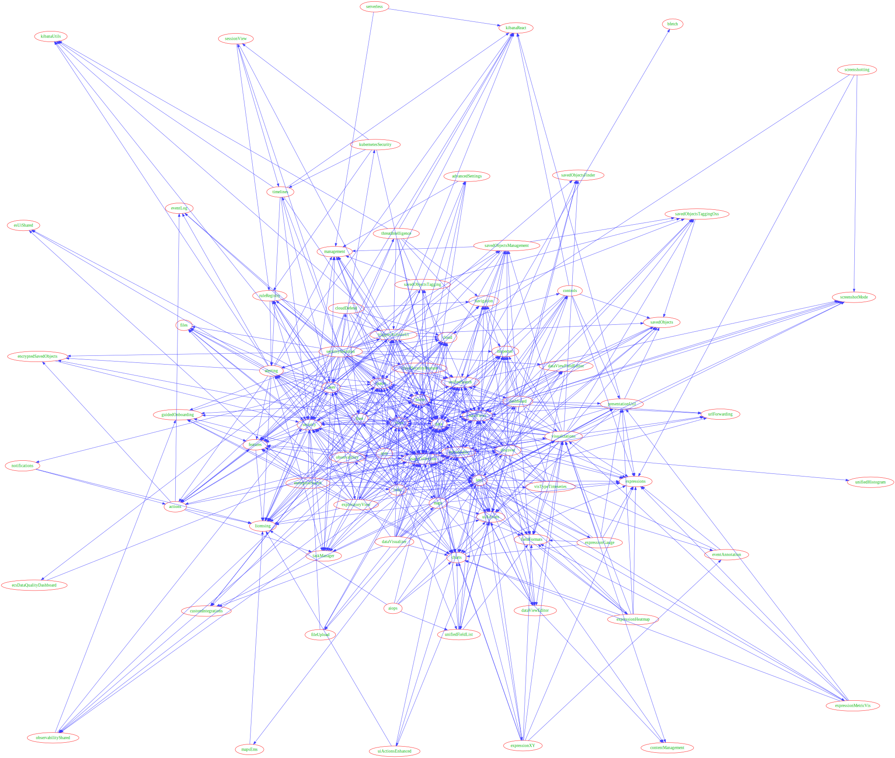
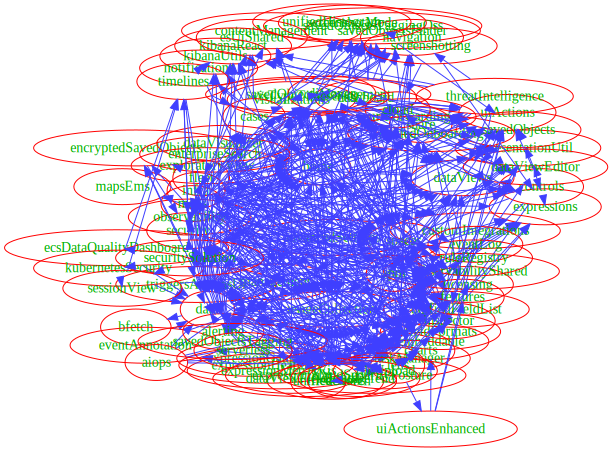

# Kibana plugin required dependencies

The visualizations below were generated by Graphviz given the required
plugin dependencies for all plugins loaded at startup.
Each visualization is using a different engine.
The input for these images is provided at the bottom of this page.
Try yourself at https://dreampuf.github.io/GraphvizOnline

Obviously, these aren't useful.  I've used Graphviz in the past to 
plot out tangled graphs - but this is something I've not seen before.

While not being actually useful, I do think there is a beauty to them.

Enjoy.

## engine fdp



## engine neato


## engine osage


## engine twopi



<details>
<summary>Graphviz input</summary>

```
digraph plugins {
  _advancedSettings [label="advancedSettings"];
  _bfetch [label="bfetch"];
  _expressionGauge [label="expressionGauge"];
  _expressionHeatmap [label="expressionHeatmap"];
  _expressionLegacyMetricVis [label="expressionLegacyMetricVis"];
  _expressionMetricVis [label="expressionMetricVis"];
  _expressionPartitionVis [label="expressionPartitionVis"];
  _expressionTagcloud [label="expressionTagcloud"];
  _expressionXY [label="expressionXY"];
  _charts [label="charts"];
  _console [label="console"];
  _contentManagement [label="contentManagement"];
  _controls [label="controls"];
  _customIntegrations [label="customIntegrations"];
  _dashboard [label="dashboard"];
  _data [label="data"];
  _dataViewEditor [label="dataViewEditor"];
  _dataViewFieldEditor [label="dataViewFieldEditor"];
  _dataViewManagement [label="dataViewManagement"];
  _dataViews [label="dataViews"];
  _devTools [label="devTools"];
  _discover [label="discover"];
  _embeddable [label="embeddable"];
  _esUiShared [label="esUiShared"];
  _eventAnnotation [label="eventAnnotation"];
  _expressionError [label="expressionError"];
  _expressionImage [label="expressionImage"];
  _expressionMetric [label="expressionMetric"];
  _expressionRepeatImage [label="expressionRepeatImage"];
  _expressionRevealImage [label="expressionRevealImage"];
  _expressionShape [label="expressionShape"];
  _expressions [label="expressions"];
  _fieldFormats [label="fieldFormats"];
  _files [label="files"];
  _filesManagement [label="filesManagement"];
  _ftrApis [label="ftrApis"];
  _guidedOnboarding [label="guidedOnboarding"];
  _home [label="home"];
  _imageEmbeddable [label="imageEmbeddable"];
  _inputControlVis [label="inputControlVis"];
  _inspector [label="inspector"];
  _interactiveSetup [label="interactiveSetup"];
  _kibanaOverview [label="kibanaOverview"];
  _kibanaReact [label="kibanaReact"];
  _kibanaUsageCollection [label="kibanaUsageCollection"];
  _kibanaUtils [label="kibanaUtils"];
  _management [label="management"];
  _mapsEms [label="mapsEms"];
  _navigation [label="navigation"];
  _newsfeed [label="newsfeed"];
  _presentationUtil [label="presentationUtil"];
  _savedObjects [label="savedObjects"];
  _savedObjectsFinder [label="savedObjectsFinder"];
  _savedObjectsManagement [label="savedObjectsManagement"];
  _savedObjectsTaggingOss [label="savedObjectsTaggingOss"];
  _savedSearch [label="savedSearch"];
  _screenshotMode [label="screenshotMode"];
  _share [label="share"];
  _telemetry [label="telemetry"];
  _telemetryCollectionManager [label="telemetryCollectionManager"];
  _telemetryManagementSection [label="telemetryManagementSection"];
  _uiActions [label="uiActions"];
  _uiActionsEnhanced [label="uiActionsEnhanced"];
  _unifiedFieldList [label="unifiedFieldList"];
  _unifiedHistogram [label="unifiedHistogram"];
  _unifiedSearch [label="unifiedSearch"];
  _urlForwarding [label="urlForwarding"];
  _usageCollection [label="usageCollection"];
  _visDefaultEditor [label="visDefaultEditor"];
  _visTypeMarkdown [label="visTypeMarkdown"];
  _visTypeGauge [label="visTypeGauge"];
  _visTypeHeatmap [label="visTypeHeatmap"];
  _visTypeMetric [label="visTypeMetric"];
  _visTypePie [label="visTypePie"];
  _visTypeTable [label="visTypeTable"];
  _visTypeTagcloud [label="visTypeTagcloud"];
  _visTypeTimelion [label="visTypeTimelion"];
  _visTypeTimeseries [label="visTypeTimeseries"];
  _visTypeVega [label="visTypeVega"];
  _visTypeVislib [label="visTypeVislib"];
  _visTypeXy [label="visTypeXy"];
  _visualizationUiComponents [label="visualizationUiComponents"];
  _visualizations [label="visualizations"];
  _actions [label="actions"];
  _aiops [label="aiops"];
  _alerting [label="alerting"];
  _apm [label="apm"];
  _assetManager [label="assetManager"];
  _banners [label="banners"];
  _canvas [label="canvas"];
  _cases [label="cases"];
  _cloud [label="cloud"];
  _cloudDefend [label="cloudDefend"];
  _cloudChat [label="cloudChat"];
  _cloudDataMigration [label="cloudDataMigration"];
  _cloudExperiments [label="cloudExperiments"];
  _cloudFullStory [label="cloudFullStory"];
  _cloudGainsight [label="cloudGainsight"];
  _cloudLinks [label="cloudLinks"];
  _cloudSecurityPosture [label="cloudSecurityPosture"];
  _crossClusterReplication [label="crossClusterReplication"];
  _customBranding [label="customBranding"];
  _dashboardEnhanced [label="dashboardEnhanced"];
  _dataVisualizer [label="dataVisualizer"];
  _discoverEnhanced [label="discoverEnhanced"];
  _urlDrilldown [label="urlDrilldown"];
  _ecsDataQualityDashboard [label="ecsDataQualityDashboard"];
  _embeddableEnhanced [label="embeddableEnhanced"];
  _encryptedSavedObjects [label="encryptedSavedObjects"];
  _enterpriseSearch [label="enterpriseSearch"];
  _eventLog [label="eventLog"];
  _exploratoryView [label="exploratoryView"];
  _features [label="features"];
  _fileUpload [label="fileUpload"];
  _fleet [label="fleet"];
  _globalSearch [label="globalSearch"];
  _globalSearchBar [label="globalSearchBar"];
  _globalSearchProviders [label="globalSearchProviders"];
  _graph [label="graph"];
  _grokdebugger [label="grokdebugger"];
  _indexLifecycleManagement [label="indexLifecycleManagement"];
  _indexManagement [label="indexManagement"];
  _infra [label="infra"];
  _ingestPipelines [label="ingestPipelines"];
  _kubernetesSecurity [label="kubernetesSecurity"];
  _lens [label="lens"];
  _licenseApiGuard [label="licenseApiGuard"];
  _licenseManagement [label="licenseManagement"];
  _licensing [label="licensing"];
  _lists [label="lists"];
  _logstash [label="logstash"];
  _maps [label="maps"];
  _ml [label="ml"];
  _monitoring [label="monitoring"];
  _monitoringCollection [label="monitoringCollection"];
  _notifications [label="notifications"];
  _observability [label="observability"];
  _observabilityOnboarding [label="observabilityOnboarding"];
  _observabilityShared [label="observabilityShared"];
  _osquery [label="osquery"];
  _painlessLab [label="painlessLab"];
  _profiling [label="profiling"];
  _remoteClusters [label="remoteClusters"];
  _reporting [label="reporting"];
  _rollup [label="rollup"];
  _ruleRegistry [label="ruleRegistry"];
  _runtimeFields [label="runtimeFields"];
  _savedObjectsTagging [label="savedObjectsTagging"];
  _screenshotting [label="screenshotting"];
  _searchprofiler [label="searchprofiler"];
  _security [label="security"];
  _securitySolution [label="securitySolution"];
  _serverless [label="serverless"];
  _serverlessObservability [label="serverlessObservability"];
  _serverlessSearch [label="serverlessSearch"];
  _serverlessSecurity [label="serverlessSecurity"];
  _sessionView [label="sessionView"];
  _snapshotRestore [label="snapshotRestore"];
  _spaces [label="spaces"];
  _stackAlerts [label="stackAlerts"];
  _stackConnectors [label="stackConnectors"];
  _synthetics [label="synthetics"];
  _taskManager [label="taskManager"];
  _telemetryCollectionXpack [label="telemetryCollectionXpack"];
  _threatIntelligence [label="threatIntelligence"];
  _timelines [label="timelines"];
  _transform [label="transform"];
  _translations [label="translations"];
  _triggersActionsUi [label="triggersActionsUi"];
  _upgradeAssistant [label="upgradeAssistant"];
  _ux [label="ux"];
  _watcher [label="watcher"];
  _advancedSettings -> _management;
  _expressionGauge -> _expressions;
  _expressionGauge -> _fieldFormats;
  _expressionGauge -> _charts;
  _expressionGauge -> _visualizations;
  _expressionGauge -> _presentationUtil;
  _expressionGauge -> _data;
  _expressionHeatmap -> _expressions;
  _expressionHeatmap -> _fieldFormats;
  _expressionHeatmap -> _charts;
  _expressionHeatmap -> _visualizations;
  _expressionHeatmap -> _presentationUtil;
  _expressionHeatmap -> _data;
  _expressionLegacyMetricVis -> _expressions;
  _expressionLegacyMetricVis -> _fieldFormats;
  _expressionLegacyMetricVis -> _charts;
  _expressionLegacyMetricVis -> _visualizations;
  _expressionLegacyMetricVis -> _presentationUtil;
  _expressionMetricVis -> _expressions;
  _expressionMetricVis -> _fieldFormats;
  _expressionMetricVis -> _charts;
  _expressionMetricVis -> _visualizations;
  _expressionMetricVis -> _presentationUtil;
  _expressionPartitionVis -> _charts;
  _expressionPartitionVis -> _data;
  _expressionPartitionVis -> _expressions;
  _expressionPartitionVis -> _visualizations;
  _expressionPartitionVis -> _fieldFormats;
  _expressionPartitionVis -> _presentationUtil;
  _expressionTagcloud -> _expressions;
  _expressionTagcloud -> _visualizations;
  _expressionTagcloud -> _charts;
  _expressionTagcloud -> _presentationUtil;
  _expressionTagcloud -> _fieldFormats;
  _expressionXY -> _expressions;
  _expressionXY -> _charts;
  _expressionXY -> _data;
  _expressionXY -> _fieldFormats;
  _expressionXY -> _uiActions;
  _expressionXY -> _eventAnnotation;
  _expressionXY -> _visualizations;
  _charts -> _expressions;
  _console -> _devTools;
  _console -> _share;
  _controls -> _presentationUtil;
  _controls -> _savedObjects;
  _controls -> _kibanaReact;
  _controls -> _expressions;
  _controls -> _embeddable;
  _controls -> _dataViews;
  _controls -> _data;
  _controls -> _unifiedSearch;
  _controls -> _uiActions;
  _dashboard -> _data;
  _dashboard -> _dataViews;
  _dashboard -> _dataViewEditor;
  _dashboard -> _embeddable;
  _dashboard -> _controls;
  _dashboard -> _inspector;
  _dashboard -> _navigation;
  _dashboard -> _savedObjects;
  _dashboard -> _savedObjectsFinder;
  _dashboard -> _savedObjectsManagement;
  _dashboard -> _share;
  _dashboard -> _screenshotMode;
  _dashboard -> _uiActions;
  _dashboard -> _urlForwarding;
  _dashboard -> _presentationUtil;
  _dashboard -> _visualizations;
  _dashboard -> _unifiedSearch;
  _data -> _bfetch;
  _data -> _expressions;
  _data -> _uiActions;
  _data -> _share;
  _data -> _inspector;
  _data -> _fieldFormats;
  _data -> _dataViews;
  _data -> _screenshotMode;
  _data -> _management;
  _dataViewEditor -> _data;
  _dataViewEditor -> _dataViews;
  _dataViewFieldEditor -> _data;
  _dataViewFieldEditor -> _fieldFormats;
  _dataViewFieldEditor -> _dataViews;
  _dataViewManagement -> _management;
  _dataViewManagement -> _data;
  _dataViewManagement -> _urlForwarding;
  _dataViewManagement -> _dataViewFieldEditor;
  _dataViewManagement -> _dataViewEditor;
  _dataViewManagement -> _dataViews;
  _dataViewManagement -> _fieldFormats;
  _dataViewManagement -> _unifiedSearch;
  _dataViewManagement -> _savedObjectsManagement;
  _dataViews -> _fieldFormats;
  _dataViews -> _expressions;
  _devTools -> _urlForwarding;
  _discover -> _charts;
  _discover -> _data;
  _discover -> _dataViews;
  _discover -> _embeddable;
  _discover -> _inspector;
  _discover -> _fieldFormats;
  _discover -> _urlForwarding;
  _discover -> _navigation;
  _discover -> _uiActions;
  _discover -> _savedObjects;
  _discover -> _savedObjectsFinder;
  _discover -> _savedObjectsManagement;
  _discover -> _dataViewFieldEditor;
  _discover -> _dataViewEditor;
  _discover -> _expressions;
  _discover -> _unifiedFieldList;
  _discover -> _unifiedSearch;
  _discover -> _unifiedHistogram;
  _embeddable -> _data;
  _embeddable -> _inspector;
  _embeddable -> _uiActions;
  _embeddable -> _savedObjectsFinder;
  _embeddable -> _savedObjectsManagement;
  _eventAnnotation -> _expressions;
  _eventAnnotation -> _data;
  _expressionError -> _expressions;
  _expressionError -> _presentationUtil;
  _expressionImage -> _expressions;
  _expressionImage -> _presentationUtil;
  _expressionMetric -> _expressions;
  _expressionMetric -> _presentationUtil;
  _expressionRepeatImage -> _expressions;
  _expressionRepeatImage -> _presentationUtil;
  _expressionRevealImage -> _expressions;
  _expressionRevealImage -> _presentationUtil;
  _expressionShape -> _expressions;
  _expressionShape -> _presentationUtil;
  _filesManagement -> _files;
  _filesManagement -> _management;
  _home -> _dataViews;
  _home -> _share;
  _home -> _urlForwarding;
  _imageEmbeddable -> _embeddable;
  _imageEmbeddable -> _files;
  _imageEmbeddable -> _uiActions;
  _inputControlVis -> _data;
  _inputControlVis -> _expressions;
  _inputControlVis -> _visDefaultEditor;
  _inputControlVis -> _visualizations;
  _inputControlVis -> _unifiedSearch;
  _inspector -> _share;
  _kibanaOverview -> _navigation;
  _kibanaOverview -> _dataViews;
  _kibanaOverview -> _home;
  _kibanaOverview -> _share;
  _kibanaOverview -> _dataViewEditor;
  _kibanaUsageCollection -> _usageCollection;
  _management -> _share;
  _navigation -> _unifiedSearch;
  _newsfeed -> _screenshotMode;
  _presentationUtil -> _savedObjects;
  _presentationUtil -> _kibanaReact;
  _presentationUtil -> _embeddable;
  _presentationUtil -> _expressions;
  _presentationUtil -> _dataViews;
  _presentationUtil -> _uiActions;
  _savedObjects -> _data;
  _savedObjects -> _dataViews;
  _savedObjectsManagement -> _management;
  _savedObjectsManagement -> _data;
  _savedObjectsManagement -> _dataViews;
  _savedSearch -> _data;
  _telemetry -> _telemetryCollectionManager;
  _telemetry -> _usageCollection;
  _telemetry -> _screenshotMode;
  _telemetryCollectionManager -> _usageCollection;
  _telemetryManagementSection -> _advancedSettings;
  _telemetryManagementSection -> _telemetry;
  _uiActions -> _dataViews;
  _uiActionsEnhanced -> _embeddable;
  _uiActionsEnhanced -> _uiActions;
  _unifiedFieldList -> _dataViews;
  _unifiedFieldList -> _data;
  _unifiedFieldList -> _fieldFormats;
  _unifiedFieldList -> _charts;
  _unifiedFieldList -> _uiActions;
  _unifiedSearch -> _dataViews;
  _unifiedSearch -> _data;
  _unifiedSearch -> _uiActions;
  _unifiedSearch -> _screenshotMode;
  _unifiedSearch -> _savedObjectsManagement;
  _visDefaultEditor -> _dataViews;
  _visTypeMarkdown -> _expressions;
  _visTypeMarkdown -> _visualizations;
  _visTypeGauge -> _charts;
  _visTypeGauge -> _data;
  _visTypeGauge -> _expressions;
  _visTypeGauge -> _visualizations;
  _visTypeGauge -> _dataViews;
  _visTypeHeatmap -> _charts;
  _visTypeHeatmap -> _data;
  _visTypeHeatmap -> _expressions;
  _visTypeHeatmap -> _visualizations;
  _visTypeHeatmap -> _usageCollection;
  _visTypeHeatmap -> _fieldFormats;
  _visTypeHeatmap -> _dataViews;
  _visTypeMetric -> _data;
  _visTypeMetric -> _visualizations;
  _visTypeMetric -> _charts;
  _visTypeMetric -> _expressions;
  _visTypeMetric -> _dataViews;
  _visTypePie -> _charts;
  _visTypePie -> _data;
  _visTypePie -> _expressions;
  _visTypePie -> _visualizations;
  _visTypePie -> _usageCollection;
  _visTypePie -> _expressionPartitionVis;
  _visTypePie -> _dataViews;
  _visTypeTable -> _expressions;
  _visTypeTable -> _visualizations;
  _visTypeTable -> _fieldFormats;
  _visTypeTable -> _dataViews;
  _visTypeTable -> _usageCollection;
  _visTypeTagcloud -> _data;
  _visTypeTagcloud -> _expressions;
  _visTypeTagcloud -> _visualizations;
  _visTypeTagcloud -> _charts;
  _visTypeTimelion -> _visualizations;
  _visTypeTimelion -> _data;
  _visTypeTimelion -> _expressions;
  _visTypeTimelion -> _charts;
  _visTypeTimelion -> _dataViews;
  _visTypeTimelion -> _fieldFormats;
  _visTypeTimeseries -> _charts;
  _visTypeTimeseries -> _data;
  _visTypeTimeseries -> _expressions;
  _visTypeTimeseries -> _visualizations;
  _visTypeTimeseries -> _inspector;
  _visTypeTimeseries -> _dataViews;
  _visTypeTimeseries -> _fieldFormats;
  _visTypeTimeseries -> _usageCollection;
  _visTypeTimeseries -> _unifiedSearch;
  _visTypeVega -> _data;
  _visTypeVega -> _visualizations;
  _visTypeVega -> _mapsEms;
  _visTypeVega -> _expressions;
  _visTypeVega -> _inspector;
  _visTypeVega -> _dataViews;
  _visTypeVega -> _usageCollection;
  _visTypeVislib -> _charts;
  _visTypeVislib -> _data;
  _visTypeVislib -> _expressions;
  _visTypeVislib -> _visualizations;
  _visTypeVislib -> _fieldFormats;
  _visTypeXy -> _charts;
  _visTypeXy -> _visualizations;
  _visTypeXy -> _data;
  _visTypeXy -> _expressions;
  _visTypeXy -> _dataViews;
  _visualizations -> _data;
  _visualizations -> _charts;
  _visualizations -> _expressions;
  _visualizations -> _fieldFormats;
  _visualizations -> _uiActions;
  _visualizations -> _urlForwarding;
  _visualizations -> _navigation;
  _visualizations -> _embeddable;
  _visualizations -> _inspector;
  _visualizations -> _savedObjects;
  _visualizations -> _screenshotMode;
  _visualizations -> _presentationUtil;
  _visualizations -> _dataViews;
  _visualizations -> _dataViewEditor;
  _visualizations -> _unifiedSearch;
  _visualizations -> _usageCollection;
  _visualizations -> _savedObjectsFinder;
  _visualizations -> _savedObjectsManagement;
  _visualizations -> _contentManagement;
  _actions -> _licensing;
  _actions -> _taskManager;
  _actions -> _encryptedSavedObjects;
  _actions -> _eventLog;
  _actions -> _features;
  _aiops -> _charts;
  _aiops -> _data;
  _aiops -> _lens;
  _aiops -> _licensing;
  _aiops -> _uiActions;
  _aiops -> _unifiedFieldList;
  _alerting -> _actions;
  _alerting -> _data;
  _alerting -> _dataViews;
  _alerting -> _share;
  _alerting -> _encryptedSavedObjects;
  _alerting -> _eventLog;
  _alerting -> _features;
  _alerting -> _kibanaUtils;
  _alerting -> _licensing;
  _alerting -> _taskManager;
  _alerting -> _kibanaReact;
  _alerting -> _management;
  _alerting -> _esUiShared;
  _apm -> _data;
  _apm -> _embeddable;
  _apm -> _features;
  _apm -> _infra;
  _apm -> _inspector;
  _apm -> _licensing;
  _apm -> _observability;
  _apm -> _observabilityShared;
  _apm -> _exploratoryView;
  _apm -> _ruleRegistry;
  _apm -> _triggersActionsUi;
  _apm -> _share;
  _apm -> _unifiedSearch;
  _apm -> _dataViews;
  _apm -> _advancedSettings;
  _apm -> _unifiedFieldList;
  _apm -> _lens;
  _apm -> _maps;
  _banners -> _licensing;
  _canvas -> _bfetch;
  _canvas -> _charts;
  _canvas -> _data;
  _canvas -> _dataViews;
  _canvas -> _embeddable;
  _canvas -> _expressionError;
  _canvas -> _expressionImage;
  _canvas -> _expressionMetric;
  _canvas -> _expressionRepeatImage;
  _canvas -> _expressionRevealImage;
  _canvas -> _expressionShape;
  _canvas -> _expressions;
  _canvas -> _features;
  _canvas -> _inspector;
  _canvas -> _presentationUtil;
  _canvas -> _visualizations;
  _canvas -> _uiActions;
  _canvas -> _share;
  _canvas -> _savedObjectsManagement;
  _canvas -> _savedObjectsFinder;
  _cases -> _actions;
  _cases -> _data;
  _cases -> _embeddable;
  _cases -> _esUiShared;
  _cases -> _lens;
  _cases -> _licensing;
  _cases -> _features;
  _cases -> _kibanaReact;
  _cases -> _kibanaUtils;
  _cases -> _triggersActionsUi;
  _cases -> _management;
  _cases -> _security;
  _cases -> _notifications;
  _cases -> _ruleRegistry;
  _cases -> _files;
  _cases -> _savedObjectsFinder;
  _cases -> _savedObjectsManagement;
  _cloudDefend -> _navigation;
  _cloudDefend -> _data;
  _cloudDefend -> _fleet;
  _cloudDefend -> _unifiedSearch;
  _cloudDefend -> _kibanaReact;
  _cloudDefend -> _cloud;
  _cloudDefend -> _security;
  _cloudDefend -> _licensing;
  _cloudChat -> _cloud;
  _cloudDataMigration -> _cloud;
  _cloudDataMigration -> _management;
  _cloudDataMigration -> _kibanaReact;
  _cloudDataMigration -> _features;
  _cloudExperiments -> _cloud;
  _cloudExperiments -> _dataViews;
  _cloudFullStory -> _cloud;
  _cloudGainsight -> _cloud;
  _cloudSecurityPosture -> _navigation;
  _cloudSecurityPosture -> _data;
  _cloudSecurityPosture -> _fleet;
  _cloudSecurityPosture -> _unifiedSearch;
  _cloudSecurityPosture -> _taskManager;
  _cloudSecurityPosture -> _security;
  _cloudSecurityPosture -> _charts;
  _cloudSecurityPosture -> _discover;
  _cloudSecurityPosture -> _cloud;
  _cloudSecurityPosture -> _licensing;
  _crossClusterReplication -> _home;
  _crossClusterReplication -> _licensing;
  _crossClusterReplication -> _licenseApiGuard;
  _crossClusterReplication -> _management;
  _crossClusterReplication -> _remoteClusters;
  _crossClusterReplication -> _indexManagement;
  _crossClusterReplication -> _features;
  _customBranding -> _licensing;
  _customBranding -> _licenseApiGuard;
  _dashboardEnhanced -> _dashboard;
  _dashboardEnhanced -> _data;
  _dashboardEnhanced -> _embeddable;
  _dashboardEnhanced -> _share;
  _dashboardEnhanced -> _uiActionsEnhanced;
  _dashboardEnhanced -> _unifiedSearch;
  _dataVisualizer -> _data;
  _dataVisualizer -> _usageCollection;
  _dataVisualizer -> _embeddable;
  _dataVisualizer -> _share;
  _dataVisualizer -> _discover;
  _dataVisualizer -> _fileUpload;
  _dataVisualizer -> _uiActions;
  _dataVisualizer -> _charts;
  _dataVisualizer -> _unifiedSearch;
  _discoverEnhanced -> _uiActions;
  _discoverEnhanced -> _embeddable;
  _discoverEnhanced -> _discover;
  _urlDrilldown -> _embeddable;
  _urlDrilldown -> _uiActions;
  _urlDrilldown -> _uiActionsEnhanced;
  _ecsDataQualityDashboard -> _data;
  _embeddableEnhanced -> _embeddable;
  _embeddableEnhanced -> _kibanaReact;
  _embeddableEnhanced -> _uiActions;
  _embeddableEnhanced -> _uiActionsEnhanced;
  _enterpriseSearch -> _features;
  _enterpriseSearch -> _security;
  _enterpriseSearch -> _licensing;
  _enterpriseSearch -> _data;
  _enterpriseSearch -> _discover;
  _enterpriseSearch -> _charts;
  _enterpriseSearch -> _infra;
  _enterpriseSearch -> _cloud;
  _enterpriseSearch -> _esUiShared;
  _enterpriseSearch -> _guidedOnboarding;
  _enterpriseSearch -> _lens;
  _enterpriseSearch -> _embeddable;
  _exploratoryView -> _alerting;
  _exploratoryView -> _cases;
  _exploratoryView -> _charts;
  _exploratoryView -> _data;
  _exploratoryView -> _dataViews;
  _exploratoryView -> _features;
  _exploratoryView -> _files;
  _exploratoryView -> _guidedOnboarding;
  _exploratoryView -> _inspector;
  _exploratoryView -> _lens;
  _exploratoryView -> _observabilityShared;
  _exploratoryView -> _security;
  _exploratoryView -> _share;
  _exploratoryView -> _triggersActionsUi;
  _exploratoryView -> _unifiedSearch;
  _features -> _licensing;
  _fileUpload -> _data;
  _fileUpload -> _usageCollection;
  _fleet -> _licensing;
  _fleet -> _data;
  _fleet -> _encryptedSavedObjects;
  _fleet -> _navigation;
  _fleet -> _customIntegrations;
  _fleet -> _share;
  _fleet -> _security;
  _fleet -> _unifiedSearch;
  _fleet -> _savedObjectsTagging;
  _fleet -> _taskManager;
  _fleet -> _guidedOnboarding;
  _fleet -> _files;
  _globalSearch -> _licensing;
  _globalSearchBar -> _globalSearch;
  _globalSearchProviders -> _globalSearch;
  _graph -> _licensing;
  _graph -> _data;
  _graph -> _navigation;
  _graph -> _savedObjects;
  _graph -> _unifiedSearch;
  _graph -> _inspector;
  _graph -> _savedObjectsManagement;
  _graph -> _savedObjectsFinder;
  _grokdebugger -> _licensing;
  _grokdebugger -> _home;
  _grokdebugger -> _devTools;
  _indexLifecycleManagement -> _licensing;
  _indexLifecycleManagement -> _management;
  _indexLifecycleManagement -> _features;
  _indexLifecycleManagement -> _share;
  _indexManagement -> _home;
  _indexManagement -> _management;
  _indexManagement -> _features;
  _indexManagement -> _share;
  _infra -> _alerting;
  _infra -> _cases;
  _infra -> _charts;
  _infra -> _data;
  _infra -> _dataViews;
  _infra -> _discover;
  _infra -> _embeddable;
  _infra -> _features;
  _infra -> _lens;
  _infra -> _observability;
  _infra -> _observabilityShared;
  _infra -> _ruleRegistry;
  _infra -> _security;
  _infra -> _share;
  _infra -> _triggersActionsUi;
  _infra -> _unifiedSearch;
  _infra -> _usageCollection;
  _infra -> _visTypeTimeseries;
  _ingestPipelines -> _licensing;
  _ingestPipelines -> _management;
  _ingestPipelines -> _features;
  _ingestPipelines -> _share;
  _ingestPipelines -> _fileUpload;
  _kubernetesSecurity -> _data;
  _kubernetesSecurity -> _timelines;
  _kubernetesSecurity -> _ruleRegistry;
  _kubernetesSecurity -> _sessionView;
  _lens -> _data;
  _lens -> _dataViews;
  _lens -> _charts;
  _lens -> _expressions;
  _lens -> _fieldFormats;
  _lens -> _inspector;
  _lens -> _navigation;
  _lens -> _urlForwarding;
  _lens -> _visualizations;
  _lens -> _dashboard;
  _lens -> _uiActions;
  _lens -> _uiActionsEnhanced;
  _lens -> _embeddable;
  _lens -> _share;
  _lens -> _presentationUtil;
  _lens -> _dataViewFieldEditor;
  _lens -> _dataViewEditor;
  _lens -> _expressionGauge;
  _lens -> _expressionMetricVis;
  _lens -> _expressionHeatmap;
  _lens -> _expressionXY;
  _lens -> _eventAnnotation;
  _lens -> _unifiedSearch;
  _lens -> _unifiedFieldList;
  _lens -> _contentManagement;
  _licenseManagement -> _home;
  _licenseManagement -> _licensing;
  _licenseManagement -> _management;
  _licenseManagement -> _features;
  _licenseManagement -> _share;
  _logstash -> _licensing;
  _logstash -> _management;
  _logstash -> _features;
  _maps -> _controls;
  _maps -> _unifiedSearch;
  _maps -> _lens;
  _maps -> _licensing;
  _maps -> _features;
  _maps -> _inspector;
  _maps -> _data;
  _maps -> _fieldFormats;
  _maps -> _fileUpload;
  _maps -> _uiActions;
  _maps -> _navigation;
  _maps -> _expressions;
  _maps -> _visualizations;
  _maps -> _dashboard;
  _maps -> _embeddable;
  _maps -> _mapsEms;
  _maps -> _savedObjects;
  _maps -> _share;
  _maps -> _presentationUtil;
  _maps -> _contentManagement;
  _ml -> _aiops;
  _ml -> _charts;
  _ml -> _cloud;
  _ml -> _data;
  _ml -> _dataViews;
  _ml -> _dataVisualizer;
  _ml -> _discover;
  _ml -> _embeddable;
  _ml -> _features;
  _ml -> _fieldFormats;
  _ml -> _lens;
  _ml -> _licensing;
  _ml -> _share;
  _ml -> _taskManager;
  _ml -> _triggersActionsUi;
  _ml -> _uiActions;
  _ml -> _unifiedSearch;
  _ml -> _savedObjectsFinder;
  _ml -> _savedObjectsManagement;
  _monitoring -> _licensing;
  _monitoring -> _features;
  _monitoring -> _data;
  _monitoring -> _navigation;
  _monitoring -> _observability;
  _monitoring -> _dataViews;
  _monitoring -> _unifiedSearch;
  _notifications -> _actions;
  _notifications -> _licensing;
  _observability -> _alerting;
  _observability -> _cases;
  _observability -> _charts;
  _observability -> _data;
  _observability -> _dataViews;
  _observability -> _embeddable;
  _observability -> _exploratoryView;
  _observability -> _features;
  _observability -> _files;
  _observability -> _guidedOnboarding;
  _observability -> _inspector;
  _observability -> _lens;
  _observability -> _observabilityShared;
  _observability -> _ruleRegistry;
  _observability -> _triggersActionsUi;
  _observability -> _security;
  _observability -> _share;
  _observability -> _unifiedSearch;
  _observability -> _visualizations;
  _observabilityOnboarding -> _data;
  _observabilityOnboarding -> _observability;
  _observabilityShared -> _cases;
  _observabilityShared -> _guidedOnboarding;
  _osquery -> _actions;
  _osquery -> _data;
  _osquery -> _licensing;
  _osquery -> _dataViews;
  _osquery -> _discover;
  _osquery -> _features;
  _osquery -> _navigation;
  _osquery -> _taskManager;
  _osquery -> _triggersActionsUi;
  _osquery -> _ruleRegistry;
  _osquery -> _security;
  _painlessLab -> _devTools;
  _painlessLab -> _licensing;
  _painlessLab -> _home;
  _profiling -> _navigation;
  _profiling -> _data;
  _profiling -> _kibanaUtils;
  _profiling -> _share;
  _profiling -> _observability;
  _profiling -> _observabilityShared;
  _profiling -> _features;
  _profiling -> _kibanaReact;
  _profiling -> _unifiedSearch;
  _profiling -> _dataViews;
  _profiling -> _charts;
  _profiling -> _spaces;
  _profiling -> _cloud;
  _profiling -> _fleet;
  _profiling -> _licensing;
  _remoteClusters -> _licensing;
  _remoteClusters -> _management;
  _remoteClusters -> _indexManagement;
  _remoteClusters -> _features;
  _remoteClusters -> _share;
  _reporting -> _data;
  _reporting -> _discover;
  _reporting -> _fieldFormats;
  _reporting -> _esUiShared;
  _reporting -> _home;
  _reporting -> _management;
  _reporting -> _licensing;
  _reporting -> _uiActions;
  _reporting -> _taskManager;
  _reporting -> _embeddable;
  _reporting -> _screenshotting;
  _reporting -> _screenshotMode;
  _reporting -> _share;
  _reporting -> _features;
  _rollup -> _management;
  _rollup -> _licensing;
  _rollup -> _features;
  _ruleRegistry -> _alerting;
  _ruleRegistry -> _data;
  _ruleRegistry -> _triggersActionsUi;
  _savedObjectsTagging -> _features;
  _savedObjectsTagging -> _management;
  _savedObjectsTagging -> _savedObjectsTaggingOss;
  _screenshotting -> _expressions;
  _screenshotting -> _screenshotMode;
  _searchprofiler -> _devTools;
  _searchprofiler -> _home;
  _searchprofiler -> _licensing;
  _searchprofiler -> _share;
  _security -> _features;
  _security -> _licensing;
  _security -> _taskManager;
  _securitySolution -> _actions;
  _securitySolution -> _alerting;
  _securitySolution -> _cases;
  _securitySolution -> _cloud;
  _securitySolution -> _cloudDefend;
  _securitySolution -> _cloudSecurityPosture;
  _securitySolution -> _dashboard;
  _securitySolution -> _data;
  _securitySolution -> _ecsDataQualityDashboard;
  _securitySolution -> _dataViews;
  _securitySolution -> _embeddable;
  _securitySolution -> _eventLog;
  _securitySolution -> _features;
  _securitySolution -> _guidedOnboarding;
  _securitySolution -> _inspector;
  _securitySolution -> _kubernetesSecurity;
  _securitySolution -> _lens;
  _securitySolution -> _licensing;
  _securitySolution -> _maps;
  _securitySolution -> _ruleRegistry;
  _securitySolution -> _sessionView;
  _securitySolution -> _spaces;
  _securitySolution -> _taskManager;
  _securitySolution -> _threatIntelligence;
  _securitySolution -> _timelines;
  _securitySolution -> _triggersActionsUi;
  _securitySolution -> _uiActions;
  _securitySolution -> _unifiedSearch;
  _securitySolution -> _files;
  _securitySolution -> _controls;
  _securitySolution -> _dataViews;
  _securitySolution -> _savedObjectsManagement;
  _serverless -> _kibanaReact;
  _serverless -> _management;
  _serverlessObservability -> _serverless;
  _serverlessObservability -> _observabilityShared;
  _serverlessSearch -> _serverless;
  _serverlessSearch -> _enterpriseSearch;
  _serverlessSearch -> _management;
  _serverlessSecurity -> _serverless;
  _serverlessSecurity -> _security;
  _serverlessSecurity -> _securitySolution;
  _serverlessSecurity -> _kibanaReact;
  _sessionView -> _data;
  _sessionView -> _timelines;
  _sessionView -> _ruleRegistry;
  _snapshotRestore -> _licensing;
  _snapshotRestore -> _management;
  _snapshotRestore -> _features;
  _snapshotRestore -> _share;
  _spaces -> _features;
  _spaces -> _licensing;
  _stackAlerts -> _unifiedSearch;
  _stackAlerts -> _alerting;
  _stackAlerts -> _features;
  _stackAlerts -> _triggersActionsUi;
  _stackAlerts -> _kibanaReact;
  _stackAlerts -> _savedObjects;
  _stackAlerts -> _data;
  _stackAlerts -> _dataViews;
  _stackAlerts -> _kibanaUtils;
  _stackConnectors -> _actions;
  _stackConnectors -> _esUiShared;
  _stackConnectors -> _triggersActionsUi;
  _synthetics -> _actions;
  _synthetics -> _alerting;
  _synthetics -> _cases;
  _synthetics -> _data;
  _synthetics -> _fleet;
  _synthetics -> _embeddable;
  _synthetics -> _discover;
  _synthetics -> _dataViews;
  _synthetics -> _encryptedSavedObjects;
  _synthetics -> _exploratoryView;
  _synthetics -> _features;
  _synthetics -> _inspector;
  _synthetics -> _licensing;
  _synthetics -> _observability;
  _synthetics -> _observabilityShared;
  _synthetics -> _ruleRegistry;
  _synthetics -> _security;
  _synthetics -> _share;
  _synthetics -> _taskManager;
  _synthetics -> _triggersActionsUi;
  _synthetics -> _usageCollection;
  _synthetics -> _unifiedSearch;
  _synthetics -> _bfetch;
  _telemetryCollectionXpack -> _telemetryCollectionManager;
  _threatIntelligence -> _cases;
  _threatIntelligence -> _data;
  _threatIntelligence -> _dataViews;
  _threatIntelligence -> _kibanaUtils;
  _threatIntelligence -> _navigation;
  _threatIntelligence -> _kibanaReact;
  _threatIntelligence -> _triggersActionsUi;
  _threatIntelligence -> _inspector;
  _timelines -> _alerting;
  _timelines -> _cases;
  _timelines -> _data;
  _timelines -> _kibanaReact;
  _timelines -> _kibanaUtils;
  _transform -> _data;
  _transform -> _dataViews;
  _transform -> _home;
  _transform -> _licensing;
  _transform -> _management;
  _transform -> _features;
  _transform -> _share;
  _transform -> _triggersActionsUi;
  _transform -> _fieldFormats;
  _transform -> _unifiedSearch;
  _transform -> _charts;
  _transform -> _savedObjectsFinder;
  _transform -> _savedObjectsManagement;
  _triggersActionsUi -> _management;
  _triggersActionsUi -> _charts;
  _triggersActionsUi -> _data;
  _triggersActionsUi -> _kibanaReact;
  _triggersActionsUi -> _kibanaUtils;
  _triggersActionsUi -> _savedObjects;
  _triggersActionsUi -> _unifiedSearch;
  _triggersActionsUi -> _dataViews;
  _triggersActionsUi -> _dataViewEditor;
  _triggersActionsUi -> _alerting;
  _triggersActionsUi -> _actions;
  _upgradeAssistant -> _management;
  _upgradeAssistant -> _data;
  _upgradeAssistant -> _licensing;
  _upgradeAssistant -> _features;
  _upgradeAssistant -> _share;
  _ux -> _features;
  _ux -> _data;
  _ux -> _dataViews;
  _ux -> _exploratoryView;
  _ux -> _licensing;
  _ux -> _triggersActionsUi;
  _ux -> _observabilityShared;
  _ux -> _embeddable;
  _ux -> _infra;
  _ux -> _inspector;
  _ux -> _apm;
  _watcher -> _home;
  _watcher -> _licensing;
  _watcher -> _licenseApiGuard;
  _watcher -> _management;
  _watcher -> _charts;
  _watcher -> _data;
  _watcher -> _features;
}
```

</details>