# Kibana plugin dependency by roots diagrams


## actions

```mermaid
stateDiagram
direction TB
accTitle: actions dependency roots
  _alerting --> _actions
  _apm --> _actions
  _apm --> _alerting
  _apm --> _cases
  _apm --> _exploratoryView
  _apm --> _fleet
  _apm --> _infra
  _apm --> _ml
  _apm --> _observability
  _apm --> _observabilityShared
  _apm --> _ruleRegistry
  _apm --> _triggersActionsUi
  _canvas --> _reporting
  _cases --> _actions
  _cases --> _notifications
  _cases --> _ruleRegistry
  _cases --> _triggersActionsUi
  _cloudDefend --> _fleet
  _cloudSecurityPosture --> _discover
  _cloudSecurityPosture --> _fleet
  _crossClusterReplication --> _indexManagement
  _crossClusterReplication --> _remoteClusters
  _dataVisualizer --> _discover
  _discover --> _triggersActionsUi
  _discoverEnhanced --> _discover
  _enterpriseSearch --> _discover
  _enterpriseSearch --> _infra
  _enterpriseSearch --> _ml
  _exploratoryView --> _alerting
  _exploratoryView --> _cases
  _exploratoryView --> _discover
  _exploratoryView --> _observabilityShared
  _exploratoryView --> _triggersActionsUi
  _fleet --> _discover
  _indexLifecycleManagement --> _indexManagement
  _indexManagement --> _fleet
  _infra --> _alerting
  _infra --> _cases
  _infra --> _discover
  _infra --> _ml
  _infra --> _observability
  _infra --> _observabilityShared
  _infra --> _osquery
  _infra --> _ruleRegistry
  _infra --> _triggersActionsUi
  _kubernetesSecurity --> _ruleRegistry
  _kubernetesSecurity --> _sessionView
  _kubernetesSecurity --> _timelines
  _logstash --> _monitoring
  _ml --> _alerting
  _ml --> _cases
  _ml --> _dataVisualizer
  _ml --> _discover
  _ml --> _triggersActionsUi
  _monitoring --> _actions
  _monitoring --> _alerting
  _monitoring --> _fleet
  _monitoring --> _infra
  _monitoring --> _observability
  _monitoring --> _triggersActionsUi
  _notifications --> _actions
  _observability --> _alerting
  _observability --> _cases
  _observability --> _discover
  _observability --> _exploratoryView
  _observability --> _observabilityShared
  _observability --> _ruleRegistry
  _observability --> _triggersActionsUi
  _observabilityOnboarding --> _observability
  _observabilityShared --> _cases
  _osquery --> _actions
  _osquery --> _cases
  _osquery --> _discover
  _osquery --> _fleet
  _osquery --> _ruleRegistry
  _osquery --> _triggersActionsUi
  _profiling --> _fleet
  _profiling --> _observability
  _profiling --> _observabilityShared
  _remoteClusters --> _indexManagement
  _reporting --> _discover
  _rollup --> _indexManagement
  _ruleRegistry --> _alerting
  _ruleRegistry --> _triggersActionsUi
  _securitySolution --> _actions
  _securitySolution --> _alerting
  _securitySolution --> _cases
  _securitySolution --> _cloudDefend
  _securitySolution --> _cloudSecurityPosture
  _securitySolution --> _fleet
  _securitySolution --> _kubernetesSecurity
  _securitySolution --> _ml
  _securitySolution --> _osquery
  _securitySolution --> _ruleRegistry
  _securitySolution --> _sessionView
  _securitySolution --> _threatIntelligence
  _securitySolution --> _timelines
  _securitySolution --> _triggersActionsUi
  _serverlessObservability --> _observabilityShared
  _serverlessSearch --> _enterpriseSearch
  _serverlessSecurity --> _securitySolution
  _sessionView --> _ruleRegistry
  _sessionView --> _timelines
  _stackAlerts --> _alerting
  _stackAlerts --> _triggersActionsUi
  _stackConnectors --> _actions
  _stackConnectors --> _triggersActionsUi
  _synthetics --> _actions
  _synthetics --> _alerting
  _synthetics --> _cases
  _synthetics --> _discover
  _synthetics --> _exploratoryView
  _synthetics --> _fleet
  _synthetics --> _ml
  _synthetics --> _observability
  _synthetics --> _observabilityShared
  _synthetics --> _ruleRegistry
  _synthetics --> _triggersActionsUi
  _threatIntelligence --> _cases
  _threatIntelligence --> _triggersActionsUi
  _timelines --> _alerting
  _timelines --> _cases
  _transform --> _alerting
  _transform --> _triggersActionsUi
  _triggersActionsUi --> _actions
  _triggersActionsUi --> _alerting
  _upgradeAssistant --> _infra
  _ux --> _actions
  _ux --> _apm
  _ux --> _exploratoryView
  _ux --> _infra
  _ux --> _observability
  _ux --> _observabilityShared
  _ux --> _triggersActionsUi
```


## advancedSettings

```mermaid
stateDiagram
direction TB
accTitle: advancedSettings dependency roots
  _actions --> _encryptedSavedObjects
  _actions --> _eventLog
  _actions --> _security
  _actions --> _spaces
  _aiops --> _data
  _aiops --> _lens
  _aiops --> _unifiedFieldList
  _alerting --> _actions
  _alerting --> _data
  _alerting --> _encryptedSavedObjects
  _alerting --> _eventLog
  _alerting --> _security
  _alerting --> _spaces
  _apm --> _actions
  _apm --> _advancedSettings
  _apm --> _alerting
  _apm --> _cases
  _apm --> _data
  _apm --> _embeddable
  _apm --> _exploratoryView
  _apm --> _fleet
  _apm --> _infra
  _apm --> _lens
  _apm --> _maps
  _apm --> _ml
  _apm --> _observability
  _apm --> _observabilityShared
  _apm --> _ruleRegistry
  _apm --> _security
  _apm --> _spaces
  _apm --> _triggersActionsUi
  _apm --> _unifiedFieldList
  _apm --> _unifiedSearch
  _canvas --> _data
  _canvas --> _embeddable
  _canvas --> _expressionError
  _canvas --> _expressionImage
  _canvas --> _expressionMetric
  _canvas --> _expressionRepeatImage
  _canvas --> _expressionRevealImage
  _canvas --> _expressionShape
  _canvas --> _presentationUtil
  _canvas --> _reporting
  _canvas --> _savedObjects
  _canvas --> _savedObjectsManagement
  _canvas --> _spaces
  _canvas --> _visualizations
  _cases --> _actions
  _cases --> _data
  _cases --> _embeddable
  _cases --> _files
  _cases --> _lens
  _cases --> _notifications
  _cases --> _ruleRegistry
  _cases --> _savedObjectsManagement
  _cases --> _security
  _cases --> _spaces
  _cases --> _triggersActionsUi
  _cloudChat --> _security
  _cloudDefend --> _data
  _cloudDefend --> _fleet
  _cloudDefend --> _navigation
  _cloudDefend --> _security
  _cloudDefend --> _unifiedSearch
  _cloudFullStory --> _security
  _cloudLinks --> _security
  _cloudSecurityPosture --> _data
  _cloudSecurityPosture --> _discover
  _cloudSecurityPosture --> _fleet
  _cloudSecurityPosture --> _navigation
  _cloudSecurityPosture --> _security
  _cloudSecurityPosture --> _unifiedSearch
  _controls --> _data
  _controls --> _embeddable
  _controls --> _presentationUtil
  _controls --> _savedObjects
  _controls --> _unifiedSearch
  _crossClusterReplication --> _indexManagement
  _crossClusterReplication --> _remoteClusters
  _dashboard --> _controls
  _dashboard --> _data
  _dashboard --> _dataViewEditor
  _dashboard --> _embeddable
  _dashboard --> _navigation
  _dashboard --> _presentationUtil
  _dashboard --> _savedObjects
  _dashboard --> _savedObjectsManagement
  _dashboard --> _savedObjectsTaggingOss
  _dashboard --> _spaces
  _dashboard --> _unifiedSearch
  _dashboard --> _visualizations
  _dashboardEnhanced --> _dashboard
  _dashboardEnhanced --> _data
  _dashboardEnhanced --> _embeddable
  _dashboardEnhanced --> _uiActionsEnhanced
  _dashboardEnhanced --> _unifiedSearch
  _data --> _security
  _dataViewEditor --> _data
  _dataViewFieldEditor --> _data
  _dataViewManagement --> _data
  _dataViewManagement --> _dataViewEditor
  _dataViewManagement --> _dataViewFieldEditor
  _dataViewManagement --> _savedObjectsManagement
  _dataViewManagement --> _spaces
  _dataViewManagement --> _unifiedSearch
  _dataVisualizer --> _data
  _dataVisualizer --> _dataViewFieldEditor
  _dataVisualizer --> _discover
  _dataVisualizer --> _embeddable
  _dataVisualizer --> _fileUpload
  _dataVisualizer --> _lens
  _dataVisualizer --> _maps
  _dataVisualizer --> _security
  _dataVisualizer --> _unifiedSearch
  _discover --> _data
  _discover --> _dataViewEditor
  _discover --> _dataViewFieldEditor
  _discover --> _embeddable
  _discover --> _lens
  _discover --> _navigation
  _discover --> _savedObjects
  _discover --> _savedObjectsManagement
  _discover --> _savedObjectsTaggingOss
  _discover --> _spaces
  _discover --> _triggersActionsUi
  _discover --> _unifiedFieldList
  _discover --> _unifiedSearch
  _discoverEnhanced --> _discover
  _discoverEnhanced --> _embeddable
  _ecsDataQualityDashboard --> _data
  _embeddable --> _data
  _embeddable --> _savedObjectsManagement
  _embeddable --> _savedObjectsTaggingOss
  _embeddableEnhanced --> _embeddable
  _embeddableEnhanced --> _uiActionsEnhanced
  _encryptedSavedObjects --> _security
  _enterpriseSearch --> _data
  _enterpriseSearch --> _discover
  _enterpriseSearch --> _embeddable
  _enterpriseSearch --> _infra
  _enterpriseSearch --> _lens
  _enterpriseSearch --> _ml
  _enterpriseSearch --> _security
  _enterpriseSearch --> _spaces
  _eventAnnotation --> _data
  _eventLog --> _spaces
  _exploratoryView --> _alerting
  _exploratoryView --> _cases
  _exploratoryView --> _data
  _exploratoryView --> _discover
  _exploratoryView --> _embeddable
  _exploratoryView --> _files
  _exploratoryView --> _lens
  _exploratoryView --> _observabilityShared
  _exploratoryView --> _security
  _exploratoryView --> _spaces
  _exploratoryView --> _triggersActionsUi
  _exploratoryView --> _unifiedSearch
  _expressionError --> _presentationUtil
  _expressionGauge --> _data
  _expressionGauge --> _presentationUtil
  _expressionGauge --> _visualizations
  _expressionHeatmap --> _data
  _expressionHeatmap --> _presentationUtil
  _expressionHeatmap --> _visualizations
  _expressionImage --> _presentationUtil
  _expressionLegacyMetricVis --> _presentationUtil
  _expressionLegacyMetricVis --> _visualizations
  _expressionMetric --> _presentationUtil
  _expressionMetricVis --> _presentationUtil
  _expressionMetricVis --> _visualizations
  _expressionPartitionVis --> _data
  _expressionPartitionVis --> _presentationUtil
  _expressionPartitionVis --> _visualizations
  _expressionRepeatImage --> _presentationUtil
  _expressionRevealImage --> _presentationUtil
  _expressionShape --> _presentationUtil
  _expressionTagcloud --> _presentationUtil
  _expressionTagcloud --> _visualizations
  _expressionXY --> _data
  _expressionXY --> _eventAnnotation
  _expressionXY --> _visualizations
  _fileUpload --> _data
  _fileUpload --> _security
  _files --> _security
  _filesManagement --> _files
  _fleet --> _data
  _fleet --> _discover
  _fleet --> _encryptedSavedObjects
  _fleet --> _files
  _fleet --> _ingestPipelines
  _fleet --> _navigation
  _fleet --> _savedObjectsTagging
  _fleet --> _security
  _fleet --> _spaces
  _fleet --> _telemetry
  _fleet --> _unifiedSearch
  _globalSearchBar --> _savedObjectsTagging
  _graph --> _data
  _graph --> _navigation
  _graph --> _savedObjects
  _graph --> _savedObjectsManagement
  _graph --> _spaces
  _graph --> _unifiedSearch
  _imageEmbeddable --> _embeddable
  _imageEmbeddable --> _files
  _imageEmbeddable --> _security
  _indexLifecycleManagement --> _indexManagement
  _indexManagement --> _fleet
  _indexManagement --> _security
  _infra --> _alerting
  _infra --> _cases
  _infra --> _data
  _infra --> _discover
  _infra --> _embeddable
  _infra --> _lens
  _infra --> _ml
  _infra --> _observability
  _infra --> _observabilityShared
  _infra --> _osquery
  _infra --> _ruleRegistry
  _infra --> _security
  _infra --> _spaces
  _infra --> _triggersActionsUi
  _infra --> _unifiedSearch
  _infra --> _visTypeTimeseries
  _ingestPipelines --> _fileUpload
  _ingestPipelines --> _security
  _inputControlVis --> _data
  _inputControlVis --> _unifiedSearch
  _inputControlVis --> _visDefaultEditor
  _inputControlVis --> _visualizations
  _kibanaOverview --> _dataViewEditor
  _kibanaOverview --> _navigation
  _kubernetesSecurity --> _data
  _kubernetesSecurity --> _ruleRegistry
  _kubernetesSecurity --> _sessionView
  _kubernetesSecurity --> _timelines
  _lens --> _dashboard
  _lens --> _data
  _lens --> _dataViewEditor
  _lens --> _dataViewFieldEditor
  _lens --> _embeddable
  _lens --> _eventAnnotation
  _lens --> _expressionGauge
  _lens --> _expressionHeatmap
  _lens --> _expressionLegacyMetricVis
  _lens --> _expressionMetricVis
  _lens --> _expressionPartitionVis
  _lens --> _expressionXY
  _lens --> _navigation
  _lens --> _presentationUtil
  _lens --> _savedObjectsTagging
  _lens --> _spaces
  _lens --> _uiActionsEnhanced
  _lens --> _unifiedFieldList
  _lens --> _unifiedSearch
  _lens --> _visualizations
  _licenseManagement --> _telemetry
  _lists --> _security
  _lists --> _spaces
  _logstash --> _monitoring
  _logstash --> _security
  _maps --> _controls
  _maps --> _dashboard
  _maps --> _data
  _maps --> _embeddable
  _maps --> _fileUpload
  _maps --> _lens
  _maps --> _navigation
  _maps --> _presentationUtil
  _maps --> _savedObjects
  _maps --> _savedObjectsTagging
  _maps --> _security
  _maps --> _spaces
  _maps --> _unifiedSearch
  _maps --> _visualizations
  _ml --> _aiops
  _ml --> _alerting
  _ml --> _cases
  _ml --> _dashboard
  _ml --> _data
  _ml --> _dataVisualizer
  _ml --> _discover
  _ml --> _embeddable
  _ml --> _lens
  _ml --> _licenseManagement
  _ml --> _maps
  _ml --> _savedObjectsManagement
  _ml --> _security
  _ml --> _spaces
  _ml --> _triggersActionsUi
  _ml --> _unifiedSearch
  _monitoring --> _actions
  _monitoring --> _alerting
  _monitoring --> _dashboard
  _monitoring --> _data
  _monitoring --> _encryptedSavedObjects
  _monitoring --> _fleet
  _monitoring --> _infra
  _monitoring --> _navigation
  _monitoring --> _observability
  _monitoring --> _triggersActionsUi
  _monitoring --> _unifiedSearch
  _navigation --> _unifiedSearch
  _notifications --> _actions
  _observability --> _alerting
  _observability --> _cases
  _observability --> _data
  _observability --> _discover
  _observability --> _embeddable
  _observability --> _exploratoryView
  _observability --> _files
  _observability --> _lens
  _observability --> _observabilityShared
  _observability --> _ruleRegistry
  _observability --> _security
  _observability --> _spaces
  _observability --> _triggersActionsUi
  _observability --> _unifiedSearch
  _observability --> _visualizations
  _observabilityOnboarding --> _data
  _observabilityOnboarding --> _observability
  _observabilityShared --> _cases
  _osquery --> _actions
  _osquery --> _cases
  _osquery --> _data
  _osquery --> _discover
  _osquery --> _fleet
  _osquery --> _lens
  _osquery --> _navigation
  _osquery --> _ruleRegistry
  _osquery --> _security
  _osquery --> _telemetry
  _osquery --> _triggersActionsUi
  _presentationUtil --> _embeddable
  _presentationUtil --> _savedObjects
  _profiling --> _data
  _profiling --> _fleet
  _profiling --> _navigation
  _profiling --> _observability
  _profiling --> _observabilityShared
  _profiling --> _spaces
  _profiling --> _unifiedSearch
  _remoteClusters --> _indexManagement
  _reporting --> _data
  _reporting --> _discover
  _reporting --> _embeddable
  _reporting --> _security
  _reporting --> _spaces
  _rollup --> _indexManagement
  _rollup --> _visTypeTimeseries
  _ruleRegistry --> _alerting
  _ruleRegistry --> _data
  _ruleRegistry --> _security
  _ruleRegistry --> _spaces
  _ruleRegistry --> _triggersActionsUi
  _savedObjects --> _data
  _savedObjectsManagement --> _data
  _savedObjectsManagement --> _savedObjectsTaggingOss
  _savedObjectsManagement --> _spaces
  _savedObjectsTagging --> _savedObjectsTaggingOss
  _savedObjectsTagging --> _security
  _savedObjectsTaggingOss --> _savedObjects
  _savedSearch --> _data
  _security --> _spaces
  _securitySolution --> _actions
  _securitySolution --> _alerting
  _securitySolution --> _cases
  _securitySolution --> _cloudDefend
  _securitySolution --> _cloudSecurityPosture
  _securitySolution --> _controls
  _securitySolution --> _dashboard
  _securitySolution --> _data
  _securitySolution --> _dataViewFieldEditor
  _securitySolution --> _ecsDataQualityDashboard
  _securitySolution --> _embeddable
  _securitySolution --> _encryptedSavedObjects
  _securitySolution --> _eventLog
  _securitySolution --> _files
  _securitySolution --> _fleet
  _securitySolution --> _kubernetesSecurity
  _securitySolution --> _lens
  _securitySolution --> _lists
  _securitySolution --> _maps
  _securitySolution --> _ml
  _securitySolution --> _osquery
  _securitySolution --> _ruleRegistry
  _securitySolution --> _savedObjectsManagement
  _securitySolution --> _savedObjectsTaggingOss
  _securitySolution --> _security
  _securitySolution --> _sessionView
  _securitySolution --> _spaces
  _securitySolution --> _telemetry
  _securitySolution --> _threatIntelligence
  _securitySolution --> _timelines
  _securitySolution --> _triggersActionsUi
  _securitySolution --> _unifiedSearch
  _serverlessObservability --> _observabilityShared
  _serverlessSearch --> _enterpriseSearch
  _serverlessSecurity --> _security
  _serverlessSecurity --> _securitySolution
  _sessionView --> _data
  _sessionView --> _ruleRegistry
  _sessionView --> _timelines
  _snapshotRestore --> _security
  _spaces --> _advancedSettings
  _stackAlerts --> _alerting
  _stackAlerts --> _data
  _stackAlerts --> _savedObjects
  _stackAlerts --> _triggersActionsUi
  _stackAlerts --> _unifiedSearch
  _stackConnectors --> _actions
  _stackConnectors --> _triggersActionsUi
  _synthetics --> _actions
  _synthetics --> _alerting
  _synthetics --> _cases
  _synthetics --> _data
  _synthetics --> _discover
  _synthetics --> _embeddable
  _synthetics --> _encryptedSavedObjects
  _synthetics --> _exploratoryView
  _synthetics --> _fleet
  _synthetics --> _ml
  _synthetics --> _observability
  _synthetics --> _observabilityShared
  _synthetics --> _ruleRegistry
  _synthetics --> _security
  _synthetics --> _spaces
  _synthetics --> _telemetry
  _synthetics --> _triggersActionsUi
  _synthetics --> _unifiedSearch
  _telemetry --> _security
  _telemetryManagementSection --> _advancedSettings
  _telemetryManagementSection --> _telemetry
  _threatIntelligence --> _cases
  _threatIntelligence --> _data
  _threatIntelligence --> _navigation
  _threatIntelligence --> _triggersActionsUi
  _timelines --> _alerting
  _timelines --> _cases
  _timelines --> _data
  _timelines --> _security
  _transform --> _alerting
  _transform --> _data
  _transform --> _savedObjectsManagement
  _transform --> _security
  _transform --> _spaces
  _transform --> _triggersActionsUi
  _transform --> _unifiedSearch
  _triggersActionsUi --> _actions
  _triggersActionsUi --> _alerting
  _triggersActionsUi --> _data
  _triggersActionsUi --> _dataViewEditor
  _triggersActionsUi --> _savedObjects
  _triggersActionsUi --> _spaces
  _triggersActionsUi --> _unifiedSearch
  _uiActionsEnhanced --> _embeddable
  _unifiedFieldList --> _data
  _unifiedSearch --> _data
  _unifiedSearch --> _savedObjectsManagement
  _upgradeAssistant --> _data
  _upgradeAssistant --> _infra
  _upgradeAssistant --> _security
  _urlDrilldown --> _embeddable
  _urlDrilldown --> _uiActionsEnhanced
  _ux --> _actions
  _ux --> _apm
  _ux --> _data
  _ux --> _embeddable
  _ux --> _exploratoryView
  _ux --> _infra
  _ux --> _lens
  _ux --> _maps
  _ux --> _observability
  _ux --> _observabilityShared
  _ux --> _security
  _ux --> _triggersActionsUi
  _visDefaultEditor --> _visualizations
  _visTypeGauge --> _data
  _visTypeGauge --> _expressionGauge
  _visTypeGauge --> _visualizations
  _visTypeHeatmap --> _data
  _visTypeHeatmap --> _visualizations
  _visTypeMarkdown --> _visualizations
  _visTypeMetric --> _data
  _visTypeMetric --> _visualizations
  _visTypePie --> _data
  _visTypePie --> _expressionPartitionVis
  _visTypePie --> _visualizations
  _visTypeTable --> _visualizations
  _visTypeTagcloud --> _data
  _visTypeTagcloud --> _visualizations
  _visTypeTimelion --> _data
  _visTypeTimelion --> _visualizations
  _visTypeTimeseries --> _data
  _visTypeTimeseries --> _unifiedSearch
  _visTypeTimeseries --> _visualizations
  _visTypeVega --> _data
  _visTypeVega --> _visualizations
  _visTypeVislib --> _data
  _visTypeVislib --> _visualizations
  _visTypeXy --> _data
  _visTypeXy --> _visualizations
  _visualizations --> _data
  _visualizations --> _dataViewEditor
  _visualizations --> _embeddable
  _visualizations --> _navigation
  _visualizations --> _presentationUtil
  _visualizations --> _savedObjects
  _visualizations --> _savedObjectsManagement
  _visualizations --> _savedObjectsTaggingOss
  _visualizations --> _spaces
  _visualizations --> _unifiedSearch
  _watcher --> _data
  _watcher --> _licenseManagement
```


## aiops

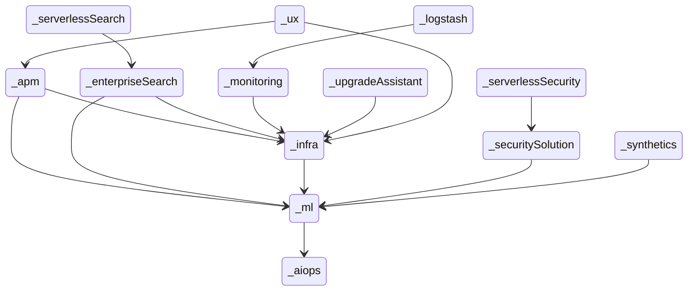


## alerting

```mermaid
stateDiagram
direction TB
accTitle: alerting dependency roots
  _apm --> _alerting
  _apm --> _cases
  _apm --> _exploratoryView
  _apm --> _fleet
  _apm --> _infra
  _apm --> _ml
  _apm --> _observability
  _apm --> _observabilityShared
  _apm --> _ruleRegistry
  _apm --> _triggersActionsUi
  _canvas --> _reporting
  _cases --> _ruleRegistry
  _cases --> _triggersActionsUi
  _cloudDefend --> _fleet
  _cloudSecurityPosture --> _discover
  _cloudSecurityPosture --> _fleet
  _crossClusterReplication --> _indexManagement
  _crossClusterReplication --> _remoteClusters
  _dataVisualizer --> _discover
  _discover --> _triggersActionsUi
  _discoverEnhanced --> _discover
  _enterpriseSearch --> _discover
  _enterpriseSearch --> _infra
  _enterpriseSearch --> _ml
  _exploratoryView --> _alerting
  _exploratoryView --> _cases
  _exploratoryView --> _discover
  _exploratoryView --> _observabilityShared
  _exploratoryView --> _triggersActionsUi
  _fleet --> _discover
  _indexLifecycleManagement --> _indexManagement
  _indexManagement --> _fleet
  _infra --> _alerting
  _infra --> _cases
  _infra --> _discover
  _infra --> _ml
  _infra --> _observability
  _infra --> _observabilityShared
  _infra --> _osquery
  _infra --> _ruleRegistry
  _infra --> _triggersActionsUi
  _kubernetesSecurity --> _ruleRegistry
  _kubernetesSecurity --> _sessionView
  _kubernetesSecurity --> _timelines
  _logstash --> _monitoring
  _ml --> _alerting
  _ml --> _cases
  _ml --> _dataVisualizer
  _ml --> _discover
  _ml --> _triggersActionsUi
  _monitoring --> _alerting
  _monitoring --> _fleet
  _monitoring --> _infra
  _monitoring --> _observability
  _monitoring --> _triggersActionsUi
  _observability --> _alerting
  _observability --> _cases
  _observability --> _discover
  _observability --> _exploratoryView
  _observability --> _observabilityShared
  _observability --> _ruleRegistry
  _observability --> _triggersActionsUi
  _observabilityOnboarding --> _observability
  _observabilityShared --> _cases
  _osquery --> _cases
  _osquery --> _discover
  _osquery --> _fleet
  _osquery --> _ruleRegistry
  _osquery --> _triggersActionsUi
  _profiling --> _fleet
  _profiling --> _observability
  _profiling --> _observabilityShared
  _remoteClusters --> _indexManagement
  _reporting --> _discover
  _rollup --> _indexManagement
  _ruleRegistry --> _alerting
  _ruleRegistry --> _triggersActionsUi
  _securitySolution --> _alerting
  _securitySolution --> _cases
  _securitySolution --> _cloudDefend
  _securitySolution --> _cloudSecurityPosture
  _securitySolution --> _fleet
  _securitySolution --> _kubernetesSecurity
  _securitySolution --> _ml
  _securitySolution --> _osquery
  _securitySolution --> _ruleRegistry
  _securitySolution --> _sessionView
  _securitySolution --> _threatIntelligence
  _securitySolution --> _timelines
  _securitySolution --> _triggersActionsUi
  _serverlessObservability --> _observabilityShared
  _serverlessSearch --> _enterpriseSearch
  _serverlessSecurity --> _securitySolution
  _sessionView --> _ruleRegistry
  _sessionView --> _timelines
  _stackAlerts --> _alerting
  _stackAlerts --> _triggersActionsUi
  _stackConnectors --> _triggersActionsUi
  _synthetics --> _alerting
  _synthetics --> _cases
  _synthetics --> _discover
  _synthetics --> _exploratoryView
  _synthetics --> _fleet
  _synthetics --> _ml
  _synthetics --> _observability
  _synthetics --> _observabilityShared
  _synthetics --> _ruleRegistry
  _synthetics --> _triggersActionsUi
  _threatIntelligence --> _cases
  _threatIntelligence --> _triggersActionsUi
  _timelines --> _alerting
  _timelines --> _cases
  _transform --> _alerting
  _transform --> _triggersActionsUi
  _triggersActionsUi --> _alerting
  _upgradeAssistant --> _infra
  _ux --> _apm
  _ux --> _exploratoryView
  _ux --> _infra
  _ux --> _observability
  _ux --> _observabilityShared
  _ux --> _triggersActionsUi
```


## apm

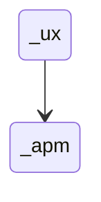


## bfetch

```mermaid
stateDiagram
direction TB
accTitle: bfetch dependency roots
  _aiops --> _data
  _aiops --> _lens
  _aiops --> _unifiedFieldList
  _alerting --> _data
  _apm --> _alerting
  _apm --> _cases
  _apm --> _data
  _apm --> _embeddable
  _apm --> _exploratoryView
  _apm --> _fleet
  _apm --> _infra
  _apm --> _lens
  _apm --> _maps
  _apm --> _ml
  _apm --> _observability
  _apm --> _observabilityShared
  _apm --> _ruleRegistry
  _apm --> _triggersActionsUi
  _apm --> _unifiedFieldList
  _apm --> _unifiedSearch
  _canvas --> _bfetch
  _canvas --> _data
  _canvas --> _embeddable
  _canvas --> _expressionError
  _canvas --> _expressionImage
  _canvas --> _expressionMetric
  _canvas --> _expressionRepeatImage
  _canvas --> _expressionRevealImage
  _canvas --> _expressionShape
  _canvas --> _presentationUtil
  _canvas --> _reporting
  _canvas --> _savedObjects
  _canvas --> _savedObjectsManagement
  _canvas --> _visualizations
  _cases --> _data
  _cases --> _embeddable
  _cases --> _lens
  _cases --> _ruleRegistry
  _cases --> _savedObjectsManagement
  _cases --> _triggersActionsUi
  _cloudDefend --> _data
  _cloudDefend --> _fleet
  _cloudDefend --> _navigation
  _cloudDefend --> _unifiedSearch
  _cloudSecurityPosture --> _data
  _cloudSecurityPosture --> _discover
  _cloudSecurityPosture --> _fleet
  _cloudSecurityPosture --> _navigation
  _cloudSecurityPosture --> _unifiedSearch
  _controls --> _data
  _controls --> _embeddable
  _controls --> _presentationUtil
  _controls --> _savedObjects
  _controls --> _unifiedSearch
  _crossClusterReplication --> _indexManagement
  _crossClusterReplication --> _remoteClusters
  _dashboard --> _controls
  _dashboard --> _data
  _dashboard --> _dataViewEditor
  _dashboard --> _embeddable
  _dashboard --> _navigation
  _dashboard --> _presentationUtil
  _dashboard --> _savedObjects
  _dashboard --> _savedObjectsManagement
  _dashboard --> _savedObjectsTaggingOss
  _dashboard --> _unifiedSearch
  _dashboard --> _visualizations
  _dashboardEnhanced --> _dashboard
  _dashboardEnhanced --> _data
  _dashboardEnhanced --> _embeddable
  _dashboardEnhanced --> _uiActionsEnhanced
  _dashboardEnhanced --> _unifiedSearch
  _data --> _bfetch
  _dataViewEditor --> _data
  _dataViewFieldEditor --> _data
  _dataViewManagement --> _data
  _dataViewManagement --> _dataViewEditor
  _dataViewManagement --> _dataViewFieldEditor
  _dataViewManagement --> _savedObjectsManagement
  _dataViewManagement --> _unifiedSearch
  _dataVisualizer --> _data
  _dataVisualizer --> _dataViewFieldEditor
  _dataVisualizer --> _discover
  _dataVisualizer --> _embeddable
  _dataVisualizer --> _fileUpload
  _dataVisualizer --> _lens
  _dataVisualizer --> _maps
  _dataVisualizer --> _unifiedSearch
  _discover --> _data
  _discover --> _dataViewEditor
  _discover --> _dataViewFieldEditor
  _discover --> _embeddable
  _discover --> _lens
  _discover --> _navigation
  _discover --> _savedObjects
  _discover --> _savedObjectsManagement
  _discover --> _savedObjectsTaggingOss
  _discover --> _triggersActionsUi
  _discover --> _unifiedFieldList
  _discover --> _unifiedSearch
  _discoverEnhanced --> _discover
  _discoverEnhanced --> _embeddable
  _ecsDataQualityDashboard --> _data
  _embeddable --> _data
  _embeddable --> _savedObjectsManagement
  _embeddable --> _savedObjectsTaggingOss
  _embeddableEnhanced --> _embeddable
  _embeddableEnhanced --> _uiActionsEnhanced
  _enterpriseSearch --> _data
  _enterpriseSearch --> _discover
  _enterpriseSearch --> _embeddable
  _enterpriseSearch --> _infra
  _enterpriseSearch --> _lens
  _enterpriseSearch --> _ml
  _eventAnnotation --> _data
  _exploratoryView --> _alerting
  _exploratoryView --> _cases
  _exploratoryView --> _data
  _exploratoryView --> _discover
  _exploratoryView --> _embeddable
  _exploratoryView --> _lens
  _exploratoryView --> _observabilityShared
  _exploratoryView --> _triggersActionsUi
  _exploratoryView --> _unifiedSearch
  _expressionError --> _presentationUtil
  _expressionGauge --> _data
  _expressionGauge --> _presentationUtil
  _expressionGauge --> _visualizations
  _expressionHeatmap --> _data
  _expressionHeatmap --> _presentationUtil
  _expressionHeatmap --> _visualizations
  _expressionImage --> _presentationUtil
  _expressionLegacyMetricVis --> _presentationUtil
  _expressionLegacyMetricVis --> _visualizations
  _expressionMetric --> _presentationUtil
  _expressionMetricVis --> _presentationUtil
  _expressionMetricVis --> _visualizations
  _expressionPartitionVis --> _data
  _expressionPartitionVis --> _presentationUtil
  _expressionPartitionVis --> _visualizations
  _expressionRepeatImage --> _presentationUtil
  _expressionRevealImage --> _presentationUtil
  _expressionShape --> _presentationUtil
  _expressionTagcloud --> _presentationUtil
  _expressionTagcloud --> _visualizations
  _expressionXY --> _data
  _expressionXY --> _eventAnnotation
  _expressionXY --> _visualizations
  _fileUpload --> _data
  _fleet --> _data
  _fleet --> _discover
  _fleet --> _ingestPipelines
  _fleet --> _navigation
  _fleet --> _savedObjectsTagging
  _fleet --> _unifiedSearch
  _globalSearchBar --> _savedObjectsTagging
  _graph --> _data
  _graph --> _navigation
  _graph --> _savedObjects
  _graph --> _savedObjectsManagement
  _graph --> _unifiedSearch
  _imageEmbeddable --> _embeddable
  _indexLifecycleManagement --> _indexManagement
  _indexManagement --> _fleet
  _infra --> _alerting
  _infra --> _cases
  _infra --> _data
  _infra --> _discover
  _infra --> _embeddable
  _infra --> _lens
  _infra --> _ml
  _infra --> _observability
  _infra --> _observabilityShared
  _infra --> _osquery
  _infra --> _ruleRegistry
  _infra --> _triggersActionsUi
  _infra --> _unifiedSearch
  _infra --> _visTypeTimeseries
  _ingestPipelines --> _fileUpload
  _inputControlVis --> _data
  _inputControlVis --> _unifiedSearch
  _inputControlVis --> _visDefaultEditor
  _inputControlVis --> _visualizations
  _kibanaOverview --> _dataViewEditor
  _kibanaOverview --> _navigation
  _kubernetesSecurity --> _data
  _kubernetesSecurity --> _ruleRegistry
  _kubernetesSecurity --> _sessionView
  _kubernetesSecurity --> _timelines
  _lens --> _dashboard
  _lens --> _data
  _lens --> _dataViewEditor
  _lens --> _dataViewFieldEditor
  _lens --> _embeddable
  _lens --> _eventAnnotation
  _lens --> _expressionGauge
  _lens --> _expressionHeatmap
  _lens --> _expressionLegacyMetricVis
  _lens --> _expressionMetricVis
  _lens --> _expressionPartitionVis
  _lens --> _expressionXY
  _lens --> _navigation
  _lens --> _presentationUtil
  _lens --> _savedObjectsTagging
  _lens --> _uiActionsEnhanced
  _lens --> _unifiedFieldList
  _lens --> _unifiedSearch
  _lens --> _visualizations
  _logstash --> _monitoring
  _maps --> _controls
  _maps --> _dashboard
  _maps --> _data
  _maps --> _embeddable
  _maps --> _fileUpload
  _maps --> _lens
  _maps --> _navigation
  _maps --> _presentationUtil
  _maps --> _savedObjects
  _maps --> _savedObjectsTagging
  _maps --> _unifiedSearch
  _maps --> _visualizations
  _ml --> _aiops
  _ml --> _alerting
  _ml --> _cases
  _ml --> _dashboard
  _ml --> _data
  _ml --> _dataVisualizer
  _ml --> _discover
  _ml --> _embeddable
  _ml --> _lens
  _ml --> _maps
  _ml --> _savedObjectsManagement
  _ml --> _triggersActionsUi
  _ml --> _unifiedSearch
  _monitoring --> _alerting
  _monitoring --> _dashboard
  _monitoring --> _data
  _monitoring --> _fleet
  _monitoring --> _infra
  _monitoring --> _navigation
  _monitoring --> _observability
  _monitoring --> _triggersActionsUi
  _monitoring --> _unifiedSearch
  _navigation --> _unifiedSearch
  _observability --> _alerting
  _observability --> _cases
  _observability --> _data
  _observability --> _discover
  _observability --> _embeddable
  _observability --> _exploratoryView
  _observability --> _lens
  _observability --> _observabilityShared
  _observability --> _ruleRegistry
  _observability --> _triggersActionsUi
  _observability --> _unifiedSearch
  _observability --> _visualizations
  _observabilityOnboarding --> _data
  _observabilityOnboarding --> _observability
  _observabilityShared --> _cases
  _osquery --> _cases
  _osquery --> _data
  _osquery --> _discover
  _osquery --> _fleet
  _osquery --> _lens
  _osquery --> _navigation
  _osquery --> _ruleRegistry
  _osquery --> _triggersActionsUi
  _presentationUtil --> _embeddable
  _presentationUtil --> _savedObjects
  _profiling --> _data
  _profiling --> _fleet
  _profiling --> _navigation
  _profiling --> _observability
  _profiling --> _observabilityShared
  _profiling --> _unifiedSearch
  _remoteClusters --> _indexManagement
  _reporting --> _data
  _reporting --> _discover
  _reporting --> _embeddable
  _rollup --> _indexManagement
  _rollup --> _visTypeTimeseries
  _ruleRegistry --> _alerting
  _ruleRegistry --> _data
  _ruleRegistry --> _triggersActionsUi
  _savedObjects --> _data
  _savedObjectsManagement --> _data
  _savedObjectsManagement --> _savedObjectsTaggingOss
  _savedObjectsTagging --> _savedObjectsTaggingOss
  _savedObjectsTaggingOss --> _savedObjects
  _savedSearch --> _data
  _securitySolution --> _alerting
  _securitySolution --> _cases
  _securitySolution --> _cloudDefend
  _securitySolution --> _cloudSecurityPosture
  _securitySolution --> _controls
  _securitySolution --> _dashboard
  _securitySolution --> _data
  _securitySolution --> _dataViewFieldEditor
  _securitySolution --> _ecsDataQualityDashboard
  _securitySolution --> _embeddable
  _securitySolution --> _fleet
  _securitySolution --> _kubernetesSecurity
  _securitySolution --> _lens
  _securitySolution --> _maps
  _securitySolution --> _ml
  _securitySolution --> _osquery
  _securitySolution --> _ruleRegistry
  _securitySolution --> _savedObjectsManagement
  _securitySolution --> _savedObjectsTaggingOss
  _securitySolution --> _sessionView
  _securitySolution --> _threatIntelligence
  _securitySolution --> _timelines
  _securitySolution --> _triggersActionsUi
  _securitySolution --> _unifiedSearch
  _serverlessObservability --> _observabilityShared
  _serverlessSearch --> _enterpriseSearch
  _serverlessSecurity --> _securitySolution
  _sessionView --> _data
  _sessionView --> _ruleRegistry
  _sessionView --> _timelines
  _stackAlerts --> _alerting
  _stackAlerts --> _data
  _stackAlerts --> _savedObjects
  _stackAlerts --> _triggersActionsUi
  _stackAlerts --> _unifiedSearch
  _stackConnectors --> _triggersActionsUi
  _synthetics --> _alerting
  _synthetics --> _bfetch
  _synthetics --> _cases
  _synthetics --> _data
  _synthetics --> _discover
  _synthetics --> _embeddable
  _synthetics --> _exploratoryView
  _synthetics --> _fleet
  _synthetics --> _ml
  _synthetics --> _observability
  _synthetics --> _observabilityShared
  _synthetics --> _ruleRegistry
  _synthetics --> _triggersActionsUi
  _synthetics --> _unifiedSearch
  _threatIntelligence --> _cases
  _threatIntelligence --> _data
  _threatIntelligence --> _navigation
  _threatIntelligence --> _triggersActionsUi
  _timelines --> _alerting
  _timelines --> _cases
  _timelines --> _data
  _transform --> _alerting
  _transform --> _data
  _transform --> _savedObjectsManagement
  _transform --> _triggersActionsUi
  _transform --> _unifiedSearch
  _triggersActionsUi --> _alerting
  _triggersActionsUi --> _data
  _triggersActionsUi --> _dataViewEditor
  _triggersActionsUi --> _savedObjects
  _triggersActionsUi --> _unifiedSearch
  _uiActionsEnhanced --> _embeddable
  _unifiedFieldList --> _data
  _unifiedSearch --> _data
  _unifiedSearch --> _savedObjectsManagement
  _upgradeAssistant --> _data
  _upgradeAssistant --> _infra
  _urlDrilldown --> _embeddable
  _urlDrilldown --> _uiActionsEnhanced
  _ux --> _apm
  _ux --> _data
  _ux --> _embeddable
  _ux --> _exploratoryView
  _ux --> _infra
  _ux --> _lens
  _ux --> _maps
  _ux --> _observability
  _ux --> _observabilityShared
  _ux --> _triggersActionsUi
  _visDefaultEditor --> _visualizations
  _visTypeGauge --> _data
  _visTypeGauge --> _expressionGauge
  _visTypeGauge --> _visualizations
  _visTypeHeatmap --> _data
  _visTypeHeatmap --> _visualizations
  _visTypeMarkdown --> _visualizations
  _visTypeMetric --> _data
  _visTypeMetric --> _visualizations
  _visTypePie --> _data
  _visTypePie --> _expressionPartitionVis
  _visTypePie --> _visualizations
  _visTypeTable --> _visualizations
  _visTypeTagcloud --> _data
  _visTypeTagcloud --> _visualizations
  _visTypeTimelion --> _data
  _visTypeTimelion --> _visualizations
  _visTypeTimeseries --> _data
  _visTypeTimeseries --> _unifiedSearch
  _visTypeTimeseries --> _visualizations
  _visTypeVega --> _data
  _visTypeVega --> _visualizations
  _visTypeVislib --> _data
  _visTypeVislib --> _visualizations
  _visTypeXy --> _data
  _visTypeXy --> _visualizations
  _visualizations --> _data
  _visualizations --> _dataViewEditor
  _visualizations --> _embeddable
  _visualizations --> _navigation
  _visualizations --> _presentationUtil
  _visualizations --> _savedObjects
  _visualizations --> _savedObjectsManagement
  _visualizations --> _savedObjectsTaggingOss
  _visualizations --> _unifiedSearch
  _watcher --> _data
```


## cases

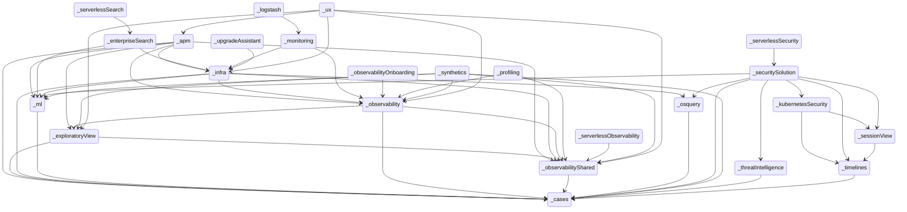


## charts

```mermaid
stateDiagram
direction TB
accTitle: charts dependency roots
  _aiops --> _charts
  _aiops --> _lens
  _aiops --> _unifiedFieldList
  _apm --> _cases
  _apm --> _charts
  _apm --> _exploratoryView
  _apm --> _fleet
  _apm --> _infra
  _apm --> _lens
  _apm --> _maps
  _apm --> _ml
  _apm --> _observability
  _apm --> _observabilityShared
  _apm --> _ruleRegistry
  _apm --> _triggersActionsUi
  _apm --> _unifiedFieldList
  _canvas --> _charts
  _canvas --> _reporting
  _canvas --> _visualizations
  _cases --> _lens
  _cases --> _ruleRegistry
  _cases --> _triggersActionsUi
  _cloudDefend --> _fleet
  _cloudSecurityPosture --> _charts
  _cloudSecurityPosture --> _discover
  _cloudSecurityPosture --> _fleet
  _crossClusterReplication --> _indexManagement
  _crossClusterReplication --> _remoteClusters
  _dashboard --> _visualizations
  _dashboardEnhanced --> _dashboard
  _dataVisualizer --> _charts
  _dataVisualizer --> _discover
  _dataVisualizer --> _lens
  _dataVisualizer --> _maps
  _discover --> _charts
  _discover --> _lens
  _discover --> _triggersActionsUi
  _discover --> _unifiedFieldList
  _discoverEnhanced --> _discover
  _enterpriseSearch --> _charts
  _enterpriseSearch --> _discover
  _enterpriseSearch --> _infra
  _enterpriseSearch --> _lens
  _enterpriseSearch --> _ml
  _exploratoryView --> _cases
  _exploratoryView --> _charts
  _exploratoryView --> _discover
  _exploratoryView --> _lens
  _exploratoryView --> _observabilityShared
  _exploratoryView --> _triggersActionsUi
  _expressionGauge --> _charts
  _expressionGauge --> _visualizations
  _expressionHeatmap --> _charts
  _expressionHeatmap --> _visualizations
  _expressionLegacyMetricVis --> _charts
  _expressionLegacyMetricVis --> _visualizations
  _expressionMetricVis --> _charts
  _expressionMetricVis --> _visualizations
  _expressionPartitionVis --> _charts
  _expressionPartitionVis --> _visualizations
  _expressionTagcloud --> _charts
  _expressionTagcloud --> _visualizations
  _expressionXY --> _charts
  _expressionXY --> _visualizations
  _fleet --> _discover
  _indexLifecycleManagement --> _indexManagement
  _indexManagement --> _fleet
  _infra --> _cases
  _infra --> _charts
  _infra --> _discover
  _infra --> _lens
  _infra --> _ml
  _infra --> _observability
  _infra --> _observabilityShared
  _infra --> _osquery
  _infra --> _ruleRegistry
  _infra --> _triggersActionsUi
  _infra --> _visTypeTimeseries
  _inputControlVis --> _visDefaultEditor
  _inputControlVis --> _visualizations
  _kubernetesSecurity --> _ruleRegistry
  _kubernetesSecurity --> _sessionView
  _kubernetesSecurity --> _timelines
  _lens --> _charts
  _lens --> _dashboard
  _lens --> _expressionGauge
  _lens --> _expressionHeatmap
  _lens --> _expressionLegacyMetricVis
  _lens --> _expressionMetricVis
  _lens --> _expressionPartitionVis
  _lens --> _expressionXY
  _lens --> _unifiedFieldList
  _lens --> _visualizations
  _logstash --> _monitoring
  _maps --> _charts
  _maps --> _dashboard
  _maps --> _lens
  _maps --> _visualizations
  _ml --> _aiops
  _ml --> _cases
  _ml --> _charts
  _ml --> _dashboard
  _ml --> _dataVisualizer
  _ml --> _discover
  _ml --> _lens
  _ml --> _maps
  _ml --> _triggersActionsUi
  _monitoring --> _dashboard
  _monitoring --> _fleet
  _monitoring --> _infra
  _monitoring --> _observability
  _monitoring --> _triggersActionsUi
  _observability --> _cases
  _observability --> _charts
  _observability --> _discover
  _observability --> _exploratoryView
  _observability --> _lens
  _observability --> _observabilityShared
  _observability --> _ruleRegistry
  _observability --> _triggersActionsUi
  _observability --> _visualizations
  _observabilityOnboarding --> _observability
  _observabilityShared --> _cases
  _osquery --> _cases
  _osquery --> _discover
  _osquery --> _fleet
  _osquery --> _lens
  _osquery --> _ruleRegistry
  _osquery --> _triggersActionsUi
  _profiling --> _charts
  _profiling --> _fleet
  _profiling --> _observability
  _profiling --> _observabilityShared
  _remoteClusters --> _indexManagement
  _reporting --> _discover
  _rollup --> _indexManagement
  _rollup --> _visTypeTimeseries
  _ruleRegistry --> _triggersActionsUi
  _securitySolution --> _cases
  _securitySolution --> _cloudDefend
  _securitySolution --> _cloudSecurityPosture
  _securitySolution --> _dashboard
  _securitySolution --> _fleet
  _securitySolution --> _kubernetesSecurity
  _securitySolution --> _lens
  _securitySolution --> _maps
  _securitySolution --> _ml
  _securitySolution --> _osquery
  _securitySolution --> _ruleRegistry
  _securitySolution --> _sessionView
  _securitySolution --> _threatIntelligence
  _securitySolution --> _timelines
  _securitySolution --> _triggersActionsUi
  _serverlessObservability --> _observabilityShared
  _serverlessSearch --> _enterpriseSearch
  _serverlessSecurity --> _securitySolution
  _sessionView --> _ruleRegistry
  _sessionView --> _timelines
  _stackAlerts --> _triggersActionsUi
  _stackConnectors --> _triggersActionsUi
  _synthetics --> _cases
  _synthetics --> _discover
  _synthetics --> _exploratoryView
  _synthetics --> _fleet
  _synthetics --> _ml
  _synthetics --> _observability
  _synthetics --> _observabilityShared
  _synthetics --> _ruleRegistry
  _synthetics --> _triggersActionsUi
  _threatIntelligence --> _cases
  _threatIntelligence --> _triggersActionsUi
  _timelines --> _cases
  _transform --> _charts
  _transform --> _triggersActionsUi
  _triggersActionsUi --> _charts
  _unifiedFieldList --> _charts
  _upgradeAssistant --> _infra
  _ux --> _apm
  _ux --> _exploratoryView
  _ux --> _infra
  _ux --> _lens
  _ux --> _maps
  _ux --> _observability
  _ux --> _observabilityShared
  _ux --> _triggersActionsUi
  _visDefaultEditor --> _visualizations
  _visTypeGauge --> _charts
  _visTypeGauge --> _expressionGauge
  _visTypeGauge --> _visualizations
  _visTypeHeatmap --> _charts
  _visTypeHeatmap --> _visualizations
  _visTypeMarkdown --> _visualizations
  _visTypeMetric --> _charts
  _visTypeMetric --> _visualizations
  _visTypePie --> _charts
  _visTypePie --> _expressionPartitionVis
  _visTypePie --> _visualizations
  _visTypeTable --> _visualizations
  _visTypeTagcloud --> _charts
  _visTypeTagcloud --> _visualizations
  _visTypeTimelion --> _charts
  _visTypeTimelion --> _visualizations
  _visTypeTimeseries --> _charts
  _visTypeTimeseries --> _visualizations
  _visTypeVega --> _visualizations
  _visTypeVislib --> _charts
  _visTypeVislib --> _visualizations
  _visTypeXy --> _charts
  _visTypeXy --> _visualizations
  _visualizations --> _charts
  _watcher --> _charts
```


## cloud

```mermaid
stateDiagram
direction TB
accTitle: cloud dependency roots
  _actions --> _encryptedSavedObjects
  _actions --> _eventLog
  _actions --> _security
  _actions --> _spaces
  _advancedSettings --> _home
  _advancedSettings --> _management
  _aiops --> _data
  _aiops --> _lens
  _aiops --> _unifiedFieldList
  _alerting --> _actions
  _alerting --> _data
  _alerting --> _encryptedSavedObjects
  _alerting --> _eventLog
  _alerting --> _management
  _alerting --> _security
  _alerting --> _spaces
  _apm --> _actions
  _apm --> _advancedSettings
  _apm --> _alerting
  _apm --> _cases
  _apm --> _cloud
  _apm --> _data
  _apm --> _embeddable
  _apm --> _exploratoryView
  _apm --> _fleet
  _apm --> _home
  _apm --> _infra
  _apm --> _lens
  _apm --> _maps
  _apm --> _ml
  _apm --> _observability
  _apm --> _observabilityShared
  _apm --> _ruleRegistry
  _apm --> _security
  _apm --> _spaces
  _apm --> _triggersActionsUi
  _apm --> _unifiedFieldList
  _apm --> _unifiedSearch
  _canvas --> _data
  _canvas --> _embeddable
  _canvas --> _expressionError
  _canvas --> _expressionImage
  _canvas --> _expressionMetric
  _canvas --> _expressionRepeatImage
  _canvas --> _expressionRevealImage
  _canvas --> _expressionShape
  _canvas --> _home
  _canvas --> _presentationUtil
  _canvas --> _reporting
  _canvas --> _savedObjects
  _canvas --> _savedObjectsManagement
  _canvas --> _spaces
  _canvas --> _visualizations
  _cases --> _actions
  _cases --> _data
  _cases --> _embeddable
  _cases --> _files
  _cases --> _home
  _cases --> _lens
  _cases --> _management
  _cases --> _notifications
  _cases --> _ruleRegistry
  _cases --> _savedObjectsManagement
  _cases --> _security
  _cases --> _spaces
  _cases --> _triggersActionsUi
  _cloudChat --> _cloud
  _cloudChat --> _security
  _cloudDataMigration --> _cloud
  _cloudDataMigration --> _management
  _cloudDefend --> _cloud
  _cloudDefend --> _data
  _cloudDefend --> _fleet
  _cloudDefend --> _navigation
  _cloudDefend --> _security
  _cloudDefend --> _unifiedSearch
  _cloudExperiments --> _cloud
  _cloudFullStory --> _cloud
  _cloudFullStory --> _security
  _cloudGainsight --> _cloud
  _cloudLinks --> _cloud
  _cloudLinks --> _guidedOnboarding
  _cloudLinks --> _security
  _cloudSecurityPosture --> _cloud
  _cloudSecurityPosture --> _data
  _cloudSecurityPosture --> _discover
  _cloudSecurityPosture --> _fleet
  _cloudSecurityPosture --> _navigation
  _cloudSecurityPosture --> _security
  _cloudSecurityPosture --> _unifiedSearch
  _console --> _home
  _controls --> _data
  _controls --> _embeddable
  _controls --> _presentationUtil
  _controls --> _savedObjects
  _controls --> _unifiedSearch
  _crossClusterReplication --> _home
  _crossClusterReplication --> _indexManagement
  _crossClusterReplication --> _management
  _crossClusterReplication --> _remoteClusters
  _dashboard --> _controls
  _dashboard --> _data
  _dashboard --> _dataViewEditor
  _dashboard --> _embeddable
  _dashboard --> _home
  _dashboard --> _navigation
  _dashboard --> _presentationUtil
  _dashboard --> _savedObjects
  _dashboard --> _savedObjectsManagement
  _dashboard --> _savedObjectsTaggingOss
  _dashboard --> _spaces
  _dashboard --> _unifiedSearch
  _dashboard --> _visualizations
  _dashboardEnhanced --> _dashboard
  _dashboardEnhanced --> _data
  _dashboardEnhanced --> _embeddable
  _dashboardEnhanced --> _uiActionsEnhanced
  _dashboardEnhanced --> _unifiedSearch
  _data --> _management
  _data --> _security
  _dataViewEditor --> _data
  _dataViewFieldEditor --> _data
  _dataViewManagement --> _data
  _dataViewManagement --> _dataViewEditor
  _dataViewManagement --> _dataViewFieldEditor
  _dataViewManagement --> _management
  _dataViewManagement --> _savedObjectsManagement
  _dataViewManagement --> _spaces
  _dataViewManagement --> _unifiedSearch
  _dataVisualizer --> _cloud
  _dataVisualizer --> _data
  _dataVisualizer --> _dataViewFieldEditor
  _dataVisualizer --> _discover
  _dataVisualizer --> _embeddable
  _dataVisualizer --> _fileUpload
  _dataVisualizer --> _home
  _dataVisualizer --> _lens
  _dataVisualizer --> _maps
  _dataVisualizer --> _security
  _dataVisualizer --> _unifiedSearch
  _discover --> _data
  _discover --> _dataViewEditor
  _discover --> _dataViewFieldEditor
  _discover --> _embeddable
  _discover --> _home
  _discover --> _lens
  _discover --> _navigation
  _discover --> _savedObjects
  _discover --> _savedObjectsManagement
  _discover --> _savedObjectsTaggingOss
  _discover --> _spaces
  _discover --> _triggersActionsUi
  _discover --> _unifiedFieldList
  _discover --> _unifiedSearch
  _discoverEnhanced --> _discover
  _discoverEnhanced --> _embeddable
  _ecsDataQualityDashboard --> _data
  _embeddable --> _data
  _embeddable --> _savedObjectsManagement
  _embeddable --> _savedObjectsTaggingOss
  _embeddableEnhanced --> _embeddable
  _embeddableEnhanced --> _uiActionsEnhanced
  _encryptedSavedObjects --> _security
  _enterpriseSearch --> _cloud
  _enterpriseSearch --> _data
  _enterpriseSearch --> _discover
  _enterpriseSearch --> _embeddable
  _enterpriseSearch --> _guidedOnboarding
  _enterpriseSearch --> _home
  _enterpriseSearch --> _infra
  _enterpriseSearch --> _lens
  _enterpriseSearch --> _ml
  _enterpriseSearch --> _security
  _enterpriseSearch --> _spaces
  _eventAnnotation --> _data
  _eventLog --> _spaces
  _exploratoryView --> _alerting
  _exploratoryView --> _cases
  _exploratoryView --> _data
  _exploratoryView --> _discover
  _exploratoryView --> _embeddable
  _exploratoryView --> _files
  _exploratoryView --> _guidedOnboarding
  _exploratoryView --> _home
  _exploratoryView --> _lens
  _exploratoryView --> _observabilityShared
  _exploratoryView --> _security
  _exploratoryView --> _spaces
  _exploratoryView --> _triggersActionsUi
  _exploratoryView --> _unifiedSearch
  _expressionError --> _presentationUtil
  _expressionGauge --> _data
  _expressionGauge --> _presentationUtil
  _expressionGauge --> _visualizations
  _expressionHeatmap --> _data
  _expressionHeatmap --> _presentationUtil
  _expressionHeatmap --> _visualizations
  _expressionImage --> _presentationUtil
  _expressionLegacyMetricVis --> _presentationUtil
  _expressionLegacyMetricVis --> _visualizations
  _expressionMetric --> _presentationUtil
  _expressionMetricVis --> _presentationUtil
  _expressionMetricVis --> _visualizations
  _expressionPartitionVis --> _data
  _expressionPartitionVis --> _presentationUtil
  _expressionPartitionVis --> _visualizations
  _expressionRepeatImage --> _presentationUtil
  _expressionRevealImage --> _presentationUtil
  _expressionShape --> _presentationUtil
  _expressionTagcloud --> _presentationUtil
  _expressionTagcloud --> _visualizations
  _expressionXY --> _data
  _expressionXY --> _eventAnnotation
  _expressionXY --> _visualizations
  _fileUpload --> _data
  _fileUpload --> _security
  _files --> _security
  _filesManagement --> _files
  _filesManagement --> _management
  _fleet --> _cloud
  _fleet --> _data
  _fleet --> _discover
  _fleet --> _encryptedSavedObjects
  _fleet --> _files
  _fleet --> _guidedOnboarding
  _fleet --> _home
  _fleet --> _ingestPipelines
  _fleet --> _navigation
  _fleet --> _savedObjectsTagging
  _fleet --> _security
  _fleet --> _spaces
  _fleet --> _telemetry
  _fleet --> _unifiedSearch
  _globalSearchBar --> _savedObjectsTagging
  _graph --> _data
  _graph --> _home
  _graph --> _navigation
  _graph --> _savedObjects
  _graph --> _savedObjectsManagement
  _graph --> _spaces
  _graph --> _unifiedSearch
  _grokdebugger --> _home
  _guidedOnboarding --> _cloud
  _home --> _cloud
  _home --> _guidedOnboarding
  _imageEmbeddable --> _embeddable
  _imageEmbeddable --> _files
  _imageEmbeddable --> _security
  _indexLifecycleManagement --> _cloud
  _indexLifecycleManagement --> _home
  _indexLifecycleManagement --> _indexManagement
  _indexLifecycleManagement --> _management
  _indexManagement --> _fleet
  _indexManagement --> _home
  _indexManagement --> _management
  _indexManagement --> _security
  _infra --> _alerting
  _infra --> _cases
  _infra --> _data
  _infra --> _discover
  _infra --> _embeddable
  _infra --> _home
  _infra --> _lens
  _infra --> _ml
  _infra --> _observability
  _infra --> _observabilityShared
  _infra --> _osquery
  _infra --> _ruleRegistry
  _infra --> _security
  _infra --> _spaces
  _infra --> _triggersActionsUi
  _infra --> _unifiedSearch
  _infra --> _visTypeTimeseries
  _ingestPipelines --> _fileUpload
  _ingestPipelines --> _management
  _ingestPipelines --> _security
  _inputControlVis --> _data
  _inputControlVis --> _unifiedSearch
  _inputControlVis --> _visDefaultEditor
  _inputControlVis --> _visualizations
  _kibanaOverview --> _dataViewEditor
  _kibanaOverview --> _home
  _kibanaOverview --> _navigation
  _kubernetesSecurity --> _data
  _kubernetesSecurity --> _ruleRegistry
  _kubernetesSecurity --> _sessionView
  _kubernetesSecurity --> _timelines
  _lens --> _dashboard
  _lens --> _data
  _lens --> _dataViewEditor
  _lens --> _dataViewFieldEditor
  _lens --> _embeddable
  _lens --> _eventAnnotation
  _lens --> _expressionGauge
  _lens --> _expressionHeatmap
  _lens --> _expressionLegacyMetricVis
  _lens --> _expressionMetricVis
  _lens --> _expressionPartitionVis
  _lens --> _expressionXY
  _lens --> _navigation
  _lens --> _presentationUtil
  _lens --> _savedObjectsTagging
  _lens --> _spaces
  _lens --> _uiActionsEnhanced
  _lens --> _unifiedFieldList
  _lens --> _unifiedSearch
  _lens --> _visualizations
  _licenseManagement --> _home
  _licenseManagement --> _management
  _licenseManagement --> _telemetry
  _lists --> _security
  _lists --> _spaces
  _logstash --> _home
  _logstash --> _management
  _logstash --> _monitoring
  _logstash --> _security
  _management --> _home
  _maps --> _cloud
  _maps --> _controls
  _maps --> _dashboard
  _maps --> _data
  _maps --> _embeddable
  _maps --> _fileUpload
  _maps --> _home
  _maps --> _lens
  _maps --> _navigation
  _maps --> _presentationUtil
  _maps --> _savedObjects
  _maps --> _savedObjectsTagging
  _maps --> _security
  _maps --> _spaces
  _maps --> _unifiedSearch
  _maps --> _visualizations
  _ml --> _aiops
  _ml --> _alerting
  _ml --> _cases
  _ml --> _cloud
  _ml --> _dashboard
  _ml --> _data
  _ml --> _dataVisualizer
  _ml --> _discover
  _ml --> _embeddable
  _ml --> _home
  _ml --> _lens
  _ml --> _licenseManagement
  _ml --> _management
  _ml --> _maps
  _ml --> _savedObjectsManagement
  _ml --> _security
  _ml --> _spaces
  _ml --> _triggersActionsUi
  _ml --> _unifiedSearch
  _monitoring --> _actions
  _monitoring --> _alerting
  _monitoring --> _cloud
  _monitoring --> _dashboard
  _monitoring --> _data
  _monitoring --> _encryptedSavedObjects
  _monitoring --> _fleet
  _monitoring --> _home
  _monitoring --> _infra
  _monitoring --> _navigation
  _monitoring --> _observability
  _monitoring --> _triggersActionsUi
  _monitoring --> _unifiedSearch
  _navigation --> _unifiedSearch
  _notifications --> _actions
  _observability --> _alerting
  _observability --> _cases
  _observability --> _data
  _observability --> _discover
  _observability --> _embeddable
  _observability --> _exploratoryView
  _observability --> _files
  _observability --> _guidedOnboarding
  _observability --> _home
  _observability --> _lens
  _observability --> _observabilityShared
  _observability --> _ruleRegistry
  _observability --> _security
  _observability --> _spaces
  _observability --> _triggersActionsUi
  _observability --> _unifiedSearch
  _observability --> _visualizations
  _observabilityOnboarding --> _cloud
  _observabilityOnboarding --> _data
  _observabilityOnboarding --> _observability
  _observabilityShared --> _cases
  _observabilityShared --> _guidedOnboarding
  _osquery --> _actions
  _osquery --> _cases
  _osquery --> _data
  _osquery --> _discover
  _osquery --> _fleet
  _osquery --> _home
  _osquery --> _lens
  _osquery --> _navigation
  _osquery --> _ruleRegistry
  _osquery --> _security
  _osquery --> _telemetry
  _osquery --> _triggersActionsUi
  _painlessLab --> _home
  _presentationUtil --> _embeddable
  _presentationUtil --> _savedObjects
  _profiling --> _cloud
  _profiling --> _data
  _profiling --> _fleet
  _profiling --> _navigation
  _profiling --> _observability
  _profiling --> _observabilityShared
  _profiling --> _spaces
  _profiling --> _unifiedSearch
  _remoteClusters --> _cloud
  _remoteClusters --> _indexManagement
  _remoteClusters --> _management
  _reporting --> _data
  _reporting --> _discover
  _reporting --> _embeddable
  _reporting --> _home
  _reporting --> _management
  _reporting --> _screenshotting
  _reporting --> _security
  _reporting --> _spaces
  _rollup --> _home
  _rollup --> _indexManagement
  _rollup --> _management
  _rollup --> _visTypeTimeseries
  _ruleRegistry --> _alerting
  _ruleRegistry --> _data
  _ruleRegistry --> _security
  _ruleRegistry --> _spaces
  _ruleRegistry --> _triggersActionsUi
  _savedObjects --> _data
  _savedObjectsManagement --> _data
  _savedObjectsManagement --> _home
  _savedObjectsManagement --> _management
  _savedObjectsManagement --> _savedObjectsTaggingOss
  _savedObjectsManagement --> _spaces
  _savedObjectsTagging --> _management
  _savedObjectsTagging --> _savedObjectsTaggingOss
  _savedObjectsTagging --> _security
  _savedObjectsTaggingOss --> _savedObjects
  _savedSearch --> _data
  _screenshotting --> _cloud
  _searchprofiler --> _home
  _security --> _cloud
  _security --> _home
  _security --> _management
  _security --> _spaces
  _securitySolution --> _actions
  _securitySolution --> _alerting
  _securitySolution --> _cases
  _securitySolution --> _cloud
  _securitySolution --> _cloudDefend
  _securitySolution --> _cloudExperiments
  _securitySolution --> _cloudSecurityPosture
  _securitySolution --> _controls
  _securitySolution --> _dashboard
  _securitySolution --> _data
  _securitySolution --> _dataViewFieldEditor
  _securitySolution --> _ecsDataQualityDashboard
  _securitySolution --> _embeddable
  _securitySolution --> _encryptedSavedObjects
  _securitySolution --> _eventLog
  _securitySolution --> _files
  _securitySolution --> _fleet
  _securitySolution --> _guidedOnboarding
  _securitySolution --> _home
  _securitySolution --> _kubernetesSecurity
  _securitySolution --> _lens
  _securitySolution --> _lists
  _securitySolution --> _maps
  _securitySolution --> _ml
  _securitySolution --> _osquery
  _securitySolution --> _ruleRegistry
  _securitySolution --> _savedObjectsManagement
  _securitySolution --> _savedObjectsTaggingOss
  _securitySolution --> _security
  _securitySolution --> _sessionView
  _securitySolution --> _spaces
  _securitySolution --> _telemetry
  _securitySolution --> _threatIntelligence
  _securitySolution --> _timelines
  _securitySolution --> _triggersActionsUi
  _securitySolution --> _unifiedSearch
  _serverless --> _management
  _serverlessObservability --> _observabilityShared
  _serverlessObservability --> _serverless
  _serverlessSearch --> _enterpriseSearch
  _serverlessSearch --> _management
  _serverlessSearch --> _serverless
  _serverlessSecurity --> _security
  _serverlessSecurity --> _securitySolution
  _serverlessSecurity --> _serverless
  _sessionView --> _data
  _sessionView --> _ruleRegistry
  _sessionView --> _timelines
  _snapshotRestore --> _cloud
  _snapshotRestore --> _home
  _snapshotRestore --> _management
  _snapshotRestore --> _security
  _spaces --> _advancedSettings
  _spaces --> _home
  _spaces --> _management
  _stackAlerts --> _alerting
  _stackAlerts --> _data
  _stackAlerts --> _savedObjects
  _stackAlerts --> _triggersActionsUi
  _stackAlerts --> _unifiedSearch
  _stackConnectors --> _actions
  _stackConnectors --> _triggersActionsUi
  _synthetics --> _actions
  _synthetics --> _alerting
  _synthetics --> _cases
  _synthetics --> _cloud
  _synthetics --> _data
  _synthetics --> _discover
  _synthetics --> _embeddable
  _synthetics --> _encryptedSavedObjects
  _synthetics --> _exploratoryView
  _synthetics --> _fleet
  _synthetics --> _home
  _synthetics --> _ml
  _synthetics --> _observability
  _synthetics --> _observabilityShared
  _synthetics --> _ruleRegistry
  _synthetics --> _security
  _synthetics --> _spaces
  _synthetics --> _telemetry
  _synthetics --> _triggersActionsUi
  _synthetics --> _unifiedSearch
  _telemetry --> _home
  _telemetry --> _security
  _telemetryManagementSection --> _advancedSettings
  _telemetryManagementSection --> _telemetry
  _threatIntelligence --> _cases
  _threatIntelligence --> _data
  _threatIntelligence --> _navigation
  _threatIntelligence --> _triggersActionsUi
  _timelines --> _alerting
  _timelines --> _cases
  _timelines --> _data
  _timelines --> _security
  _transform --> _alerting
  _transform --> _data
  _transform --> _home
  _transform --> _management
  _transform --> _savedObjectsManagement
  _transform --> _security
  _transform --> _spaces
  _transform --> _triggersActionsUi
  _transform --> _unifiedSearch
  _triggersActionsUi --> _actions
  _triggersActionsUi --> _alerting
  _triggersActionsUi --> _cloud
  _triggersActionsUi --> _data
  _triggersActionsUi --> _dataViewEditor
  _triggersActionsUi --> _home
  _triggersActionsUi --> _management
  _triggersActionsUi --> _savedObjects
  _triggersActionsUi --> _spaces
  _triggersActionsUi --> _unifiedSearch
  _uiActionsEnhanced --> _embeddable
  _unifiedFieldList --> _data
  _unifiedSearch --> _data
  _unifiedSearch --> _savedObjectsManagement
  _upgradeAssistant --> _cloud
  _upgradeAssistant --> _data
  _upgradeAssistant --> _infra
  _upgradeAssistant --> _management
  _upgradeAssistant --> _security
  _urlDrilldown --> _embeddable
  _urlDrilldown --> _uiActionsEnhanced
  _ux --> _actions
  _ux --> _apm
  _ux --> _cloud
  _ux --> _data
  _ux --> _embeddable
  _ux --> _exploratoryView
  _ux --> _infra
  _ux --> _lens
  _ux --> _maps
  _ux --> _observability
  _ux --> _observabilityShared
  _ux --> _security
  _ux --> _triggersActionsUi
  _visDefaultEditor --> _visualizations
  _visTypeGauge --> _data
  _visTypeGauge --> _expressionGauge
  _visTypeGauge --> _visualizations
  _visTypeHeatmap --> _data
  _visTypeHeatmap --> _visualizations
  _visTypeMarkdown --> _visualizations
  _visTypeMetric --> _data
  _visTypeMetric --> _visualizations
  _visTypePie --> _data
  _visTypePie --> _expressionPartitionVis
  _visTypePie --> _visualizations
  _visTypeTable --> _visualizations
  _visTypeTagcloud --> _data
  _visTypeTagcloud --> _visualizations
  _visTypeTimelion --> _data
  _visTypeTimelion --> _visualizations
  _visTypeTimeseries --> _data
  _visTypeTimeseries --> _home
  _visTypeTimeseries --> _unifiedSearch
  _visTypeTimeseries --> _visualizations
  _visTypeVega --> _data
  _visTypeVega --> _home
  _visTypeVega --> _visualizations
  _visTypeVislib --> _data
  _visTypeVislib --> _visualizations
  _visTypeXy --> _data
  _visTypeXy --> _visualizations
  _visualizations --> _data
  _visualizations --> _dataViewEditor
  _visualizations --> _embeddable
  _visualizations --> _home
  _visualizations --> _navigation
  _visualizations --> _presentationUtil
  _visualizations --> _savedObjects
  _visualizations --> _savedObjectsManagement
  _visualizations --> _savedObjectsTaggingOss
  _visualizations --> _spaces
  _visualizations --> _unifiedSearch
  _watcher --> _data
  _watcher --> _home
  _watcher --> _licenseManagement
  _watcher --> _management
```


## cloudDefend

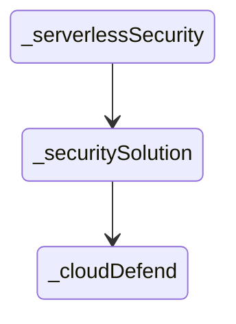


## cloudSecurityPosture

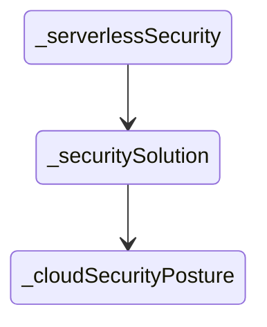


## contentManagement

```mermaid
stateDiagram
direction TB
accTitle: contentManagement dependency roots
  _aiops --> _lens
  _apm --> _cases
  _apm --> _exploratoryView
  _apm --> _fleet
  _apm --> _infra
  _apm --> _lens
  _apm --> _maps
  _apm --> _ml
  _apm --> _observability
  _apm --> _observabilityShared
  _canvas --> _reporting
  _canvas --> _visualizations
  _cases --> _lens
  _cloudDefend --> _fleet
  _cloudSecurityPosture --> _discover
  _cloudSecurityPosture --> _fleet
  _crossClusterReplication --> _indexManagement
  _crossClusterReplication --> _remoteClusters
  _dashboard --> _visualizations
  _dashboardEnhanced --> _dashboard
  _dataVisualizer --> _discover
  _dataVisualizer --> _lens
  _dataVisualizer --> _maps
  _discover --> _lens
  _discoverEnhanced --> _discover
  _enterpriseSearch --> _discover
  _enterpriseSearch --> _infra
  _enterpriseSearch --> _lens
  _enterpriseSearch --> _ml
  _exploratoryView --> _cases
  _exploratoryView --> _discover
  _exploratoryView --> _lens
  _exploratoryView --> _observabilityShared
  _expressionGauge --> _visualizations
  _expressionHeatmap --> _visualizations
  _expressionLegacyMetricVis --> _visualizations
  _expressionMetricVis --> _visualizations
  _expressionPartitionVis --> _visualizations
  _expressionTagcloud --> _visualizations
  _expressionXY --> _visualizations
  _fleet --> _discover
  _indexLifecycleManagement --> _indexManagement
  _indexManagement --> _fleet
  _infra --> _cases
  _infra --> _discover
  _infra --> _lens
  _infra --> _ml
  _infra --> _observability
  _infra --> _observabilityShared
  _infra --> _osquery
  _infra --> _visTypeTimeseries
  _inputControlVis --> _visDefaultEditor
  _inputControlVis --> _visualizations
  _kubernetesSecurity --> _sessionView
  _kubernetesSecurity --> _timelines
  _lens --> _contentManagement
  _lens --> _dashboard
  _lens --> _expressionGauge
  _lens --> _expressionHeatmap
  _lens --> _expressionLegacyMetricVis
  _lens --> _expressionMetricVis
  _lens --> _expressionPartitionVis
  _lens --> _expressionXY
  _lens --> _visualizations
  _logstash --> _monitoring
  _maps --> _contentManagement
  _maps --> _dashboard
  _maps --> _lens
  _maps --> _visualizations
  _ml --> _aiops
  _ml --> _cases
  _ml --> _dashboard
  _ml --> _dataVisualizer
  _ml --> _discover
  _ml --> _lens
  _ml --> _maps
  _monitoring --> _dashboard
  _monitoring --> _fleet
  _monitoring --> _infra
  _monitoring --> _observability
  _observability --> _cases
  _observability --> _discover
  _observability --> _exploratoryView
  _observability --> _lens
  _observability --> _observabilityShared
  _observability --> _visualizations
  _observabilityOnboarding --> _observability
  _observabilityShared --> _cases
  _osquery --> _cases
  _osquery --> _discover
  _osquery --> _fleet
  _osquery --> _lens
  _profiling --> _fleet
  _profiling --> _observability
  _profiling --> _observabilityShared
  _remoteClusters --> _indexManagement
  _reporting --> _discover
  _rollup --> _indexManagement
  _rollup --> _visTypeTimeseries
  _securitySolution --> _cases
  _securitySolution --> _cloudDefend
  _securitySolution --> _cloudSecurityPosture
  _securitySolution --> _dashboard
  _securitySolution --> _fleet
  _securitySolution --> _kubernetesSecurity
  _securitySolution --> _lens
  _securitySolution --> _maps
  _securitySolution --> _ml
  _securitySolution --> _osquery
  _securitySolution --> _sessionView
  _securitySolution --> _threatIntelligence
  _securitySolution --> _timelines
  _serverlessObservability --> _observabilityShared
  _serverlessSearch --> _enterpriseSearch
  _serverlessSecurity --> _securitySolution
  _sessionView --> _timelines
  _synthetics --> _cases
  _synthetics --> _discover
  _synthetics --> _exploratoryView
  _synthetics --> _fleet
  _synthetics --> _ml
  _synthetics --> _observability
  _synthetics --> _observabilityShared
  _threatIntelligence --> _cases
  _timelines --> _cases
  _upgradeAssistant --> _infra
  _ux --> _apm
  _ux --> _exploratoryView
  _ux --> _infra
  _ux --> _lens
  _ux --> _maps
  _ux --> _observability
  _ux --> _observabilityShared
  _visDefaultEditor --> _visualizations
  _visTypeGauge --> _expressionGauge
  _visTypeGauge --> _visualizations
  _visTypeHeatmap --> _visualizations
  _visTypeMarkdown --> _visualizations
  _visTypeMetric --> _visualizations
  _visTypePie --> _expressionPartitionVis
  _visTypePie --> _visualizations
  _visTypeTable --> _visualizations
  _visTypeTagcloud --> _visualizations
  _visTypeTimelion --> _visualizations
  _visTypeTimeseries --> _visualizations
  _visTypeVega --> _visualizations
  _visTypeVislib --> _visualizations
  _visTypeXy --> _visualizations
  _visualizations --> _contentManagement
```


## controls

```mermaid
stateDiagram
direction TB
accTitle: controls dependency roots
  _aiops --> _lens
  _apm --> _cases
  _apm --> _exploratoryView
  _apm --> _fleet
  _apm --> _infra
  _apm --> _lens
  _apm --> _maps
  _apm --> _ml
  _apm --> _observability
  _apm --> _observabilityShared
  _canvas --> _reporting
  _cases --> _lens
  _cloudDefend --> _fleet
  _cloudSecurityPosture --> _discover
  _cloudSecurityPosture --> _fleet
  _crossClusterReplication --> _indexManagement
  _crossClusterReplication --> _remoteClusters
  _dashboard --> _controls
  _dashboardEnhanced --> _dashboard
  _dataVisualizer --> _discover
  _dataVisualizer --> _lens
  _dataVisualizer --> _maps
  _discover --> _lens
  _discoverEnhanced --> _discover
  _enterpriseSearch --> _discover
  _enterpriseSearch --> _infra
  _enterpriseSearch --> _lens
  _enterpriseSearch --> _ml
  _exploratoryView --> _cases
  _exploratoryView --> _discover
  _exploratoryView --> _lens
  _exploratoryView --> _observabilityShared
  _fleet --> _discover
  _indexLifecycleManagement --> _indexManagement
  _indexManagement --> _fleet
  _infra --> _cases
  _infra --> _discover
  _infra --> _lens
  _infra --> _ml
  _infra --> _observability
  _infra --> _observabilityShared
  _infra --> _osquery
  _kubernetesSecurity --> _sessionView
  _kubernetesSecurity --> _timelines
  _lens --> _dashboard
  _logstash --> _monitoring
  _maps --> _controls
  _maps --> _dashboard
  _maps --> _lens
  _ml --> _aiops
  _ml --> _cases
  _ml --> _dashboard
  _ml --> _dataVisualizer
  _ml --> _discover
  _ml --> _lens
  _ml --> _maps
  _monitoring --> _dashboard
  _monitoring --> _fleet
  _monitoring --> _infra
  _monitoring --> _observability
  _observability --> _cases
  _observability --> _discover
  _observability --> _exploratoryView
  _observability --> _lens
  _observability --> _observabilityShared
  _observabilityOnboarding --> _observability
  _observabilityShared --> _cases
  _osquery --> _cases
  _osquery --> _discover
  _osquery --> _fleet
  _osquery --> _lens
  _profiling --> _fleet
  _profiling --> _observability
  _profiling --> _observabilityShared
  _remoteClusters --> _indexManagement
  _reporting --> _discover
  _rollup --> _indexManagement
  _securitySolution --> _cases
  _securitySolution --> _cloudDefend
  _securitySolution --> _cloudSecurityPosture
  _securitySolution --> _controls
  _securitySolution --> _dashboard
  _securitySolution --> _fleet
  _securitySolution --> _kubernetesSecurity
  _securitySolution --> _lens
  _securitySolution --> _maps
  _securitySolution --> _ml
  _securitySolution --> _osquery
  _securitySolution --> _sessionView
  _securitySolution --> _threatIntelligence
  _securitySolution --> _timelines
  _serverlessObservability --> _observabilityShared
  _serverlessSearch --> _enterpriseSearch
  _serverlessSecurity --> _securitySolution
  _sessionView --> _timelines
  _synthetics --> _cases
  _synthetics --> _discover
  _synthetics --> _exploratoryView
  _synthetics --> _fleet
  _synthetics --> _ml
  _synthetics --> _observability
  _synthetics --> _observabilityShared
  _threatIntelligence --> _cases
  _timelines --> _cases
  _upgradeAssistant --> _infra
  _ux --> _apm
  _ux --> _exploratoryView
  _ux --> _infra
  _ux --> _lens
  _ux --> _maps
  _ux --> _observability
  _ux --> _observabilityShared
```


## customIntegrations

```mermaid
stateDiagram
direction TB
accTitle: customIntegrations dependency roots
  _actions --> _encryptedSavedObjects
  _actions --> _eventLog
  _actions --> _security
  _actions --> _spaces
  _advancedSettings --> _home
  _advancedSettings --> _management
  _aiops --> _data
  _aiops --> _lens
  _aiops --> _unifiedFieldList
  _alerting --> _actions
  _alerting --> _data
  _alerting --> _encryptedSavedObjects
  _alerting --> _eventLog
  _alerting --> _management
  _alerting --> _security
  _alerting --> _spaces
  _apm --> _actions
  _apm --> _advancedSettings
  _apm --> _alerting
  _apm --> _cases
  _apm --> _data
  _apm --> _embeddable
  _apm --> _exploratoryView
  _apm --> _fleet
  _apm --> _home
  _apm --> _infra
  _apm --> _lens
  _apm --> _maps
  _apm --> _ml
  _apm --> _observability
  _apm --> _observabilityShared
  _apm --> _ruleRegistry
  _apm --> _security
  _apm --> _spaces
  _apm --> _triggersActionsUi
  _apm --> _unifiedFieldList
  _apm --> _unifiedSearch
  _canvas --> _data
  _canvas --> _embeddable
  _canvas --> _expressionError
  _canvas --> _expressionImage
  _canvas --> _expressionMetric
  _canvas --> _expressionRepeatImage
  _canvas --> _expressionRevealImage
  _canvas --> _expressionShape
  _canvas --> _home
  _canvas --> _presentationUtil
  _canvas --> _reporting
  _canvas --> _savedObjects
  _canvas --> _savedObjectsManagement
  _canvas --> _spaces
  _canvas --> _visualizations
  _cases --> _actions
  _cases --> _data
  _cases --> _embeddable
  _cases --> _files
  _cases --> _home
  _cases --> _lens
  _cases --> _management
  _cases --> _notifications
  _cases --> _ruleRegistry
  _cases --> _savedObjectsManagement
  _cases --> _security
  _cases --> _spaces
  _cases --> _triggersActionsUi
  _cloudChat --> _security
  _cloudDataMigration --> _management
  _cloudDefend --> _data
  _cloudDefend --> _fleet
  _cloudDefend --> _navigation
  _cloudDefend --> _security
  _cloudDefend --> _unifiedSearch
  _cloudFullStory --> _security
  _cloudLinks --> _security
  _cloudSecurityPosture --> _data
  _cloudSecurityPosture --> _discover
  _cloudSecurityPosture --> _fleet
  _cloudSecurityPosture --> _navigation
  _cloudSecurityPosture --> _security
  _cloudSecurityPosture --> _unifiedSearch
  _console --> _home
  _controls --> _data
  _controls --> _embeddable
  _controls --> _presentationUtil
  _controls --> _savedObjects
  _controls --> _unifiedSearch
  _crossClusterReplication --> _home
  _crossClusterReplication --> _indexManagement
  _crossClusterReplication --> _management
  _crossClusterReplication --> _remoteClusters
  _dashboard --> _controls
  _dashboard --> _data
  _dashboard --> _dataViewEditor
  _dashboard --> _embeddable
  _dashboard --> _home
  _dashboard --> _navigation
  _dashboard --> _presentationUtil
  _dashboard --> _savedObjects
  _dashboard --> _savedObjectsManagement
  _dashboard --> _savedObjectsTaggingOss
  _dashboard --> _spaces
  _dashboard --> _unifiedSearch
  _dashboard --> _visualizations
  _dashboardEnhanced --> _dashboard
  _dashboardEnhanced --> _data
  _dashboardEnhanced --> _embeddable
  _dashboardEnhanced --> _uiActionsEnhanced
  _dashboardEnhanced --> _unifiedSearch
  _data --> _management
  _data --> _security
  _dataViewEditor --> _data
  _dataViewFieldEditor --> _data
  _dataViewManagement --> _data
  _dataViewManagement --> _dataViewEditor
  _dataViewManagement --> _dataViewFieldEditor
  _dataViewManagement --> _management
  _dataViewManagement --> _savedObjectsManagement
  _dataViewManagement --> _spaces
  _dataViewManagement --> _unifiedSearch
  _dataVisualizer --> _customIntegrations
  _dataVisualizer --> _data
  _dataVisualizer --> _dataViewFieldEditor
  _dataVisualizer --> _discover
  _dataVisualizer --> _embeddable
  _dataVisualizer --> _fileUpload
  _dataVisualizer --> _home
  _dataVisualizer --> _lens
  _dataVisualizer --> _maps
  _dataVisualizer --> _security
  _dataVisualizer --> _unifiedSearch
  _discover --> _data
  _discover --> _dataViewEditor
  _discover --> _dataViewFieldEditor
  _discover --> _embeddable
  _discover --> _home
  _discover --> _lens
  _discover --> _navigation
  _discover --> _savedObjects
  _discover --> _savedObjectsManagement
  _discover --> _savedObjectsTaggingOss
  _discover --> _spaces
  _discover --> _triggersActionsUi
  _discover --> _unifiedFieldList
  _discover --> _unifiedSearch
  _discoverEnhanced --> _discover
  _discoverEnhanced --> _embeddable
  _ecsDataQualityDashboard --> _data
  _embeddable --> _data
  _embeddable --> _savedObjectsManagement
  _embeddable --> _savedObjectsTaggingOss
  _embeddableEnhanced --> _embeddable
  _embeddableEnhanced --> _uiActionsEnhanced
  _encryptedSavedObjects --> _security
  _enterpriseSearch --> _customIntegrations
  _enterpriseSearch --> _data
  _enterpriseSearch --> _discover
  _enterpriseSearch --> _embeddable
  _enterpriseSearch --> _home
  _enterpriseSearch --> _infra
  _enterpriseSearch --> _lens
  _enterpriseSearch --> _ml
  _enterpriseSearch --> _security
  _enterpriseSearch --> _spaces
  _eventAnnotation --> _data
  _eventLog --> _spaces
  _exploratoryView --> _alerting
  _exploratoryView --> _cases
  _exploratoryView --> _data
  _exploratoryView --> _discover
  _exploratoryView --> _embeddable
  _exploratoryView --> _files
  _exploratoryView --> _home
  _exploratoryView --> _lens
  _exploratoryView --> _observabilityShared
  _exploratoryView --> _security
  _exploratoryView --> _spaces
  _exploratoryView --> _triggersActionsUi
  _exploratoryView --> _unifiedSearch
  _expressionError --> _presentationUtil
  _expressionGauge --> _data
  _expressionGauge --> _presentationUtil
  _expressionGauge --> _visualizations
  _expressionHeatmap --> _data
  _expressionHeatmap --> _presentationUtil
  _expressionHeatmap --> _visualizations
  _expressionImage --> _presentationUtil
  _expressionLegacyMetricVis --> _presentationUtil
  _expressionLegacyMetricVis --> _visualizations
  _expressionMetric --> _presentationUtil
  _expressionMetricVis --> _presentationUtil
  _expressionMetricVis --> _visualizations
  _expressionPartitionVis --> _data
  _expressionPartitionVis --> _presentationUtil
  _expressionPartitionVis --> _visualizations
  _expressionRepeatImage --> _presentationUtil
  _expressionRevealImage --> _presentationUtil
  _expressionShape --> _presentationUtil
  _expressionTagcloud --> _presentationUtil
  _expressionTagcloud --> _visualizations
  _expressionXY --> _data
  _expressionXY --> _eventAnnotation
  _expressionXY --> _visualizations
  _fileUpload --> _data
  _fileUpload --> _security
  _files --> _security
  _filesManagement --> _files
  _filesManagement --> _management
  _fleet --> _customIntegrations
  _fleet --> _data
  _fleet --> _discover
  _fleet --> _encryptedSavedObjects
  _fleet --> _files
  _fleet --> _home
  _fleet --> _ingestPipelines
  _fleet --> _navigation
  _fleet --> _savedObjectsTagging
  _fleet --> _security
  _fleet --> _spaces
  _fleet --> _telemetry
  _fleet --> _unifiedSearch
  _globalSearchBar --> _savedObjectsTagging
  _graph --> _data
  _graph --> _home
  _graph --> _navigation
  _graph --> _savedObjects
  _graph --> _savedObjectsManagement
  _graph --> _spaces
  _graph --> _unifiedSearch
  _grokdebugger --> _home
  _home --> _customIntegrations
  _imageEmbeddable --> _embeddable
  _imageEmbeddable --> _files
  _imageEmbeddable --> _security
  _indexLifecycleManagement --> _home
  _indexLifecycleManagement --> _indexManagement
  _indexLifecycleManagement --> _management
  _indexManagement --> _fleet
  _indexManagement --> _home
  _indexManagement --> _management
  _indexManagement --> _security
  _infra --> _alerting
  _infra --> _cases
  _infra --> _data
  _infra --> _discover
  _infra --> _embeddable
  _infra --> _home
  _infra --> _lens
  _infra --> _ml
  _infra --> _observability
  _infra --> _observabilityShared
  _infra --> _osquery
  _infra --> _ruleRegistry
  _infra --> _security
  _infra --> _spaces
  _infra --> _triggersActionsUi
  _infra --> _unifiedSearch
  _infra --> _visTypeTimeseries
  _ingestPipelines --> _fileUpload
  _ingestPipelines --> _management
  _ingestPipelines --> _security
  _inputControlVis --> _data
  _inputControlVis --> _unifiedSearch
  _inputControlVis --> _visDefaultEditor
  _inputControlVis --> _visualizations
  _kibanaOverview --> _dataViewEditor
  _kibanaOverview --> _home
  _kibanaOverview --> _navigation
  _kubernetesSecurity --> _data
  _kubernetesSecurity --> _ruleRegistry
  _kubernetesSecurity --> _sessionView
  _kubernetesSecurity --> _timelines
  _lens --> _dashboard
  _lens --> _data
  _lens --> _dataViewEditor
  _lens --> _dataViewFieldEditor
  _lens --> _embeddable
  _lens --> _eventAnnotation
  _lens --> _expressionGauge
  _lens --> _expressionHeatmap
  _lens --> _expressionLegacyMetricVis
  _lens --> _expressionMetricVis
  _lens --> _expressionPartitionVis
  _lens --> _expressionXY
  _lens --> _navigation
  _lens --> _presentationUtil
  _lens --> _savedObjectsTagging
  _lens --> _spaces
  _lens --> _uiActionsEnhanced
  _lens --> _unifiedFieldList
  _lens --> _unifiedSearch
  _lens --> _visualizations
  _licenseManagement --> _home
  _licenseManagement --> _management
  _licenseManagement --> _telemetry
  _lists --> _security
  _lists --> _spaces
  _logstash --> _home
  _logstash --> _management
  _logstash --> _monitoring
  _logstash --> _security
  _management --> _home
  _maps --> _controls
  _maps --> _customIntegrations
  _maps --> _dashboard
  _maps --> _data
  _maps --> _embeddable
  _maps --> _fileUpload
  _maps --> _home
  _maps --> _lens
  _maps --> _navigation
  _maps --> _presentationUtil
  _maps --> _savedObjects
  _maps --> _savedObjectsTagging
  _maps --> _security
  _maps --> _spaces
  _maps --> _unifiedSearch
  _maps --> _visualizations
  _ml --> _aiops
  _ml --> _alerting
  _ml --> _cases
  _ml --> _dashboard
  _ml --> _data
  _ml --> _dataVisualizer
  _ml --> _discover
  _ml --> _embeddable
  _ml --> _home
  _ml --> _lens
  _ml --> _licenseManagement
  _ml --> _management
  _ml --> _maps
  _ml --> _savedObjectsManagement
  _ml --> _security
  _ml --> _spaces
  _ml --> _triggersActionsUi
  _ml --> _unifiedSearch
  _monitoring --> _actions
  _monitoring --> _alerting
  _monitoring --> _dashboard
  _monitoring --> _data
  _monitoring --> _encryptedSavedObjects
  _monitoring --> _fleet
  _monitoring --> _home
  _monitoring --> _infra
  _monitoring --> _navigation
  _monitoring --> _observability
  _monitoring --> _triggersActionsUi
  _monitoring --> _unifiedSearch
  _navigation --> _unifiedSearch
  _notifications --> _actions
  _observability --> _alerting
  _observability --> _cases
  _observability --> _data
  _observability --> _discover
  _observability --> _embeddable
  _observability --> _exploratoryView
  _observability --> _files
  _observability --> _home
  _observability --> _lens
  _observability --> _observabilityShared
  _observability --> _ruleRegistry
  _observability --> _security
  _observability --> _spaces
  _observability --> _triggersActionsUi
  _observability --> _unifiedSearch
  _observability --> _visualizations
  _observabilityOnboarding --> _data
  _observabilityOnboarding --> _observability
  _observabilityShared --> _cases
  _osquery --> _actions
  _osquery --> _cases
  _osquery --> _data
  _osquery --> _discover
  _osquery --> _fleet
  _osquery --> _home
  _osquery --> _lens
  _osquery --> _navigation
  _osquery --> _ruleRegistry
  _osquery --> _security
  _osquery --> _telemetry
  _osquery --> _triggersActionsUi
  _painlessLab --> _home
  _presentationUtil --> _embeddable
  _presentationUtil --> _savedObjects
  _profiling --> _data
  _profiling --> _fleet
  _profiling --> _navigation
  _profiling --> _observability
  _profiling --> _observabilityShared
  _profiling --> _spaces
  _profiling --> _unifiedSearch
  _remoteClusters --> _indexManagement
  _remoteClusters --> _management
  _reporting --> _data
  _reporting --> _discover
  _reporting --> _embeddable
  _reporting --> _home
  _reporting --> _management
  _reporting --> _security
  _reporting --> _spaces
  _rollup --> _home
  _rollup --> _indexManagement
  _rollup --> _management
  _rollup --> _visTypeTimeseries
  _ruleRegistry --> _alerting
  _ruleRegistry --> _data
  _ruleRegistry --> _security
  _ruleRegistry --> _spaces
  _ruleRegistry --> _triggersActionsUi
  _savedObjects --> _data
  _savedObjectsManagement --> _data
  _savedObjectsManagement --> _home
  _savedObjectsManagement --> _management
  _savedObjectsManagement --> _savedObjectsTaggingOss
  _savedObjectsManagement --> _spaces
  _savedObjectsTagging --> _management
  _savedObjectsTagging --> _savedObjectsTaggingOss
  _savedObjectsTagging --> _security
  _savedObjectsTaggingOss --> _savedObjects
  _savedSearch --> _data
  _searchprofiler --> _home
  _security --> _home
  _security --> _management
  _security --> _spaces
  _securitySolution --> _actions
  _securitySolution --> _alerting
  _securitySolution --> _cases
  _securitySolution --> _cloudDefend
  _securitySolution --> _cloudSecurityPosture
  _securitySolution --> _controls
  _securitySolution --> _dashboard
  _securitySolution --> _data
  _securitySolution --> _dataViewFieldEditor
  _securitySolution --> _ecsDataQualityDashboard
  _securitySolution --> _embeddable
  _securitySolution --> _encryptedSavedObjects
  _securitySolution --> _eventLog
  _securitySolution --> _files
  _securitySolution --> _fleet
  _securitySolution --> _home
  _securitySolution --> _kubernetesSecurity
  _securitySolution --> _lens
  _securitySolution --> _lists
  _securitySolution --> _maps
  _securitySolution --> _ml
  _securitySolution --> _osquery
  _securitySolution --> _ruleRegistry
  _securitySolution --> _savedObjectsManagement
  _securitySolution --> _savedObjectsTaggingOss
  _securitySolution --> _security
  _securitySolution --> _sessionView
  _securitySolution --> _spaces
  _securitySolution --> _telemetry
  _securitySolution --> _threatIntelligence
  _securitySolution --> _timelines
  _securitySolution --> _triggersActionsUi
  _securitySolution --> _unifiedSearch
  _serverless --> _management
  _serverlessObservability --> _observabilityShared
  _serverlessObservability --> _serverless
  _serverlessSearch --> _enterpriseSearch
  _serverlessSearch --> _management
  _serverlessSearch --> _serverless
  _serverlessSecurity --> _security
  _serverlessSecurity --> _securitySolution
  _serverlessSecurity --> _serverless
  _sessionView --> _data
  _sessionView --> _ruleRegistry
  _sessionView --> _timelines
  _snapshotRestore --> _home
  _snapshotRestore --> _management
  _snapshotRestore --> _security
  _spaces --> _advancedSettings
  _spaces --> _home
  _spaces --> _management
  _stackAlerts --> _alerting
  _stackAlerts --> _data
  _stackAlerts --> _savedObjects
  _stackAlerts --> _triggersActionsUi
  _stackAlerts --> _unifiedSearch
  _stackConnectors --> _actions
  _stackConnectors --> _triggersActionsUi
  _synthetics --> _actions
  _synthetics --> _alerting
  _synthetics --> _cases
  _synthetics --> _data
  _synthetics --> _discover
  _synthetics --> _embeddable
  _synthetics --> _encryptedSavedObjects
  _synthetics --> _exploratoryView
  _synthetics --> _fleet
  _synthetics --> _home
  _synthetics --> _ml
  _synthetics --> _observability
  _synthetics --> _observabilityShared
  _synthetics --> _ruleRegistry
  _synthetics --> _security
  _synthetics --> _spaces
  _synthetics --> _telemetry
  _synthetics --> _triggersActionsUi
  _synthetics --> _unifiedSearch
  _telemetry --> _home
  _telemetry --> _security
  _telemetryManagementSection --> _advancedSettings
  _telemetryManagementSection --> _telemetry
  _threatIntelligence --> _cases
  _threatIntelligence --> _data
  _threatIntelligence --> _navigation
  _threatIntelligence --> _triggersActionsUi
  _timelines --> _alerting
  _timelines --> _cases
  _timelines --> _data
  _timelines --> _security
  _transform --> _alerting
  _transform --> _data
  _transform --> _home
  _transform --> _management
  _transform --> _savedObjectsManagement
  _transform --> _security
  _transform --> _spaces
  _transform --> _triggersActionsUi
  _transform --> _unifiedSearch
  _triggersActionsUi --> _actions
  _triggersActionsUi --> _alerting
  _triggersActionsUi --> _data
  _triggersActionsUi --> _dataViewEditor
  _triggersActionsUi --> _home
  _triggersActionsUi --> _management
  _triggersActionsUi --> _savedObjects
  _triggersActionsUi --> _spaces
  _triggersActionsUi --> _unifiedSearch
  _uiActionsEnhanced --> _embeddable
  _unifiedFieldList --> _data
  _unifiedSearch --> _data
  _unifiedSearch --> _savedObjectsManagement
  _upgradeAssistant --> _data
  _upgradeAssistant --> _infra
  _upgradeAssistant --> _management
  _upgradeAssistant --> _security
  _urlDrilldown --> _embeddable
  _urlDrilldown --> _uiActionsEnhanced
  _ux --> _actions
  _ux --> _apm
  _ux --> _data
  _ux --> _embeddable
  _ux --> _exploratoryView
  _ux --> _infra
  _ux --> _lens
  _ux --> _maps
  _ux --> _observability
  _ux --> _observabilityShared
  _ux --> _security
  _ux --> _triggersActionsUi
  _visDefaultEditor --> _visualizations
  _visTypeGauge --> _data
  _visTypeGauge --> _expressionGauge
  _visTypeGauge --> _visualizations
  _visTypeHeatmap --> _data
  _visTypeHeatmap --> _visualizations
  _visTypeMarkdown --> _visualizations
  _visTypeMetric --> _data
  _visTypeMetric --> _visualizations
  _visTypePie --> _data
  _visTypePie --> _expressionPartitionVis
  _visTypePie --> _visualizations
  _visTypeTable --> _visualizations
  _visTypeTagcloud --> _data
  _visTypeTagcloud --> _visualizations
  _visTypeTimelion --> _data
  _visTypeTimelion --> _visualizations
  _visTypeTimeseries --> _data
  _visTypeTimeseries --> _home
  _visTypeTimeseries --> _unifiedSearch
  _visTypeTimeseries --> _visualizations
  _visTypeVega --> _data
  _visTypeVega --> _home
  _visTypeVega --> _visualizations
  _visTypeVislib --> _data
  _visTypeVislib --> _visualizations
  _visTypeXy --> _data
  _visTypeXy --> _visualizations
  _visualizations --> _data
  _visualizations --> _dataViewEditor
  _visualizations --> _embeddable
  _visualizations --> _home
  _visualizations --> _navigation
  _visualizations --> _presentationUtil
  _visualizations --> _savedObjects
  _visualizations --> _savedObjectsManagement
  _visualizations --> _savedObjectsTaggingOss
  _visualizations --> _spaces
  _visualizations --> _unifiedSearch
  _watcher --> _data
  _watcher --> _home
  _watcher --> _licenseManagement
  _watcher --> _management
```


## dashboard

```mermaid
stateDiagram
direction TB
accTitle: dashboard dependency roots
  _aiops --> _lens
  _apm --> _cases
  _apm --> _exploratoryView
  _apm --> _fleet
  _apm --> _infra
  _apm --> _lens
  _apm --> _maps
  _apm --> _ml
  _apm --> _observability
  _apm --> _observabilityShared
  _canvas --> _reporting
  _cases --> _lens
  _cloudDefend --> _fleet
  _cloudSecurityPosture --> _discover
  _cloudSecurityPosture --> _fleet
  _crossClusterReplication --> _indexManagement
  _crossClusterReplication --> _remoteClusters
  _dashboardEnhanced --> _dashboard
  _dataVisualizer --> _discover
  _dataVisualizer --> _lens
  _dataVisualizer --> _maps
  _discover --> _lens
  _discoverEnhanced --> _discover
  _enterpriseSearch --> _discover
  _enterpriseSearch --> _infra
  _enterpriseSearch --> _lens
  _enterpriseSearch --> _ml
  _exploratoryView --> _cases
  _exploratoryView --> _discover
  _exploratoryView --> _lens
  _exploratoryView --> _observabilityShared
  _fleet --> _discover
  _indexLifecycleManagement --> _indexManagement
  _indexManagement --> _fleet
  _infra --> _cases
  _infra --> _discover
  _infra --> _lens
  _infra --> _ml
  _infra --> _observability
  _infra --> _observabilityShared
  _infra --> _osquery
  _kubernetesSecurity --> _sessionView
  _kubernetesSecurity --> _timelines
  _lens --> _dashboard
  _logstash --> _monitoring
  _maps --> _dashboard
  _maps --> _lens
  _ml --> _aiops
  _ml --> _cases
  _ml --> _dashboard
  _ml --> _dataVisualizer
  _ml --> _discover
  _ml --> _lens
  _ml --> _maps
  _monitoring --> _dashboard
  _monitoring --> _fleet
  _monitoring --> _infra
  _monitoring --> _observability
  _observability --> _cases
  _observability --> _discover
  _observability --> _exploratoryView
  _observability --> _lens
  _observability --> _observabilityShared
  _observabilityOnboarding --> _observability
  _observabilityShared --> _cases
  _osquery --> _cases
  _osquery --> _discover
  _osquery --> _fleet
  _osquery --> _lens
  _profiling --> _fleet
  _profiling --> _observability
  _profiling --> _observabilityShared
  _remoteClusters --> _indexManagement
  _reporting --> _discover
  _rollup --> _indexManagement
  _securitySolution --> _cases
  _securitySolution --> _cloudDefend
  _securitySolution --> _cloudSecurityPosture
  _securitySolution --> _dashboard
  _securitySolution --> _fleet
  _securitySolution --> _kubernetesSecurity
  _securitySolution --> _lens
  _securitySolution --> _maps
  _securitySolution --> _ml
  _securitySolution --> _osquery
  _securitySolution --> _sessionView
  _securitySolution --> _threatIntelligence
  _securitySolution --> _timelines
  _serverlessObservability --> _observabilityShared
  _serverlessSearch --> _enterpriseSearch
  _serverlessSecurity --> _securitySolution
  _sessionView --> _timelines
  _synthetics --> _cases
  _synthetics --> _discover
  _synthetics --> _exploratoryView
  _synthetics --> _fleet
  _synthetics --> _ml
  _synthetics --> _observability
  _synthetics --> _observabilityShared
  _threatIntelligence --> _cases
  _timelines --> _cases
  _upgradeAssistant --> _infra
  _ux --> _apm
  _ux --> _exploratoryView
  _ux --> _infra
  _ux --> _lens
  _ux --> _maps
  _ux --> _observability
  _ux --> _observabilityShared
```


## data

```mermaid
stateDiagram
direction TB
accTitle: data dependency roots
  _aiops --> _data
  _aiops --> _lens
  _aiops --> _unifiedFieldList
  _alerting --> _data
  _apm --> _alerting
  _apm --> _cases
  _apm --> _data
  _apm --> _embeddable
  _apm --> _exploratoryView
  _apm --> _fleet
  _apm --> _infra
  _apm --> _lens
  _apm --> _maps
  _apm --> _ml
  _apm --> _observability
  _apm --> _observabilityShared
  _apm --> _ruleRegistry
  _apm --> _triggersActionsUi
  _apm --> _unifiedFieldList
  _apm --> _unifiedSearch
  _canvas --> _data
  _canvas --> _embeddable
  _canvas --> _expressionError
  _canvas --> _expressionImage
  _canvas --> _expressionMetric
  _canvas --> _expressionRepeatImage
  _canvas --> _expressionRevealImage
  _canvas --> _expressionShape
  _canvas --> _presentationUtil
  _canvas --> _reporting
  _canvas --> _savedObjects
  _canvas --> _savedObjectsManagement
  _canvas --> _visualizations
  _cases --> _data
  _cases --> _embeddable
  _cases --> _lens
  _cases --> _ruleRegistry
  _cases --> _savedObjectsManagement
  _cases --> _triggersActionsUi
  _cloudDefend --> _data
  _cloudDefend --> _fleet
  _cloudDefend --> _navigation
  _cloudDefend --> _unifiedSearch
  _cloudSecurityPosture --> _data
  _cloudSecurityPosture --> _discover
  _cloudSecurityPosture --> _fleet
  _cloudSecurityPosture --> _navigation
  _cloudSecurityPosture --> _unifiedSearch
  _controls --> _data
  _controls --> _embeddable
  _controls --> _presentationUtil
  _controls --> _savedObjects
  _controls --> _unifiedSearch
  _crossClusterReplication --> _indexManagement
  _crossClusterReplication --> _remoteClusters
  _dashboard --> _controls
  _dashboard --> _data
  _dashboard --> _dataViewEditor
  _dashboard --> _embeddable
  _dashboard --> _navigation
  _dashboard --> _presentationUtil
  _dashboard --> _savedObjects
  _dashboard --> _savedObjectsManagement
  _dashboard --> _savedObjectsTaggingOss
  _dashboard --> _unifiedSearch
  _dashboard --> _visualizations
  _dashboardEnhanced --> _dashboard
  _dashboardEnhanced --> _data
  _dashboardEnhanced --> _embeddable
  _dashboardEnhanced --> _uiActionsEnhanced
  _dashboardEnhanced --> _unifiedSearch
  _dataViewEditor --> _data
  _dataViewFieldEditor --> _data
  _dataViewManagement --> _data
  _dataViewManagement --> _dataViewEditor
  _dataViewManagement --> _dataViewFieldEditor
  _dataViewManagement --> _savedObjectsManagement
  _dataViewManagement --> _unifiedSearch
  _dataVisualizer --> _data
  _dataVisualizer --> _dataViewFieldEditor
  _dataVisualizer --> _discover
  _dataVisualizer --> _embeddable
  _dataVisualizer --> _fileUpload
  _dataVisualizer --> _lens
  _dataVisualizer --> _maps
  _dataVisualizer --> _unifiedSearch
  _discover --> _data
  _discover --> _dataViewEditor
  _discover --> _dataViewFieldEditor
  _discover --> _embeddable
  _discover --> _lens
  _discover --> _navigation
  _discover --> _savedObjects
  _discover --> _savedObjectsManagement
  _discover --> _savedObjectsTaggingOss
  _discover --> _triggersActionsUi
  _discover --> _unifiedFieldList
  _discover --> _unifiedSearch
  _discoverEnhanced --> _discover
  _discoverEnhanced --> _embeddable
  _ecsDataQualityDashboard --> _data
  _embeddable --> _data
  _embeddable --> _savedObjectsManagement
  _embeddable --> _savedObjectsTaggingOss
  _embeddableEnhanced --> _embeddable
  _embeddableEnhanced --> _uiActionsEnhanced
  _enterpriseSearch --> _data
  _enterpriseSearch --> _discover
  _enterpriseSearch --> _embeddable
  _enterpriseSearch --> _infra
  _enterpriseSearch --> _lens
  _enterpriseSearch --> _ml
  _eventAnnotation --> _data
  _exploratoryView --> _alerting
  _exploratoryView --> _cases
  _exploratoryView --> _data
  _exploratoryView --> _discover
  _exploratoryView --> _embeddable
  _exploratoryView --> _lens
  _exploratoryView --> _observabilityShared
  _exploratoryView --> _triggersActionsUi
  _exploratoryView --> _unifiedSearch
  _expressionError --> _presentationUtil
  _expressionGauge --> _data
  _expressionGauge --> _presentationUtil
  _expressionGauge --> _visualizations
  _expressionHeatmap --> _data
  _expressionHeatmap --> _presentationUtil
  _expressionHeatmap --> _visualizations
  _expressionImage --> _presentationUtil
  _expressionLegacyMetricVis --> _presentationUtil
  _expressionLegacyMetricVis --> _visualizations
  _expressionMetric --> _presentationUtil
  _expressionMetricVis --> _presentationUtil
  _expressionMetricVis --> _visualizations
  _expressionPartitionVis --> _data
  _expressionPartitionVis --> _presentationUtil
  _expressionPartitionVis --> _visualizations
  _expressionRepeatImage --> _presentationUtil
  _expressionRevealImage --> _presentationUtil
  _expressionShape --> _presentationUtil
  _expressionTagcloud --> _presentationUtil
  _expressionTagcloud --> _visualizations
  _expressionXY --> _data
  _expressionXY --> _eventAnnotation
  _expressionXY --> _visualizations
  _fileUpload --> _data
  _fleet --> _data
  _fleet --> _discover
  _fleet --> _ingestPipelines
  _fleet --> _navigation
  _fleet --> _savedObjectsTagging
  _fleet --> _unifiedSearch
  _globalSearchBar --> _savedObjectsTagging
  _graph --> _data
  _graph --> _navigation
  _graph --> _savedObjects
  _graph --> _savedObjectsManagement
  _graph --> _unifiedSearch
  _imageEmbeddable --> _embeddable
  _indexLifecycleManagement --> _indexManagement
  _indexManagement --> _fleet
  _infra --> _alerting
  _infra --> _cases
  _infra --> _data
  _infra --> _discover
  _infra --> _embeddable
  _infra --> _lens
  _infra --> _ml
  _infra --> _observability
  _infra --> _observabilityShared
  _infra --> _osquery
  _infra --> _ruleRegistry
  _infra --> _triggersActionsUi
  _infra --> _unifiedSearch
  _infra --> _visTypeTimeseries
  _ingestPipelines --> _fileUpload
  _inputControlVis --> _data
  _inputControlVis --> _unifiedSearch
  _inputControlVis --> _visDefaultEditor
  _inputControlVis --> _visualizations
  _kibanaOverview --> _dataViewEditor
  _kibanaOverview --> _navigation
  _kubernetesSecurity --> _data
  _kubernetesSecurity --> _ruleRegistry
  _kubernetesSecurity --> _sessionView
  _kubernetesSecurity --> _timelines
  _lens --> _dashboard
  _lens --> _data
  _lens --> _dataViewEditor
  _lens --> _dataViewFieldEditor
  _lens --> _embeddable
  _lens --> _eventAnnotation
  _lens --> _expressionGauge
  _lens --> _expressionHeatmap
  _lens --> _expressionLegacyMetricVis
  _lens --> _expressionMetricVis
  _lens --> _expressionPartitionVis
  _lens --> _expressionXY
  _lens --> _navigation
  _lens --> _presentationUtil
  _lens --> _savedObjectsTagging
  _lens --> _uiActionsEnhanced
  _lens --> _unifiedFieldList
  _lens --> _unifiedSearch
  _lens --> _visualizations
  _logstash --> _monitoring
  _maps --> _controls
  _maps --> _dashboard
  _maps --> _data
  _maps --> _embeddable
  _maps --> _fileUpload
  _maps --> _lens
  _maps --> _navigation
  _maps --> _presentationUtil
  _maps --> _savedObjects
  _maps --> _savedObjectsTagging
  _maps --> _unifiedSearch
  _maps --> _visualizations
  _ml --> _aiops
  _ml --> _alerting
  _ml --> _cases
  _ml --> _dashboard
  _ml --> _data
  _ml --> _dataVisualizer
  _ml --> _discover
  _ml --> _embeddable
  _ml --> _lens
  _ml --> _maps
  _ml --> _savedObjectsManagement
  _ml --> _triggersActionsUi
  _ml --> _unifiedSearch
  _monitoring --> _alerting
  _monitoring --> _dashboard
  _monitoring --> _data
  _monitoring --> _fleet
  _monitoring --> _infra
  _monitoring --> _navigation
  _monitoring --> _observability
  _monitoring --> _triggersActionsUi
  _monitoring --> _unifiedSearch
  _navigation --> _unifiedSearch
  _observability --> _alerting
  _observability --> _cases
  _observability --> _data
  _observability --> _discover
  _observability --> _embeddable
  _observability --> _exploratoryView
  _observability --> _lens
  _observability --> _observabilityShared
  _observability --> _ruleRegistry
  _observability --> _triggersActionsUi
  _observability --> _unifiedSearch
  _observability --> _visualizations
  _observabilityOnboarding --> _data
  _observabilityOnboarding --> _observability
  _observabilityShared --> _cases
  _osquery --> _cases
  _osquery --> _data
  _osquery --> _discover
  _osquery --> _fleet
  _osquery --> _lens
  _osquery --> _navigation
  _osquery --> _ruleRegistry
  _osquery --> _triggersActionsUi
  _presentationUtil --> _embeddable
  _presentationUtil --> _savedObjects
  _profiling --> _data
  _profiling --> _fleet
  _profiling --> _navigation
  _profiling --> _observability
  _profiling --> _observabilityShared
  _profiling --> _unifiedSearch
  _remoteClusters --> _indexManagement
  _reporting --> _data
  _reporting --> _discover
  _reporting --> _embeddable
  _rollup --> _indexManagement
  _rollup --> _visTypeTimeseries
  _ruleRegistry --> _alerting
  _ruleRegistry --> _data
  _ruleRegistry --> _triggersActionsUi
  _savedObjects --> _data
  _savedObjectsManagement --> _data
  _savedObjectsManagement --> _savedObjectsTaggingOss
  _savedObjectsTagging --> _savedObjectsTaggingOss
  _savedObjectsTaggingOss --> _savedObjects
  _savedSearch --> _data
  _securitySolution --> _alerting
  _securitySolution --> _cases
  _securitySolution --> _cloudDefend
  _securitySolution --> _cloudSecurityPosture
  _securitySolution --> _controls
  _securitySolution --> _dashboard
  _securitySolution --> _data
  _securitySolution --> _dataViewFieldEditor
  _securitySolution --> _ecsDataQualityDashboard
  _securitySolution --> _embeddable
  _securitySolution --> _fleet
  _securitySolution --> _kubernetesSecurity
  _securitySolution --> _lens
  _securitySolution --> _maps
  _securitySolution --> _ml
  _securitySolution --> _osquery
  _securitySolution --> _ruleRegistry
  _securitySolution --> _savedObjectsManagement
  _securitySolution --> _savedObjectsTaggingOss
  _securitySolution --> _sessionView
  _securitySolution --> _threatIntelligence
  _securitySolution --> _timelines
  _securitySolution --> _triggersActionsUi
  _securitySolution --> _unifiedSearch
  _serverlessObservability --> _observabilityShared
  _serverlessSearch --> _enterpriseSearch
  _serverlessSecurity --> _securitySolution
  _sessionView --> _data
  _sessionView --> _ruleRegistry
  _sessionView --> _timelines
  _stackAlerts --> _alerting
  _stackAlerts --> _data
  _stackAlerts --> _savedObjects
  _stackAlerts --> _triggersActionsUi
  _stackAlerts --> _unifiedSearch
  _stackConnectors --> _triggersActionsUi
  _synthetics --> _alerting
  _synthetics --> _cases
  _synthetics --> _data
  _synthetics --> _discover
  _synthetics --> _embeddable
  _synthetics --> _exploratoryView
  _synthetics --> _fleet
  _synthetics --> _ml
  _synthetics --> _observability
  _synthetics --> _observabilityShared
  _synthetics --> _ruleRegistry
  _synthetics --> _triggersActionsUi
  _synthetics --> _unifiedSearch
  _threatIntelligence --> _cases
  _threatIntelligence --> _data
  _threatIntelligence --> _navigation
  _threatIntelligence --> _triggersActionsUi
  _timelines --> _alerting
  _timelines --> _cases
  _timelines --> _data
  _transform --> _alerting
  _transform --> _data
  _transform --> _savedObjectsManagement
  _transform --> _triggersActionsUi
  _transform --> _unifiedSearch
  _triggersActionsUi --> _alerting
  _triggersActionsUi --> _data
  _triggersActionsUi --> _dataViewEditor
  _triggersActionsUi --> _savedObjects
  _triggersActionsUi --> _unifiedSearch
  _uiActionsEnhanced --> _embeddable
  _unifiedFieldList --> _data
  _unifiedSearch --> _data
  _unifiedSearch --> _savedObjectsManagement
  _upgradeAssistant --> _data
  _upgradeAssistant --> _infra
  _urlDrilldown --> _embeddable
  _urlDrilldown --> _uiActionsEnhanced
  _ux --> _apm
  _ux --> _data
  _ux --> _embeddable
  _ux --> _exploratoryView
  _ux --> _infra
  _ux --> _lens
  _ux --> _maps
  _ux --> _observability
  _ux --> _observabilityShared
  _ux --> _triggersActionsUi
  _visDefaultEditor --> _visualizations
  _visTypeGauge --> _data
  _visTypeGauge --> _expressionGauge
  _visTypeGauge --> _visualizations
  _visTypeHeatmap --> _data
  _visTypeHeatmap --> _visualizations
  _visTypeMarkdown --> _visualizations
  _visTypeMetric --> _data
  _visTypeMetric --> _visualizations
  _visTypePie --> _data
  _visTypePie --> _expressionPartitionVis
  _visTypePie --> _visualizations
  _visTypeTable --> _visualizations
  _visTypeTagcloud --> _data
  _visTypeTagcloud --> _visualizations
  _visTypeTimelion --> _data
  _visTypeTimelion --> _visualizations
  _visTypeTimeseries --> _data
  _visTypeTimeseries --> _unifiedSearch
  _visTypeTimeseries --> _visualizations
  _visTypeVega --> _data
  _visTypeVega --> _visualizations
  _visTypeVislib --> _data
  _visTypeVislib --> _visualizations
  _visTypeXy --> _data
  _visTypeXy --> _visualizations
  _visualizations --> _data
  _visualizations --> _dataViewEditor
  _visualizations --> _embeddable
  _visualizations --> _navigation
  _visualizations --> _presentationUtil
  _visualizations --> _savedObjects
  _visualizations --> _savedObjectsManagement
  _visualizations --> _savedObjectsTaggingOss
  _visualizations --> _unifiedSearch
  _watcher --> _data
```


## dataViewEditor

```mermaid
stateDiagram
direction TB
accTitle: dataViewEditor dependency roots
  _aiops --> _lens
  _apm --> _cases
  _apm --> _exploratoryView
  _apm --> _fleet
  _apm --> _infra
  _apm --> _lens
  _apm --> _maps
  _apm --> _ml
  _apm --> _observability
  _apm --> _observabilityShared
  _apm --> _ruleRegistry
  _apm --> _triggersActionsUi
  _canvas --> _reporting
  _canvas --> _visualizations
  _cases --> _lens
  _cases --> _ruleRegistry
  _cases --> _triggersActionsUi
  _cloudDefend --> _fleet
  _cloudSecurityPosture --> _discover
  _cloudSecurityPosture --> _fleet
  _crossClusterReplication --> _indexManagement
  _crossClusterReplication --> _remoteClusters
  _dashboard --> _dataViewEditor
  _dashboard --> _visualizations
  _dashboardEnhanced --> _dashboard
  _dataViewManagement --> _dataViewEditor
  _dataVisualizer --> _discover
  _dataVisualizer --> _lens
  _dataVisualizer --> _maps
  _discover --> _dataViewEditor
  _discover --> _lens
  _discover --> _triggersActionsUi
  _discoverEnhanced --> _discover
  _enterpriseSearch --> _discover
  _enterpriseSearch --> _infra
  _enterpriseSearch --> _lens
  _enterpriseSearch --> _ml
  _exploratoryView --> _cases
  _exploratoryView --> _discover
  _exploratoryView --> _lens
  _exploratoryView --> _observabilityShared
  _exploratoryView --> _triggersActionsUi
  _expressionGauge --> _visualizations
  _expressionHeatmap --> _visualizations
  _expressionLegacyMetricVis --> _visualizations
  _expressionMetricVis --> _visualizations
  _expressionPartitionVis --> _visualizations
  _expressionTagcloud --> _visualizations
  _expressionXY --> _visualizations
  _fleet --> _discover
  _indexLifecycleManagement --> _indexManagement
  _indexManagement --> _fleet
  _infra --> _cases
  _infra --> _discover
  _infra --> _lens
  _infra --> _ml
  _infra --> _observability
  _infra --> _observabilityShared
  _infra --> _osquery
  _infra --> _ruleRegistry
  _infra --> _triggersActionsUi
  _infra --> _visTypeTimeseries
  _inputControlVis --> _visDefaultEditor
  _inputControlVis --> _visualizations
  _kibanaOverview --> _dataViewEditor
  _kubernetesSecurity --> _ruleRegistry
  _kubernetesSecurity --> _sessionView
  _kubernetesSecurity --> _timelines
  _lens --> _dashboard
  _lens --> _dataViewEditor
  _lens --> _expressionGauge
  _lens --> _expressionHeatmap
  _lens --> _expressionLegacyMetricVis
  _lens --> _expressionMetricVis
  _lens --> _expressionPartitionVis
  _lens --> _expressionXY
  _lens --> _visualizations
  _logstash --> _monitoring
  _maps --> _dashboard
  _maps --> _lens
  _maps --> _visualizations
  _ml --> _aiops
  _ml --> _cases
  _ml --> _dashboard
  _ml --> _dataVisualizer
  _ml --> _discover
  _ml --> _lens
  _ml --> _maps
  _ml --> _triggersActionsUi
  _monitoring --> _dashboard
  _monitoring --> _fleet
  _monitoring --> _infra
  _monitoring --> _observability
  _monitoring --> _triggersActionsUi
  _observability --> _cases
  _observability --> _discover
  _observability --> _exploratoryView
  _observability --> _lens
  _observability --> _observabilityShared
  _observability --> _ruleRegistry
  _observability --> _triggersActionsUi
  _observability --> _visualizations
  _observabilityOnboarding --> _observability
  _observabilityShared --> _cases
  _osquery --> _cases
  _osquery --> _discover
  _osquery --> _fleet
  _osquery --> _lens
  _osquery --> _ruleRegistry
  _osquery --> _triggersActionsUi
  _profiling --> _fleet
  _profiling --> _observability
  _profiling --> _observabilityShared
  _remoteClusters --> _indexManagement
  _reporting --> _discover
  _rollup --> _indexManagement
  _rollup --> _visTypeTimeseries
  _ruleRegistry --> _triggersActionsUi
  _securitySolution --> _cases
  _securitySolution --> _cloudDefend
  _securitySolution --> _cloudSecurityPosture
  _securitySolution --> _dashboard
  _securitySolution --> _fleet
  _securitySolution --> _kubernetesSecurity
  _securitySolution --> _lens
  _securitySolution --> _maps
  _securitySolution --> _ml
  _securitySolution --> _osquery
  _securitySolution --> _ruleRegistry
  _securitySolution --> _sessionView
  _securitySolution --> _threatIntelligence
  _securitySolution --> _timelines
  _securitySolution --> _triggersActionsUi
  _serverlessObservability --> _observabilityShared
  _serverlessSearch --> _enterpriseSearch
  _serverlessSecurity --> _securitySolution
  _sessionView --> _ruleRegistry
  _sessionView --> _timelines
  _stackAlerts --> _triggersActionsUi
  _stackConnectors --> _triggersActionsUi
  _synthetics --> _cases
  _synthetics --> _discover
  _synthetics --> _exploratoryView
  _synthetics --> _fleet
  _synthetics --> _ml
  _synthetics --> _observability
  _synthetics --> _observabilityShared
  _synthetics --> _ruleRegistry
  _synthetics --> _triggersActionsUi
  _threatIntelligence --> _cases
  _threatIntelligence --> _triggersActionsUi
  _timelines --> _cases
  _transform --> _triggersActionsUi
  _triggersActionsUi --> _dataViewEditor
  _upgradeAssistant --> _infra
  _ux --> _apm
  _ux --> _exploratoryView
  _ux --> _infra
  _ux --> _lens
  _ux --> _maps
  _ux --> _observability
  _ux --> _observabilityShared
  _ux --> _triggersActionsUi
  _visDefaultEditor --> _visualizations
  _visTypeGauge --> _expressionGauge
  _visTypeGauge --> _visualizations
  _visTypeHeatmap --> _visualizations
  _visTypeMarkdown --> _visualizations
  _visTypeMetric --> _visualizations
  _visTypePie --> _expressionPartitionVis
  _visTypePie --> _visualizations
  _visTypeTable --> _visualizations
  _visTypeTagcloud --> _visualizations
  _visTypeTimelion --> _visualizations
  _visTypeTimeseries --> _visualizations
  _visTypeVega --> _visualizations
  _visTypeVislib --> _visualizations
  _visTypeXy --> _visualizations
  _visualizations --> _dataViewEditor
```


## dataViewFieldEditor

```mermaid
stateDiagram
direction TB
accTitle: dataViewFieldEditor dependency roots
  _aiops --> _lens
  _apm --> _cases
  _apm --> _exploratoryView
  _apm --> _fleet
  _apm --> _infra
  _apm --> _lens
  _apm --> _maps
  _apm --> _ml
  _apm --> _observability
  _apm --> _observabilityShared
  _canvas --> _reporting
  _cases --> _lens
  _cloudDefend --> _fleet
  _cloudSecurityPosture --> _discover
  _cloudSecurityPosture --> _fleet
  _crossClusterReplication --> _indexManagement
  _crossClusterReplication --> _remoteClusters
  _dataViewManagement --> _dataViewFieldEditor
  _dataVisualizer --> _dataViewFieldEditor
  _dataVisualizer --> _discover
  _dataVisualizer --> _lens
  _dataVisualizer --> _maps
  _discover --> _dataViewFieldEditor
  _discover --> _lens
  _discoverEnhanced --> _discover
  _enterpriseSearch --> _discover
  _enterpriseSearch --> _infra
  _enterpriseSearch --> _lens
  _enterpriseSearch --> _ml
  _exploratoryView --> _cases
  _exploratoryView --> _discover
  _exploratoryView --> _lens
  _exploratoryView --> _observabilityShared
  _fleet --> _discover
  _indexLifecycleManagement --> _indexManagement
  _indexManagement --> _fleet
  _infra --> _cases
  _infra --> _discover
  _infra --> _lens
  _infra --> _ml
  _infra --> _observability
  _infra --> _observabilityShared
  _infra --> _osquery
  _kubernetesSecurity --> _sessionView
  _kubernetesSecurity --> _timelines
  _lens --> _dataViewFieldEditor
  _logstash --> _monitoring
  _maps --> _lens
  _ml --> _aiops
  _ml --> _cases
  _ml --> _dataVisualizer
  _ml --> _discover
  _ml --> _lens
  _ml --> _maps
  _monitoring --> _fleet
  _monitoring --> _infra
  _monitoring --> _observability
  _observability --> _cases
  _observability --> _discover
  _observability --> _exploratoryView
  _observability --> _lens
  _observability --> _observabilityShared
  _observabilityOnboarding --> _observability
  _observabilityShared --> _cases
  _osquery --> _cases
  _osquery --> _discover
  _osquery --> _fleet
  _osquery --> _lens
  _profiling --> _fleet
  _profiling --> _observability
  _profiling --> _observabilityShared
  _remoteClusters --> _indexManagement
  _reporting --> _discover
  _rollup --> _indexManagement
  _securitySolution --> _cases
  _securitySolution --> _cloudDefend
  _securitySolution --> _cloudSecurityPosture
  _securitySolution --> _dataViewFieldEditor
  _securitySolution --> _fleet
  _securitySolution --> _kubernetesSecurity
  _securitySolution --> _lens
  _securitySolution --> _maps
  _securitySolution --> _ml
  _securitySolution --> _osquery
  _securitySolution --> _sessionView
  _securitySolution --> _threatIntelligence
  _securitySolution --> _timelines
  _serverlessObservability --> _observabilityShared
  _serverlessSearch --> _enterpriseSearch
  _serverlessSecurity --> _securitySolution
  _sessionView --> _timelines
  _synthetics --> _cases
  _synthetics --> _discover
  _synthetics --> _exploratoryView
  _synthetics --> _fleet
  _synthetics --> _ml
  _synthetics --> _observability
  _synthetics --> _observabilityShared
  _threatIntelligence --> _cases
  _timelines --> _cases
  _upgradeAssistant --> _infra
  _ux --> _apm
  _ux --> _exploratoryView
  _ux --> _infra
  _ux --> _lens
  _ux --> _maps
  _ux --> _observability
  _ux --> _observabilityShared
```


## dataViews

```mermaid
stateDiagram
direction TB
accTitle: dataViews dependency roots
  _actions --> _encryptedSavedObjects
  _actions --> _eventLog
  _actions --> _security
  _actions --> _spaces
  _advancedSettings --> _home
  _advancedSettings --> _management
  _aiops --> _data
  _aiops --> _lens
  _aiops --> _uiActions
  _aiops --> _unifiedFieldList
  _alerting --> _actions
  _alerting --> _data
  _alerting --> _dataViews
  _alerting --> _encryptedSavedObjects
  _alerting --> _eventLog
  _alerting --> _management
  _alerting --> _security
  _alerting --> _spaces
  _apm --> _actions
  _apm --> _advancedSettings
  _apm --> _alerting
  _apm --> _cases
  _apm --> _data
  _apm --> _dataViews
  _apm --> _embeddable
  _apm --> _exploratoryView
  _apm --> _fleet
  _apm --> _home
  _apm --> _infra
  _apm --> _lens
  _apm --> _maps
  _apm --> _ml
  _apm --> _observability
  _apm --> _observabilityShared
  _apm --> _ruleRegistry
  _apm --> _security
  _apm --> _spaces
  _apm --> _triggersActionsUi
  _apm --> _unifiedFieldList
  _apm --> _unifiedSearch
  _canvas --> _data
  _canvas --> _dataViews
  _canvas --> _embeddable
  _canvas --> _expressionError
  _canvas --> _expressionImage
  _canvas --> _expressionMetric
  _canvas --> _expressionRepeatImage
  _canvas --> _expressionRevealImage
  _canvas --> _expressionShape
  _canvas --> _home
  _canvas --> _presentationUtil
  _canvas --> _reporting
  _canvas --> _savedObjects
  _canvas --> _savedObjectsManagement
  _canvas --> _spaces
  _canvas --> _uiActions
  _canvas --> _visualizations
  _cases --> _actions
  _cases --> _data
  _cases --> _embeddable
  _cases --> _files
  _cases --> _home
  _cases --> _lens
  _cases --> _management
  _cases --> _notifications
  _cases --> _ruleRegistry
  _cases --> _savedObjectsManagement
  _cases --> _security
  _cases --> _spaces
  _cases --> _triggersActionsUi
  _cloudChat --> _security
  _cloudDataMigration --> _management
  _cloudDefend --> _data
  _cloudDefend --> _fleet
  _cloudDefend --> _navigation
  _cloudDefend --> _security
  _cloudDefend --> _unifiedSearch
  _cloudExperiments --> _dataViews
  _cloudFullStory --> _security
  _cloudLinks --> _security
  _cloudSecurityPosture --> _data
  _cloudSecurityPosture --> _discover
  _cloudSecurityPosture --> _fleet
  _cloudSecurityPosture --> _navigation
  _cloudSecurityPosture --> _security
  _cloudSecurityPosture --> _unifiedSearch
  _console --> _home
  _controls --> _data
  _controls --> _dataViews
  _controls --> _embeddable
  _controls --> _presentationUtil
  _controls --> _savedObjects
  _controls --> _uiActions
  _controls --> _unifiedSearch
  _crossClusterReplication --> _home
  _crossClusterReplication --> _indexManagement
  _crossClusterReplication --> _management
  _crossClusterReplication --> _remoteClusters
  _dashboard --> _controls
  _dashboard --> _data
  _dashboard --> _dataViewEditor
  _dashboard --> _dataViews
  _dashboard --> _embeddable
  _dashboard --> _home
  _dashboard --> _navigation
  _dashboard --> _presentationUtil
  _dashboard --> _savedObjects
  _dashboard --> _savedObjectsManagement
  _dashboard --> _savedObjectsTaggingOss
  _dashboard --> _spaces
  _dashboard --> _uiActions
  _dashboard --> _unifiedSearch
  _dashboard --> _visualizations
  _dashboardEnhanced --> _dashboard
  _dashboardEnhanced --> _data
  _dashboardEnhanced --> _embeddable
  _dashboardEnhanced --> _uiActionsEnhanced
  _dashboardEnhanced --> _unifiedSearch
  _data --> _dataViews
  _data --> _management
  _data --> _security
  _data --> _uiActions
  _dataViewEditor --> _data
  _dataViewEditor --> _dataViews
  _dataViewFieldEditor --> _data
  _dataViewFieldEditor --> _dataViews
  _dataViewManagement --> _data
  _dataViewManagement --> _dataViewEditor
  _dataViewManagement --> _dataViewFieldEditor
  _dataViewManagement --> _dataViews
  _dataViewManagement --> _management
  _dataViewManagement --> _savedObjectsManagement
  _dataViewManagement --> _spaces
  _dataViewManagement --> _unifiedSearch
  _dataVisualizer --> _data
  _dataVisualizer --> _dataViewFieldEditor
  _dataVisualizer --> _discover
  _dataVisualizer --> _embeddable
  _dataVisualizer --> _fileUpload
  _dataVisualizer --> _home
  _dataVisualizer --> _lens
  _dataVisualizer --> _maps
  _dataVisualizer --> _security
  _dataVisualizer --> _uiActions
  _dataVisualizer --> _unifiedSearch
  _discover --> _data
  _discover --> _dataViewEditor
  _discover --> _dataViewFieldEditor
  _discover --> _dataViews
  _discover --> _embeddable
  _discover --> _home
  _discover --> _lens
  _discover --> _navigation
  _discover --> _savedObjects
  _discover --> _savedObjectsManagement
  _discover --> _savedObjectsTaggingOss
  _discover --> _spaces
  _discover --> _triggersActionsUi
  _discover --> _uiActions
  _discover --> _unifiedFieldList
  _discover --> _unifiedSearch
  _discoverEnhanced --> _discover
  _discoverEnhanced --> _embeddable
  _discoverEnhanced --> _uiActions
  _ecsDataQualityDashboard --> _data
  _embeddable --> _data
  _embeddable --> _savedObjectsManagement
  _embeddable --> _savedObjectsTaggingOss
  _embeddable --> _uiActions
  _embeddableEnhanced --> _embeddable
  _embeddableEnhanced --> _uiActions
  _embeddableEnhanced --> _uiActionsEnhanced
  _encryptedSavedObjects --> _security
  _enterpriseSearch --> _data
  _enterpriseSearch --> _discover
  _enterpriseSearch --> _embeddable
  _enterpriseSearch --> _home
  _enterpriseSearch --> _infra
  _enterpriseSearch --> _lens
  _enterpriseSearch --> _ml
  _enterpriseSearch --> _security
  _enterpriseSearch --> _spaces
  _eventAnnotation --> _data
  _eventLog --> _spaces
  _exploratoryView --> _alerting
  _exploratoryView --> _cases
  _exploratoryView --> _data
  _exploratoryView --> _dataViews
  _exploratoryView --> _discover
  _exploratoryView --> _embeddable
  _exploratoryView --> _files
  _exploratoryView --> _home
  _exploratoryView --> _lens
  _exploratoryView --> _observabilityShared
  _exploratoryView --> _security
  _exploratoryView --> _spaces
  _exploratoryView --> _triggersActionsUi
  _exploratoryView --> _unifiedSearch
  _expressionError --> _presentationUtil
  _expressionGauge --> _data
  _expressionGauge --> _presentationUtil
  _expressionGauge --> _visualizations
  _expressionHeatmap --> _data
  _expressionHeatmap --> _presentationUtil
  _expressionHeatmap --> _visualizations
  _expressionImage --> _presentationUtil
  _expressionLegacyMetricVis --> _presentationUtil
  _expressionLegacyMetricVis --> _visualizations
  _expressionMetric --> _presentationUtil
  _expressionMetricVis --> _presentationUtil
  _expressionMetricVis --> _visualizations
  _expressionPartitionVis --> _data
  _expressionPartitionVis --> _presentationUtil
  _expressionPartitionVis --> _visualizations
  _expressionRepeatImage --> _presentationUtil
  _expressionRevealImage --> _presentationUtil
  _expressionShape --> _presentationUtil
  _expressionTagcloud --> _presentationUtil
  _expressionTagcloud --> _visualizations
  _expressionXY --> _data
  _expressionXY --> _eventAnnotation
  _expressionXY --> _uiActions
  _expressionXY --> _visualizations
  _fileUpload --> _data
  _fileUpload --> _security
  _files --> _security
  _filesManagement --> _files
  _filesManagement --> _management
  _fleet --> _data
  _fleet --> _discover
  _fleet --> _encryptedSavedObjects
  _fleet --> _files
  _fleet --> _home
  _fleet --> _ingestPipelines
  _fleet --> _navigation
  _fleet --> _savedObjectsTagging
  _fleet --> _security
  _fleet --> _spaces
  _fleet --> _telemetry
  _fleet --> _unifiedSearch
  _globalSearchBar --> _savedObjectsTagging
  _graph --> _data
  _graph --> _home
  _graph --> _navigation
  _graph --> _savedObjects
  _graph --> _savedObjectsManagement
  _graph --> _spaces
  _graph --> _unifiedSearch
  _grokdebugger --> _home
  _home --> _dataViews
  _imageEmbeddable --> _embeddable
  _imageEmbeddable --> _files
  _imageEmbeddable --> _security
  _imageEmbeddable --> _uiActions
  _indexLifecycleManagement --> _home
  _indexLifecycleManagement --> _indexManagement
  _indexLifecycleManagement --> _management
  _indexManagement --> _fleet
  _indexManagement --> _home
  _indexManagement --> _management
  _indexManagement --> _security
  _infra --> _alerting
  _infra --> _cases
  _infra --> _data
  _infra --> _dataViews
  _infra --> _discover
  _infra --> _embeddable
  _infra --> _home
  _infra --> _lens
  _infra --> _ml
  _infra --> _observability
  _infra --> _observabilityShared
  _infra --> _osquery
  _infra --> _ruleRegistry
  _infra --> _security
  _infra --> _spaces
  _infra --> _triggersActionsUi
  _infra --> _unifiedSearch
  _infra --> _visTypeTimeseries
  _ingestPipelines --> _fileUpload
  _ingestPipelines --> _management
  _ingestPipelines --> _security
  _inputControlVis --> _data
  _inputControlVis --> _unifiedSearch
  _inputControlVis --> _visDefaultEditor
  _inputControlVis --> _visualizations
  _kibanaOverview --> _dataViewEditor
  _kibanaOverview --> _dataViews
  _kibanaOverview --> _home
  _kibanaOverview --> _navigation
  _kubernetesSecurity --> _data
  _kubernetesSecurity --> _ruleRegistry
  _kubernetesSecurity --> _sessionView
  _kubernetesSecurity --> _timelines
  _lens --> _dashboard
  _lens --> _data
  _lens --> _dataViewEditor
  _lens --> _dataViewFieldEditor
  _lens --> _dataViews
  _lens --> _embeddable
  _lens --> _eventAnnotation
  _lens --> _expressionGauge
  _lens --> _expressionHeatmap
  _lens --> _expressionLegacyMetricVis
  _lens --> _expressionMetricVis
  _lens --> _expressionPartitionVis
  _lens --> _expressionXY
  _lens --> _navigation
  _lens --> _presentationUtil
  _lens --> _savedObjectsTagging
  _lens --> _spaces
  _lens --> _uiActions
  _lens --> _uiActionsEnhanced
  _lens --> _unifiedFieldList
  _lens --> _unifiedSearch
  _lens --> _visualizations
  _licenseManagement --> _home
  _licenseManagement --> _management
  _licenseManagement --> _telemetry
  _lists --> _security
  _lists --> _spaces
  _logstash --> _home
  _logstash --> _management
  _logstash --> _monitoring
  _logstash --> _security
  _management --> _home
  _maps --> _controls
  _maps --> _dashboard
  _maps --> _data
  _maps --> _embeddable
  _maps --> _fileUpload
  _maps --> _home
  _maps --> _lens
  _maps --> _navigation
  _maps --> _presentationUtil
  _maps --> _savedObjects
  _maps --> _savedObjectsTagging
  _maps --> _security
  _maps --> _spaces
  _maps --> _uiActions
  _maps --> _unifiedSearch
  _maps --> _visualizations
  _ml --> _aiops
  _ml --> _alerting
  _ml --> _cases
  _ml --> _dashboard
  _ml --> _data
  _ml --> _dataViews
  _ml --> _dataVisualizer
  _ml --> _discover
  _ml --> _embeddable
  _ml --> _home
  _ml --> _lens
  _ml --> _licenseManagement
  _ml --> _management
  _ml --> _maps
  _ml --> _savedObjectsManagement
  _ml --> _security
  _ml --> _spaces
  _ml --> _triggersActionsUi
  _ml --> _uiActions
  _ml --> _unifiedSearch
  _monitoring --> _actions
  _monitoring --> _alerting
  _monitoring --> _dashboard
  _monitoring --> _data
  _monitoring --> _dataViews
  _monitoring --> _encryptedSavedObjects
  _monitoring --> _fleet
  _monitoring --> _home
  _monitoring --> _infra
  _monitoring --> _navigation
  _monitoring --> _observability
  _monitoring --> _triggersActionsUi
  _monitoring --> _unifiedSearch
  _navigation --> _unifiedSearch
  _notifications --> _actions
  _observability --> _alerting
  _observability --> _cases
  _observability --> _data
  _observability --> _dataViews
  _observability --> _discover
  _observability --> _embeddable
  _observability --> _exploratoryView
  _observability --> _files
  _observability --> _home
  _observability --> _lens
  _observability --> _observabilityShared
  _observability --> _ruleRegistry
  _observability --> _security
  _observability --> _spaces
  _observability --> _triggersActionsUi
  _observability --> _unifiedSearch
  _observability --> _visualizations
  _observabilityOnboarding --> _data
  _observabilityOnboarding --> _observability
  _observabilityShared --> _cases
  _osquery --> _actions
  _osquery --> _cases
  _osquery --> _data
  _osquery --> _dataViews
  _osquery --> _discover
  _osquery --> _fleet
  _osquery --> _home
  _osquery --> _lens
  _osquery --> _navigation
  _osquery --> _ruleRegistry
  _osquery --> _security
  _osquery --> _telemetry
  _osquery --> _triggersActionsUi
  _painlessLab --> _home
  _presentationUtil --> _dataViews
  _presentationUtil --> _embeddable
  _presentationUtil --> _savedObjects
  _presentationUtil --> _uiActions
  _profiling --> _data
  _profiling --> _dataViews
  _profiling --> _fleet
  _profiling --> _navigation
  _profiling --> _observability
  _profiling --> _observabilityShared
  _profiling --> _spaces
  _profiling --> _unifiedSearch
  _remoteClusters --> _indexManagement
  _remoteClusters --> _management
  _reporting --> _data
  _reporting --> _discover
  _reporting --> _embeddable
  _reporting --> _home
  _reporting --> _management
  _reporting --> _security
  _reporting --> _spaces
  _reporting --> _uiActions
  _rollup --> _home
  _rollup --> _indexManagement
  _rollup --> _management
  _rollup --> _visTypeTimeseries
  _ruleRegistry --> _alerting
  _ruleRegistry --> _data
  _ruleRegistry --> _security
  _ruleRegistry --> _spaces
  _ruleRegistry --> _triggersActionsUi
  _savedObjects --> _data
  _savedObjects --> _dataViews
  _savedObjectsManagement --> _data
  _savedObjectsManagement --> _dataViews
  _savedObjectsManagement --> _home
  _savedObjectsManagement --> _management
  _savedObjectsManagement --> _savedObjectsTaggingOss
  _savedObjectsManagement --> _spaces
  _savedObjectsTagging --> _management
  _savedObjectsTagging --> _savedObjectsTaggingOss
  _savedObjectsTagging --> _security
  _savedObjectsTaggingOss --> _savedObjects
  _savedSearch --> _data
  _searchprofiler --> _home
  _security --> _dataViews
  _security --> _home
  _security --> _management
  _security --> _spaces
  _securitySolution --> _actions
  _securitySolution --> _alerting
  _securitySolution --> _cases
  _securitySolution --> _cloudDefend
  _securitySolution --> _cloudExperiments
  _securitySolution --> _cloudSecurityPosture
  _securitySolution --> _controls
  _securitySolution --> _dashboard
  _securitySolution --> _data
  _securitySolution --> _dataViewFieldEditor
  _securitySolution --> _dataViews
  _securitySolution --> _ecsDataQualityDashboard
  _securitySolution --> _embeddable
  _securitySolution --> _encryptedSavedObjects
  _securitySolution --> _eventLog
  _securitySolution --> _files
  _securitySolution --> _fleet
  _securitySolution --> _home
  _securitySolution --> _kubernetesSecurity
  _securitySolution --> _lens
  _securitySolution --> _lists
  _securitySolution --> _maps
  _securitySolution --> _ml
  _securitySolution --> _osquery
  _securitySolution --> _ruleRegistry
  _securitySolution --> _savedObjectsManagement
  _securitySolution --> _savedObjectsTaggingOss
  _securitySolution --> _security
  _securitySolution --> _sessionView
  _securitySolution --> _spaces
  _securitySolution --> _telemetry
  _securitySolution --> _threatIntelligence
  _securitySolution --> _timelines
  _securitySolution --> _triggersActionsUi
  _securitySolution --> _uiActions
  _securitySolution --> _unifiedSearch
  _serverless --> _management
  _serverlessObservability --> _observabilityShared
  _serverlessObservability --> _serverless
  _serverlessSearch --> _enterpriseSearch
  _serverlessSearch --> _management
  _serverlessSearch --> _serverless
  _serverlessSecurity --> _security
  _serverlessSecurity --> _securitySolution
  _serverlessSecurity --> _serverless
  _sessionView --> _data
  _sessionView --> _ruleRegistry
  _sessionView --> _timelines
  _snapshotRestore --> _home
  _snapshotRestore --> _management
  _snapshotRestore --> _security
  _spaces --> _advancedSettings
  _spaces --> _home
  _spaces --> _management
  _stackAlerts --> _alerting
  _stackAlerts --> _data
  _stackAlerts --> _dataViews
  _stackAlerts --> _savedObjects
  _stackAlerts --> _triggersActionsUi
  _stackAlerts --> _unifiedSearch
  _stackConnectors --> _actions
  _stackConnectors --> _triggersActionsUi
  _synthetics --> _actions
  _synthetics --> _alerting
  _synthetics --> _cases
  _synthetics --> _data
  _synthetics --> _dataViews
  _synthetics --> _discover
  _synthetics --> _embeddable
  _synthetics --> _encryptedSavedObjects
  _synthetics --> _exploratoryView
  _synthetics --> _fleet
  _synthetics --> _home
  _synthetics --> _ml
  _synthetics --> _observability
  _synthetics --> _observabilityShared
  _synthetics --> _ruleRegistry
  _synthetics --> _security
  _synthetics --> _spaces
  _synthetics --> _telemetry
  _synthetics --> _triggersActionsUi
  _synthetics --> _unifiedSearch
  _telemetry --> _home
  _telemetry --> _security
  _telemetryManagementSection --> _advancedSettings
  _telemetryManagementSection --> _telemetry
  _threatIntelligence --> _cases
  _threatIntelligence --> _data
  _threatIntelligence --> _dataViews
  _threatIntelligence --> _navigation
  _threatIntelligence --> _triggersActionsUi
  _timelines --> _alerting
  _timelines --> _cases
  _timelines --> _data
  _timelines --> _security
  _transform --> _alerting
  _transform --> _data
  _transform --> _dataViews
  _transform --> _home
  _transform --> _management
  _transform --> _savedObjectsManagement
  _transform --> _security
  _transform --> _spaces
  _transform --> _triggersActionsUi
  _transform --> _unifiedSearch
  _triggersActionsUi --> _actions
  _triggersActionsUi --> _alerting
  _triggersActionsUi --> _data
  _triggersActionsUi --> _dataViewEditor
  _triggersActionsUi --> _dataViews
  _triggersActionsUi --> _home
  _triggersActionsUi --> _management
  _triggersActionsUi --> _savedObjects
  _triggersActionsUi --> _spaces
  _triggersActionsUi --> _unifiedSearch
  _uiActions --> _dataViews
  _uiActionsEnhanced --> _embeddable
  _uiActionsEnhanced --> _uiActions
  _unifiedFieldList --> _data
  _unifiedFieldList --> _dataViews
  _unifiedFieldList --> _uiActions
  _unifiedSearch --> _data
  _unifiedSearch --> _dataViews
  _unifiedSearch --> _savedObjectsManagement
  _unifiedSearch --> _uiActions
  _upgradeAssistant --> _data
  _upgradeAssistant --> _infra
  _upgradeAssistant --> _management
  _upgradeAssistant --> _security
  _urlDrilldown --> _embeddable
  _urlDrilldown --> _uiActions
  _urlDrilldown --> _uiActionsEnhanced
  _ux --> _actions
  _ux --> _apm
  _ux --> _data
  _ux --> _dataViews
  _ux --> _embeddable
  _ux --> _exploratoryView
  _ux --> _infra
  _ux --> _lens
  _ux --> _maps
  _ux --> _observability
  _ux --> _observabilityShared
  _ux --> _security
  _ux --> _triggersActionsUi
  _visDefaultEditor --> _dataViews
  _visDefaultEditor --> _visualizations
  _visTypeGauge --> _data
  _visTypeGauge --> _dataViews
  _visTypeGauge --> _expressionGauge
  _visTypeGauge --> _visualizations
  _visTypeHeatmap --> _data
  _visTypeHeatmap --> _dataViews
  _visTypeHeatmap --> _visualizations
  _visTypeMarkdown --> _visualizations
  _visTypeMetric --> _data
  _visTypeMetric --> _dataViews
  _visTypeMetric --> _visualizations
  _visTypePie --> _data
  _visTypePie --> _dataViews
  _visTypePie --> _expressionPartitionVis
  _visTypePie --> _visualizations
  _visTypeTable --> _dataViews
  _visTypeTable --> _visualizations
  _visTypeTagcloud --> _data
  _visTypeTagcloud --> _visualizations
  _visTypeTimelion --> _data
  _visTypeTimelion --> _dataViews
  _visTypeTimelion --> _visualizations
  _visTypeTimeseries --> _data
  _visTypeTimeseries --> _dataViews
  _visTypeTimeseries --> _home
  _visTypeTimeseries --> _unifiedSearch
  _visTypeTimeseries --> _visualizations
  _visTypeVega --> _data
  _visTypeVega --> _dataViews
  _visTypeVega --> _home
  _visTypeVega --> _visualizations
  _visTypeVislib --> _data
  _visTypeVislib --> _visualizations
  _visTypeXy --> _data
  _visTypeXy --> _dataViews
  _visTypeXy --> _visualizations
  _visualizations --> _data
  _visualizations --> _dataViewEditor
  _visualizations --> _dataViews
  _visualizations --> _embeddable
  _visualizations --> _home
  _visualizations --> _navigation
  _visualizations --> _presentationUtil
  _visualizations --> _savedObjects
  _visualizations --> _savedObjectsManagement
  _visualizations --> _savedObjectsTaggingOss
  _visualizations --> _spaces
  _visualizations --> _uiActions
  _visualizations --> _unifiedSearch
  _watcher --> _data
  _watcher --> _home
  _watcher --> _licenseManagement
  _watcher --> _management
```


## dataVisualizer

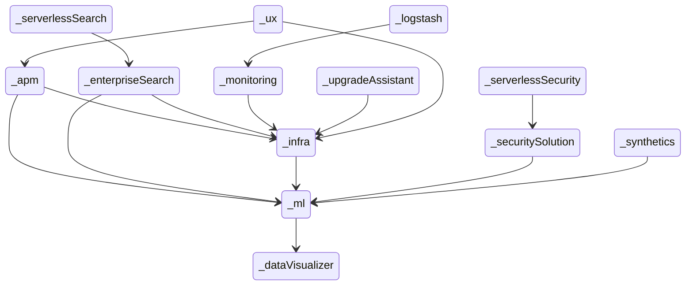


## discover

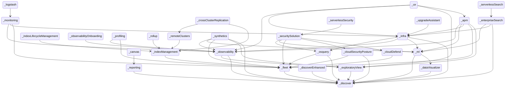


## ecsDataQualityDashboard

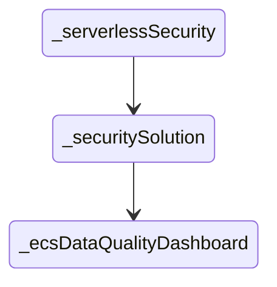


## embeddable

```mermaid
stateDiagram
direction TB
accTitle: embeddable dependency roots
  _aiops --> _lens
  _apm --> _cases
  _apm --> _embeddable
  _apm --> _exploratoryView
  _apm --> _fleet
  _apm --> _infra
  _apm --> _lens
  _apm --> _maps
  _apm --> _ml
  _apm --> _observability
  _apm --> _observabilityShared
  _canvas --> _embeddable
  _canvas --> _expressionError
  _canvas --> _expressionImage
  _canvas --> _expressionMetric
  _canvas --> _expressionRepeatImage
  _canvas --> _expressionRevealImage
  _canvas --> _expressionShape
  _canvas --> _presentationUtil
  _canvas --> _reporting
  _canvas --> _visualizations
  _cases --> _embeddable
  _cases --> _lens
  _cloudDefend --> _fleet
  _cloudSecurityPosture --> _discover
  _cloudSecurityPosture --> _fleet
  _controls --> _embeddable
  _controls --> _presentationUtil
  _crossClusterReplication --> _indexManagement
  _crossClusterReplication --> _remoteClusters
  _dashboard --> _controls
  _dashboard --> _embeddable
  _dashboard --> _presentationUtil
  _dashboard --> _visualizations
  _dashboardEnhanced --> _dashboard
  _dashboardEnhanced --> _embeddable
  _dashboardEnhanced --> _uiActionsEnhanced
  _dataVisualizer --> _discover
  _dataVisualizer --> _embeddable
  _dataVisualizer --> _lens
  _dataVisualizer --> _maps
  _discover --> _embeddable
  _discover --> _lens
  _discoverEnhanced --> _discover
  _discoverEnhanced --> _embeddable
  _embeddableEnhanced --> _embeddable
  _embeddableEnhanced --> _uiActionsEnhanced
  _enterpriseSearch --> _discover
  _enterpriseSearch --> _embeddable
  _enterpriseSearch --> _infra
  _enterpriseSearch --> _lens
  _enterpriseSearch --> _ml
  _exploratoryView --> _cases
  _exploratoryView --> _discover
  _exploratoryView --> _embeddable
  _exploratoryView --> _lens
  _exploratoryView --> _observabilityShared
  _expressionError --> _presentationUtil
  _expressionGauge --> _presentationUtil
  _expressionGauge --> _visualizations
  _expressionHeatmap --> _presentationUtil
  _expressionHeatmap --> _visualizations
  _expressionImage --> _presentationUtil
  _expressionLegacyMetricVis --> _presentationUtil
  _expressionLegacyMetricVis --> _visualizations
  _expressionMetric --> _presentationUtil
  _expressionMetricVis --> _presentationUtil
  _expressionMetricVis --> _visualizations
  _expressionPartitionVis --> _presentationUtil
  _expressionPartitionVis --> _visualizations
  _expressionRepeatImage --> _presentationUtil
  _expressionRevealImage --> _presentationUtil
  _expressionShape --> _presentationUtil
  _expressionTagcloud --> _presentationUtil
  _expressionTagcloud --> _visualizations
  _expressionXY --> _visualizations
  _fleet --> _discover
  _imageEmbeddable --> _embeddable
  _indexLifecycleManagement --> _indexManagement
  _indexManagement --> _fleet
  _infra --> _cases
  _infra --> _discover
  _infra --> _embeddable
  _infra --> _lens
  _infra --> _ml
  _infra --> _observability
  _infra --> _observabilityShared
  _infra --> _osquery
  _infra --> _visTypeTimeseries
  _inputControlVis --> _visDefaultEditor
  _inputControlVis --> _visualizations
  _kubernetesSecurity --> _sessionView
  _kubernetesSecurity --> _timelines
  _lens --> _dashboard
  _lens --> _embeddable
  _lens --> _expressionGauge
  _lens --> _expressionHeatmap
  _lens --> _expressionLegacyMetricVis
  _lens --> _expressionMetricVis
  _lens --> _expressionPartitionVis
  _lens --> _expressionXY
  _lens --> _presentationUtil
  _lens --> _uiActionsEnhanced
  _lens --> _visualizations
  _logstash --> _monitoring
  _maps --> _controls
  _maps --> _dashboard
  _maps --> _embeddable
  _maps --> _lens
  _maps --> _presentationUtil
  _maps --> _visualizations
  _ml --> _aiops
  _ml --> _cases
  _ml --> _dashboard
  _ml --> _dataVisualizer
  _ml --> _discover
  _ml --> _embeddable
  _ml --> _lens
  _ml --> _maps
  _monitoring --> _dashboard
  _monitoring --> _fleet
  _monitoring --> _infra
  _monitoring --> _observability
  _observability --> _cases
  _observability --> _discover
  _observability --> _embeddable
  _observability --> _exploratoryView
  _observability --> _lens
  _observability --> _observabilityShared
  _observability --> _visualizations
  _observabilityOnboarding --> _observability
  _observabilityShared --> _cases
  _osquery --> _cases
  _osquery --> _discover
  _osquery --> _fleet
  _osquery --> _lens
  _presentationUtil --> _embeddable
  _profiling --> _fleet
  _profiling --> _observability
  _profiling --> _observabilityShared
  _remoteClusters --> _indexManagement
  _reporting --> _discover
  _reporting --> _embeddable
  _rollup --> _indexManagement
  _rollup --> _visTypeTimeseries
  _securitySolution --> _cases
  _securitySolution --> _cloudDefend
  _securitySolution --> _cloudSecurityPosture
  _securitySolution --> _controls
  _securitySolution --> _dashboard
  _securitySolution --> _embeddable
  _securitySolution --> _fleet
  _securitySolution --> _kubernetesSecurity
  _securitySolution --> _lens
  _securitySolution --> _maps
  _securitySolution --> _ml
  _securitySolution --> _osquery
  _securitySolution --> _sessionView
  _securitySolution --> _threatIntelligence
  _securitySolution --> _timelines
  _serverlessObservability --> _observabilityShared
  _serverlessSearch --> _enterpriseSearch
  _serverlessSecurity --> _securitySolution
  _sessionView --> _timelines
  _synthetics --> _cases
  _synthetics --> _discover
  _synthetics --> _embeddable
  _synthetics --> _exploratoryView
  _synthetics --> _fleet
  _synthetics --> _ml
  _synthetics --> _observability
  _synthetics --> _observabilityShared
  _threatIntelligence --> _cases
  _timelines --> _cases
  _uiActionsEnhanced --> _embeddable
  _upgradeAssistant --> _infra
  _urlDrilldown --> _embeddable
  _urlDrilldown --> _uiActionsEnhanced
  _ux --> _apm
  _ux --> _embeddable
  _ux --> _exploratoryView
  _ux --> _infra
  _ux --> _lens
  _ux --> _maps
  _ux --> _observability
  _ux --> _observabilityShared
  _visDefaultEditor --> _visualizations
  _visTypeGauge --> _expressionGauge
  _visTypeGauge --> _visualizations
  _visTypeHeatmap --> _visualizations
  _visTypeMarkdown --> _visualizations
  _visTypeMetric --> _visualizations
  _visTypePie --> _expressionPartitionVis
  _visTypePie --> _visualizations
  _visTypeTable --> _visualizations
  _visTypeTagcloud --> _visualizations
  _visTypeTimelion --> _visualizations
  _visTypeTimeseries --> _visualizations
  _visTypeVega --> _visualizations
  _visTypeVislib --> _visualizations
  _visTypeXy --> _visualizations
  _visualizations --> _embeddable
  _visualizations --> _presentationUtil
```


## encryptedSavedObjects

```mermaid
stateDiagram
direction TB
accTitle: encryptedSavedObjects dependency roots
  _actions --> _encryptedSavedObjects
  _alerting --> _actions
  _alerting --> _encryptedSavedObjects
  _apm --> _actions
  _apm --> _alerting
  _apm --> _cases
  _apm --> _exploratoryView
  _apm --> _fleet
  _apm --> _infra
  _apm --> _ml
  _apm --> _observability
  _apm --> _observabilityShared
  _apm --> _ruleRegistry
  _apm --> _triggersActionsUi
  _canvas --> _reporting
  _cases --> _actions
  _cases --> _notifications
  _cases --> _ruleRegistry
  _cases --> _triggersActionsUi
  _cloudDefend --> _fleet
  _cloudSecurityPosture --> _discover
  _cloudSecurityPosture --> _fleet
  _crossClusterReplication --> _indexManagement
  _crossClusterReplication --> _remoteClusters
  _dataVisualizer --> _discover
  _discover --> _triggersActionsUi
  _discoverEnhanced --> _discover
  _enterpriseSearch --> _discover
  _enterpriseSearch --> _infra
  _enterpriseSearch --> _ml
  _exploratoryView --> _alerting
  _exploratoryView --> _cases
  _exploratoryView --> _discover
  _exploratoryView --> _observabilityShared
  _exploratoryView --> _triggersActionsUi
  _fleet --> _discover
  _fleet --> _encryptedSavedObjects
  _indexLifecycleManagement --> _indexManagement
  _indexManagement --> _fleet
  _infra --> _alerting
  _infra --> _cases
  _infra --> _discover
  _infra --> _ml
  _infra --> _observability
  _infra --> _observabilityShared
  _infra --> _osquery
  _infra --> _ruleRegistry
  _infra --> _triggersActionsUi
  _kubernetesSecurity --> _ruleRegistry
  _kubernetesSecurity --> _sessionView
  _kubernetesSecurity --> _timelines
  _logstash --> _monitoring
  _ml --> _alerting
  _ml --> _cases
  _ml --> _dataVisualizer
  _ml --> _discover
  _ml --> _triggersActionsUi
  _monitoring --> _actions
  _monitoring --> _alerting
  _monitoring --> _encryptedSavedObjects
  _monitoring --> _fleet
  _monitoring --> _infra
  _monitoring --> _observability
  _monitoring --> _triggersActionsUi
  _notifications --> _actions
  _observability --> _alerting
  _observability --> _cases
  _observability --> _discover
  _observability --> _exploratoryView
  _observability --> _observabilityShared
  _observability --> _ruleRegistry
  _observability --> _triggersActionsUi
  _observabilityOnboarding --> _observability
  _observabilityShared --> _cases
  _osquery --> _actions
  _osquery --> _cases
  _osquery --> _discover
  _osquery --> _fleet
  _osquery --> _ruleRegistry
  _osquery --> _triggersActionsUi
  _profiling --> _fleet
  _profiling --> _observability
  _profiling --> _observabilityShared
  _remoteClusters --> _indexManagement
  _reporting --> _discover
  _rollup --> _indexManagement
  _ruleRegistry --> _alerting
  _ruleRegistry --> _triggersActionsUi
  _securitySolution --> _actions
  _securitySolution --> _alerting
  _securitySolution --> _cases
  _securitySolution --> _cloudDefend
  _securitySolution --> _cloudSecurityPosture
  _securitySolution --> _encryptedSavedObjects
  _securitySolution --> _fleet
  _securitySolution --> _kubernetesSecurity
  _securitySolution --> _ml
  _securitySolution --> _osquery
  _securitySolution --> _ruleRegistry
  _securitySolution --> _sessionView
  _securitySolution --> _threatIntelligence
  _securitySolution --> _timelines
  _securitySolution --> _triggersActionsUi
  _serverlessObservability --> _observabilityShared
  _serverlessSearch --> _enterpriseSearch
  _serverlessSecurity --> _securitySolution
  _sessionView --> _ruleRegistry
  _sessionView --> _timelines
  _stackAlerts --> _alerting
  _stackAlerts --> _triggersActionsUi
  _stackConnectors --> _actions
  _stackConnectors --> _triggersActionsUi
  _synthetics --> _actions
  _synthetics --> _alerting
  _synthetics --> _cases
  _synthetics --> _discover
  _synthetics --> _encryptedSavedObjects
  _synthetics --> _exploratoryView
  _synthetics --> _fleet
  _synthetics --> _ml
  _synthetics --> _observability
  _synthetics --> _observabilityShared
  _synthetics --> _ruleRegistry
  _synthetics --> _triggersActionsUi
  _threatIntelligence --> _cases
  _threatIntelligence --> _triggersActionsUi
  _timelines --> _alerting
  _timelines --> _cases
  _transform --> _alerting
  _transform --> _triggersActionsUi
  _triggersActionsUi --> _actions
  _triggersActionsUi --> _alerting
  _upgradeAssistant --> _infra
  _ux --> _actions
  _ux --> _apm
  _ux --> _exploratoryView
  _ux --> _infra
  _ux --> _observability
  _ux --> _observabilityShared
  _ux --> _triggersActionsUi
```


## enterpriseSearch

```mermaid
stateDiagram
direction TB
accTitle: enterpriseSearch dependency roots
  _serverlessSearch --> _enterpriseSearch
```


## esUiShared

```mermaid
stateDiagram
direction TB
accTitle: esUiShared dependency roots
  _alerting --> _esUiShared
  _apm --> _alerting
  _apm --> _cases
  _apm --> _exploratoryView
  _apm --> _fleet
  _apm --> _infra
  _apm --> _ml
  _apm --> _observability
  _apm --> _observabilityShared
  _apm --> _ruleRegistry
  _apm --> _triggersActionsUi
  _canvas --> _reporting
  _cases --> _esUiShared
  _cases --> _ruleRegistry
  _cases --> _triggersActionsUi
  _cloudDefend --> _fleet
  _cloudSecurityPosture --> _discover
  _cloudSecurityPosture --> _fleet
  _crossClusterReplication --> _indexManagement
  _crossClusterReplication --> _remoteClusters
  _dataVisualizer --> _discover
  _discover --> _triggersActionsUi
  _discoverEnhanced --> _discover
  _enterpriseSearch --> _discover
  _enterpriseSearch --> _esUiShared
  _enterpriseSearch --> _infra
  _enterpriseSearch --> _ml
  _exploratoryView --> _alerting
  _exploratoryView --> _cases
  _exploratoryView --> _discover
  _exploratoryView --> _observabilityShared
  _exploratoryView --> _triggersActionsUi
  _fleet --> _discover
  _indexLifecycleManagement --> _indexManagement
  _indexManagement --> _fleet
  _infra --> _alerting
  _infra --> _cases
  _infra --> _discover
  _infra --> _ml
  _infra --> _observability
  _infra --> _observabilityShared
  _infra --> _osquery
  _infra --> _ruleRegistry
  _infra --> _triggersActionsUi
  _kubernetesSecurity --> _ruleRegistry
  _kubernetesSecurity --> _sessionView
  _kubernetesSecurity --> _timelines
  _logstash --> _monitoring
  _ml --> _alerting
  _ml --> _cases
  _ml --> _dataVisualizer
  _ml --> _discover
  _ml --> _triggersActionsUi
  _monitoring --> _alerting
  _monitoring --> _fleet
  _monitoring --> _infra
  _monitoring --> _observability
  _monitoring --> _triggersActionsUi
  _observability --> _alerting
  _observability --> _cases
  _observability --> _discover
  _observability --> _exploratoryView
  _observability --> _observabilityShared
  _observability --> _ruleRegistry
  _observability --> _triggersActionsUi
  _observabilityOnboarding --> _observability
  _observabilityShared --> _cases
  _osquery --> _cases
  _osquery --> _discover
  _osquery --> _fleet
  _osquery --> _ruleRegistry
  _osquery --> _triggersActionsUi
  _profiling --> _fleet
  _profiling --> _observability
  _profiling --> _observabilityShared
  _remoteClusters --> _indexManagement
  _reporting --> _discover
  _reporting --> _esUiShared
  _rollup --> _indexManagement
  _ruleRegistry --> _alerting
  _ruleRegistry --> _triggersActionsUi
  _securitySolution --> _alerting
  _securitySolution --> _cases
  _securitySolution --> _cloudDefend
  _securitySolution --> _cloudSecurityPosture
  _securitySolution --> _fleet
  _securitySolution --> _kubernetesSecurity
  _securitySolution --> _ml
  _securitySolution --> _osquery
  _securitySolution --> _ruleRegistry
  _securitySolution --> _sessionView
  _securitySolution --> _threatIntelligence
  _securitySolution --> _timelines
  _securitySolution --> _triggersActionsUi
  _serverlessObservability --> _observabilityShared
  _serverlessSearch --> _enterpriseSearch
  _serverlessSecurity --> _securitySolution
  _sessionView --> _ruleRegistry
  _sessionView --> _timelines
  _stackAlerts --> _alerting
  _stackAlerts --> _triggersActionsUi
  _stackConnectors --> _esUiShared
  _stackConnectors --> _triggersActionsUi
  _synthetics --> _alerting
  _synthetics --> _cases
  _synthetics --> _discover
  _synthetics --> _exploratoryView
  _synthetics --> _fleet
  _synthetics --> _ml
  _synthetics --> _observability
  _synthetics --> _observabilityShared
  _synthetics --> _ruleRegistry
  _synthetics --> _triggersActionsUi
  _threatIntelligence --> _cases
  _threatIntelligence --> _triggersActionsUi
  _timelines --> _alerting
  _timelines --> _cases
  _transform --> _alerting
  _transform --> _triggersActionsUi
  _triggersActionsUi --> _alerting
  _upgradeAssistant --> _infra
  _ux --> _apm
  _ux --> _exploratoryView
  _ux --> _infra
  _ux --> _observability
  _ux --> _observabilityShared
  _ux --> _triggersActionsUi
```


## eventAnnotation

```mermaid
stateDiagram
direction TB
accTitle: eventAnnotation dependency roots
  _aiops --> _lens
  _apm --> _cases
  _apm --> _exploratoryView
  _apm --> _fleet
  _apm --> _infra
  _apm --> _lens
  _apm --> _maps
  _apm --> _ml
  _apm --> _observability
  _apm --> _observabilityShared
  _canvas --> _reporting
  _cases --> _lens
  _cloudDefend --> _fleet
  _cloudSecurityPosture --> _discover
  _cloudSecurityPosture --> _fleet
  _crossClusterReplication --> _indexManagement
  _crossClusterReplication --> _remoteClusters
  _dataVisualizer --> _discover
  _dataVisualizer --> _lens
  _dataVisualizer --> _maps
  _discover --> _lens
  _discoverEnhanced --> _discover
  _enterpriseSearch --> _discover
  _enterpriseSearch --> _infra
  _enterpriseSearch --> _lens
  _enterpriseSearch --> _ml
  _exploratoryView --> _cases
  _exploratoryView --> _discover
  _exploratoryView --> _lens
  _exploratoryView --> _observabilityShared
  _expressionXY --> _eventAnnotation
  _fleet --> _discover
  _indexLifecycleManagement --> _indexManagement
  _indexManagement --> _fleet
  _infra --> _cases
  _infra --> _discover
  _infra --> _lens
  _infra --> _ml
  _infra --> _observability
  _infra --> _observabilityShared
  _infra --> _osquery
  _kubernetesSecurity --> _sessionView
  _kubernetesSecurity --> _timelines
  _lens --> _eventAnnotation
  _lens --> _expressionXY
  _logstash --> _monitoring
  _maps --> _lens
  _ml --> _aiops
  _ml --> _cases
  _ml --> _dataVisualizer
  _ml --> _discover
  _ml --> _lens
  _ml --> _maps
  _monitoring --> _fleet
  _monitoring --> _infra
  _monitoring --> _observability
  _observability --> _cases
  _observability --> _discover
  _observability --> _exploratoryView
  _observability --> _lens
  _observability --> _observabilityShared
  _observabilityOnboarding --> _observability
  _observabilityShared --> _cases
  _osquery --> _cases
  _osquery --> _discover
  _osquery --> _fleet
  _osquery --> _lens
  _profiling --> _fleet
  _profiling --> _observability
  _profiling --> _observabilityShared
  _remoteClusters --> _indexManagement
  _reporting --> _discover
  _rollup --> _indexManagement
  _securitySolution --> _cases
  _securitySolution --> _cloudDefend
  _securitySolution --> _cloudSecurityPosture
  _securitySolution --> _fleet
  _securitySolution --> _kubernetesSecurity
  _securitySolution --> _lens
  _securitySolution --> _maps
  _securitySolution --> _ml
  _securitySolution --> _osquery
  _securitySolution --> _sessionView
  _securitySolution --> _threatIntelligence
  _securitySolution --> _timelines
  _serverlessObservability --> _observabilityShared
  _serverlessSearch --> _enterpriseSearch
  _serverlessSecurity --> _securitySolution
  _sessionView --> _timelines
  _synthetics --> _cases
  _synthetics --> _discover
  _synthetics --> _exploratoryView
  _synthetics --> _fleet
  _synthetics --> _ml
  _synthetics --> _observability
  _synthetics --> _observabilityShared
  _threatIntelligence --> _cases
  _timelines --> _cases
  _upgradeAssistant --> _infra
  _ux --> _apm
  _ux --> _exploratoryView
  _ux --> _infra
  _ux --> _lens
  _ux --> _maps
  _ux --> _observability
  _ux --> _observabilityShared
```


## eventLog

```mermaid
stateDiagram
direction TB
accTitle: eventLog dependency roots
  _actions --> _eventLog
  _alerting --> _actions
  _alerting --> _eventLog
  _apm --> _actions
  _apm --> _alerting
  _apm --> _cases
  _apm --> _exploratoryView
  _apm --> _fleet
  _apm --> _infra
  _apm --> _ml
  _apm --> _observability
  _apm --> _observabilityShared
  _apm --> _ruleRegistry
  _apm --> _triggersActionsUi
  _canvas --> _reporting
  _cases --> _actions
  _cases --> _notifications
  _cases --> _ruleRegistry
  _cases --> _triggersActionsUi
  _cloudDefend --> _fleet
  _cloudSecurityPosture --> _discover
  _cloudSecurityPosture --> _fleet
  _crossClusterReplication --> _indexManagement
  _crossClusterReplication --> _remoteClusters
  _dataVisualizer --> _discover
  _discover --> _triggersActionsUi
  _discoverEnhanced --> _discover
  _enterpriseSearch --> _discover
  _enterpriseSearch --> _infra
  _enterpriseSearch --> _ml
  _exploratoryView --> _alerting
  _exploratoryView --> _cases
  _exploratoryView --> _discover
  _exploratoryView --> _observabilityShared
  _exploratoryView --> _triggersActionsUi
  _fleet --> _discover
  _indexLifecycleManagement --> _indexManagement
  _indexManagement --> _fleet
  _infra --> _alerting
  _infra --> _cases
  _infra --> _discover
  _infra --> _ml
  _infra --> _observability
  _infra --> _observabilityShared
  _infra --> _osquery
  _infra --> _ruleRegistry
  _infra --> _triggersActionsUi
  _kubernetesSecurity --> _ruleRegistry
  _kubernetesSecurity --> _sessionView
  _kubernetesSecurity --> _timelines
  _logstash --> _monitoring
  _ml --> _alerting
  _ml --> _cases
  _ml --> _dataVisualizer
  _ml --> _discover
  _ml --> _triggersActionsUi
  _monitoring --> _actions
  _monitoring --> _alerting
  _monitoring --> _fleet
  _monitoring --> _infra
  _monitoring --> _observability
  _monitoring --> _triggersActionsUi
  _notifications --> _actions
  _observability --> _alerting
  _observability --> _cases
  _observability --> _discover
  _observability --> _exploratoryView
  _observability --> _observabilityShared
  _observability --> _ruleRegistry
  _observability --> _triggersActionsUi
  _observabilityOnboarding --> _observability
  _observabilityShared --> _cases
  _osquery --> _actions
  _osquery --> _cases
  _osquery --> _discover
  _osquery --> _fleet
  _osquery --> _ruleRegistry
  _osquery --> _triggersActionsUi
  _profiling --> _fleet
  _profiling --> _observability
  _profiling --> _observabilityShared
  _remoteClusters --> _indexManagement
  _reporting --> _discover
  _rollup --> _indexManagement
  _ruleRegistry --> _alerting
  _ruleRegistry --> _triggersActionsUi
  _securitySolution --> _actions
  _securitySolution --> _alerting
  _securitySolution --> _cases
  _securitySolution --> _cloudDefend
  _securitySolution --> _cloudSecurityPosture
  _securitySolution --> _eventLog
  _securitySolution --> _fleet
  _securitySolution --> _kubernetesSecurity
  _securitySolution --> _ml
  _securitySolution --> _osquery
  _securitySolution --> _ruleRegistry
  _securitySolution --> _sessionView
  _securitySolution --> _threatIntelligence
  _securitySolution --> _timelines
  _securitySolution --> _triggersActionsUi
  _serverlessObservability --> _observabilityShared
  _serverlessSearch --> _enterpriseSearch
  _serverlessSecurity --> _securitySolution
  _sessionView --> _ruleRegistry
  _sessionView --> _timelines
  _stackAlerts --> _alerting
  _stackAlerts --> _triggersActionsUi
  _stackConnectors --> _actions
  _stackConnectors --> _triggersActionsUi
  _synthetics --> _actions
  _synthetics --> _alerting
  _synthetics --> _cases
  _synthetics --> _discover
  _synthetics --> _exploratoryView
  _synthetics --> _fleet
  _synthetics --> _ml
  _synthetics --> _observability
  _synthetics --> _observabilityShared
  _synthetics --> _ruleRegistry
  _synthetics --> _triggersActionsUi
  _threatIntelligence --> _cases
  _threatIntelligence --> _triggersActionsUi
  _timelines --> _alerting
  _timelines --> _cases
  _transform --> _alerting
  _transform --> _triggersActionsUi
  _triggersActionsUi --> _actions
  _triggersActionsUi --> _alerting
  _upgradeAssistant --> _infra
  _ux --> _actions
  _ux --> _apm
  _ux --> _exploratoryView
  _ux --> _infra
  _ux --> _observability
  _ux --> _observabilityShared
  _ux --> _triggersActionsUi
```


## exploratoryView

```mermaid
stateDiagram
direction TB
accTitle: exploratoryView dependency roots
  _apm --> _exploratoryView
  _apm --> _infra
  _apm --> _observability
  _enterpriseSearch --> _infra
  _infra --> _observability
  _logstash --> _monitoring
  _monitoring --> _infra
  _monitoring --> _observability
  _observability --> _exploratoryView
  _observabilityOnboarding --> _observability
  _profiling --> _observability
  _serverlessSearch --> _enterpriseSearch
  _synthetics --> _exploratoryView
  _synthetics --> _observability
  _upgradeAssistant --> _infra
  _ux --> _apm
  _ux --> _exploratoryView
  _ux --> _infra
  _ux --> _observability
```


## expressionGauge

```mermaid
stateDiagram
direction TB
accTitle: expressionGauge dependency roots
  _aiops --> _lens
  _apm --> _cases
  _apm --> _exploratoryView
  _apm --> _fleet
  _apm --> _infra
  _apm --> _lens
  _apm --> _maps
  _apm --> _ml
  _apm --> _observability
  _apm --> _observabilityShared
  _canvas --> _reporting
  _cases --> _lens
  _cloudDefend --> _fleet
  _cloudSecurityPosture --> _discover
  _cloudSecurityPosture --> _fleet
  _crossClusterReplication --> _indexManagement
  _crossClusterReplication --> _remoteClusters
  _dataVisualizer --> _discover
  _dataVisualizer --> _lens
  _dataVisualizer --> _maps
  _discover --> _lens
  _discoverEnhanced --> _discover
  _enterpriseSearch --> _discover
  _enterpriseSearch --> _infra
  _enterpriseSearch --> _lens
  _enterpriseSearch --> _ml
  _exploratoryView --> _cases
  _exploratoryView --> _discover
  _exploratoryView --> _lens
  _exploratoryView --> _observabilityShared
  _fleet --> _discover
  _indexLifecycleManagement --> _indexManagement
  _indexManagement --> _fleet
  _infra --> _cases
  _infra --> _discover
  _infra --> _lens
  _infra --> _ml
  _infra --> _observability
  _infra --> _observabilityShared
  _infra --> _osquery
  _kubernetesSecurity --> _sessionView
  _kubernetesSecurity --> _timelines
  _lens --> _expressionGauge
  _logstash --> _monitoring
  _maps --> _lens
  _ml --> _aiops
  _ml --> _cases
  _ml --> _dataVisualizer
  _ml --> _discover
  _ml --> _lens
  _ml --> _maps
  _monitoring --> _fleet
  _monitoring --> _infra
  _monitoring --> _observability
  _observability --> _cases
  _observability --> _discover
  _observability --> _exploratoryView
  _observability --> _lens
  _observability --> _observabilityShared
  _observabilityOnboarding --> _observability
  _observabilityShared --> _cases
  _osquery --> _cases
  _osquery --> _discover
  _osquery --> _fleet
  _osquery --> _lens
  _profiling --> _fleet
  _profiling --> _observability
  _profiling --> _observabilityShared
  _remoteClusters --> _indexManagement
  _reporting --> _discover
  _rollup --> _indexManagement
  _securitySolution --> _cases
  _securitySolution --> _cloudDefend
  _securitySolution --> _cloudSecurityPosture
  _securitySolution --> _fleet
  _securitySolution --> _kubernetesSecurity
  _securitySolution --> _lens
  _securitySolution --> _maps
  _securitySolution --> _ml
  _securitySolution --> _osquery
  _securitySolution --> _sessionView
  _securitySolution --> _threatIntelligence
  _securitySolution --> _timelines
  _serverlessObservability --> _observabilityShared
  _serverlessSearch --> _enterpriseSearch
  _serverlessSecurity --> _securitySolution
  _sessionView --> _timelines
  _synthetics --> _cases
  _synthetics --> _discover
  _synthetics --> _exploratoryView
  _synthetics --> _fleet
  _synthetics --> _ml
  _synthetics --> _observability
  _synthetics --> _observabilityShared
  _threatIntelligence --> _cases
  _timelines --> _cases
  _upgradeAssistant --> _infra
  _ux --> _apm
  _ux --> _exploratoryView
  _ux --> _infra
  _ux --> _lens
  _ux --> _maps
  _ux --> _observability
  _ux --> _observabilityShared
  _visTypeGauge --> _expressionGauge
```


## expressionHeatmap

```mermaid
stateDiagram
direction TB
accTitle: expressionHeatmap dependency roots
  _aiops --> _lens
  _apm --> _cases
  _apm --> _exploratoryView
  _apm --> _fleet
  _apm --> _infra
  _apm --> _lens
  _apm --> _maps
  _apm --> _ml
  _apm --> _observability
  _apm --> _observabilityShared
  _canvas --> _reporting
  _cases --> _lens
  _cloudDefend --> _fleet
  _cloudSecurityPosture --> _discover
  _cloudSecurityPosture --> _fleet
  _crossClusterReplication --> _indexManagement
  _crossClusterReplication --> _remoteClusters
  _dataVisualizer --> _discover
  _dataVisualizer --> _lens
  _dataVisualizer --> _maps
  _discover --> _lens
  _discoverEnhanced --> _discover
  _enterpriseSearch --> _discover
  _enterpriseSearch --> _infra
  _enterpriseSearch --> _lens
  _enterpriseSearch --> _ml
  _exploratoryView --> _cases
  _exploratoryView --> _discover
  _exploratoryView --> _lens
  _exploratoryView --> _observabilityShared
  _fleet --> _discover
  _indexLifecycleManagement --> _indexManagement
  _indexManagement --> _fleet
  _infra --> _cases
  _infra --> _discover
  _infra --> _lens
  _infra --> _ml
  _infra --> _observability
  _infra --> _observabilityShared
  _infra --> _osquery
  _kubernetesSecurity --> _sessionView
  _kubernetesSecurity --> _timelines
  _lens --> _expressionHeatmap
  _logstash --> _monitoring
  _maps --> _lens
  _ml --> _aiops
  _ml --> _cases
  _ml --> _dataVisualizer
  _ml --> _discover
  _ml --> _lens
  _ml --> _maps
  _monitoring --> _fleet
  _monitoring --> _infra
  _monitoring --> _observability
  _observability --> _cases
  _observability --> _discover
  _observability --> _exploratoryView
  _observability --> _lens
  _observability --> _observabilityShared
  _observabilityOnboarding --> _observability
  _observabilityShared --> _cases
  _osquery --> _cases
  _osquery --> _discover
  _osquery --> _fleet
  _osquery --> _lens
  _profiling --> _fleet
  _profiling --> _observability
  _profiling --> _observabilityShared
  _remoteClusters --> _indexManagement
  _reporting --> _discover
  _rollup --> _indexManagement
  _securitySolution --> _cases
  _securitySolution --> _cloudDefend
  _securitySolution --> _cloudSecurityPosture
  _securitySolution --> _fleet
  _securitySolution --> _kubernetesSecurity
  _securitySolution --> _lens
  _securitySolution --> _maps
  _securitySolution --> _ml
  _securitySolution --> _osquery
  _securitySolution --> _sessionView
  _securitySolution --> _threatIntelligence
  _securitySolution --> _timelines
  _serverlessObservability --> _observabilityShared
  _serverlessSearch --> _enterpriseSearch
  _serverlessSecurity --> _securitySolution
  _sessionView --> _timelines
  _synthetics --> _cases
  _synthetics --> _discover
  _synthetics --> _exploratoryView
  _synthetics --> _fleet
  _synthetics --> _ml
  _synthetics --> _observability
  _synthetics --> _observabilityShared
  _threatIntelligence --> _cases
  _timelines --> _cases
  _upgradeAssistant --> _infra
  _ux --> _apm
  _ux --> _exploratoryView
  _ux --> _infra
  _ux --> _lens
  _ux --> _maps
  _ux --> _observability
  _ux --> _observabilityShared
```


## expressionMetricVis

```mermaid
stateDiagram
direction TB
accTitle: expressionMetricVis dependency roots
  _aiops --> _lens
  _apm --> _cases
  _apm --> _exploratoryView
  _apm --> _fleet
  _apm --> _infra
  _apm --> _lens
  _apm --> _maps
  _apm --> _ml
  _apm --> _observability
  _apm --> _observabilityShared
  _canvas --> _reporting
  _cases --> _lens
  _cloudDefend --> _fleet
  _cloudSecurityPosture --> _discover
  _cloudSecurityPosture --> _fleet
  _crossClusterReplication --> _indexManagement
  _crossClusterReplication --> _remoteClusters
  _dataVisualizer --> _discover
  _dataVisualizer --> _lens
  _dataVisualizer --> _maps
  _discover --> _lens
  _discoverEnhanced --> _discover
  _enterpriseSearch --> _discover
  _enterpriseSearch --> _infra
  _enterpriseSearch --> _lens
  _enterpriseSearch --> _ml
  _exploratoryView --> _cases
  _exploratoryView --> _discover
  _exploratoryView --> _lens
  _exploratoryView --> _observabilityShared
  _fleet --> _discover
  _indexLifecycleManagement --> _indexManagement
  _indexManagement --> _fleet
  _infra --> _cases
  _infra --> _discover
  _infra --> _lens
  _infra --> _ml
  _infra --> _observability
  _infra --> _observabilityShared
  _infra --> _osquery
  _kubernetesSecurity --> _sessionView
  _kubernetesSecurity --> _timelines
  _lens --> _expressionMetricVis
  _logstash --> _monitoring
  _maps --> _lens
  _ml --> _aiops
  _ml --> _cases
  _ml --> _dataVisualizer
  _ml --> _discover
  _ml --> _lens
  _ml --> _maps
  _monitoring --> _fleet
  _monitoring --> _infra
  _monitoring --> _observability
  _observability --> _cases
  _observability --> _discover
  _observability --> _exploratoryView
  _observability --> _lens
  _observability --> _observabilityShared
  _observabilityOnboarding --> _observability
  _observabilityShared --> _cases
  _osquery --> _cases
  _osquery --> _discover
  _osquery --> _fleet
  _osquery --> _lens
  _profiling --> _fleet
  _profiling --> _observability
  _profiling --> _observabilityShared
  _remoteClusters --> _indexManagement
  _reporting --> _discover
  _rollup --> _indexManagement
  _securitySolution --> _cases
  _securitySolution --> _cloudDefend
  _securitySolution --> _cloudSecurityPosture
  _securitySolution --> _fleet
  _securitySolution --> _kubernetesSecurity
  _securitySolution --> _lens
  _securitySolution --> _maps
  _securitySolution --> _ml
  _securitySolution --> _osquery
  _securitySolution --> _sessionView
  _securitySolution --> _threatIntelligence
  _securitySolution --> _timelines
  _serverlessObservability --> _observabilityShared
  _serverlessSearch --> _enterpriseSearch
  _serverlessSecurity --> _securitySolution
  _sessionView --> _timelines
  _synthetics --> _cases
  _synthetics --> _discover
  _synthetics --> _exploratoryView
  _synthetics --> _fleet
  _synthetics --> _ml
  _synthetics --> _observability
  _synthetics --> _observabilityShared
  _threatIntelligence --> _cases
  _timelines --> _cases
  _upgradeAssistant --> _infra
  _ux --> _apm
  _ux --> _exploratoryView
  _ux --> _infra
  _ux --> _lens
  _ux --> _maps
  _ux --> _observability
  _ux --> _observabilityShared
```


## expressionXY

```mermaid
stateDiagram
direction TB
accTitle: expressionXY dependency roots
  _aiops --> _lens
  _apm --> _cases
  _apm --> _exploratoryView
  _apm --> _fleet
  _apm --> _infra
  _apm --> _lens
  _apm --> _maps
  _apm --> _ml
  _apm --> _observability
  _apm --> _observabilityShared
  _canvas --> _reporting
  _cases --> _lens
  _cloudDefend --> _fleet
  _cloudSecurityPosture --> _discover
  _cloudSecurityPosture --> _fleet
  _crossClusterReplication --> _indexManagement
  _crossClusterReplication --> _remoteClusters
  _dataVisualizer --> _discover
  _dataVisualizer --> _lens
  _dataVisualizer --> _maps
  _discover --> _lens
  _discoverEnhanced --> _discover
  _enterpriseSearch --> _discover
  _enterpriseSearch --> _infra
  _enterpriseSearch --> _lens
  _enterpriseSearch --> _ml
  _exploratoryView --> _cases
  _exploratoryView --> _discover
  _exploratoryView --> _lens
  _exploratoryView --> _observabilityShared
  _fleet --> _discover
  _indexLifecycleManagement --> _indexManagement
  _indexManagement --> _fleet
  _infra --> _cases
  _infra --> _discover
  _infra --> _lens
  _infra --> _ml
  _infra --> _observability
  _infra --> _observabilityShared
  _infra --> _osquery
  _kubernetesSecurity --> _sessionView
  _kubernetesSecurity --> _timelines
  _lens --> _expressionXY
  _logstash --> _monitoring
  _maps --> _lens
  _ml --> _aiops
  _ml --> _cases
  _ml --> _dataVisualizer
  _ml --> _discover
  _ml --> _lens
  _ml --> _maps
  _monitoring --> _fleet
  _monitoring --> _infra
  _monitoring --> _observability
  _observability --> _cases
  _observability --> _discover
  _observability --> _exploratoryView
  _observability --> _lens
  _observability --> _observabilityShared
  _observabilityOnboarding --> _observability
  _observabilityShared --> _cases
  _osquery --> _cases
  _osquery --> _discover
  _osquery --> _fleet
  _osquery --> _lens
  _profiling --> _fleet
  _profiling --> _observability
  _profiling --> _observabilityShared
  _remoteClusters --> _indexManagement
  _reporting --> _discover
  _rollup --> _indexManagement
  _securitySolution --> _cases
  _securitySolution --> _cloudDefend
  _securitySolution --> _cloudSecurityPosture
  _securitySolution --> _fleet
  _securitySolution --> _kubernetesSecurity
  _securitySolution --> _lens
  _securitySolution --> _maps
  _securitySolution --> _ml
  _securitySolution --> _osquery
  _securitySolution --> _sessionView
  _securitySolution --> _threatIntelligence
  _securitySolution --> _timelines
  _serverlessObservability --> _observabilityShared
  _serverlessSearch --> _enterpriseSearch
  _serverlessSecurity --> _securitySolution
  _sessionView --> _timelines
  _synthetics --> _cases
  _synthetics --> _discover
  _synthetics --> _exploratoryView
  _synthetics --> _fleet
  _synthetics --> _ml
  _synthetics --> _observability
  _synthetics --> _observabilityShared
  _threatIntelligence --> _cases
  _timelines --> _cases
  _upgradeAssistant --> _infra
  _ux --> _apm
  _ux --> _exploratoryView
  _ux --> _infra
  _ux --> _lens
  _ux --> _maps
  _ux --> _observability
  _ux --> _observabilityShared
```


## expressions

```mermaid
stateDiagram
direction TB
accTitle: expressions dependency roots
  _actions --> _encryptedSavedObjects
  _actions --> _eventLog
  _actions --> _security
  _actions --> _spaces
  _advancedSettings --> _home
  _advancedSettings --> _management
  _aiops --> _charts
  _aiops --> _data
  _aiops --> _lens
  _aiops --> _uiActions
  _aiops --> _unifiedFieldList
  _alerting --> _actions
  _alerting --> _data
  _alerting --> _dataViews
  _alerting --> _encryptedSavedObjects
  _alerting --> _eventLog
  _alerting --> _management
  _alerting --> _security
  _alerting --> _spaces
  _apm --> _actions
  _apm --> _advancedSettings
  _apm --> _alerting
  _apm --> _cases
  _apm --> _charts
  _apm --> _data
  _apm --> _dataViews
  _apm --> _embeddable
  _apm --> _exploratoryView
  _apm --> _fleet
  _apm --> _home
  _apm --> _infra
  _apm --> _lens
  _apm --> _maps
  _apm --> _ml
  _apm --> _observability
  _apm --> _observabilityShared
  _apm --> _ruleRegistry
  _apm --> _security
  _apm --> _spaces
  _apm --> _triggersActionsUi
  _apm --> _unifiedFieldList
  _apm --> _unifiedSearch
  _canvas --> _charts
  _canvas --> _data
  _canvas --> _dataViews
  _canvas --> _embeddable
  _canvas --> _expressionError
  _canvas --> _expressionImage
  _canvas --> _expressionMetric
  _canvas --> _expressionRepeatImage
  _canvas --> _expressionRevealImage
  _canvas --> _expressionShape
  _canvas --> _expressions
  _canvas --> _home
  _canvas --> _presentationUtil
  _canvas --> _reporting
  _canvas --> _savedObjects
  _canvas --> _savedObjectsManagement
  _canvas --> _spaces
  _canvas --> _uiActions
  _canvas --> _visualizations
  _cases --> _actions
  _cases --> _data
  _cases --> _embeddable
  _cases --> _files
  _cases --> _home
  _cases --> _lens
  _cases --> _management
  _cases --> _notifications
  _cases --> _ruleRegistry
  _cases --> _savedObjectsManagement
  _cases --> _security
  _cases --> _spaces
  _cases --> _triggersActionsUi
  _charts --> _expressions
  _cloudChat --> _security
  _cloudDataMigration --> _management
  _cloudDefend --> _data
  _cloudDefend --> _fleet
  _cloudDefend --> _navigation
  _cloudDefend --> _security
  _cloudDefend --> _unifiedSearch
  _cloudExperiments --> _dataViews
  _cloudFullStory --> _security
  _cloudLinks --> _security
  _cloudSecurityPosture --> _charts
  _cloudSecurityPosture --> _data
  _cloudSecurityPosture --> _discover
  _cloudSecurityPosture --> _fleet
  _cloudSecurityPosture --> _navigation
  _cloudSecurityPosture --> _security
  _cloudSecurityPosture --> _unifiedSearch
  _console --> _home
  _controls --> _data
  _controls --> _dataViews
  _controls --> _embeddable
  _controls --> _expressions
  _controls --> _presentationUtil
  _controls --> _savedObjects
  _controls --> _uiActions
  _controls --> _unifiedSearch
  _crossClusterReplication --> _home
  _crossClusterReplication --> _indexManagement
  _crossClusterReplication --> _management
  _crossClusterReplication --> _remoteClusters
  _dashboard --> _controls
  _dashboard --> _data
  _dashboard --> _dataViewEditor
  _dashboard --> _dataViews
  _dashboard --> _embeddable
  _dashboard --> _home
  _dashboard --> _navigation
  _dashboard --> _presentationUtil
  _dashboard --> _savedObjects
  _dashboard --> _savedObjectsManagement
  _dashboard --> _savedObjectsTaggingOss
  _dashboard --> _spaces
  _dashboard --> _uiActions
  _dashboard --> _unifiedSearch
  _dashboard --> _visualizations
  _dashboardEnhanced --> _dashboard
  _dashboardEnhanced --> _data
  _dashboardEnhanced --> _embeddable
  _dashboardEnhanced --> _uiActionsEnhanced
  _dashboardEnhanced --> _unifiedSearch
  _data --> _dataViews
  _data --> _expressions
  _data --> _management
  _data --> _security
  _data --> _uiActions
  _dataViewEditor --> _data
  _dataViewEditor --> _dataViews
  _dataViewFieldEditor --> _data
  _dataViewFieldEditor --> _dataViews
  _dataViewManagement --> _data
  _dataViewManagement --> _dataViewEditor
  _dataViewManagement --> _dataViewFieldEditor
  _dataViewManagement --> _dataViews
  _dataViewManagement --> _management
  _dataViewManagement --> _savedObjectsManagement
  _dataViewManagement --> _spaces
  _dataViewManagement --> _unifiedSearch
  _dataViews --> _expressions
  _dataVisualizer --> _charts
  _dataVisualizer --> _data
  _dataVisualizer --> _dataViewFieldEditor
  _dataVisualizer --> _discover
  _dataVisualizer --> _embeddable
  _dataVisualizer --> _fileUpload
  _dataVisualizer --> _home
  _dataVisualizer --> _lens
  _dataVisualizer --> _maps
  _dataVisualizer --> _security
  _dataVisualizer --> _uiActions
  _dataVisualizer --> _unifiedSearch
  _discover --> _charts
  _discover --> _data
  _discover --> _dataViewEditor
  _discover --> _dataViewFieldEditor
  _discover --> _dataViews
  _discover --> _embeddable
  _discover --> _expressions
  _discover --> _home
  _discover --> _lens
  _discover --> _navigation
  _discover --> _savedObjects
  _discover --> _savedObjectsManagement
  _discover --> _savedObjectsTaggingOss
  _discover --> _spaces
  _discover --> _triggersActionsUi
  _discover --> _uiActions
  _discover --> _unifiedFieldList
  _discover --> _unifiedSearch
  _discoverEnhanced --> _discover
  _discoverEnhanced --> _embeddable
  _discoverEnhanced --> _uiActions
  _ecsDataQualityDashboard --> _data
  _embeddable --> _data
  _embeddable --> _savedObjectsManagement
  _embeddable --> _savedObjectsTaggingOss
  _embeddable --> _uiActions
  _embeddableEnhanced --> _embeddable
  _embeddableEnhanced --> _uiActions
  _embeddableEnhanced --> _uiActionsEnhanced
  _encryptedSavedObjects --> _security
  _enterpriseSearch --> _charts
  _enterpriseSearch --> _data
  _enterpriseSearch --> _discover
  _enterpriseSearch --> _embeddable
  _enterpriseSearch --> _home
  _enterpriseSearch --> _infra
  _enterpriseSearch --> _lens
  _enterpriseSearch --> _ml
  _enterpriseSearch --> _security
  _enterpriseSearch --> _spaces
  _eventAnnotation --> _data
  _eventAnnotation --> _expressions
  _eventLog --> _spaces
  _exploratoryView --> _alerting
  _exploratoryView --> _cases
  _exploratoryView --> _charts
  _exploratoryView --> _data
  _exploratoryView --> _dataViews
  _exploratoryView --> _discover
  _exploratoryView --> _embeddable
  _exploratoryView --> _files
  _exploratoryView --> _home
  _exploratoryView --> _lens
  _exploratoryView --> _observabilityShared
  _exploratoryView --> _security
  _exploratoryView --> _spaces
  _exploratoryView --> _triggersActionsUi
  _exploratoryView --> _unifiedSearch
  _expressionError --> _expressions
  _expressionError --> _presentationUtil
  _expressionGauge --> _charts
  _expressionGauge --> _data
  _expressionGauge --> _expressions
  _expressionGauge --> _presentationUtil
  _expressionGauge --> _visualizations
  _expressionHeatmap --> _charts
  _expressionHeatmap --> _data
  _expressionHeatmap --> _expressions
  _expressionHeatmap --> _presentationUtil
  _expressionHeatmap --> _visualizations
  _expressionImage --> _expressions
  _expressionImage --> _presentationUtil
  _expressionLegacyMetricVis --> _charts
  _expressionLegacyMetricVis --> _expressions
  _expressionLegacyMetricVis --> _presentationUtil
  _expressionLegacyMetricVis --> _visualizations
  _expressionMetric --> _expressions
  _expressionMetric --> _presentationUtil
  _expressionMetricVis --> _charts
  _expressionMetricVis --> _expressions
  _expressionMetricVis --> _presentationUtil
  _expressionMetricVis --> _visualizations
  _expressionPartitionVis --> _charts
  _expressionPartitionVis --> _data
  _expressionPartitionVis --> _expressions
  _expressionPartitionVis --> _presentationUtil
  _expressionPartitionVis --> _visualizations
  _expressionRepeatImage --> _expressions
  _expressionRepeatImage --> _presentationUtil
  _expressionRevealImage --> _expressions
  _expressionRevealImage --> _presentationUtil
  _expressionShape --> _expressions
  _expressionShape --> _presentationUtil
  _expressionTagcloud --> _charts
  _expressionTagcloud --> _expressions
  _expressionTagcloud --> _presentationUtil
  _expressionTagcloud --> _visualizations
  _expressionXY --> _charts
  _expressionXY --> _data
  _expressionXY --> _eventAnnotation
  _expressionXY --> _expressions
  _expressionXY --> _uiActions
  _expressionXY --> _visualizations
  _fileUpload --> _data
  _fileUpload --> _security
  _files --> _security
  _filesManagement --> _files
  _filesManagement --> _management
  _fleet --> _data
  _fleet --> _discover
  _fleet --> _encryptedSavedObjects
  _fleet --> _files
  _fleet --> _home
  _fleet --> _ingestPipelines
  _fleet --> _navigation
  _fleet --> _savedObjectsTagging
  _fleet --> _security
  _fleet --> _spaces
  _fleet --> _telemetry
  _fleet --> _unifiedSearch
  _globalSearchBar --> _savedObjectsTagging
  _graph --> _data
  _graph --> _home
  _graph --> _navigation
  _graph --> _savedObjects
  _graph --> _savedObjectsManagement
  _graph --> _spaces
  _graph --> _unifiedSearch
  _grokdebugger --> _home
  _home --> _dataViews
  _imageEmbeddable --> _embeddable
  _imageEmbeddable --> _files
  _imageEmbeddable --> _security
  _imageEmbeddable --> _uiActions
  _indexLifecycleManagement --> _home
  _indexLifecycleManagement --> _indexManagement
  _indexLifecycleManagement --> _management
  _indexManagement --> _fleet
  _indexManagement --> _home
  _indexManagement --> _management
  _indexManagement --> _security
  _infra --> _alerting
  _infra --> _cases
  _infra --> _charts
  _infra --> _data
  _infra --> _dataViews
  _infra --> _discover
  _infra --> _embeddable
  _infra --> _home
  _infra --> _lens
  _infra --> _ml
  _infra --> _observability
  _infra --> _observabilityShared
  _infra --> _osquery
  _infra --> _ruleRegistry
  _infra --> _security
  _infra --> _spaces
  _infra --> _triggersActionsUi
  _infra --> _unifiedSearch
  _infra --> _visTypeTimeseries
  _ingestPipelines --> _fileUpload
  _ingestPipelines --> _management
  _ingestPipelines --> _security
  _inputControlVis --> _data
  _inputControlVis --> _expressions
  _inputControlVis --> _unifiedSearch
  _inputControlVis --> _visDefaultEditor
  _inputControlVis --> _visualizations
  _kibanaOverview --> _dataViewEditor
  _kibanaOverview --> _dataViews
  _kibanaOverview --> _home
  _kibanaOverview --> _navigation
  _kubernetesSecurity --> _data
  _kubernetesSecurity --> _ruleRegistry
  _kubernetesSecurity --> _sessionView
  _kubernetesSecurity --> _timelines
  _lens --> _charts
  _lens --> _dashboard
  _lens --> _data
  _lens --> _dataViewEditor
  _lens --> _dataViewFieldEditor
  _lens --> _dataViews
  _lens --> _embeddable
  _lens --> _eventAnnotation
  _lens --> _expressionGauge
  _lens --> _expressionHeatmap
  _lens --> _expressionLegacyMetricVis
  _lens --> _expressionMetricVis
  _lens --> _expressionPartitionVis
  _lens --> _expressionXY
  _lens --> _expressions
  _lens --> _navigation
  _lens --> _presentationUtil
  _lens --> _savedObjectsTagging
  _lens --> _spaces
  _lens --> _uiActions
  _lens --> _uiActionsEnhanced
  _lens --> _unifiedFieldList
  _lens --> _unifiedSearch
  _lens --> _visualizations
  _licenseManagement --> _home
  _licenseManagement --> _management
  _licenseManagement --> _telemetry
  _lists --> _security
  _lists --> _spaces
  _logstash --> _home
  _logstash --> _management
  _logstash --> _monitoring
  _logstash --> _security
  _management --> _home
  _maps --> _charts
  _maps --> _controls
  _maps --> _dashboard
  _maps --> _data
  _maps --> _embeddable
  _maps --> _expressions
  _maps --> _fileUpload
  _maps --> _home
  _maps --> _lens
  _maps --> _navigation
  _maps --> _presentationUtil
  _maps --> _savedObjects
  _maps --> _savedObjectsTagging
  _maps --> _security
  _maps --> _spaces
  _maps --> _uiActions
  _maps --> _unifiedSearch
  _maps --> _visualizations
  _ml --> _aiops
  _ml --> _alerting
  _ml --> _cases
  _ml --> _charts
  _ml --> _dashboard
  _ml --> _data
  _ml --> _dataViews
  _ml --> _dataVisualizer
  _ml --> _discover
  _ml --> _embeddable
  _ml --> _home
  _ml --> _lens
  _ml --> _licenseManagement
  _ml --> _management
  _ml --> _maps
  _ml --> _savedObjectsManagement
  _ml --> _security
  _ml --> _spaces
  _ml --> _triggersActionsUi
  _ml --> _uiActions
  _ml --> _unifiedSearch
  _monitoring --> _actions
  _monitoring --> _alerting
  _monitoring --> _dashboard
  _monitoring --> _data
  _monitoring --> _dataViews
  _monitoring --> _encryptedSavedObjects
  _monitoring --> _fleet
  _monitoring --> _home
  _monitoring --> _infra
  _monitoring --> _navigation
  _monitoring --> _observability
  _monitoring --> _triggersActionsUi
  _monitoring --> _unifiedSearch
  _navigation --> _unifiedSearch
  _notifications --> _actions
  _observability --> _alerting
  _observability --> _cases
  _observability --> _charts
  _observability --> _data
  _observability --> _dataViews
  _observability --> _discover
  _observability --> _embeddable
  _observability --> _exploratoryView
  _observability --> _files
  _observability --> _home
  _observability --> _lens
  _observability --> _observabilityShared
  _observability --> _ruleRegistry
  _observability --> _security
  _observability --> _spaces
  _observability --> _triggersActionsUi
  _observability --> _unifiedSearch
  _observability --> _visualizations
  _observabilityOnboarding --> _data
  _observabilityOnboarding --> _observability
  _observabilityShared --> _cases
  _osquery --> _actions
  _osquery --> _cases
  _osquery --> _data
  _osquery --> _dataViews
  _osquery --> _discover
  _osquery --> _fleet
  _osquery --> _home
  _osquery --> _lens
  _osquery --> _navigation
  _osquery --> _ruleRegistry
  _osquery --> _security
  _osquery --> _telemetry
  _osquery --> _triggersActionsUi
  _painlessLab --> _home
  _presentationUtil --> _dataViews
  _presentationUtil --> _embeddable
  _presentationUtil --> _expressions
  _presentationUtil --> _savedObjects
  _presentationUtil --> _uiActions
  _profiling --> _charts
  _profiling --> _data
  _profiling --> _dataViews
  _profiling --> _fleet
  _profiling --> _navigation
  _profiling --> _observability
  _profiling --> _observabilityShared
  _profiling --> _spaces
  _profiling --> _unifiedSearch
  _remoteClusters --> _indexManagement
  _remoteClusters --> _management
  _reporting --> _data
  _reporting --> _discover
  _reporting --> _embeddable
  _reporting --> _home
  _reporting --> _management
  _reporting --> _screenshotting
  _reporting --> _security
  _reporting --> _spaces
  _reporting --> _uiActions
  _rollup --> _home
  _rollup --> _indexManagement
  _rollup --> _management
  _rollup --> _visTypeTimeseries
  _ruleRegistry --> _alerting
  _ruleRegistry --> _data
  _ruleRegistry --> _security
  _ruleRegistry --> _spaces
  _ruleRegistry --> _triggersActionsUi
  _savedObjects --> _data
  _savedObjects --> _dataViews
  _savedObjectsManagement --> _data
  _savedObjectsManagement --> _dataViews
  _savedObjectsManagement --> _home
  _savedObjectsManagement --> _management
  _savedObjectsManagement --> _savedObjectsTaggingOss
  _savedObjectsManagement --> _spaces
  _savedObjectsTagging --> _management
  _savedObjectsTagging --> _savedObjectsTaggingOss
  _savedObjectsTagging --> _security
  _savedObjectsTaggingOss --> _savedObjects
  _savedSearch --> _data
  _screenshotting --> _expressions
  _searchprofiler --> _home
  _security --> _dataViews
  _security --> _home
  _security --> _management
  _security --> _spaces
  _securitySolution --> _actions
  _securitySolution --> _alerting
  _securitySolution --> _cases
  _securitySolution --> _cloudDefend
  _securitySolution --> _cloudExperiments
  _securitySolution --> _cloudSecurityPosture
  _securitySolution --> _controls
  _securitySolution --> _dashboard
  _securitySolution --> _data
  _securitySolution --> _dataViewFieldEditor
  _securitySolution --> _dataViews
  _securitySolution --> _ecsDataQualityDashboard
  _securitySolution --> _embeddable
  _securitySolution --> _encryptedSavedObjects
  _securitySolution --> _eventLog
  _securitySolution --> _files
  _securitySolution --> _fleet
  _securitySolution --> _home
  _securitySolution --> _kubernetesSecurity
  _securitySolution --> _lens
  _securitySolution --> _lists
  _securitySolution --> _maps
  _securitySolution --> _ml
  _securitySolution --> _osquery
  _securitySolution --> _ruleRegistry
  _securitySolution --> _savedObjectsManagement
  _securitySolution --> _savedObjectsTaggingOss
  _securitySolution --> _security
  _securitySolution --> _sessionView
  _securitySolution --> _spaces
  _securitySolution --> _telemetry
  _securitySolution --> _threatIntelligence
  _securitySolution --> _timelines
  _securitySolution --> _triggersActionsUi
  _securitySolution --> _uiActions
  _securitySolution --> _unifiedSearch
  _serverless --> _management
  _serverlessObservability --> _observabilityShared
  _serverlessObservability --> _serverless
  _serverlessSearch --> _enterpriseSearch
  _serverlessSearch --> _management
  _serverlessSearch --> _serverless
  _serverlessSecurity --> _security
  _serverlessSecurity --> _securitySolution
  _serverlessSecurity --> _serverless
  _sessionView --> _data
  _sessionView --> _ruleRegistry
  _sessionView --> _timelines
  _snapshotRestore --> _home
  _snapshotRestore --> _management
  _snapshotRestore --> _security
  _spaces --> _advancedSettings
  _spaces --> _home
  _spaces --> _management
  _stackAlerts --> _alerting
  _stackAlerts --> _data
  _stackAlerts --> _dataViews
  _stackAlerts --> _savedObjects
  _stackAlerts --> _triggersActionsUi
  _stackAlerts --> _unifiedSearch
  _stackConnectors --> _actions
  _stackConnectors --> _triggersActionsUi
  _synthetics --> _actions
  _synthetics --> _alerting
  _synthetics --> _cases
  _synthetics --> _data
  _synthetics --> _dataViews
  _synthetics --> _discover
  _synthetics --> _embeddable
  _synthetics --> _encryptedSavedObjects
  _synthetics --> _exploratoryView
  _synthetics --> _fleet
  _synthetics --> _home
  _synthetics --> _ml
  _synthetics --> _observability
  _synthetics --> _observabilityShared
  _synthetics --> _ruleRegistry
  _synthetics --> _security
  _synthetics --> _spaces
  _synthetics --> _telemetry
  _synthetics --> _triggersActionsUi
  _synthetics --> _unifiedSearch
  _telemetry --> _home
  _telemetry --> _security
  _telemetryManagementSection --> _advancedSettings
  _telemetryManagementSection --> _telemetry
  _threatIntelligence --> _cases
  _threatIntelligence --> _data
  _threatIntelligence --> _dataViews
  _threatIntelligence --> _navigation
  _threatIntelligence --> _triggersActionsUi
  _timelines --> _alerting
  _timelines --> _cases
  _timelines --> _data
  _timelines --> _security
  _transform --> _alerting
  _transform --> _charts
  _transform --> _data
  _transform --> _dataViews
  _transform --> _home
  _transform --> _management
  _transform --> _savedObjectsManagement
  _transform --> _security
  _transform --> _spaces
  _transform --> _triggersActionsUi
  _transform --> _unifiedSearch
  _triggersActionsUi --> _actions
  _triggersActionsUi --> _alerting
  _triggersActionsUi --> _charts
  _triggersActionsUi --> _data
  _triggersActionsUi --> _dataViewEditor
  _triggersActionsUi --> _dataViews
  _triggersActionsUi --> _home
  _triggersActionsUi --> _management
  _triggersActionsUi --> _savedObjects
  _triggersActionsUi --> _spaces
  _triggersActionsUi --> _unifiedSearch
  _uiActions --> _dataViews
  _uiActionsEnhanced --> _embeddable
  _uiActionsEnhanced --> _uiActions
  _unifiedFieldList --> _charts
  _unifiedFieldList --> _data
  _unifiedFieldList --> _dataViews
  _unifiedFieldList --> _uiActions
  _unifiedSearch --> _data
  _unifiedSearch --> _dataViews
  _unifiedSearch --> _savedObjectsManagement
  _unifiedSearch --> _uiActions
  _upgradeAssistant --> _data
  _upgradeAssistant --> _infra
  _upgradeAssistant --> _management
  _upgradeAssistant --> _security
  _urlDrilldown --> _embeddable
  _urlDrilldown --> _uiActions
  _urlDrilldown --> _uiActionsEnhanced
  _ux --> _actions
  _ux --> _apm
  _ux --> _data
  _ux --> _dataViews
  _ux --> _embeddable
  _ux --> _exploratoryView
  _ux --> _infra
  _ux --> _lens
  _ux --> _maps
  _ux --> _observability
  _ux --> _observabilityShared
  _ux --> _security
  _ux --> _triggersActionsUi
  _visDefaultEditor --> _dataViews
  _visDefaultEditor --> _visualizations
  _visTypeGauge --> _charts
  _visTypeGauge --> _data
  _visTypeGauge --> _dataViews
  _visTypeGauge --> _expressionGauge
  _visTypeGauge --> _expressions
  _visTypeGauge --> _visualizations
  _visTypeHeatmap --> _charts
  _visTypeHeatmap --> _data
  _visTypeHeatmap --> _dataViews
  _visTypeHeatmap --> _expressions
  _visTypeHeatmap --> _visualizations
  _visTypeMarkdown --> _expressions
  _visTypeMarkdown --> _visualizations
  _visTypeMetric --> _charts
  _visTypeMetric --> _data
  _visTypeMetric --> _dataViews
  _visTypeMetric --> _expressions
  _visTypeMetric --> _visualizations
  _visTypePie --> _charts
  _visTypePie --> _data
  _visTypePie --> _dataViews
  _visTypePie --> _expressionPartitionVis
  _visTypePie --> _expressions
  _visTypePie --> _visualizations
  _visTypeTable --> _dataViews
  _visTypeTable --> _expressions
  _visTypeTable --> _visualizations
  _visTypeTagcloud --> _charts
  _visTypeTagcloud --> _data
  _visTypeTagcloud --> _expressions
  _visTypeTagcloud --> _visualizations
  _visTypeTimelion --> _charts
  _visTypeTimelion --> _data
  _visTypeTimelion --> _dataViews
  _visTypeTimelion --> _expressions
  _visTypeTimelion --> _visualizations
  _visTypeTimeseries --> _charts
  _visTypeTimeseries --> _data
  _visTypeTimeseries --> _dataViews
  _visTypeTimeseries --> _expressions
  _visTypeTimeseries --> _home
  _visTypeTimeseries --> _unifiedSearch
  _visTypeTimeseries --> _visualizations
  _visTypeVega --> _data
  _visTypeVega --> _dataViews
  _visTypeVega --> _expressions
  _visTypeVega --> _home
  _visTypeVega --> _visualizations
  _visTypeVislib --> _charts
  _visTypeVislib --> _data
  _visTypeVislib --> _expressions
  _visTypeVislib --> _visualizations
  _visTypeXy --> _charts
  _visTypeXy --> _data
  _visTypeXy --> _dataViews
  _visTypeXy --> _expressions
  _visTypeXy --> _visualizations
  _visualizations --> _charts
  _visualizations --> _data
  _visualizations --> _dataViewEditor
  _visualizations --> _dataViews
  _visualizations --> _embeddable
  _visualizations --> _expressions
  _visualizations --> _home
  _visualizations --> _navigation
  _visualizations --> _presentationUtil
  _visualizations --> _savedObjects
  _visualizations --> _savedObjectsManagement
  _visualizations --> _savedObjectsTaggingOss
  _visualizations --> _spaces
  _visualizations --> _uiActions
  _visualizations --> _unifiedSearch
  _watcher --> _charts
  _watcher --> _data
  _watcher --> _home
  _watcher --> _licenseManagement
  _watcher --> _management
```


## features

```mermaid
stateDiagram
direction TB
accTitle: features dependency roots
  _actions --> _encryptedSavedObjects
  _actions --> _eventLog
  _actions --> _features
  _actions --> _security
  _actions --> _spaces
  _advancedSettings --> _home
  _advancedSettings --> _management
  _aiops --> _data
  _aiops --> _lens
  _aiops --> _unifiedFieldList
  _alerting --> _actions
  _alerting --> _data
  _alerting --> _encryptedSavedObjects
  _alerting --> _eventLog
  _alerting --> _features
  _alerting --> _management
  _alerting --> _security
  _alerting --> _spaces
  _apm --> _actions
  _apm --> _advancedSettings
  _apm --> _alerting
  _apm --> _cases
  _apm --> _data
  _apm --> _embeddable
  _apm --> _exploratoryView
  _apm --> _features
  _apm --> _fleet
  _apm --> _home
  _apm --> _infra
  _apm --> _lens
  _apm --> _maps
  _apm --> _ml
  _apm --> _observability
  _apm --> _observabilityShared
  _apm --> _ruleRegistry
  _apm --> _security
  _apm --> _spaces
  _apm --> _triggersActionsUi
  _apm --> _unifiedFieldList
  _apm --> _unifiedSearch
  _canvas --> _data
  _canvas --> _embeddable
  _canvas --> _expressionError
  _canvas --> _expressionImage
  _canvas --> _expressionMetric
  _canvas --> _expressionRepeatImage
  _canvas --> _expressionRevealImage
  _canvas --> _expressionShape
  _canvas --> _features
  _canvas --> _home
  _canvas --> _presentationUtil
  _canvas --> _reporting
  _canvas --> _savedObjects
  _canvas --> _savedObjectsManagement
  _canvas --> _spaces
  _canvas --> _visualizations
  _cases --> _actions
  _cases --> _data
  _cases --> _embeddable
  _cases --> _features
  _cases --> _files
  _cases --> _home
  _cases --> _lens
  _cases --> _management
  _cases --> _notifications
  _cases --> _ruleRegistry
  _cases --> _savedObjectsManagement
  _cases --> _security
  _cases --> _spaces
  _cases --> _triggersActionsUi
  _cloudChat --> _security
  _cloudDataMigration --> _features
  _cloudDataMigration --> _management
  _cloudDefend --> _data
  _cloudDefend --> _fleet
  _cloudDefend --> _navigation
  _cloudDefend --> _security
  _cloudDefend --> _unifiedSearch
  _cloudFullStory --> _security
  _cloudLinks --> _guidedOnboarding
  _cloudLinks --> _security
  _cloudSecurityPosture --> _data
  _cloudSecurityPosture --> _discover
  _cloudSecurityPosture --> _fleet
  _cloudSecurityPosture --> _navigation
  _cloudSecurityPosture --> _security
  _cloudSecurityPosture --> _unifiedSearch
  _console --> _home
  _controls --> _data
  _controls --> _embeddable
  _controls --> _presentationUtil
  _controls --> _savedObjects
  _controls --> _unifiedSearch
  _crossClusterReplication --> _features
  _crossClusterReplication --> _home
  _crossClusterReplication --> _indexManagement
  _crossClusterReplication --> _management
  _crossClusterReplication --> _remoteClusters
  _dashboard --> _controls
  _dashboard --> _data
  _dashboard --> _dataViewEditor
  _dashboard --> _embeddable
  _dashboard --> _home
  _dashboard --> _navigation
  _dashboard --> _presentationUtil
  _dashboard --> _savedObjects
  _dashboard --> _savedObjectsManagement
  _dashboard --> _savedObjectsTaggingOss
  _dashboard --> _spaces
  _dashboard --> _unifiedSearch
  _dashboard --> _visualizations
  _dashboardEnhanced --> _dashboard
  _dashboardEnhanced --> _data
  _dashboardEnhanced --> _embeddable
  _dashboardEnhanced --> _uiActionsEnhanced
  _dashboardEnhanced --> _unifiedSearch
  _data --> _management
  _data --> _security
  _dataViewEditor --> _data
  _dataViewFieldEditor --> _data
  _dataViewManagement --> _data
  _dataViewManagement --> _dataViewEditor
  _dataViewManagement --> _dataViewFieldEditor
  _dataViewManagement --> _management
  _dataViewManagement --> _savedObjectsManagement
  _dataViewManagement --> _spaces
  _dataViewManagement --> _unifiedSearch
  _dataVisualizer --> _data
  _dataVisualizer --> _dataViewFieldEditor
  _dataVisualizer --> _discover
  _dataVisualizer --> _embeddable
  _dataVisualizer --> _fileUpload
  _dataVisualizer --> _home
  _dataVisualizer --> _lens
  _dataVisualizer --> _maps
  _dataVisualizer --> _security
  _dataVisualizer --> _unifiedSearch
  _discover --> _data
  _discover --> _dataViewEditor
  _discover --> _dataViewFieldEditor
  _discover --> _embeddable
  _discover --> _home
  _discover --> _lens
  _discover --> _navigation
  _discover --> _savedObjects
  _discover --> _savedObjectsManagement
  _discover --> _savedObjectsTaggingOss
  _discover --> _spaces
  _discover --> _triggersActionsUi
  _discover --> _unifiedFieldList
  _discover --> _unifiedSearch
  _discoverEnhanced --> _discover
  _discoverEnhanced --> _embeddable
  _ecsDataQualityDashboard --> _data
  _embeddable --> _data
  _embeddable --> _savedObjectsManagement
  _embeddable --> _savedObjectsTaggingOss
  _embeddableEnhanced --> _embeddable
  _embeddableEnhanced --> _uiActionsEnhanced
  _encryptedSavedObjects --> _security
  _enterpriseSearch --> _data
  _enterpriseSearch --> _discover
  _enterpriseSearch --> _embeddable
  _enterpriseSearch --> _features
  _enterpriseSearch --> _guidedOnboarding
  _enterpriseSearch --> _home
  _enterpriseSearch --> _infra
  _enterpriseSearch --> _lens
  _enterpriseSearch --> _ml
  _enterpriseSearch --> _security
  _enterpriseSearch --> _spaces
  _eventAnnotation --> _data
  _eventLog --> _spaces
  _exploratoryView --> _alerting
  _exploratoryView --> _cases
  _exploratoryView --> _data
  _exploratoryView --> _discover
  _exploratoryView --> _embeddable
  _exploratoryView --> _features
  _exploratoryView --> _files
  _exploratoryView --> _guidedOnboarding
  _exploratoryView --> _home
  _exploratoryView --> _lens
  _exploratoryView --> _observabilityShared
  _exploratoryView --> _security
  _exploratoryView --> _spaces
  _exploratoryView --> _triggersActionsUi
  _exploratoryView --> _unifiedSearch
  _expressionError --> _presentationUtil
  _expressionGauge --> _data
  _expressionGauge --> _presentationUtil
  _expressionGauge --> _visualizations
  _expressionHeatmap --> _data
  _expressionHeatmap --> _presentationUtil
  _expressionHeatmap --> _visualizations
  _expressionImage --> _presentationUtil
  _expressionLegacyMetricVis --> _presentationUtil
  _expressionLegacyMetricVis --> _visualizations
  _expressionMetric --> _presentationUtil
  _expressionMetricVis --> _presentationUtil
  _expressionMetricVis --> _visualizations
  _expressionPartitionVis --> _data
  _expressionPartitionVis --> _presentationUtil
  _expressionPartitionVis --> _visualizations
  _expressionRepeatImage --> _presentationUtil
  _expressionRevealImage --> _presentationUtil
  _expressionShape --> _presentationUtil
  _expressionTagcloud --> _presentationUtil
  _expressionTagcloud --> _visualizations
  _expressionXY --> _data
  _expressionXY --> _eventAnnotation
  _expressionXY --> _visualizations
  _fileUpload --> _data
  _fileUpload --> _security
  _files --> _security
  _filesManagement --> _files
  _filesManagement --> _management
  _fleet --> _data
  _fleet --> _discover
  _fleet --> _encryptedSavedObjects
  _fleet --> _features
  _fleet --> _files
  _fleet --> _guidedOnboarding
  _fleet --> _home
  _fleet --> _ingestPipelines
  _fleet --> _navigation
  _fleet --> _savedObjectsTagging
  _fleet --> _security
  _fleet --> _spaces
  _fleet --> _telemetry
  _fleet --> _unifiedSearch
  _globalSearchBar --> _savedObjectsTagging
  _graph --> _data
  _graph --> _features
  _graph --> _home
  _graph --> _navigation
  _graph --> _savedObjects
  _graph --> _savedObjectsManagement
  _graph --> _spaces
  _graph --> _unifiedSearch
  _grokdebugger --> _home
  _guidedOnboarding --> _features
  _home --> _guidedOnboarding
  _imageEmbeddable --> _embeddable
  _imageEmbeddable --> _files
  _imageEmbeddable --> _security
  _indexLifecycleManagement --> _features
  _indexLifecycleManagement --> _home
  _indexLifecycleManagement --> _indexManagement
  _indexLifecycleManagement --> _management
  _indexManagement --> _features
  _indexManagement --> _fleet
  _indexManagement --> _home
  _indexManagement --> _management
  _indexManagement --> _security
  _infra --> _alerting
  _infra --> _cases
  _infra --> _data
  _infra --> _discover
  _infra --> _embeddable
  _infra --> _features
  _infra --> _home
  _infra --> _lens
  _infra --> _ml
  _infra --> _observability
  _infra --> _observabilityShared
  _infra --> _osquery
  _infra --> _ruleRegistry
  _infra --> _security
  _infra --> _spaces
  _infra --> _triggersActionsUi
  _infra --> _unifiedSearch
  _infra --> _visTypeTimeseries
  _ingestPipelines --> _features
  _ingestPipelines --> _fileUpload
  _ingestPipelines --> _management
  _ingestPipelines --> _security
  _inputControlVis --> _data
  _inputControlVis --> _unifiedSearch
  _inputControlVis --> _visDefaultEditor
  _inputControlVis --> _visualizations
  _kibanaOverview --> _dataViewEditor
  _kibanaOverview --> _home
  _kibanaOverview --> _navigation
  _kubernetesSecurity --> _data
  _kubernetesSecurity --> _ruleRegistry
  _kubernetesSecurity --> _sessionView
  _kubernetesSecurity --> _timelines
  _lens --> _dashboard
  _lens --> _data
  _lens --> _dataViewEditor
  _lens --> _dataViewFieldEditor
  _lens --> _embeddable
  _lens --> _eventAnnotation
  _lens --> _expressionGauge
  _lens --> _expressionHeatmap
  _lens --> _expressionLegacyMetricVis
  _lens --> _expressionMetricVis
  _lens --> _expressionPartitionVis
  _lens --> _expressionXY
  _lens --> _navigation
  _lens --> _presentationUtil
  _lens --> _savedObjectsTagging
  _lens --> _spaces
  _lens --> _uiActionsEnhanced
  _lens --> _unifiedFieldList
  _lens --> _unifiedSearch
  _lens --> _visualizations
  _licenseManagement --> _features
  _licenseManagement --> _home
  _licenseManagement --> _management
  _licenseManagement --> _telemetry
  _lists --> _security
  _lists --> _spaces
  _logstash --> _features
  _logstash --> _home
  _logstash --> _management
  _logstash --> _monitoring
  _logstash --> _security
  _management --> _home
  _maps --> _controls
  _maps --> _dashboard
  _maps --> _data
  _maps --> _embeddable
  _maps --> _features
  _maps --> _fileUpload
  _maps --> _home
  _maps --> _lens
  _maps --> _navigation
  _maps --> _presentationUtil
  _maps --> _savedObjects
  _maps --> _savedObjectsTagging
  _maps --> _security
  _maps --> _spaces
  _maps --> _unifiedSearch
  _maps --> _visualizations
  _ml --> _aiops
  _ml --> _alerting
  _ml --> _cases
  _ml --> _dashboard
  _ml --> _data
  _ml --> _dataVisualizer
  _ml --> _discover
  _ml --> _embeddable
  _ml --> _features
  _ml --> _home
  _ml --> _lens
  _ml --> _licenseManagement
  _ml --> _management
  _ml --> _maps
  _ml --> _savedObjectsManagement
  _ml --> _security
  _ml --> _spaces
  _ml --> _triggersActionsUi
  _ml --> _unifiedSearch
  _monitoring --> _actions
  _monitoring --> _alerting
  _monitoring --> _dashboard
  _monitoring --> _data
  _monitoring --> _encryptedSavedObjects
  _monitoring --> _features
  _monitoring --> _fleet
  _monitoring --> _home
  _monitoring --> _infra
  _monitoring --> _navigation
  _monitoring --> _observability
  _monitoring --> _triggersActionsUi
  _monitoring --> _unifiedSearch
  _navigation --> _unifiedSearch
  _notifications --> _actions
  _observability --> _alerting
  _observability --> _cases
  _observability --> _data
  _observability --> _discover
  _observability --> _embeddable
  _observability --> _exploratoryView
  _observability --> _features
  _observability --> _files
  _observability --> _guidedOnboarding
  _observability --> _home
  _observability --> _lens
  _observability --> _observabilityShared
  _observability --> _ruleRegistry
  _observability --> _security
  _observability --> _spaces
  _observability --> _triggersActionsUi
  _observability --> _unifiedSearch
  _observability --> _visualizations
  _observabilityOnboarding --> _data
  _observabilityOnboarding --> _observability
  _observabilityShared --> _cases
  _observabilityShared --> _guidedOnboarding
  _osquery --> _actions
  _osquery --> _cases
  _osquery --> _data
  _osquery --> _discover
  _osquery --> _features
  _osquery --> _fleet
  _osquery --> _home
  _osquery --> _lens
  _osquery --> _navigation
  _osquery --> _ruleRegistry
  _osquery --> _security
  _osquery --> _telemetry
  _osquery --> _triggersActionsUi
  _painlessLab --> _home
  _presentationUtil --> _embeddable
  _presentationUtil --> _savedObjects
  _profiling --> _data
  _profiling --> _features
  _profiling --> _fleet
  _profiling --> _navigation
  _profiling --> _observability
  _profiling --> _observabilityShared
  _profiling --> _spaces
  _profiling --> _unifiedSearch
  _remoteClusters --> _features
  _remoteClusters --> _indexManagement
  _remoteClusters --> _management
  _reporting --> _data
  _reporting --> _discover
  _reporting --> _embeddable
  _reporting --> _features
  _reporting --> _home
  _reporting --> _management
  _reporting --> _security
  _reporting --> _spaces
  _rollup --> _features
  _rollup --> _home
  _rollup --> _indexManagement
  _rollup --> _management
  _rollup --> _visTypeTimeseries
  _ruleRegistry --> _alerting
  _ruleRegistry --> _data
  _ruleRegistry --> _security
  _ruleRegistry --> _spaces
  _ruleRegistry --> _triggersActionsUi
  _savedObjects --> _data
  _savedObjectsManagement --> _data
  _savedObjectsManagement --> _home
  _savedObjectsManagement --> _management
  _savedObjectsManagement --> _savedObjectsTaggingOss
  _savedObjectsManagement --> _spaces
  _savedObjectsTagging --> _features
  _savedObjectsTagging --> _management
  _savedObjectsTagging --> _savedObjectsTaggingOss
  _savedObjectsTagging --> _security
  _savedObjectsTaggingOss --> _savedObjects
  _savedSearch --> _data
  _searchprofiler --> _home
  _security --> _features
  _security --> _home
  _security --> _management
  _security --> _spaces
  _securitySolution --> _actions
  _securitySolution --> _alerting
  _securitySolution --> _cases
  _securitySolution --> _cloudDefend
  _securitySolution --> _cloudSecurityPosture
  _securitySolution --> _controls
  _securitySolution --> _dashboard
  _securitySolution --> _data
  _securitySolution --> _dataViewFieldEditor
  _securitySolution --> _ecsDataQualityDashboard
  _securitySolution --> _embeddable
  _securitySolution --> _encryptedSavedObjects
  _securitySolution --> _eventLog
  _securitySolution --> _features
  _securitySolution --> _files
  _securitySolution --> _fleet
  _securitySolution --> _guidedOnboarding
  _securitySolution --> _home
  _securitySolution --> _kubernetesSecurity
  _securitySolution --> _lens
  _securitySolution --> _lists
  _securitySolution --> _maps
  _securitySolution --> _ml
  _securitySolution --> _osquery
  _securitySolution --> _ruleRegistry
  _securitySolution --> _savedObjectsManagement
  _securitySolution --> _savedObjectsTaggingOss
  _securitySolution --> _security
  _securitySolution --> _sessionView
  _securitySolution --> _spaces
  _securitySolution --> _telemetry
  _securitySolution --> _threatIntelligence
  _securitySolution --> _timelines
  _securitySolution --> _triggersActionsUi
  _securitySolution --> _unifiedSearch
  _serverless --> _management
  _serverlessObservability --> _observabilityShared
  _serverlessObservability --> _serverless
  _serverlessSearch --> _enterpriseSearch
  _serverlessSearch --> _management
  _serverlessSearch --> _serverless
  _serverlessSecurity --> _security
  _serverlessSecurity --> _securitySolution
  _serverlessSecurity --> _serverless
  _sessionView --> _data
  _sessionView --> _ruleRegistry
  _sessionView --> _timelines
  _snapshotRestore --> _features
  _snapshotRestore --> _home
  _snapshotRestore --> _management
  _snapshotRestore --> _security
  _spaces --> _advancedSettings
  _spaces --> _features
  _spaces --> _home
  _spaces --> _management
  _stackAlerts --> _alerting
  _stackAlerts --> _data
  _stackAlerts --> _features
  _stackAlerts --> _savedObjects
  _stackAlerts --> _triggersActionsUi
  _stackAlerts --> _unifiedSearch
  _stackConnectors --> _actions
  _stackConnectors --> _triggersActionsUi
  _synthetics --> _actions
  _synthetics --> _alerting
  _synthetics --> _cases
  _synthetics --> _data
  _synthetics --> _discover
  _synthetics --> _embeddable
  _synthetics --> _encryptedSavedObjects
  _synthetics --> _exploratoryView
  _synthetics --> _features
  _synthetics --> _fleet
  _synthetics --> _home
  _synthetics --> _ml
  _synthetics --> _observability
  _synthetics --> _observabilityShared
  _synthetics --> _ruleRegistry
  _synthetics --> _security
  _synthetics --> _spaces
  _synthetics --> _telemetry
  _synthetics --> _triggersActionsUi
  _synthetics --> _unifiedSearch
  _telemetry --> _home
  _telemetry --> _security
  _telemetryManagementSection --> _advancedSettings
  _telemetryManagementSection --> _telemetry
  _threatIntelligence --> _cases
  _threatIntelligence --> _data
  _threatIntelligence --> _navigation
  _threatIntelligence --> _triggersActionsUi
  _timelines --> _alerting
  _timelines --> _cases
  _timelines --> _data
  _timelines --> _security
  _transform --> _alerting
  _transform --> _data
  _transform --> _features
  _transform --> _home
  _transform --> _management
  _transform --> _savedObjectsManagement
  _transform --> _security
  _transform --> _spaces
  _transform --> _triggersActionsUi
  _transform --> _unifiedSearch
  _triggersActionsUi --> _actions
  _triggersActionsUi --> _alerting
  _triggersActionsUi --> _data
  _triggersActionsUi --> _dataViewEditor
  _triggersActionsUi --> _features
  _triggersActionsUi --> _home
  _triggersActionsUi --> _management
  _triggersActionsUi --> _savedObjects
  _triggersActionsUi --> _spaces
  _triggersActionsUi --> _unifiedSearch
  _uiActionsEnhanced --> _embeddable
  _unifiedFieldList --> _data
  _unifiedSearch --> _data
  _unifiedSearch --> _savedObjectsManagement
  _upgradeAssistant --> _data
  _upgradeAssistant --> _features
  _upgradeAssistant --> _infra
  _upgradeAssistant --> _management
  _upgradeAssistant --> _security
  _urlDrilldown --> _embeddable
  _urlDrilldown --> _uiActionsEnhanced
  _ux --> _actions
  _ux --> _apm
  _ux --> _data
  _ux --> _embeddable
  _ux --> _exploratoryView
  _ux --> _features
  _ux --> _infra
  _ux --> _lens
  _ux --> _maps
  _ux --> _observability
  _ux --> _observabilityShared
  _ux --> _security
  _ux --> _triggersActionsUi
  _visDefaultEditor --> _visualizations
  _visTypeGauge --> _data
  _visTypeGauge --> _expressionGauge
  _visTypeGauge --> _visualizations
  _visTypeHeatmap --> _data
  _visTypeHeatmap --> _visualizations
  _visTypeMarkdown --> _visualizations
  _visTypeMetric --> _data
  _visTypeMetric --> _visualizations
  _visTypePie --> _data
  _visTypePie --> _expressionPartitionVis
  _visTypePie --> _visualizations
  _visTypeTable --> _visualizations
  _visTypeTagcloud --> _data
  _visTypeTagcloud --> _visualizations
  _visTypeTimelion --> _data
  _visTypeTimelion --> _visualizations
  _visTypeTimeseries --> _data
  _visTypeTimeseries --> _home
  _visTypeTimeseries --> _unifiedSearch
  _visTypeTimeseries --> _visualizations
  _visTypeVega --> _data
  _visTypeVega --> _home
  _visTypeVega --> _visualizations
  _visTypeVislib --> _data
  _visTypeVislib --> _visualizations
  _visTypeXy --> _data
  _visTypeXy --> _visualizations
  _visualizations --> _data
  _visualizations --> _dataViewEditor
  _visualizations --> _embeddable
  _visualizations --> _home
  _visualizations --> _navigation
  _visualizations --> _presentationUtil
  _visualizations --> _savedObjects
  _visualizations --> _savedObjectsManagement
  _visualizations --> _savedObjectsTaggingOss
  _visualizations --> _spaces
  _visualizations --> _unifiedSearch
  _watcher --> _data
  _watcher --> _features
  _watcher --> _home
  _watcher --> _licenseManagement
  _watcher --> _management
```


## fieldFormats

```mermaid
stateDiagram
direction TB
accTitle: fieldFormats dependency roots
  _actions --> _encryptedSavedObjects
  _actions --> _eventLog
  _actions --> _security
  _actions --> _spaces
  _advancedSettings --> _home
  _advancedSettings --> _management
  _aiops --> _data
  _aiops --> _lens
  _aiops --> _uiActions
  _aiops --> _unifiedFieldList
  _alerting --> _actions
  _alerting --> _data
  _alerting --> _dataViews
  _alerting --> _encryptedSavedObjects
  _alerting --> _eventLog
  _alerting --> _management
  _alerting --> _security
  _alerting --> _spaces
  _apm --> _actions
  _apm --> _advancedSettings
  _apm --> _alerting
  _apm --> _cases
  _apm --> _data
  _apm --> _dataViews
  _apm --> _embeddable
  _apm --> _exploratoryView
  _apm --> _fieldFormats
  _apm --> _fleet
  _apm --> _home
  _apm --> _infra
  _apm --> _lens
  _apm --> _maps
  _apm --> _ml
  _apm --> _observability
  _apm --> _observabilityShared
  _apm --> _ruleRegistry
  _apm --> _security
  _apm --> _spaces
  _apm --> _triggersActionsUi
  _apm --> _unifiedFieldList
  _apm --> _unifiedSearch
  _canvas --> _data
  _canvas --> _dataViews
  _canvas --> _embeddable
  _canvas --> _expressionError
  _canvas --> _expressionImage
  _canvas --> _expressionMetric
  _canvas --> _expressionRepeatImage
  _canvas --> _expressionRevealImage
  _canvas --> _expressionShape
  _canvas --> _home
  _canvas --> _presentationUtil
  _canvas --> _reporting
  _canvas --> _savedObjects
  _canvas --> _savedObjectsManagement
  _canvas --> _spaces
  _canvas --> _uiActions
  _canvas --> _visualizations
  _cases --> _actions
  _cases --> _data
  _cases --> _embeddable
  _cases --> _files
  _cases --> _home
  _cases --> _lens
  _cases --> _management
  _cases --> _notifications
  _cases --> _ruleRegistry
  _cases --> _savedObjectsManagement
  _cases --> _security
  _cases --> _spaces
  _cases --> _triggersActionsUi
  _cloudChat --> _security
  _cloudDataMigration --> _management
  _cloudDefend --> _data
  _cloudDefend --> _fleet
  _cloudDefend --> _navigation
  _cloudDefend --> _security
  _cloudDefend --> _unifiedSearch
  _cloudExperiments --> _dataViews
  _cloudFullStory --> _security
  _cloudLinks --> _security
  _cloudSecurityPosture --> _data
  _cloudSecurityPosture --> _discover
  _cloudSecurityPosture --> _fleet
  _cloudSecurityPosture --> _navigation
  _cloudSecurityPosture --> _security
  _cloudSecurityPosture --> _unifiedSearch
  _console --> _home
  _controls --> _data
  _controls --> _dataViews
  _controls --> _embeddable
  _controls --> _presentationUtil
  _controls --> _savedObjects
  _controls --> _uiActions
  _controls --> _unifiedSearch
  _crossClusterReplication --> _home
  _crossClusterReplication --> _indexManagement
  _crossClusterReplication --> _management
  _crossClusterReplication --> _remoteClusters
  _dashboard --> _controls
  _dashboard --> _data
  _dashboard --> _dataViewEditor
  _dashboard --> _dataViews
  _dashboard --> _embeddable
  _dashboard --> _home
  _dashboard --> _navigation
  _dashboard --> _presentationUtil
  _dashboard --> _savedObjects
  _dashboard --> _savedObjectsManagement
  _dashboard --> _savedObjectsTaggingOss
  _dashboard --> _spaces
  _dashboard --> _uiActions
  _dashboard --> _unifiedSearch
  _dashboard --> _visualizations
  _dashboardEnhanced --> _dashboard
  _dashboardEnhanced --> _data
  _dashboardEnhanced --> _embeddable
  _dashboardEnhanced --> _uiActionsEnhanced
  _dashboardEnhanced --> _unifiedSearch
  _data --> _dataViews
  _data --> _fieldFormats
  _data --> _management
  _data --> _security
  _data --> _uiActions
  _dataViewEditor --> _data
  _dataViewEditor --> _dataViews
  _dataViewFieldEditor --> _data
  _dataViewFieldEditor --> _dataViews
  _dataViewFieldEditor --> _fieldFormats
  _dataViewManagement --> _data
  _dataViewManagement --> _dataViewEditor
  _dataViewManagement --> _dataViewFieldEditor
  _dataViewManagement --> _dataViews
  _dataViewManagement --> _fieldFormats
  _dataViewManagement --> _management
  _dataViewManagement --> _savedObjectsManagement
  _dataViewManagement --> _spaces
  _dataViewManagement --> _unifiedSearch
  _dataViews --> _fieldFormats
  _dataVisualizer --> _data
  _dataVisualizer --> _dataViewFieldEditor
  _dataVisualizer --> _discover
  _dataVisualizer --> _embeddable
  _dataVisualizer --> _fileUpload
  _dataVisualizer --> _home
  _dataVisualizer --> _lens
  _dataVisualizer --> _maps
  _dataVisualizer --> _security
  _dataVisualizer --> _uiActions
  _dataVisualizer --> _unifiedSearch
  _discover --> _data
  _discover --> _dataViewEditor
  _discover --> _dataViewFieldEditor
  _discover --> _dataViews
  _discover --> _embeddable
  _discover --> _fieldFormats
  _discover --> _home
  _discover --> _lens
  _discover --> _navigation
  _discover --> _savedObjects
  _discover --> _savedObjectsManagement
  _discover --> _savedObjectsTaggingOss
  _discover --> _spaces
  _discover --> _triggersActionsUi
  _discover --> _uiActions
  _discover --> _unifiedFieldList
  _discover --> _unifiedSearch
  _discoverEnhanced --> _discover
  _discoverEnhanced --> _embeddable
  _discoverEnhanced --> _uiActions
  _ecsDataQualityDashboard --> _data
  _embeddable --> _data
  _embeddable --> _savedObjectsManagement
  _embeddable --> _savedObjectsTaggingOss
  _embeddable --> _uiActions
  _embeddableEnhanced --> _embeddable
  _embeddableEnhanced --> _uiActions
  _embeddableEnhanced --> _uiActionsEnhanced
  _encryptedSavedObjects --> _security
  _enterpriseSearch --> _data
  _enterpriseSearch --> _discover
  _enterpriseSearch --> _embeddable
  _enterpriseSearch --> _home
  _enterpriseSearch --> _infra
  _enterpriseSearch --> _lens
  _enterpriseSearch --> _ml
  _enterpriseSearch --> _security
  _enterpriseSearch --> _spaces
  _eventAnnotation --> _data
  _eventLog --> _spaces
  _exploratoryView --> _alerting
  _exploratoryView --> _cases
  _exploratoryView --> _data
  _exploratoryView --> _dataViews
  _exploratoryView --> _discover
  _exploratoryView --> _embeddable
  _exploratoryView --> _files
  _exploratoryView --> _home
  _exploratoryView --> _lens
  _exploratoryView --> _observabilityShared
  _exploratoryView --> _security
  _exploratoryView --> _spaces
  _exploratoryView --> _triggersActionsUi
  _exploratoryView --> _unifiedSearch
  _expressionError --> _presentationUtil
  _expressionGauge --> _data
  _expressionGauge --> _fieldFormats
  _expressionGauge --> _presentationUtil
  _expressionGauge --> _visualizations
  _expressionHeatmap --> _data
  _expressionHeatmap --> _fieldFormats
  _expressionHeatmap --> _presentationUtil
  _expressionHeatmap --> _visualizations
  _expressionImage --> _presentationUtil
  _expressionLegacyMetricVis --> _fieldFormats
  _expressionLegacyMetricVis --> _presentationUtil
  _expressionLegacyMetricVis --> _visualizations
  _expressionMetric --> _presentationUtil
  _expressionMetricVis --> _fieldFormats
  _expressionMetricVis --> _presentationUtil
  _expressionMetricVis --> _visualizations
  _expressionPartitionVis --> _data
  _expressionPartitionVis --> _fieldFormats
  _expressionPartitionVis --> _presentationUtil
  _expressionPartitionVis --> _visualizations
  _expressionRepeatImage --> _presentationUtil
  _expressionRevealImage --> _presentationUtil
  _expressionShape --> _presentationUtil
  _expressionTagcloud --> _fieldFormats
  _expressionTagcloud --> _presentationUtil
  _expressionTagcloud --> _visualizations
  _expressionXY --> _data
  _expressionXY --> _eventAnnotation
  _expressionXY --> _fieldFormats
  _expressionXY --> _uiActions
  _expressionXY --> _visualizations
  _fileUpload --> _data
  _fileUpload --> _security
  _files --> _security
  _filesManagement --> _files
  _filesManagement --> _management
  _fleet --> _data
  _fleet --> _discover
  _fleet --> _encryptedSavedObjects
  _fleet --> _files
  _fleet --> _home
  _fleet --> _ingestPipelines
  _fleet --> _navigation
  _fleet --> _savedObjectsTagging
  _fleet --> _security
  _fleet --> _spaces
  _fleet --> _telemetry
  _fleet --> _unifiedSearch
  _globalSearchBar --> _savedObjectsTagging
  _graph --> _data
  _graph --> _home
  _graph --> _navigation
  _graph --> _savedObjects
  _graph --> _savedObjectsManagement
  _graph --> _spaces
  _graph --> _unifiedSearch
  _grokdebugger --> _home
  _home --> _dataViews
  _imageEmbeddable --> _embeddable
  _imageEmbeddable --> _files
  _imageEmbeddable --> _security
  _imageEmbeddable --> _uiActions
  _indexLifecycleManagement --> _home
  _indexLifecycleManagement --> _indexManagement
  _indexLifecycleManagement --> _management
  _indexManagement --> _fleet
  _indexManagement --> _home
  _indexManagement --> _management
  _indexManagement --> _security
  _infra --> _alerting
  _infra --> _cases
  _infra --> _data
  _infra --> _dataViews
  _infra --> _discover
  _infra --> _embeddable
  _infra --> _home
  _infra --> _lens
  _infra --> _ml
  _infra --> _observability
  _infra --> _observabilityShared
  _infra --> _osquery
  _infra --> _ruleRegistry
  _infra --> _security
  _infra --> _spaces
  _infra --> _triggersActionsUi
  _infra --> _unifiedSearch
  _infra --> _visTypeTimeseries
  _ingestPipelines --> _fileUpload
  _ingestPipelines --> _management
  _ingestPipelines --> _security
  _inputControlVis --> _data
  _inputControlVis --> _unifiedSearch
  _inputControlVis --> _visDefaultEditor
  _inputControlVis --> _visualizations
  _kibanaOverview --> _dataViewEditor
  _kibanaOverview --> _dataViews
  _kibanaOverview --> _home
  _kibanaOverview --> _navigation
  _kubernetesSecurity --> _data
  _kubernetesSecurity --> _ruleRegistry
  _kubernetesSecurity --> _sessionView
  _kubernetesSecurity --> _timelines
  _lens --> _dashboard
  _lens --> _data
  _lens --> _dataViewEditor
  _lens --> _dataViewFieldEditor
  _lens --> _dataViews
  _lens --> _embeddable
  _lens --> _eventAnnotation
  _lens --> _expressionGauge
  _lens --> _expressionHeatmap
  _lens --> _expressionLegacyMetricVis
  _lens --> _expressionMetricVis
  _lens --> _expressionPartitionVis
  _lens --> _expressionXY
  _lens --> _fieldFormats
  _lens --> _navigation
  _lens --> _presentationUtil
  _lens --> _savedObjectsTagging
  _lens --> _spaces
  _lens --> _uiActions
  _lens --> _uiActionsEnhanced
  _lens --> _unifiedFieldList
  _lens --> _unifiedSearch
  _lens --> _visualizations
  _licenseManagement --> _home
  _licenseManagement --> _management
  _licenseManagement --> _telemetry
  _lists --> _security
  _lists --> _spaces
  _logstash --> _home
  _logstash --> _management
  _logstash --> _monitoring
  _logstash --> _security
  _management --> _home
  _maps --> _controls
  _maps --> _dashboard
  _maps --> _data
  _maps --> _embeddable
  _maps --> _fieldFormats
  _maps --> _fileUpload
  _maps --> _home
  _maps --> _lens
  _maps --> _navigation
  _maps --> _presentationUtil
  _maps --> _savedObjects
  _maps --> _savedObjectsTagging
  _maps --> _security
  _maps --> _spaces
  _maps --> _uiActions
  _maps --> _unifiedSearch
  _maps --> _visualizations
  _ml --> _aiops
  _ml --> _alerting
  _ml --> _cases
  _ml --> _dashboard
  _ml --> _data
  _ml --> _dataViews
  _ml --> _dataVisualizer
  _ml --> _discover
  _ml --> _embeddable
  _ml --> _fieldFormats
  _ml --> _home
  _ml --> _lens
  _ml --> _licenseManagement
  _ml --> _management
  _ml --> _maps
  _ml --> _savedObjectsManagement
  _ml --> _security
  _ml --> _spaces
  _ml --> _triggersActionsUi
  _ml --> _uiActions
  _ml --> _unifiedSearch
  _monitoring --> _actions
  _monitoring --> _alerting
  _monitoring --> _dashboard
  _monitoring --> _data
  _monitoring --> _dataViews
  _monitoring --> _encryptedSavedObjects
  _monitoring --> _fleet
  _monitoring --> _home
  _monitoring --> _infra
  _monitoring --> _navigation
  _monitoring --> _observability
  _monitoring --> _triggersActionsUi
  _monitoring --> _unifiedSearch
  _navigation --> _unifiedSearch
  _notifications --> _actions
  _observability --> _alerting
  _observability --> _cases
  _observability --> _data
  _observability --> _dataViews
  _observability --> _discover
  _observability --> _embeddable
  _observability --> _exploratoryView
  _observability --> _files
  _observability --> _home
  _observability --> _lens
  _observability --> _observabilityShared
  _observability --> _ruleRegistry
  _observability --> _security
  _observability --> _spaces
  _observability --> _triggersActionsUi
  _observability --> _unifiedSearch
  _observability --> _visualizations
  _observabilityOnboarding --> _data
  _observabilityOnboarding --> _observability
  _observabilityShared --> _cases
  _osquery --> _actions
  _osquery --> _cases
  _osquery --> _data
  _osquery --> _dataViews
  _osquery --> _discover
  _osquery --> _fleet
  _osquery --> _home
  _osquery --> _lens
  _osquery --> _navigation
  _osquery --> _ruleRegistry
  _osquery --> _security
  _osquery --> _telemetry
  _osquery --> _triggersActionsUi
  _painlessLab --> _home
  _presentationUtil --> _dataViews
  _presentationUtil --> _embeddable
  _presentationUtil --> _savedObjects
  _presentationUtil --> _uiActions
  _profiling --> _data
  _profiling --> _dataViews
  _profiling --> _fleet
  _profiling --> _navigation
  _profiling --> _observability
  _profiling --> _observabilityShared
  _profiling --> _spaces
  _profiling --> _unifiedSearch
  _remoteClusters --> _indexManagement
  _remoteClusters --> _management
  _reporting --> _data
  _reporting --> _discover
  _reporting --> _embeddable
  _reporting --> _fieldFormats
  _reporting --> _home
  _reporting --> _management
  _reporting --> _security
  _reporting --> _spaces
  _reporting --> _uiActions
  _rollup --> _home
  _rollup --> _indexManagement
  _rollup --> _management
  _rollup --> _visTypeTimeseries
  _ruleRegistry --> _alerting
  _ruleRegistry --> _data
  _ruleRegistry --> _security
  _ruleRegistry --> _spaces
  _ruleRegistry --> _triggersActionsUi
  _savedObjects --> _data
  _savedObjects --> _dataViews
  _savedObjectsManagement --> _data
  _savedObjectsManagement --> _dataViews
  _savedObjectsManagement --> _home
  _savedObjectsManagement --> _management
  _savedObjectsManagement --> _savedObjectsTaggingOss
  _savedObjectsManagement --> _spaces
  _savedObjectsTagging --> _management
  _savedObjectsTagging --> _savedObjectsTaggingOss
  _savedObjectsTagging --> _security
  _savedObjectsTaggingOss --> _savedObjects
  _savedSearch --> _data
  _searchprofiler --> _home
  _security --> _dataViews
  _security --> _home
  _security --> _management
  _security --> _spaces
  _securitySolution --> _actions
  _securitySolution --> _alerting
  _securitySolution --> _cases
  _securitySolution --> _cloudDefend
  _securitySolution --> _cloudExperiments
  _securitySolution --> _cloudSecurityPosture
  _securitySolution --> _controls
  _securitySolution --> _dashboard
  _securitySolution --> _data
  _securitySolution --> _dataViewFieldEditor
  _securitySolution --> _dataViews
  _securitySolution --> _ecsDataQualityDashboard
  _securitySolution --> _embeddable
  _securitySolution --> _encryptedSavedObjects
  _securitySolution --> _eventLog
  _securitySolution --> _files
  _securitySolution --> _fleet
  _securitySolution --> _home
  _securitySolution --> _kubernetesSecurity
  _securitySolution --> _lens
  _securitySolution --> _lists
  _securitySolution --> _maps
  _securitySolution --> _ml
  _securitySolution --> _osquery
  _securitySolution --> _ruleRegistry
  _securitySolution --> _savedObjectsManagement
  _securitySolution --> _savedObjectsTaggingOss
  _securitySolution --> _security
  _securitySolution --> _sessionView
  _securitySolution --> _spaces
  _securitySolution --> _telemetry
  _securitySolution --> _threatIntelligence
  _securitySolution --> _timelines
  _securitySolution --> _triggersActionsUi
  _securitySolution --> _uiActions
  _securitySolution --> _unifiedSearch
  _serverless --> _management
  _serverlessObservability --> _observabilityShared
  _serverlessObservability --> _serverless
  _serverlessSearch --> _enterpriseSearch
  _serverlessSearch --> _management
  _serverlessSearch --> _serverless
  _serverlessSecurity --> _security
  _serverlessSecurity --> _securitySolution
  _serverlessSecurity --> _serverless
  _sessionView --> _data
  _sessionView --> _ruleRegistry
  _sessionView --> _timelines
  _snapshotRestore --> _home
  _snapshotRestore --> _management
  _snapshotRestore --> _security
  _spaces --> _advancedSettings
  _spaces --> _home
  _spaces --> _management
  _stackAlerts --> _alerting
  _stackAlerts --> _data
  _stackAlerts --> _dataViews
  _stackAlerts --> _savedObjects
  _stackAlerts --> _triggersActionsUi
  _stackAlerts --> _unifiedSearch
  _stackConnectors --> _actions
  _stackConnectors --> _triggersActionsUi
  _synthetics --> _actions
  _synthetics --> _alerting
  _synthetics --> _cases
  _synthetics --> _data
  _synthetics --> _dataViews
  _synthetics --> _discover
  _synthetics --> _embeddable
  _synthetics --> _encryptedSavedObjects
  _synthetics --> _exploratoryView
  _synthetics --> _fleet
  _synthetics --> _home
  _synthetics --> _ml
  _synthetics --> _observability
  _synthetics --> _observabilityShared
  _synthetics --> _ruleRegistry
  _synthetics --> _security
  _synthetics --> _spaces
  _synthetics --> _telemetry
  _synthetics --> _triggersActionsUi
  _synthetics --> _unifiedSearch
  _telemetry --> _home
  _telemetry --> _security
  _telemetryManagementSection --> _advancedSettings
  _telemetryManagementSection --> _telemetry
  _threatIntelligence --> _cases
  _threatIntelligence --> _data
  _threatIntelligence --> _dataViews
  _threatIntelligence --> _navigation
  _threatIntelligence --> _triggersActionsUi
  _timelines --> _alerting
  _timelines --> _cases
  _timelines --> _data
  _timelines --> _security
  _transform --> _alerting
  _transform --> _data
  _transform --> _dataViews
  _transform --> _fieldFormats
  _transform --> _home
  _transform --> _management
  _transform --> _savedObjectsManagement
  _transform --> _security
  _transform --> _spaces
  _transform --> _triggersActionsUi
  _transform --> _unifiedSearch
  _triggersActionsUi --> _actions
  _triggersActionsUi --> _alerting
  _triggersActionsUi --> _data
  _triggersActionsUi --> _dataViewEditor
  _triggersActionsUi --> _dataViews
  _triggersActionsUi --> _home
  _triggersActionsUi --> _management
  _triggersActionsUi --> _savedObjects
  _triggersActionsUi --> _spaces
  _triggersActionsUi --> _unifiedSearch
  _uiActions --> _dataViews
  _uiActionsEnhanced --> _embeddable
  _uiActionsEnhanced --> _uiActions
  _unifiedFieldList --> _data
  _unifiedFieldList --> _dataViews
  _unifiedFieldList --> _fieldFormats
  _unifiedFieldList --> _uiActions
  _unifiedSearch --> _data
  _unifiedSearch --> _dataViews
  _unifiedSearch --> _savedObjectsManagement
  _unifiedSearch --> _uiActions
  _upgradeAssistant --> _data
  _upgradeAssistant --> _infra
  _upgradeAssistant --> _management
  _upgradeAssistant --> _security
  _urlDrilldown --> _embeddable
  _urlDrilldown --> _uiActions
  _urlDrilldown --> _uiActionsEnhanced
  _ux --> _actions
  _ux --> _apm
  _ux --> _data
  _ux --> _dataViews
  _ux --> _embeddable
  _ux --> _exploratoryView
  _ux --> _infra
  _ux --> _lens
  _ux --> _maps
  _ux --> _observability
  _ux --> _observabilityShared
  _ux --> _security
  _ux --> _triggersActionsUi
  _visDefaultEditor --> _dataViews
  _visDefaultEditor --> _visualizations
  _visTypeGauge --> _data
  _visTypeGauge --> _dataViews
  _visTypeGauge --> _expressionGauge
  _visTypeGauge --> _visualizations
  _visTypeHeatmap --> _data
  _visTypeHeatmap --> _dataViews
  _visTypeHeatmap --> _fieldFormats
  _visTypeHeatmap --> _visualizations
  _visTypeMarkdown --> _visualizations
  _visTypeMetric --> _data
  _visTypeMetric --> _dataViews
  _visTypeMetric --> _visualizations
  _visTypePie --> _data
  _visTypePie --> _dataViews
  _visTypePie --> _expressionPartitionVis
  _visTypePie --> _visualizations
  _visTypeTable --> _dataViews
  _visTypeTable --> _fieldFormats
  _visTypeTable --> _visualizations
  _visTypeTagcloud --> _data
  _visTypeTagcloud --> _visualizations
  _visTypeTimelion --> _data
  _visTypeTimelion --> _dataViews
  _visTypeTimelion --> _fieldFormats
  _visTypeTimelion --> _visualizations
  _visTypeTimeseries --> _data
  _visTypeTimeseries --> _dataViews
  _visTypeTimeseries --> _fieldFormats
  _visTypeTimeseries --> _home
  _visTypeTimeseries --> _unifiedSearch
  _visTypeTimeseries --> _visualizations
  _visTypeVega --> _data
  _visTypeVega --> _dataViews
  _visTypeVega --> _home
  _visTypeVega --> _visualizations
  _visTypeVislib --> _data
  _visTypeVislib --> _fieldFormats
  _visTypeVislib --> _visualizations
  _visTypeXy --> _data
  _visTypeXy --> _dataViews
  _visTypeXy --> _visualizations
  _visualizations --> _data
  _visualizations --> _dataViewEditor
  _visualizations --> _dataViews
  _visualizations --> _embeddable
  _visualizations --> _fieldFormats
  _visualizations --> _home
  _visualizations --> _navigation
  _visualizations --> _presentationUtil
  _visualizations --> _savedObjects
  _visualizations --> _savedObjectsManagement
  _visualizations --> _savedObjectsTaggingOss
  _visualizations --> _spaces
  _visualizations --> _uiActions
  _visualizations --> _unifiedSearch
  _watcher --> _data
  _watcher --> _home
  _watcher --> _licenseManagement
  _watcher --> _management
```


## fileUpload

```mermaid
stateDiagram
direction TB
accTitle: fileUpload dependency roots
  _apm --> _fleet
  _apm --> _infra
  _apm --> _maps
  _apm --> _ml
  _cloudDefend --> _fleet
  _cloudSecurityPosture --> _fleet
  _crossClusterReplication --> _indexManagement
  _crossClusterReplication --> _remoteClusters
  _dataVisualizer --> _fileUpload
  _dataVisualizer --> _maps
  _enterpriseSearch --> _infra
  _enterpriseSearch --> _ml
  _fleet --> _ingestPipelines
  _indexLifecycleManagement --> _indexManagement
  _indexManagement --> _fleet
  _infra --> _ml
  _infra --> _osquery
  _ingestPipelines --> _fileUpload
  _logstash --> _monitoring
  _maps --> _fileUpload
  _ml --> _dataVisualizer
  _ml --> _maps
  _monitoring --> _fleet
  _monitoring --> _infra
  _osquery --> _fleet
  _profiling --> _fleet
  _remoteClusters --> _indexManagement
  _rollup --> _indexManagement
  _securitySolution --> _cloudDefend
  _securitySolution --> _cloudSecurityPosture
  _securitySolution --> _fleet
  _securitySolution --> _maps
  _securitySolution --> _ml
  _securitySolution --> _osquery
  _serverlessSearch --> _enterpriseSearch
  _serverlessSecurity --> _securitySolution
  _synthetics --> _fleet
  _synthetics --> _ml
  _upgradeAssistant --> _infra
  _ux --> _apm
  _ux --> _infra
  _ux --> _maps
```


## files

```mermaid
stateDiagram
direction TB
accTitle: files dependency roots
  _apm --> _cases
  _apm --> _exploratoryView
  _apm --> _fleet
  _apm --> _infra
  _apm --> _ml
  _apm --> _observability
  _apm --> _observabilityShared
  _cases --> _files
  _cloudDefend --> _fleet
  _cloudSecurityPosture --> _fleet
  _crossClusterReplication --> _indexManagement
  _crossClusterReplication --> _remoteClusters
  _enterpriseSearch --> _infra
  _enterpriseSearch --> _ml
  _exploratoryView --> _cases
  _exploratoryView --> _files
  _exploratoryView --> _observabilityShared
  _filesManagement --> _files
  _fleet --> _files
  _imageEmbeddable --> _files
  _indexLifecycleManagement --> _indexManagement
  _indexManagement --> _fleet
  _infra --> _cases
  _infra --> _ml
  _infra --> _observability
  _infra --> _observabilityShared
  _infra --> _osquery
  _kubernetesSecurity --> _sessionView
  _kubernetesSecurity --> _timelines
  _logstash --> _monitoring
  _ml --> _cases
  _monitoring --> _fleet
  _monitoring --> _infra
  _monitoring --> _observability
  _observability --> _cases
  _observability --> _exploratoryView
  _observability --> _files
  _observability --> _observabilityShared
  _observabilityOnboarding --> _observability
  _observabilityShared --> _cases
  _osquery --> _cases
  _osquery --> _fleet
  _profiling --> _fleet
  _profiling --> _observability
  _profiling --> _observabilityShared
  _remoteClusters --> _indexManagement
  _rollup --> _indexManagement
  _securitySolution --> _cases
  _securitySolution --> _cloudDefend
  _securitySolution --> _cloudSecurityPosture
  _securitySolution --> _files
  _securitySolution --> _fleet
  _securitySolution --> _kubernetesSecurity
  _securitySolution --> _ml
  _securitySolution --> _osquery
  _securitySolution --> _sessionView
  _securitySolution --> _threatIntelligence
  _securitySolution --> _timelines
  _serverlessObservability --> _observabilityShared
  _serverlessSearch --> _enterpriseSearch
  _serverlessSecurity --> _securitySolution
  _sessionView --> _timelines
  _synthetics --> _cases
  _synthetics --> _exploratoryView
  _synthetics --> _fleet
  _synthetics --> _ml
  _synthetics --> _observability
  _synthetics --> _observabilityShared
  _threatIntelligence --> _cases
  _timelines --> _cases
  _upgradeAssistant --> _infra
  _ux --> _apm
  _ux --> _exploratoryView
  _ux --> _infra
  _ux --> _observability
  _ux --> _observabilityShared
```


## fleet

```mermaid
stateDiagram
direction TB
accTitle: fleet dependency roots
  _apm --> _fleet
  _apm --> _infra
  _cloudDefend --> _fleet
  _cloudSecurityPosture --> _fleet
  _crossClusterReplication --> _indexManagement
  _crossClusterReplication --> _remoteClusters
  _enterpriseSearch --> _infra
  _indexLifecycleManagement --> _indexManagement
  _indexManagement --> _fleet
  _infra --> _osquery
  _logstash --> _monitoring
  _monitoring --> _fleet
  _monitoring --> _infra
  _osquery --> _fleet
  _profiling --> _fleet
  _remoteClusters --> _indexManagement
  _rollup --> _indexManagement
  _securitySolution --> _cloudDefend
  _securitySolution --> _cloudSecurityPosture
  _securitySolution --> _fleet
  _securitySolution --> _osquery
  _serverlessSearch --> _enterpriseSearch
  _serverlessSecurity --> _securitySolution
  _synthetics --> _fleet
  _upgradeAssistant --> _infra
  _ux --> _apm
  _ux --> _infra
```


## guidedOnboarding

```mermaid
stateDiagram
direction TB
accTitle: guidedOnboarding dependency roots
  _actions --> _encryptedSavedObjects
  _actions --> _eventLog
  _actions --> _security
  _actions --> _spaces
  _advancedSettings --> _home
  _advancedSettings --> _management
  _aiops --> _data
  _aiops --> _lens
  _aiops --> _unifiedFieldList
  _alerting --> _actions
  _alerting --> _data
  _alerting --> _encryptedSavedObjects
  _alerting --> _eventLog
  _alerting --> _management
  _alerting --> _security
  _alerting --> _spaces
  _apm --> _actions
  _apm --> _advancedSettings
  _apm --> _alerting
  _apm --> _cases
  _apm --> _data
  _apm --> _embeddable
  _apm --> _exploratoryView
  _apm --> _fleet
  _apm --> _home
  _apm --> _infra
  _apm --> _lens
  _apm --> _maps
  _apm --> _ml
  _apm --> _observability
  _apm --> _observabilityShared
  _apm --> _ruleRegistry
  _apm --> _security
  _apm --> _spaces
  _apm --> _triggersActionsUi
  _apm --> _unifiedFieldList
  _apm --> _unifiedSearch
  _canvas --> _data
  _canvas --> _embeddable
  _canvas --> _expressionError
  _canvas --> _expressionImage
  _canvas --> _expressionMetric
  _canvas --> _expressionRepeatImage
  _canvas --> _expressionRevealImage
  _canvas --> _expressionShape
  _canvas --> _home
  _canvas --> _presentationUtil
  _canvas --> _reporting
  _canvas --> _savedObjects
  _canvas --> _savedObjectsManagement
  _canvas --> _spaces
  _canvas --> _visualizations
  _cases --> _actions
  _cases --> _data
  _cases --> _embeddable
  _cases --> _files
  _cases --> _home
  _cases --> _lens
  _cases --> _management
  _cases --> _notifications
  _cases --> _ruleRegistry
  _cases --> _savedObjectsManagement
  _cases --> _security
  _cases --> _spaces
  _cases --> _triggersActionsUi
  _cloudChat --> _security
  _cloudDataMigration --> _management
  _cloudDefend --> _data
  _cloudDefend --> _fleet
  _cloudDefend --> _navigation
  _cloudDefend --> _security
  _cloudDefend --> _unifiedSearch
  _cloudFullStory --> _security
  _cloudLinks --> _guidedOnboarding
  _cloudLinks --> _security
  _cloudSecurityPosture --> _data
  _cloudSecurityPosture --> _discover
  _cloudSecurityPosture --> _fleet
  _cloudSecurityPosture --> _navigation
  _cloudSecurityPosture --> _security
  _cloudSecurityPosture --> _unifiedSearch
  _console --> _home
  _controls --> _data
  _controls --> _embeddable
  _controls --> _presentationUtil
  _controls --> _savedObjects
  _controls --> _unifiedSearch
  _crossClusterReplication --> _home
  _crossClusterReplication --> _indexManagement
  _crossClusterReplication --> _management
  _crossClusterReplication --> _remoteClusters
  _dashboard --> _controls
  _dashboard --> _data
  _dashboard --> _dataViewEditor
  _dashboard --> _embeddable
  _dashboard --> _home
  _dashboard --> _navigation
  _dashboard --> _presentationUtil
  _dashboard --> _savedObjects
  _dashboard --> _savedObjectsManagement
  _dashboard --> _savedObjectsTaggingOss
  _dashboard --> _spaces
  _dashboard --> _unifiedSearch
  _dashboard --> _visualizations
  _dashboardEnhanced --> _dashboard
  _dashboardEnhanced --> _data
  _dashboardEnhanced --> _embeddable
  _dashboardEnhanced --> _uiActionsEnhanced
  _dashboardEnhanced --> _unifiedSearch
  _data --> _management
  _data --> _security
  _dataViewEditor --> _data
  _dataViewFieldEditor --> _data
  _dataViewManagement --> _data
  _dataViewManagement --> _dataViewEditor
  _dataViewManagement --> _dataViewFieldEditor
  _dataViewManagement --> _management
  _dataViewManagement --> _savedObjectsManagement
  _dataViewManagement --> _spaces
  _dataViewManagement --> _unifiedSearch
  _dataVisualizer --> _data
  _dataVisualizer --> _dataViewFieldEditor
  _dataVisualizer --> _discover
  _dataVisualizer --> _embeddable
  _dataVisualizer --> _fileUpload
  _dataVisualizer --> _home
  _dataVisualizer --> _lens
  _dataVisualizer --> _maps
  _dataVisualizer --> _security
  _dataVisualizer --> _unifiedSearch
  _discover --> _data
  _discover --> _dataViewEditor
  _discover --> _dataViewFieldEditor
  _discover --> _embeddable
  _discover --> _home
  _discover --> _lens
  _discover --> _navigation
  _discover --> _savedObjects
  _discover --> _savedObjectsManagement
  _discover --> _savedObjectsTaggingOss
  _discover --> _spaces
  _discover --> _triggersActionsUi
  _discover --> _unifiedFieldList
  _discover --> _unifiedSearch
  _discoverEnhanced --> _discover
  _discoverEnhanced --> _embeddable
  _ecsDataQualityDashboard --> _data
  _embeddable --> _data
  _embeddable --> _savedObjectsManagement
  _embeddable --> _savedObjectsTaggingOss
  _embeddableEnhanced --> _embeddable
  _embeddableEnhanced --> _uiActionsEnhanced
  _encryptedSavedObjects --> _security
  _enterpriseSearch --> _data
  _enterpriseSearch --> _discover
  _enterpriseSearch --> _embeddable
  _enterpriseSearch --> _guidedOnboarding
  _enterpriseSearch --> _home
  _enterpriseSearch --> _infra
  _enterpriseSearch --> _lens
  _enterpriseSearch --> _ml
  _enterpriseSearch --> _security
  _enterpriseSearch --> _spaces
  _eventAnnotation --> _data
  _eventLog --> _spaces
  _exploratoryView --> _alerting
  _exploratoryView --> _cases
  _exploratoryView --> _data
  _exploratoryView --> _discover
  _exploratoryView --> _embeddable
  _exploratoryView --> _files
  _exploratoryView --> _guidedOnboarding
  _exploratoryView --> _home
  _exploratoryView --> _lens
  _exploratoryView --> _observabilityShared
  _exploratoryView --> _security
  _exploratoryView --> _spaces
  _exploratoryView --> _triggersActionsUi
  _exploratoryView --> _unifiedSearch
  _expressionError --> _presentationUtil
  _expressionGauge --> _data
  _expressionGauge --> _presentationUtil
  _expressionGauge --> _visualizations
  _expressionHeatmap --> _data
  _expressionHeatmap --> _presentationUtil
  _expressionHeatmap --> _visualizations
  _expressionImage --> _presentationUtil
  _expressionLegacyMetricVis --> _presentationUtil
  _expressionLegacyMetricVis --> _visualizations
  _expressionMetric --> _presentationUtil
  _expressionMetricVis --> _presentationUtil
  _expressionMetricVis --> _visualizations
  _expressionPartitionVis --> _data
  _expressionPartitionVis --> _presentationUtil
  _expressionPartitionVis --> _visualizations
  _expressionRepeatImage --> _presentationUtil
  _expressionRevealImage --> _presentationUtil
  _expressionShape --> _presentationUtil
  _expressionTagcloud --> _presentationUtil
  _expressionTagcloud --> _visualizations
  _expressionXY --> _data
  _expressionXY --> _eventAnnotation
  _expressionXY --> _visualizations
  _fileUpload --> _data
  _fileUpload --> _security
  _files --> _security
  _filesManagement --> _files
  _filesManagement --> _management
  _fleet --> _data
  _fleet --> _discover
  _fleet --> _encryptedSavedObjects
  _fleet --> _files
  _fleet --> _guidedOnboarding
  _fleet --> _home
  _fleet --> _ingestPipelines
  _fleet --> _navigation
  _fleet --> _savedObjectsTagging
  _fleet --> _security
  _fleet --> _spaces
  _fleet --> _telemetry
  _fleet --> _unifiedSearch
  _globalSearchBar --> _savedObjectsTagging
  _graph --> _data
  _graph --> _home
  _graph --> _navigation
  _graph --> _savedObjects
  _graph --> _savedObjectsManagement
  _graph --> _spaces
  _graph --> _unifiedSearch
  _grokdebugger --> _home
  _home --> _guidedOnboarding
  _imageEmbeddable --> _embeddable
  _imageEmbeddable --> _files
  _imageEmbeddable --> _security
  _indexLifecycleManagement --> _home
  _indexLifecycleManagement --> _indexManagement
  _indexLifecycleManagement --> _management
  _indexManagement --> _fleet
  _indexManagement --> _home
  _indexManagement --> _management
  _indexManagement --> _security
  _infra --> _alerting
  _infra --> _cases
  _infra --> _data
  _infra --> _discover
  _infra --> _embeddable
  _infra --> _home
  _infra --> _lens
  _infra --> _ml
  _infra --> _observability
  _infra --> _observabilityShared
  _infra --> _osquery
  _infra --> _ruleRegistry
  _infra --> _security
  _infra --> _spaces
  _infra --> _triggersActionsUi
  _infra --> _unifiedSearch
  _infra --> _visTypeTimeseries
  _ingestPipelines --> _fileUpload
  _ingestPipelines --> _management
  _ingestPipelines --> _security
  _inputControlVis --> _data
  _inputControlVis --> _unifiedSearch
  _inputControlVis --> _visDefaultEditor
  _inputControlVis --> _visualizations
  _kibanaOverview --> _dataViewEditor
  _kibanaOverview --> _home
  _kibanaOverview --> _navigation
  _kubernetesSecurity --> _data
  _kubernetesSecurity --> _ruleRegistry
  _kubernetesSecurity --> _sessionView
  _kubernetesSecurity --> _timelines
  _lens --> _dashboard
  _lens --> _data
  _lens --> _dataViewEditor
  _lens --> _dataViewFieldEditor
  _lens --> _embeddable
  _lens --> _eventAnnotation
  _lens --> _expressionGauge
  _lens --> _expressionHeatmap
  _lens --> _expressionLegacyMetricVis
  _lens --> _expressionMetricVis
  _lens --> _expressionPartitionVis
  _lens --> _expressionXY
  _lens --> _navigation
  _lens --> _presentationUtil
  _lens --> _savedObjectsTagging
  _lens --> _spaces
  _lens --> _uiActionsEnhanced
  _lens --> _unifiedFieldList
  _lens --> _unifiedSearch
  _lens --> _visualizations
  _licenseManagement --> _home
  _licenseManagement --> _management
  _licenseManagement --> _telemetry
  _lists --> _security
  _lists --> _spaces
  _logstash --> _home
  _logstash --> _management
  _logstash --> _monitoring
  _logstash --> _security
  _management --> _home
  _maps --> _controls
  _maps --> _dashboard
  _maps --> _data
  _maps --> _embeddable
  _maps --> _fileUpload
  _maps --> _home
  _maps --> _lens
  _maps --> _navigation
  _maps --> _presentationUtil
  _maps --> _savedObjects
  _maps --> _savedObjectsTagging
  _maps --> _security
  _maps --> _spaces
  _maps --> _unifiedSearch
  _maps --> _visualizations
  _ml --> _aiops
  _ml --> _alerting
  _ml --> _cases
  _ml --> _dashboard
  _ml --> _data
  _ml --> _dataVisualizer
  _ml --> _discover
  _ml --> _embeddable
  _ml --> _home
  _ml --> _lens
  _ml --> _licenseManagement
  _ml --> _management
  _ml --> _maps
  _ml --> _savedObjectsManagement
  _ml --> _security
  _ml --> _spaces
  _ml --> _triggersActionsUi
  _ml --> _unifiedSearch
  _monitoring --> _actions
  _monitoring --> _alerting
  _monitoring --> _dashboard
  _monitoring --> _data
  _monitoring --> _encryptedSavedObjects
  _monitoring --> _fleet
  _monitoring --> _home
  _monitoring --> _infra
  _monitoring --> _navigation
  _monitoring --> _observability
  _monitoring --> _triggersActionsUi
  _monitoring --> _unifiedSearch
  _navigation --> _unifiedSearch
  _notifications --> _actions
  _observability --> _alerting
  _observability --> _cases
  _observability --> _data
  _observability --> _discover
  _observability --> _embeddable
  _observability --> _exploratoryView
  _observability --> _files
  _observability --> _guidedOnboarding
  _observability --> _home
  _observability --> _lens
  _observability --> _observabilityShared
  _observability --> _ruleRegistry
  _observability --> _security
  _observability --> _spaces
  _observability --> _triggersActionsUi
  _observability --> _unifiedSearch
  _observability --> _visualizations
  _observabilityOnboarding --> _data
  _observabilityOnboarding --> _observability
  _observabilityShared --> _cases
  _observabilityShared --> _guidedOnboarding
  _osquery --> _actions
  _osquery --> _cases
  _osquery --> _data
  _osquery --> _discover
  _osquery --> _fleet
  _osquery --> _home
  _osquery --> _lens
  _osquery --> _navigation
  _osquery --> _ruleRegistry
  _osquery --> _security
  _osquery --> _telemetry
  _osquery --> _triggersActionsUi
  _painlessLab --> _home
  _presentationUtil --> _embeddable
  _presentationUtil --> _savedObjects
  _profiling --> _data
  _profiling --> _fleet
  _profiling --> _navigation
  _profiling --> _observability
  _profiling --> _observabilityShared
  _profiling --> _spaces
  _profiling --> _unifiedSearch
  _remoteClusters --> _indexManagement
  _remoteClusters --> _management
  _reporting --> _data
  _reporting --> _discover
  _reporting --> _embeddable
  _reporting --> _home
  _reporting --> _management
  _reporting --> _security
  _reporting --> _spaces
  _rollup --> _home
  _rollup --> _indexManagement
  _rollup --> _management
  _rollup --> _visTypeTimeseries
  _ruleRegistry --> _alerting
  _ruleRegistry --> _data
  _ruleRegistry --> _security
  _ruleRegistry --> _spaces
  _ruleRegistry --> _triggersActionsUi
  _savedObjects --> _data
  _savedObjectsManagement --> _data
  _savedObjectsManagement --> _home
  _savedObjectsManagement --> _management
  _savedObjectsManagement --> _savedObjectsTaggingOss
  _savedObjectsManagement --> _spaces
  _savedObjectsTagging --> _management
  _savedObjectsTagging --> _savedObjectsTaggingOss
  _savedObjectsTagging --> _security
  _savedObjectsTaggingOss --> _savedObjects
  _savedSearch --> _data
  _searchprofiler --> _home
  _security --> _home
  _security --> _management
  _security --> _spaces
  _securitySolution --> _actions
  _securitySolution --> _alerting
  _securitySolution --> _cases
  _securitySolution --> _cloudDefend
  _securitySolution --> _cloudSecurityPosture
  _securitySolution --> _controls
  _securitySolution --> _dashboard
  _securitySolution --> _data
  _securitySolution --> _dataViewFieldEditor
  _securitySolution --> _ecsDataQualityDashboard
  _securitySolution --> _embeddable
  _securitySolution --> _encryptedSavedObjects
  _securitySolution --> _eventLog
  _securitySolution --> _files
  _securitySolution --> _fleet
  _securitySolution --> _guidedOnboarding
  _securitySolution --> _home
  _securitySolution --> _kubernetesSecurity
  _securitySolution --> _lens
  _securitySolution --> _lists
  _securitySolution --> _maps
  _securitySolution --> _ml
  _securitySolution --> _osquery
  _securitySolution --> _ruleRegistry
  _securitySolution --> _savedObjectsManagement
  _securitySolution --> _savedObjectsTaggingOss
  _securitySolution --> _security
  _securitySolution --> _sessionView
  _securitySolution --> _spaces
  _securitySolution --> _telemetry
  _securitySolution --> _threatIntelligence
  _securitySolution --> _timelines
  _securitySolution --> _triggersActionsUi
  _securitySolution --> _unifiedSearch
  _serverless --> _management
  _serverlessObservability --> _observabilityShared
  _serverlessObservability --> _serverless
  _serverlessSearch --> _enterpriseSearch
  _serverlessSearch --> _management
  _serverlessSearch --> _serverless
  _serverlessSecurity --> _security
  _serverlessSecurity --> _securitySolution
  _serverlessSecurity --> _serverless
  _sessionView --> _data
  _sessionView --> _ruleRegistry
  _sessionView --> _timelines
  _snapshotRestore --> _home
  _snapshotRestore --> _management
  _snapshotRestore --> _security
  _spaces --> _advancedSettings
  _spaces --> _home
  _spaces --> _management
  _stackAlerts --> _alerting
  _stackAlerts --> _data
  _stackAlerts --> _savedObjects
  _stackAlerts --> _triggersActionsUi
  _stackAlerts --> _unifiedSearch
  _stackConnectors --> _actions
  _stackConnectors --> _triggersActionsUi
  _synthetics --> _actions
  _synthetics --> _alerting
  _synthetics --> _cases
  _synthetics --> _data
  _synthetics --> _discover
  _synthetics --> _embeddable
  _synthetics --> _encryptedSavedObjects
  _synthetics --> _exploratoryView
  _synthetics --> _fleet
  _synthetics --> _home
  _synthetics --> _ml
  _synthetics --> _observability
  _synthetics --> _observabilityShared
  _synthetics --> _ruleRegistry
  _synthetics --> _security
  _synthetics --> _spaces
  _synthetics --> _telemetry
  _synthetics --> _triggersActionsUi
  _synthetics --> _unifiedSearch
  _telemetry --> _home
  _telemetry --> _security
  _telemetryManagementSection --> _advancedSettings
  _telemetryManagementSection --> _telemetry
  _threatIntelligence --> _cases
  _threatIntelligence --> _data
  _threatIntelligence --> _navigation
  _threatIntelligence --> _triggersActionsUi
  _timelines --> _alerting
  _timelines --> _cases
  _timelines --> _data
  _timelines --> _security
  _transform --> _alerting
  _transform --> _data
  _transform --> _home
  _transform --> _management
  _transform --> _savedObjectsManagement
  _transform --> _security
  _transform --> _spaces
  _transform --> _triggersActionsUi
  _transform --> _unifiedSearch
  _triggersActionsUi --> _actions
  _triggersActionsUi --> _alerting
  _triggersActionsUi --> _data
  _triggersActionsUi --> _dataViewEditor
  _triggersActionsUi --> _home
  _triggersActionsUi --> _management
  _triggersActionsUi --> _savedObjects
  _triggersActionsUi --> _spaces
  _triggersActionsUi --> _unifiedSearch
  _uiActionsEnhanced --> _embeddable
  _unifiedFieldList --> _data
  _unifiedSearch --> _data
  _unifiedSearch --> _savedObjectsManagement
  _upgradeAssistant --> _data
  _upgradeAssistant --> _infra
  _upgradeAssistant --> _management
  _upgradeAssistant --> _security
  _urlDrilldown --> _embeddable
  _urlDrilldown --> _uiActionsEnhanced
  _ux --> _actions
  _ux --> _apm
  _ux --> _data
  _ux --> _embeddable
  _ux --> _exploratoryView
  _ux --> _infra
  _ux --> _lens
  _ux --> _maps
  _ux --> _observability
  _ux --> _observabilityShared
  _ux --> _security
  _ux --> _triggersActionsUi
  _visDefaultEditor --> _visualizations
  _visTypeGauge --> _data
  _visTypeGauge --> _expressionGauge
  _visTypeGauge --> _visualizations
  _visTypeHeatmap --> _data
  _visTypeHeatmap --> _visualizations
  _visTypeMarkdown --> _visualizations
  _visTypeMetric --> _data
  _visTypeMetric --> _visualizations
  _visTypePie --> _data
  _visTypePie --> _expressionPartitionVis
  _visTypePie --> _visualizations
  _visTypeTable --> _visualizations
  _visTypeTagcloud --> _data
  _visTypeTagcloud --> _visualizations
  _visTypeTimelion --> _data
  _visTypeTimelion --> _visualizations
  _visTypeTimeseries --> _data
  _visTypeTimeseries --> _home
  _visTypeTimeseries --> _unifiedSearch
  _visTypeTimeseries --> _visualizations
  _visTypeVega --> _data
  _visTypeVega --> _home
  _visTypeVega --> _visualizations
  _visTypeVislib --> _data
  _visTypeVislib --> _visualizations
  _visTypeXy --> _data
  _visTypeXy --> _visualizations
  _visualizations --> _data
  _visualizations --> _dataViewEditor
  _visualizations --> _embeddable
  _visualizations --> _home
  _visualizations --> _navigation
  _visualizations --> _presentationUtil
  _visualizations --> _savedObjects
  _visualizations --> _savedObjectsManagement
  _visualizations --> _savedObjectsTaggingOss
  _visualizations --> _spaces
  _visualizations --> _unifiedSearch
  _watcher --> _data
  _watcher --> _home
  _watcher --> _licenseManagement
  _watcher --> _management
```


## home

```mermaid
stateDiagram
direction TB
accTitle: home dependency roots
  _actions --> _encryptedSavedObjects
  _actions --> _eventLog
  _actions --> _security
  _actions --> _spaces
  _advancedSettings --> _home
  _advancedSettings --> _management
  _aiops --> _data
  _aiops --> _lens
  _aiops --> _unifiedFieldList
  _alerting --> _actions
  _alerting --> _data
  _alerting --> _encryptedSavedObjects
  _alerting --> _eventLog
  _alerting --> _management
  _alerting --> _security
  _alerting --> _spaces
  _apm --> _actions
  _apm --> _advancedSettings
  _apm --> _alerting
  _apm --> _cases
  _apm --> _data
  _apm --> _embeddable
  _apm --> _exploratoryView
  _apm --> _fleet
  _apm --> _home
  _apm --> _infra
  _apm --> _lens
  _apm --> _maps
  _apm --> _ml
  _apm --> _observability
  _apm --> _observabilityShared
  _apm --> _ruleRegistry
  _apm --> _security
  _apm --> _spaces
  _apm --> _triggersActionsUi
  _apm --> _unifiedFieldList
  _apm --> _unifiedSearch
  _canvas --> _data
  _canvas --> _embeddable
  _canvas --> _expressionError
  _canvas --> _expressionImage
  _canvas --> _expressionMetric
  _canvas --> _expressionRepeatImage
  _canvas --> _expressionRevealImage
  _canvas --> _expressionShape
  _canvas --> _home
  _canvas --> _presentationUtil
  _canvas --> _reporting
  _canvas --> _savedObjects
  _canvas --> _savedObjectsManagement
  _canvas --> _spaces
  _canvas --> _visualizations
  _cases --> _actions
  _cases --> _data
  _cases --> _embeddable
  _cases --> _files
  _cases --> _home
  _cases --> _lens
  _cases --> _management
  _cases --> _notifications
  _cases --> _ruleRegistry
  _cases --> _savedObjectsManagement
  _cases --> _security
  _cases --> _spaces
  _cases --> _triggersActionsUi
  _cloudChat --> _security
  _cloudDataMigration --> _management
  _cloudDefend --> _data
  _cloudDefend --> _fleet
  _cloudDefend --> _navigation
  _cloudDefend --> _security
  _cloudDefend --> _unifiedSearch
  _cloudFullStory --> _security
  _cloudLinks --> _security
  _cloudSecurityPosture --> _data
  _cloudSecurityPosture --> _discover
  _cloudSecurityPosture --> _fleet
  _cloudSecurityPosture --> _navigation
  _cloudSecurityPosture --> _security
  _cloudSecurityPosture --> _unifiedSearch
  _console --> _home
  _controls --> _data
  _controls --> _embeddable
  _controls --> _presentationUtil
  _controls --> _savedObjects
  _controls --> _unifiedSearch
  _crossClusterReplication --> _home
  _crossClusterReplication --> _indexManagement
  _crossClusterReplication --> _management
  _crossClusterReplication --> _remoteClusters
  _dashboard --> _controls
  _dashboard --> _data
  _dashboard --> _dataViewEditor
  _dashboard --> _embeddable
  _dashboard --> _home
  _dashboard --> _navigation
  _dashboard --> _presentationUtil
  _dashboard --> _savedObjects
  _dashboard --> _savedObjectsManagement
  _dashboard --> _savedObjectsTaggingOss
  _dashboard --> _spaces
  _dashboard --> _unifiedSearch
  _dashboard --> _visualizations
  _dashboardEnhanced --> _dashboard
  _dashboardEnhanced --> _data
  _dashboardEnhanced --> _embeddable
  _dashboardEnhanced --> _uiActionsEnhanced
  _dashboardEnhanced --> _unifiedSearch
  _data --> _management
  _data --> _security
  _dataViewEditor --> _data
  _dataViewFieldEditor --> _data
  _dataViewManagement --> _data
  _dataViewManagement --> _dataViewEditor
  _dataViewManagement --> _dataViewFieldEditor
  _dataViewManagement --> _management
  _dataViewManagement --> _savedObjectsManagement
  _dataViewManagement --> _spaces
  _dataViewManagement --> _unifiedSearch
  _dataVisualizer --> _data
  _dataVisualizer --> _dataViewFieldEditor
  _dataVisualizer --> _discover
  _dataVisualizer --> _embeddable
  _dataVisualizer --> _fileUpload
  _dataVisualizer --> _home
  _dataVisualizer --> _lens
  _dataVisualizer --> _maps
  _dataVisualizer --> _security
  _dataVisualizer --> _unifiedSearch
  _discover --> _data
  _discover --> _dataViewEditor
  _discover --> _dataViewFieldEditor
  _discover --> _embeddable
  _discover --> _home
  _discover --> _lens
  _discover --> _navigation
  _discover --> _savedObjects
  _discover --> _savedObjectsManagement
  _discover --> _savedObjectsTaggingOss
  _discover --> _spaces
  _discover --> _triggersActionsUi
  _discover --> _unifiedFieldList
  _discover --> _unifiedSearch
  _discoverEnhanced --> _discover
  _discoverEnhanced --> _embeddable
  _ecsDataQualityDashboard --> _data
  _embeddable --> _data
  _embeddable --> _savedObjectsManagement
  _embeddable --> _savedObjectsTaggingOss
  _embeddableEnhanced --> _embeddable
  _embeddableEnhanced --> _uiActionsEnhanced
  _encryptedSavedObjects --> _security
  _enterpriseSearch --> _data
  _enterpriseSearch --> _discover
  _enterpriseSearch --> _embeddable
  _enterpriseSearch --> _home
  _enterpriseSearch --> _infra
  _enterpriseSearch --> _lens
  _enterpriseSearch --> _ml
  _enterpriseSearch --> _security
  _enterpriseSearch --> _spaces
  _eventAnnotation --> _data
  _eventLog --> _spaces
  _exploratoryView --> _alerting
  _exploratoryView --> _cases
  _exploratoryView --> _data
  _exploratoryView --> _discover
  _exploratoryView --> _embeddable
  _exploratoryView --> _files
  _exploratoryView --> _home
  _exploratoryView --> _lens
  _exploratoryView --> _observabilityShared
  _exploratoryView --> _security
  _exploratoryView --> _spaces
  _exploratoryView --> _triggersActionsUi
  _exploratoryView --> _unifiedSearch
  _expressionError --> _presentationUtil
  _expressionGauge --> _data
  _expressionGauge --> _presentationUtil
  _expressionGauge --> _visualizations
  _expressionHeatmap --> _data
  _expressionHeatmap --> _presentationUtil
  _expressionHeatmap --> _visualizations
  _expressionImage --> _presentationUtil
  _expressionLegacyMetricVis --> _presentationUtil
  _expressionLegacyMetricVis --> _visualizations
  _expressionMetric --> _presentationUtil
  _expressionMetricVis --> _presentationUtil
  _expressionMetricVis --> _visualizations
  _expressionPartitionVis --> _data
  _expressionPartitionVis --> _presentationUtil
  _expressionPartitionVis --> _visualizations
  _expressionRepeatImage --> _presentationUtil
  _expressionRevealImage --> _presentationUtil
  _expressionShape --> _presentationUtil
  _expressionTagcloud --> _presentationUtil
  _expressionTagcloud --> _visualizations
  _expressionXY --> _data
  _expressionXY --> _eventAnnotation
  _expressionXY --> _visualizations
  _fileUpload --> _data
  _fileUpload --> _security
  _files --> _security
  _filesManagement --> _files
  _filesManagement --> _management
  _fleet --> _data
  _fleet --> _discover
  _fleet --> _encryptedSavedObjects
  _fleet --> _files
  _fleet --> _home
  _fleet --> _ingestPipelines
  _fleet --> _navigation
  _fleet --> _savedObjectsTagging
  _fleet --> _security
  _fleet --> _spaces
  _fleet --> _telemetry
  _fleet --> _unifiedSearch
  _globalSearchBar --> _savedObjectsTagging
  _graph --> _data
  _graph --> _home
  _graph --> _navigation
  _graph --> _savedObjects
  _graph --> _savedObjectsManagement
  _graph --> _spaces
  _graph --> _unifiedSearch
  _grokdebugger --> _home
  _imageEmbeddable --> _embeddable
  _imageEmbeddable --> _files
  _imageEmbeddable --> _security
  _indexLifecycleManagement --> _home
  _indexLifecycleManagement --> _indexManagement
  _indexLifecycleManagement --> _management
  _indexManagement --> _fleet
  _indexManagement --> _home
  _indexManagement --> _management
  _indexManagement --> _security
  _infra --> _alerting
  _infra --> _cases
  _infra --> _data
  _infra --> _discover
  _infra --> _embeddable
  _infra --> _home
  _infra --> _lens
  _infra --> _ml
  _infra --> _observability
  _infra --> _observabilityShared
  _infra --> _osquery
  _infra --> _ruleRegistry
  _infra --> _security
  _infra --> _spaces
  _infra --> _triggersActionsUi
  _infra --> _unifiedSearch
  _infra --> _visTypeTimeseries
  _ingestPipelines --> _fileUpload
  _ingestPipelines --> _management
  _ingestPipelines --> _security
  _inputControlVis --> _data
  _inputControlVis --> _unifiedSearch
  _inputControlVis --> _visDefaultEditor
  _inputControlVis --> _visualizations
  _kibanaOverview --> _dataViewEditor
  _kibanaOverview --> _home
  _kibanaOverview --> _navigation
  _kubernetesSecurity --> _data
  _kubernetesSecurity --> _ruleRegistry
  _kubernetesSecurity --> _sessionView
  _kubernetesSecurity --> _timelines
  _lens --> _dashboard
  _lens --> _data
  _lens --> _dataViewEditor
  _lens --> _dataViewFieldEditor
  _lens --> _embeddable
  _lens --> _eventAnnotation
  _lens --> _expressionGauge
  _lens --> _expressionHeatmap
  _lens --> _expressionLegacyMetricVis
  _lens --> _expressionMetricVis
  _lens --> _expressionPartitionVis
  _lens --> _expressionXY
  _lens --> _navigation
  _lens --> _presentationUtil
  _lens --> _savedObjectsTagging
  _lens --> _spaces
  _lens --> _uiActionsEnhanced
  _lens --> _unifiedFieldList
  _lens --> _unifiedSearch
  _lens --> _visualizations
  _licenseManagement --> _home
  _licenseManagement --> _management
  _licenseManagement --> _telemetry
  _lists --> _security
  _lists --> _spaces
  _logstash --> _home
  _logstash --> _management
  _logstash --> _monitoring
  _logstash --> _security
  _management --> _home
  _maps --> _controls
  _maps --> _dashboard
  _maps --> _data
  _maps --> _embeddable
  _maps --> _fileUpload
  _maps --> _home
  _maps --> _lens
  _maps --> _navigation
  _maps --> _presentationUtil
  _maps --> _savedObjects
  _maps --> _savedObjectsTagging
  _maps --> _security
  _maps --> _spaces
  _maps --> _unifiedSearch
  _maps --> _visualizations
  _ml --> _aiops
  _ml --> _alerting
  _ml --> _cases
  _ml --> _dashboard
  _ml --> _data
  _ml --> _dataVisualizer
  _ml --> _discover
  _ml --> _embeddable
  _ml --> _home
  _ml --> _lens
  _ml --> _licenseManagement
  _ml --> _management
  _ml --> _maps
  _ml --> _savedObjectsManagement
  _ml --> _security
  _ml --> _spaces
  _ml --> _triggersActionsUi
  _ml --> _unifiedSearch
  _monitoring --> _actions
  _monitoring --> _alerting
  _monitoring --> _dashboard
  _monitoring --> _data
  _monitoring --> _encryptedSavedObjects
  _monitoring --> _fleet
  _monitoring --> _home
  _monitoring --> _infra
  _monitoring --> _navigation
  _monitoring --> _observability
  _monitoring --> _triggersActionsUi
  _monitoring --> _unifiedSearch
  _navigation --> _unifiedSearch
  _notifications --> _actions
  _observability --> _alerting
  _observability --> _cases
  _observability --> _data
  _observability --> _discover
  _observability --> _embeddable
  _observability --> _exploratoryView
  _observability --> _files
  _observability --> _home
  _observability --> _lens
  _observability --> _observabilityShared
  _observability --> _ruleRegistry
  _observability --> _security
  _observability --> _spaces
  _observability --> _triggersActionsUi
  _observability --> _unifiedSearch
  _observability --> _visualizations
  _observabilityOnboarding --> _data
  _observabilityOnboarding --> _observability
  _observabilityShared --> _cases
  _osquery --> _actions
  _osquery --> _cases
  _osquery --> _data
  _osquery --> _discover
  _osquery --> _fleet
  _osquery --> _home
  _osquery --> _lens
  _osquery --> _navigation
  _osquery --> _ruleRegistry
  _osquery --> _security
  _osquery --> _telemetry
  _osquery --> _triggersActionsUi
  _painlessLab --> _home
  _presentationUtil --> _embeddable
  _presentationUtil --> _savedObjects
  _profiling --> _data
  _profiling --> _fleet
  _profiling --> _navigation
  _profiling --> _observability
  _profiling --> _observabilityShared
  _profiling --> _spaces
  _profiling --> _unifiedSearch
  _remoteClusters --> _indexManagement
  _remoteClusters --> _management
  _reporting --> _data
  _reporting --> _discover
  _reporting --> _embeddable
  _reporting --> _home
  _reporting --> _management
  _reporting --> _security
  _reporting --> _spaces
  _rollup --> _home
  _rollup --> _indexManagement
  _rollup --> _management
  _rollup --> _visTypeTimeseries
  _ruleRegistry --> _alerting
  _ruleRegistry --> _data
  _ruleRegistry --> _security
  _ruleRegistry --> _spaces
  _ruleRegistry --> _triggersActionsUi
  _savedObjects --> _data
  _savedObjectsManagement --> _data
  _savedObjectsManagement --> _home
  _savedObjectsManagement --> _management
  _savedObjectsManagement --> _savedObjectsTaggingOss
  _savedObjectsManagement --> _spaces
  _savedObjectsTagging --> _management
  _savedObjectsTagging --> _savedObjectsTaggingOss
  _savedObjectsTagging --> _security
  _savedObjectsTaggingOss --> _savedObjects
  _savedSearch --> _data
  _searchprofiler --> _home
  _security --> _home
  _security --> _management
  _security --> _spaces
  _securitySolution --> _actions
  _securitySolution --> _alerting
  _securitySolution --> _cases
  _securitySolution --> _cloudDefend
  _securitySolution --> _cloudSecurityPosture
  _securitySolution --> _controls
  _securitySolution --> _dashboard
  _securitySolution --> _data
  _securitySolution --> _dataViewFieldEditor
  _securitySolution --> _ecsDataQualityDashboard
  _securitySolution --> _embeddable
  _securitySolution --> _encryptedSavedObjects
  _securitySolution --> _eventLog
  _securitySolution --> _files
  _securitySolution --> _fleet
  _securitySolution --> _home
  _securitySolution --> _kubernetesSecurity
  _securitySolution --> _lens
  _securitySolution --> _lists
  _securitySolution --> _maps
  _securitySolution --> _ml
  _securitySolution --> _osquery
  _securitySolution --> _ruleRegistry
  _securitySolution --> _savedObjectsManagement
  _securitySolution --> _savedObjectsTaggingOss
  _securitySolution --> _security
  _securitySolution --> _sessionView
  _securitySolution --> _spaces
  _securitySolution --> _telemetry
  _securitySolution --> _threatIntelligence
  _securitySolution --> _timelines
  _securitySolution --> _triggersActionsUi
  _securitySolution --> _unifiedSearch
  _serverless --> _management
  _serverlessObservability --> _observabilityShared
  _serverlessObservability --> _serverless
  _serverlessSearch --> _enterpriseSearch
  _serverlessSearch --> _management
  _serverlessSearch --> _serverless
  _serverlessSecurity --> _security
  _serverlessSecurity --> _securitySolution
  _serverlessSecurity --> _serverless
  _sessionView --> _data
  _sessionView --> _ruleRegistry
  _sessionView --> _timelines
  _snapshotRestore --> _home
  _snapshotRestore --> _management
  _snapshotRestore --> _security
  _spaces --> _advancedSettings
  _spaces --> _home
  _spaces --> _management
  _stackAlerts --> _alerting
  _stackAlerts --> _data
  _stackAlerts --> _savedObjects
  _stackAlerts --> _triggersActionsUi
  _stackAlerts --> _unifiedSearch
  _stackConnectors --> _actions
  _stackConnectors --> _triggersActionsUi
  _synthetics --> _actions
  _synthetics --> _alerting
  _synthetics --> _cases
  _synthetics --> _data
  _synthetics --> _discover
  _synthetics --> _embeddable
  _synthetics --> _encryptedSavedObjects
  _synthetics --> _exploratoryView
  _synthetics --> _fleet
  _synthetics --> _home
  _synthetics --> _ml
  _synthetics --> _observability
  _synthetics --> _observabilityShared
  _synthetics --> _ruleRegistry
  _synthetics --> _security
  _synthetics --> _spaces
  _synthetics --> _telemetry
  _synthetics --> _triggersActionsUi
  _synthetics --> _unifiedSearch
  _telemetry --> _home
  _telemetry --> _security
  _telemetryManagementSection --> _advancedSettings
  _telemetryManagementSection --> _telemetry
  _threatIntelligence --> _cases
  _threatIntelligence --> _data
  _threatIntelligence --> _navigation
  _threatIntelligence --> _triggersActionsUi
  _timelines --> _alerting
  _timelines --> _cases
  _timelines --> _data
  _timelines --> _security
  _transform --> _alerting
  _transform --> _data
  _transform --> _home
  _transform --> _management
  _transform --> _savedObjectsManagement
  _transform --> _security
  _transform --> _spaces
  _transform --> _triggersActionsUi
  _transform --> _unifiedSearch
  _triggersActionsUi --> _actions
  _triggersActionsUi --> _alerting
  _triggersActionsUi --> _data
  _triggersActionsUi --> _dataViewEditor
  _triggersActionsUi --> _home
  _triggersActionsUi --> _management
  _triggersActionsUi --> _savedObjects
  _triggersActionsUi --> _spaces
  _triggersActionsUi --> _unifiedSearch
  _uiActionsEnhanced --> _embeddable
  _unifiedFieldList --> _data
  _unifiedSearch --> _data
  _unifiedSearch --> _savedObjectsManagement
  _upgradeAssistant --> _data
  _upgradeAssistant --> _infra
  _upgradeAssistant --> _management
  _upgradeAssistant --> _security
  _urlDrilldown --> _embeddable
  _urlDrilldown --> _uiActionsEnhanced
  _ux --> _actions
  _ux --> _apm
  _ux --> _data
  _ux --> _embeddable
  _ux --> _exploratoryView
  _ux --> _infra
  _ux --> _lens
  _ux --> _maps
  _ux --> _observability
  _ux --> _observabilityShared
  _ux --> _security
  _ux --> _triggersActionsUi
  _visDefaultEditor --> _visualizations
  _visTypeGauge --> _data
  _visTypeGauge --> _expressionGauge
  _visTypeGauge --> _visualizations
  _visTypeHeatmap --> _data
  _visTypeHeatmap --> _visualizations
  _visTypeMarkdown --> _visualizations
  _visTypeMetric --> _data
  _visTypeMetric --> _visualizations
  _visTypePie --> _data
  _visTypePie --> _expressionPartitionVis
  _visTypePie --> _visualizations
  _visTypeTable --> _visualizations
  _visTypeTagcloud --> _data
  _visTypeTagcloud --> _visualizations
  _visTypeTimelion --> _data
  _visTypeTimelion --> _visualizations
  _visTypeTimeseries --> _data
  _visTypeTimeseries --> _home
  _visTypeTimeseries --> _unifiedSearch
  _visTypeTimeseries --> _visualizations
  _visTypeVega --> _data
  _visTypeVega --> _home
  _visTypeVega --> _visualizations
  _visTypeVislib --> _data
  _visTypeVislib --> _visualizations
  _visTypeXy --> _data
  _visTypeXy --> _visualizations
  _visualizations --> _data
  _visualizations --> _dataViewEditor
  _visualizations --> _embeddable
  _visualizations --> _home
  _visualizations --> _navigation
  _visualizations --> _presentationUtil
  _visualizations --> _savedObjects
  _visualizations --> _savedObjectsManagement
  _visualizations --> _savedObjectsTaggingOss
  _visualizations --> _spaces
  _visualizations --> _unifiedSearch
  _watcher --> _data
  _watcher --> _home
  _watcher --> _licenseManagement
  _watcher --> _management
```


## infra

```mermaid
stateDiagram
direction TB
accTitle: infra dependency roots
  _apm --> _infra
  _enterpriseSearch --> _infra
  _logstash --> _monitoring
  _monitoring --> _infra
  _serverlessSearch --> _enterpriseSearch
  _upgradeAssistant --> _infra
  _ux --> _apm
  _ux --> _infra
```


## inspector

```mermaid
stateDiagram
direction TB
accTitle: inspector dependency roots
  _aiops --> _data
  _aiops --> _lens
  _aiops --> _unifiedFieldList
  _alerting --> _data
  _apm --> _alerting
  _apm --> _cases
  _apm --> _data
  _apm --> _embeddable
  _apm --> _exploratoryView
  _apm --> _fleet
  _apm --> _infra
  _apm --> _inspector
  _apm --> _lens
  _apm --> _maps
  _apm --> _ml
  _apm --> _observability
  _apm --> _observabilityShared
  _apm --> _ruleRegistry
  _apm --> _triggersActionsUi
  _apm --> _unifiedFieldList
  _apm --> _unifiedSearch
  _canvas --> _data
  _canvas --> _embeddable
  _canvas --> _expressionError
  _canvas --> _expressionImage
  _canvas --> _expressionMetric
  _canvas --> _expressionRepeatImage
  _canvas --> _expressionRevealImage
  _canvas --> _expressionShape
  _canvas --> _inspector
  _canvas --> _presentationUtil
  _canvas --> _reporting
  _canvas --> _savedObjects
  _canvas --> _savedObjectsManagement
  _canvas --> _visualizations
  _cases --> _data
  _cases --> _embeddable
  _cases --> _lens
  _cases --> _ruleRegistry
  _cases --> _savedObjectsManagement
  _cases --> _triggersActionsUi
  _cloudDefend --> _data
  _cloudDefend --> _fleet
  _cloudDefend --> _navigation
  _cloudDefend --> _unifiedSearch
  _cloudSecurityPosture --> _data
  _cloudSecurityPosture --> _discover
  _cloudSecurityPosture --> _fleet
  _cloudSecurityPosture --> _navigation
  _cloudSecurityPosture --> _unifiedSearch
  _controls --> _data
  _controls --> _embeddable
  _controls --> _presentationUtil
  _controls --> _savedObjects
  _controls --> _unifiedSearch
  _crossClusterReplication --> _indexManagement
  _crossClusterReplication --> _remoteClusters
  _dashboard --> _controls
  _dashboard --> _data
  _dashboard --> _dataViewEditor
  _dashboard --> _embeddable
  _dashboard --> _inspector
  _dashboard --> _navigation
  _dashboard --> _presentationUtil
  _dashboard --> _savedObjects
  _dashboard --> _savedObjectsManagement
  _dashboard --> _savedObjectsTaggingOss
  _dashboard --> _unifiedSearch
  _dashboard --> _visualizations
  _dashboardEnhanced --> _dashboard
  _dashboardEnhanced --> _data
  _dashboardEnhanced --> _embeddable
  _dashboardEnhanced --> _uiActionsEnhanced
  _dashboardEnhanced --> _unifiedSearch
  _data --> _inspector
  _dataViewEditor --> _data
  _dataViewFieldEditor --> _data
  _dataViewManagement --> _data
  _dataViewManagement --> _dataViewEditor
  _dataViewManagement --> _dataViewFieldEditor
  _dataViewManagement --> _savedObjectsManagement
  _dataViewManagement --> _unifiedSearch
  _dataVisualizer --> _data
  _dataVisualizer --> _dataViewFieldEditor
  _dataVisualizer --> _discover
  _dataVisualizer --> _embeddable
  _dataVisualizer --> _fileUpload
  _dataVisualizer --> _lens
  _dataVisualizer --> _maps
  _dataVisualizer --> _unifiedSearch
  _discover --> _data
  _discover --> _dataViewEditor
  _discover --> _dataViewFieldEditor
  _discover --> _embeddable
  _discover --> _inspector
  _discover --> _lens
  _discover --> _navigation
  _discover --> _savedObjects
  _discover --> _savedObjectsManagement
  _discover --> _savedObjectsTaggingOss
  _discover --> _triggersActionsUi
  _discover --> _unifiedFieldList
  _discover --> _unifiedSearch
  _discoverEnhanced --> _discover
  _discoverEnhanced --> _embeddable
  _ecsDataQualityDashboard --> _data
  _embeddable --> _data
  _embeddable --> _inspector
  _embeddable --> _savedObjectsManagement
  _embeddable --> _savedObjectsTaggingOss
  _embeddableEnhanced --> _embeddable
  _embeddableEnhanced --> _uiActionsEnhanced
  _enterpriseSearch --> _data
  _enterpriseSearch --> _discover
  _enterpriseSearch --> _embeddable
  _enterpriseSearch --> _infra
  _enterpriseSearch --> _lens
  _enterpriseSearch --> _ml
  _eventAnnotation --> _data
  _exploratoryView --> _alerting
  _exploratoryView --> _cases
  _exploratoryView --> _data
  _exploratoryView --> _discover
  _exploratoryView --> _embeddable
  _exploratoryView --> _inspector
  _exploratoryView --> _lens
  _exploratoryView --> _observabilityShared
  _exploratoryView --> _triggersActionsUi
  _exploratoryView --> _unifiedSearch
  _expressionError --> _presentationUtil
  _expressionGauge --> _data
  _expressionGauge --> _presentationUtil
  _expressionGauge --> _visualizations
  _expressionHeatmap --> _data
  _expressionHeatmap --> _presentationUtil
  _expressionHeatmap --> _visualizations
  _expressionImage --> _presentationUtil
  _expressionLegacyMetricVis --> _presentationUtil
  _expressionLegacyMetricVis --> _visualizations
  _expressionMetric --> _presentationUtil
  _expressionMetricVis --> _presentationUtil
  _expressionMetricVis --> _visualizations
  _expressionPartitionVis --> _data
  _expressionPartitionVis --> _presentationUtil
  _expressionPartitionVis --> _visualizations
  _expressionRepeatImage --> _presentationUtil
  _expressionRevealImage --> _presentationUtil
  _expressionShape --> _presentationUtil
  _expressionTagcloud --> _presentationUtil
  _expressionTagcloud --> _visualizations
  _expressionXY --> _data
  _expressionXY --> _eventAnnotation
  _expressionXY --> _visualizations
  _fileUpload --> _data
  _fleet --> _data
  _fleet --> _discover
  _fleet --> _ingestPipelines
  _fleet --> _navigation
  _fleet --> _savedObjectsTagging
  _fleet --> _unifiedSearch
  _globalSearchBar --> _savedObjectsTagging
  _graph --> _data
  _graph --> _inspector
  _graph --> _navigation
  _graph --> _savedObjects
  _graph --> _savedObjectsManagement
  _graph --> _unifiedSearch
  _imageEmbeddable --> _embeddable
  _indexLifecycleManagement --> _indexManagement
  _indexManagement --> _fleet
  _infra --> _alerting
  _infra --> _cases
  _infra --> _data
  _infra --> _discover
  _infra --> _embeddable
  _infra --> _lens
  _infra --> _ml
  _infra --> _observability
  _infra --> _observabilityShared
  _infra --> _osquery
  _infra --> _ruleRegistry
  _infra --> _triggersActionsUi
  _infra --> _unifiedSearch
  _infra --> _visTypeTimeseries
  _ingestPipelines --> _fileUpload
  _inputControlVis --> _data
  _inputControlVis --> _unifiedSearch
  _inputControlVis --> _visDefaultEditor
  _inputControlVis --> _visualizations
  _kibanaOverview --> _dataViewEditor
  _kibanaOverview --> _navigation
  _kubernetesSecurity --> _data
  _kubernetesSecurity --> _ruleRegistry
  _kubernetesSecurity --> _sessionView
  _kubernetesSecurity --> _timelines
  _lens --> _dashboard
  _lens --> _data
  _lens --> _dataViewEditor
  _lens --> _dataViewFieldEditor
  _lens --> _embeddable
  _lens --> _eventAnnotation
  _lens --> _expressionGauge
  _lens --> _expressionHeatmap
  _lens --> _expressionLegacyMetricVis
  _lens --> _expressionMetricVis
  _lens --> _expressionPartitionVis
  _lens --> _expressionXY
  _lens --> _inspector
  _lens --> _navigation
  _lens --> _presentationUtil
  _lens --> _savedObjectsTagging
  _lens --> _uiActionsEnhanced
  _lens --> _unifiedFieldList
  _lens --> _unifiedSearch
  _lens --> _visualizations
  _logstash --> _monitoring
  _maps --> _controls
  _maps --> _dashboard
  _maps --> _data
  _maps --> _embeddable
  _maps --> _fileUpload
  _maps --> _inspector
  _maps --> _lens
  _maps --> _navigation
  _maps --> _presentationUtil
  _maps --> _savedObjects
  _maps --> _savedObjectsTagging
  _maps --> _unifiedSearch
  _maps --> _visualizations
  _ml --> _aiops
  _ml --> _alerting
  _ml --> _cases
  _ml --> _dashboard
  _ml --> _data
  _ml --> _dataVisualizer
  _ml --> _discover
  _ml --> _embeddable
  _ml --> _lens
  _ml --> _maps
  _ml --> _savedObjectsManagement
  _ml --> _triggersActionsUi
  _ml --> _unifiedSearch
  _monitoring --> _alerting
  _monitoring --> _dashboard
  _monitoring --> _data
  _monitoring --> _fleet
  _monitoring --> _infra
  _monitoring --> _navigation
  _monitoring --> _observability
  _monitoring --> _triggersActionsUi
  _monitoring --> _unifiedSearch
  _navigation --> _unifiedSearch
  _observability --> _alerting
  _observability --> _cases
  _observability --> _data
  _observability --> _discover
  _observability --> _embeddable
  _observability --> _exploratoryView
  _observability --> _inspector
  _observability --> _lens
  _observability --> _observabilityShared
  _observability --> _ruleRegistry
  _observability --> _triggersActionsUi
  _observability --> _unifiedSearch
  _observability --> _visualizations
  _observabilityOnboarding --> _data
  _observabilityOnboarding --> _observability
  _observabilityShared --> _cases
  _osquery --> _cases
  _osquery --> _data
  _osquery --> _discover
  _osquery --> _fleet
  _osquery --> _lens
  _osquery --> _navigation
  _osquery --> _ruleRegistry
  _osquery --> _triggersActionsUi
  _presentationUtil --> _embeddable
  _presentationUtil --> _savedObjects
  _profiling --> _data
  _profiling --> _fleet
  _profiling --> _navigation
  _profiling --> _observability
  _profiling --> _observabilityShared
  _profiling --> _unifiedSearch
  _remoteClusters --> _indexManagement
  _reporting --> _data
  _reporting --> _discover
  _reporting --> _embeddable
  _rollup --> _indexManagement
  _rollup --> _visTypeTimeseries
  _ruleRegistry --> _alerting
  _ruleRegistry --> _data
  _ruleRegistry --> _triggersActionsUi
  _savedObjects --> _data
  _savedObjectsManagement --> _data
  _savedObjectsManagement --> _savedObjectsTaggingOss
  _savedObjectsTagging --> _savedObjectsTaggingOss
  _savedObjectsTaggingOss --> _savedObjects
  _savedSearch --> _data
  _securitySolution --> _alerting
  _securitySolution --> _cases
  _securitySolution --> _cloudDefend
  _securitySolution --> _cloudSecurityPosture
  _securitySolution --> _controls
  _securitySolution --> _dashboard
  _securitySolution --> _data
  _securitySolution --> _dataViewFieldEditor
  _securitySolution --> _ecsDataQualityDashboard
  _securitySolution --> _embeddable
  _securitySolution --> _fleet
  _securitySolution --> _inspector
  _securitySolution --> _kubernetesSecurity
  _securitySolution --> _lens
  _securitySolution --> _maps
  _securitySolution --> _ml
  _securitySolution --> _osquery
  _securitySolution --> _ruleRegistry
  _securitySolution --> _savedObjectsManagement
  _securitySolution --> _savedObjectsTaggingOss
  _securitySolution --> _sessionView
  _securitySolution --> _threatIntelligence
  _securitySolution --> _timelines
  _securitySolution --> _triggersActionsUi
  _securitySolution --> _unifiedSearch
  _serverlessObservability --> _observabilityShared
  _serverlessSearch --> _enterpriseSearch
  _serverlessSecurity --> _securitySolution
  _sessionView --> _data
  _sessionView --> _ruleRegistry
  _sessionView --> _timelines
  _stackAlerts --> _alerting
  _stackAlerts --> _data
  _stackAlerts --> _savedObjects
  _stackAlerts --> _triggersActionsUi
  _stackAlerts --> _unifiedSearch
  _stackConnectors --> _triggersActionsUi
  _synthetics --> _alerting
  _synthetics --> _cases
  _synthetics --> _data
  _synthetics --> _discover
  _synthetics --> _embeddable
  _synthetics --> _exploratoryView
  _synthetics --> _fleet
  _synthetics --> _inspector
  _synthetics --> _ml
  _synthetics --> _observability
  _synthetics --> _observabilityShared
  _synthetics --> _ruleRegistry
  _synthetics --> _triggersActionsUi
  _synthetics --> _unifiedSearch
  _threatIntelligence --> _cases
  _threatIntelligence --> _data
  _threatIntelligence --> _inspector
  _threatIntelligence --> _navigation
  _threatIntelligence --> _triggersActionsUi
  _timelines --> _alerting
  _timelines --> _cases
  _timelines --> _data
  _transform --> _alerting
  _transform --> _data
  _transform --> _savedObjectsManagement
  _transform --> _triggersActionsUi
  _transform --> _unifiedSearch
  _triggersActionsUi --> _alerting
  _triggersActionsUi --> _data
  _triggersActionsUi --> _dataViewEditor
  _triggersActionsUi --> _savedObjects
  _triggersActionsUi --> _unifiedSearch
  _uiActionsEnhanced --> _embeddable
  _unifiedFieldList --> _data
  _unifiedSearch --> _data
  _unifiedSearch --> _savedObjectsManagement
  _upgradeAssistant --> _data
  _upgradeAssistant --> _infra
  _urlDrilldown --> _embeddable
  _urlDrilldown --> _uiActionsEnhanced
  _ux --> _apm
  _ux --> _data
  _ux --> _embeddable
  _ux --> _exploratoryView
  _ux --> _infra
  _ux --> _inspector
  _ux --> _lens
  _ux --> _maps
  _ux --> _observability
  _ux --> _observabilityShared
  _ux --> _triggersActionsUi
  _visDefaultEditor --> _visualizations
  _visTypeGauge --> _data
  _visTypeGauge --> _expressionGauge
  _visTypeGauge --> _visualizations
  _visTypeHeatmap --> _data
  _visTypeHeatmap --> _visualizations
  _visTypeMarkdown --> _visualizations
  _visTypeMetric --> _data
  _visTypeMetric --> _visualizations
  _visTypePie --> _data
  _visTypePie --> _expressionPartitionVis
  _visTypePie --> _visualizations
  _visTypeTable --> _visualizations
  _visTypeTagcloud --> _data
  _visTypeTagcloud --> _visualizations
  _visTypeTimelion --> _data
  _visTypeTimelion --> _visualizations
  _visTypeTimeseries --> _data
  _visTypeTimeseries --> _inspector
  _visTypeTimeseries --> _unifiedSearch
  _visTypeTimeseries --> _visualizations
  _visTypeVega --> _data
  _visTypeVega --> _inspector
  _visTypeVega --> _visualizations
  _visTypeVislib --> _data
  _visTypeVislib --> _visualizations
  _visTypeXy --> _data
  _visTypeXy --> _visualizations
  _visualizations --> _data
  _visualizations --> _dataViewEditor
  _visualizations --> _embeddable
  _visualizations --> _inspector
  _visualizations --> _navigation
  _visualizations --> _presentationUtil
  _visualizations --> _savedObjects
  _visualizations --> _savedObjectsManagement
  _visualizations --> _savedObjectsTaggingOss
  _visualizations --> _unifiedSearch
  _watcher --> _data
```


## kibanaReact

```mermaid
stateDiagram
direction TB
accTitle: kibanaReact dependency roots
  _aiops --> _lens
  _alerting --> _kibanaReact
  _apm --> _alerting
  _apm --> _cases
  _apm --> _exploratoryView
  _apm --> _fleet
  _apm --> _infra
  _apm --> _lens
  _apm --> _maps
  _apm --> _ml
  _apm --> _observability
  _apm --> _observabilityShared
  _apm --> _ruleRegistry
  _apm --> _triggersActionsUi
  _canvas --> _expressionError
  _canvas --> _expressionImage
  _canvas --> _expressionMetric
  _canvas --> _expressionRepeatImage
  _canvas --> _expressionRevealImage
  _canvas --> _expressionShape
  _canvas --> _presentationUtil
  _canvas --> _reporting
  _canvas --> _visualizations
  _cases --> _kibanaReact
  _cases --> _lens
  _cases --> _ruleRegistry
  _cases --> _triggersActionsUi
  _cloudDataMigration --> _kibanaReact
  _cloudDefend --> _fleet
  _cloudDefend --> _kibanaReact
  _cloudSecurityPosture --> _discover
  _cloudSecurityPosture --> _fleet
  _controls --> _kibanaReact
  _controls --> _presentationUtil
  _crossClusterReplication --> _indexManagement
  _crossClusterReplication --> _remoteClusters
  _dashboard --> _controls
  _dashboard --> _presentationUtil
  _dashboard --> _visualizations
  _dashboardEnhanced --> _dashboard
  _dataVisualizer --> _discover
  _dataVisualizer --> _lens
  _dataVisualizer --> _maps
  _discover --> _lens
  _discover --> _triggersActionsUi
  _discoverEnhanced --> _discover
  _embeddableEnhanced --> _kibanaReact
  _enterpriseSearch --> _discover
  _enterpriseSearch --> _infra
  _enterpriseSearch --> _lens
  _enterpriseSearch --> _ml
  _exploratoryView --> _alerting
  _exploratoryView --> _cases
  _exploratoryView --> _discover
  _exploratoryView --> _lens
  _exploratoryView --> _observabilityShared
  _exploratoryView --> _triggersActionsUi
  _expressionError --> _presentationUtil
  _expressionGauge --> _presentationUtil
  _expressionGauge --> _visualizations
  _expressionHeatmap --> _presentationUtil
  _expressionHeatmap --> _visualizations
  _expressionImage --> _presentationUtil
  _expressionLegacyMetricVis --> _presentationUtil
  _expressionLegacyMetricVis --> _visualizations
  _expressionMetric --> _presentationUtil
  _expressionMetricVis --> _presentationUtil
  _expressionMetricVis --> _visualizations
  _expressionPartitionVis --> _presentationUtil
  _expressionPartitionVis --> _visualizations
  _expressionRepeatImage --> _presentationUtil
  _expressionRevealImage --> _presentationUtil
  _expressionShape --> _presentationUtil
  _expressionTagcloud --> _presentationUtil
  _expressionTagcloud --> _visualizations
  _expressionXY --> _visualizations
  _fleet --> _discover
  _indexLifecycleManagement --> _indexManagement
  _indexManagement --> _fleet
  _infra --> _alerting
  _infra --> _cases
  _infra --> _discover
  _infra --> _lens
  _infra --> _ml
  _infra --> _observability
  _infra --> _observabilityShared
  _infra --> _osquery
  _infra --> _ruleRegistry
  _infra --> _triggersActionsUi
  _infra --> _visTypeTimeseries
  _inputControlVis --> _visDefaultEditor
  _inputControlVis --> _visualizations
  _kubernetesSecurity --> _ruleRegistry
  _kubernetesSecurity --> _sessionView
  _kubernetesSecurity --> _timelines
  _lens --> _dashboard
  _lens --> _expressionGauge
  _lens --> _expressionHeatmap
  _lens --> _expressionLegacyMetricVis
  _lens --> _expressionMetricVis
  _lens --> _expressionPartitionVis
  _lens --> _expressionXY
  _lens --> _presentationUtil
  _lens --> _visualizations
  _logstash --> _monitoring
  _maps --> _controls
  _maps --> _dashboard
  _maps --> _lens
  _maps --> _presentationUtil
  _maps --> _visualizations
  _ml --> _aiops
  _ml --> _alerting
  _ml --> _cases
  _ml --> _dashboard
  _ml --> _dataVisualizer
  _ml --> _discover
  _ml --> _lens
  _ml --> _maps
  _ml --> _triggersActionsUi
  _monitoring --> _alerting
  _monitoring --> _dashboard
  _monitoring --> _fleet
  _monitoring --> _infra
  _monitoring --> _observability
  _monitoring --> _triggersActionsUi
  _observability --> _alerting
  _observability --> _cases
  _observability --> _discover
  _observability --> _exploratoryView
  _observability --> _lens
  _observability --> _observabilityShared
  _observability --> _ruleRegistry
  _observability --> _triggersActionsUi
  _observability --> _visualizations
  _observabilityOnboarding --> _observability
  _observabilityShared --> _cases
  _osquery --> _cases
  _osquery --> _discover
  _osquery --> _fleet
  _osquery --> _lens
  _osquery --> _ruleRegistry
  _osquery --> _triggersActionsUi
  _presentationUtil --> _kibanaReact
  _profiling --> _fleet
  _profiling --> _kibanaReact
  _profiling --> _observability
  _profiling --> _observabilityShared
  _remoteClusters --> _indexManagement
  _reporting --> _discover
  _rollup --> _indexManagement
  _rollup --> _visTypeTimeseries
  _ruleRegistry --> _alerting
  _ruleRegistry --> _triggersActionsUi
  _securitySolution --> _alerting
  _securitySolution --> _cases
  _securitySolution --> _cloudDefend
  _securitySolution --> _cloudSecurityPosture
  _securitySolution --> _controls
  _securitySolution --> _dashboard
  _securitySolution --> _fleet
  _securitySolution --> _kubernetesSecurity
  _securitySolution --> _lens
  _securitySolution --> _maps
  _securitySolution --> _ml
  _securitySolution --> _osquery
  _securitySolution --> _ruleRegistry
  _securitySolution --> _sessionView
  _securitySolution --> _threatIntelligence
  _securitySolution --> _timelines
  _securitySolution --> _triggersActionsUi
  _serverless --> _kibanaReact
  _serverlessObservability --> _observabilityShared
  _serverlessObservability --> _serverless
  _serverlessSearch --> _enterpriseSearch
  _serverlessSearch --> _serverless
  _serverlessSecurity --> _kibanaReact
  _serverlessSecurity --> _securitySolution
  _serverlessSecurity --> _serverless
  _sessionView --> _ruleRegistry
  _sessionView --> _timelines
  _stackAlerts --> _alerting
  _stackAlerts --> _kibanaReact
  _stackAlerts --> _triggersActionsUi
  _stackConnectors --> _triggersActionsUi
  _synthetics --> _alerting
  _synthetics --> _cases
  _synthetics --> _discover
  _synthetics --> _exploratoryView
  _synthetics --> _fleet
  _synthetics --> _ml
  _synthetics --> _observability
  _synthetics --> _observabilityShared
  _synthetics --> _ruleRegistry
  _synthetics --> _triggersActionsUi
  _threatIntelligence --> _cases
  _threatIntelligence --> _kibanaReact
  _threatIntelligence --> _triggersActionsUi
  _timelines --> _alerting
  _timelines --> _cases
  _timelines --> _kibanaReact
  _transform --> _alerting
  _transform --> _triggersActionsUi
  _triggersActionsUi --> _alerting
  _triggersActionsUi --> _kibanaReact
  _upgradeAssistant --> _infra
  _ux --> _apm
  _ux --> _exploratoryView
  _ux --> _infra
  _ux --> _lens
  _ux --> _maps
  _ux --> _observability
  _ux --> _observabilityShared
  _ux --> _triggersActionsUi
  _visDefaultEditor --> _visualizations
  _visTypeGauge --> _expressionGauge
  _visTypeGauge --> _visualizations
  _visTypeHeatmap --> _visualizations
  _visTypeMarkdown --> _visualizations
  _visTypeMetric --> _visualizations
  _visTypePie --> _expressionPartitionVis
  _visTypePie --> _visualizations
  _visTypeTable --> _visualizations
  _visTypeTagcloud --> _visualizations
  _visTypeTimelion --> _visualizations
  _visTypeTimeseries --> _visualizations
  _visTypeVega --> _visualizations
  _visTypeVislib --> _visualizations
  _visTypeXy --> _visualizations
  _visualizations --> _presentationUtil
```


## kibanaUtils

```mermaid
stateDiagram
direction TB
accTitle: kibanaUtils dependency roots
  _alerting --> _kibanaUtils
  _apm --> _alerting
  _apm --> _cases
  _apm --> _exploratoryView
  _apm --> _fleet
  _apm --> _infra
  _apm --> _ml
  _apm --> _observability
  _apm --> _observabilityShared
  _apm --> _ruleRegistry
  _apm --> _triggersActionsUi
  _canvas --> _reporting
  _cases --> _kibanaUtils
  _cases --> _ruleRegistry
  _cases --> _triggersActionsUi
  _cloudDefend --> _fleet
  _cloudSecurityPosture --> _discover
  _cloudSecurityPosture --> _fleet
  _crossClusterReplication --> _indexManagement
  _crossClusterReplication --> _remoteClusters
  _dataVisualizer --> _discover
  _discover --> _triggersActionsUi
  _discoverEnhanced --> _discover
  _enterpriseSearch --> _discover
  _enterpriseSearch --> _infra
  _enterpriseSearch --> _ml
  _exploratoryView --> _alerting
  _exploratoryView --> _cases
  _exploratoryView --> _discover
  _exploratoryView --> _observabilityShared
  _exploratoryView --> _triggersActionsUi
  _fleet --> _discover
  _indexLifecycleManagement --> _indexManagement
  _indexManagement --> _fleet
  _infra --> _alerting
  _infra --> _cases
  _infra --> _discover
  _infra --> _ml
  _infra --> _observability
  _infra --> _observabilityShared
  _infra --> _osquery
  _infra --> _ruleRegistry
  _infra --> _triggersActionsUi
  _kubernetesSecurity --> _ruleRegistry
  _kubernetesSecurity --> _sessionView
  _kubernetesSecurity --> _timelines
  _logstash --> _monitoring
  _ml --> _alerting
  _ml --> _cases
  _ml --> _dataVisualizer
  _ml --> _discover
  _ml --> _triggersActionsUi
  _monitoring --> _alerting
  _monitoring --> _fleet
  _monitoring --> _infra
  _monitoring --> _observability
  _monitoring --> _triggersActionsUi
  _observability --> _alerting
  _observability --> _cases
  _observability --> _discover
  _observability --> _exploratoryView
  _observability --> _observabilityShared
  _observability --> _ruleRegistry
  _observability --> _triggersActionsUi
  _observabilityOnboarding --> _observability
  _observabilityShared --> _cases
  _osquery --> _cases
  _osquery --> _discover
  _osquery --> _fleet
  _osquery --> _ruleRegistry
  _osquery --> _triggersActionsUi
  _profiling --> _fleet
  _profiling --> _kibanaUtils
  _profiling --> _observability
  _profiling --> _observabilityShared
  _remoteClusters --> _indexManagement
  _reporting --> _discover
  _rollup --> _indexManagement
  _ruleRegistry --> _alerting
  _ruleRegistry --> _triggersActionsUi
  _securitySolution --> _alerting
  _securitySolution --> _cases
  _securitySolution --> _cloudDefend
  _securitySolution --> _cloudSecurityPosture
  _securitySolution --> _fleet
  _securitySolution --> _kubernetesSecurity
  _securitySolution --> _ml
  _securitySolution --> _osquery
  _securitySolution --> _ruleRegistry
  _securitySolution --> _sessionView
  _securitySolution --> _threatIntelligence
  _securitySolution --> _timelines
  _securitySolution --> _triggersActionsUi
  _serverlessObservability --> _observabilityShared
  _serverlessSearch --> _enterpriseSearch
  _serverlessSecurity --> _securitySolution
  _sessionView --> _ruleRegistry
  _sessionView --> _timelines
  _stackAlerts --> _alerting
  _stackAlerts --> _kibanaUtils
  _stackAlerts --> _triggersActionsUi
  _stackConnectors --> _triggersActionsUi
  _synthetics --> _alerting
  _synthetics --> _cases
  _synthetics --> _discover
  _synthetics --> _exploratoryView
  _synthetics --> _fleet
  _synthetics --> _ml
  _synthetics --> _observability
  _synthetics --> _observabilityShared
  _synthetics --> _ruleRegistry
  _synthetics --> _triggersActionsUi
  _threatIntelligence --> _cases
  _threatIntelligence --> _kibanaUtils
  _threatIntelligence --> _triggersActionsUi
  _timelines --> _alerting
  _timelines --> _cases
  _timelines --> _kibanaUtils
  _transform --> _alerting
  _transform --> _triggersActionsUi
  _triggersActionsUi --> _alerting
  _triggersActionsUi --> _kibanaUtils
  _upgradeAssistant --> _infra
  _ux --> _apm
  _ux --> _exploratoryView
  _ux --> _infra
  _ux --> _observability
  _ux --> _observabilityShared
  _ux --> _triggersActionsUi
```


## kubernetesSecurity

```mermaid
stateDiagram
direction TB
accTitle: kubernetesSecurity dependency roots
  _securitySolution --> _kubernetesSecurity
  _serverlessSecurity --> _securitySolution
```


## lens

```mermaid
stateDiagram
direction TB
accTitle: lens dependency roots
  _aiops --> _lens
  _apm --> _cases
  _apm --> _exploratoryView
  _apm --> _fleet
  _apm --> _infra
  _apm --> _lens
  _apm --> _maps
  _apm --> _ml
  _apm --> _observability
  _apm --> _observabilityShared
  _canvas --> _reporting
  _cases --> _lens
  _cloudDefend --> _fleet
  _cloudSecurityPosture --> _discover
  _cloudSecurityPosture --> _fleet
  _crossClusterReplication --> _indexManagement
  _crossClusterReplication --> _remoteClusters
  _dataVisualizer --> _discover
  _dataVisualizer --> _lens
  _dataVisualizer --> _maps
  _discover --> _lens
  _discoverEnhanced --> _discover
  _enterpriseSearch --> _discover
  _enterpriseSearch --> _infra
  _enterpriseSearch --> _lens
  _enterpriseSearch --> _ml
  _exploratoryView --> _cases
  _exploratoryView --> _discover
  _exploratoryView --> _lens
  _exploratoryView --> _observabilityShared
  _fleet --> _discover
  _indexLifecycleManagement --> _indexManagement
  _indexManagement --> _fleet
  _infra --> _cases
  _infra --> _discover
  _infra --> _lens
  _infra --> _ml
  _infra --> _observability
  _infra --> _observabilityShared
  _infra --> _osquery
  _kubernetesSecurity --> _sessionView
  _kubernetesSecurity --> _timelines
  _logstash --> _monitoring
  _maps --> _lens
  _ml --> _aiops
  _ml --> _cases
  _ml --> _dataVisualizer
  _ml --> _discover
  _ml --> _lens
  _ml --> _maps
  _monitoring --> _fleet
  _monitoring --> _infra
  _monitoring --> _observability
  _observability --> _cases
  _observability --> _discover
  _observability --> _exploratoryView
  _observability --> _lens
  _observability --> _observabilityShared
  _observabilityOnboarding --> _observability
  _observabilityShared --> _cases
  _osquery --> _cases
  _osquery --> _discover
  _osquery --> _fleet
  _osquery --> _lens
  _profiling --> _fleet
  _profiling --> _observability
  _profiling --> _observabilityShared
  _remoteClusters --> _indexManagement
  _reporting --> _discover
  _rollup --> _indexManagement
  _securitySolution --> _cases
  _securitySolution --> _cloudDefend
  _securitySolution --> _cloudSecurityPosture
  _securitySolution --> _fleet
  _securitySolution --> _kubernetesSecurity
  _securitySolution --> _lens
  _securitySolution --> _maps
  _securitySolution --> _ml
  _securitySolution --> _osquery
  _securitySolution --> _sessionView
  _securitySolution --> _threatIntelligence
  _securitySolution --> _timelines
  _serverlessObservability --> _observabilityShared
  _serverlessSearch --> _enterpriseSearch
  _serverlessSecurity --> _securitySolution
  _sessionView --> _timelines
  _synthetics --> _cases
  _synthetics --> _discover
  _synthetics --> _exploratoryView
  _synthetics --> _fleet
  _synthetics --> _ml
  _synthetics --> _observability
  _synthetics --> _observabilityShared
  _threatIntelligence --> _cases
  _timelines --> _cases
  _upgradeAssistant --> _infra
  _ux --> _apm
  _ux --> _exploratoryView
  _ux --> _infra
  _ux --> _lens
  _ux --> _maps
  _ux --> _observability
  _ux --> _observabilityShared
```


## licensing

```mermaid
stateDiagram
direction TB
accTitle: licensing dependency roots
  _actions --> _encryptedSavedObjects
  _actions --> _eventLog
  _actions --> _features
  _actions --> _licensing
  _actions --> _security
  _actions --> _spaces
  _advancedSettings --> _home
  _advancedSettings --> _management
  _aiops --> _data
  _aiops --> _lens
  _aiops --> _licensing
  _aiops --> _unifiedFieldList
  _alerting --> _actions
  _alerting --> _data
  _alerting --> _encryptedSavedObjects
  _alerting --> _eventLog
  _alerting --> _features
  _alerting --> _licensing
  _alerting --> _management
  _alerting --> _security
  _alerting --> _spaces
  _apm --> _actions
  _apm --> _advancedSettings
  _apm --> _alerting
  _apm --> _cases
  _apm --> _data
  _apm --> _embeddable
  _apm --> _exploratoryView
  _apm --> _features
  _apm --> _fleet
  _apm --> _home
  _apm --> _infra
  _apm --> _lens
  _apm --> _licensing
  _apm --> _maps
  _apm --> _ml
  _apm --> _observability
  _apm --> _observabilityShared
  _apm --> _ruleRegistry
  _apm --> _security
  _apm --> _spaces
  _apm --> _triggersActionsUi
  _apm --> _unifiedFieldList
  _apm --> _unifiedSearch
  _banners --> _licensing
  _canvas --> _data
  _canvas --> _embeddable
  _canvas --> _expressionError
  _canvas --> _expressionImage
  _canvas --> _expressionMetric
  _canvas --> _expressionRepeatImage
  _canvas --> _expressionRevealImage
  _canvas --> _expressionShape
  _canvas --> _features
  _canvas --> _home
  _canvas --> _presentationUtil
  _canvas --> _reporting
  _canvas --> _savedObjects
  _canvas --> _savedObjectsManagement
  _canvas --> _spaces
  _canvas --> _visualizations
  _cases --> _actions
  _cases --> _data
  _cases --> _embeddable
  _cases --> _features
  _cases --> _files
  _cases --> _home
  _cases --> _lens
  _cases --> _licensing
  _cases --> _management
  _cases --> _notifications
  _cases --> _ruleRegistry
  _cases --> _savedObjectsManagement
  _cases --> _security
  _cases --> _spaces
  _cases --> _triggersActionsUi
  _cloudChat --> _security
  _cloudDataMigration --> _features
  _cloudDataMigration --> _management
  _cloudDefend --> _data
  _cloudDefend --> _fleet
  _cloudDefend --> _licensing
  _cloudDefend --> _navigation
  _cloudDefend --> _security
  _cloudDefend --> _unifiedSearch
  _cloudFullStory --> _security
  _cloudLinks --> _guidedOnboarding
  _cloudLinks --> _security
  _cloudSecurityPosture --> _data
  _cloudSecurityPosture --> _discover
  _cloudSecurityPosture --> _fleet
  _cloudSecurityPosture --> _licensing
  _cloudSecurityPosture --> _navigation
  _cloudSecurityPosture --> _security
  _cloudSecurityPosture --> _unifiedSearch
  _console --> _home
  _controls --> _data
  _controls --> _embeddable
  _controls --> _presentationUtil
  _controls --> _savedObjects
  _controls --> _unifiedSearch
  _crossClusterReplication --> _features
  _crossClusterReplication --> _home
  _crossClusterReplication --> _indexManagement
  _crossClusterReplication --> _licensing
  _crossClusterReplication --> _management
  _crossClusterReplication --> _remoteClusters
  _customBranding --> _licensing
  _dashboard --> _controls
  _dashboard --> _data
  _dashboard --> _dataViewEditor
  _dashboard --> _embeddable
  _dashboard --> _home
  _dashboard --> _navigation
  _dashboard --> _presentationUtil
  _dashboard --> _savedObjects
  _dashboard --> _savedObjectsManagement
  _dashboard --> _savedObjectsTaggingOss
  _dashboard --> _spaces
  _dashboard --> _unifiedSearch
  _dashboard --> _visualizations
  _dashboardEnhanced --> _dashboard
  _dashboardEnhanced --> _data
  _dashboardEnhanced --> _embeddable
  _dashboardEnhanced --> _uiActionsEnhanced
  _dashboardEnhanced --> _unifiedSearch
  _data --> _management
  _data --> _security
  _dataViewEditor --> _data
  _dataViewFieldEditor --> _data
  _dataViewManagement --> _data
  _dataViewManagement --> _dataViewEditor
  _dataViewManagement --> _dataViewFieldEditor
  _dataViewManagement --> _management
  _dataViewManagement --> _savedObjectsManagement
  _dataViewManagement --> _spaces
  _dataViewManagement --> _unifiedSearch
  _dataVisualizer --> _data
  _dataVisualizer --> _dataViewFieldEditor
  _dataVisualizer --> _discover
  _dataVisualizer --> _embeddable
  _dataVisualizer --> _fileUpload
  _dataVisualizer --> _home
  _dataVisualizer --> _lens
  _dataVisualizer --> _maps
  _dataVisualizer --> _security
  _dataVisualizer --> _unifiedSearch
  _discover --> _data
  _discover --> _dataViewEditor
  _discover --> _dataViewFieldEditor
  _discover --> _embeddable
  _discover --> _home
  _discover --> _lens
  _discover --> _navigation
  _discover --> _savedObjects
  _discover --> _savedObjectsManagement
  _discover --> _savedObjectsTaggingOss
  _discover --> _spaces
  _discover --> _triggersActionsUi
  _discover --> _unifiedFieldList
  _discover --> _unifiedSearch
  _discoverEnhanced --> _discover
  _discoverEnhanced --> _embeddable
  _ecsDataQualityDashboard --> _data
  _embeddable --> _data
  _embeddable --> _savedObjectsManagement
  _embeddable --> _savedObjectsTaggingOss
  _embeddableEnhanced --> _embeddable
  _embeddableEnhanced --> _uiActionsEnhanced
  _encryptedSavedObjects --> _security
  _enterpriseSearch --> _data
  _enterpriseSearch --> _discover
  _enterpriseSearch --> _embeddable
  _enterpriseSearch --> _features
  _enterpriseSearch --> _globalSearch
  _enterpriseSearch --> _guidedOnboarding
  _enterpriseSearch --> _home
  _enterpriseSearch --> _infra
  _enterpriseSearch --> _lens
  _enterpriseSearch --> _licensing
  _enterpriseSearch --> _ml
  _enterpriseSearch --> _security
  _enterpriseSearch --> _spaces
  _eventAnnotation --> _data
  _eventLog --> _spaces
  _exploratoryView --> _alerting
  _exploratoryView --> _cases
  _exploratoryView --> _data
  _exploratoryView --> _discover
  _exploratoryView --> _embeddable
  _exploratoryView --> _features
  _exploratoryView --> _files
  _exploratoryView --> _guidedOnboarding
  _exploratoryView --> _home
  _exploratoryView --> _lens
  _exploratoryView --> _licensing
  _exploratoryView --> _observabilityShared
  _exploratoryView --> _security
  _exploratoryView --> _spaces
  _exploratoryView --> _triggersActionsUi
  _exploratoryView --> _unifiedSearch
  _expressionError --> _presentationUtil
  _expressionGauge --> _data
  _expressionGauge --> _presentationUtil
  _expressionGauge --> _visualizations
  _expressionHeatmap --> _data
  _expressionHeatmap --> _presentationUtil
  _expressionHeatmap --> _visualizations
  _expressionImage --> _presentationUtil
  _expressionLegacyMetricVis --> _presentationUtil
  _expressionLegacyMetricVis --> _visualizations
  _expressionMetric --> _presentationUtil
  _expressionMetricVis --> _presentationUtil
  _expressionMetricVis --> _visualizations
  _expressionPartitionVis --> _data
  _expressionPartitionVis --> _presentationUtil
  _expressionPartitionVis --> _visualizations
  _expressionRepeatImage --> _presentationUtil
  _expressionRevealImage --> _presentationUtil
  _expressionShape --> _presentationUtil
  _expressionTagcloud --> _presentationUtil
  _expressionTagcloud --> _visualizations
  _expressionXY --> _data
  _expressionXY --> _eventAnnotation
  _expressionXY --> _visualizations
  _features --> _licensing
  _fileUpload --> _data
  _fileUpload --> _security
  _files --> _security
  _filesManagement --> _files
  _filesManagement --> _management
  _fleet --> _data
  _fleet --> _discover
  _fleet --> _encryptedSavedObjects
  _fleet --> _features
  _fleet --> _files
  _fleet --> _globalSearch
  _fleet --> _guidedOnboarding
  _fleet --> _home
  _fleet --> _ingestPipelines
  _fleet --> _licensing
  _fleet --> _navigation
  _fleet --> _savedObjectsTagging
  _fleet --> _security
  _fleet --> _spaces
  _fleet --> _telemetry
  _fleet --> _unifiedSearch
  _globalSearch --> _licensing
  _globalSearchBar --> _globalSearch
  _globalSearchBar --> _savedObjectsTagging
  _globalSearchProviders --> _globalSearch
  _graph --> _data
  _graph --> _features
  _graph --> _home
  _graph --> _licensing
  _graph --> _navigation
  _graph --> _savedObjects
  _graph --> _savedObjectsManagement
  _graph --> _spaces
  _graph --> _unifiedSearch
  _grokdebugger --> _home
  _grokdebugger --> _licensing
  _guidedOnboarding --> _features
  _home --> _guidedOnboarding
  _imageEmbeddable --> _embeddable
  _imageEmbeddable --> _files
  _imageEmbeddable --> _security
  _indexLifecycleManagement --> _features
  _indexLifecycleManagement --> _home
  _indexLifecycleManagement --> _indexManagement
  _indexLifecycleManagement --> _licensing
  _indexLifecycleManagement --> _management
  _indexManagement --> _features
  _indexManagement --> _fleet
  _indexManagement --> _home
  _indexManagement --> _management
  _indexManagement --> _security
  _infra --> _alerting
  _infra --> _cases
  _infra --> _data
  _infra --> _discover
  _infra --> _embeddable
  _infra --> _features
  _infra --> _home
  _infra --> _lens
  _infra --> _ml
  _infra --> _observability
  _infra --> _observabilityShared
  _infra --> _osquery
  _infra --> _ruleRegistry
  _infra --> _security
  _infra --> _spaces
  _infra --> _triggersActionsUi
  _infra --> _unifiedSearch
  _infra --> _visTypeTimeseries
  _ingestPipelines --> _features
  _ingestPipelines --> _fileUpload
  _ingestPipelines --> _licensing
  _ingestPipelines --> _management
  _ingestPipelines --> _security
  _inputControlVis --> _data
  _inputControlVis --> _unifiedSearch
  _inputControlVis --> _visDefaultEditor
  _inputControlVis --> _visualizations
  _kibanaOverview --> _dataViewEditor
  _kibanaOverview --> _home
  _kibanaOverview --> _navigation
  _kubernetesSecurity --> _data
  _kubernetesSecurity --> _ruleRegistry
  _kubernetesSecurity --> _sessionView
  _kubernetesSecurity --> _timelines
  _lens --> _dashboard
  _lens --> _data
  _lens --> _dataViewEditor
  _lens --> _dataViewFieldEditor
  _lens --> _embeddable
  _lens --> _eventAnnotation
  _lens --> _expressionGauge
  _lens --> _expressionHeatmap
  _lens --> _expressionLegacyMetricVis
  _lens --> _expressionMetricVis
  _lens --> _expressionPartitionVis
  _lens --> _expressionXY
  _lens --> _globalSearch
  _lens --> _navigation
  _lens --> _presentationUtil
  _lens --> _savedObjectsTagging
  _lens --> _spaces
  _lens --> _uiActionsEnhanced
  _lens --> _unifiedFieldList
  _lens --> _unifiedSearch
  _lens --> _visualizations
  _licenseManagement --> _features
  _licenseManagement --> _home
  _licenseManagement --> _licensing
  _licenseManagement --> _management
  _licenseManagement --> _telemetry
  _lists --> _security
  _lists --> _spaces
  _logstash --> _features
  _logstash --> _home
  _logstash --> _licensing
  _logstash --> _management
  _logstash --> _monitoring
  _logstash --> _security
  _management --> _home
  _maps --> _controls
  _maps --> _dashboard
  _maps --> _data
  _maps --> _embeddable
  _maps --> _features
  _maps --> _fileUpload
  _maps --> _home
  _maps --> _lens
  _maps --> _licensing
  _maps --> _mapsEms
  _maps --> _navigation
  _maps --> _presentationUtil
  _maps --> _savedObjects
  _maps --> _savedObjectsTagging
  _maps --> _security
  _maps --> _spaces
  _maps --> _unifiedSearch
  _maps --> _visualizations
  _mapsEms --> _licensing
  _ml --> _aiops
  _ml --> _alerting
  _ml --> _cases
  _ml --> _dashboard
  _ml --> _data
  _ml --> _dataVisualizer
  _ml --> _discover
  _ml --> _embeddable
  _ml --> _features
  _ml --> _home
  _ml --> _lens
  _ml --> _licenseManagement
  _ml --> _licensing
  _ml --> _management
  _ml --> _maps
  _ml --> _savedObjectsManagement
  _ml --> _security
  _ml --> _spaces
  _ml --> _triggersActionsUi
  _ml --> _unifiedSearch
  _monitoring --> _actions
  _monitoring --> _alerting
  _monitoring --> _dashboard
  _monitoring --> _data
  _monitoring --> _encryptedSavedObjects
  _monitoring --> _features
  _monitoring --> _fleet
  _monitoring --> _home
  _monitoring --> _infra
  _monitoring --> _licensing
  _monitoring --> _navigation
  _monitoring --> _observability
  _monitoring --> _triggersActionsUi
  _monitoring --> _unifiedSearch
  _navigation --> _unifiedSearch
  _notifications --> _actions
  _notifications --> _licensing
  _observability --> _alerting
  _observability --> _cases
  _observability --> _data
  _observability --> _discover
  _observability --> _embeddable
  _observability --> _exploratoryView
  _observability --> _features
  _observability --> _files
  _observability --> _guidedOnboarding
  _observability --> _home
  _observability --> _lens
  _observability --> _licensing
  _observability --> _observabilityShared
  _observability --> _ruleRegistry
  _observability --> _security
  _observability --> _spaces
  _observability --> _triggersActionsUi
  _observability --> _unifiedSearch
  _observability --> _visualizations
  _observabilityOnboarding --> _data
  _observabilityOnboarding --> _observability
  _observabilityShared --> _cases
  _observabilityShared --> _guidedOnboarding
  _osquery --> _actions
  _osquery --> _cases
  _osquery --> _data
  _osquery --> _discover
  _osquery --> _features
  _osquery --> _fleet
  _osquery --> _home
  _osquery --> _lens
  _osquery --> _licensing
  _osquery --> _navigation
  _osquery --> _ruleRegistry
  _osquery --> _security
  _osquery --> _telemetry
  _osquery --> _triggersActionsUi
  _painlessLab --> _home
  _painlessLab --> _licensing
  _presentationUtil --> _embeddable
  _presentationUtil --> _savedObjects
  _profiling --> _data
  _profiling --> _features
  _profiling --> _fleet
  _profiling --> _licensing
  _profiling --> _navigation
  _profiling --> _observability
  _profiling --> _observabilityShared
  _profiling --> _spaces
  _profiling --> _unifiedSearch
  _remoteClusters --> _features
  _remoteClusters --> _indexManagement
  _remoteClusters --> _licensing
  _remoteClusters --> _management
  _reporting --> _data
  _reporting --> _discover
  _reporting --> _embeddable
  _reporting --> _features
  _reporting --> _home
  _reporting --> _licensing
  _reporting --> _management
  _reporting --> _security
  _reporting --> _spaces
  _rollup --> _features
  _rollup --> _home
  _rollup --> _indexManagement
  _rollup --> _licensing
  _rollup --> _management
  _rollup --> _visTypeTimeseries
  _ruleRegistry --> _alerting
  _ruleRegistry --> _data
  _ruleRegistry --> _security
  _ruleRegistry --> _spaces
  _ruleRegistry --> _triggersActionsUi
  _savedObjects --> _data
  _savedObjectsManagement --> _data
  _savedObjectsManagement --> _home
  _savedObjectsManagement --> _management
  _savedObjectsManagement --> _savedObjectsTaggingOss
  _savedObjectsManagement --> _spaces
  _savedObjectsTagging --> _features
  _savedObjectsTagging --> _management
  _savedObjectsTagging --> _savedObjectsTaggingOss
  _savedObjectsTagging --> _security
  _savedObjectsTaggingOss --> _savedObjects
  _savedSearch --> _data
  _searchprofiler --> _home
  _searchprofiler --> _licensing
  _security --> _features
  _security --> _home
  _security --> _licensing
  _security --> _management
  _security --> _spaces
  _securitySolution --> _actions
  _securitySolution --> _alerting
  _securitySolution --> _cases
  _securitySolution --> _cloudDefend
  _securitySolution --> _cloudSecurityPosture
  _securitySolution --> _controls
  _securitySolution --> _dashboard
  _securitySolution --> _data
  _securitySolution --> _dataViewFieldEditor
  _securitySolution --> _ecsDataQualityDashboard
  _securitySolution --> _embeddable
  _securitySolution --> _encryptedSavedObjects
  _securitySolution --> _eventLog
  _securitySolution --> _features
  _securitySolution --> _files
  _securitySolution --> _fleet
  _securitySolution --> _guidedOnboarding
  _securitySolution --> _home
  _securitySolution --> _kubernetesSecurity
  _securitySolution --> _lens
  _securitySolution --> _licensing
  _securitySolution --> _lists
  _securitySolution --> _maps
  _securitySolution --> _ml
  _securitySolution --> _osquery
  _securitySolution --> _ruleRegistry
  _securitySolution --> _savedObjectsManagement
  _securitySolution --> _savedObjectsTaggingOss
  _securitySolution --> _security
  _securitySolution --> _sessionView
  _securitySolution --> _spaces
  _securitySolution --> _telemetry
  _securitySolution --> _threatIntelligence
  _securitySolution --> _timelines
  _securitySolution --> _triggersActionsUi
  _securitySolution --> _unifiedSearch
  _serverless --> _management
  _serverlessObservability --> _observabilityShared
  _serverlessObservability --> _serverless
  _serverlessSearch --> _enterpriseSearch
  _serverlessSearch --> _management
  _serverlessSearch --> _serverless
  _serverlessSecurity --> _security
  _serverlessSecurity --> _securitySolution
  _serverlessSecurity --> _serverless
  _sessionView --> _data
  _sessionView --> _ruleRegistry
  _sessionView --> _timelines
  _snapshotRestore --> _features
  _snapshotRestore --> _home
  _snapshotRestore --> _licensing
  _snapshotRestore --> _management
  _snapshotRestore --> _security
  _spaces --> _advancedSettings
  _spaces --> _features
  _spaces --> _home
  _spaces --> _licensing
  _spaces --> _management
  _stackAlerts --> _alerting
  _stackAlerts --> _data
  _stackAlerts --> _features
  _stackAlerts --> _savedObjects
  _stackAlerts --> _triggersActionsUi
  _stackAlerts --> _unifiedSearch
  _stackConnectors --> _actions
  _stackConnectors --> _triggersActionsUi
  _synthetics --> _actions
  _synthetics --> _alerting
  _synthetics --> _cases
  _synthetics --> _data
  _synthetics --> _discover
  _synthetics --> _embeddable
  _synthetics --> _encryptedSavedObjects
  _synthetics --> _exploratoryView
  _synthetics --> _features
  _synthetics --> _fleet
  _synthetics --> _home
  _synthetics --> _licensing
  _synthetics --> _ml
  _synthetics --> _observability
  _synthetics --> _observabilityShared
  _synthetics --> _ruleRegistry
  _synthetics --> _security
  _synthetics --> _spaces
  _synthetics --> _telemetry
  _synthetics --> _triggersActionsUi
  _synthetics --> _unifiedSearch
  _telemetry --> _home
  _telemetry --> _security
  _telemetryManagementSection --> _advancedSettings
  _telemetryManagementSection --> _telemetry
  _threatIntelligence --> _cases
  _threatIntelligence --> _data
  _threatIntelligence --> _navigation
  _threatIntelligence --> _triggersActionsUi
  _timelines --> _alerting
  _timelines --> _cases
  _timelines --> _data
  _timelines --> _security
  _transform --> _alerting
  _transform --> _data
  _transform --> _features
  _transform --> _home
  _transform --> _licensing
  _transform --> _management
  _transform --> _savedObjectsManagement
  _transform --> _security
  _transform --> _spaces
  _transform --> _triggersActionsUi
  _transform --> _unifiedSearch
  _triggersActionsUi --> _actions
  _triggersActionsUi --> _alerting
  _triggersActionsUi --> _data
  _triggersActionsUi --> _dataViewEditor
  _triggersActionsUi --> _features
  _triggersActionsUi --> _home
  _triggersActionsUi --> _management
  _triggersActionsUi --> _savedObjects
  _triggersActionsUi --> _spaces
  _triggersActionsUi --> _unifiedSearch
  _uiActionsEnhanced --> _embeddable
  _uiActionsEnhanced --> _licensing
  _unifiedFieldList --> _data
  _unifiedSearch --> _data
  _unifiedSearch --> _savedObjectsManagement
  _upgradeAssistant --> _data
  _upgradeAssistant --> _features
  _upgradeAssistant --> _infra
  _upgradeAssistant --> _licensing
  _upgradeAssistant --> _management
  _upgradeAssistant --> _security
  _urlDrilldown --> _embeddable
  _urlDrilldown --> _uiActionsEnhanced
  _ux --> _actions
  _ux --> _apm
  _ux --> _data
  _ux --> _embeddable
  _ux --> _exploratoryView
  _ux --> _features
  _ux --> _infra
  _ux --> _lens
  _ux --> _licensing
  _ux --> _maps
  _ux --> _observability
  _ux --> _observabilityShared
  _ux --> _security
  _ux --> _triggersActionsUi
  _visDefaultEditor --> _visualizations
  _visTypeGauge --> _data
  _visTypeGauge --> _expressionGauge
  _visTypeGauge --> _visualizations
  _visTypeHeatmap --> _data
  _visTypeHeatmap --> _visualizations
  _visTypeMarkdown --> _visualizations
  _visTypeMetric --> _data
  _visTypeMetric --> _visualizations
  _visTypePie --> _data
  _visTypePie --> _expressionPartitionVis
  _visTypePie --> _visualizations
  _visTypeTable --> _visualizations
  _visTypeTagcloud --> _data
  _visTypeTagcloud --> _visualizations
  _visTypeTimelion --> _data
  _visTypeTimelion --> _visualizations
  _visTypeTimeseries --> _data
  _visTypeTimeseries --> _home
  _visTypeTimeseries --> _unifiedSearch
  _visTypeTimeseries --> _visualizations
  _visTypeVega --> _data
  _visTypeVega --> _home
  _visTypeVega --> _mapsEms
  _visTypeVega --> _visualizations
  _visTypeVislib --> _data
  _visTypeVislib --> _visualizations
  _visTypeXy --> _data
  _visTypeXy --> _visualizations
  _visualizations --> _data
  _visualizations --> _dataViewEditor
  _visualizations --> _embeddable
  _visualizations --> _home
  _visualizations --> _navigation
  _visualizations --> _presentationUtil
  _visualizations --> _savedObjects
  _visualizations --> _savedObjectsManagement
  _visualizations --> _savedObjectsTaggingOss
  _visualizations --> _spaces
  _visualizations --> _unifiedSearch
  _watcher --> _data
  _watcher --> _features
  _watcher --> _home
  _watcher --> _licenseManagement
  _watcher --> _licensing
  _watcher --> _management
```


## management

```mermaid
stateDiagram
direction TB
accTitle: management dependency roots
  _actions --> _encryptedSavedObjects
  _actions --> _eventLog
  _actions --> _security
  _actions --> _spaces
  _advancedSettings --> _management
  _aiops --> _data
  _aiops --> _lens
  _aiops --> _unifiedFieldList
  _alerting --> _actions
  _alerting --> _data
  _alerting --> _encryptedSavedObjects
  _alerting --> _eventLog
  _alerting --> _management
  _alerting --> _security
  _alerting --> _spaces
  _apm --> _actions
  _apm --> _advancedSettings
  _apm --> _alerting
  _apm --> _cases
  _apm --> _data
  _apm --> _embeddable
  _apm --> _exploratoryView
  _apm --> _fleet
  _apm --> _infra
  _apm --> _lens
  _apm --> _maps
  _apm --> _ml
  _apm --> _observability
  _apm --> _observabilityShared
  _apm --> _ruleRegistry
  _apm --> _security
  _apm --> _spaces
  _apm --> _triggersActionsUi
  _apm --> _unifiedFieldList
  _apm --> _unifiedSearch
  _canvas --> _data
  _canvas --> _embeddable
  _canvas --> _expressionError
  _canvas --> _expressionImage
  _canvas --> _expressionMetric
  _canvas --> _expressionRepeatImage
  _canvas --> _expressionRevealImage
  _canvas --> _expressionShape
  _canvas --> _presentationUtil
  _canvas --> _reporting
  _canvas --> _savedObjects
  _canvas --> _savedObjectsManagement
  _canvas --> _spaces
  _canvas --> _visualizations
  _cases --> _actions
  _cases --> _data
  _cases --> _embeddable
  _cases --> _files
  _cases --> _lens
  _cases --> _management
  _cases --> _notifications
  _cases --> _ruleRegistry
  _cases --> _savedObjectsManagement
  _cases --> _security
  _cases --> _spaces
  _cases --> _triggersActionsUi
  _cloudChat --> _security
  _cloudDataMigration --> _management
  _cloudDefend --> _data
  _cloudDefend --> _fleet
  _cloudDefend --> _navigation
  _cloudDefend --> _security
  _cloudDefend --> _unifiedSearch
  _cloudFullStory --> _security
  _cloudLinks --> _security
  _cloudSecurityPosture --> _data
  _cloudSecurityPosture --> _discover
  _cloudSecurityPosture --> _fleet
  _cloudSecurityPosture --> _navigation
  _cloudSecurityPosture --> _security
  _cloudSecurityPosture --> _unifiedSearch
  _controls --> _data
  _controls --> _embeddable
  _controls --> _presentationUtil
  _controls --> _savedObjects
  _controls --> _unifiedSearch
  _crossClusterReplication --> _indexManagement
  _crossClusterReplication --> _management
  _crossClusterReplication --> _remoteClusters
  _dashboard --> _controls
  _dashboard --> _data
  _dashboard --> _dataViewEditor
  _dashboard --> _embeddable
  _dashboard --> _navigation
  _dashboard --> _presentationUtil
  _dashboard --> _savedObjects
  _dashboard --> _savedObjectsManagement
  _dashboard --> _savedObjectsTaggingOss
  _dashboard --> _spaces
  _dashboard --> _unifiedSearch
  _dashboard --> _visualizations
  _dashboardEnhanced --> _dashboard
  _dashboardEnhanced --> _data
  _dashboardEnhanced --> _embeddable
  _dashboardEnhanced --> _uiActionsEnhanced
  _dashboardEnhanced --> _unifiedSearch
  _data --> _management
  _data --> _security
  _dataViewEditor --> _data
  _dataViewFieldEditor --> _data
  _dataViewManagement --> _data
  _dataViewManagement --> _dataViewEditor
  _dataViewManagement --> _dataViewFieldEditor
  _dataViewManagement --> _management
  _dataViewManagement --> _savedObjectsManagement
  _dataViewManagement --> _spaces
  _dataViewManagement --> _unifiedSearch
  _dataVisualizer --> _data
  _dataVisualizer --> _dataViewFieldEditor
  _dataVisualizer --> _discover
  _dataVisualizer --> _embeddable
  _dataVisualizer --> _fileUpload
  _dataVisualizer --> _lens
  _dataVisualizer --> _maps
  _dataVisualizer --> _security
  _dataVisualizer --> _unifiedSearch
  _discover --> _data
  _discover --> _dataViewEditor
  _discover --> _dataViewFieldEditor
  _discover --> _embeddable
  _discover --> _lens
  _discover --> _navigation
  _discover --> _savedObjects
  _discover --> _savedObjectsManagement
  _discover --> _savedObjectsTaggingOss
  _discover --> _spaces
  _discover --> _triggersActionsUi
  _discover --> _unifiedFieldList
  _discover --> _unifiedSearch
  _discoverEnhanced --> _discover
  _discoverEnhanced --> _embeddable
  _ecsDataQualityDashboard --> _data
  _embeddable --> _data
  _embeddable --> _savedObjectsManagement
  _embeddable --> _savedObjectsTaggingOss
  _embeddableEnhanced --> _embeddable
  _embeddableEnhanced --> _uiActionsEnhanced
  _encryptedSavedObjects --> _security
  _enterpriseSearch --> _data
  _enterpriseSearch --> _discover
  _enterpriseSearch --> _embeddable
  _enterpriseSearch --> _infra
  _enterpriseSearch --> _lens
  _enterpriseSearch --> _ml
  _enterpriseSearch --> _security
  _enterpriseSearch --> _spaces
  _eventAnnotation --> _data
  _eventLog --> _spaces
  _exploratoryView --> _alerting
  _exploratoryView --> _cases
  _exploratoryView --> _data
  _exploratoryView --> _discover
  _exploratoryView --> _embeddable
  _exploratoryView --> _files
  _exploratoryView --> _lens
  _exploratoryView --> _observabilityShared
  _exploratoryView --> _security
  _exploratoryView --> _spaces
  _exploratoryView --> _triggersActionsUi
  _exploratoryView --> _unifiedSearch
  _expressionError --> _presentationUtil
  _expressionGauge --> _data
  _expressionGauge --> _presentationUtil
  _expressionGauge --> _visualizations
  _expressionHeatmap --> _data
  _expressionHeatmap --> _presentationUtil
  _expressionHeatmap --> _visualizations
  _expressionImage --> _presentationUtil
  _expressionLegacyMetricVis --> _presentationUtil
  _expressionLegacyMetricVis --> _visualizations
  _expressionMetric --> _presentationUtil
  _expressionMetricVis --> _presentationUtil
  _expressionMetricVis --> _visualizations
  _expressionPartitionVis --> _data
  _expressionPartitionVis --> _presentationUtil
  _expressionPartitionVis --> _visualizations
  _expressionRepeatImage --> _presentationUtil
  _expressionRevealImage --> _presentationUtil
  _expressionShape --> _presentationUtil
  _expressionTagcloud --> _presentationUtil
  _expressionTagcloud --> _visualizations
  _expressionXY --> _data
  _expressionXY --> _eventAnnotation
  _expressionXY --> _visualizations
  _fileUpload --> _data
  _fileUpload --> _security
  _files --> _security
  _filesManagement --> _files
  _filesManagement --> _management
  _fleet --> _data
  _fleet --> _discover
  _fleet --> _encryptedSavedObjects
  _fleet --> _files
  _fleet --> _ingestPipelines
  _fleet --> _navigation
  _fleet --> _savedObjectsTagging
  _fleet --> _security
  _fleet --> _spaces
  _fleet --> _telemetry
  _fleet --> _unifiedSearch
  _globalSearchBar --> _savedObjectsTagging
  _graph --> _data
  _graph --> _navigation
  _graph --> _savedObjects
  _graph --> _savedObjectsManagement
  _graph --> _spaces
  _graph --> _unifiedSearch
  _imageEmbeddable --> _embeddable
  _imageEmbeddable --> _files
  _imageEmbeddable --> _security
  _indexLifecycleManagement --> _indexManagement
  _indexLifecycleManagement --> _management
  _indexManagement --> _fleet
  _indexManagement --> _management
  _indexManagement --> _security
  _infra --> _alerting
  _infra --> _cases
  _infra --> _data
  _infra --> _discover
  _infra --> _embeddable
  _infra --> _lens
  _infra --> _ml
  _infra --> _observability
  _infra --> _observabilityShared
  _infra --> _osquery
  _infra --> _ruleRegistry
  _infra --> _security
  _infra --> _spaces
  _infra --> _triggersActionsUi
  _infra --> _unifiedSearch
  _infra --> _visTypeTimeseries
  _ingestPipelines --> _fileUpload
  _ingestPipelines --> _management
  _ingestPipelines --> _security
  _inputControlVis --> _data
  _inputControlVis --> _unifiedSearch
  _inputControlVis --> _visDefaultEditor
  _inputControlVis --> _visualizations
  _kibanaOverview --> _dataViewEditor
  _kibanaOverview --> _navigation
  _kubernetesSecurity --> _data
  _kubernetesSecurity --> _ruleRegistry
  _kubernetesSecurity --> _sessionView
  _kubernetesSecurity --> _timelines
  _lens --> _dashboard
  _lens --> _data
  _lens --> _dataViewEditor
  _lens --> _dataViewFieldEditor
  _lens --> _embeddable
  _lens --> _eventAnnotation
  _lens --> _expressionGauge
  _lens --> _expressionHeatmap
  _lens --> _expressionLegacyMetricVis
  _lens --> _expressionMetricVis
  _lens --> _expressionPartitionVis
  _lens --> _expressionXY
  _lens --> _navigation
  _lens --> _presentationUtil
  _lens --> _savedObjectsTagging
  _lens --> _spaces
  _lens --> _uiActionsEnhanced
  _lens --> _unifiedFieldList
  _lens --> _unifiedSearch
  _lens --> _visualizations
  _licenseManagement --> _management
  _licenseManagement --> _telemetry
  _lists --> _security
  _lists --> _spaces
  _logstash --> _management
  _logstash --> _monitoring
  _logstash --> _security
  _maps --> _controls
  _maps --> _dashboard
  _maps --> _data
  _maps --> _embeddable
  _maps --> _fileUpload
  _maps --> _lens
  _maps --> _navigation
  _maps --> _presentationUtil
  _maps --> _savedObjects
  _maps --> _savedObjectsTagging
  _maps --> _security
  _maps --> _spaces
  _maps --> _unifiedSearch
  _maps --> _visualizations
  _ml --> _aiops
  _ml --> _alerting
  _ml --> _cases
  _ml --> _dashboard
  _ml --> _data
  _ml --> _dataVisualizer
  _ml --> _discover
  _ml --> _embeddable
  _ml --> _lens
  _ml --> _licenseManagement
  _ml --> _management
  _ml --> _maps
  _ml --> _savedObjectsManagement
  _ml --> _security
  _ml --> _spaces
  _ml --> _triggersActionsUi
  _ml --> _unifiedSearch
  _monitoring --> _actions
  _monitoring --> _alerting
  _monitoring --> _dashboard
  _monitoring --> _data
  _monitoring --> _encryptedSavedObjects
  _monitoring --> _fleet
  _monitoring --> _infra
  _monitoring --> _navigation
  _monitoring --> _observability
  _monitoring --> _triggersActionsUi
  _monitoring --> _unifiedSearch
  _navigation --> _unifiedSearch
  _notifications --> _actions
  _observability --> _alerting
  _observability --> _cases
  _observability --> _data
  _observability --> _discover
  _observability --> _embeddable
  _observability --> _exploratoryView
  _observability --> _files
  _observability --> _lens
  _observability --> _observabilityShared
  _observability --> _ruleRegistry
  _observability --> _security
  _observability --> _spaces
  _observability --> _triggersActionsUi
  _observability --> _unifiedSearch
  _observability --> _visualizations
  _observabilityOnboarding --> _data
  _observabilityOnboarding --> _observability
  _observabilityShared --> _cases
  _osquery --> _actions
  _osquery --> _cases
  _osquery --> _data
  _osquery --> _discover
  _osquery --> _fleet
  _osquery --> _lens
  _osquery --> _navigation
  _osquery --> _ruleRegistry
  _osquery --> _security
  _osquery --> _telemetry
  _osquery --> _triggersActionsUi
  _presentationUtil --> _embeddable
  _presentationUtil --> _savedObjects
  _profiling --> _data
  _profiling --> _fleet
  _profiling --> _navigation
  _profiling --> _observability
  _profiling --> _observabilityShared
  _profiling --> _spaces
  _profiling --> _unifiedSearch
  _remoteClusters --> _indexManagement
  _remoteClusters --> _management
  _reporting --> _data
  _reporting --> _discover
  _reporting --> _embeddable
  _reporting --> _management
  _reporting --> _security
  _reporting --> _spaces
  _rollup --> _indexManagement
  _rollup --> _management
  _rollup --> _visTypeTimeseries
  _ruleRegistry --> _alerting
  _ruleRegistry --> _data
  _ruleRegistry --> _security
  _ruleRegistry --> _spaces
  _ruleRegistry --> _triggersActionsUi
  _savedObjects --> _data
  _savedObjectsManagement --> _data
  _savedObjectsManagement --> _management
  _savedObjectsManagement --> _savedObjectsTaggingOss
  _savedObjectsManagement --> _spaces
  _savedObjectsTagging --> _management
  _savedObjectsTagging --> _savedObjectsTaggingOss
  _savedObjectsTagging --> _security
  _savedObjectsTaggingOss --> _savedObjects
  _savedSearch --> _data
  _security --> _management
  _security --> _spaces
  _securitySolution --> _actions
  _securitySolution --> _alerting
  _securitySolution --> _cases
  _securitySolution --> _cloudDefend
  _securitySolution --> _cloudSecurityPosture
  _securitySolution --> _controls
  _securitySolution --> _dashboard
  _securitySolution --> _data
  _securitySolution --> _dataViewFieldEditor
  _securitySolution --> _ecsDataQualityDashboard
  _securitySolution --> _embeddable
  _securitySolution --> _encryptedSavedObjects
  _securitySolution --> _eventLog
  _securitySolution --> _files
  _securitySolution --> _fleet
  _securitySolution --> _kubernetesSecurity
  _securitySolution --> _lens
  _securitySolution --> _lists
  _securitySolution --> _maps
  _securitySolution --> _ml
  _securitySolution --> _osquery
  _securitySolution --> _ruleRegistry
  _securitySolution --> _savedObjectsManagement
  _securitySolution --> _savedObjectsTaggingOss
  _securitySolution --> _security
  _securitySolution --> _sessionView
  _securitySolution --> _spaces
  _securitySolution --> _telemetry
  _securitySolution --> _threatIntelligence
  _securitySolution --> _timelines
  _securitySolution --> _triggersActionsUi
  _securitySolution --> _unifiedSearch
  _serverless --> _management
  _serverlessObservability --> _observabilityShared
  _serverlessObservability --> _serverless
  _serverlessSearch --> _enterpriseSearch
  _serverlessSearch --> _management
  _serverlessSearch --> _serverless
  _serverlessSecurity --> _security
  _serverlessSecurity --> _securitySolution
  _serverlessSecurity --> _serverless
  _sessionView --> _data
  _sessionView --> _ruleRegistry
  _sessionView --> _timelines
  _snapshotRestore --> _management
  _snapshotRestore --> _security
  _spaces --> _advancedSettings
  _spaces --> _management
  _stackAlerts --> _alerting
  _stackAlerts --> _data
  _stackAlerts --> _savedObjects
  _stackAlerts --> _triggersActionsUi
  _stackAlerts --> _unifiedSearch
  _stackConnectors --> _actions
  _stackConnectors --> _triggersActionsUi
  _synthetics --> _actions
  _synthetics --> _alerting
  _synthetics --> _cases
  _synthetics --> _data
  _synthetics --> _discover
  _synthetics --> _embeddable
  _synthetics --> _encryptedSavedObjects
  _synthetics --> _exploratoryView
  _synthetics --> _fleet
  _synthetics --> _ml
  _synthetics --> _observability
  _synthetics --> _observabilityShared
  _synthetics --> _ruleRegistry
  _synthetics --> _security
  _synthetics --> _spaces
  _synthetics --> _telemetry
  _synthetics --> _triggersActionsUi
  _synthetics --> _unifiedSearch
  _telemetry --> _security
  _telemetryManagementSection --> _advancedSettings
  _telemetryManagementSection --> _telemetry
  _threatIntelligence --> _cases
  _threatIntelligence --> _data
  _threatIntelligence --> _navigation
  _threatIntelligence --> _triggersActionsUi
  _timelines --> _alerting
  _timelines --> _cases
  _timelines --> _data
  _timelines --> _security
  _transform --> _alerting
  _transform --> _data
  _transform --> _management
  _transform --> _savedObjectsManagement
  _transform --> _security
  _transform --> _spaces
  _transform --> _triggersActionsUi
  _transform --> _unifiedSearch
  _triggersActionsUi --> _actions
  _triggersActionsUi --> _alerting
  _triggersActionsUi --> _data
  _triggersActionsUi --> _dataViewEditor
  _triggersActionsUi --> _management
  _triggersActionsUi --> _savedObjects
  _triggersActionsUi --> _spaces
  _triggersActionsUi --> _unifiedSearch
  _uiActionsEnhanced --> _embeddable
  _unifiedFieldList --> _data
  _unifiedSearch --> _data
  _unifiedSearch --> _savedObjectsManagement
  _upgradeAssistant --> _data
  _upgradeAssistant --> _infra
  _upgradeAssistant --> _management
  _upgradeAssistant --> _security
  _urlDrilldown --> _embeddable
  _urlDrilldown --> _uiActionsEnhanced
  _ux --> _actions
  _ux --> _apm
  _ux --> _data
  _ux --> _embeddable
  _ux --> _exploratoryView
  _ux --> _infra
  _ux --> _lens
  _ux --> _maps
  _ux --> _observability
  _ux --> _observabilityShared
  _ux --> _security
  _ux --> _triggersActionsUi
  _visDefaultEditor --> _visualizations
  _visTypeGauge --> _data
  _visTypeGauge --> _expressionGauge
  _visTypeGauge --> _visualizations
  _visTypeHeatmap --> _data
  _visTypeHeatmap --> _visualizations
  _visTypeMarkdown --> _visualizations
  _visTypeMetric --> _data
  _visTypeMetric --> _visualizations
  _visTypePie --> _data
  _visTypePie --> _expressionPartitionVis
  _visTypePie --> _visualizations
  _visTypeTable --> _visualizations
  _visTypeTagcloud --> _data
  _visTypeTagcloud --> _visualizations
  _visTypeTimelion --> _data
  _visTypeTimelion --> _visualizations
  _visTypeTimeseries --> _data
  _visTypeTimeseries --> _unifiedSearch
  _visTypeTimeseries --> _visualizations
  _visTypeVega --> _data
  _visTypeVega --> _visualizations
  _visTypeVislib --> _data
  _visTypeVislib --> _visualizations
  _visTypeXy --> _data
  _visTypeXy --> _visualizations
  _visualizations --> _data
  _visualizations --> _dataViewEditor
  _visualizations --> _embeddable
  _visualizations --> _navigation
  _visualizations --> _presentationUtil
  _visualizations --> _savedObjects
  _visualizations --> _savedObjectsManagement
  _visualizations --> _savedObjectsTaggingOss
  _visualizations --> _spaces
  _visualizations --> _unifiedSearch
  _watcher --> _data
  _watcher --> _licenseManagement
  _watcher --> _management
```


## maps

```mermaid
stateDiagram
direction TB
accTitle: maps dependency roots
  _apm --> _infra
  _apm --> _maps
  _apm --> _ml
  _dataVisualizer --> _maps
  _enterpriseSearch --> _infra
  _enterpriseSearch --> _ml
  _infra --> _ml
  _logstash --> _monitoring
  _ml --> _dataVisualizer
  _ml --> _maps
  _monitoring --> _infra
  _securitySolution --> _maps
  _securitySolution --> _ml
  _serverlessSearch --> _enterpriseSearch
  _serverlessSecurity --> _securitySolution
  _synthetics --> _ml
  _upgradeAssistant --> _infra
  _ux --> _apm
  _ux --> _infra
  _ux --> _maps
```


## mapsEms

```mermaid
stateDiagram
direction TB
accTitle: mapsEms dependency roots
  _apm --> _infra
  _apm --> _maps
  _apm --> _ml
  _dataVisualizer --> _maps
  _enterpriseSearch --> _infra
  _enterpriseSearch --> _ml
  _infra --> _ml
  _logstash --> _monitoring
  _maps --> _mapsEms
  _ml --> _dataVisualizer
  _ml --> _maps
  _monitoring --> _infra
  _securitySolution --> _maps
  _securitySolution --> _ml
  _serverlessSearch --> _enterpriseSearch
  _serverlessSecurity --> _securitySolution
  _synthetics --> _ml
  _upgradeAssistant --> _infra
  _ux --> _apm
  _ux --> _infra
  _ux --> _maps
  _visTypeVega --> _mapsEms
```


## navigation

```mermaid
stateDiagram
direction TB
accTitle: navigation dependency roots
  _aiops --> _lens
  _apm --> _cases
  _apm --> _exploratoryView
  _apm --> _fleet
  _apm --> _infra
  _apm --> _lens
  _apm --> _maps
  _apm --> _ml
  _apm --> _observability
  _apm --> _observabilityShared
  _canvas --> _reporting
  _canvas --> _visualizations
  _cases --> _lens
  _cloudDefend --> _fleet
  _cloudDefend --> _navigation
  _cloudSecurityPosture --> _discover
  _cloudSecurityPosture --> _fleet
  _cloudSecurityPosture --> _navigation
  _crossClusterReplication --> _indexManagement
  _crossClusterReplication --> _remoteClusters
  _dashboard --> _navigation
  _dashboard --> _visualizations
  _dashboardEnhanced --> _dashboard
  _dataVisualizer --> _discover
  _dataVisualizer --> _lens
  _dataVisualizer --> _maps
  _discover --> _lens
  _discover --> _navigation
  _discoverEnhanced --> _discover
  _enterpriseSearch --> _discover
  _enterpriseSearch --> _infra
  _enterpriseSearch --> _lens
  _enterpriseSearch --> _ml
  _exploratoryView --> _cases
  _exploratoryView --> _discover
  _exploratoryView --> _lens
  _exploratoryView --> _observabilityShared
  _expressionGauge --> _visualizations
  _expressionHeatmap --> _visualizations
  _expressionLegacyMetricVis --> _visualizations
  _expressionMetricVis --> _visualizations
  _expressionPartitionVis --> _visualizations
  _expressionTagcloud --> _visualizations
  _expressionXY --> _visualizations
  _fleet --> _discover
  _fleet --> _navigation
  _graph --> _navigation
  _indexLifecycleManagement --> _indexManagement
  _indexManagement --> _fleet
  _infra --> _cases
  _infra --> _discover
  _infra --> _lens
  _infra --> _ml
  _infra --> _observability
  _infra --> _observabilityShared
  _infra --> _osquery
  _infra --> _visTypeTimeseries
  _inputControlVis --> _visDefaultEditor
  _inputControlVis --> _visualizations
  _kibanaOverview --> _navigation
  _kubernetesSecurity --> _sessionView
  _kubernetesSecurity --> _timelines
  _lens --> _dashboard
  _lens --> _expressionGauge
  _lens --> _expressionHeatmap
  _lens --> _expressionLegacyMetricVis
  _lens --> _expressionMetricVis
  _lens --> _expressionPartitionVis
  _lens --> _expressionXY
  _lens --> _navigation
  _lens --> _visualizations
  _logstash --> _monitoring
  _maps --> _dashboard
  _maps --> _lens
  _maps --> _navigation
  _maps --> _visualizations
  _ml --> _aiops
  _ml --> _cases
  _ml --> _dashboard
  _ml --> _dataVisualizer
  _ml --> _discover
  _ml --> _lens
  _ml --> _maps
  _monitoring --> _dashboard
  _monitoring --> _fleet
  _monitoring --> _infra
  _monitoring --> _navigation
  _monitoring --> _observability
  _observability --> _cases
  _observability --> _discover
  _observability --> _exploratoryView
  _observability --> _lens
  _observability --> _observabilityShared
  _observability --> _visualizations
  _observabilityOnboarding --> _observability
  _observabilityShared --> _cases
  _osquery --> _cases
  _osquery --> _discover
  _osquery --> _fleet
  _osquery --> _lens
  _osquery --> _navigation
  _profiling --> _fleet
  _profiling --> _navigation
  _profiling --> _observability
  _profiling --> _observabilityShared
  _remoteClusters --> _indexManagement
  _reporting --> _discover
  _rollup --> _indexManagement
  _rollup --> _visTypeTimeseries
  _securitySolution --> _cases
  _securitySolution --> _cloudDefend
  _securitySolution --> _cloudSecurityPosture
  _securitySolution --> _dashboard
  _securitySolution --> _fleet
  _securitySolution --> _kubernetesSecurity
  _securitySolution --> _lens
  _securitySolution --> _maps
  _securitySolution --> _ml
  _securitySolution --> _osquery
  _securitySolution --> _sessionView
  _securitySolution --> _threatIntelligence
  _securitySolution --> _timelines
  _serverlessObservability --> _observabilityShared
  _serverlessSearch --> _enterpriseSearch
  _serverlessSecurity --> _securitySolution
  _sessionView --> _timelines
  _synthetics --> _cases
  _synthetics --> _discover
  _synthetics --> _exploratoryView
  _synthetics --> _fleet
  _synthetics --> _ml
  _synthetics --> _observability
  _synthetics --> _observabilityShared
  _threatIntelligence --> _cases
  _threatIntelligence --> _navigation
  _timelines --> _cases
  _upgradeAssistant --> _infra
  _ux --> _apm
  _ux --> _exploratoryView
  _ux --> _infra
  _ux --> _lens
  _ux --> _maps
  _ux --> _observability
  _ux --> _observabilityShared
  _visDefaultEditor --> _visualizations
  _visTypeGauge --> _expressionGauge
  _visTypeGauge --> _visualizations
  _visTypeHeatmap --> _visualizations
  _visTypeMarkdown --> _visualizations
  _visTypeMetric --> _visualizations
  _visTypePie --> _expressionPartitionVis
  _visTypePie --> _visualizations
  _visTypeTable --> _visualizations
  _visTypeTagcloud --> _visualizations
  _visTypeTimelion --> _visualizations
  _visTypeTimeseries --> _visualizations
  _visTypeVega --> _visualizations
  _visTypeVislib --> _visualizations
  _visTypeXy --> _visualizations
  _visualizations --> _navigation
```


## notifications

```mermaid
stateDiagram
direction TB
accTitle: notifications dependency roots
  _apm --> _cases
  _apm --> _exploratoryView
  _apm --> _infra
  _apm --> _ml
  _apm --> _observability
  _apm --> _observabilityShared
  _cases --> _notifications
  _enterpriseSearch --> _infra
  _enterpriseSearch --> _ml
  _exploratoryView --> _cases
  _exploratoryView --> _observabilityShared
  _infra --> _cases
  _infra --> _ml
  _infra --> _observability
  _infra --> _observabilityShared
  _infra --> _osquery
  _kubernetesSecurity --> _sessionView
  _kubernetesSecurity --> _timelines
  _logstash --> _monitoring
  _ml --> _cases
  _monitoring --> _infra
  _monitoring --> _observability
  _observability --> _cases
  _observability --> _exploratoryView
  _observability --> _observabilityShared
  _observabilityOnboarding --> _observability
  _observabilityShared --> _cases
  _osquery --> _cases
  _profiling --> _observability
  _profiling --> _observabilityShared
  _securitySolution --> _cases
  _securitySolution --> _kubernetesSecurity
  _securitySolution --> _ml
  _securitySolution --> _osquery
  _securitySolution --> _sessionView
  _securitySolution --> _threatIntelligence
  _securitySolution --> _timelines
  _serverlessObservability --> _observabilityShared
  _serverlessSearch --> _enterpriseSearch
  _serverlessSecurity --> _securitySolution
  _sessionView --> _timelines
  _synthetics --> _cases
  _synthetics --> _exploratoryView
  _synthetics --> _ml
  _synthetics --> _observability
  _synthetics --> _observabilityShared
  _threatIntelligence --> _cases
  _timelines --> _cases
  _upgradeAssistant --> _infra
  _ux --> _apm
  _ux --> _exploratoryView
  _ux --> _infra
  _ux --> _observability
  _ux --> _observabilityShared
```


## observability

```mermaid
stateDiagram
direction TB
accTitle: observability dependency roots
  _apm --> _infra
  _apm --> _observability
  _enterpriseSearch --> _infra
  _infra --> _observability
  _logstash --> _monitoring
  _monitoring --> _infra
  _monitoring --> _observability
  _observabilityOnboarding --> _observability
  _profiling --> _observability
  _serverlessSearch --> _enterpriseSearch
  _synthetics --> _observability
  _upgradeAssistant --> _infra
  _ux --> _apm
  _ux --> _infra
  _ux --> _observability
```


## observabilityShared

```mermaid
stateDiagram
direction TB
accTitle: observabilityShared dependency roots
  _apm --> _exploratoryView
  _apm --> _infra
  _apm --> _observability
  _apm --> _observabilityShared
  _enterpriseSearch --> _infra
  _exploratoryView --> _observabilityShared
  _infra --> _observability
  _infra --> _observabilityShared
  _logstash --> _monitoring
  _monitoring --> _infra
  _monitoring --> _observability
  _observability --> _exploratoryView
  _observability --> _observabilityShared
  _observabilityOnboarding --> _observability
  _profiling --> _observability
  _profiling --> _observabilityShared
  _serverlessObservability --> _observabilityShared
  _serverlessSearch --> _enterpriseSearch
  _synthetics --> _exploratoryView
  _synthetics --> _observability
  _synthetics --> _observabilityShared
  _upgradeAssistant --> _infra
  _ux --> _apm
  _ux --> _exploratoryView
  _ux --> _infra
  _ux --> _observability
  _ux --> _observabilityShared
```


## presentationUtil

```mermaid
stateDiagram
direction TB
accTitle: presentationUtil dependency roots
  _aiops --> _lens
  _apm --> _cases
  _apm --> _exploratoryView
  _apm --> _fleet
  _apm --> _infra
  _apm --> _lens
  _apm --> _maps
  _apm --> _ml
  _apm --> _observability
  _apm --> _observabilityShared
  _canvas --> _expressionError
  _canvas --> _expressionImage
  _canvas --> _expressionMetric
  _canvas --> _expressionRepeatImage
  _canvas --> _expressionRevealImage
  _canvas --> _expressionShape
  _canvas --> _presentationUtil
  _canvas --> _reporting
  _canvas --> _visualizations
  _cases --> _lens
  _cloudDefend --> _fleet
  _cloudSecurityPosture --> _discover
  _cloudSecurityPosture --> _fleet
  _controls --> _presentationUtil
  _crossClusterReplication --> _indexManagement
  _crossClusterReplication --> _remoteClusters
  _dashboard --> _controls
  _dashboard --> _presentationUtil
  _dashboard --> _visualizations
  _dashboardEnhanced --> _dashboard
  _dataVisualizer --> _discover
  _dataVisualizer --> _lens
  _dataVisualizer --> _maps
  _discover --> _lens
  _discoverEnhanced --> _discover
  _enterpriseSearch --> _discover
  _enterpriseSearch --> _infra
  _enterpriseSearch --> _lens
  _enterpriseSearch --> _ml
  _exploratoryView --> _cases
  _exploratoryView --> _discover
  _exploratoryView --> _lens
  _exploratoryView --> _observabilityShared
  _expressionError --> _presentationUtil
  _expressionGauge --> _presentationUtil
  _expressionGauge --> _visualizations
  _expressionHeatmap --> _presentationUtil
  _expressionHeatmap --> _visualizations
  _expressionImage --> _presentationUtil
  _expressionLegacyMetricVis --> _presentationUtil
  _expressionLegacyMetricVis --> _visualizations
  _expressionMetric --> _presentationUtil
  _expressionMetricVis --> _presentationUtil
  _expressionMetricVis --> _visualizations
  _expressionPartitionVis --> _presentationUtil
  _expressionPartitionVis --> _visualizations
  _expressionRepeatImage --> _presentationUtil
  _expressionRevealImage --> _presentationUtil
  _expressionShape --> _presentationUtil
  _expressionTagcloud --> _presentationUtil
  _expressionTagcloud --> _visualizations
  _expressionXY --> _visualizations
  _fleet --> _discover
  _indexLifecycleManagement --> _indexManagement
  _indexManagement --> _fleet
  _infra --> _cases
  _infra --> _discover
  _infra --> _lens
  _infra --> _ml
  _infra --> _observability
  _infra --> _observabilityShared
  _infra --> _osquery
  _infra --> _visTypeTimeseries
  _inputControlVis --> _visDefaultEditor
  _inputControlVis --> _visualizations
  _kubernetesSecurity --> _sessionView
  _kubernetesSecurity --> _timelines
  _lens --> _dashboard
  _lens --> _expressionGauge
  _lens --> _expressionHeatmap
  _lens --> _expressionLegacyMetricVis
  _lens --> _expressionMetricVis
  _lens --> _expressionPartitionVis
  _lens --> _expressionXY
  _lens --> _presentationUtil
  _lens --> _visualizations
  _logstash --> _monitoring
  _maps --> _controls
  _maps --> _dashboard
  _maps --> _lens
  _maps --> _presentationUtil
  _maps --> _visualizations
  _ml --> _aiops
  _ml --> _cases
  _ml --> _dashboard
  _ml --> _dataVisualizer
  _ml --> _discover
  _ml --> _lens
  _ml --> _maps
  _monitoring --> _dashboard
  _monitoring --> _fleet
  _monitoring --> _infra
  _monitoring --> _observability
  _observability --> _cases
  _observability --> _discover
  _observability --> _exploratoryView
  _observability --> _lens
  _observability --> _observabilityShared
  _observability --> _visualizations
  _observabilityOnboarding --> _observability
  _observabilityShared --> _cases
  _osquery --> _cases
  _osquery --> _discover
  _osquery --> _fleet
  _osquery --> _lens
  _profiling --> _fleet
  _profiling --> _observability
  _profiling --> _observabilityShared
  _remoteClusters --> _indexManagement
  _reporting --> _discover
  _rollup --> _indexManagement
  _rollup --> _visTypeTimeseries
  _securitySolution --> _cases
  _securitySolution --> _cloudDefend
  _securitySolution --> _cloudSecurityPosture
  _securitySolution --> _controls
  _securitySolution --> _dashboard
  _securitySolution --> _fleet
  _securitySolution --> _kubernetesSecurity
  _securitySolution --> _lens
  _securitySolution --> _maps
  _securitySolution --> _ml
  _securitySolution --> _osquery
  _securitySolution --> _sessionView
  _securitySolution --> _threatIntelligence
  _securitySolution --> _timelines
  _serverlessObservability --> _observabilityShared
  _serverlessSearch --> _enterpriseSearch
  _serverlessSecurity --> _securitySolution
  _sessionView --> _timelines
  _synthetics --> _cases
  _synthetics --> _discover
  _synthetics --> _exploratoryView
  _synthetics --> _fleet
  _synthetics --> _ml
  _synthetics --> _observability
  _synthetics --> _observabilityShared
  _threatIntelligence --> _cases
  _timelines --> _cases
  _upgradeAssistant --> _infra
  _ux --> _apm
  _ux --> _exploratoryView
  _ux --> _infra
  _ux --> _lens
  _ux --> _maps
  _ux --> _observability
  _ux --> _observabilityShared
  _visDefaultEditor --> _visualizations
  _visTypeGauge --> _expressionGauge
  _visTypeGauge --> _visualizations
  _visTypeHeatmap --> _visualizations
  _visTypeMarkdown --> _visualizations
  _visTypeMetric --> _visualizations
  _visTypePie --> _expressionPartitionVis
  _visTypePie --> _visualizations
  _visTypeTable --> _visualizations
  _visTypeTagcloud --> _visualizations
  _visTypeTimelion --> _visualizations
  _visTypeTimeseries --> _visualizations
  _visTypeVega --> _visualizations
  _visTypeVislib --> _visualizations
  _visTypeXy --> _visualizations
  _visualizations --> _presentationUtil
```


## ruleRegistry

```mermaid
stateDiagram
direction TB
accTitle: ruleRegistry dependency roots
  _apm --> _cases
  _apm --> _exploratoryView
  _apm --> _infra
  _apm --> _ml
  _apm --> _observability
  _apm --> _observabilityShared
  _apm --> _ruleRegistry
  _cases --> _ruleRegistry
  _enterpriseSearch --> _infra
  _enterpriseSearch --> _ml
  _exploratoryView --> _cases
  _exploratoryView --> _observabilityShared
  _infra --> _cases
  _infra --> _ml
  _infra --> _observability
  _infra --> _observabilityShared
  _infra --> _osquery
  _infra --> _ruleRegistry
  _kubernetesSecurity --> _ruleRegistry
  _kubernetesSecurity --> _sessionView
  _kubernetesSecurity --> _timelines
  _logstash --> _monitoring
  _ml --> _cases
  _monitoring --> _infra
  _monitoring --> _observability
  _observability --> _cases
  _observability --> _exploratoryView
  _observability --> _observabilityShared
  _observability --> _ruleRegistry
  _observabilityOnboarding --> _observability
  _observabilityShared --> _cases
  _osquery --> _cases
  _osquery --> _ruleRegistry
  _profiling --> _observability
  _profiling --> _observabilityShared
  _securitySolution --> _cases
  _securitySolution --> _kubernetesSecurity
  _securitySolution --> _ml
  _securitySolution --> _osquery
  _securitySolution --> _ruleRegistry
  _securitySolution --> _sessionView
  _securitySolution --> _threatIntelligence
  _securitySolution --> _timelines
  _serverlessObservability --> _observabilityShared
  _serverlessSearch --> _enterpriseSearch
  _serverlessSecurity --> _securitySolution
  _sessionView --> _ruleRegistry
  _sessionView --> _timelines
  _synthetics --> _cases
  _synthetics --> _exploratoryView
  _synthetics --> _ml
  _synthetics --> _observability
  _synthetics --> _observabilityShared
  _synthetics --> _ruleRegistry
  _threatIntelligence --> _cases
  _timelines --> _cases
  _upgradeAssistant --> _infra
  _ux --> _apm
  _ux --> _exploratoryView
  _ux --> _infra
  _ux --> _observability
  _ux --> _observabilityShared
```


## savedObjects

```mermaid
stateDiagram
direction TB
accTitle: savedObjects dependency roots
  _aiops --> _lens
  _apm --> _cases
  _apm --> _embeddable
  _apm --> _exploratoryView
  _apm --> _fleet
  _apm --> _infra
  _apm --> _lens
  _apm --> _maps
  _apm --> _ml
  _apm --> _observability
  _apm --> _observabilityShared
  _apm --> _ruleRegistry
  _apm --> _triggersActionsUi
  _apm --> _unifiedSearch
  _canvas --> _embeddable
  _canvas --> _expressionError
  _canvas --> _expressionImage
  _canvas --> _expressionMetric
  _canvas --> _expressionRepeatImage
  _canvas --> _expressionRevealImage
  _canvas --> _expressionShape
  _canvas --> _presentationUtil
  _canvas --> _reporting
  _canvas --> _savedObjects
  _canvas --> _savedObjectsManagement
  _canvas --> _visualizations
  _cases --> _embeddable
  _cases --> _lens
  _cases --> _ruleRegistry
  _cases --> _savedObjectsManagement
  _cases --> _triggersActionsUi
  _cloudDefend --> _fleet
  _cloudDefend --> _navigation
  _cloudDefend --> _unifiedSearch
  _cloudSecurityPosture --> _discover
  _cloudSecurityPosture --> _fleet
  _cloudSecurityPosture --> _navigation
  _cloudSecurityPosture --> _unifiedSearch
  _controls --> _embeddable
  _controls --> _presentationUtil
  _controls --> _savedObjects
  _controls --> _unifiedSearch
  _crossClusterReplication --> _indexManagement
  _crossClusterReplication --> _remoteClusters
  _dashboard --> _controls
  _dashboard --> _embeddable
  _dashboard --> _navigation
  _dashboard --> _presentationUtil
  _dashboard --> _savedObjects
  _dashboard --> _savedObjectsManagement
  _dashboard --> _savedObjectsTaggingOss
  _dashboard --> _unifiedSearch
  _dashboard --> _visualizations
  _dashboardEnhanced --> _dashboard
  _dashboardEnhanced --> _embeddable
  _dashboardEnhanced --> _uiActionsEnhanced
  _dashboardEnhanced --> _unifiedSearch
  _dataViewManagement --> _savedObjectsManagement
  _dataViewManagement --> _unifiedSearch
  _dataVisualizer --> _discover
  _dataVisualizer --> _embeddable
  _dataVisualizer --> _lens
  _dataVisualizer --> _maps
  _dataVisualizer --> _unifiedSearch
  _discover --> _embeddable
  _discover --> _lens
  _discover --> _navigation
  _discover --> _savedObjects
  _discover --> _savedObjectsManagement
  _discover --> _savedObjectsTaggingOss
  _discover --> _triggersActionsUi
  _discover --> _unifiedSearch
  _discoverEnhanced --> _discover
  _discoverEnhanced --> _embeddable
  _embeddable --> _savedObjectsManagement
  _embeddable --> _savedObjectsTaggingOss
  _embeddableEnhanced --> _embeddable
  _embeddableEnhanced --> _uiActionsEnhanced
  _enterpriseSearch --> _discover
  _enterpriseSearch --> _embeddable
  _enterpriseSearch --> _infra
  _enterpriseSearch --> _lens
  _enterpriseSearch --> _ml
  _exploratoryView --> _cases
  _exploratoryView --> _discover
  _exploratoryView --> _embeddable
  _exploratoryView --> _lens
  _exploratoryView --> _observabilityShared
  _exploratoryView --> _triggersActionsUi
  _exploratoryView --> _unifiedSearch
  _expressionError --> _presentationUtil
  _expressionGauge --> _presentationUtil
  _expressionGauge --> _visualizations
  _expressionHeatmap --> _presentationUtil
  _expressionHeatmap --> _visualizations
  _expressionImage --> _presentationUtil
  _expressionLegacyMetricVis --> _presentationUtil
  _expressionLegacyMetricVis --> _visualizations
  _expressionMetric --> _presentationUtil
  _expressionMetricVis --> _presentationUtil
  _expressionMetricVis --> _visualizations
  _expressionPartitionVis --> _presentationUtil
  _expressionPartitionVis --> _visualizations
  _expressionRepeatImage --> _presentationUtil
  _expressionRevealImage --> _presentationUtil
  _expressionShape --> _presentationUtil
  _expressionTagcloud --> _presentationUtil
  _expressionTagcloud --> _visualizations
  _expressionXY --> _visualizations
  _fleet --> _discover
  _fleet --> _navigation
  _fleet --> _savedObjectsTagging
  _fleet --> _unifiedSearch
  _globalSearchBar --> _savedObjectsTagging
  _graph --> _navigation
  _graph --> _savedObjects
  _graph --> _savedObjectsManagement
  _graph --> _unifiedSearch
  _imageEmbeddable --> _embeddable
  _indexLifecycleManagement --> _indexManagement
  _indexManagement --> _fleet
  _infra --> _cases
  _infra --> _discover
  _infra --> _embeddable
  _infra --> _lens
  _infra --> _ml
  _infra --> _observability
  _infra --> _observabilityShared
  _infra --> _osquery
  _infra --> _ruleRegistry
  _infra --> _triggersActionsUi
  _infra --> _unifiedSearch
  _infra --> _visTypeTimeseries
  _inputControlVis --> _unifiedSearch
  _inputControlVis --> _visDefaultEditor
  _inputControlVis --> _visualizations
  _kibanaOverview --> _navigation
  _kubernetesSecurity --> _ruleRegistry
  _kubernetesSecurity --> _sessionView
  _kubernetesSecurity --> _timelines
  _lens --> _dashboard
  _lens --> _embeddable
  _lens --> _expressionGauge
  _lens --> _expressionHeatmap
  _lens --> _expressionLegacyMetricVis
  _lens --> _expressionMetricVis
  _lens --> _expressionPartitionVis
  _lens --> _expressionXY
  _lens --> _navigation
  _lens --> _presentationUtil
  _lens --> _savedObjectsTagging
  _lens --> _uiActionsEnhanced
  _lens --> _unifiedSearch
  _lens --> _visualizations
  _logstash --> _monitoring
  _maps --> _controls
  _maps --> _dashboard
  _maps --> _embeddable
  _maps --> _lens
  _maps --> _navigation
  _maps --> _presentationUtil
  _maps --> _savedObjects
  _maps --> _savedObjectsTagging
  _maps --> _unifiedSearch
  _maps --> _visualizations
  _ml --> _aiops
  _ml --> _cases
  _ml --> _dashboard
  _ml --> _dataVisualizer
  _ml --> _discover
  _ml --> _embeddable
  _ml --> _lens
  _ml --> _maps
  _ml --> _savedObjectsManagement
  _ml --> _triggersActionsUi
  _ml --> _unifiedSearch
  _monitoring --> _dashboard
  _monitoring --> _fleet
  _monitoring --> _infra
  _monitoring --> _navigation
  _monitoring --> _observability
  _monitoring --> _triggersActionsUi
  _monitoring --> _unifiedSearch
  _navigation --> _unifiedSearch
  _observability --> _cases
  _observability --> _discover
  _observability --> _embeddable
  _observability --> _exploratoryView
  _observability --> _lens
  _observability --> _observabilityShared
  _observability --> _ruleRegistry
  _observability --> _triggersActionsUi
  _observability --> _unifiedSearch
  _observability --> _visualizations
  _observabilityOnboarding --> _observability
  _observabilityShared --> _cases
  _osquery --> _cases
  _osquery --> _discover
  _osquery --> _fleet
  _osquery --> _lens
  _osquery --> _navigation
  _osquery --> _ruleRegistry
  _osquery --> _triggersActionsUi
  _presentationUtil --> _embeddable
  _presentationUtil --> _savedObjects
  _profiling --> _fleet
  _profiling --> _navigation
  _profiling --> _observability
  _profiling --> _observabilityShared
  _profiling --> _unifiedSearch
  _remoteClusters --> _indexManagement
  _reporting --> _discover
  _reporting --> _embeddable
  _rollup --> _indexManagement
  _rollup --> _visTypeTimeseries
  _ruleRegistry --> _triggersActionsUi
  _savedObjectsManagement --> _savedObjectsTaggingOss
  _savedObjectsTagging --> _savedObjectsTaggingOss
  _savedObjectsTaggingOss --> _savedObjects
  _securitySolution --> _cases
  _securitySolution --> _cloudDefend
  _securitySolution --> _cloudSecurityPosture
  _securitySolution --> _controls
  _securitySolution --> _dashboard
  _securitySolution --> _embeddable
  _securitySolution --> _fleet
  _securitySolution --> _kubernetesSecurity
  _securitySolution --> _lens
  _securitySolution --> _maps
  _securitySolution --> _ml
  _securitySolution --> _osquery
  _securitySolution --> _ruleRegistry
  _securitySolution --> _savedObjectsManagement
  _securitySolution --> _savedObjectsTaggingOss
  _securitySolution --> _sessionView
  _securitySolution --> _threatIntelligence
  _securitySolution --> _timelines
  _securitySolution --> _triggersActionsUi
  _securitySolution --> _unifiedSearch
  _serverlessObservability --> _observabilityShared
  _serverlessSearch --> _enterpriseSearch
  _serverlessSecurity --> _securitySolution
  _sessionView --> _ruleRegistry
  _sessionView --> _timelines
  _stackAlerts --> _savedObjects
  _stackAlerts --> _triggersActionsUi
  _stackAlerts --> _unifiedSearch
  _stackConnectors --> _triggersActionsUi
  _synthetics --> _cases
  _synthetics --> _discover
  _synthetics --> _embeddable
  _synthetics --> _exploratoryView
  _synthetics --> _fleet
  _synthetics --> _ml
  _synthetics --> _observability
  _synthetics --> _observabilityShared
  _synthetics --> _ruleRegistry
  _synthetics --> _triggersActionsUi
  _synthetics --> _unifiedSearch
  _threatIntelligence --> _cases
  _threatIntelligence --> _navigation
  _threatIntelligence --> _triggersActionsUi
  _timelines --> _cases
  _transform --> _savedObjectsManagement
  _transform --> _triggersActionsUi
  _transform --> _unifiedSearch
  _triggersActionsUi --> _savedObjects
  _triggersActionsUi --> _unifiedSearch
  _uiActionsEnhanced --> _embeddable
  _unifiedSearch --> _savedObjectsManagement
  _upgradeAssistant --> _infra
  _urlDrilldown --> _embeddable
  _urlDrilldown --> _uiActionsEnhanced
  _ux --> _apm
  _ux --> _embeddable
  _ux --> _exploratoryView
  _ux --> _infra
  _ux --> _lens
  _ux --> _maps
  _ux --> _observability
  _ux --> _observabilityShared
  _ux --> _triggersActionsUi
  _visDefaultEditor --> _visualizations
  _visTypeGauge --> _expressionGauge
  _visTypeGauge --> _visualizations
  _visTypeHeatmap --> _visualizations
  _visTypeMarkdown --> _visualizations
  _visTypeMetric --> _visualizations
  _visTypePie --> _expressionPartitionVis
  _visTypePie --> _visualizations
  _visTypeTable --> _visualizations
  _visTypeTagcloud --> _visualizations
  _visTypeTimelion --> _visualizations
  _visTypeTimeseries --> _unifiedSearch
  _visTypeTimeseries --> _visualizations
  _visTypeVega --> _visualizations
  _visTypeVislib --> _visualizations
  _visTypeXy --> _visualizations
  _visualizations --> _embeddable
  _visualizations --> _navigation
  _visualizations --> _presentationUtil
  _visualizations --> _savedObjects
  _visualizations --> _savedObjectsManagement
  _visualizations --> _savedObjectsTaggingOss
  _visualizations --> _unifiedSearch
```


## savedObjectsFinder

```mermaid
stateDiagram
direction TB
accTitle: savedObjectsFinder dependency roots
  _aiops --> _lens
  _apm --> _cases
  _apm --> _embeddable
  _apm --> _exploratoryView
  _apm --> _fleet
  _apm --> _infra
  _apm --> _lens
  _apm --> _maps
  _apm --> _ml
  _apm --> _observability
  _apm --> _observabilityShared
  _canvas --> _embeddable
  _canvas --> _expressionError
  _canvas --> _expressionImage
  _canvas --> _expressionMetric
  _canvas --> _expressionRepeatImage
  _canvas --> _expressionRevealImage
  _canvas --> _expressionShape
  _canvas --> _presentationUtil
  _canvas --> _reporting
  _canvas --> _savedObjectsFinder
  _canvas --> _visualizations
  _cases --> _embeddable
  _cases --> _lens
  _cases --> _savedObjectsFinder
  _cloudDefend --> _fleet
  _cloudSecurityPosture --> _discover
  _cloudSecurityPosture --> _fleet
  _controls --> _embeddable
  _controls --> _presentationUtil
  _crossClusterReplication --> _indexManagement
  _crossClusterReplication --> _remoteClusters
  _dashboard --> _controls
  _dashboard --> _embeddable
  _dashboard --> _presentationUtil
  _dashboard --> _savedObjectsFinder
  _dashboard --> _visualizations
  _dashboardEnhanced --> _dashboard
  _dashboardEnhanced --> _embeddable
  _dashboardEnhanced --> _uiActionsEnhanced
  _dataVisualizer --> _discover
  _dataVisualizer --> _embeddable
  _dataVisualizer --> _lens
  _dataVisualizer --> _maps
  _discover --> _embeddable
  _discover --> _lens
  _discover --> _savedObjectsFinder
  _discoverEnhanced --> _discover
  _discoverEnhanced --> _embeddable
  _embeddable --> _savedObjectsFinder
  _embeddableEnhanced --> _embeddable
  _embeddableEnhanced --> _uiActionsEnhanced
  _enterpriseSearch --> _discover
  _enterpriseSearch --> _embeddable
  _enterpriseSearch --> _infra
  _enterpriseSearch --> _lens
  _enterpriseSearch --> _ml
  _exploratoryView --> _cases
  _exploratoryView --> _discover
  _exploratoryView --> _embeddable
  _exploratoryView --> _lens
  _exploratoryView --> _observabilityShared
  _expressionError --> _presentationUtil
  _expressionGauge --> _presentationUtil
  _expressionGauge --> _visualizations
  _expressionHeatmap --> _presentationUtil
  _expressionHeatmap --> _visualizations
  _expressionImage --> _presentationUtil
  _expressionLegacyMetricVis --> _presentationUtil
  _expressionLegacyMetricVis --> _visualizations
  _expressionMetric --> _presentationUtil
  _expressionMetricVis --> _presentationUtil
  _expressionMetricVis --> _visualizations
  _expressionPartitionVis --> _presentationUtil
  _expressionPartitionVis --> _visualizations
  _expressionRepeatImage --> _presentationUtil
  _expressionRevealImage --> _presentationUtil
  _expressionShape --> _presentationUtil
  _expressionTagcloud --> _presentationUtil
  _expressionTagcloud --> _visualizations
  _expressionXY --> _visualizations
  _fleet --> _discover
  _graph --> _savedObjectsFinder
  _imageEmbeddable --> _embeddable
  _indexLifecycleManagement --> _indexManagement
  _indexManagement --> _fleet
  _infra --> _cases
  _infra --> _discover
  _infra --> _embeddable
  _infra --> _lens
  _infra --> _ml
  _infra --> _observability
  _infra --> _observabilityShared
  _infra --> _osquery
  _infra --> _visTypeTimeseries
  _inputControlVis --> _visDefaultEditor
  _inputControlVis --> _visualizations
  _kubernetesSecurity --> _sessionView
  _kubernetesSecurity --> _timelines
  _lens --> _dashboard
  _lens --> _embeddable
  _lens --> _expressionGauge
  _lens --> _expressionHeatmap
  _lens --> _expressionLegacyMetricVis
  _lens --> _expressionMetricVis
  _lens --> _expressionPartitionVis
  _lens --> _expressionXY
  _lens --> _presentationUtil
  _lens --> _uiActionsEnhanced
  _lens --> _visualizations
  _logstash --> _monitoring
  _maps --> _controls
  _maps --> _dashboard
  _maps --> _embeddable
  _maps --> _lens
  _maps --> _presentationUtil
  _maps --> _visualizations
  _ml --> _aiops
  _ml --> _cases
  _ml --> _dashboard
  _ml --> _dataVisualizer
  _ml --> _discover
  _ml --> _embeddable
  _ml --> _lens
  _ml --> _maps
  _ml --> _savedObjectsFinder
  _monitoring --> _dashboard
  _monitoring --> _fleet
  _monitoring --> _infra
  _monitoring --> _observability
  _observability --> _cases
  _observability --> _discover
  _observability --> _embeddable
  _observability --> _exploratoryView
  _observability --> _lens
  _observability --> _observabilityShared
  _observability --> _visualizations
  _observabilityOnboarding --> _observability
  _observabilityShared --> _cases
  _osquery --> _cases
  _osquery --> _discover
  _osquery --> _fleet
  _osquery --> _lens
  _presentationUtil --> _embeddable
  _profiling --> _fleet
  _profiling --> _observability
  _profiling --> _observabilityShared
  _remoteClusters --> _indexManagement
  _reporting --> _discover
  _reporting --> _embeddable
  _rollup --> _indexManagement
  _rollup --> _visTypeTimeseries
  _securitySolution --> _cases
  _securitySolution --> _cloudDefend
  _securitySolution --> _cloudSecurityPosture
  _securitySolution --> _controls
  _securitySolution --> _dashboard
  _securitySolution --> _embeddable
  _securitySolution --> _fleet
  _securitySolution --> _kubernetesSecurity
  _securitySolution --> _lens
  _securitySolution --> _maps
  _securitySolution --> _ml
  _securitySolution --> _osquery
  _securitySolution --> _sessionView
  _securitySolution --> _threatIntelligence
  _securitySolution --> _timelines
  _serverlessObservability --> _observabilityShared
  _serverlessSearch --> _enterpriseSearch
  _serverlessSecurity --> _securitySolution
  _sessionView --> _timelines
  _synthetics --> _cases
  _synthetics --> _discover
  _synthetics --> _embeddable
  _synthetics --> _exploratoryView
  _synthetics --> _fleet
  _synthetics --> _ml
  _synthetics --> _observability
  _synthetics --> _observabilityShared
  _threatIntelligence --> _cases
  _timelines --> _cases
  _transform --> _savedObjectsFinder
  _uiActionsEnhanced --> _embeddable
  _upgradeAssistant --> _infra
  _urlDrilldown --> _embeddable
  _urlDrilldown --> _uiActionsEnhanced
  _ux --> _apm
  _ux --> _embeddable
  _ux --> _exploratoryView
  _ux --> _infra
  _ux --> _lens
  _ux --> _maps
  _ux --> _observability
  _ux --> _observabilityShared
  _visDefaultEditor --> _visualizations
  _visTypeGauge --> _expressionGauge
  _visTypeGauge --> _visualizations
  _visTypeHeatmap --> _visualizations
  _visTypeMarkdown --> _visualizations
  _visTypeMetric --> _visualizations
  _visTypePie --> _expressionPartitionVis
  _visTypePie --> _visualizations
  _visTypeTable --> _visualizations
  _visTypeTagcloud --> _visualizations
  _visTypeTimelion --> _visualizations
  _visTypeTimeseries --> _visualizations
  _visTypeVega --> _visualizations
  _visTypeVislib --> _visualizations
  _visTypeXy --> _visualizations
  _visualizations --> _embeddable
  _visualizations --> _presentationUtil
  _visualizations --> _savedObjectsFinder
```


## savedObjectsManagement

```mermaid
stateDiagram
direction TB
accTitle: savedObjectsManagement dependency roots
  _aiops --> _lens
  _apm --> _cases
  _apm --> _embeddable
  _apm --> _exploratoryView
  _apm --> _fleet
  _apm --> _infra
  _apm --> _lens
  _apm --> _maps
  _apm --> _ml
  _apm --> _observability
  _apm --> _observabilityShared
  _apm --> _ruleRegistry
  _apm --> _triggersActionsUi
  _apm --> _unifiedSearch
  _canvas --> _embeddable
  _canvas --> _expressionError
  _canvas --> _expressionImage
  _canvas --> _expressionMetric
  _canvas --> _expressionRepeatImage
  _canvas --> _expressionRevealImage
  _canvas --> _expressionShape
  _canvas --> _presentationUtil
  _canvas --> _reporting
  _canvas --> _savedObjectsManagement
  _canvas --> _visualizations
  _cases --> _embeddable
  _cases --> _lens
  _cases --> _ruleRegistry
  _cases --> _savedObjectsManagement
  _cases --> _triggersActionsUi
  _cloudDefend --> _fleet
  _cloudDefend --> _navigation
  _cloudDefend --> _unifiedSearch
  _cloudSecurityPosture --> _discover
  _cloudSecurityPosture --> _fleet
  _cloudSecurityPosture --> _navigation
  _cloudSecurityPosture --> _unifiedSearch
  _controls --> _embeddable
  _controls --> _presentationUtil
  _controls --> _unifiedSearch
  _crossClusterReplication --> _indexManagement
  _crossClusterReplication --> _remoteClusters
  _dashboard --> _controls
  _dashboard --> _embeddable
  _dashboard --> _navigation
  _dashboard --> _presentationUtil
  _dashboard --> _savedObjectsManagement
  _dashboard --> _unifiedSearch
  _dashboard --> _visualizations
  _dashboardEnhanced --> _dashboard
  _dashboardEnhanced --> _embeddable
  _dashboardEnhanced --> _uiActionsEnhanced
  _dashboardEnhanced --> _unifiedSearch
  _dataViewManagement --> _savedObjectsManagement
  _dataViewManagement --> _unifiedSearch
  _dataVisualizer --> _discover
  _dataVisualizer --> _embeddable
  _dataVisualizer --> _lens
  _dataVisualizer --> _maps
  _dataVisualizer --> _unifiedSearch
  _discover --> _embeddable
  _discover --> _lens
  _discover --> _navigation
  _discover --> _savedObjectsManagement
  _discover --> _triggersActionsUi
  _discover --> _unifiedSearch
  _discoverEnhanced --> _discover
  _discoverEnhanced --> _embeddable
  _embeddable --> _savedObjectsManagement
  _embeddableEnhanced --> _embeddable
  _embeddableEnhanced --> _uiActionsEnhanced
  _enterpriseSearch --> _discover
  _enterpriseSearch --> _embeddable
  _enterpriseSearch --> _infra
  _enterpriseSearch --> _lens
  _enterpriseSearch --> _ml
  _exploratoryView --> _cases
  _exploratoryView --> _discover
  _exploratoryView --> _embeddable
  _exploratoryView --> _lens
  _exploratoryView --> _observabilityShared
  _exploratoryView --> _triggersActionsUi
  _exploratoryView --> _unifiedSearch
  _expressionError --> _presentationUtil
  _expressionGauge --> _presentationUtil
  _expressionGauge --> _visualizations
  _expressionHeatmap --> _presentationUtil
  _expressionHeatmap --> _visualizations
  _expressionImage --> _presentationUtil
  _expressionLegacyMetricVis --> _presentationUtil
  _expressionLegacyMetricVis --> _visualizations
  _expressionMetric --> _presentationUtil
  _expressionMetricVis --> _presentationUtil
  _expressionMetricVis --> _visualizations
  _expressionPartitionVis --> _presentationUtil
  _expressionPartitionVis --> _visualizations
  _expressionRepeatImage --> _presentationUtil
  _expressionRevealImage --> _presentationUtil
  _expressionShape --> _presentationUtil
  _expressionTagcloud --> _presentationUtil
  _expressionTagcloud --> _visualizations
  _expressionXY --> _visualizations
  _fleet --> _discover
  _fleet --> _navigation
  _fleet --> _unifiedSearch
  _graph --> _navigation
  _graph --> _savedObjectsManagement
  _graph --> _unifiedSearch
  _imageEmbeddable --> _embeddable
  _indexLifecycleManagement --> _indexManagement
  _indexManagement --> _fleet
  _infra --> _cases
  _infra --> _discover
  _infra --> _embeddable
  _infra --> _lens
  _infra --> _ml
  _infra --> _observability
  _infra --> _observabilityShared
  _infra --> _osquery
  _infra --> _ruleRegistry
  _infra --> _triggersActionsUi
  _infra --> _unifiedSearch
  _infra --> _visTypeTimeseries
  _inputControlVis --> _unifiedSearch
  _inputControlVis --> _visDefaultEditor
  _inputControlVis --> _visualizations
  _kibanaOverview --> _navigation
  _kubernetesSecurity --> _ruleRegistry
  _kubernetesSecurity --> _sessionView
  _kubernetesSecurity --> _timelines
  _lens --> _dashboard
  _lens --> _embeddable
  _lens --> _expressionGauge
  _lens --> _expressionHeatmap
  _lens --> _expressionLegacyMetricVis
  _lens --> _expressionMetricVis
  _lens --> _expressionPartitionVis
  _lens --> _expressionXY
  _lens --> _navigation
  _lens --> _presentationUtil
  _lens --> _uiActionsEnhanced
  _lens --> _unifiedSearch
  _lens --> _visualizations
  _logstash --> _monitoring
  _maps --> _controls
  _maps --> _dashboard
  _maps --> _embeddable
  _maps --> _lens
  _maps --> _navigation
  _maps --> _presentationUtil
  _maps --> _unifiedSearch
  _maps --> _visualizations
  _ml --> _aiops
  _ml --> _cases
  _ml --> _dashboard
  _ml --> _dataVisualizer
  _ml --> _discover
  _ml --> _embeddable
  _ml --> _lens
  _ml --> _maps
  _ml --> _savedObjectsManagement
  _ml --> _triggersActionsUi
  _ml --> _unifiedSearch
  _monitoring --> _dashboard
  _monitoring --> _fleet
  _monitoring --> _infra
  _monitoring --> _navigation
  _monitoring --> _observability
  _monitoring --> _triggersActionsUi
  _monitoring --> _unifiedSearch
  _navigation --> _unifiedSearch
  _observability --> _cases
  _observability --> _discover
  _observability --> _embeddable
  _observability --> _exploratoryView
  _observability --> _lens
  _observability --> _observabilityShared
  _observability --> _ruleRegistry
  _observability --> _triggersActionsUi
  _observability --> _unifiedSearch
  _observability --> _visualizations
  _observabilityOnboarding --> _observability
  _observabilityShared --> _cases
  _osquery --> _cases
  _osquery --> _discover
  _osquery --> _fleet
  _osquery --> _lens
  _osquery --> _navigation
  _osquery --> _ruleRegistry
  _osquery --> _triggersActionsUi
  _presentationUtil --> _embeddable
  _profiling --> _fleet
  _profiling --> _navigation
  _profiling --> _observability
  _profiling --> _observabilityShared
  _profiling --> _unifiedSearch
  _remoteClusters --> _indexManagement
  _reporting --> _discover
  _reporting --> _embeddable
  _rollup --> _indexManagement
  _rollup --> _visTypeTimeseries
  _ruleRegistry --> _triggersActionsUi
  _securitySolution --> _cases
  _securitySolution --> _cloudDefend
  _securitySolution --> _cloudSecurityPosture
  _securitySolution --> _controls
  _securitySolution --> _dashboard
  _securitySolution --> _embeddable
  _securitySolution --> _fleet
  _securitySolution --> _kubernetesSecurity
  _securitySolution --> _lens
  _securitySolution --> _maps
  _securitySolution --> _ml
  _securitySolution --> _osquery
  _securitySolution --> _ruleRegistry
  _securitySolution --> _savedObjectsManagement
  _securitySolution --> _sessionView
  _securitySolution --> _threatIntelligence
  _securitySolution --> _timelines
  _securitySolution --> _triggersActionsUi
  _securitySolution --> _unifiedSearch
  _serverlessObservability --> _observabilityShared
  _serverlessSearch --> _enterpriseSearch
  _serverlessSecurity --> _securitySolution
  _sessionView --> _ruleRegistry
  _sessionView --> _timelines
  _stackAlerts --> _triggersActionsUi
  _stackAlerts --> _unifiedSearch
  _stackConnectors --> _triggersActionsUi
  _synthetics --> _cases
  _synthetics --> _discover
  _synthetics --> _embeddable
  _synthetics --> _exploratoryView
  _synthetics --> _fleet
  _synthetics --> _ml
  _synthetics --> _observability
  _synthetics --> _observabilityShared
  _synthetics --> _ruleRegistry
  _synthetics --> _triggersActionsUi
  _synthetics --> _unifiedSearch
  _threatIntelligence --> _cases
  _threatIntelligence --> _navigation
  _threatIntelligence --> _triggersActionsUi
  _timelines --> _cases
  _transform --> _savedObjectsManagement
  _transform --> _triggersActionsUi
  _transform --> _unifiedSearch
  _triggersActionsUi --> _unifiedSearch
  _uiActionsEnhanced --> _embeddable
  _unifiedSearch --> _savedObjectsManagement
  _upgradeAssistant --> _infra
  _urlDrilldown --> _embeddable
  _urlDrilldown --> _uiActionsEnhanced
  _ux --> _apm
  _ux --> _embeddable
  _ux --> _exploratoryView
  _ux --> _infra
  _ux --> _lens
  _ux --> _maps
  _ux --> _observability
  _ux --> _observabilityShared
  _ux --> _triggersActionsUi
  _visDefaultEditor --> _visualizations
  _visTypeGauge --> _expressionGauge
  _visTypeGauge --> _visualizations
  _visTypeHeatmap --> _visualizations
  _visTypeMarkdown --> _visualizations
  _visTypeMetric --> _visualizations
  _visTypePie --> _expressionPartitionVis
  _visTypePie --> _visualizations
  _visTypeTable --> _visualizations
  _visTypeTagcloud --> _visualizations
  _visTypeTimelion --> _visualizations
  _visTypeTimeseries --> _unifiedSearch
  _visTypeTimeseries --> _visualizations
  _visTypeVega --> _visualizations
  _visTypeVislib --> _visualizations
  _visTypeXy --> _visualizations
  _visualizations --> _embeddable
  _visualizations --> _navigation
  _visualizations --> _presentationUtil
  _visualizations --> _savedObjectsManagement
  _visualizations --> _unifiedSearch
```


## savedObjectsTagging

```mermaid
stateDiagram
direction TB
accTitle: savedObjectsTagging dependency roots
  _aiops --> _lens
  _apm --> _cases
  _apm --> _exploratoryView
  _apm --> _fleet
  _apm --> _infra
  _apm --> _lens
  _apm --> _maps
  _apm --> _ml
  _apm --> _observability
  _apm --> _observabilityShared
  _canvas --> _reporting
  _cases --> _lens
  _cloudDefend --> _fleet
  _cloudSecurityPosture --> _discover
  _cloudSecurityPosture --> _fleet
  _crossClusterReplication --> _indexManagement
  _crossClusterReplication --> _remoteClusters
  _dataVisualizer --> _discover
  _dataVisualizer --> _lens
  _dataVisualizer --> _maps
  _discover --> _lens
  _discoverEnhanced --> _discover
  _enterpriseSearch --> _discover
  _enterpriseSearch --> _infra
  _enterpriseSearch --> _lens
  _enterpriseSearch --> _ml
  _exploratoryView --> _cases
  _exploratoryView --> _discover
  _exploratoryView --> _lens
  _exploratoryView --> _observabilityShared
  _fleet --> _discover
  _fleet --> _savedObjectsTagging
  _globalSearchBar --> _savedObjectsTagging
  _indexLifecycleManagement --> _indexManagement
  _indexManagement --> _fleet
  _infra --> _cases
  _infra --> _discover
  _infra --> _lens
  _infra --> _ml
  _infra --> _observability
  _infra --> _observabilityShared
  _infra --> _osquery
  _kubernetesSecurity --> _sessionView
  _kubernetesSecurity --> _timelines
  _lens --> _savedObjectsTagging
  _logstash --> _monitoring
  _maps --> _lens
  _maps --> _savedObjectsTagging
  _ml --> _aiops
  _ml --> _cases
  _ml --> _dataVisualizer
  _ml --> _discover
  _ml --> _lens
  _ml --> _maps
  _monitoring --> _fleet
  _monitoring --> _infra
  _monitoring --> _observability
  _observability --> _cases
  _observability --> _discover
  _observability --> _exploratoryView
  _observability --> _lens
  _observability --> _observabilityShared
  _observabilityOnboarding --> _observability
  _observabilityShared --> _cases
  _osquery --> _cases
  _osquery --> _discover
  _osquery --> _fleet
  _osquery --> _lens
  _profiling --> _fleet
  _profiling --> _observability
  _profiling --> _observabilityShared
  _remoteClusters --> _indexManagement
  _reporting --> _discover
  _rollup --> _indexManagement
  _securitySolution --> _cases
  _securitySolution --> _cloudDefend
  _securitySolution --> _cloudSecurityPosture
  _securitySolution --> _fleet
  _securitySolution --> _kubernetesSecurity
  _securitySolution --> _lens
  _securitySolution --> _maps
  _securitySolution --> _ml
  _securitySolution --> _osquery
  _securitySolution --> _sessionView
  _securitySolution --> _threatIntelligence
  _securitySolution --> _timelines
  _serverlessObservability --> _observabilityShared
  _serverlessSearch --> _enterpriseSearch
  _serverlessSecurity --> _securitySolution
  _sessionView --> _timelines
  _synthetics --> _cases
  _synthetics --> _discover
  _synthetics --> _exploratoryView
  _synthetics --> _fleet
  _synthetics --> _ml
  _synthetics --> _observability
  _synthetics --> _observabilityShared
  _threatIntelligence --> _cases
  _timelines --> _cases
  _upgradeAssistant --> _infra
  _ux --> _apm
  _ux --> _exploratoryView
  _ux --> _infra
  _ux --> _lens
  _ux --> _maps
  _ux --> _observability
  _ux --> _observabilityShared
```


## savedObjectsTaggingOss

```mermaid
stateDiagram
direction TB
accTitle: savedObjectsTaggingOss dependency roots
  _aiops --> _lens
  _apm --> _cases
  _apm --> _embeddable
  _apm --> _exploratoryView
  _apm --> _fleet
  _apm --> _infra
  _apm --> _lens
  _apm --> _maps
  _apm --> _ml
  _apm --> _observability
  _apm --> _observabilityShared
  _apm --> _ruleRegistry
  _apm --> _triggersActionsUi
  _apm --> _unifiedSearch
  _canvas --> _embeddable
  _canvas --> _expressionError
  _canvas --> _expressionImage
  _canvas --> _expressionMetric
  _canvas --> _expressionRepeatImage
  _canvas --> _expressionRevealImage
  _canvas --> _expressionShape
  _canvas --> _presentationUtil
  _canvas --> _reporting
  _canvas --> _savedObjectsManagement
  _canvas --> _visualizations
  _cases --> _embeddable
  _cases --> _lens
  _cases --> _ruleRegistry
  _cases --> _savedObjectsManagement
  _cases --> _triggersActionsUi
  _cloudDefend --> _fleet
  _cloudDefend --> _navigation
  _cloudDefend --> _unifiedSearch
  _cloudSecurityPosture --> _discover
  _cloudSecurityPosture --> _fleet
  _cloudSecurityPosture --> _navigation
  _cloudSecurityPosture --> _unifiedSearch
  _controls --> _embeddable
  _controls --> _presentationUtil
  _controls --> _unifiedSearch
  _crossClusterReplication --> _indexManagement
  _crossClusterReplication --> _remoteClusters
  _dashboard --> _controls
  _dashboard --> _embeddable
  _dashboard --> _navigation
  _dashboard --> _presentationUtil
  _dashboard --> _savedObjectsManagement
  _dashboard --> _savedObjectsTaggingOss
  _dashboard --> _unifiedSearch
  _dashboard --> _visualizations
  _dashboardEnhanced --> _dashboard
  _dashboardEnhanced --> _embeddable
  _dashboardEnhanced --> _uiActionsEnhanced
  _dashboardEnhanced --> _unifiedSearch
  _dataViewManagement --> _savedObjectsManagement
  _dataViewManagement --> _unifiedSearch
  _dataVisualizer --> _discover
  _dataVisualizer --> _embeddable
  _dataVisualizer --> _lens
  _dataVisualizer --> _maps
  _dataVisualizer --> _unifiedSearch
  _discover --> _embeddable
  _discover --> _lens
  _discover --> _navigation
  _discover --> _savedObjectsManagement
  _discover --> _savedObjectsTaggingOss
  _discover --> _triggersActionsUi
  _discover --> _unifiedSearch
  _discoverEnhanced --> _discover
  _discoverEnhanced --> _embeddable
  _embeddable --> _savedObjectsManagement
  _embeddable --> _savedObjectsTaggingOss
  _embeddableEnhanced --> _embeddable
  _embeddableEnhanced --> _uiActionsEnhanced
  _enterpriseSearch --> _discover
  _enterpriseSearch --> _embeddable
  _enterpriseSearch --> _infra
  _enterpriseSearch --> _lens
  _enterpriseSearch --> _ml
  _exploratoryView --> _cases
  _exploratoryView --> _discover
  _exploratoryView --> _embeddable
  _exploratoryView --> _lens
  _exploratoryView --> _observabilityShared
  _exploratoryView --> _triggersActionsUi
  _exploratoryView --> _unifiedSearch
  _expressionError --> _presentationUtil
  _expressionGauge --> _presentationUtil
  _expressionGauge --> _visualizations
  _expressionHeatmap --> _presentationUtil
  _expressionHeatmap --> _visualizations
  _expressionImage --> _presentationUtil
  _expressionLegacyMetricVis --> _presentationUtil
  _expressionLegacyMetricVis --> _visualizations
  _expressionMetric --> _presentationUtil
  _expressionMetricVis --> _presentationUtil
  _expressionMetricVis --> _visualizations
  _expressionPartitionVis --> _presentationUtil
  _expressionPartitionVis --> _visualizations
  _expressionRepeatImage --> _presentationUtil
  _expressionRevealImage --> _presentationUtil
  _expressionShape --> _presentationUtil
  _expressionTagcloud --> _presentationUtil
  _expressionTagcloud --> _visualizations
  _expressionXY --> _visualizations
  _fleet --> _discover
  _fleet --> _navigation
  _fleet --> _savedObjectsTagging
  _fleet --> _unifiedSearch
  _globalSearchBar --> _savedObjectsTagging
  _graph --> _navigation
  _graph --> _savedObjectsManagement
  _graph --> _unifiedSearch
  _imageEmbeddable --> _embeddable
  _indexLifecycleManagement --> _indexManagement
  _indexManagement --> _fleet
  _infra --> _cases
  _infra --> _discover
  _infra --> _embeddable
  _infra --> _lens
  _infra --> _ml
  _infra --> _observability
  _infra --> _observabilityShared
  _infra --> _osquery
  _infra --> _ruleRegistry
  _infra --> _triggersActionsUi
  _infra --> _unifiedSearch
  _infra --> _visTypeTimeseries
  _inputControlVis --> _unifiedSearch
  _inputControlVis --> _visDefaultEditor
  _inputControlVis --> _visualizations
  _kibanaOverview --> _navigation
  _kubernetesSecurity --> _ruleRegistry
  _kubernetesSecurity --> _sessionView
  _kubernetesSecurity --> _timelines
  _lens --> _dashboard
  _lens --> _embeddable
  _lens --> _expressionGauge
  _lens --> _expressionHeatmap
  _lens --> _expressionLegacyMetricVis
  _lens --> _expressionMetricVis
  _lens --> _expressionPartitionVis
  _lens --> _expressionXY
  _lens --> _navigation
  _lens --> _presentationUtil
  _lens --> _savedObjectsTagging
  _lens --> _uiActionsEnhanced
  _lens --> _unifiedSearch
  _lens --> _visualizations
  _logstash --> _monitoring
  _maps --> _controls
  _maps --> _dashboard
  _maps --> _embeddable
  _maps --> _lens
  _maps --> _navigation
  _maps --> _presentationUtil
  _maps --> _savedObjectsTagging
  _maps --> _unifiedSearch
  _maps --> _visualizations
  _ml --> _aiops
  _ml --> _cases
  _ml --> _dashboard
  _ml --> _dataVisualizer
  _ml --> _discover
  _ml --> _embeddable
  _ml --> _lens
  _ml --> _maps
  _ml --> _savedObjectsManagement
  _ml --> _triggersActionsUi
  _ml --> _unifiedSearch
  _monitoring --> _dashboard
  _monitoring --> _fleet
  _monitoring --> _infra
  _monitoring --> _navigation
  _monitoring --> _observability
  _monitoring --> _triggersActionsUi
  _monitoring --> _unifiedSearch
  _navigation --> _unifiedSearch
  _observability --> _cases
  _observability --> _discover
  _observability --> _embeddable
  _observability --> _exploratoryView
  _observability --> _lens
  _observability --> _observabilityShared
  _observability --> _ruleRegistry
  _observability --> _triggersActionsUi
  _observability --> _unifiedSearch
  _observability --> _visualizations
  _observabilityOnboarding --> _observability
  _observabilityShared --> _cases
  _osquery --> _cases
  _osquery --> _discover
  _osquery --> _fleet
  _osquery --> _lens
  _osquery --> _navigation
  _osquery --> _ruleRegistry
  _osquery --> _triggersActionsUi
  _presentationUtil --> _embeddable
  _profiling --> _fleet
  _profiling --> _navigation
  _profiling --> _observability
  _profiling --> _observabilityShared
  _profiling --> _unifiedSearch
  _remoteClusters --> _indexManagement
  _reporting --> _discover
  _reporting --> _embeddable
  _rollup --> _indexManagement
  _rollup --> _visTypeTimeseries
  _ruleRegistry --> _triggersActionsUi
  _savedObjectsManagement --> _savedObjectsTaggingOss
  _savedObjectsTagging --> _savedObjectsTaggingOss
  _securitySolution --> _cases
  _securitySolution --> _cloudDefend
  _securitySolution --> _cloudSecurityPosture
  _securitySolution --> _controls
  _securitySolution --> _dashboard
  _securitySolution --> _embeddable
  _securitySolution --> _fleet
  _securitySolution --> _kubernetesSecurity
  _securitySolution --> _lens
  _securitySolution --> _maps
  _securitySolution --> _ml
  _securitySolution --> _osquery
  _securitySolution --> _ruleRegistry
  _securitySolution --> _savedObjectsManagement
  _securitySolution --> _savedObjectsTaggingOss
  _securitySolution --> _sessionView
  _securitySolution --> _threatIntelligence
  _securitySolution --> _timelines
  _securitySolution --> _triggersActionsUi
  _securitySolution --> _unifiedSearch
  _serverlessObservability --> _observabilityShared
  _serverlessSearch --> _enterpriseSearch
  _serverlessSecurity --> _securitySolution
  _sessionView --> _ruleRegistry
  _sessionView --> _timelines
  _stackAlerts --> _triggersActionsUi
  _stackAlerts --> _unifiedSearch
  _stackConnectors --> _triggersActionsUi
  _synthetics --> _cases
  _synthetics --> _discover
  _synthetics --> _embeddable
  _synthetics --> _exploratoryView
  _synthetics --> _fleet
  _synthetics --> _ml
  _synthetics --> _observability
  _synthetics --> _observabilityShared
  _synthetics --> _ruleRegistry
  _synthetics --> _triggersActionsUi
  _synthetics --> _unifiedSearch
  _threatIntelligence --> _cases
  _threatIntelligence --> _navigation
  _threatIntelligence --> _triggersActionsUi
  _timelines --> _cases
  _transform --> _savedObjectsManagement
  _transform --> _triggersActionsUi
  _transform --> _unifiedSearch
  _triggersActionsUi --> _unifiedSearch
  _uiActionsEnhanced --> _embeddable
  _unifiedSearch --> _savedObjectsManagement
  _upgradeAssistant --> _infra
  _urlDrilldown --> _embeddable
  _urlDrilldown --> _uiActionsEnhanced
  _ux --> _apm
  _ux --> _embeddable
  _ux --> _exploratoryView
  _ux --> _infra
  _ux --> _lens
  _ux --> _maps
  _ux --> _observability
  _ux --> _observabilityShared
  _ux --> _triggersActionsUi
  _visDefaultEditor --> _visualizations
  _visTypeGauge --> _expressionGauge
  _visTypeGauge --> _visualizations
  _visTypeHeatmap --> _visualizations
  _visTypeMarkdown --> _visualizations
  _visTypeMetric --> _visualizations
  _visTypePie --> _expressionPartitionVis
  _visTypePie --> _visualizations
  _visTypeTable --> _visualizations
  _visTypeTagcloud --> _visualizations
  _visTypeTimelion --> _visualizations
  _visTypeTimeseries --> _unifiedSearch
  _visTypeTimeseries --> _visualizations
  _visTypeVega --> _visualizations
  _visTypeVislib --> _visualizations
  _visTypeXy --> _visualizations
  _visualizations --> _embeddable
  _visualizations --> _navigation
  _visualizations --> _presentationUtil
  _visualizations --> _savedObjectsManagement
  _visualizations --> _savedObjectsTaggingOss
  _visualizations --> _unifiedSearch
```


## screenshotMode

```mermaid
stateDiagram
direction TB
accTitle: screenshotMode dependency roots
  _aiops --> _data
  _aiops --> _lens
  _aiops --> _unifiedFieldList
  _alerting --> _data
  _apm --> _alerting
  _apm --> _cases
  _apm --> _data
  _apm --> _embeddable
  _apm --> _exploratoryView
  _apm --> _fleet
  _apm --> _infra
  _apm --> _lens
  _apm --> _maps
  _apm --> _ml
  _apm --> _observability
  _apm --> _observabilityShared
  _apm --> _ruleRegistry
  _apm --> _triggersActionsUi
  _apm --> _unifiedFieldList
  _apm --> _unifiedSearch
  _banners --> _screenshotMode
  _canvas --> _data
  _canvas --> _embeddable
  _canvas --> _expressionError
  _canvas --> _expressionImage
  _canvas --> _expressionMetric
  _canvas --> _expressionRepeatImage
  _canvas --> _expressionRevealImage
  _canvas --> _expressionShape
  _canvas --> _presentationUtil
  _canvas --> _reporting
  _canvas --> _savedObjects
  _canvas --> _savedObjectsManagement
  _canvas --> _visualizations
  _cases --> _data
  _cases --> _embeddable
  _cases --> _lens
  _cases --> _ruleRegistry
  _cases --> _savedObjectsManagement
  _cases --> _triggersActionsUi
  _cloudDefend --> _data
  _cloudDefend --> _fleet
  _cloudDefend --> _navigation
  _cloudDefend --> _unifiedSearch
  _cloudSecurityPosture --> _data
  _cloudSecurityPosture --> _discover
  _cloudSecurityPosture --> _fleet
  _cloudSecurityPosture --> _navigation
  _cloudSecurityPosture --> _unifiedSearch
  _controls --> _data
  _controls --> _embeddable
  _controls --> _presentationUtil
  _controls --> _savedObjects
  _controls --> _unifiedSearch
  _crossClusterReplication --> _indexManagement
  _crossClusterReplication --> _remoteClusters
  _dashboard --> _controls
  _dashboard --> _data
  _dashboard --> _dataViewEditor
  _dashboard --> _embeddable
  _dashboard --> _navigation
  _dashboard --> _presentationUtil
  _dashboard --> _savedObjects
  _dashboard --> _savedObjectsManagement
  _dashboard --> _savedObjectsTaggingOss
  _dashboard --> _screenshotMode
  _dashboard --> _unifiedSearch
  _dashboard --> _visualizations
  _dashboardEnhanced --> _dashboard
  _dashboardEnhanced --> _data
  _dashboardEnhanced --> _embeddable
  _dashboardEnhanced --> _uiActionsEnhanced
  _dashboardEnhanced --> _unifiedSearch
  _data --> _screenshotMode
  _dataViewEditor --> _data
  _dataViewFieldEditor --> _data
  _dataViewManagement --> _data
  _dataViewManagement --> _dataViewEditor
  _dataViewManagement --> _dataViewFieldEditor
  _dataViewManagement --> _savedObjectsManagement
  _dataViewManagement --> _unifiedSearch
  _dataVisualizer --> _data
  _dataVisualizer --> _dataViewFieldEditor
  _dataVisualizer --> _discover
  _dataVisualizer --> _embeddable
  _dataVisualizer --> _fileUpload
  _dataVisualizer --> _lens
  _dataVisualizer --> _maps
  _dataVisualizer --> _unifiedSearch
  _discover --> _data
  _discover --> _dataViewEditor
  _discover --> _dataViewFieldEditor
  _discover --> _embeddable
  _discover --> _lens
  _discover --> _navigation
  _discover --> _savedObjects
  _discover --> _savedObjectsManagement
  _discover --> _savedObjectsTaggingOss
  _discover --> _triggersActionsUi
  _discover --> _unifiedFieldList
  _discover --> _unifiedSearch
  _discoverEnhanced --> _discover
  _discoverEnhanced --> _embeddable
  _ecsDataQualityDashboard --> _data
  _embeddable --> _data
  _embeddable --> _savedObjectsManagement
  _embeddable --> _savedObjectsTaggingOss
  _embeddableEnhanced --> _embeddable
  _embeddableEnhanced --> _uiActionsEnhanced
  _enterpriseSearch --> _data
  _enterpriseSearch --> _discover
  _enterpriseSearch --> _embeddable
  _enterpriseSearch --> _infra
  _enterpriseSearch --> _lens
  _enterpriseSearch --> _ml
  _eventAnnotation --> _data
  _exploratoryView --> _alerting
  _exploratoryView --> _cases
  _exploratoryView --> _data
  _exploratoryView --> _discover
  _exploratoryView --> _embeddable
  _exploratoryView --> _lens
  _exploratoryView --> _observabilityShared
  _exploratoryView --> _triggersActionsUi
  _exploratoryView --> _unifiedSearch
  _expressionError --> _presentationUtil
  _expressionGauge --> _data
  _expressionGauge --> _presentationUtil
  _expressionGauge --> _visualizations
  _expressionHeatmap --> _data
  _expressionHeatmap --> _presentationUtil
  _expressionHeatmap --> _visualizations
  _expressionImage --> _presentationUtil
  _expressionLegacyMetricVis --> _presentationUtil
  _expressionLegacyMetricVis --> _visualizations
  _expressionMetric --> _presentationUtil
  _expressionMetricVis --> _presentationUtil
  _expressionMetricVis --> _visualizations
  _expressionPartitionVis --> _data
  _expressionPartitionVis --> _presentationUtil
  _expressionPartitionVis --> _visualizations
  _expressionRepeatImage --> _presentationUtil
  _expressionRevealImage --> _presentationUtil
  _expressionShape --> _presentationUtil
  _expressionTagcloud --> _presentationUtil
  _expressionTagcloud --> _visualizations
  _expressionXY --> _data
  _expressionXY --> _eventAnnotation
  _expressionXY --> _visualizations
  _fileUpload --> _data
  _fleet --> _data
  _fleet --> _discover
  _fleet --> _ingestPipelines
  _fleet --> _navigation
  _fleet --> _savedObjectsTagging
  _fleet --> _telemetry
  _fleet --> _unifiedSearch
  _globalSearchBar --> _savedObjectsTagging
  _graph --> _data
  _graph --> _navigation
  _graph --> _savedObjects
  _graph --> _savedObjectsManagement
  _graph --> _unifiedSearch
  _imageEmbeddable --> _embeddable
  _imageEmbeddable --> _screenshotMode
  _indexLifecycleManagement --> _indexManagement
  _indexManagement --> _fleet
  _infra --> _alerting
  _infra --> _cases
  _infra --> _data
  _infra --> _discover
  _infra --> _embeddable
  _infra --> _lens
  _infra --> _ml
  _infra --> _observability
  _infra --> _observabilityShared
  _infra --> _osquery
  _infra --> _ruleRegistry
  _infra --> _triggersActionsUi
  _infra --> _unifiedSearch
  _infra --> _visTypeTimeseries
  _ingestPipelines --> _fileUpload
  _inputControlVis --> _data
  _inputControlVis --> _unifiedSearch
  _inputControlVis --> _visDefaultEditor
  _inputControlVis --> _visualizations
  _kibanaOverview --> _dataViewEditor
  _kibanaOverview --> _navigation
  _kibanaOverview --> _newsfeed
  _kubernetesSecurity --> _data
  _kubernetesSecurity --> _ruleRegistry
  _kubernetesSecurity --> _sessionView
  _kubernetesSecurity --> _timelines
  _lens --> _dashboard
  _lens --> _data
  _lens --> _dataViewEditor
  _lens --> _dataViewFieldEditor
  _lens --> _embeddable
  _lens --> _eventAnnotation
  _lens --> _expressionGauge
  _lens --> _expressionHeatmap
  _lens --> _expressionLegacyMetricVis
  _lens --> _expressionMetricVis
  _lens --> _expressionPartitionVis
  _lens --> _expressionXY
  _lens --> _navigation
  _lens --> _presentationUtil
  _lens --> _savedObjectsTagging
  _lens --> _uiActionsEnhanced
  _lens --> _unifiedFieldList
  _lens --> _unifiedSearch
  _lens --> _visualizations
  _licenseManagement --> _telemetry
  _logstash --> _monitoring
  _maps --> _controls
  _maps --> _dashboard
  _maps --> _data
  _maps --> _embeddable
  _maps --> _fileUpload
  _maps --> _lens
  _maps --> _navigation
  _maps --> _presentationUtil
  _maps --> _savedObjects
  _maps --> _savedObjectsTagging
  _maps --> _screenshotMode
  _maps --> _unifiedSearch
  _maps --> _visualizations
  _ml --> _aiops
  _ml --> _alerting
  _ml --> _cases
  _ml --> _dashboard
  _ml --> _data
  _ml --> _dataVisualizer
  _ml --> _discover
  _ml --> _embeddable
  _ml --> _lens
  _ml --> _licenseManagement
  _ml --> _maps
  _ml --> _savedObjectsManagement
  _ml --> _triggersActionsUi
  _ml --> _unifiedSearch
  _monitoring --> _alerting
  _monitoring --> _dashboard
  _monitoring --> _data
  _monitoring --> _fleet
  _monitoring --> _infra
  _monitoring --> _navigation
  _monitoring --> _observability
  _monitoring --> _triggersActionsUi
  _monitoring --> _unifiedSearch
  _navigation --> _unifiedSearch
  _newsfeed --> _screenshotMode
  _observability --> _alerting
  _observability --> _cases
  _observability --> _data
  _observability --> _discover
  _observability --> _embeddable
  _observability --> _exploratoryView
  _observability --> _lens
  _observability --> _observabilityShared
  _observability --> _ruleRegistry
  _observability --> _triggersActionsUi
  _observability --> _unifiedSearch
  _observability --> _visualizations
  _observabilityOnboarding --> _data
  _observabilityOnboarding --> _observability
  _observabilityShared --> _cases
  _osquery --> _cases
  _osquery --> _data
  _osquery --> _discover
  _osquery --> _fleet
  _osquery --> _lens
  _osquery --> _navigation
  _osquery --> _ruleRegistry
  _osquery --> _telemetry
  _osquery --> _triggersActionsUi
  _presentationUtil --> _embeddable
  _presentationUtil --> _savedObjects
  _profiling --> _data
  _profiling --> _fleet
  _profiling --> _navigation
  _profiling --> _observability
  _profiling --> _observabilityShared
  _profiling --> _unifiedSearch
  _remoteClusters --> _indexManagement
  _reporting --> _data
  _reporting --> _discover
  _reporting --> _embeddable
  _reporting --> _screenshotMode
  _reporting --> _screenshotting
  _rollup --> _indexManagement
  _rollup --> _visTypeTimeseries
  _ruleRegistry --> _alerting
  _ruleRegistry --> _data
  _ruleRegistry --> _triggersActionsUi
  _savedObjects --> _data
  _savedObjectsManagement --> _data
  _savedObjectsManagement --> _savedObjectsTaggingOss
  _savedObjectsTagging --> _savedObjectsTaggingOss
  _savedObjectsTaggingOss --> _savedObjects
  _savedSearch --> _data
  _screenshotting --> _screenshotMode
  _securitySolution --> _alerting
  _securitySolution --> _cases
  _securitySolution --> _cloudDefend
  _securitySolution --> _cloudSecurityPosture
  _securitySolution --> _controls
  _securitySolution --> _dashboard
  _securitySolution --> _data
  _securitySolution --> _dataViewFieldEditor
  _securitySolution --> _ecsDataQualityDashboard
  _securitySolution --> _embeddable
  _securitySolution --> _fleet
  _securitySolution --> _kubernetesSecurity
  _securitySolution --> _lens
  _securitySolution --> _maps
  _securitySolution --> _ml
  _securitySolution --> _newsfeed
  _securitySolution --> _osquery
  _securitySolution --> _ruleRegistry
  _securitySolution --> _savedObjectsManagement
  _securitySolution --> _savedObjectsTaggingOss
  _securitySolution --> _sessionView
  _securitySolution --> _telemetry
  _securitySolution --> _threatIntelligence
  _securitySolution --> _timelines
  _securitySolution --> _triggersActionsUi
  _securitySolution --> _unifiedSearch
  _serverlessObservability --> _observabilityShared
  _serverlessSearch --> _enterpriseSearch
  _serverlessSecurity --> _securitySolution
  _sessionView --> _data
  _sessionView --> _ruleRegistry
  _sessionView --> _timelines
  _stackAlerts --> _alerting
  _stackAlerts --> _data
  _stackAlerts --> _savedObjects
  _stackAlerts --> _triggersActionsUi
  _stackAlerts --> _unifiedSearch
  _stackConnectors --> _triggersActionsUi
  _synthetics --> _alerting
  _synthetics --> _cases
  _synthetics --> _data
  _synthetics --> _discover
  _synthetics --> _embeddable
  _synthetics --> _exploratoryView
  _synthetics --> _fleet
  _synthetics --> _ml
  _synthetics --> _observability
  _synthetics --> _observabilityShared
  _synthetics --> _ruleRegistry
  _synthetics --> _telemetry
  _synthetics --> _triggersActionsUi
  _synthetics --> _unifiedSearch
  _telemetry --> _screenshotMode
  _telemetryManagementSection --> _telemetry
  _threatIntelligence --> _cases
  _threatIntelligence --> _data
  _threatIntelligence --> _navigation
  _threatIntelligence --> _triggersActionsUi
  _timelines --> _alerting
  _timelines --> _cases
  _timelines --> _data
  _transform --> _alerting
  _transform --> _data
  _transform --> _savedObjectsManagement
  _transform --> _triggersActionsUi
  _transform --> _unifiedSearch
  _triggersActionsUi --> _alerting
  _triggersActionsUi --> _data
  _triggersActionsUi --> _dataViewEditor
  _triggersActionsUi --> _savedObjects
  _triggersActionsUi --> _unifiedSearch
  _uiActionsEnhanced --> _embeddable
  _unifiedFieldList --> _data
  _unifiedSearch --> _data
  _unifiedSearch --> _savedObjectsManagement
  _unifiedSearch --> _screenshotMode
  _upgradeAssistant --> _data
  _upgradeAssistant --> _infra
  _urlDrilldown --> _embeddable
  _urlDrilldown --> _uiActionsEnhanced
  _ux --> _apm
  _ux --> _data
  _ux --> _embeddable
  _ux --> _exploratoryView
  _ux --> _infra
  _ux --> _lens
  _ux --> _maps
  _ux --> _observability
  _ux --> _observabilityShared
  _ux --> _triggersActionsUi
  _visDefaultEditor --> _visualizations
  _visTypeGauge --> _data
  _visTypeGauge --> _expressionGauge
  _visTypeGauge --> _visualizations
  _visTypeHeatmap --> _data
  _visTypeHeatmap --> _visualizations
  _visTypeMarkdown --> _visualizations
  _visTypeMetric --> _data
  _visTypeMetric --> _visualizations
  _visTypePie --> _data
  _visTypePie --> _expressionPartitionVis
  _visTypePie --> _visualizations
  _visTypeTable --> _visualizations
  _visTypeTagcloud --> _data
  _visTypeTagcloud --> _visualizations
  _visTypeTimelion --> _data
  _visTypeTimelion --> _visualizations
  _visTypeTimeseries --> _data
  _visTypeTimeseries --> _unifiedSearch
  _visTypeTimeseries --> _visualizations
  _visTypeVega --> _data
  _visTypeVega --> _visualizations
  _visTypeVislib --> _data
  _visTypeVislib --> _visualizations
  _visTypeXy --> _data
  _visTypeXy --> _visualizations
  _visualizations --> _data
  _visualizations --> _dataViewEditor
  _visualizations --> _embeddable
  _visualizations --> _navigation
  _visualizations --> _presentationUtil
  _visualizations --> _savedObjects
  _visualizations --> _savedObjectsManagement
  _visualizations --> _savedObjectsTaggingOss
  _visualizations --> _screenshotMode
  _visualizations --> _unifiedSearch
  _watcher --> _data
  _watcher --> _licenseManagement
```


## screenshotting

```mermaid
stateDiagram
direction TB
accTitle: screenshotting dependency roots
  _canvas --> _reporting
  _reporting --> _screenshotting
```


## security

```mermaid
stateDiagram
direction TB
accTitle: security dependency roots
  _actions --> _encryptedSavedObjects
  _actions --> _security
  _aiops --> _data
  _aiops --> _lens
  _aiops --> _unifiedFieldList
  _alerting --> _actions
  _alerting --> _data
  _alerting --> _encryptedSavedObjects
  _alerting --> _security
  _apm --> _actions
  _apm --> _alerting
  _apm --> _cases
  _apm --> _data
  _apm --> _embeddable
  _apm --> _exploratoryView
  _apm --> _fleet
  _apm --> _infra
  _apm --> _lens
  _apm --> _maps
  _apm --> _ml
  _apm --> _observability
  _apm --> _observabilityShared
  _apm --> _ruleRegistry
  _apm --> _security
  _apm --> _triggersActionsUi
  _apm --> _unifiedFieldList
  _apm --> _unifiedSearch
  _canvas --> _data
  _canvas --> _embeddable
  _canvas --> _expressionError
  _canvas --> _expressionImage
  _canvas --> _expressionMetric
  _canvas --> _expressionRepeatImage
  _canvas --> _expressionRevealImage
  _canvas --> _expressionShape
  _canvas --> _presentationUtil
  _canvas --> _reporting
  _canvas --> _savedObjects
  _canvas --> _savedObjectsManagement
  _canvas --> _visualizations
  _cases --> _actions
  _cases --> _data
  _cases --> _embeddable
  _cases --> _files
  _cases --> _lens
  _cases --> _notifications
  _cases --> _ruleRegistry
  _cases --> _savedObjectsManagement
  _cases --> _security
  _cases --> _triggersActionsUi
  _cloudChat --> _security
  _cloudDefend --> _data
  _cloudDefend --> _fleet
  _cloudDefend --> _navigation
  _cloudDefend --> _security
  _cloudDefend --> _unifiedSearch
  _cloudFullStory --> _security
  _cloudLinks --> _security
  _cloudSecurityPosture --> _data
  _cloudSecurityPosture --> _discover
  _cloudSecurityPosture --> _fleet
  _cloudSecurityPosture --> _navigation
  _cloudSecurityPosture --> _security
  _cloudSecurityPosture --> _unifiedSearch
  _controls --> _data
  _controls --> _embeddable
  _controls --> _presentationUtil
  _controls --> _savedObjects
  _controls --> _unifiedSearch
  _crossClusterReplication --> _indexManagement
  _crossClusterReplication --> _remoteClusters
  _dashboard --> _controls
  _dashboard --> _data
  _dashboard --> _dataViewEditor
  _dashboard --> _embeddable
  _dashboard --> _navigation
  _dashboard --> _presentationUtil
  _dashboard --> _savedObjects
  _dashboard --> _savedObjectsManagement
  _dashboard --> _savedObjectsTaggingOss
  _dashboard --> _unifiedSearch
  _dashboard --> _visualizations
  _dashboardEnhanced --> _dashboard
  _dashboardEnhanced --> _data
  _dashboardEnhanced --> _embeddable
  _dashboardEnhanced --> _uiActionsEnhanced
  _dashboardEnhanced --> _unifiedSearch
  _data --> _security
  _dataViewEditor --> _data
  _dataViewFieldEditor --> _data
  _dataViewManagement --> _data
  _dataViewManagement --> _dataViewEditor
  _dataViewManagement --> _dataViewFieldEditor
  _dataViewManagement --> _savedObjectsManagement
  _dataViewManagement --> _unifiedSearch
  _dataVisualizer --> _data
  _dataVisualizer --> _dataViewFieldEditor
  _dataVisualizer --> _discover
  _dataVisualizer --> _embeddable
  _dataVisualizer --> _fileUpload
  _dataVisualizer --> _lens
  _dataVisualizer --> _maps
  _dataVisualizer --> _security
  _dataVisualizer --> _unifiedSearch
  _discover --> _data
  _discover --> _dataViewEditor
  _discover --> _dataViewFieldEditor
  _discover --> _embeddable
  _discover --> _lens
  _discover --> _navigation
  _discover --> _savedObjects
  _discover --> _savedObjectsManagement
  _discover --> _savedObjectsTaggingOss
  _discover --> _triggersActionsUi
  _discover --> _unifiedFieldList
  _discover --> _unifiedSearch
  _discoverEnhanced --> _discover
  _discoverEnhanced --> _embeddable
  _ecsDataQualityDashboard --> _data
  _embeddable --> _data
  _embeddable --> _savedObjectsManagement
  _embeddable --> _savedObjectsTaggingOss
  _embeddableEnhanced --> _embeddable
  _embeddableEnhanced --> _uiActionsEnhanced
  _encryptedSavedObjects --> _security
  _enterpriseSearch --> _data
  _enterpriseSearch --> _discover
  _enterpriseSearch --> _embeddable
  _enterpriseSearch --> _infra
  _enterpriseSearch --> _lens
  _enterpriseSearch --> _ml
  _enterpriseSearch --> _security
  _eventAnnotation --> _data
  _exploratoryView --> _alerting
  _exploratoryView --> _cases
  _exploratoryView --> _data
  _exploratoryView --> _discover
  _exploratoryView --> _embeddable
  _exploratoryView --> _files
  _exploratoryView --> _lens
  _exploratoryView --> _observabilityShared
  _exploratoryView --> _security
  _exploratoryView --> _triggersActionsUi
  _exploratoryView --> _unifiedSearch
  _expressionError --> _presentationUtil
  _expressionGauge --> _data
  _expressionGauge --> _presentationUtil
  _expressionGauge --> _visualizations
  _expressionHeatmap --> _data
  _expressionHeatmap --> _presentationUtil
  _expressionHeatmap --> _visualizations
  _expressionImage --> _presentationUtil
  _expressionLegacyMetricVis --> _presentationUtil
  _expressionLegacyMetricVis --> _visualizations
  _expressionMetric --> _presentationUtil
  _expressionMetricVis --> _presentationUtil
  _expressionMetricVis --> _visualizations
  _expressionPartitionVis --> _data
  _expressionPartitionVis --> _presentationUtil
  _expressionPartitionVis --> _visualizations
  _expressionRepeatImage --> _presentationUtil
  _expressionRevealImage --> _presentationUtil
  _expressionShape --> _presentationUtil
  _expressionTagcloud --> _presentationUtil
  _expressionTagcloud --> _visualizations
  _expressionXY --> _data
  _expressionXY --> _eventAnnotation
  _expressionXY --> _visualizations
  _fileUpload --> _data
  _fileUpload --> _security
  _files --> _security
  _filesManagement --> _files
  _fleet --> _data
  _fleet --> _discover
  _fleet --> _encryptedSavedObjects
  _fleet --> _files
  _fleet --> _ingestPipelines
  _fleet --> _navigation
  _fleet --> _savedObjectsTagging
  _fleet --> _security
  _fleet --> _telemetry
  _fleet --> _unifiedSearch
  _globalSearchBar --> _savedObjectsTagging
  _graph --> _data
  _graph --> _navigation
  _graph --> _savedObjects
  _graph --> _savedObjectsManagement
  _graph --> _unifiedSearch
  _imageEmbeddable --> _embeddable
  _imageEmbeddable --> _files
  _imageEmbeddable --> _security
  _indexLifecycleManagement --> _indexManagement
  _indexManagement --> _fleet
  _indexManagement --> _security
  _infra --> _alerting
  _infra --> _cases
  _infra --> _data
  _infra --> _discover
  _infra --> _embeddable
  _infra --> _lens
  _infra --> _ml
  _infra --> _observability
  _infra --> _observabilityShared
  _infra --> _osquery
  _infra --> _ruleRegistry
  _infra --> _security
  _infra --> _triggersActionsUi
  _infra --> _unifiedSearch
  _infra --> _visTypeTimeseries
  _ingestPipelines --> _fileUpload
  _ingestPipelines --> _security
  _inputControlVis --> _data
  _inputControlVis --> _unifiedSearch
  _inputControlVis --> _visDefaultEditor
  _inputControlVis --> _visualizations
  _kibanaOverview --> _dataViewEditor
  _kibanaOverview --> _navigation
  _kubernetesSecurity --> _data
  _kubernetesSecurity --> _ruleRegistry
  _kubernetesSecurity --> _sessionView
  _kubernetesSecurity --> _timelines
  _lens --> _dashboard
  _lens --> _data
  _lens --> _dataViewEditor
  _lens --> _dataViewFieldEditor
  _lens --> _embeddable
  _lens --> _eventAnnotation
  _lens --> _expressionGauge
  _lens --> _expressionHeatmap
  _lens --> _expressionLegacyMetricVis
  _lens --> _expressionMetricVis
  _lens --> _expressionPartitionVis
  _lens --> _expressionXY
  _lens --> _navigation
  _lens --> _presentationUtil
  _lens --> _savedObjectsTagging
  _lens --> _uiActionsEnhanced
  _lens --> _unifiedFieldList
  _lens --> _unifiedSearch
  _lens --> _visualizations
  _licenseManagement --> _telemetry
  _lists --> _security
  _logstash --> _monitoring
  _logstash --> _security
  _maps --> _controls
  _maps --> _dashboard
  _maps --> _data
  _maps --> _embeddable
  _maps --> _fileUpload
  _maps --> _lens
  _maps --> _navigation
  _maps --> _presentationUtil
  _maps --> _savedObjects
  _maps --> _savedObjectsTagging
  _maps --> _security
  _maps --> _unifiedSearch
  _maps --> _visualizations
  _ml --> _aiops
  _ml --> _alerting
  _ml --> _cases
  _ml --> _dashboard
  _ml --> _data
  _ml --> _dataVisualizer
  _ml --> _discover
  _ml --> _embeddable
  _ml --> _lens
  _ml --> _licenseManagement
  _ml --> _maps
  _ml --> _savedObjectsManagement
  _ml --> _security
  _ml --> _triggersActionsUi
  _ml --> _unifiedSearch
  _monitoring --> _actions
  _monitoring --> _alerting
  _monitoring --> _dashboard
  _monitoring --> _data
  _monitoring --> _encryptedSavedObjects
  _monitoring --> _fleet
  _monitoring --> _infra
  _monitoring --> _navigation
  _monitoring --> _observability
  _monitoring --> _triggersActionsUi
  _monitoring --> _unifiedSearch
  _navigation --> _unifiedSearch
  _notifications --> _actions
  _observability --> _alerting
  _observability --> _cases
  _observability --> _data
  _observability --> _discover
  _observability --> _embeddable
  _observability --> _exploratoryView
  _observability --> _files
  _observability --> _lens
  _observability --> _observabilityShared
  _observability --> _ruleRegistry
  _observability --> _security
  _observability --> _triggersActionsUi
  _observability --> _unifiedSearch
  _observability --> _visualizations
  _observabilityOnboarding --> _data
  _observabilityOnboarding --> _observability
  _observabilityShared --> _cases
  _osquery --> _actions
  _osquery --> _cases
  _osquery --> _data
  _osquery --> _discover
  _osquery --> _fleet
  _osquery --> _lens
  _osquery --> _navigation
  _osquery --> _ruleRegistry
  _osquery --> _security
  _osquery --> _telemetry
  _osquery --> _triggersActionsUi
  _presentationUtil --> _embeddable
  _presentationUtil --> _savedObjects
  _profiling --> _data
  _profiling --> _fleet
  _profiling --> _navigation
  _profiling --> _observability
  _profiling --> _observabilityShared
  _profiling --> _unifiedSearch
  _remoteClusters --> _indexManagement
  _reporting --> _data
  _reporting --> _discover
  _reporting --> _embeddable
  _reporting --> _security
  _rollup --> _indexManagement
  _rollup --> _visTypeTimeseries
  _ruleRegistry --> _alerting
  _ruleRegistry --> _data
  _ruleRegistry --> _security
  _ruleRegistry --> _triggersActionsUi
  _savedObjects --> _data
  _savedObjectsManagement --> _data
  _savedObjectsManagement --> _savedObjectsTaggingOss
  _savedObjectsTagging --> _savedObjectsTaggingOss
  _savedObjectsTagging --> _security
  _savedObjectsTaggingOss --> _savedObjects
  _savedSearch --> _data
  _securitySolution --> _actions
  _securitySolution --> _alerting
  _securitySolution --> _cases
  _securitySolution --> _cloudDefend
  _securitySolution --> _cloudSecurityPosture
  _securitySolution --> _controls
  _securitySolution --> _dashboard
  _securitySolution --> _data
  _securitySolution --> _dataViewFieldEditor
  _securitySolution --> _ecsDataQualityDashboard
  _securitySolution --> _embeddable
  _securitySolution --> _encryptedSavedObjects
  _securitySolution --> _files
  _securitySolution --> _fleet
  _securitySolution --> _kubernetesSecurity
  _securitySolution --> _lens
  _securitySolution --> _lists
  _securitySolution --> _maps
  _securitySolution --> _ml
  _securitySolution --> _osquery
  _securitySolution --> _ruleRegistry
  _securitySolution --> _savedObjectsManagement
  _securitySolution --> _savedObjectsTaggingOss
  _securitySolution --> _security
  _securitySolution --> _sessionView
  _securitySolution --> _telemetry
  _securitySolution --> _threatIntelligence
  _securitySolution --> _timelines
  _securitySolution --> _triggersActionsUi
  _securitySolution --> _unifiedSearch
  _serverlessObservability --> _observabilityShared
  _serverlessSearch --> _enterpriseSearch
  _serverlessSecurity --> _security
  _serverlessSecurity --> _securitySolution
  _sessionView --> _data
  _sessionView --> _ruleRegistry
  _sessionView --> _timelines
  _snapshotRestore --> _security
  _stackAlerts --> _alerting
  _stackAlerts --> _data
  _stackAlerts --> _savedObjects
  _stackAlerts --> _triggersActionsUi
  _stackAlerts --> _unifiedSearch
  _stackConnectors --> _actions
  _stackConnectors --> _triggersActionsUi
  _synthetics --> _actions
  _synthetics --> _alerting
  _synthetics --> _cases
  _synthetics --> _data
  _synthetics --> _discover
  _synthetics --> _embeddable
  _synthetics --> _encryptedSavedObjects
  _synthetics --> _exploratoryView
  _synthetics --> _fleet
  _synthetics --> _ml
  _synthetics --> _observability
  _synthetics --> _observabilityShared
  _synthetics --> _ruleRegistry
  _synthetics --> _security
  _synthetics --> _telemetry
  _synthetics --> _triggersActionsUi
  _synthetics --> _unifiedSearch
  _telemetry --> _security
  _telemetryManagementSection --> _telemetry
  _threatIntelligence --> _cases
  _threatIntelligence --> _data
  _threatIntelligence --> _navigation
  _threatIntelligence --> _triggersActionsUi
  _timelines --> _alerting
  _timelines --> _cases
  _timelines --> _data
  _timelines --> _security
  _transform --> _alerting
  _transform --> _data
  _transform --> _savedObjectsManagement
  _transform --> _security
  _transform --> _triggersActionsUi
  _transform --> _unifiedSearch
  _triggersActionsUi --> _actions
  _triggersActionsUi --> _alerting
  _triggersActionsUi --> _data
  _triggersActionsUi --> _dataViewEditor
  _triggersActionsUi --> _savedObjects
  _triggersActionsUi --> _unifiedSearch
  _uiActionsEnhanced --> _embeddable
  _unifiedFieldList --> _data
  _unifiedSearch --> _data
  _unifiedSearch --> _savedObjectsManagement
  _upgradeAssistant --> _data
  _upgradeAssistant --> _infra
  _upgradeAssistant --> _security
  _urlDrilldown --> _embeddable
  _urlDrilldown --> _uiActionsEnhanced
  _ux --> _actions
  _ux --> _apm
  _ux --> _data
  _ux --> _embeddable
  _ux --> _exploratoryView
  _ux --> _infra
  _ux --> _lens
  _ux --> _maps
  _ux --> _observability
  _ux --> _observabilityShared
  _ux --> _security
  _ux --> _triggersActionsUi
  _visDefaultEditor --> _visualizations
  _visTypeGauge --> _data
  _visTypeGauge --> _expressionGauge
  _visTypeGauge --> _visualizations
  _visTypeHeatmap --> _data
  _visTypeHeatmap --> _visualizations
  _visTypeMarkdown --> _visualizations
  _visTypeMetric --> _data
  _visTypeMetric --> _visualizations
  _visTypePie --> _data
  _visTypePie --> _expressionPartitionVis
  _visTypePie --> _visualizations
  _visTypeTable --> _visualizations
  _visTypeTagcloud --> _data
  _visTypeTagcloud --> _visualizations
  _visTypeTimelion --> _data
  _visTypeTimelion --> _visualizations
  _visTypeTimeseries --> _data
  _visTypeTimeseries --> _unifiedSearch
  _visTypeTimeseries --> _visualizations
  _visTypeVega --> _data
  _visTypeVega --> _visualizations
  _visTypeVislib --> _data
  _visTypeVislib --> _visualizations
  _visTypeXy --> _data
  _visTypeXy --> _visualizations
  _visualizations --> _data
  _visualizations --> _dataViewEditor
  _visualizations --> _embeddable
  _visualizations --> _navigation
  _visualizations --> _presentationUtil
  _visualizations --> _savedObjects
  _visualizations --> _savedObjectsManagement
  _visualizations --> _savedObjectsTaggingOss
  _visualizations --> _unifiedSearch
  _watcher --> _data
  _watcher --> _licenseManagement
```


## securitySolution

```mermaid
stateDiagram
direction TB
accTitle: securitySolution dependency roots
  _serverlessSecurity --> _securitySolution
```


## serverless

```mermaid
stateDiagram
direction TB
accTitle: serverless dependency roots
  _serverlessObservability --> _serverless
  _serverlessSearch --> _serverless
  _serverlessSecurity --> _serverless
```


## sessionView

```mermaid
stateDiagram
direction TB
accTitle: sessionView dependency roots
  _kubernetesSecurity --> _sessionView
  _securitySolution --> _kubernetesSecurity
  _securitySolution --> _sessionView
  _serverlessSecurity --> _securitySolution
```


## share

```mermaid
stateDiagram
direction TB
accTitle: share dependency roots
  _actions --> _encryptedSavedObjects
  _actions --> _eventLog
  _actions --> _security
  _actions --> _spaces
  _advancedSettings --> _home
  _advancedSettings --> _management
  _aiops --> _data
  _aiops --> _lens
  _aiops --> _unifiedFieldList
  _alerting --> _actions
  _alerting --> _data
  _alerting --> _encryptedSavedObjects
  _alerting --> _eventLog
  _alerting --> _management
  _alerting --> _security
  _alerting --> _share
  _alerting --> _spaces
  _apm --> _actions
  _apm --> _advancedSettings
  _apm --> _alerting
  _apm --> _cases
  _apm --> _data
  _apm --> _embeddable
  _apm --> _exploratoryView
  _apm --> _fleet
  _apm --> _home
  _apm --> _infra
  _apm --> _inspector
  _apm --> _lens
  _apm --> _maps
  _apm --> _ml
  _apm --> _observability
  _apm --> _observabilityShared
  _apm --> _ruleRegistry
  _apm --> _security
  _apm --> _share
  _apm --> _spaces
  _apm --> _triggersActionsUi
  _apm --> _unifiedFieldList
  _apm --> _unifiedSearch
  _canvas --> _data
  _canvas --> _embeddable
  _canvas --> _expressionError
  _canvas --> _expressionImage
  _canvas --> _expressionMetric
  _canvas --> _expressionRepeatImage
  _canvas --> _expressionRevealImage
  _canvas --> _expressionShape
  _canvas --> _home
  _canvas --> _inspector
  _canvas --> _presentationUtil
  _canvas --> _reporting
  _canvas --> _savedObjects
  _canvas --> _savedObjectsManagement
  _canvas --> _share
  _canvas --> _spaces
  _canvas --> _visualizations
  _cases --> _actions
  _cases --> _data
  _cases --> _embeddable
  _cases --> _files
  _cases --> _home
  _cases --> _lens
  _cases --> _management
  _cases --> _notifications
  _cases --> _ruleRegistry
  _cases --> _savedObjectsManagement
  _cases --> _security
  _cases --> _spaces
  _cases --> _triggersActionsUi
  _cloudChat --> _security
  _cloudDataMigration --> _management
  _cloudDefend --> _data
  _cloudDefend --> _fleet
  _cloudDefend --> _navigation
  _cloudDefend --> _security
  _cloudDefend --> _unifiedSearch
  _cloudFullStory --> _security
  _cloudLinks --> _security
  _cloudSecurityPosture --> _data
  _cloudSecurityPosture --> _discover
  _cloudSecurityPosture --> _fleet
  _cloudSecurityPosture --> _navigation
  _cloudSecurityPosture --> _security
  _cloudSecurityPosture --> _unifiedSearch
  _console --> _home
  _console --> _share
  _controls --> _data
  _controls --> _embeddable
  _controls --> _presentationUtil
  _controls --> _savedObjects
  _controls --> _unifiedSearch
  _crossClusterReplication --> _home
  _crossClusterReplication --> _indexManagement
  _crossClusterReplication --> _management
  _crossClusterReplication --> _remoteClusters
  _dashboard --> _controls
  _dashboard --> _data
  _dashboard --> _dataViewEditor
  _dashboard --> _embeddable
  _dashboard --> _home
  _dashboard --> _inspector
  _dashboard --> _navigation
  _dashboard --> _presentationUtil
  _dashboard --> _savedObjects
  _dashboard --> _savedObjectsManagement
  _dashboard --> _savedObjectsTaggingOss
  _dashboard --> _share
  _dashboard --> _spaces
  _dashboard --> _unifiedSearch
  _dashboard --> _visualizations
  _dashboardEnhanced --> _dashboard
  _dashboardEnhanced --> _data
  _dashboardEnhanced --> _embeddable
  _dashboardEnhanced --> _share
  _dashboardEnhanced --> _uiActionsEnhanced
  _dashboardEnhanced --> _unifiedSearch
  _data --> _inspector
  _data --> _management
  _data --> _security
  _data --> _share
  _dataViewEditor --> _data
  _dataViewFieldEditor --> _data
  _dataViewManagement --> _data
  _dataViewManagement --> _dataViewEditor
  _dataViewManagement --> _dataViewFieldEditor
  _dataViewManagement --> _management
  _dataViewManagement --> _savedObjectsManagement
  _dataViewManagement --> _spaces
  _dataViewManagement --> _unifiedSearch
  _dataVisualizer --> _data
  _dataVisualizer --> _dataViewFieldEditor
  _dataVisualizer --> _discover
  _dataVisualizer --> _embeddable
  _dataVisualizer --> _fileUpload
  _dataVisualizer --> _home
  _dataVisualizer --> _lens
  _dataVisualizer --> _maps
  _dataVisualizer --> _security
  _dataVisualizer --> _share
  _dataVisualizer --> _unifiedSearch
  _discover --> _data
  _discover --> _dataViewEditor
  _discover --> _dataViewFieldEditor
  _discover --> _embeddable
  _discover --> _home
  _discover --> _inspector
  _discover --> _lens
  _discover --> _navigation
  _discover --> _savedObjects
  _discover --> _savedObjectsManagement
  _discover --> _savedObjectsTaggingOss
  _discover --> _share
  _discover --> _spaces
  _discover --> _triggersActionsUi
  _discover --> _unifiedFieldList
  _discover --> _unifiedSearch
  _discoverEnhanced --> _discover
  _discoverEnhanced --> _embeddable
  _discoverEnhanced --> _share
  _ecsDataQualityDashboard --> _data
  _embeddable --> _data
  _embeddable --> _inspector
  _embeddable --> _savedObjectsManagement
  _embeddable --> _savedObjectsTaggingOss
  _embeddableEnhanced --> _embeddable
  _embeddableEnhanced --> _uiActionsEnhanced
  _encryptedSavedObjects --> _security
  _enterpriseSearch --> _data
  _enterpriseSearch --> _discover
  _enterpriseSearch --> _embeddable
  _enterpriseSearch --> _home
  _enterpriseSearch --> _infra
  _enterpriseSearch --> _lens
  _enterpriseSearch --> _ml
  _enterpriseSearch --> _security
  _enterpriseSearch --> _spaces
  _eventAnnotation --> _data
  _eventLog --> _spaces
  _exploratoryView --> _alerting
  _exploratoryView --> _cases
  _exploratoryView --> _data
  _exploratoryView --> _discover
  _exploratoryView --> _embeddable
  _exploratoryView --> _files
  _exploratoryView --> _home
  _exploratoryView --> _inspector
  _exploratoryView --> _lens
  _exploratoryView --> _observabilityShared
  _exploratoryView --> _security
  _exploratoryView --> _share
  _exploratoryView --> _spaces
  _exploratoryView --> _triggersActionsUi
  _exploratoryView --> _unifiedSearch
  _expressionError --> _presentationUtil
  _expressionGauge --> _data
  _expressionGauge --> _presentationUtil
  _expressionGauge --> _visualizations
  _expressionHeatmap --> _data
  _expressionHeatmap --> _presentationUtil
  _expressionHeatmap --> _visualizations
  _expressionImage --> _presentationUtil
  _expressionLegacyMetricVis --> _presentationUtil
  _expressionLegacyMetricVis --> _visualizations
  _expressionMetric --> _presentationUtil
  _expressionMetricVis --> _presentationUtil
  _expressionMetricVis --> _visualizations
  _expressionPartitionVis --> _data
  _expressionPartitionVis --> _presentationUtil
  _expressionPartitionVis --> _visualizations
  _expressionRepeatImage --> _presentationUtil
  _expressionRevealImage --> _presentationUtil
  _expressionShape --> _presentationUtil
  _expressionTagcloud --> _presentationUtil
  _expressionTagcloud --> _visualizations
  _expressionXY --> _data
  _expressionXY --> _eventAnnotation
  _expressionXY --> _visualizations
  _fileUpload --> _data
  _fileUpload --> _security
  _files --> _security
  _filesManagement --> _files
  _filesManagement --> _management
  _fleet --> _data
  _fleet --> _discover
  _fleet --> _encryptedSavedObjects
  _fleet --> _files
  _fleet --> _home
  _fleet --> _ingestPipelines
  _fleet --> _navigation
  _fleet --> _savedObjectsTagging
  _fleet --> _security
  _fleet --> _share
  _fleet --> _spaces
  _fleet --> _telemetry
  _fleet --> _unifiedSearch
  _globalSearchBar --> _savedObjectsTagging
  _graph --> _data
  _graph --> _home
  _graph --> _inspector
  _graph --> _navigation
  _graph --> _savedObjects
  _graph --> _savedObjectsManagement
  _graph --> _spaces
  _graph --> _unifiedSearch
  _grokdebugger --> _home
  _home --> _share
  _imageEmbeddable --> _embeddable
  _imageEmbeddable --> _files
  _imageEmbeddable --> _security
  _indexLifecycleManagement --> _home
  _indexLifecycleManagement --> _indexManagement
  _indexLifecycleManagement --> _management
  _indexLifecycleManagement --> _share
  _indexManagement --> _fleet
  _indexManagement --> _home
  _indexManagement --> _management
  _indexManagement --> _security
  _indexManagement --> _share
  _infra --> _alerting
  _infra --> _cases
  _infra --> _data
  _infra --> _discover
  _infra --> _embeddable
  _infra --> _home
  _infra --> _lens
  _infra --> _ml
  _infra --> _observability
  _infra --> _observabilityShared
  _infra --> _osquery
  _infra --> _ruleRegistry
  _infra --> _security
  _infra --> _share
  _infra --> _spaces
  _infra --> _triggersActionsUi
  _infra --> _unifiedSearch
  _infra --> _visTypeTimeseries
  _ingestPipelines --> _fileUpload
  _ingestPipelines --> _management
  _ingestPipelines --> _security
  _ingestPipelines --> _share
  _inputControlVis --> _data
  _inputControlVis --> _unifiedSearch
  _inputControlVis --> _visDefaultEditor
  _inputControlVis --> _visualizations
  _inspector --> _share
  _kibanaOverview --> _dataViewEditor
  _kibanaOverview --> _home
  _kibanaOverview --> _navigation
  _kibanaOverview --> _share
  _kubernetesSecurity --> _data
  _kubernetesSecurity --> _ruleRegistry
  _kubernetesSecurity --> _sessionView
  _kubernetesSecurity --> _timelines
  _lens --> _dashboard
  _lens --> _data
  _lens --> _dataViewEditor
  _lens --> _dataViewFieldEditor
  _lens --> _embeddable
  _lens --> _eventAnnotation
  _lens --> _expressionGauge
  _lens --> _expressionHeatmap
  _lens --> _expressionLegacyMetricVis
  _lens --> _expressionMetricVis
  _lens --> _expressionPartitionVis
  _lens --> _expressionXY
  _lens --> _inspector
  _lens --> _navigation
  _lens --> _presentationUtil
  _lens --> _savedObjectsTagging
  _lens --> _share
  _lens --> _spaces
  _lens --> _uiActionsEnhanced
  _lens --> _unifiedFieldList
  _lens --> _unifiedSearch
  _lens --> _visualizations
  _licenseManagement --> _home
  _licenseManagement --> _management
  _licenseManagement --> _share
  _licenseManagement --> _telemetry
  _lists --> _security
  _lists --> _spaces
  _logstash --> _home
  _logstash --> _management
  _logstash --> _monitoring
  _logstash --> _security
  _management --> _home
  _management --> _share
  _maps --> _controls
  _maps --> _dashboard
  _maps --> _data
  _maps --> _embeddable
  _maps --> _fileUpload
  _maps --> _home
  _maps --> _inspector
  _maps --> _lens
  _maps --> _navigation
  _maps --> _presentationUtil
  _maps --> _savedObjects
  _maps --> _savedObjectsTagging
  _maps --> _security
  _maps --> _share
  _maps --> _spaces
  _maps --> _unifiedSearch
  _maps --> _visualizations
  _ml --> _aiops
  _ml --> _alerting
  _ml --> _cases
  _ml --> _dashboard
  _ml --> _data
  _ml --> _dataVisualizer
  _ml --> _discover
  _ml --> _embeddable
  _ml --> _home
  _ml --> _lens
  _ml --> _licenseManagement
  _ml --> _management
  _ml --> _maps
  _ml --> _savedObjectsManagement
  _ml --> _security
  _ml --> _share
  _ml --> _spaces
  _ml --> _triggersActionsUi
  _ml --> _unifiedSearch
  _monitoring --> _actions
  _monitoring --> _alerting
  _monitoring --> _dashboard
  _monitoring --> _data
  _monitoring --> _encryptedSavedObjects
  _monitoring --> _fleet
  _monitoring --> _home
  _monitoring --> _infra
  _monitoring --> _navigation
  _monitoring --> _observability
  _monitoring --> _triggersActionsUi
  _monitoring --> _unifiedSearch
  _navigation --> _unifiedSearch
  _notifications --> _actions
  _observability --> _alerting
  _observability --> _cases
  _observability --> _data
  _observability --> _discover
  _observability --> _embeddable
  _observability --> _exploratoryView
  _observability --> _files
  _observability --> _home
  _observability --> _inspector
  _observability --> _lens
  _observability --> _observabilityShared
  _observability --> _ruleRegistry
  _observability --> _security
  _observability --> _share
  _observability --> _spaces
  _observability --> _triggersActionsUi
  _observability --> _unifiedSearch
  _observability --> _visualizations
  _observabilityOnboarding --> _data
  _observabilityOnboarding --> _observability
  _observabilityShared --> _cases
  _osquery --> _actions
  _osquery --> _cases
  _osquery --> _data
  _osquery --> _discover
  _osquery --> _fleet
  _osquery --> _home
  _osquery --> _lens
  _osquery --> _navigation
  _osquery --> _ruleRegistry
  _osquery --> _security
  _osquery --> _telemetry
  _osquery --> _triggersActionsUi
  _painlessLab --> _home
  _presentationUtil --> _embeddable
  _presentationUtil --> _savedObjects
  _profiling --> _data
  _profiling --> _fleet
  _profiling --> _navigation
  _profiling --> _observability
  _profiling --> _observabilityShared
  _profiling --> _share
  _profiling --> _spaces
  _profiling --> _unifiedSearch
  _remoteClusters --> _indexManagement
  _remoteClusters --> _management
  _remoteClusters --> _share
  _reporting --> _data
  _reporting --> _discover
  _reporting --> _embeddable
  _reporting --> _home
  _reporting --> _management
  _reporting --> _security
  _reporting --> _share
  _reporting --> _spaces
  _rollup --> _home
  _rollup --> _indexManagement
  _rollup --> _management
  _rollup --> _visTypeTimeseries
  _ruleRegistry --> _alerting
  _ruleRegistry --> _data
  _ruleRegistry --> _security
  _ruleRegistry --> _spaces
  _ruleRegistry --> _triggersActionsUi
  _savedObjects --> _data
  _savedObjectsManagement --> _data
  _savedObjectsManagement --> _home
  _savedObjectsManagement --> _management
  _savedObjectsManagement --> _savedObjectsTaggingOss
  _savedObjectsManagement --> _spaces
  _savedObjectsTagging --> _management
  _savedObjectsTagging --> _savedObjectsTaggingOss
  _savedObjectsTagging --> _security
  _savedObjectsTaggingOss --> _savedObjects
  _savedSearch --> _data
  _searchprofiler --> _home
  _searchprofiler --> _share
  _security --> _home
  _security --> _management
  _security --> _share
  _security --> _spaces
  _securitySolution --> _actions
  _securitySolution --> _alerting
  _securitySolution --> _cases
  _securitySolution --> _cloudDefend
  _securitySolution --> _cloudSecurityPosture
  _securitySolution --> _controls
  _securitySolution --> _dashboard
  _securitySolution --> _data
  _securitySolution --> _dataViewFieldEditor
  _securitySolution --> _ecsDataQualityDashboard
  _securitySolution --> _embeddable
  _securitySolution --> _encryptedSavedObjects
  _securitySolution --> _eventLog
  _securitySolution --> _files
  _securitySolution --> _fleet
  _securitySolution --> _home
  _securitySolution --> _inspector
  _securitySolution --> _kubernetesSecurity
  _securitySolution --> _lens
  _securitySolution --> _lists
  _securitySolution --> _maps
  _securitySolution --> _ml
  _securitySolution --> _osquery
  _securitySolution --> _ruleRegistry
  _securitySolution --> _savedObjectsManagement
  _securitySolution --> _savedObjectsTaggingOss
  _securitySolution --> _security
  _securitySolution --> _sessionView
  _securitySolution --> _spaces
  _securitySolution --> _telemetry
  _securitySolution --> _threatIntelligence
  _securitySolution --> _timelines
  _securitySolution --> _triggersActionsUi
  _securitySolution --> _unifiedSearch
  _serverless --> _management
  _serverlessObservability --> _observabilityShared
  _serverlessObservability --> _serverless
  _serverlessSearch --> _enterpriseSearch
  _serverlessSearch --> _management
  _serverlessSearch --> _serverless
  _serverlessSecurity --> _security
  _serverlessSecurity --> _securitySolution
  _serverlessSecurity --> _serverless
  _sessionView --> _data
  _sessionView --> _ruleRegistry
  _sessionView --> _timelines
  _snapshotRestore --> _home
  _snapshotRestore --> _management
  _snapshotRestore --> _security
  _snapshotRestore --> _share
  _spaces --> _advancedSettings
  _spaces --> _home
  _spaces --> _management
  _stackAlerts --> _alerting
  _stackAlerts --> _data
  _stackAlerts --> _savedObjects
  _stackAlerts --> _triggersActionsUi
  _stackAlerts --> _unifiedSearch
  _stackConnectors --> _actions
  _stackConnectors --> _triggersActionsUi
  _synthetics --> _actions
  _synthetics --> _alerting
  _synthetics --> _cases
  _synthetics --> _data
  _synthetics --> _discover
  _synthetics --> _embeddable
  _synthetics --> _encryptedSavedObjects
  _synthetics --> _exploratoryView
  _synthetics --> _fleet
  _synthetics --> _home
  _synthetics --> _inspector
  _synthetics --> _ml
  _synthetics --> _observability
  _synthetics --> _observabilityShared
  _synthetics --> _ruleRegistry
  _synthetics --> _security
  _synthetics --> _share
  _synthetics --> _spaces
  _synthetics --> _telemetry
  _synthetics --> _triggersActionsUi
  _synthetics --> _unifiedSearch
  _telemetry --> _home
  _telemetry --> _security
  _telemetryManagementSection --> _advancedSettings
  _telemetryManagementSection --> _telemetry
  _threatIntelligence --> _cases
  _threatIntelligence --> _data
  _threatIntelligence --> _inspector
  _threatIntelligence --> _navigation
  _threatIntelligence --> _triggersActionsUi
  _timelines --> _alerting
  _timelines --> _cases
  _timelines --> _data
  _timelines --> _security
  _transform --> _alerting
  _transform --> _data
  _transform --> _home
  _transform --> _management
  _transform --> _savedObjectsManagement
  _transform --> _security
  _transform --> _share
  _transform --> _spaces
  _transform --> _triggersActionsUi
  _transform --> _unifiedSearch
  _triggersActionsUi --> _actions
  _triggersActionsUi --> _alerting
  _triggersActionsUi --> _data
  _triggersActionsUi --> _dataViewEditor
  _triggersActionsUi --> _home
  _triggersActionsUi --> _management
  _triggersActionsUi --> _savedObjects
  _triggersActionsUi --> _spaces
  _triggersActionsUi --> _unifiedSearch
  _uiActionsEnhanced --> _embeddable
  _unifiedFieldList --> _data
  _unifiedSearch --> _data
  _unifiedSearch --> _savedObjectsManagement
  _upgradeAssistant --> _data
  _upgradeAssistant --> _infra
  _upgradeAssistant --> _management
  _upgradeAssistant --> _security
  _upgradeAssistant --> _share
  _urlDrilldown --> _embeddable
  _urlDrilldown --> _uiActionsEnhanced
  _ux --> _actions
  _ux --> _apm
  _ux --> _data
  _ux --> _embeddable
  _ux --> _exploratoryView
  _ux --> _infra
  _ux --> _inspector
  _ux --> _lens
  _ux --> _maps
  _ux --> _observability
  _ux --> _observabilityShared
  _ux --> _security
  _ux --> _triggersActionsUi
  _visDefaultEditor --> _visualizations
  _visTypeGauge --> _data
  _visTypeGauge --> _expressionGauge
  _visTypeGauge --> _visualizations
  _visTypeHeatmap --> _data
  _visTypeHeatmap --> _visualizations
  _visTypeMarkdown --> _visualizations
  _visTypeMetric --> _data
  _visTypeMetric --> _visualizations
  _visTypePie --> _data
  _visTypePie --> _expressionPartitionVis
  _visTypePie --> _visualizations
  _visTypeTable --> _visualizations
  _visTypeTagcloud --> _data
  _visTypeTagcloud --> _visualizations
  _visTypeTimelion --> _data
  _visTypeTimelion --> _visualizations
  _visTypeTimeseries --> _data
  _visTypeTimeseries --> _home
  _visTypeTimeseries --> _inspector
  _visTypeTimeseries --> _unifiedSearch
  _visTypeTimeseries --> _visualizations
  _visTypeVega --> _data
  _visTypeVega --> _home
  _visTypeVega --> _inspector
  _visTypeVega --> _visualizations
  _visTypeVislib --> _data
  _visTypeVislib --> _visualizations
  _visTypeXy --> _data
  _visTypeXy --> _visualizations
  _visualizations --> _data
  _visualizations --> _dataViewEditor
  _visualizations --> _embeddable
  _visualizations --> _home
  _visualizations --> _inspector
  _visualizations --> _navigation
  _visualizations --> _presentationUtil
  _visualizations --> _savedObjects
  _visualizations --> _savedObjectsManagement
  _visualizations --> _savedObjectsTaggingOss
  _visualizations --> _share
  _visualizations --> _spaces
  _visualizations --> _unifiedSearch
  _watcher --> _data
  _watcher --> _home
  _watcher --> _licenseManagement
  _watcher --> _management
```


## spaces

```mermaid
stateDiagram
direction TB
accTitle: spaces dependency roots
  _actions --> _encryptedSavedObjects
  _actions --> _eventLog
  _actions --> _security
  _actions --> _spaces
  _aiops --> _data
  _aiops --> _lens
  _aiops --> _unifiedFieldList
  _alerting --> _actions
  _alerting --> _data
  _alerting --> _encryptedSavedObjects
  _alerting --> _eventLog
  _alerting --> _security
  _alerting --> _spaces
  _apm --> _actions
  _apm --> _alerting
  _apm --> _cases
  _apm --> _data
  _apm --> _embeddable
  _apm --> _exploratoryView
  _apm --> _fleet
  _apm --> _infra
  _apm --> _lens
  _apm --> _maps
  _apm --> _ml
  _apm --> _observability
  _apm --> _observabilityShared
  _apm --> _ruleRegistry
  _apm --> _security
  _apm --> _spaces
  _apm --> _triggersActionsUi
  _apm --> _unifiedFieldList
  _apm --> _unifiedSearch
  _canvas --> _data
  _canvas --> _embeddable
  _canvas --> _expressionError
  _canvas --> _expressionImage
  _canvas --> _expressionMetric
  _canvas --> _expressionRepeatImage
  _canvas --> _expressionRevealImage
  _canvas --> _expressionShape
  _canvas --> _presentationUtil
  _canvas --> _reporting
  _canvas --> _savedObjects
  _canvas --> _savedObjectsManagement
  _canvas --> _spaces
  _canvas --> _visualizations
  _cases --> _actions
  _cases --> _data
  _cases --> _embeddable
  _cases --> _files
  _cases --> _lens
  _cases --> _notifications
  _cases --> _ruleRegistry
  _cases --> _savedObjectsManagement
  _cases --> _security
  _cases --> _spaces
  _cases --> _triggersActionsUi
  _cloudChat --> _security
  _cloudDefend --> _data
  _cloudDefend --> _fleet
  _cloudDefend --> _navigation
  _cloudDefend --> _security
  _cloudDefend --> _unifiedSearch
  _cloudFullStory --> _security
  _cloudLinks --> _security
  _cloudSecurityPosture --> _data
  _cloudSecurityPosture --> _discover
  _cloudSecurityPosture --> _fleet
  _cloudSecurityPosture --> _navigation
  _cloudSecurityPosture --> _security
  _cloudSecurityPosture --> _unifiedSearch
  _controls --> _data
  _controls --> _embeddable
  _controls --> _presentationUtil
  _controls --> _savedObjects
  _controls --> _unifiedSearch
  _crossClusterReplication --> _indexManagement
  _crossClusterReplication --> _remoteClusters
  _dashboard --> _controls
  _dashboard --> _data
  _dashboard --> _dataViewEditor
  _dashboard --> _embeddable
  _dashboard --> _navigation
  _dashboard --> _presentationUtil
  _dashboard --> _savedObjects
  _dashboard --> _savedObjectsManagement
  _dashboard --> _savedObjectsTaggingOss
  _dashboard --> _spaces
  _dashboard --> _unifiedSearch
  _dashboard --> _visualizations
  _dashboardEnhanced --> _dashboard
  _dashboardEnhanced --> _data
  _dashboardEnhanced --> _embeddable
  _dashboardEnhanced --> _uiActionsEnhanced
  _dashboardEnhanced --> _unifiedSearch
  _data --> _security
  _dataViewEditor --> _data
  _dataViewFieldEditor --> _data
  _dataViewManagement --> _data
  _dataViewManagement --> _dataViewEditor
  _dataViewManagement --> _dataViewFieldEditor
  _dataViewManagement --> _savedObjectsManagement
  _dataViewManagement --> _spaces
  _dataViewManagement --> _unifiedSearch
  _dataVisualizer --> _data
  _dataVisualizer --> _dataViewFieldEditor
  _dataVisualizer --> _discover
  _dataVisualizer --> _embeddable
  _dataVisualizer --> _fileUpload
  _dataVisualizer --> _lens
  _dataVisualizer --> _maps
  _dataVisualizer --> _security
  _dataVisualizer --> _unifiedSearch
  _discover --> _data
  _discover --> _dataViewEditor
  _discover --> _dataViewFieldEditor
  _discover --> _embeddable
  _discover --> _lens
  _discover --> _navigation
  _discover --> _savedObjects
  _discover --> _savedObjectsManagement
  _discover --> _savedObjectsTaggingOss
  _discover --> _spaces
  _discover --> _triggersActionsUi
  _discover --> _unifiedFieldList
  _discover --> _unifiedSearch
  _discoverEnhanced --> _discover
  _discoverEnhanced --> _embeddable
  _ecsDataQualityDashboard --> _data
  _embeddable --> _data
  _embeddable --> _savedObjectsManagement
  _embeddable --> _savedObjectsTaggingOss
  _embeddableEnhanced --> _embeddable
  _embeddableEnhanced --> _uiActionsEnhanced
  _encryptedSavedObjects --> _security
  _enterpriseSearch --> _data
  _enterpriseSearch --> _discover
  _enterpriseSearch --> _embeddable
  _enterpriseSearch --> _infra
  _enterpriseSearch --> _lens
  _enterpriseSearch --> _ml
  _enterpriseSearch --> _security
  _enterpriseSearch --> _spaces
  _eventAnnotation --> _data
  _eventLog --> _spaces
  _exploratoryView --> _alerting
  _exploratoryView --> _cases
  _exploratoryView --> _data
  _exploratoryView --> _discover
  _exploratoryView --> _embeddable
  _exploratoryView --> _files
  _exploratoryView --> _lens
  _exploratoryView --> _observabilityShared
  _exploratoryView --> _security
  _exploratoryView --> _spaces
  _exploratoryView --> _triggersActionsUi
  _exploratoryView --> _unifiedSearch
  _expressionError --> _presentationUtil
  _expressionGauge --> _data
  _expressionGauge --> _presentationUtil
  _expressionGauge --> _visualizations
  _expressionHeatmap --> _data
  _expressionHeatmap --> _presentationUtil
  _expressionHeatmap --> _visualizations
  _expressionImage --> _presentationUtil
  _expressionLegacyMetricVis --> _presentationUtil
  _expressionLegacyMetricVis --> _visualizations
  _expressionMetric --> _presentationUtil
  _expressionMetricVis --> _presentationUtil
  _expressionMetricVis --> _visualizations
  _expressionPartitionVis --> _data
  _expressionPartitionVis --> _presentationUtil
  _expressionPartitionVis --> _visualizations
  _expressionRepeatImage --> _presentationUtil
  _expressionRevealImage --> _presentationUtil
  _expressionShape --> _presentationUtil
  _expressionTagcloud --> _presentationUtil
  _expressionTagcloud --> _visualizations
  _expressionXY --> _data
  _expressionXY --> _eventAnnotation
  _expressionXY --> _visualizations
  _fileUpload --> _data
  _fileUpload --> _security
  _files --> _security
  _filesManagement --> _files
  _fleet --> _data
  _fleet --> _discover
  _fleet --> _encryptedSavedObjects
  _fleet --> _files
  _fleet --> _ingestPipelines
  _fleet --> _navigation
  _fleet --> _savedObjectsTagging
  _fleet --> _security
  _fleet --> _spaces
  _fleet --> _telemetry
  _fleet --> _unifiedSearch
  _globalSearchBar --> _savedObjectsTagging
  _graph --> _data
  _graph --> _navigation
  _graph --> _savedObjects
  _graph --> _savedObjectsManagement
  _graph --> _spaces
  _graph --> _unifiedSearch
  _imageEmbeddable --> _embeddable
  _imageEmbeddable --> _files
  _imageEmbeddable --> _security
  _indexLifecycleManagement --> _indexManagement
  _indexManagement --> _fleet
  _indexManagement --> _security
  _infra --> _alerting
  _infra --> _cases
  _infra --> _data
  _infra --> _discover
  _infra --> _embeddable
  _infra --> _lens
  _infra --> _ml
  _infra --> _observability
  _infra --> _observabilityShared
  _infra --> _osquery
  _infra --> _ruleRegistry
  _infra --> _security
  _infra --> _spaces
  _infra --> _triggersActionsUi
  _infra --> _unifiedSearch
  _infra --> _visTypeTimeseries
  _ingestPipelines --> _fileUpload
  _ingestPipelines --> _security
  _inputControlVis --> _data
  _inputControlVis --> _unifiedSearch
  _inputControlVis --> _visDefaultEditor
  _inputControlVis --> _visualizations
  _kibanaOverview --> _dataViewEditor
  _kibanaOverview --> _navigation
  _kubernetesSecurity --> _data
  _kubernetesSecurity --> _ruleRegistry
  _kubernetesSecurity --> _sessionView
  _kubernetesSecurity --> _timelines
  _lens --> _dashboard
  _lens --> _data
  _lens --> _dataViewEditor
  _lens --> _dataViewFieldEditor
  _lens --> _embeddable
  _lens --> _eventAnnotation
  _lens --> _expressionGauge
  _lens --> _expressionHeatmap
  _lens --> _expressionLegacyMetricVis
  _lens --> _expressionMetricVis
  _lens --> _expressionPartitionVis
  _lens --> _expressionXY
  _lens --> _navigation
  _lens --> _presentationUtil
  _lens --> _savedObjectsTagging
  _lens --> _spaces
  _lens --> _uiActionsEnhanced
  _lens --> _unifiedFieldList
  _lens --> _unifiedSearch
  _lens --> _visualizations
  _licenseManagement --> _telemetry
  _lists --> _security
  _lists --> _spaces
  _logstash --> _monitoring
  _logstash --> _security
  _maps --> _controls
  _maps --> _dashboard
  _maps --> _data
  _maps --> _embeddable
  _maps --> _fileUpload
  _maps --> _lens
  _maps --> _navigation
  _maps --> _presentationUtil
  _maps --> _savedObjects
  _maps --> _savedObjectsTagging
  _maps --> _security
  _maps --> _spaces
  _maps --> _unifiedSearch
  _maps --> _visualizations
  _ml --> _aiops
  _ml --> _alerting
  _ml --> _cases
  _ml --> _dashboard
  _ml --> _data
  _ml --> _dataVisualizer
  _ml --> _discover
  _ml --> _embeddable
  _ml --> _lens
  _ml --> _licenseManagement
  _ml --> _maps
  _ml --> _savedObjectsManagement
  _ml --> _security
  _ml --> _spaces
  _ml --> _triggersActionsUi
  _ml --> _unifiedSearch
  _monitoring --> _actions
  _monitoring --> _alerting
  _monitoring --> _dashboard
  _monitoring --> _data
  _monitoring --> _encryptedSavedObjects
  _monitoring --> _fleet
  _monitoring --> _infra
  _monitoring --> _navigation
  _monitoring --> _observability
  _monitoring --> _triggersActionsUi
  _monitoring --> _unifiedSearch
  _navigation --> _unifiedSearch
  _notifications --> _actions
  _observability --> _alerting
  _observability --> _cases
  _observability --> _data
  _observability --> _discover
  _observability --> _embeddable
  _observability --> _exploratoryView
  _observability --> _files
  _observability --> _lens
  _observability --> _observabilityShared
  _observability --> _ruleRegistry
  _observability --> _security
  _observability --> _spaces
  _observability --> _triggersActionsUi
  _observability --> _unifiedSearch
  _observability --> _visualizations
  _observabilityOnboarding --> _data
  _observabilityOnboarding --> _observability
  _observabilityShared --> _cases
  _osquery --> _actions
  _osquery --> _cases
  _osquery --> _data
  _osquery --> _discover
  _osquery --> _fleet
  _osquery --> _lens
  _osquery --> _navigation
  _osquery --> _ruleRegistry
  _osquery --> _security
  _osquery --> _telemetry
  _osquery --> _triggersActionsUi
  _presentationUtil --> _embeddable
  _presentationUtil --> _savedObjects
  _profiling --> _data
  _profiling --> _fleet
  _profiling --> _navigation
  _profiling --> _observability
  _profiling --> _observabilityShared
  _profiling --> _spaces
  _profiling --> _unifiedSearch
  _remoteClusters --> _indexManagement
  _reporting --> _data
  _reporting --> _discover
  _reporting --> _embeddable
  _reporting --> _security
  _reporting --> _spaces
  _rollup --> _indexManagement
  _rollup --> _visTypeTimeseries
  _ruleRegistry --> _alerting
  _ruleRegistry --> _data
  _ruleRegistry --> _security
  _ruleRegistry --> _spaces
  _ruleRegistry --> _triggersActionsUi
  _savedObjects --> _data
  _savedObjectsManagement --> _data
  _savedObjectsManagement --> _savedObjectsTaggingOss
  _savedObjectsManagement --> _spaces
  _savedObjectsTagging --> _savedObjectsTaggingOss
  _savedObjectsTagging --> _security
  _savedObjectsTaggingOss --> _savedObjects
  _savedSearch --> _data
  _security --> _spaces
  _securitySolution --> _actions
  _securitySolution --> _alerting
  _securitySolution --> _cases
  _securitySolution --> _cloudDefend
  _securitySolution --> _cloudSecurityPosture
  _securitySolution --> _controls
  _securitySolution --> _dashboard
  _securitySolution --> _data
  _securitySolution --> _dataViewFieldEditor
  _securitySolution --> _ecsDataQualityDashboard
  _securitySolution --> _embeddable
  _securitySolution --> _encryptedSavedObjects
  _securitySolution --> _eventLog
  _securitySolution --> _files
  _securitySolution --> _fleet
  _securitySolution --> _kubernetesSecurity
  _securitySolution --> _lens
  _securitySolution --> _lists
  _securitySolution --> _maps
  _securitySolution --> _ml
  _securitySolution --> _osquery
  _securitySolution --> _ruleRegistry
  _securitySolution --> _savedObjectsManagement
  _securitySolution --> _savedObjectsTaggingOss
  _securitySolution --> _security
  _securitySolution --> _sessionView
  _securitySolution --> _spaces
  _securitySolution --> _telemetry
  _securitySolution --> _threatIntelligence
  _securitySolution --> _timelines
  _securitySolution --> _triggersActionsUi
  _securitySolution --> _unifiedSearch
  _serverlessObservability --> _observabilityShared
  _serverlessSearch --> _enterpriseSearch
  _serverlessSecurity --> _security
  _serverlessSecurity --> _securitySolution
  _sessionView --> _data
  _sessionView --> _ruleRegistry
  _sessionView --> _timelines
  _snapshotRestore --> _security
  _stackAlerts --> _alerting
  _stackAlerts --> _data
  _stackAlerts --> _savedObjects
  _stackAlerts --> _triggersActionsUi
  _stackAlerts --> _unifiedSearch
  _stackConnectors --> _actions
  _stackConnectors --> _triggersActionsUi
  _synthetics --> _actions
  _synthetics --> _alerting
  _synthetics --> _cases
  _synthetics --> _data
  _synthetics --> _discover
  _synthetics --> _embeddable
  _synthetics --> _encryptedSavedObjects
  _synthetics --> _exploratoryView
  _synthetics --> _fleet
  _synthetics --> _ml
  _synthetics --> _observability
  _synthetics --> _observabilityShared
  _synthetics --> _ruleRegistry
  _synthetics --> _security
  _synthetics --> _spaces
  _synthetics --> _telemetry
  _synthetics --> _triggersActionsUi
  _synthetics --> _unifiedSearch
  _telemetry --> _security
  _telemetryManagementSection --> _telemetry
  _threatIntelligence --> _cases
  _threatIntelligence --> _data
  _threatIntelligence --> _navigation
  _threatIntelligence --> _triggersActionsUi
  _timelines --> _alerting
  _timelines --> _cases
  _timelines --> _data
  _timelines --> _security
  _transform --> _alerting
  _transform --> _data
  _transform --> _savedObjectsManagement
  _transform --> _security
  _transform --> _spaces
  _transform --> _triggersActionsUi
  _transform --> _unifiedSearch
  _triggersActionsUi --> _actions
  _triggersActionsUi --> _alerting
  _triggersActionsUi --> _data
  _triggersActionsUi --> _dataViewEditor
  _triggersActionsUi --> _savedObjects
  _triggersActionsUi --> _spaces
  _triggersActionsUi --> _unifiedSearch
  _uiActionsEnhanced --> _embeddable
  _unifiedFieldList --> _data
  _unifiedSearch --> _data
  _unifiedSearch --> _savedObjectsManagement
  _upgradeAssistant --> _data
  _upgradeAssistant --> _infra
  _upgradeAssistant --> _security
  _urlDrilldown --> _embeddable
  _urlDrilldown --> _uiActionsEnhanced
  _ux --> _actions
  _ux --> _apm
  _ux --> _data
  _ux --> _embeddable
  _ux --> _exploratoryView
  _ux --> _infra
  _ux --> _lens
  _ux --> _maps
  _ux --> _observability
  _ux --> _observabilityShared
  _ux --> _security
  _ux --> _triggersActionsUi
  _visDefaultEditor --> _visualizations
  _visTypeGauge --> _data
  _visTypeGauge --> _expressionGauge
  _visTypeGauge --> _visualizations
  _visTypeHeatmap --> _data
  _visTypeHeatmap --> _visualizations
  _visTypeMarkdown --> _visualizations
  _visTypeMetric --> _data
  _visTypeMetric --> _visualizations
  _visTypePie --> _data
  _visTypePie --> _expressionPartitionVis
  _visTypePie --> _visualizations
  _visTypeTable --> _visualizations
  _visTypeTagcloud --> _data
  _visTypeTagcloud --> _visualizations
  _visTypeTimelion --> _data
  _visTypeTimelion --> _visualizations
  _visTypeTimeseries --> _data
  _visTypeTimeseries --> _unifiedSearch
  _visTypeTimeseries --> _visualizations
  _visTypeVega --> _data
  _visTypeVega --> _visualizations
  _visTypeVislib --> _data
  _visTypeVislib --> _visualizations
  _visTypeXy --> _data
  _visTypeXy --> _visualizations
  _visualizations --> _data
  _visualizations --> _dataViewEditor
  _visualizations --> _embeddable
  _visualizations --> _navigation
  _visualizations --> _presentationUtil
  _visualizations --> _savedObjects
  _visualizations --> _savedObjectsManagement
  _visualizations --> _savedObjectsTaggingOss
  _visualizations --> _spaces
  _visualizations --> _unifiedSearch
  _watcher --> _data
  _watcher --> _licenseManagement
```


## taskManager

```mermaid
stateDiagram
direction TB
accTitle: taskManager dependency roots
  _actions --> _encryptedSavedObjects
  _actions --> _security
  _actions --> _taskManager
  _aiops --> _data
  _aiops --> _lens
  _aiops --> _unifiedFieldList
  _alerting --> _actions
  _alerting --> _data
  _alerting --> _encryptedSavedObjects
  _alerting --> _security
  _alerting --> _taskManager
  _apm --> _actions
  _apm --> _alerting
  _apm --> _cases
  _apm --> _data
  _apm --> _embeddable
  _apm --> _exploratoryView
  _apm --> _fleet
  _apm --> _infra
  _apm --> _lens
  _apm --> _maps
  _apm --> _ml
  _apm --> _observability
  _apm --> _observabilityShared
  _apm --> _ruleRegistry
  _apm --> _security
  _apm --> _taskManager
  _apm --> _triggersActionsUi
  _apm --> _unifiedFieldList
  _apm --> _unifiedSearch
  _canvas --> _data
  _canvas --> _embeddable
  _canvas --> _expressionError
  _canvas --> _expressionImage
  _canvas --> _expressionMetric
  _canvas --> _expressionRepeatImage
  _canvas --> _expressionRevealImage
  _canvas --> _expressionShape
  _canvas --> _presentationUtil
  _canvas --> _reporting
  _canvas --> _savedObjects
  _canvas --> _savedObjectsManagement
  _canvas --> _visualizations
  _cases --> _actions
  _cases --> _data
  _cases --> _embeddable
  _cases --> _files
  _cases --> _lens
  _cases --> _notifications
  _cases --> _ruleRegistry
  _cases --> _savedObjectsManagement
  _cases --> _security
  _cases --> _taskManager
  _cases --> _triggersActionsUi
  _cloudChat --> _security
  _cloudDefend --> _data
  _cloudDefend --> _fleet
  _cloudDefend --> _navigation
  _cloudDefend --> _security
  _cloudDefend --> _unifiedSearch
  _cloudFullStory --> _security
  _cloudLinks --> _security
  _cloudSecurityPosture --> _data
  _cloudSecurityPosture --> _discover
  _cloudSecurityPosture --> _fleet
  _cloudSecurityPosture --> _navigation
  _cloudSecurityPosture --> _security
  _cloudSecurityPosture --> _taskManager
  _cloudSecurityPosture --> _unifiedSearch
  _controls --> _data
  _controls --> _embeddable
  _controls --> _presentationUtil
  _controls --> _savedObjects
  _controls --> _unifiedSearch
  _crossClusterReplication --> _indexManagement
  _crossClusterReplication --> _remoteClusters
  _dashboard --> _controls
  _dashboard --> _data
  _dashboard --> _dataViewEditor
  _dashboard --> _embeddable
  _dashboard --> _navigation
  _dashboard --> _presentationUtil
  _dashboard --> _savedObjects
  _dashboard --> _savedObjectsManagement
  _dashboard --> _savedObjectsTaggingOss
  _dashboard --> _taskManager
  _dashboard --> _unifiedSearch
  _dashboard --> _visualizations
  _dashboardEnhanced --> _dashboard
  _dashboardEnhanced --> _data
  _dashboardEnhanced --> _embeddable
  _dashboardEnhanced --> _uiActionsEnhanced
  _dashboardEnhanced --> _unifiedSearch
  _data --> _security
  _data --> _taskManager
  _dataViewEditor --> _data
  _dataViewFieldEditor --> _data
  _dataViewManagement --> _data
  _dataViewManagement --> _dataViewEditor
  _dataViewManagement --> _dataViewFieldEditor
  _dataViewManagement --> _savedObjectsManagement
  _dataViewManagement --> _unifiedSearch
  _dataVisualizer --> _data
  _dataVisualizer --> _dataViewFieldEditor
  _dataVisualizer --> _discover
  _dataVisualizer --> _embeddable
  _dataVisualizer --> _fileUpload
  _dataVisualizer --> _lens
  _dataVisualizer --> _maps
  _dataVisualizer --> _security
  _dataVisualizer --> _unifiedSearch
  _discover --> _data
  _discover --> _dataViewEditor
  _discover --> _dataViewFieldEditor
  _discover --> _embeddable
  _discover --> _lens
  _discover --> _navigation
  _discover --> _savedObjects
  _discover --> _savedObjectsManagement
  _discover --> _savedObjectsTaggingOss
  _discover --> _triggersActionsUi
  _discover --> _unifiedFieldList
  _discover --> _unifiedSearch
  _discoverEnhanced --> _discover
  _discoverEnhanced --> _embeddable
  _ecsDataQualityDashboard --> _data
  _embeddable --> _data
  _embeddable --> _savedObjectsManagement
  _embeddable --> _savedObjectsTaggingOss
  _embeddableEnhanced --> _embeddable
  _embeddableEnhanced --> _uiActionsEnhanced
  _encryptedSavedObjects --> _security
  _enterpriseSearch --> _data
  _enterpriseSearch --> _discover
  _enterpriseSearch --> _embeddable
  _enterpriseSearch --> _infra
  _enterpriseSearch --> _lens
  _enterpriseSearch --> _ml
  _enterpriseSearch --> _security
  _eventAnnotation --> _data
  _exploratoryView --> _alerting
  _exploratoryView --> _cases
  _exploratoryView --> _data
  _exploratoryView --> _discover
  _exploratoryView --> _embeddable
  _exploratoryView --> _files
  _exploratoryView --> _lens
  _exploratoryView --> _observabilityShared
  _exploratoryView --> _security
  _exploratoryView --> _triggersActionsUi
  _exploratoryView --> _unifiedSearch
  _expressionError --> _presentationUtil
  _expressionGauge --> _data
  _expressionGauge --> _presentationUtil
  _expressionGauge --> _visualizations
  _expressionHeatmap --> _data
  _expressionHeatmap --> _presentationUtil
  _expressionHeatmap --> _visualizations
  _expressionImage --> _presentationUtil
  _expressionLegacyMetricVis --> _presentationUtil
  _expressionLegacyMetricVis --> _visualizations
  _expressionMetric --> _presentationUtil
  _expressionMetricVis --> _presentationUtil
  _expressionMetricVis --> _visualizations
  _expressionPartitionVis --> _data
  _expressionPartitionVis --> _presentationUtil
  _expressionPartitionVis --> _visualizations
  _expressionRepeatImage --> _presentationUtil
  _expressionRevealImage --> _presentationUtil
  _expressionShape --> _presentationUtil
  _expressionTagcloud --> _presentationUtil
  _expressionTagcloud --> _visualizations
  _expressionXY --> _data
  _expressionXY --> _eventAnnotation
  _expressionXY --> _visualizations
  _fileUpload --> _data
  _fileUpload --> _security
  _files --> _security
  _filesManagement --> _files
  _fleet --> _data
  _fleet --> _discover
  _fleet --> _encryptedSavedObjects
  _fleet --> _files
  _fleet --> _ingestPipelines
  _fleet --> _navigation
  _fleet --> _savedObjectsTagging
  _fleet --> _security
  _fleet --> _taskManager
  _fleet --> _telemetry
  _fleet --> _unifiedSearch
  _globalSearchBar --> _savedObjectsTagging
  _graph --> _data
  _graph --> _navigation
  _graph --> _savedObjects
  _graph --> _savedObjectsManagement
  _graph --> _unifiedSearch
  _imageEmbeddable --> _embeddable
  _imageEmbeddable --> _files
  _imageEmbeddable --> _security
  _indexLifecycleManagement --> _indexManagement
  _indexManagement --> _fleet
  _indexManagement --> _security
  _infra --> _alerting
  _infra --> _cases
  _infra --> _data
  _infra --> _discover
  _infra --> _embeddable
  _infra --> _lens
  _infra --> _ml
  _infra --> _observability
  _infra --> _observabilityShared
  _infra --> _osquery
  _infra --> _ruleRegistry
  _infra --> _security
  _infra --> _triggersActionsUi
  _infra --> _unifiedSearch
  _infra --> _visTypeTimeseries
  _ingestPipelines --> _fileUpload
  _ingestPipelines --> _security
  _inputControlVis --> _data
  _inputControlVis --> _unifiedSearch
  _inputControlVis --> _visDefaultEditor
  _inputControlVis --> _visualizations
  _kibanaOverview --> _dataViewEditor
  _kibanaOverview --> _navigation
  _kubernetesSecurity --> _data
  _kubernetesSecurity --> _ruleRegistry
  _kubernetesSecurity --> _sessionView
  _kubernetesSecurity --> _timelines
  _lens --> _dashboard
  _lens --> _data
  _lens --> _dataViewEditor
  _lens --> _dataViewFieldEditor
  _lens --> _embeddable
  _lens --> _eventAnnotation
  _lens --> _expressionGauge
  _lens --> _expressionHeatmap
  _lens --> _expressionLegacyMetricVis
  _lens --> _expressionMetricVis
  _lens --> _expressionPartitionVis
  _lens --> _expressionXY
  _lens --> _navigation
  _lens --> _presentationUtil
  _lens --> _savedObjectsTagging
  _lens --> _taskManager
  _lens --> _uiActionsEnhanced
  _lens --> _unifiedFieldList
  _lens --> _unifiedSearch
  _lens --> _visualizations
  _licenseManagement --> _telemetry
  _lists --> _security
  _logstash --> _monitoring
  _logstash --> _security
  _maps --> _controls
  _maps --> _dashboard
  _maps --> _data
  _maps --> _embeddable
  _maps --> _fileUpload
  _maps --> _lens
  _maps --> _navigation
  _maps --> _presentationUtil
  _maps --> _savedObjects
  _maps --> _savedObjectsTagging
  _maps --> _security
  _maps --> _unifiedSearch
  _maps --> _visualizations
  _ml --> _aiops
  _ml --> _alerting
  _ml --> _cases
  _ml --> _dashboard
  _ml --> _data
  _ml --> _dataVisualizer
  _ml --> _discover
  _ml --> _embeddable
  _ml --> _lens
  _ml --> _licenseManagement
  _ml --> _maps
  _ml --> _savedObjectsManagement
  _ml --> _security
  _ml --> _taskManager
  _ml --> _triggersActionsUi
  _ml --> _unifiedSearch
  _monitoring --> _actions
  _monitoring --> _alerting
  _monitoring --> _dashboard
  _monitoring --> _data
  _monitoring --> _encryptedSavedObjects
  _monitoring --> _fleet
  _monitoring --> _infra
  _monitoring --> _navigation
  _monitoring --> _observability
  _monitoring --> _triggersActionsUi
  _monitoring --> _unifiedSearch
  _navigation --> _unifiedSearch
  _notifications --> _actions
  _observability --> _alerting
  _observability --> _cases
  _observability --> _data
  _observability --> _discover
  _observability --> _embeddable
  _observability --> _exploratoryView
  _observability --> _files
  _observability --> _lens
  _observability --> _observabilityShared
  _observability --> _ruleRegistry
  _observability --> _security
  _observability --> _triggersActionsUi
  _observability --> _unifiedSearch
  _observability --> _visualizations
  _observabilityOnboarding --> _data
  _observabilityOnboarding --> _observability
  _observabilityShared --> _cases
  _osquery --> _actions
  _osquery --> _cases
  _osquery --> _data
  _osquery --> _discover
  _osquery --> _fleet
  _osquery --> _lens
  _osquery --> _navigation
  _osquery --> _ruleRegistry
  _osquery --> _security
  _osquery --> _taskManager
  _osquery --> _telemetry
  _osquery --> _triggersActionsUi
  _presentationUtil --> _embeddable
  _presentationUtil --> _savedObjects
  _profiling --> _data
  _profiling --> _fleet
  _profiling --> _navigation
  _profiling --> _observability
  _profiling --> _observabilityShared
  _profiling --> _unifiedSearch
  _remoteClusters --> _indexManagement
  _reporting --> _data
  _reporting --> _discover
  _reporting --> _embeddable
  _reporting --> _security
  _reporting --> _taskManager
  _rollup --> _indexManagement
  _rollup --> _visTypeTimeseries
  _ruleRegistry --> _alerting
  _ruleRegistry --> _data
  _ruleRegistry --> _security
  _ruleRegistry --> _triggersActionsUi
  _savedObjects --> _data
  _savedObjectsManagement --> _data
  _savedObjectsManagement --> _savedObjectsTaggingOss
  _savedObjectsTagging --> _savedObjectsTaggingOss
  _savedObjectsTagging --> _security
  _savedObjectsTaggingOss --> _savedObjects
  _savedSearch --> _data
  _security --> _taskManager
  _securitySolution --> _actions
  _securitySolution --> _alerting
  _securitySolution --> _cases
  _securitySolution --> _cloudDefend
  _securitySolution --> _cloudSecurityPosture
  _securitySolution --> _controls
  _securitySolution --> _dashboard
  _securitySolution --> _data
  _securitySolution --> _dataViewFieldEditor
  _securitySolution --> _ecsDataQualityDashboard
  _securitySolution --> _embeddable
  _securitySolution --> _encryptedSavedObjects
  _securitySolution --> _files
  _securitySolution --> _fleet
  _securitySolution --> _kubernetesSecurity
  _securitySolution --> _lens
  _securitySolution --> _lists
  _securitySolution --> _maps
  _securitySolution --> _ml
  _securitySolution --> _osquery
  _securitySolution --> _ruleRegistry
  _securitySolution --> _savedObjectsManagement
  _securitySolution --> _savedObjectsTaggingOss
  _securitySolution --> _security
  _securitySolution --> _sessionView
  _securitySolution --> _taskManager
  _securitySolution --> _telemetry
  _securitySolution --> _threatIntelligence
  _securitySolution --> _timelines
  _securitySolution --> _triggersActionsUi
  _securitySolution --> _unifiedSearch
  _serverlessObservability --> _observabilityShared
  _serverlessSearch --> _enterpriseSearch
  _serverlessSecurity --> _security
  _serverlessSecurity --> _securitySolution
  _sessionView --> _data
  _sessionView --> _ruleRegistry
  _sessionView --> _timelines
  _snapshotRestore --> _security
  _stackAlerts --> _alerting
  _stackAlerts --> _data
  _stackAlerts --> _savedObjects
  _stackAlerts --> _triggersActionsUi
  _stackAlerts --> _unifiedSearch
  _stackConnectors --> _actions
  _stackConnectors --> _triggersActionsUi
  _synthetics --> _actions
  _synthetics --> _alerting
  _synthetics --> _cases
  _synthetics --> _data
  _synthetics --> _discover
  _synthetics --> _embeddable
  _synthetics --> _encryptedSavedObjects
  _synthetics --> _exploratoryView
  _synthetics --> _fleet
  _synthetics --> _ml
  _synthetics --> _observability
  _synthetics --> _observabilityShared
  _synthetics --> _ruleRegistry
  _synthetics --> _security
  _synthetics --> _taskManager
  _synthetics --> _telemetry
  _synthetics --> _triggersActionsUi
  _synthetics --> _unifiedSearch
  _telemetry --> _security
  _telemetryManagementSection --> _telemetry
  _threatIntelligence --> _cases
  _threatIntelligence --> _data
  _threatIntelligence --> _navigation
  _threatIntelligence --> _triggersActionsUi
  _timelines --> _alerting
  _timelines --> _cases
  _timelines --> _data
  _timelines --> _security
  _transform --> _alerting
  _transform --> _data
  _transform --> _savedObjectsManagement
  _transform --> _security
  _transform --> _triggersActionsUi
  _transform --> _unifiedSearch
  _triggersActionsUi --> _actions
  _triggersActionsUi --> _alerting
  _triggersActionsUi --> _data
  _triggersActionsUi --> _dataViewEditor
  _triggersActionsUi --> _savedObjects
  _triggersActionsUi --> _unifiedSearch
  _uiActionsEnhanced --> _embeddable
  _unifiedFieldList --> _data
  _unifiedSearch --> _data
  _unifiedSearch --> _savedObjectsManagement
  _upgradeAssistant --> _data
  _upgradeAssistant --> _infra
  _upgradeAssistant --> _security
  _urlDrilldown --> _embeddable
  _urlDrilldown --> _uiActionsEnhanced
  _ux --> _actions
  _ux --> _apm
  _ux --> _data
  _ux --> _embeddable
  _ux --> _exploratoryView
  _ux --> _infra
  _ux --> _lens
  _ux --> _maps
  _ux --> _observability
  _ux --> _observabilityShared
  _ux --> _security
  _ux --> _taskManager
  _ux --> _triggersActionsUi
  _visDefaultEditor --> _visualizations
  _visTypeGauge --> _data
  _visTypeGauge --> _expressionGauge
  _visTypeGauge --> _visualizations
  _visTypeHeatmap --> _data
  _visTypeHeatmap --> _visualizations
  _visTypeMarkdown --> _visualizations
  _visTypeMetric --> _data
  _visTypeMetric --> _visualizations
  _visTypePie --> _data
  _visTypePie --> _expressionPartitionVis
  _visTypePie --> _visualizations
  _visTypeTable --> _visualizations
  _visTypeTagcloud --> _data
  _visTypeTagcloud --> _visualizations
  _visTypeTimelion --> _data
  _visTypeTimelion --> _visualizations
  _visTypeTimeseries --> _data
  _visTypeTimeseries --> _unifiedSearch
  _visTypeTimeseries --> _visualizations
  _visTypeVega --> _data
  _visTypeVega --> _visualizations
  _visTypeVislib --> _data
  _visTypeVislib --> _visualizations
  _visTypeXy --> _data
  _visTypeXy --> _visualizations
  _visualizations --> _data
  _visualizations --> _dataViewEditor
  _visualizations --> _embeddable
  _visualizations --> _navigation
  _visualizations --> _presentationUtil
  _visualizations --> _savedObjects
  _visualizations --> _savedObjectsManagement
  _visualizations --> _savedObjectsTaggingOss
  _visualizations --> _unifiedSearch
  _watcher --> _data
  _watcher --> _licenseManagement
```


## threatIntelligence

```mermaid
stateDiagram
direction TB
accTitle: threatIntelligence dependency roots
  _securitySolution --> _threatIntelligence
  _serverlessSecurity --> _securitySolution
```


## timelines

```mermaid
stateDiagram
direction TB
accTitle: timelines dependency roots
  _kubernetesSecurity --> _sessionView
  _kubernetesSecurity --> _timelines
  _securitySolution --> _kubernetesSecurity
  _securitySolution --> _sessionView
  _securitySolution --> _timelines
  _serverlessSecurity --> _securitySolution
  _sessionView --> _timelines
```


## triggersActionsUi

```mermaid
stateDiagram
direction TB
accTitle: triggersActionsUi dependency roots
  _apm --> _cases
  _apm --> _exploratoryView
  _apm --> _fleet
  _apm --> _infra
  _apm --> _ml
  _apm --> _observability
  _apm --> _observabilityShared
  _apm --> _ruleRegistry
  _apm --> _triggersActionsUi
  _canvas --> _reporting
  _cases --> _ruleRegistry
  _cases --> _triggersActionsUi
  _cloudDefend --> _fleet
  _cloudSecurityPosture --> _discover
  _cloudSecurityPosture --> _fleet
  _crossClusterReplication --> _indexManagement
  _crossClusterReplication --> _remoteClusters
  _dataVisualizer --> _discover
  _discover --> _triggersActionsUi
  _discoverEnhanced --> _discover
  _enterpriseSearch --> _discover
  _enterpriseSearch --> _infra
  _enterpriseSearch --> _ml
  _exploratoryView --> _cases
  _exploratoryView --> _discover
  _exploratoryView --> _observabilityShared
  _exploratoryView --> _triggersActionsUi
  _fleet --> _discover
  _indexLifecycleManagement --> _indexManagement
  _indexManagement --> _fleet
  _infra --> _cases
  _infra --> _discover
  _infra --> _ml
  _infra --> _observability
  _infra --> _observabilityShared
  _infra --> _osquery
  _infra --> _ruleRegistry
  _infra --> _triggersActionsUi
  _kubernetesSecurity --> _ruleRegistry
  _kubernetesSecurity --> _sessionView
  _kubernetesSecurity --> _timelines
  _logstash --> _monitoring
  _ml --> _cases
  _ml --> _dataVisualizer
  _ml --> _discover
  _ml --> _triggersActionsUi
  _monitoring --> _fleet
  _monitoring --> _infra
  _monitoring --> _observability
  _monitoring --> _triggersActionsUi
  _observability --> _cases
  _observability --> _discover
  _observability --> _exploratoryView
  _observability --> _observabilityShared
  _observability --> _ruleRegistry
  _observability --> _triggersActionsUi
  _observabilityOnboarding --> _observability
  _observabilityShared --> _cases
  _osquery --> _cases
  _osquery --> _discover
  _osquery --> _fleet
  _osquery --> _ruleRegistry
  _osquery --> _triggersActionsUi
  _profiling --> _fleet
  _profiling --> _observability
  _profiling --> _observabilityShared
  _remoteClusters --> _indexManagement
  _reporting --> _discover
  _rollup --> _indexManagement
  _ruleRegistry --> _triggersActionsUi
  _securitySolution --> _cases
  _securitySolution --> _cloudDefend
  _securitySolution --> _cloudSecurityPosture
  _securitySolution --> _fleet
  _securitySolution --> _kubernetesSecurity
  _securitySolution --> _ml
  _securitySolution --> _osquery
  _securitySolution --> _ruleRegistry
  _securitySolution --> _sessionView
  _securitySolution --> _threatIntelligence
  _securitySolution --> _timelines
  _securitySolution --> _triggersActionsUi
  _serverlessObservability --> _observabilityShared
  _serverlessSearch --> _enterpriseSearch
  _serverlessSecurity --> _securitySolution
  _sessionView --> _ruleRegistry
  _sessionView --> _timelines
  _stackAlerts --> _triggersActionsUi
  _stackConnectors --> _triggersActionsUi
  _synthetics --> _cases
  _synthetics --> _discover
  _synthetics --> _exploratoryView
  _synthetics --> _fleet
  _synthetics --> _ml
  _synthetics --> _observability
  _synthetics --> _observabilityShared
  _synthetics --> _ruleRegistry
  _synthetics --> _triggersActionsUi
  _threatIntelligence --> _cases
  _threatIntelligence --> _triggersActionsUi
  _timelines --> _cases
  _transform --> _triggersActionsUi
  _upgradeAssistant --> _infra
  _ux --> _apm
  _ux --> _exploratoryView
  _ux --> _infra
  _ux --> _observability
  _ux --> _observabilityShared
  _ux --> _triggersActionsUi
```


## uiActions

```mermaid
stateDiagram
direction TB
accTitle: uiActions dependency roots
  _aiops --> _data
  _aiops --> _lens
  _aiops --> _uiActions
  _aiops --> _unifiedFieldList
  _alerting --> _data
  _apm --> _alerting
  _apm --> _cases
  _apm --> _data
  _apm --> _embeddable
  _apm --> _exploratoryView
  _apm --> _fleet
  _apm --> _infra
  _apm --> _lens
  _apm --> _maps
  _apm --> _ml
  _apm --> _observability
  _apm --> _observabilityShared
  _apm --> _ruleRegistry
  _apm --> _triggersActionsUi
  _apm --> _unifiedFieldList
  _apm --> _unifiedSearch
  _canvas --> _data
  _canvas --> _embeddable
  _canvas --> _expressionError
  _canvas --> _expressionImage
  _canvas --> _expressionMetric
  _canvas --> _expressionRepeatImage
  _canvas --> _expressionRevealImage
  _canvas --> _expressionShape
  _canvas --> _presentationUtil
  _canvas --> _reporting
  _canvas --> _savedObjects
  _canvas --> _savedObjectsManagement
  _canvas --> _uiActions
  _canvas --> _visualizations
  _cases --> _data
  _cases --> _embeddable
  _cases --> _lens
  _cases --> _ruleRegistry
  _cases --> _savedObjectsManagement
  _cases --> _triggersActionsUi
  _cloudDefend --> _data
  _cloudDefend --> _fleet
  _cloudDefend --> _navigation
  _cloudDefend --> _unifiedSearch
  _cloudSecurityPosture --> _data
  _cloudSecurityPosture --> _discover
  _cloudSecurityPosture --> _fleet
  _cloudSecurityPosture --> _navigation
  _cloudSecurityPosture --> _unifiedSearch
  _controls --> _data
  _controls --> _embeddable
  _controls --> _presentationUtil
  _controls --> _savedObjects
  _controls --> _uiActions
  _controls --> _unifiedSearch
  _crossClusterReplication --> _indexManagement
  _crossClusterReplication --> _remoteClusters
  _dashboard --> _controls
  _dashboard --> _data
  _dashboard --> _dataViewEditor
  _dashboard --> _embeddable
  _dashboard --> _navigation
  _dashboard --> _presentationUtil
  _dashboard --> _savedObjects
  _dashboard --> _savedObjectsManagement
  _dashboard --> _savedObjectsTaggingOss
  _dashboard --> _uiActions
  _dashboard --> _unifiedSearch
  _dashboard --> _visualizations
  _dashboardEnhanced --> _dashboard
  _dashboardEnhanced --> _data
  _dashboardEnhanced --> _embeddable
  _dashboardEnhanced --> _uiActionsEnhanced
  _dashboardEnhanced --> _unifiedSearch
  _data --> _uiActions
  _dataViewEditor --> _data
  _dataViewFieldEditor --> _data
  _dataViewManagement --> _data
  _dataViewManagement --> _dataViewEditor
  _dataViewManagement --> _dataViewFieldEditor
  _dataViewManagement --> _savedObjectsManagement
  _dataViewManagement --> _unifiedSearch
  _dataVisualizer --> _data
  _dataVisualizer --> _dataViewFieldEditor
  _dataVisualizer --> _discover
  _dataVisualizer --> _embeddable
  _dataVisualizer --> _fileUpload
  _dataVisualizer --> _lens
  _dataVisualizer --> _maps
  _dataVisualizer --> _uiActions
  _dataVisualizer --> _unifiedSearch
  _discover --> _data
  _discover --> _dataViewEditor
  _discover --> _dataViewFieldEditor
  _discover --> _embeddable
  _discover --> _lens
  _discover --> _navigation
  _discover --> _savedObjects
  _discover --> _savedObjectsManagement
  _discover --> _savedObjectsTaggingOss
  _discover --> _triggersActionsUi
  _discover --> _uiActions
  _discover --> _unifiedFieldList
  _discover --> _unifiedSearch
  _discoverEnhanced --> _discover
  _discoverEnhanced --> _embeddable
  _discoverEnhanced --> _uiActions
  _ecsDataQualityDashboard --> _data
  _embeddable --> _data
  _embeddable --> _savedObjectsManagement
  _embeddable --> _savedObjectsTaggingOss
  _embeddable --> _uiActions
  _embeddableEnhanced --> _embeddable
  _embeddableEnhanced --> _uiActions
  _embeddableEnhanced --> _uiActionsEnhanced
  _enterpriseSearch --> _data
  _enterpriseSearch --> _discover
  _enterpriseSearch --> _embeddable
  _enterpriseSearch --> _infra
  _enterpriseSearch --> _lens
  _enterpriseSearch --> _ml
  _eventAnnotation --> _data
  _exploratoryView --> _alerting
  _exploratoryView --> _cases
  _exploratoryView --> _data
  _exploratoryView --> _discover
  _exploratoryView --> _embeddable
  _exploratoryView --> _lens
  _exploratoryView --> _observabilityShared
  _exploratoryView --> _triggersActionsUi
  _exploratoryView --> _unifiedSearch
  _expressionError --> _presentationUtil
  _expressionGauge --> _data
  _expressionGauge --> _presentationUtil
  _expressionGauge --> _visualizations
  _expressionHeatmap --> _data
  _expressionHeatmap --> _presentationUtil
  _expressionHeatmap --> _visualizations
  _expressionImage --> _presentationUtil
  _expressionLegacyMetricVis --> _presentationUtil
  _expressionLegacyMetricVis --> _visualizations
  _expressionMetric --> _presentationUtil
  _expressionMetricVis --> _presentationUtil
  _expressionMetricVis --> _visualizations
  _expressionPartitionVis --> _data
  _expressionPartitionVis --> _presentationUtil
  _expressionPartitionVis --> _visualizations
  _expressionRepeatImage --> _presentationUtil
  _expressionRevealImage --> _presentationUtil
  _expressionShape --> _presentationUtil
  _expressionTagcloud --> _presentationUtil
  _expressionTagcloud --> _visualizations
  _expressionXY --> _data
  _expressionXY --> _eventAnnotation
  _expressionXY --> _uiActions
  _expressionXY --> _visualizations
  _fileUpload --> _data
  _fleet --> _data
  _fleet --> _discover
  _fleet --> _ingestPipelines
  _fleet --> _navigation
  _fleet --> _savedObjectsTagging
  _fleet --> _unifiedSearch
  _globalSearchBar --> _savedObjectsTagging
  _graph --> _data
  _graph --> _navigation
  _graph --> _savedObjects
  _graph --> _savedObjectsManagement
  _graph --> _unifiedSearch
  _imageEmbeddable --> _embeddable
  _imageEmbeddable --> _uiActions
  _indexLifecycleManagement --> _indexManagement
  _indexManagement --> _fleet
  _infra --> _alerting
  _infra --> _cases
  _infra --> _data
  _infra --> _discover
  _infra --> _embeddable
  _infra --> _lens
  _infra --> _ml
  _infra --> _observability
  _infra --> _observabilityShared
  _infra --> _osquery
  _infra --> _ruleRegistry
  _infra --> _triggersActionsUi
  _infra --> _unifiedSearch
  _infra --> _visTypeTimeseries
  _ingestPipelines --> _fileUpload
  _inputControlVis --> _data
  _inputControlVis --> _unifiedSearch
  _inputControlVis --> _visDefaultEditor
  _inputControlVis --> _visualizations
  _kibanaOverview --> _dataViewEditor
  _kibanaOverview --> _navigation
  _kubernetesSecurity --> _data
  _kubernetesSecurity --> _ruleRegistry
  _kubernetesSecurity --> _sessionView
  _kubernetesSecurity --> _timelines
  _lens --> _dashboard
  _lens --> _data
  _lens --> _dataViewEditor
  _lens --> _dataViewFieldEditor
  _lens --> _embeddable
  _lens --> _eventAnnotation
  _lens --> _expressionGauge
  _lens --> _expressionHeatmap
  _lens --> _expressionLegacyMetricVis
  _lens --> _expressionMetricVis
  _lens --> _expressionPartitionVis
  _lens --> _expressionXY
  _lens --> _navigation
  _lens --> _presentationUtil
  _lens --> _savedObjectsTagging
  _lens --> _uiActions
  _lens --> _uiActionsEnhanced
  _lens --> _unifiedFieldList
  _lens --> _unifiedSearch
  _lens --> _visualizations
  _logstash --> _monitoring
  _maps --> _controls
  _maps --> _dashboard
  _maps --> _data
  _maps --> _embeddable
  _maps --> _fileUpload
  _maps --> _lens
  _maps --> _navigation
  _maps --> _presentationUtil
  _maps --> _savedObjects
  _maps --> _savedObjectsTagging
  _maps --> _uiActions
  _maps --> _unifiedSearch
  _maps --> _visualizations
  _ml --> _aiops
  _ml --> _alerting
  _ml --> _cases
  _ml --> _dashboard
  _ml --> _data
  _ml --> _dataVisualizer
  _ml --> _discover
  _ml --> _embeddable
  _ml --> _lens
  _ml --> _maps
  _ml --> _savedObjectsManagement
  _ml --> _triggersActionsUi
  _ml --> _uiActions
  _ml --> _unifiedSearch
  _monitoring --> _alerting
  _monitoring --> _dashboard
  _monitoring --> _data
  _monitoring --> _fleet
  _monitoring --> _infra
  _monitoring --> _navigation
  _monitoring --> _observability
  _monitoring --> _triggersActionsUi
  _monitoring --> _unifiedSearch
  _navigation --> _unifiedSearch
  _observability --> _alerting
  _observability --> _cases
  _observability --> _data
  _observability --> _discover
  _observability --> _embeddable
  _observability --> _exploratoryView
  _observability --> _lens
  _observability --> _observabilityShared
  _observability --> _ruleRegistry
  _observability --> _triggersActionsUi
  _observability --> _unifiedSearch
  _observability --> _visualizations
  _observabilityOnboarding --> _data
  _observabilityOnboarding --> _observability
  _observabilityShared --> _cases
  _osquery --> _cases
  _osquery --> _data
  _osquery --> _discover
  _osquery --> _fleet
  _osquery --> _lens
  _osquery --> _navigation
  _osquery --> _ruleRegistry
  _osquery --> _triggersActionsUi
  _presentationUtil --> _embeddable
  _presentationUtil --> _savedObjects
  _presentationUtil --> _uiActions
  _profiling --> _data
  _profiling --> _fleet
  _profiling --> _navigation
  _profiling --> _observability
  _profiling --> _observabilityShared
  _profiling --> _unifiedSearch
  _remoteClusters --> _indexManagement
  _reporting --> _data
  _reporting --> _discover
  _reporting --> _embeddable
  _reporting --> _uiActions
  _rollup --> _indexManagement
  _rollup --> _visTypeTimeseries
  _ruleRegistry --> _alerting
  _ruleRegistry --> _data
  _ruleRegistry --> _triggersActionsUi
  _savedObjects --> _data
  _savedObjectsManagement --> _data
  _savedObjectsManagement --> _savedObjectsTaggingOss
  _savedObjectsTagging --> _savedObjectsTaggingOss
  _savedObjectsTaggingOss --> _savedObjects
  _savedSearch --> _data
  _securitySolution --> _alerting
  _securitySolution --> _cases
  _securitySolution --> _cloudDefend
  _securitySolution --> _cloudSecurityPosture
  _securitySolution --> _controls
  _securitySolution --> _dashboard
  _securitySolution --> _data
  _securitySolution --> _dataViewFieldEditor
  _securitySolution --> _ecsDataQualityDashboard
  _securitySolution --> _embeddable
  _securitySolution --> _fleet
  _securitySolution --> _kubernetesSecurity
  _securitySolution --> _lens
  _securitySolution --> _maps
  _securitySolution --> _ml
  _securitySolution --> _osquery
  _securitySolution --> _ruleRegistry
  _securitySolution --> _savedObjectsManagement
  _securitySolution --> _savedObjectsTaggingOss
  _securitySolution --> _sessionView
  _securitySolution --> _threatIntelligence
  _securitySolution --> _timelines
  _securitySolution --> _triggersActionsUi
  _securitySolution --> _uiActions
  _securitySolution --> _unifiedSearch
  _serverlessObservability --> _observabilityShared
  _serverlessSearch --> _enterpriseSearch
  _serverlessSecurity --> _securitySolution
  _sessionView --> _data
  _sessionView --> _ruleRegistry
  _sessionView --> _timelines
  _stackAlerts --> _alerting
  _stackAlerts --> _data
  _stackAlerts --> _savedObjects
  _stackAlerts --> _triggersActionsUi
  _stackAlerts --> _unifiedSearch
  _stackConnectors --> _triggersActionsUi
  _synthetics --> _alerting
  _synthetics --> _cases
  _synthetics --> _data
  _synthetics --> _discover
  _synthetics --> _embeddable
  _synthetics --> _exploratoryView
  _synthetics --> _fleet
  _synthetics --> _ml
  _synthetics --> _observability
  _synthetics --> _observabilityShared
  _synthetics --> _ruleRegistry
  _synthetics --> _triggersActionsUi
  _synthetics --> _unifiedSearch
  _threatIntelligence --> _cases
  _threatIntelligence --> _data
  _threatIntelligence --> _navigation
  _threatIntelligence --> _triggersActionsUi
  _timelines --> _alerting
  _timelines --> _cases
  _timelines --> _data
  _transform --> _alerting
  _transform --> _data
  _transform --> _savedObjectsManagement
  _transform --> _triggersActionsUi
  _transform --> _unifiedSearch
  _triggersActionsUi --> _alerting
  _triggersActionsUi --> _data
  _triggersActionsUi --> _dataViewEditor
  _triggersActionsUi --> _savedObjects
  _triggersActionsUi --> _unifiedSearch
  _uiActionsEnhanced --> _embeddable
  _uiActionsEnhanced --> _uiActions
  _unifiedFieldList --> _data
  _unifiedFieldList --> _uiActions
  _unifiedSearch --> _data
  _unifiedSearch --> _savedObjectsManagement
  _unifiedSearch --> _uiActions
  _upgradeAssistant --> _data
  _upgradeAssistant --> _infra
  _urlDrilldown --> _embeddable
  _urlDrilldown --> _uiActions
  _urlDrilldown --> _uiActionsEnhanced
  _ux --> _apm
  _ux --> _data
  _ux --> _embeddable
  _ux --> _exploratoryView
  _ux --> _infra
  _ux --> _lens
  _ux --> _maps
  _ux --> _observability
  _ux --> _observabilityShared
  _ux --> _triggersActionsUi
  _visDefaultEditor --> _visualizations
  _visTypeGauge --> _data
  _visTypeGauge --> _expressionGauge
  _visTypeGauge --> _visualizations
  _visTypeHeatmap --> _data
  _visTypeHeatmap --> _visualizations
  _visTypeMarkdown --> _visualizations
  _visTypeMetric --> _data
  _visTypeMetric --> _visualizations
  _visTypePie --> _data
  _visTypePie --> _expressionPartitionVis
  _visTypePie --> _visualizations
  _visTypeTable --> _visualizations
  _visTypeTagcloud --> _data
  _visTypeTagcloud --> _visualizations
  _visTypeTimelion --> _data
  _visTypeTimelion --> _visualizations
  _visTypeTimeseries --> _data
  _visTypeTimeseries --> _unifiedSearch
  _visTypeTimeseries --> _visualizations
  _visTypeVega --> _data
  _visTypeVega --> _visualizations
  _visTypeVislib --> _data
  _visTypeVislib --> _visualizations
  _visTypeXy --> _data
  _visTypeXy --> _visualizations
  _visualizations --> _data
  _visualizations --> _dataViewEditor
  _visualizations --> _embeddable
  _visualizations --> _navigation
  _visualizations --> _presentationUtil
  _visualizations --> _savedObjects
  _visualizations --> _savedObjectsManagement
  _visualizations --> _savedObjectsTaggingOss
  _visualizations --> _uiActions
  _visualizations --> _unifiedSearch
  _watcher --> _data
```


## uiActionsEnhanced

```mermaid
stateDiagram
direction TB
accTitle: uiActionsEnhanced dependency roots
  _aiops --> _lens
  _apm --> _cases
  _apm --> _exploratoryView
  _apm --> _fleet
  _apm --> _infra
  _apm --> _lens
  _apm --> _maps
  _apm --> _ml
  _apm --> _observability
  _apm --> _observabilityShared
  _canvas --> _reporting
  _cases --> _lens
  _cloudDefend --> _fleet
  _cloudSecurityPosture --> _discover
  _cloudSecurityPosture --> _fleet
  _crossClusterReplication --> _indexManagement
  _crossClusterReplication --> _remoteClusters
  _dashboardEnhanced --> _uiActionsEnhanced
  _dataVisualizer --> _discover
  _dataVisualizer --> _lens
  _dataVisualizer --> _maps
  _discover --> _lens
  _discoverEnhanced --> _discover
  _embeddableEnhanced --> _uiActionsEnhanced
  _enterpriseSearch --> _discover
  _enterpriseSearch --> _infra
  _enterpriseSearch --> _lens
  _enterpriseSearch --> _ml
  _exploratoryView --> _cases
  _exploratoryView --> _discover
  _exploratoryView --> _lens
  _exploratoryView --> _observabilityShared
  _fleet --> _discover
  _indexLifecycleManagement --> _indexManagement
  _indexManagement --> _fleet
  _infra --> _cases
  _infra --> _discover
  _infra --> _lens
  _infra --> _ml
  _infra --> _observability
  _infra --> _observabilityShared
  _infra --> _osquery
  _kubernetesSecurity --> _sessionView
  _kubernetesSecurity --> _timelines
  _lens --> _uiActionsEnhanced
  _logstash --> _monitoring
  _maps --> _lens
  _ml --> _aiops
  _ml --> _cases
  _ml --> _dataVisualizer
  _ml --> _discover
  _ml --> _lens
  _ml --> _maps
  _monitoring --> _fleet
  _monitoring --> _infra
  _monitoring --> _observability
  _observability --> _cases
  _observability --> _discover
  _observability --> _exploratoryView
  _observability --> _lens
  _observability --> _observabilityShared
  _observabilityOnboarding --> _observability
  _observabilityShared --> _cases
  _osquery --> _cases
  _osquery --> _discover
  _osquery --> _fleet
  _osquery --> _lens
  _profiling --> _fleet
  _profiling --> _observability
  _profiling --> _observabilityShared
  _remoteClusters --> _indexManagement
  _reporting --> _discover
  _rollup --> _indexManagement
  _securitySolution --> _cases
  _securitySolution --> _cloudDefend
  _securitySolution --> _cloudSecurityPosture
  _securitySolution --> _fleet
  _securitySolution --> _kubernetesSecurity
  _securitySolution --> _lens
  _securitySolution --> _maps
  _securitySolution --> _ml
  _securitySolution --> _osquery
  _securitySolution --> _sessionView
  _securitySolution --> _threatIntelligence
  _securitySolution --> _timelines
  _serverlessObservability --> _observabilityShared
  _serverlessSearch --> _enterpriseSearch
  _serverlessSecurity --> _securitySolution
  _sessionView --> _timelines
  _synthetics --> _cases
  _synthetics --> _discover
  _synthetics --> _exploratoryView
  _synthetics --> _fleet
  _synthetics --> _ml
  _synthetics --> _observability
  _synthetics --> _observabilityShared
  _threatIntelligence --> _cases
  _timelines --> _cases
  _upgradeAssistant --> _infra
  _urlDrilldown --> _uiActionsEnhanced
  _ux --> _apm
  _ux --> _exploratoryView
  _ux --> _infra
  _ux --> _lens
  _ux --> _maps
  _ux --> _observability
  _ux --> _observabilityShared
```


## unifiedFieldList

```mermaid
stateDiagram
direction TB
accTitle: unifiedFieldList dependency roots
  _aiops --> _lens
  _aiops --> _unifiedFieldList
  _apm --> _cases
  _apm --> _exploratoryView
  _apm --> _fleet
  _apm --> _infra
  _apm --> _lens
  _apm --> _maps
  _apm --> _ml
  _apm --> _observability
  _apm --> _observabilityShared
  _apm --> _unifiedFieldList
  _canvas --> _reporting
  _cases --> _lens
  _cloudDefend --> _fleet
  _cloudSecurityPosture --> _discover
  _cloudSecurityPosture --> _fleet
  _crossClusterReplication --> _indexManagement
  _crossClusterReplication --> _remoteClusters
  _dataVisualizer --> _discover
  _dataVisualizer --> _lens
  _dataVisualizer --> _maps
  _discover --> _lens
  _discover --> _unifiedFieldList
  _discoverEnhanced --> _discover
  _enterpriseSearch --> _discover
  _enterpriseSearch --> _infra
  _enterpriseSearch --> _lens
  _enterpriseSearch --> _ml
  _exploratoryView --> _cases
  _exploratoryView --> _discover
  _exploratoryView --> _lens
  _exploratoryView --> _observabilityShared
  _fleet --> _discover
  _indexLifecycleManagement --> _indexManagement
  _indexManagement --> _fleet
  _infra --> _cases
  _infra --> _discover
  _infra --> _lens
  _infra --> _ml
  _infra --> _observability
  _infra --> _observabilityShared
  _infra --> _osquery
  _kubernetesSecurity --> _sessionView
  _kubernetesSecurity --> _timelines
  _lens --> _unifiedFieldList
  _logstash --> _monitoring
  _maps --> _lens
  _ml --> _aiops
  _ml --> _cases
  _ml --> _dataVisualizer
  _ml --> _discover
  _ml --> _lens
  _ml --> _maps
  _monitoring --> _fleet
  _monitoring --> _infra
  _monitoring --> _observability
  _observability --> _cases
  _observability --> _discover
  _observability --> _exploratoryView
  _observability --> _lens
  _observability --> _observabilityShared
  _observabilityOnboarding --> _observability
  _observabilityShared --> _cases
  _osquery --> _cases
  _osquery --> _discover
  _osquery --> _fleet
  _osquery --> _lens
  _profiling --> _fleet
  _profiling --> _observability
  _profiling --> _observabilityShared
  _remoteClusters --> _indexManagement
  _reporting --> _discover
  _rollup --> _indexManagement
  _securitySolution --> _cases
  _securitySolution --> _cloudDefend
  _securitySolution --> _cloudSecurityPosture
  _securitySolution --> _fleet
  _securitySolution --> _kubernetesSecurity
  _securitySolution --> _lens
  _securitySolution --> _maps
  _securitySolution --> _ml
  _securitySolution --> _osquery
  _securitySolution --> _sessionView
  _securitySolution --> _threatIntelligence
  _securitySolution --> _timelines
  _serverlessObservability --> _observabilityShared
  _serverlessSearch --> _enterpriseSearch
  _serverlessSecurity --> _securitySolution
  _sessionView --> _timelines
  _synthetics --> _cases
  _synthetics --> _discover
  _synthetics --> _exploratoryView
  _synthetics --> _fleet
  _synthetics --> _ml
  _synthetics --> _observability
  _synthetics --> _observabilityShared
  _threatIntelligence --> _cases
  _timelines --> _cases
  _upgradeAssistant --> _infra
  _ux --> _apm
  _ux --> _exploratoryView
  _ux --> _infra
  _ux --> _lens
  _ux --> _maps
  _ux --> _observability
  _ux --> _observabilityShared
```


## unifiedHistogram

```mermaid
stateDiagram
direction TB
accTitle: unifiedHistogram dependency roots
  _apm --> _exploratoryView
  _apm --> _fleet
  _apm --> _infra
  _apm --> _ml
  _apm --> _observability
  _canvas --> _reporting
  _cloudDefend --> _fleet
  _cloudSecurityPosture --> _discover
  _cloudSecurityPosture --> _fleet
  _crossClusterReplication --> _indexManagement
  _crossClusterReplication --> _remoteClusters
  _dataVisualizer --> _discover
  _discover --> _unifiedHistogram
  _discoverEnhanced --> _discover
  _enterpriseSearch --> _discover
  _enterpriseSearch --> _infra
  _enterpriseSearch --> _ml
  _exploratoryView --> _discover
  _fleet --> _discover
  _indexLifecycleManagement --> _indexManagement
  _indexManagement --> _fleet
  _infra --> _discover
  _infra --> _ml
  _infra --> _observability
  _infra --> _osquery
  _logstash --> _monitoring
  _ml --> _dataVisualizer
  _ml --> _discover
  _monitoring --> _fleet
  _monitoring --> _infra
  _monitoring --> _observability
  _observability --> _discover
  _observability --> _exploratoryView
  _observabilityOnboarding --> _observability
  _osquery --> _discover
  _osquery --> _fleet
  _profiling --> _fleet
  _profiling --> _observability
  _remoteClusters --> _indexManagement
  _reporting --> _discover
  _rollup --> _indexManagement
  _securitySolution --> _cloudDefend
  _securitySolution --> _cloudSecurityPosture
  _securitySolution --> _fleet
  _securitySolution --> _ml
  _securitySolution --> _osquery
  _serverlessSearch --> _enterpriseSearch
  _serverlessSecurity --> _securitySolution
  _synthetics --> _discover
  _synthetics --> _exploratoryView
  _synthetics --> _fleet
  _synthetics --> _ml
  _synthetics --> _observability
  _upgradeAssistant --> _infra
  _ux --> _apm
  _ux --> _exploratoryView
  _ux --> _infra
  _ux --> _observability
```


## unifiedSearch

```mermaid
stateDiagram
direction TB
accTitle: unifiedSearch dependency roots
  _aiops --> _lens
  _apm --> _cases
  _apm --> _exploratoryView
  _apm --> _fleet
  _apm --> _infra
  _apm --> _lens
  _apm --> _maps
  _apm --> _ml
  _apm --> _observability
  _apm --> _observabilityShared
  _apm --> _ruleRegistry
  _apm --> _triggersActionsUi
  _apm --> _unifiedSearch
  _canvas --> _reporting
  _canvas --> _visualizations
  _cases --> _lens
  _cases --> _ruleRegistry
  _cases --> _triggersActionsUi
  _cloudDefend --> _fleet
  _cloudDefend --> _navigation
  _cloudDefend --> _unifiedSearch
  _cloudSecurityPosture --> _discover
  _cloudSecurityPosture --> _fleet
  _cloudSecurityPosture --> _navigation
  _cloudSecurityPosture --> _unifiedSearch
  _controls --> _unifiedSearch
  _crossClusterReplication --> _indexManagement
  _crossClusterReplication --> _remoteClusters
  _dashboard --> _controls
  _dashboard --> _navigation
  _dashboard --> _unifiedSearch
  _dashboard --> _visualizations
  _dashboardEnhanced --> _dashboard
  _dashboardEnhanced --> _unifiedSearch
  _dataViewManagement --> _unifiedSearch
  _dataVisualizer --> _discover
  _dataVisualizer --> _lens
  _dataVisualizer --> _maps
  _dataVisualizer --> _unifiedSearch
  _discover --> _lens
  _discover --> _navigation
  _discover --> _triggersActionsUi
  _discover --> _unifiedSearch
  _discoverEnhanced --> _discover
  _enterpriseSearch --> _discover
  _enterpriseSearch --> _infra
  _enterpriseSearch --> _lens
  _enterpriseSearch --> _ml
  _exploratoryView --> _cases
  _exploratoryView --> _discover
  _exploratoryView --> _lens
  _exploratoryView --> _observabilityShared
  _exploratoryView --> _triggersActionsUi
  _exploratoryView --> _unifiedSearch
  _expressionGauge --> _visualizations
  _expressionHeatmap --> _visualizations
  _expressionLegacyMetricVis --> _visualizations
  _expressionMetricVis --> _visualizations
  _expressionPartitionVis --> _visualizations
  _expressionTagcloud --> _visualizations
  _expressionXY --> _visualizations
  _fleet --> _discover
  _fleet --> _navigation
  _fleet --> _unifiedSearch
  _graph --> _navigation
  _graph --> _unifiedSearch
  _indexLifecycleManagement --> _indexManagement
  _indexManagement --> _fleet
  _infra --> _cases
  _infra --> _discover
  _infra --> _lens
  _infra --> _ml
  _infra --> _observability
  _infra --> _observabilityShared
  _infra --> _osquery
  _infra --> _ruleRegistry
  _infra --> _triggersActionsUi
  _infra --> _unifiedSearch
  _infra --> _visTypeTimeseries
  _inputControlVis --> _unifiedSearch
  _inputControlVis --> _visDefaultEditor
  _inputControlVis --> _visualizations
  _kibanaOverview --> _navigation
  _kubernetesSecurity --> _ruleRegistry
  _kubernetesSecurity --> _sessionView
  _kubernetesSecurity --> _timelines
  _lens --> _dashboard
  _lens --> _expressionGauge
  _lens --> _expressionHeatmap
  _lens --> _expressionLegacyMetricVis
  _lens --> _expressionMetricVis
  _lens --> _expressionPartitionVis
  _lens --> _expressionXY
  _lens --> _navigation
  _lens --> _unifiedSearch
  _lens --> _visualizations
  _logstash --> _monitoring
  _maps --> _controls
  _maps --> _dashboard
  _maps --> _lens
  _maps --> _navigation
  _maps --> _unifiedSearch
  _maps --> _visualizations
  _ml --> _aiops
  _ml --> _cases
  _ml --> _dashboard
  _ml --> _dataVisualizer
  _ml --> _discover
  _ml --> _lens
  _ml --> _maps
  _ml --> _triggersActionsUi
  _ml --> _unifiedSearch
  _monitoring --> _dashboard
  _monitoring --> _fleet
  _monitoring --> _infra
  _monitoring --> _navigation
  _monitoring --> _observability
  _monitoring --> _triggersActionsUi
  _monitoring --> _unifiedSearch
  _navigation --> _unifiedSearch
  _observability --> _cases
  _observability --> _discover
  _observability --> _exploratoryView
  _observability --> _lens
  _observability --> _observabilityShared
  _observability --> _ruleRegistry
  _observability --> _triggersActionsUi
  _observability --> _unifiedSearch
  _observability --> _visualizations
  _observabilityOnboarding --> _observability
  _observabilityShared --> _cases
  _osquery --> _cases
  _osquery --> _discover
  _osquery --> _fleet
  _osquery --> _lens
  _osquery --> _navigation
  _osquery --> _ruleRegistry
  _osquery --> _triggersActionsUi
  _profiling --> _fleet
  _profiling --> _navigation
  _profiling --> _observability
  _profiling --> _observabilityShared
  _profiling --> _unifiedSearch
  _remoteClusters --> _indexManagement
  _reporting --> _discover
  _rollup --> _indexManagement
  _rollup --> _visTypeTimeseries
  _ruleRegistry --> _triggersActionsUi
  _securitySolution --> _cases
  _securitySolution --> _cloudDefend
  _securitySolution --> _cloudSecurityPosture
  _securitySolution --> _controls
  _securitySolution --> _dashboard
  _securitySolution --> _fleet
  _securitySolution --> _kubernetesSecurity
  _securitySolution --> _lens
  _securitySolution --> _maps
  _securitySolution --> _ml
  _securitySolution --> _osquery
  _securitySolution --> _ruleRegistry
  _securitySolution --> _sessionView
  _securitySolution --> _threatIntelligence
  _securitySolution --> _timelines
  _securitySolution --> _triggersActionsUi
  _securitySolution --> _unifiedSearch
  _serverlessObservability --> _observabilityShared
  _serverlessSearch --> _enterpriseSearch
  _serverlessSecurity --> _securitySolution
  _sessionView --> _ruleRegistry
  _sessionView --> _timelines
  _stackAlerts --> _triggersActionsUi
  _stackAlerts --> _unifiedSearch
  _stackConnectors --> _triggersActionsUi
  _synthetics --> _cases
  _synthetics --> _discover
  _synthetics --> _exploratoryView
  _synthetics --> _fleet
  _synthetics --> _ml
  _synthetics --> _observability
  _synthetics --> _observabilityShared
  _synthetics --> _ruleRegistry
  _synthetics --> _triggersActionsUi
  _synthetics --> _unifiedSearch
  _threatIntelligence --> _cases
  _threatIntelligence --> _navigation
  _threatIntelligence --> _triggersActionsUi
  _timelines --> _cases
  _transform --> _triggersActionsUi
  _transform --> _unifiedSearch
  _triggersActionsUi --> _unifiedSearch
  _upgradeAssistant --> _infra
  _ux --> _apm
  _ux --> _exploratoryView
  _ux --> _infra
  _ux --> _lens
  _ux --> _maps
  _ux --> _observability
  _ux --> _observabilityShared
  _ux --> _triggersActionsUi
  _visDefaultEditor --> _visualizations
  _visTypeGauge --> _expressionGauge
  _visTypeGauge --> _visualizations
  _visTypeHeatmap --> _visualizations
  _visTypeMarkdown --> _visualizations
  _visTypeMetric --> _visualizations
  _visTypePie --> _expressionPartitionVis
  _visTypePie --> _visualizations
  _visTypeTable --> _visualizations
  _visTypeTagcloud --> _visualizations
  _visTypeTimelion --> _visualizations
  _visTypeTimeseries --> _unifiedSearch
  _visTypeTimeseries --> _visualizations
  _visTypeVega --> _visualizations
  _visTypeVislib --> _visualizations
  _visTypeXy --> _visualizations
  _visualizations --> _navigation
  _visualizations --> _unifiedSearch
```


## urlForwarding

```mermaid
stateDiagram
direction TB
accTitle: urlForwarding dependency roots
  _actions --> _encryptedSavedObjects
  _actions --> _eventLog
  _actions --> _security
  _actions --> _spaces
  _advancedSettings --> _home
  _advancedSettings --> _management
  _aiops --> _data
  _aiops --> _lens
  _aiops --> _unifiedFieldList
  _alerting --> _actions
  _alerting --> _data
  _alerting --> _encryptedSavedObjects
  _alerting --> _eventLog
  _alerting --> _management
  _alerting --> _security
  _alerting --> _spaces
  _apm --> _actions
  _apm --> _advancedSettings
  _apm --> _alerting
  _apm --> _cases
  _apm --> _data
  _apm --> _embeddable
  _apm --> _exploratoryView
  _apm --> _fleet
  _apm --> _home
  _apm --> _infra
  _apm --> _lens
  _apm --> _maps
  _apm --> _ml
  _apm --> _observability
  _apm --> _observabilityShared
  _apm --> _ruleRegistry
  _apm --> _security
  _apm --> _spaces
  _apm --> _triggersActionsUi
  _apm --> _unifiedFieldList
  _apm --> _unifiedSearch
  _canvas --> _data
  _canvas --> _embeddable
  _canvas --> _expressionError
  _canvas --> _expressionImage
  _canvas --> _expressionMetric
  _canvas --> _expressionRepeatImage
  _canvas --> _expressionRevealImage
  _canvas --> _expressionShape
  _canvas --> _home
  _canvas --> _presentationUtil
  _canvas --> _reporting
  _canvas --> _savedObjects
  _canvas --> _savedObjectsManagement
  _canvas --> _spaces
  _canvas --> _visualizations
  _cases --> _actions
  _cases --> _data
  _cases --> _embeddable
  _cases --> _files
  _cases --> _home
  _cases --> _lens
  _cases --> _management
  _cases --> _notifications
  _cases --> _ruleRegistry
  _cases --> _savedObjectsManagement
  _cases --> _security
  _cases --> _spaces
  _cases --> _triggersActionsUi
  _cloudChat --> _security
  _cloudDataMigration --> _management
  _cloudDefend --> _data
  _cloudDefend --> _fleet
  _cloudDefend --> _navigation
  _cloudDefend --> _security
  _cloudDefend --> _unifiedSearch
  _cloudFullStory --> _security
  _cloudLinks --> _security
  _cloudSecurityPosture --> _data
  _cloudSecurityPosture --> _discover
  _cloudSecurityPosture --> _fleet
  _cloudSecurityPosture --> _navigation
  _cloudSecurityPosture --> _security
  _cloudSecurityPosture --> _unifiedSearch
  _console --> _devTools
  _console --> _home
  _controls --> _data
  _controls --> _embeddable
  _controls --> _presentationUtil
  _controls --> _savedObjects
  _controls --> _unifiedSearch
  _crossClusterReplication --> _home
  _crossClusterReplication --> _indexManagement
  _crossClusterReplication --> _management
  _crossClusterReplication --> _remoteClusters
  _dashboard --> _controls
  _dashboard --> _data
  _dashboard --> _dataViewEditor
  _dashboard --> _embeddable
  _dashboard --> _home
  _dashboard --> _navigation
  _dashboard --> _presentationUtil
  _dashboard --> _savedObjects
  _dashboard --> _savedObjectsManagement
  _dashboard --> _savedObjectsTaggingOss
  _dashboard --> _spaces
  _dashboard --> _unifiedSearch
  _dashboard --> _urlForwarding
  _dashboard --> _visualizations
  _dashboardEnhanced --> _dashboard
  _dashboardEnhanced --> _data
  _dashboardEnhanced --> _embeddable
  _dashboardEnhanced --> _uiActionsEnhanced
  _dashboardEnhanced --> _unifiedSearch
  _data --> _management
  _data --> _security
  _dataViewEditor --> _data
  _dataViewFieldEditor --> _data
  _dataViewManagement --> _data
  _dataViewManagement --> _dataViewEditor
  _dataViewManagement --> _dataViewFieldEditor
  _dataViewManagement --> _management
  _dataViewManagement --> _savedObjectsManagement
  _dataViewManagement --> _spaces
  _dataViewManagement --> _unifiedSearch
  _dataViewManagement --> _urlForwarding
  _dataVisualizer --> _data
  _dataVisualizer --> _dataViewFieldEditor
  _dataVisualizer --> _discover
  _dataVisualizer --> _embeddable
  _dataVisualizer --> _fileUpload
  _dataVisualizer --> _home
  _dataVisualizer --> _lens
  _dataVisualizer --> _maps
  _dataVisualizer --> _security
  _dataVisualizer --> _unifiedSearch
  _devTools --> _urlForwarding
  _discover --> _data
  _discover --> _dataViewEditor
  _discover --> _dataViewFieldEditor
  _discover --> _embeddable
  _discover --> _home
  _discover --> _lens
  _discover --> _navigation
  _discover --> _savedObjects
  _discover --> _savedObjectsManagement
  _discover --> _savedObjectsTaggingOss
  _discover --> _spaces
  _discover --> _triggersActionsUi
  _discover --> _unifiedFieldList
  _discover --> _unifiedSearch
  _discover --> _urlForwarding
  _discoverEnhanced --> _discover
  _discoverEnhanced --> _embeddable
  _ecsDataQualityDashboard --> _data
  _embeddable --> _data
  _embeddable --> _savedObjectsManagement
  _embeddable --> _savedObjectsTaggingOss
  _embeddableEnhanced --> _embeddable
  _embeddableEnhanced --> _uiActionsEnhanced
  _encryptedSavedObjects --> _security
  _enterpriseSearch --> _data
  _enterpriseSearch --> _discover
  _enterpriseSearch --> _embeddable
  _enterpriseSearch --> _home
  _enterpriseSearch --> _infra
  _enterpriseSearch --> _lens
  _enterpriseSearch --> _ml
  _enterpriseSearch --> _security
  _enterpriseSearch --> _spaces
  _eventAnnotation --> _data
  _eventLog --> _spaces
  _exploratoryView --> _alerting
  _exploratoryView --> _cases
  _exploratoryView --> _data
  _exploratoryView --> _discover
  _exploratoryView --> _embeddable
  _exploratoryView --> _files
  _exploratoryView --> _home
  _exploratoryView --> _lens
  _exploratoryView --> _observabilityShared
  _exploratoryView --> _security
  _exploratoryView --> _spaces
  _exploratoryView --> _triggersActionsUi
  _exploratoryView --> _unifiedSearch
  _expressionError --> _presentationUtil
  _expressionGauge --> _data
  _expressionGauge --> _presentationUtil
  _expressionGauge --> _visualizations
  _expressionHeatmap --> _data
  _expressionHeatmap --> _presentationUtil
  _expressionHeatmap --> _visualizations
  _expressionImage --> _presentationUtil
  _expressionLegacyMetricVis --> _presentationUtil
  _expressionLegacyMetricVis --> _visualizations
  _expressionMetric --> _presentationUtil
  _expressionMetricVis --> _presentationUtil
  _expressionMetricVis --> _visualizations
  _expressionPartitionVis --> _data
  _expressionPartitionVis --> _presentationUtil
  _expressionPartitionVis --> _visualizations
  _expressionRepeatImage --> _presentationUtil
  _expressionRevealImage --> _presentationUtil
  _expressionShape --> _presentationUtil
  _expressionTagcloud --> _presentationUtil
  _expressionTagcloud --> _visualizations
  _expressionXY --> _data
  _expressionXY --> _eventAnnotation
  _expressionXY --> _visualizations
  _fileUpload --> _data
  _fileUpload --> _security
  _files --> _security
  _filesManagement --> _files
  _filesManagement --> _management
  _fleet --> _data
  _fleet --> _discover
  _fleet --> _encryptedSavedObjects
  _fleet --> _files
  _fleet --> _home
  _fleet --> _ingestPipelines
  _fleet --> _navigation
  _fleet --> _savedObjectsTagging
  _fleet --> _security
  _fleet --> _spaces
  _fleet --> _telemetry
  _fleet --> _unifiedSearch
  _globalSearchBar --> _savedObjectsTagging
  _graph --> _data
  _graph --> _home
  _graph --> _navigation
  _graph --> _savedObjects
  _graph --> _savedObjectsManagement
  _graph --> _spaces
  _graph --> _unifiedSearch
  _grokdebugger --> _devTools
  _grokdebugger --> _home
  _home --> _urlForwarding
  _imageEmbeddable --> _embeddable
  _imageEmbeddable --> _files
  _imageEmbeddable --> _security
  _indexLifecycleManagement --> _home
  _indexLifecycleManagement --> _indexManagement
  _indexLifecycleManagement --> _management
  _indexManagement --> _fleet
  _indexManagement --> _home
  _indexManagement --> _management
  _indexManagement --> _security
  _infra --> _alerting
  _infra --> _cases
  _infra --> _data
  _infra --> _discover
  _infra --> _embeddable
  _infra --> _home
  _infra --> _lens
  _infra --> _ml
  _infra --> _observability
  _infra --> _observabilityShared
  _infra --> _osquery
  _infra --> _ruleRegistry
  _infra --> _security
  _infra --> _spaces
  _infra --> _triggersActionsUi
  _infra --> _unifiedSearch
  _infra --> _visTypeTimeseries
  _ingestPipelines --> _fileUpload
  _ingestPipelines --> _management
  _ingestPipelines --> _security
  _inputControlVis --> _data
  _inputControlVis --> _unifiedSearch
  _inputControlVis --> _visDefaultEditor
  _inputControlVis --> _visualizations
  _kibanaOverview --> _dataViewEditor
  _kibanaOverview --> _home
  _kibanaOverview --> _navigation
  _kubernetesSecurity --> _data
  _kubernetesSecurity --> _ruleRegistry
  _kubernetesSecurity --> _sessionView
  _kubernetesSecurity --> _timelines
  _lens --> _dashboard
  _lens --> _data
  _lens --> _dataViewEditor
  _lens --> _dataViewFieldEditor
  _lens --> _embeddable
  _lens --> _eventAnnotation
  _lens --> _expressionGauge
  _lens --> _expressionHeatmap
  _lens --> _expressionLegacyMetricVis
  _lens --> _expressionMetricVis
  _lens --> _expressionPartitionVis
  _lens --> _expressionXY
  _lens --> _navigation
  _lens --> _presentationUtil
  _lens --> _savedObjectsTagging
  _lens --> _spaces
  _lens --> _uiActionsEnhanced
  _lens --> _unifiedFieldList
  _lens --> _unifiedSearch
  _lens --> _urlForwarding
  _lens --> _visualizations
  _licenseManagement --> _home
  _licenseManagement --> _management
  _licenseManagement --> _telemetry
  _lists --> _security
  _lists --> _spaces
  _logstash --> _home
  _logstash --> _management
  _logstash --> _monitoring
  _logstash --> _security
  _management --> _home
  _maps --> _controls
  _maps --> _dashboard
  _maps --> _data
  _maps --> _embeddable
  _maps --> _fileUpload
  _maps --> _home
  _maps --> _lens
  _maps --> _navigation
  _maps --> _presentationUtil
  _maps --> _savedObjects
  _maps --> _savedObjectsTagging
  _maps --> _security
  _maps --> _spaces
  _maps --> _unifiedSearch
  _maps --> _visualizations
  _ml --> _aiops
  _ml --> _alerting
  _ml --> _cases
  _ml --> _dashboard
  _ml --> _data
  _ml --> _dataVisualizer
  _ml --> _discover
  _ml --> _embeddable
  _ml --> _home
  _ml --> _lens
  _ml --> _licenseManagement
  _ml --> _management
  _ml --> _maps
  _ml --> _savedObjectsManagement
  _ml --> _security
  _ml --> _spaces
  _ml --> _triggersActionsUi
  _ml --> _unifiedSearch
  _monitoring --> _actions
  _monitoring --> _alerting
  _monitoring --> _dashboard
  _monitoring --> _data
  _monitoring --> _encryptedSavedObjects
  _monitoring --> _fleet
  _monitoring --> _home
  _monitoring --> _infra
  _monitoring --> _navigation
  _monitoring --> _observability
  _monitoring --> _triggersActionsUi
  _monitoring --> _unifiedSearch
  _navigation --> _unifiedSearch
  _notifications --> _actions
  _observability --> _alerting
  _observability --> _cases
  _observability --> _data
  _observability --> _discover
  _observability --> _embeddable
  _observability --> _exploratoryView
  _observability --> _files
  _observability --> _home
  _observability --> _lens
  _observability --> _observabilityShared
  _observability --> _ruleRegistry
  _observability --> _security
  _observability --> _spaces
  _observability --> _triggersActionsUi
  _observability --> _unifiedSearch
  _observability --> _visualizations
  _observabilityOnboarding --> _data
  _observabilityOnboarding --> _observability
  _observabilityShared --> _cases
  _osquery --> _actions
  _osquery --> _cases
  _osquery --> _data
  _osquery --> _discover
  _osquery --> _fleet
  _osquery --> _home
  _osquery --> _lens
  _osquery --> _navigation
  _osquery --> _ruleRegistry
  _osquery --> _security
  _osquery --> _telemetry
  _osquery --> _triggersActionsUi
  _painlessLab --> _devTools
  _painlessLab --> _home
  _presentationUtil --> _embeddable
  _presentationUtil --> _savedObjects
  _profiling --> _data
  _profiling --> _fleet
  _profiling --> _navigation
  _profiling --> _observability
  _profiling --> _observabilityShared
  _profiling --> _spaces
  _profiling --> _unifiedSearch
  _remoteClusters --> _indexManagement
  _remoteClusters --> _management
  _reporting --> _data
  _reporting --> _discover
  _reporting --> _embeddable
  _reporting --> _home
  _reporting --> _management
  _reporting --> _security
  _reporting --> _spaces
  _rollup --> _home
  _rollup --> _indexManagement
  _rollup --> _management
  _rollup --> _visTypeTimeseries
  _ruleRegistry --> _alerting
  _ruleRegistry --> _data
  _ruleRegistry --> _security
  _ruleRegistry --> _spaces
  _ruleRegistry --> _triggersActionsUi
  _savedObjects --> _data
  _savedObjectsManagement --> _data
  _savedObjectsManagement --> _home
  _savedObjectsManagement --> _management
  _savedObjectsManagement --> _savedObjectsTaggingOss
  _savedObjectsManagement --> _spaces
  _savedObjectsTagging --> _management
  _savedObjectsTagging --> _savedObjectsTaggingOss
  _savedObjectsTagging --> _security
  _savedObjectsTaggingOss --> _savedObjects
  _savedSearch --> _data
  _searchprofiler --> _devTools
  _searchprofiler --> _home
  _security --> _home
  _security --> _management
  _security --> _spaces
  _securitySolution --> _actions
  _securitySolution --> _alerting
  _securitySolution --> _cases
  _securitySolution --> _cloudDefend
  _securitySolution --> _cloudSecurityPosture
  _securitySolution --> _controls
  _securitySolution --> _dashboard
  _securitySolution --> _data
  _securitySolution --> _dataViewFieldEditor
  _securitySolution --> _ecsDataQualityDashboard
  _securitySolution --> _embeddable
  _securitySolution --> _encryptedSavedObjects
  _securitySolution --> _eventLog
  _securitySolution --> _files
  _securitySolution --> _fleet
  _securitySolution --> _home
  _securitySolution --> _kubernetesSecurity
  _securitySolution --> _lens
  _securitySolution --> _lists
  _securitySolution --> _maps
  _securitySolution --> _ml
  _securitySolution --> _osquery
  _securitySolution --> _ruleRegistry
  _securitySolution --> _savedObjectsManagement
  _securitySolution --> _savedObjectsTaggingOss
  _securitySolution --> _security
  _securitySolution --> _sessionView
  _securitySolution --> _spaces
  _securitySolution --> _telemetry
  _securitySolution --> _threatIntelligence
  _securitySolution --> _timelines
  _securitySolution --> _triggersActionsUi
  _securitySolution --> _unifiedSearch
  _serverless --> _management
  _serverlessObservability --> _observabilityShared
  _serverlessObservability --> _serverless
  _serverlessSearch --> _enterpriseSearch
  _serverlessSearch --> _management
  _serverlessSearch --> _serverless
  _serverlessSecurity --> _security
  _serverlessSecurity --> _securitySolution
  _serverlessSecurity --> _serverless
  _sessionView --> _data
  _sessionView --> _ruleRegistry
  _sessionView --> _timelines
  _snapshotRestore --> _home
  _snapshotRestore --> _management
  _snapshotRestore --> _security
  _spaces --> _advancedSettings
  _spaces --> _home
  _spaces --> _management
  _stackAlerts --> _alerting
  _stackAlerts --> _data
  _stackAlerts --> _savedObjects
  _stackAlerts --> _triggersActionsUi
  _stackAlerts --> _unifiedSearch
  _stackConnectors --> _actions
  _stackConnectors --> _triggersActionsUi
  _synthetics --> _actions
  _synthetics --> _alerting
  _synthetics --> _cases
  _synthetics --> _data
  _synthetics --> _discover
  _synthetics --> _embeddable
  _synthetics --> _encryptedSavedObjects
  _synthetics --> _exploratoryView
  _synthetics --> _fleet
  _synthetics --> _home
  _synthetics --> _ml
  _synthetics --> _observability
  _synthetics --> _observabilityShared
  _synthetics --> _ruleRegistry
  _synthetics --> _security
  _synthetics --> _spaces
  _synthetics --> _telemetry
  _synthetics --> _triggersActionsUi
  _synthetics --> _unifiedSearch
  _telemetry --> _home
  _telemetry --> _security
  _telemetryManagementSection --> _advancedSettings
  _telemetryManagementSection --> _telemetry
  _threatIntelligence --> _cases
  _threatIntelligence --> _data
  _threatIntelligence --> _navigation
  _threatIntelligence --> _triggersActionsUi
  _timelines --> _alerting
  _timelines --> _cases
  _timelines --> _data
  _timelines --> _security
  _transform --> _alerting
  _transform --> _data
  _transform --> _home
  _transform --> _management
  _transform --> _savedObjectsManagement
  _transform --> _security
  _transform --> _spaces
  _transform --> _triggersActionsUi
  _transform --> _unifiedSearch
  _triggersActionsUi --> _actions
  _triggersActionsUi --> _alerting
  _triggersActionsUi --> _data
  _triggersActionsUi --> _dataViewEditor
  _triggersActionsUi --> _home
  _triggersActionsUi --> _management
  _triggersActionsUi --> _savedObjects
  _triggersActionsUi --> _spaces
  _triggersActionsUi --> _unifiedSearch
  _uiActionsEnhanced --> _embeddable
  _unifiedFieldList --> _data
  _unifiedSearch --> _data
  _unifiedSearch --> _savedObjectsManagement
  _upgradeAssistant --> _data
  _upgradeAssistant --> _infra
  _upgradeAssistant --> _management
  _upgradeAssistant --> _security
  _urlDrilldown --> _embeddable
  _urlDrilldown --> _uiActionsEnhanced
  _ux --> _actions
  _ux --> _apm
  _ux --> _data
  _ux --> _embeddable
  _ux --> _exploratoryView
  _ux --> _infra
  _ux --> _lens
  _ux --> _maps
  _ux --> _observability
  _ux --> _observabilityShared
  _ux --> _security
  _ux --> _triggersActionsUi
  _visDefaultEditor --> _visualizations
  _visTypeGauge --> _data
  _visTypeGauge --> _expressionGauge
  _visTypeGauge --> _visualizations
  _visTypeHeatmap --> _data
  _visTypeHeatmap --> _visualizations
  _visTypeMarkdown --> _visualizations
  _visTypeMetric --> _data
  _visTypeMetric --> _visualizations
  _visTypePie --> _data
  _visTypePie --> _expressionPartitionVis
  _visTypePie --> _visualizations
  _visTypeTable --> _visualizations
  _visTypeTagcloud --> _data
  _visTypeTagcloud --> _visualizations
  _visTypeTimelion --> _data
  _visTypeTimelion --> _visualizations
  _visTypeTimeseries --> _data
  _visTypeTimeseries --> _home
  _visTypeTimeseries --> _unifiedSearch
  _visTypeTimeseries --> _visualizations
  _visTypeVega --> _data
  _visTypeVega --> _home
  _visTypeVega --> _visualizations
  _visTypeVislib --> _data
  _visTypeVislib --> _visualizations
  _visTypeXy --> _data
  _visTypeXy --> _visualizations
  _visualizations --> _data
  _visualizations --> _dataViewEditor
  _visualizations --> _embeddable
  _visualizations --> _home
  _visualizations --> _navigation
  _visualizations --> _presentationUtil
  _visualizations --> _savedObjects
  _visualizations --> _savedObjectsManagement
  _visualizations --> _savedObjectsTaggingOss
  _visualizations --> _spaces
  _visualizations --> _unifiedSearch
  _visualizations --> _urlForwarding
  _watcher --> _data
  _watcher --> _home
  _watcher --> _licenseManagement
  _watcher --> _management
```


## usageCollection

```mermaid
stateDiagram
direction TB
accTitle: usageCollection dependency roots
  _actions --> _encryptedSavedObjects
  _actions --> _eventLog
  _actions --> _security
  _actions --> _spaces
  _actions --> _taskManager
  _actions --> _usageCollection
  _advancedSettings --> _home
  _advancedSettings --> _management
  _advancedSettings --> _usageCollection
  _aiops --> _data
  _aiops --> _lens
  _aiops --> _uiActions
  _aiops --> _unifiedFieldList
  _alerting --> _actions
  _alerting --> _data
  _alerting --> _dataViews
  _alerting --> _encryptedSavedObjects
  _alerting --> _eventLog
  _alerting --> _management
  _alerting --> _security
  _alerting --> _spaces
  _alerting --> _taskManager
  _alerting --> _usageCollection
  _apm --> _actions
  _apm --> _advancedSettings
  _apm --> _alerting
  _apm --> _cases
  _apm --> _cloud
  _apm --> _data
  _apm --> _dataViews
  _apm --> _embeddable
  _apm --> _exploratoryView
  _apm --> _fleet
  _apm --> _home
  _apm --> _infra
  _apm --> _lens
  _apm --> _maps
  _apm --> _ml
  _apm --> _observability
  _apm --> _observabilityShared
  _apm --> _ruleRegistry
  _apm --> _security
  _apm --> _spaces
  _apm --> _taskManager
  _apm --> _triggersActionsUi
  _apm --> _unifiedFieldList
  _apm --> _unifiedSearch
  _apm --> _usageCollection
  _canvas --> _data
  _canvas --> _dataViews
  _canvas --> _embeddable
  _canvas --> _expressionError
  _canvas --> _expressionImage
  _canvas --> _expressionMetric
  _canvas --> _expressionRepeatImage
  _canvas --> _expressionRevealImage
  _canvas --> _expressionShape
  _canvas --> _home
  _canvas --> _presentationUtil
  _canvas --> _reporting
  _canvas --> _savedObjects
  _canvas --> _savedObjectsManagement
  _canvas --> _spaces
  _canvas --> _uiActions
  _canvas --> _usageCollection
  _canvas --> _visualizations
  _cases --> _actions
  _cases --> _data
  _cases --> _embeddable
  _cases --> _files
  _cases --> _home
  _cases --> _lens
  _cases --> _management
  _cases --> _notifications
  _cases --> _ruleRegistry
  _cases --> _savedObjectsManagement
  _cases --> _security
  _cases --> _spaces
  _cases --> _taskManager
  _cases --> _triggersActionsUi
  _cases --> _usageCollection
  _cloud --> _usageCollection
  _cloudChat --> _cloud
  _cloudChat --> _security
  _cloudDataMigration --> _cloud
  _cloudDataMigration --> _management
  _cloudDefend --> _cloud
  _cloudDefend --> _data
  _cloudDefend --> _fleet
  _cloudDefend --> _navigation
  _cloudDefend --> _security
  _cloudDefend --> _unifiedSearch
  _cloudDefend --> _usageCollection
  _cloudExperiments --> _cloud
  _cloudExperiments --> _dataViews
  _cloudExperiments --> _usageCollection
  _cloudFullStory --> _cloud
  _cloudFullStory --> _security
  _cloudGainsight --> _cloud
  _cloudLinks --> _cloud
  _cloudLinks --> _guidedOnboarding
  _cloudLinks --> _security
  _cloudSecurityPosture --> _cloud
  _cloudSecurityPosture --> _data
  _cloudSecurityPosture --> _discover
  _cloudSecurityPosture --> _fleet
  _cloudSecurityPosture --> _navigation
  _cloudSecurityPosture --> _security
  _cloudSecurityPosture --> _taskManager
  _cloudSecurityPosture --> _unifiedSearch
  _cloudSecurityPosture --> _usageCollection
  _console --> _home
  _console --> _usageCollection
  _controls --> _data
  _controls --> _dataViews
  _controls --> _embeddable
  _controls --> _presentationUtil
  _controls --> _savedObjects
  _controls --> _uiActions
  _controls --> _unifiedSearch
  _crossClusterReplication --> _home
  _crossClusterReplication --> _indexManagement
  _crossClusterReplication --> _management
  _crossClusterReplication --> _remoteClusters
  _crossClusterReplication --> _usageCollection
  _dashboard --> _controls
  _dashboard --> _data
  _dashboard --> _dataViewEditor
  _dashboard --> _dataViews
  _dashboard --> _embeddable
  _dashboard --> _home
  _dashboard --> _navigation
  _dashboard --> _presentationUtil
  _dashboard --> _savedObjects
  _dashboard --> _savedObjectsManagement
  _dashboard --> _savedObjectsTaggingOss
  _dashboard --> _spaces
  _dashboard --> _taskManager
  _dashboard --> _uiActions
  _dashboard --> _unifiedSearch
  _dashboard --> _usageCollection
  _dashboard --> _visualizations
  _dashboardEnhanced --> _dashboard
  _dashboardEnhanced --> _data
  _dashboardEnhanced --> _embeddable
  _dashboardEnhanced --> _uiActionsEnhanced
  _dashboardEnhanced --> _unifiedSearch
  _data --> _dataViews
  _data --> _management
  _data --> _security
  _data --> _taskManager
  _data --> _uiActions
  _data --> _usageCollection
  _dataViewEditor --> _data
  _dataViewEditor --> _dataViews
  _dataViewFieldEditor --> _data
  _dataViewFieldEditor --> _dataViews
  _dataViewFieldEditor --> _usageCollection
  _dataViewManagement --> _data
  _dataViewManagement --> _dataViewEditor
  _dataViewManagement --> _dataViewFieldEditor
  _dataViewManagement --> _dataViews
  _dataViewManagement --> _management
  _dataViewManagement --> _savedObjectsManagement
  _dataViewManagement --> _spaces
  _dataViewManagement --> _unifiedSearch
  _dataViews --> _usageCollection
  _dataVisualizer --> _cloud
  _dataVisualizer --> _data
  _dataVisualizer --> _dataViewFieldEditor
  _dataVisualizer --> _discover
  _dataVisualizer --> _embeddable
  _dataVisualizer --> _fileUpload
  _dataVisualizer --> _home
  _dataVisualizer --> _lens
  _dataVisualizer --> _maps
  _dataVisualizer --> _security
  _dataVisualizer --> _uiActions
  _dataVisualizer --> _unifiedSearch
  _dataVisualizer --> _usageCollection
  _discover --> _data
  _discover --> _dataViewEditor
  _discover --> _dataViewFieldEditor
  _discover --> _dataViews
  _discover --> _embeddable
  _discover --> _home
  _discover --> _lens
  _discover --> _navigation
  _discover --> _savedObjects
  _discover --> _savedObjectsManagement
  _discover --> _savedObjectsTaggingOss
  _discover --> _spaces
  _discover --> _triggersActionsUi
  _discover --> _uiActions
  _discover --> _unifiedFieldList
  _discover --> _unifiedSearch
  _discover --> _usageCollection
  _discoverEnhanced --> _discover
  _discoverEnhanced --> _embeddable
  _discoverEnhanced --> _uiActions
  _discoverEnhanced --> _usageCollection
  _ecsDataQualityDashboard --> _data
  _embeddable --> _data
  _embeddable --> _savedObjectsManagement
  _embeddable --> _savedObjectsTaggingOss
  _embeddable --> _uiActions
  _embeddableEnhanced --> _embeddable
  _embeddableEnhanced --> _uiActions
  _embeddableEnhanced --> _uiActionsEnhanced
  _encryptedSavedObjects --> _security
  _enterpriseSearch --> _cloud
  _enterpriseSearch --> _data
  _enterpriseSearch --> _discover
  _enterpriseSearch --> _embeddable
  _enterpriseSearch --> _guidedOnboarding
  _enterpriseSearch --> _home
  _enterpriseSearch --> _infra
  _enterpriseSearch --> _lens
  _enterpriseSearch --> _ml
  _enterpriseSearch --> _security
  _enterpriseSearch --> _spaces
  _enterpriseSearch --> _usageCollection
  _eventAnnotation --> _data
  _eventLog --> _spaces
  _exploratoryView --> _alerting
  _exploratoryView --> _cases
  _exploratoryView --> _data
  _exploratoryView --> _dataViews
  _exploratoryView --> _discover
  _exploratoryView --> _embeddable
  _exploratoryView --> _files
  _exploratoryView --> _guidedOnboarding
  _exploratoryView --> _home
  _exploratoryView --> _lens
  _exploratoryView --> _observabilityShared
  _exploratoryView --> _security
  _exploratoryView --> _spaces
  _exploratoryView --> _triggersActionsUi
  _exploratoryView --> _unifiedSearch
  _exploratoryView --> _usageCollection
  _expressionError --> _presentationUtil
  _expressionGauge --> _data
  _expressionGauge --> _presentationUtil
  _expressionGauge --> _usageCollection
  _expressionGauge --> _visualizations
  _expressionHeatmap --> _data
  _expressionHeatmap --> _presentationUtil
  _expressionHeatmap --> _usageCollection
  _expressionHeatmap --> _visualizations
  _expressionImage --> _presentationUtil
  _expressionLegacyMetricVis --> _presentationUtil
  _expressionLegacyMetricVis --> _usageCollection
  _expressionLegacyMetricVis --> _visualizations
  _expressionMetric --> _presentationUtil
  _expressionMetricVis --> _presentationUtil
  _expressionMetricVis --> _usageCollection
  _expressionMetricVis --> _visualizations
  _expressionPartitionVis --> _data
  _expressionPartitionVis --> _presentationUtil
  _expressionPartitionVis --> _usageCollection
  _expressionPartitionVis --> _visualizations
  _expressionRepeatImage --> _presentationUtil
  _expressionRevealImage --> _presentationUtil
  _expressionShape --> _presentationUtil
  _expressionTagcloud --> _presentationUtil
  _expressionTagcloud --> _usageCollection
  _expressionTagcloud --> _visualizations
  _expressionXY --> _data
  _expressionXY --> _eventAnnotation
  _expressionXY --> _uiActions
  _expressionXY --> _usageCollection
  _expressionXY --> _visualizations
  _fileUpload --> _data
  _fileUpload --> _security
  _fileUpload --> _usageCollection
  _files --> _security
  _files --> _usageCollection
  _filesManagement --> _files
  _filesManagement --> _management
  _fleet --> _cloud
  _fleet --> _data
  _fleet --> _discover
  _fleet --> _encryptedSavedObjects
  _fleet --> _files
  _fleet --> _guidedOnboarding
  _fleet --> _home
  _fleet --> _ingestPipelines
  _fleet --> _navigation
  _fleet --> _savedObjectsTagging
  _fleet --> _security
  _fleet --> _spaces
  _fleet --> _taskManager
  _fleet --> _telemetry
  _fleet --> _unifiedSearch
  _fleet --> _usageCollection
  _globalSearchBar --> _savedObjectsTagging
  _globalSearchBar --> _usageCollection
  _graph --> _data
  _graph --> _home
  _graph --> _navigation
  _graph --> _savedObjects
  _graph --> _savedObjectsManagement
  _graph --> _spaces
  _graph --> _unifiedSearch
  _grokdebugger --> _home
  _guidedOnboarding --> _cloud
  _home --> _cloud
  _home --> _dataViews
  _home --> _guidedOnboarding
  _home --> _usageCollection
  _imageEmbeddable --> _embeddable
  _imageEmbeddable --> _files
  _imageEmbeddable --> _security
  _imageEmbeddable --> _uiActions
  _indexLifecycleManagement --> _cloud
  _indexLifecycleManagement --> _home
  _indexLifecycleManagement --> _indexManagement
  _indexLifecycleManagement --> _management
  _indexLifecycleManagement --> _usageCollection
  _indexManagement --> _fleet
  _indexManagement --> _home
  _indexManagement --> _management
  _indexManagement --> _security
  _indexManagement --> _usageCollection
  _infra --> _alerting
  _infra --> _cases
  _infra --> _data
  _infra --> _dataViews
  _infra --> _discover
  _infra --> _embeddable
  _infra --> _home
  _infra --> _lens
  _infra --> _ml
  _infra --> _observability
  _infra --> _observabilityShared
  _infra --> _osquery
  _infra --> _ruleRegistry
  _infra --> _security
  _infra --> _spaces
  _infra --> _triggersActionsUi
  _infra --> _unifiedSearch
  _infra --> _usageCollection
  _infra --> _visTypeTimeseries
  _ingestPipelines --> _fileUpload
  _ingestPipelines --> _management
  _ingestPipelines --> _security
  _ingestPipelines --> _usageCollection
  _inputControlVis --> _data
  _inputControlVis --> _unifiedSearch
  _inputControlVis --> _visDefaultEditor
  _inputControlVis --> _visualizations
  _kibanaOverview --> _dataViewEditor
  _kibanaOverview --> _dataViews
  _kibanaOverview --> _home
  _kibanaOverview --> _navigation
  _kibanaOverview --> _usageCollection
  _kibanaUsageCollection --> _usageCollection
  _kubernetesSecurity --> _data
  _kubernetesSecurity --> _ruleRegistry
  _kubernetesSecurity --> _sessionView
  _kubernetesSecurity --> _timelines
  _lens --> _dashboard
  _lens --> _data
  _lens --> _dataViewEditor
  _lens --> _dataViewFieldEditor
  _lens --> _dataViews
  _lens --> _embeddable
  _lens --> _eventAnnotation
  _lens --> _expressionGauge
  _lens --> _expressionHeatmap
  _lens --> _expressionLegacyMetricVis
  _lens --> _expressionMetricVis
  _lens --> _expressionPartitionVis
  _lens --> _expressionXY
  _lens --> _navigation
  _lens --> _presentationUtil
  _lens --> _savedObjectsTagging
  _lens --> _spaces
  _lens --> _taskManager
  _lens --> _uiActions
  _lens --> _uiActionsEnhanced
  _lens --> _unifiedFieldList
  _lens --> _unifiedSearch
  _lens --> _usageCollection
  _lens --> _visualizations
  _licenseManagement --> _home
  _licenseManagement --> _management
  _licenseManagement --> _telemetry
  _lists --> _security
  _lists --> _spaces
  _logstash --> _home
  _logstash --> _management
  _logstash --> _monitoring
  _logstash --> _security
  _management --> _home
  _maps --> _cloud
  _maps --> _controls
  _maps --> _dashboard
  _maps --> _data
  _maps --> _embeddable
  _maps --> _fileUpload
  _maps --> _home
  _maps --> _lens
  _maps --> _navigation
  _maps --> _presentationUtil
  _maps --> _savedObjects
  _maps --> _savedObjectsTagging
  _maps --> _security
  _maps --> _spaces
  _maps --> _uiActions
  _maps --> _unifiedSearch
  _maps --> _usageCollection
  _maps --> _visualizations
  _ml --> _aiops
  _ml --> _alerting
  _ml --> _cases
  _ml --> _cloud
  _ml --> _dashboard
  _ml --> _data
  _ml --> _dataViews
  _ml --> _dataVisualizer
  _ml --> _discover
  _ml --> _embeddable
  _ml --> _home
  _ml --> _lens
  _ml --> _licenseManagement
  _ml --> _management
  _ml --> _maps
  _ml --> _savedObjectsManagement
  _ml --> _security
  _ml --> _spaces
  _ml --> _taskManager
  _ml --> _triggersActionsUi
  _ml --> _uiActions
  _ml --> _unifiedSearch
  _ml --> _usageCollection
  _monitoring --> _actions
  _monitoring --> _alerting
  _monitoring --> _cloud
  _monitoring --> _dashboard
  _monitoring --> _data
  _monitoring --> _dataViews
  _monitoring --> _encryptedSavedObjects
  _monitoring --> _fleet
  _monitoring --> _home
  _monitoring --> _infra
  _monitoring --> _navigation
  _monitoring --> _observability
  _monitoring --> _triggersActionsUi
  _monitoring --> _unifiedSearch
  _monitoring --> _usageCollection
  _navigation --> _unifiedSearch
  _notifications --> _actions
  _observability --> _alerting
  _observability --> _cases
  _observability --> _data
  _observability --> _dataViews
  _observability --> _discover
  _observability --> _embeddable
  _observability --> _exploratoryView
  _observability --> _files
  _observability --> _guidedOnboarding
  _observability --> _home
  _observability --> _lens
  _observability --> _observabilityShared
  _observability --> _ruleRegistry
  _observability --> _security
  _observability --> _spaces
  _observability --> _triggersActionsUi
  _observability --> _unifiedSearch
  _observability --> _usageCollection
  _observability --> _visualizations
  _observabilityOnboarding --> _cloud
  _observabilityOnboarding --> _data
  _observabilityOnboarding --> _observability
  _observabilityOnboarding --> _usageCollection
  _observabilityShared --> _cases
  _observabilityShared --> _guidedOnboarding
  _osquery --> _actions
  _osquery --> _cases
  _osquery --> _data
  _osquery --> _dataViews
  _osquery --> _discover
  _osquery --> _fleet
  _osquery --> _home
  _osquery --> _lens
  _osquery --> _navigation
  _osquery --> _ruleRegistry
  _osquery --> _security
  _osquery --> _taskManager
  _osquery --> _telemetry
  _osquery --> _triggersActionsUi
  _osquery --> _usageCollection
  _painlessLab --> _home
  _presentationUtil --> _dataViews
  _presentationUtil --> _embeddable
  _presentationUtil --> _savedObjects
  _presentationUtil --> _uiActions
  _profiling --> _cloud
  _profiling --> _data
  _profiling --> _dataViews
  _profiling --> _fleet
  _profiling --> _navigation
  _profiling --> _observability
  _profiling --> _observabilityShared
  _profiling --> _spaces
  _profiling --> _unifiedSearch
  _remoteClusters --> _cloud
  _remoteClusters --> _indexManagement
  _remoteClusters --> _management
  _remoteClusters --> _usageCollection
  _reporting --> _data
  _reporting --> _discover
  _reporting --> _embeddable
  _reporting --> _home
  _reporting --> _management
  _reporting --> _screenshotting
  _reporting --> _security
  _reporting --> _spaces
  _reporting --> _taskManager
  _reporting --> _uiActions
  _reporting --> _usageCollection
  _rollup --> _home
  _rollup --> _indexManagement
  _rollup --> _management
  _rollup --> _usageCollection
  _rollup --> _visTypeTimeseries
  _ruleRegistry --> _alerting
  _ruleRegistry --> _data
  _ruleRegistry --> _security
  _ruleRegistry --> _spaces
  _ruleRegistry --> _triggersActionsUi
  _savedObjects --> _data
  _savedObjects --> _dataViews
  _savedObjectsManagement --> _data
  _savedObjectsManagement --> _dataViews
  _savedObjectsManagement --> _home
  _savedObjectsManagement --> _management
  _savedObjectsManagement --> _savedObjectsTaggingOss
  _savedObjectsManagement --> _spaces
  _savedObjectsTagging --> _management
  _savedObjectsTagging --> _savedObjectsTaggingOss
  _savedObjectsTagging --> _security
  _savedObjectsTagging --> _usageCollection
  _savedObjectsTaggingOss --> _savedObjects
  _savedSearch --> _data
  _screenshotting --> _cloud
  _searchprofiler --> _home
  _security --> _cloud
  _security --> _dataViews
  _security --> _home
  _security --> _management
  _security --> _spaces
  _security --> _taskManager
  _security --> _usageCollection
  _securitySolution --> _actions
  _securitySolution --> _alerting
  _securitySolution --> _cases
  _securitySolution --> _cloud
  _securitySolution --> _cloudDefend
  _securitySolution --> _cloudExperiments
  _securitySolution --> _cloudSecurityPosture
  _securitySolution --> _controls
  _securitySolution --> _dashboard
  _securitySolution --> _data
  _securitySolution --> _dataViewFieldEditor
  _securitySolution --> _dataViews
  _securitySolution --> _ecsDataQualityDashboard
  _securitySolution --> _embeddable
  _securitySolution --> _encryptedSavedObjects
  _securitySolution --> _eventLog
  _securitySolution --> _files
  _securitySolution --> _fleet
  _securitySolution --> _guidedOnboarding
  _securitySolution --> _home
  _securitySolution --> _kubernetesSecurity
  _securitySolution --> _lens
  _securitySolution --> _lists
  _securitySolution --> _maps
  _securitySolution --> _ml
  _securitySolution --> _osquery
  _securitySolution --> _ruleRegistry
  _securitySolution --> _savedObjectsManagement
  _securitySolution --> _savedObjectsTaggingOss
  _securitySolution --> _security
  _securitySolution --> _sessionView
  _securitySolution --> _spaces
  _securitySolution --> _taskManager
  _securitySolution --> _telemetry
  _securitySolution --> _threatIntelligence
  _securitySolution --> _timelines
  _securitySolution --> _triggersActionsUi
  _securitySolution --> _uiActions
  _securitySolution --> _unifiedSearch
  _securitySolution --> _usageCollection
  _serverless --> _management
  _serverlessObservability --> _observabilityShared
  _serverlessObservability --> _serverless
  _serverlessSearch --> _enterpriseSearch
  _serverlessSearch --> _management
  _serverlessSearch --> _serverless
  _serverlessSecurity --> _security
  _serverlessSecurity --> _securitySolution
  _serverlessSecurity --> _serverless
  _sessionView --> _data
  _sessionView --> _ruleRegistry
  _sessionView --> _timelines
  _snapshotRestore --> _cloud
  _snapshotRestore --> _home
  _snapshotRestore --> _management
  _snapshotRestore --> _security
  _snapshotRestore --> _usageCollection
  _spaces --> _advancedSettings
  _spaces --> _home
  _spaces --> _management
  _spaces --> _usageCollection
  _stackAlerts --> _alerting
  _stackAlerts --> _data
  _stackAlerts --> _dataViews
  _stackAlerts --> _savedObjects
  _stackAlerts --> _triggersActionsUi
  _stackAlerts --> _unifiedSearch
  _stackConnectors --> _actions
  _stackConnectors --> _triggersActionsUi
  _synthetics --> _actions
  _synthetics --> _alerting
  _synthetics --> _cases
  _synthetics --> _cloud
  _synthetics --> _data
  _synthetics --> _dataViews
  _synthetics --> _discover
  _synthetics --> _embeddable
  _synthetics --> _encryptedSavedObjects
  _synthetics --> _exploratoryView
  _synthetics --> _fleet
  _synthetics --> _home
  _synthetics --> _ml
  _synthetics --> _observability
  _synthetics --> _observabilityShared
  _synthetics --> _ruleRegistry
  _synthetics --> _security
  _synthetics --> _spaces
  _synthetics --> _taskManager
  _synthetics --> _telemetry
  _synthetics --> _triggersActionsUi
  _synthetics --> _unifiedSearch
  _synthetics --> _usageCollection
  _taskManager --> _usageCollection
  _telemetry --> _home
  _telemetry --> _security
  _telemetry --> _telemetryCollectionManager
  _telemetry --> _usageCollection
  _telemetryCollectionManager --> _usageCollection
  _telemetryCollectionXpack --> _telemetryCollectionManager
  _telemetryManagementSection --> _advancedSettings
  _telemetryManagementSection --> _telemetry
  _telemetryManagementSection --> _usageCollection
  _threatIntelligence --> _cases
  _threatIntelligence --> _data
  _threatIntelligence --> _dataViews
  _threatIntelligence --> _navigation
  _threatIntelligence --> _triggersActionsUi
  _timelines --> _alerting
  _timelines --> _cases
  _timelines --> _data
  _timelines --> _security
  _transform --> _alerting
  _transform --> _data
  _transform --> _dataViews
  _transform --> _home
  _transform --> _management
  _transform --> _savedObjectsManagement
  _transform --> _security
  _transform --> _spaces
  _transform --> _triggersActionsUi
  _transform --> _unifiedSearch
  _transform --> _usageCollection
  _triggersActionsUi --> _actions
  _triggersActionsUi --> _alerting
  _triggersActionsUi --> _cloud
  _triggersActionsUi --> _data
  _triggersActionsUi --> _dataViewEditor
  _triggersActionsUi --> _dataViews
  _triggersActionsUi --> _home
  _triggersActionsUi --> _management
  _triggersActionsUi --> _savedObjects
  _triggersActionsUi --> _spaces
  _triggersActionsUi --> _unifiedSearch
  _uiActions --> _dataViews
  _uiActionsEnhanced --> _embeddable
  _uiActionsEnhanced --> _uiActions
  _unifiedFieldList --> _data
  _unifiedFieldList --> _dataViews
  _unifiedFieldList --> _uiActions
  _unifiedSearch --> _data
  _unifiedSearch --> _dataViews
  _unifiedSearch --> _savedObjectsManagement
  _unifiedSearch --> _uiActions
  _unifiedSearch --> _usageCollection
  _upgradeAssistant --> _cloud
  _upgradeAssistant --> _data
  _upgradeAssistant --> _infra
  _upgradeAssistant --> _management
  _upgradeAssistant --> _security
  _upgradeAssistant --> _usageCollection
  _urlDrilldown --> _embeddable
  _urlDrilldown --> _uiActions
  _urlDrilldown --> _uiActionsEnhanced
  _ux --> _actions
  _ux --> _apm
  _ux --> _cloud
  _ux --> _data
  _ux --> _dataViews
  _ux --> _embeddable
  _ux --> _exploratoryView
  _ux --> _infra
  _ux --> _lens
  _ux --> _maps
  _ux --> _observability
  _ux --> _observabilityShared
  _ux --> _security
  _ux --> _taskManager
  _ux --> _triggersActionsUi
  _ux --> _usageCollection
  _visDefaultEditor --> _dataViews
  _visDefaultEditor --> _visualizations
  _visTypeGauge --> _data
  _visTypeGauge --> _dataViews
  _visTypeGauge --> _expressionGauge
  _visTypeGauge --> _visualizations
  _visTypeHeatmap --> _data
  _visTypeHeatmap --> _dataViews
  _visTypeHeatmap --> _usageCollection
  _visTypeHeatmap --> _visualizations
  _visTypeMarkdown --> _visualizations
  _visTypeMetric --> _data
  _visTypeMetric --> _dataViews
  _visTypeMetric --> _visualizations
  _visTypePie --> _data
  _visTypePie --> _dataViews
  _visTypePie --> _expressionPartitionVis
  _visTypePie --> _usageCollection
  _visTypePie --> _visualizations
  _visTypeTable --> _dataViews
  _visTypeTable --> _usageCollection
  _visTypeTable --> _visualizations
  _visTypeTagcloud --> _data
  _visTypeTagcloud --> _visualizations
  _visTypeTimelion --> _data
  _visTypeTimelion --> _dataViews
  _visTypeTimelion --> _usageCollection
  _visTypeTimelion --> _visualizations
  _visTypeTimeseries --> _data
  _visTypeTimeseries --> _dataViews
  _visTypeTimeseries --> _home
  _visTypeTimeseries --> _unifiedSearch
  _visTypeTimeseries --> _usageCollection
  _visTypeTimeseries --> _visualizations
  _visTypeVega --> _data
  _visTypeVega --> _dataViews
  _visTypeVega --> _home
  _visTypeVega --> _usageCollection
  _visTypeVega --> _visualizations
  _visTypeVislib --> _data
  _visTypeVislib --> _usageCollection
  _visTypeVislib --> _visualizations
  _visTypeXy --> _data
  _visTypeXy --> _dataViews
  _visTypeXy --> _visualizations
  _visualizations --> _data
  _visualizations --> _dataViewEditor
  _visualizations --> _dataViews
  _visualizations --> _embeddable
  _visualizations --> _home
  _visualizations --> _navigation
  _visualizations --> _presentationUtil
  _visualizations --> _savedObjects
  _visualizations --> _savedObjectsManagement
  _visualizations --> _savedObjectsTaggingOss
  _visualizations --> _spaces
  _visualizations --> _uiActions
  _visualizations --> _unifiedSearch
  _visualizations --> _usageCollection
  _watcher --> _data
  _watcher --> _home
  _watcher --> _licenseManagement
  _watcher --> _management
```


## visTypeTimeseries

```mermaid
stateDiagram
direction TB
accTitle: visTypeTimeseries dependency roots
  _apm --> _infra
  _enterpriseSearch --> _infra
  _infra --> _visTypeTimeseries
  _logstash --> _monitoring
  _monitoring --> _infra
  _rollup --> _visTypeTimeseries
  _serverlessSearch --> _enterpriseSearch
  _upgradeAssistant --> _infra
  _ux --> _apm
  _ux --> _infra
```


## visualizations

```mermaid
stateDiagram
direction TB
accTitle: visualizations dependency roots
  _aiops --> _lens
  _apm --> _cases
  _apm --> _exploratoryView
  _apm --> _fleet
  _apm --> _infra
  _apm --> _lens
  _apm --> _maps
  _apm --> _ml
  _apm --> _observability
  _apm --> _observabilityShared
  _canvas --> _reporting
  _canvas --> _visualizations
  _cases --> _lens
  _cloudDefend --> _fleet
  _cloudSecurityPosture --> _discover
  _cloudSecurityPosture --> _fleet
  _crossClusterReplication --> _indexManagement
  _crossClusterReplication --> _remoteClusters
  _dashboard --> _visualizations
  _dashboardEnhanced --> _dashboard
  _dataVisualizer --> _discover
  _dataVisualizer --> _lens
  _dataVisualizer --> _maps
  _discover --> _lens
  _discoverEnhanced --> _discover
  _enterpriseSearch --> _discover
  _enterpriseSearch --> _infra
  _enterpriseSearch --> _lens
  _enterpriseSearch --> _ml
  _exploratoryView --> _cases
  _exploratoryView --> _discover
  _exploratoryView --> _lens
  _exploratoryView --> _observabilityShared
  _expressionGauge --> _visualizations
  _expressionHeatmap --> _visualizations
  _expressionLegacyMetricVis --> _visualizations
  _expressionMetricVis --> _visualizations
  _expressionPartitionVis --> _visualizations
  _expressionTagcloud --> _visualizations
  _expressionXY --> _visualizations
  _fleet --> _discover
  _indexLifecycleManagement --> _indexManagement
  _indexManagement --> _fleet
  _infra --> _cases
  _infra --> _discover
  _infra --> _lens
  _infra --> _ml
  _infra --> _observability
  _infra --> _observabilityShared
  _infra --> _osquery
  _infra --> _visTypeTimeseries
  _inputControlVis --> _visDefaultEditor
  _inputControlVis --> _visualizations
  _kubernetesSecurity --> _sessionView
  _kubernetesSecurity --> _timelines
  _lens --> _dashboard
  _lens --> _expressionGauge
  _lens --> _expressionHeatmap
  _lens --> _expressionLegacyMetricVis
  _lens --> _expressionMetricVis
  _lens --> _expressionPartitionVis
  _lens --> _expressionXY
  _lens --> _visualizations
  _logstash --> _monitoring
  _maps --> _dashboard
  _maps --> _lens
  _maps --> _visualizations
  _ml --> _aiops
  _ml --> _cases
  _ml --> _dashboard
  _ml --> _dataVisualizer
  _ml --> _discover
  _ml --> _lens
  _ml --> _maps
  _monitoring --> _dashboard
  _monitoring --> _fleet
  _monitoring --> _infra
  _monitoring --> _observability
  _observability --> _cases
  _observability --> _discover
  _observability --> _exploratoryView
  _observability --> _lens
  _observability --> _observabilityShared
  _observability --> _visualizations
  _observabilityOnboarding --> _observability
  _observabilityShared --> _cases
  _osquery --> _cases
  _osquery --> _discover
  _osquery --> _fleet
  _osquery --> _lens
  _profiling --> _fleet
  _profiling --> _observability
  _profiling --> _observabilityShared
  _remoteClusters --> _indexManagement
  _reporting --> _discover
  _rollup --> _indexManagement
  _rollup --> _visTypeTimeseries
  _securitySolution --> _cases
  _securitySolution --> _cloudDefend
  _securitySolution --> _cloudSecurityPosture
  _securitySolution --> _dashboard
  _securitySolution --> _fleet
  _securitySolution --> _kubernetesSecurity
  _securitySolution --> _lens
  _securitySolution --> _maps
  _securitySolution --> _ml
  _securitySolution --> _osquery
  _securitySolution --> _sessionView
  _securitySolution --> _threatIntelligence
  _securitySolution --> _timelines
  _serverlessObservability --> _observabilityShared
  _serverlessSearch --> _enterpriseSearch
  _serverlessSecurity --> _securitySolution
  _sessionView --> _timelines
  _synthetics --> _cases
  _synthetics --> _discover
  _synthetics --> _exploratoryView
  _synthetics --> _fleet
  _synthetics --> _ml
  _synthetics --> _observability
  _synthetics --> _observabilityShared
  _threatIntelligence --> _cases
  _timelines --> _cases
  _upgradeAssistant --> _infra
  _ux --> _apm
  _ux --> _exploratoryView
  _ux --> _infra
  _ux --> _lens
  _ux --> _maps
  _ux --> _observability
  _ux --> _observabilityShared
  _visDefaultEditor --> _visualizations
  _visTypeGauge --> _expressionGauge
  _visTypeGauge --> _visualizations
  _visTypeHeatmap --> _visualizations
  _visTypeMarkdown --> _visualizations
  _visTypeMetric --> _visualizations
  _visTypePie --> _expressionPartitionVis
  _visTypePie --> _visualizations
  _visTypeTable --> _visualizations
  _visTypeTagcloud --> _visualizations
  _visTypeTimelion --> _visualizations
  _visTypeTimeseries --> _visualizations
  _visTypeVega --> _visualizations
  _visTypeVislib --> _visualizations
  _visTypeXy --> _visualizations
```

