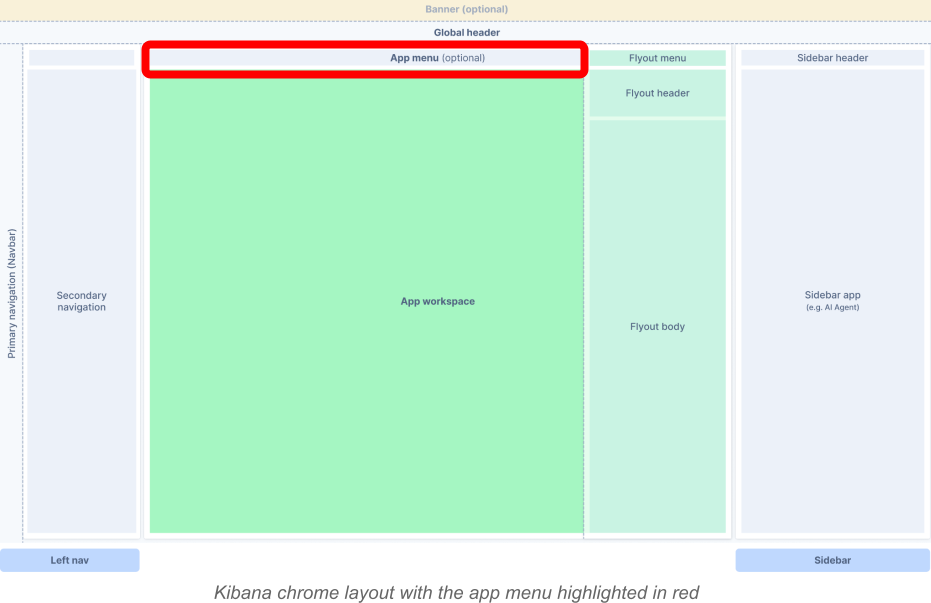

## Introduction

The app menu is an optional section of the Kibana chrome layout located beneath the global header. Each application can define its own menu to group navigation links and actions, giving users quick access to everything relevant to that application.

It offers a structured and organized way to present navigation options and actions by using a strict configuration (`AppMenuConfig`) for defining menu items. This ensures consistency across different applications and improves the overall user experience.



## Usage

There are two ways of adding the app menu to your application:
- declaratively: by rendering the `<AppMenu />` component from `@kbn/core-chrome-app-menu` package, passing the configuration and the `setAppMenu` method from the `chrome` service as props
- imperatively: by calling `setAppMenu` method from the `chrome` service.

It is also possible to use the standalone `<AppMenuComponent />` component by importing it from `@kbn/core-chrome-app-menu-components` package.

## Examples

 **Declarative (preferred)**:

```tsx
import React, { useEffect } from 'react';
import { AppMenu } from '@kbn/core-chrome-app-menu';
import type { AppMenuConfig } from '@kbn/core-chrome-app-menu-components';
import type { CoreStart } from '@kbn/core/public';

interface Props {
  config: AppMenuConfig;
  core: CoreStart;
}

const Example = ({ config, core }: Props) => {
  const { chrome } = core;

  return <AppMenu config={config} setAppMenu={chrome.setAppMenu} />;
};
```

**Imperative**:

```tsx
import React, { useEffect } from 'react';
import type { AppMenuConfig } from '@kbn/core-chrome-app-menu-components';
import type { CoreStart } from '@kbn/core/public';

interface Props {
  config: AppMenuConfig;
  core: CoreStart;
}

const Example = ({ config , core}: Props) => {
  const { chrome } = core

  useEffect(() => {
    chrome.setAppMenu(config);
  }, [chrome.setAppMenu, config]);

  return <div>Hello world!</div>;
};
```

**Standalone component**:

```tsx
import React, { useEffect } from 'react';
import { AppMenuComponent, type AppMenuConfig } from '@kbn/core-chrome-app-menu-components';

interface Props {
  config: AppMenuConfig;
}

const Example = ({ config }: Props) => {
  return <AppMenuComponent config={config} />;
};
```