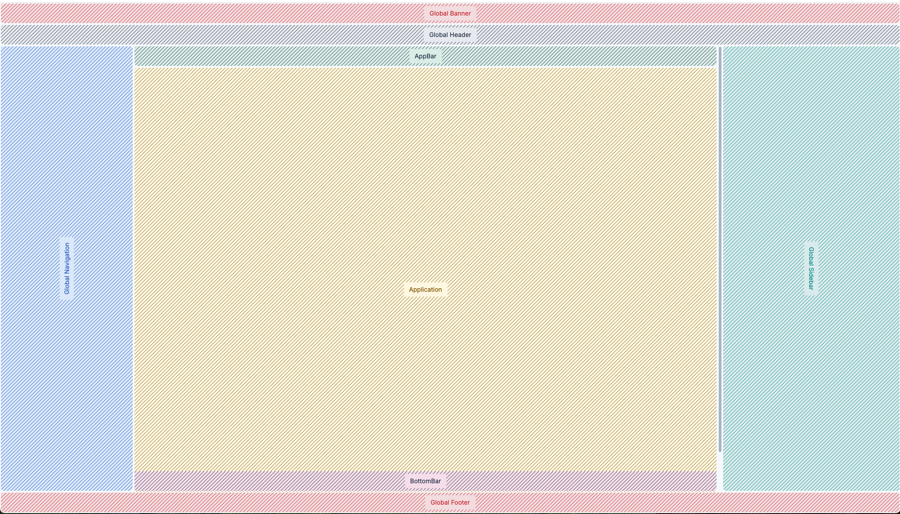
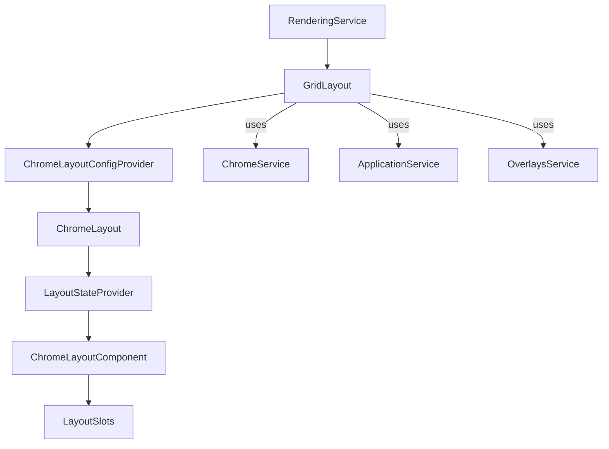

# Chrome layout

How the Kibana chrome layout is assembled, configured, and sized.



## Key packages

- `@kbn/core-chrome-layout` — Kibana layout service, constants, and utilities. Plugins should import from this package.
- `@kbn/ui-chrome-layout` — portable React layout primitives. Not a Kibana plugin dependency.
- `@kbn/core-chrome-layout-utils` — **deprecated.** Re-exports scroll and high-contrast helpers from `@kbn/core-chrome-layout`.
- `@kbn/core-chrome-layout-constants` — **deprecated.** Re-exports CSS variable helpers and IDs from `@kbn/core-chrome-layout`.

## Render flow

1. `RenderingService.renderCore()` constructs the layout service (`GridLayout`).
2. `GridLayout.getComponent()` wires Chrome services and builds a `ChromeLayoutConfig`.
3. `ChromeLayoutConfigProvider` supplies configuration via context.
4. `ChromeLayout` derives `LayoutState` from config + slot presence.
5. `ChromeLayoutComponent` renders slot wrappers into a CSS grid.



## Layout configuration and state

`GridLayout` supplies a `ChromeLayoutConfig` based on Chrome state (style, visibility, sidebar width, banners). `LayoutConfigProvider` merges:

- **Base config** from props
- **Overrides** from `useLayoutUpdate()` (programmatic updates)

`LayoutStateProvider` turns the config into a `LayoutState` that includes:

- Dimensions (`headerHeight`, `navigationWidth`, `applicationTopBarHeight`, …)
- Presence flags (`hasHeader`, `hasNavigation`, `hasApplicationTopBar`, …)

These values drive grid sizing and conditional slot rendering.

## Slots and grid composition

`ChromeLayoutComponent` renders slot wrappers in a CSS grid:

- Banner, Header, Navigation, Sidebar, Footer
- Application area (with optional top and bottom bars)

Slots accept `ReactNode` or a render function that receives the computed `LayoutState`.

## CSS variables and layout sizing

`LayoutGlobalCSS` calculates layout variables based on `LayoutState`. Variables are exposed on `:root` and used for consistent sizing and positioning. Prefer the helpers from `@kbn/core-chrome-layout` to avoid magic strings:

```ts
import { layoutVar } from '@kbn/core-chrome-layout';

const styles = css`
  height: ${layoutVar('header.height')};
  top: ${layoutVar('application.topBar.top')};
`;
```

Use layout variables to:

- Anchor overlays to layout areas without assuming fixed offsets
- Compute sizes with `application.content.height` instead of `100vh - X`
- Avoid chrome-style assumptions; classic and project styles share the same variables
- Stay in sync when sidebar width or app top bars change

## Application scroll container

The main scroll container is the application slot. It is identified by `APP_MAIN_SCROLL_CONTAINER_ID` in `LayoutApplication`. Use `@kbn/core-chrome-layout` to interact with it:

- `getScrollContainer()` to resolve the active scroll root
- `scrollTo`, `scrollToTop`, `getScrollPosition`, and related helpers

Attach virtualized lists, infinite loading, sticky headers, and programmatic scroll to this container rather than `window`. Functional tests that scroll should use the app container so they behave across layout styles.

## EUI flyout overrides

Core layout applies global adjustments to EUI flyouts and overlay masks so they align with the application area rather than the full viewport:

- Overlay masks below the header are bounded to the application area using layout variables.
- Right-side flyouts are positioned using application `top/right/bottom` offsets.
- Push flyouts apply padding to the application scroll container instead of `body`.

These overrides live in `GridLayoutGlobalStyles` from `@kbn/ui-chrome-layout` and are temporary until EUI offers layout-aware flyout positioning. Kibana-specific DOM selectors, legacy `--kbn*` variables, and the fixed chart viewport are applied separately by `KibanaGridLayoutGlobalStyles` in `@kbn/core-chrome-layout`.
