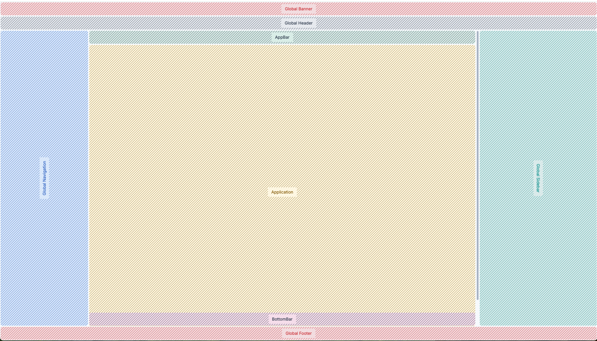
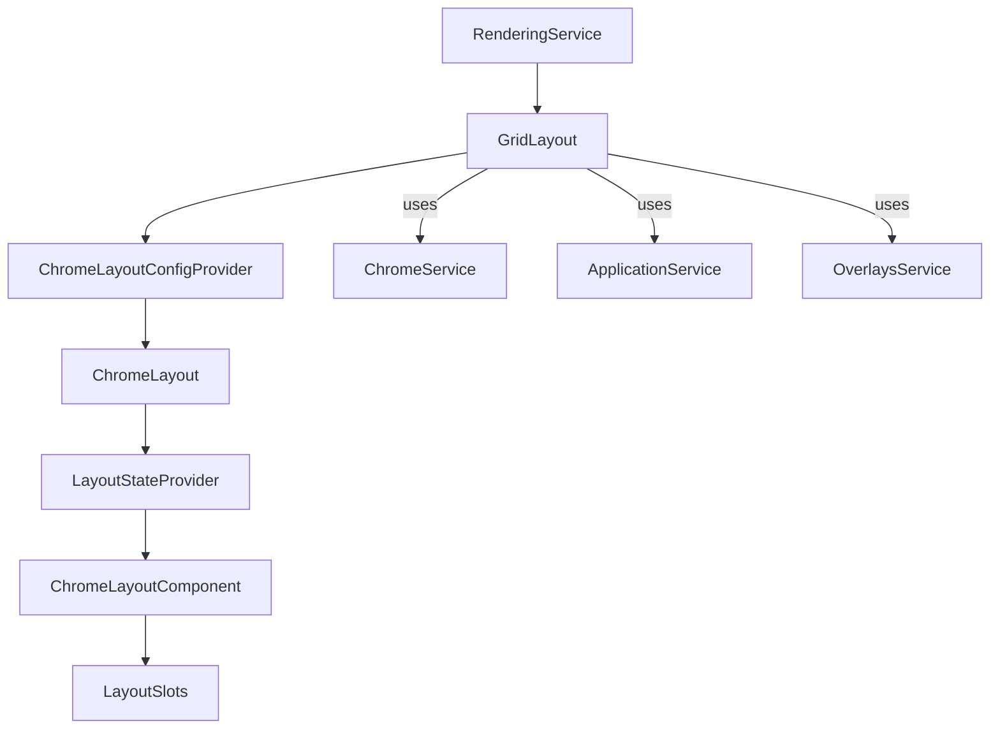

# Kibana layout architecture (grid)

This document explains how the current Kibana Chrome layout is assembled and how the layout
components, configuration, and utilities fit together.



## Key packages

- `@kbn/core-chrome-layout` — internal layout service implementations (currently `GridLayout`).
- `@kbn/core-chrome-layout-components` — public React layout primitives and slots.
- `@kbn/core-chrome-layout-utils` — scroll and high-contrast helpers for layout-aware UI.
- `@kbn/core-chrome-layout-constants` — type-safe CSS variable helpers and IDs.

## Render flow

1. `RenderingService.renderCore()` constructs the layout service (`GridLayout`).
2. `GridLayout.getComponent()` wires Chrome services and builds a `ChromeLayoutConfig`.
3. `ChromeLayoutConfigProvider` supplies configuration via context.
4. `ChromeLayout` derives `LayoutState` from config + slot presence.
5. `ChromeLayoutComponent` renders slot wrappers into a CSS grid.



## Layout configuration and state

`GridLayout` supplies a `ChromeLayoutConfig` based on Chrome state (style, visibility, sidebar
width, banners). `LayoutConfigProvider` merges:

- **Base config** from props
- **Overrides** from `useLayoutUpdate()` (programmatic updates)

`LayoutStateProvider` turns the config into a `LayoutState` that includes:

- Dimensions (`headerHeight`, `navigationWidth`, `applicationTopBarHeight`, …)
- Presence flags (`hasHeader`, `hasNavigation`, `hasApplicationTopBar`, …)

These values drive grid sizing and conditional slot rendering.

## Slots and grid composition

`ChromeLayoutComponent` renders slot wrappers in a CSS grid:

- Banner, Header, Navigation, Sidebar, Footer
- Application area (with optional top and bottom bars)

Slots accept `ReactNode` or a render function that receives the computed `LayoutState`.

## CSS variables and layout sizing

`LayoutGlobalCSS` calculates layout variables based on `LayoutState`. Variables are exposed on
`:root` and used for consistent sizing and positioning. Prefer the helpers from
`@kbn/core-chrome-layout-constants` to avoid magic strings:

```ts
import { layoutVar } from '@kbn/core-chrome-layout-constants';

const styles = css`
  height: ${layoutVar('header.height')};
  top: ${layoutVar('application.topBar.top')};
`;
```

### When to use layout variables

- **Anchor overlays to layout areas**: Position custom popovers/flyouts relative to the header,
  banner, or application content without assuming fixed offsets.
- **Compute sizes reliably**: Use `application.content.height` instead of `100vh - X` to avoid
  drifting when banners, side nav, or top bars appear.
- **Avoid chrome-style assumptions**: The same component behaves in classic and project styles
  by reading the shared layout variables.
- **Keep CSS in sync with runtime layout**: When layout config changes (sidebar width, app
  top bar), variables update automatically without recomputing values in your component.

## Application scroll container

The main scroll container is the application slot. It is identified by
`APP_MAIN_SCROLL_CONTAINER_ID` in `LayoutApplication`. Use `@kbn/core-chrome-layout-utils` to
interact with it in a layout-aware way:

- `getScrollContainer()` to resolve the active scroll root
- `scrollTo`, `scrollToTop`, `getScrollPosition`, etc.

### When to use the application scroll container

- **Listen to scroll events**: Virtualized lists, infinite loading, or sticky headers should
  attach to the app container rather than `window`.
- **Programmatic scrolling**: `scrollToTop` should target the app container so it works when
  the document itself is not scrolling.
- **Viewport measurements**: Use layout utils to measure visible content height in the actual
  scroll root.
- **Test stability**: Functional tests that scroll should use the app container so they behave
  consistently across layout styles.

## EUI flyout overrides

Core layout applies global adjustments to EUI flyouts and overlay masks so they align with the
application area rather than the full viewport:

- **Overlay masks below the header** are bounded to the application area using layout variables.
- **Right-side flyouts** are positioned using application `top/right/bottom` offsets, so they
  sit within the app area even when chrome elements are present.
- **Push flyouts** apply padding to the application scroll container instead of `body`, keeping
  app content aligned with the layout grid.

These overrides live in `GridLayoutGlobalStyles` and are temporary workarounds until EUI offers
first-class layout-aware flyout positioning.

## Debug overlay

Debug overlays are enabled via `core.chrome.layoutDebug: true` and render visual slot boundaries
to help validate layout sizing and presence.
