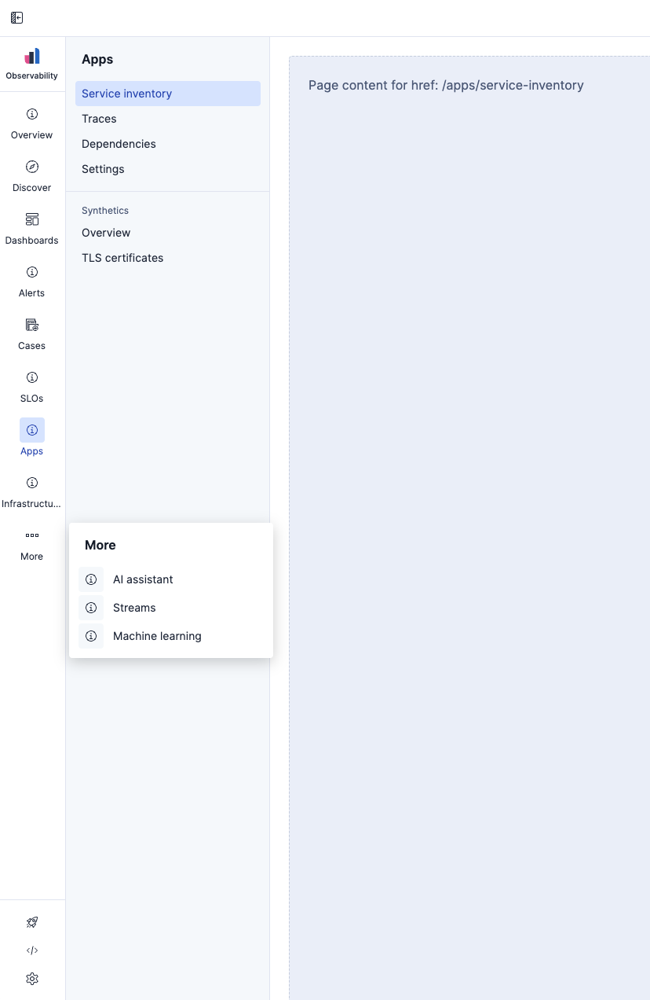
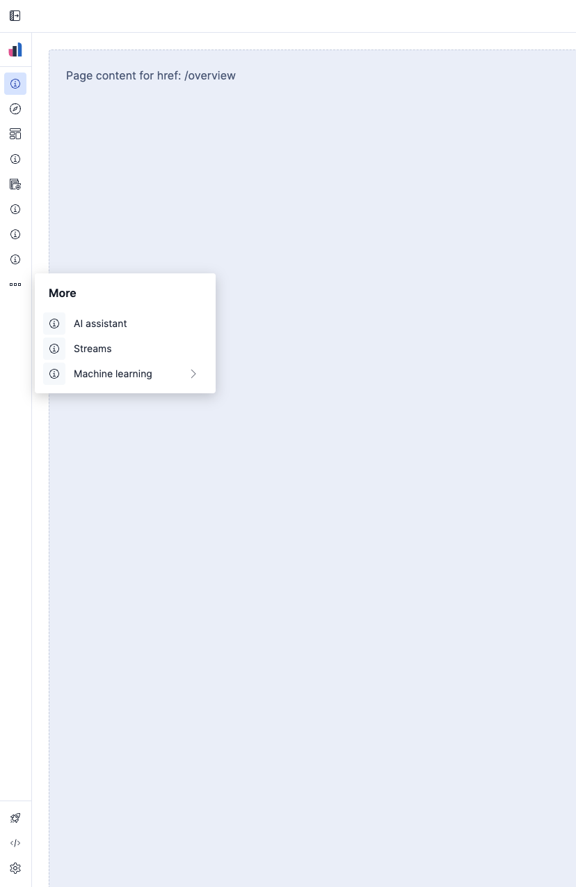

# @kbn/core-chrome-navigation

An adaptive side navigation system built with [Elastic UI](https://eui.elastic.co/). Features responsive design, nested menu structures, and accessibility-first user experience. Exported as a self-contained widget.

| Expanded mode                 | Collapsed mode                 |
| ----------------------------- | ------------------------------ |
|  |  |

## Features

- **Responsive design** - automatically adapts between collapsed and expanded states based on screen size.
- **Smart menu system** - dynamic "More" menu that consolidates overflow items during window resize.
- **Nested navigation** - multi-level menu support with nested popover panels in collapsed mode.
- **Accessibility-first** - WCAG-compliant with proper ARIA labels, keyboard navigation, and screen reader support.
- **Modular architecture** - composable components with clean separation of concerns. Exported as a self-contained widget.
- **Dark mode** and **High contrast mode support**

## Usage

### Basic setup

```tsx
import { Navigation } from '@kbn/core-chrome-navigation';

const navigationItems = {
  primaryItems: [
    {
      id: 'dashboard',
      label: 'Dashboard',
      icon: 'dashboardApp',
      href: '/dashboard',
    },
    {
      id: 'analytics',
      label: 'Analytics',
      icon: 'graphApp',
      href: '/analytics',
      secondaryItems: [
        {
          id: 'overview',
          label: 'Overview',
          href: '/analytics',
        },
        {
          id: 'reports',
          label: 'Reports',
          href: '/analytics/reports',
        },
        {
          id: 'metrics',
          label: 'Metrics',
          href: '/analytics/metrics',
        },
      ],
    },
  ],
  footerItems: [
    {
      id: 'settings',
      label: 'Settings',
      icon: 'gear',
      href: '/settings',
    },
  ],
};

function App() {
  const [isCollapsed, setIsCollapsed] = useState(false);

  return (
    <div className="app">
      <TopBar isCollapsed={isCollapsed} setIsCollapsed={setIsCollapsed} />
      <Navigation
        title="Observability"
        logo="observabilityApp"
        items={navigationItems}
        isCollapsed={isCollapsed}
      />
      <main className="app-content">{/* Your application content */}</main>
    </div>
  );
}
```

### Navigation structure

The navigation is configured by passing the structure to `items` prop. The structure is an array of `MenuItem` objects, where each `MenuItem` can have an optional `sections` array of `Section` objects.

```js
export const navigationItems = {
  primaryItems: [
    // Simple menu item
    {
      id: 'overview',
      label: 'Overview',
      iconType: 'info',
      href: '/overview',
    },
    // Menu item with nested sections
    {
      id: 'analytics',
      label: 'Analytics',
      iconType: 'graphApp',
      href: '/analytics/reports',
      sections: [
        {
          id: 'reports-section',
          label: 'Reports', // or null for unlabeled sections
          items: [
            {
              id: 'overview',
              label: 'Overview',
              href: '/analytics/reports', // has the same `href` as the parent item
            },
            {
              id: 'sales-report',
              label: 'Sales report',
              href: '/analytics/sales',
            },
            {
              id: 'traffic-report',
              label: 'Traffic report',
              href: '/analytics/traffic',
              external: true, // opens in new tab and shows an "external resource" icon
            },
          ],
        },
      ],
    },
  ],
  footerItems: [
    {
      id: 'settings',
      label: 'Settings', // it's required for accessibility purposes
      iconType: 'gear',
      href: '/settings',
    },
  ],
};
```

## Development

1. Install dependencies:

```bash
yarn kbn bootstrap
```

2. Start Storybook:

```bash
yarn storybook shared_ux
```

Open [http://localhost:9001](http://localhost:9001) to view the application.

## Testing

The project includes comprehensive test coverage using Jest and RTL.

Run tests with:

```bash
yarn test:jest src/core/packages/chrome/navigation              # Run all tests
yarn test:jest src/core/packages/chrome/navigation --watch      # Run in watch mode
yarn test:jest src/core/packages/chrome/navigation --coverage   # Generate coverage report
```
