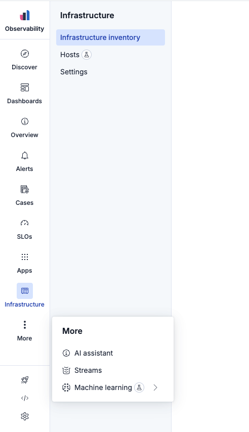
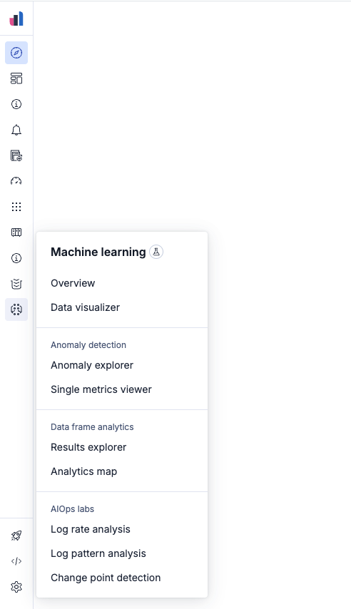

# @kbn/core-chrome-navigation

An adaptive side navigation system built with [Elastic UI](https://eui.elastic.co/). Features responsive design, nested menu structures, and accessibility-first user experience. Exported as a self-contained widget.

| Expanded mode                 | Collapsed mode                 |
| ----------------------------- | ------------------------------ |
|  |  |

## Usage

### Basic setup

```tsx
import { Navigation } from '@kbn/core-chrome-navigation';

const navigationItems = {
  primaryItems: [
    {
      id: 'dashboard',
      label: 'Dashboard',
      icon: 'dashboardApp',
      href: '/dashboard',
    },
    {
      id: 'analytics',
      label: 'Analytics',
      icon: 'graphApp',
      href: '/analytics',
      secondaryItems: [
        {
          id: 'overview',
          label: 'Overview',
          href: '/analytics',
        },
        {
          id: 'reports',
          label: 'Reports',
          href: '/analytics/reports',
        },
        {
          id: 'metrics',
          label: 'Metrics',
          href: '/analytics/metrics',
        },
      ],
    },
  ],
  footerItems: [
    {
      id: 'settings',
      label: 'Settings',
      icon: 'gear',
      href: '/settings',
    },
  ],
};

function App() {
  const [isCollapsed, setIsCollapsed] = useState(false);
  const [activeItemId, setActiveItemId] = useState('dashboard');

  const handleItemClick = (item: MenuItem | SecondaryMenuItem | SideNavLogo) => {
    setActiveItemId(item.id);
    trackAnalytics(item.id);
  };

  return (
    <div className="app">
      <TopBar isCollapsed={isCollapsed} setIsCollapsed={setIsCollapsed} />
      <Navigation
        activeItemId={activeItemId}
        isCollapsed={isCollapsed}
        items={navigationItems}
        logo={{
          label: 'Observability',
          id: 'observability',
          iconType: 'observabilityApp',
          href: '/observability',
        }}
        onItemClick={handleItemClick}
        setWidth={setNavigationWidth}
      />
      <main className="app-content">{/* Your application content */}</main>
    </div>
  );
}
```

### Navigation structure

The navigation is configured by passing the structure to `items` prop. The structure is an array of `MenuItem` objects, where each `MenuItem` can have an optional `sections` array of `Section` objects.

```js
export const navigationItems = {
  primaryItems: [
    // Simple menu item
    {
      id: 'overview',
      label: 'Overview',
      iconType: 'info',
      href: '/overview',
      badgeType: 'techPreview', // for tech preview items
    },
    // Menu item with nested sections
    {
      id: 'analytics',
      label: 'Analytics',
      iconType: 'graphApp',
      href: '/analytics/reports',
      sections: [
        {
          id: 'reports-section',
          label: 'Reports', // omit for unlabeled sections
          items: [
            {
              id: 'analytics', // has the same `id` as the parent item
              label: 'Overview',
              href: '/analytics/reports', // has the same `href` as the parent item
            },
            {
              id: 'sales-report',
              label: 'Sales report',
              href: '/analytics/sales',
              badgeType: 'beta', // for beta items
            },
            {
              id: 'traffic-report',
              label: 'Traffic report',
              href: '/analytics/traffic',
              isExternal: true, // opens in new tab and shows an "external resource" icon
            },
            {
              id: 'conversion-report',
              label: 'Conversion report',
              href: '/analytics/conversion',
              badgeType: 'new', // for new items
            },
          ],
        },
      ],
    },
  ],
  footerItems: [
    {
      id: 'settings',
      label: 'Settings', // it's required for accessibility purposes
      iconType: 'gear',
      href: '/settings',
    },
  ],
};
```

## Navigation Badges

Navigation badges are visual indicators used in the Kibana side navigation to highlight new or experimental features and improve feature discoverability. The system provides three types of visual indicators:

- **Dot Indicator**: A small dot overlay displayed on primary menu items. Shows when a primary menu item or any of its children are marked as "new".
- **"New" Badge**: Text-only badge displayed on "new" secondary menu items (and "new" primary menu items folded into the "More" menu). A badge with the text "New" appears next to the item label or the submenu's title (if a primary menu item is marked as "new" and it contains children).
- **"Beta" and "Tech preview" Badges**: Icon-only badges displayed on primary or secondary menu items.

### Usage

To add a badge to a navigation item, simply add the `badgeType` property to the item configuration as seen on the [Navigation Structure](#navigation-structure) example above.

### Badge Behavior ("New" items only)

Navigation badges with `badgeType: 'new'` are designed to automatically disappear after user interaction:

1. **User visits**: When a user clicks on a navigation item with a "new" badge
2. **Badge persists**: The badge remains visible while the user is on that page
3. **Auto-dismiss**: When the user navigates away to a different page, the badge disappears permanently

Both the dot indicator and the "New" badge follow this behavior. Visited items are tracked in `localStorage`.

### Maximum Limits ("New" items only)

To prevent badge overload, the system enforces strict limits:

**Max 2 new badges per navigation level:**
- **Max 2 new primary items** can show dot indicators simultaneously (including main and footer navigation)
- **Max 2 new secondary items per parent** can show "New" badges simultaneously

## Development

1. Install dependencies:

```bash
yarn kbn bootstrap
```

2. Start Storybook:

```bash
yarn storybook shared_ux
```

Open [http://localhost:9001](http://localhost:9001) to view the application.

## Testing

The project includes comprehensive test coverage using Jest and RTL.

Run tests with:

```bash
yarn test:jest src/core/packages/chrome/navigation              # Run all tests
yarn test:jest src/core/packages/chrome/navigation --watch      # Run in watch mode
yarn test:jest src/core/packages/chrome/navigation --coverage   # Generate coverage report
```
