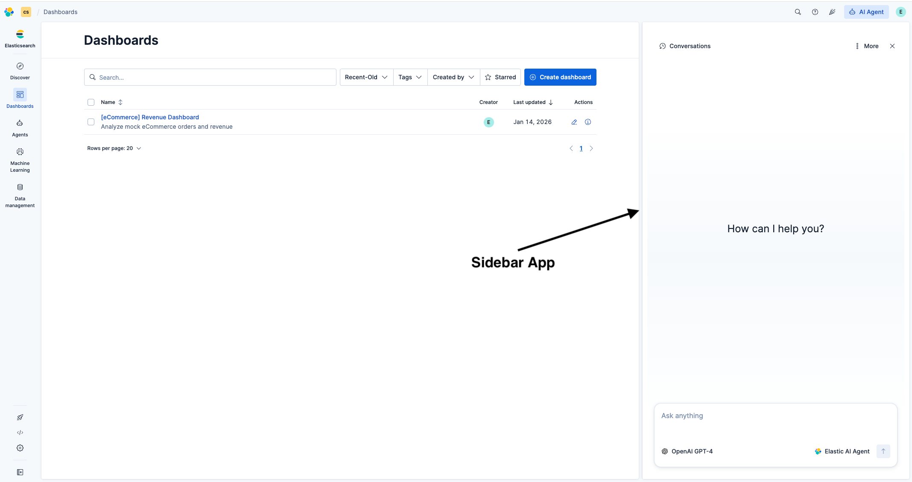

## Introduction

Chrome Sidebar lets plugins provide supplemental tools without disrupting the main app content.
Sidebar apps are global and can stay open across navigation and page reloads.



## Register a sidebar app

Register apps during the plugin `setup()` phase. Each app provides an async component loader and can optionally define a store for state management.

Before registering, confirm the `appId` is allowed. Valid app ids are restricted and new ones should be added only after discussing with the UX team.

```tsx
import { z } from '@kbn/zod/v4';
import { createSidebarStore } from '@kbn/core-chrome-sidebar';

const mySidebarStore = createSidebarStore({
  schema: z.object({
    userName: z.string().default(''),
    count: z.number().default(0),
  }),
  actions: (set, get, { open, close }) => ({
    openWithUser: (userName: string) => {
      set({ userName });
      open();
    },
    increment: () => set((s) => ({ count: s.count + 1 })),
    submitAndClose: async () => {
      await doSomething(get());
      close();
    },
  }),
});

core.chrome.sidebar.registerApp({
  appId: 'mySidebarApp',
  store: mySidebarStore,
  loadComponent: () => import('./my_sidebar_app').then((m) => m.MySidebarApp),
  status: 'available',
});
```

The input to `registerApp` is a `SidebarAppConfig` object with the following fields:

Required:
- `appId`: Unique identifier for the sidebar app. It must be a valid sidebar app id.
- `loadComponent`: Async function that resolves the sidebar React component.

Optional (defaults applied on registration):
- `store`: Store created via `createSidebarStore`. State persists to localStorage.
- `status`: Availability status (defaults to `available`).
- `restoreOnReload`: Whether the app auto-reopens on page reload (defaults to `true`).

After registration, the app is stored as a `SidebarAppDefinition` with `status` and `restoreOnReload` guaranteed.

## Build a sidebar app component

Sidebar components receive `state`, `actions`, and `onClose` (when using a store) or just `onClose` (stateless apps).
Use the shared layout components to align with Kibana styling.

```tsx
import type { SidebarComponentProps } from '@kbn/core-chrome-sidebar';
import { SidebarHeader, SidebarBody } from '@kbn/core-chrome-sidebar-components';

// Infer types from your store
type MyState = typeof mySidebarStore.types.state;
type MyActions = typeof mySidebarStore.types.actions;

export function MySidebarApp({
  state,
  actions,
  onClose,
}: SidebarComponentProps<MyState, MyActions>) {
  return (
    <>
      <SidebarHeader title="My App" onClose={onClose} />
      <SidebarBody>
        <p>User: {state.userName}</p>
        <button onClick={actions.increment}>
          Count: {state.count}
        </button>
        <button onClick={actions.submitAndClose}>Submit</button>
      </SidebarBody>
    </>
  );
}
```

### Type inference

Extract state and action types from your store using `typeof store.types`. This keeps types in sync with your schema and actions:

```tsx
// Define store
const mySidebarStore = createSidebarStore({ schema, actions });

// Extract types for use in components
type MyState = typeof mySidebarStore.types.state;
type MyActions = typeof mySidebarStore.types.actions;

// Use with SidebarComponentProps
function MyComponent(props: SidebarComponentProps<MyState, MyActions>) { ... }
```

### Stateless apps

For simple sidebar apps that don't need persisted state, omit the `store` property. The component receives only `onClose`:

```tsx
import type { SidebarComponentProps } from '@kbn/core-chrome-sidebar';
import { SidebarHeader, SidebarBody } from '@kbn/core-chrome-sidebar-components';

// Register without store
core.chrome.sidebar.registerApp({
  appId: 'helpPanel',
  restoreOnReload: false,
  loadComponent: () => import('./help_panel').then((m) => m.HelpPanel),
});

// Component receives only onClose
export function HelpPanel({ onClose }: SidebarComponentProps) {
  return (
    <>
      <SidebarHeader title="Help" onClose={onClose} />
      <SidebarBody>
        <p>Documentation and support resources.</p>
      </SidebarBody>
    </>
  );
}
```

Use internal React state (`useState`) for ephemeral UI that doesn't need to survive page reloads. Set `restoreOnReload: false` to prevent the sidebar from reopening with empty state.

## Store and actions

Stores provide a persisted, validated state layer with custom actions:
- State persists to `localStorage` and restores on reload.
- Actions can control sidebar visibility via the `sidebar` context.
- State is accessible outside the component via the app-bound API.
- Validated and typed through Zod schemas.

### Creating a store

```tsx
import { z } from '@kbn/zod/v4';
import { createSidebarStore } from '@kbn/core-chrome-sidebar';

const store = createSidebarStore({
  schema: z.object({
    conversationId: z.string().default(''),
    messages: z.array(z.string()).default([]),
  }),
  actions: (set, get, { open, close, isCurrent }) => ({
    // Action that opens the sidebar with state
    openConversation: (id: string) => {
      set({ conversationId: id, messages: [] });
      open();
    },
    addMessage: (msg: string) => set((s) => ({ 
      messages: [...s.messages, msg] 
    })),
    closeIfCurrent: () => {
      if (isCurrent()) close();
    },
  }),
});
```

The actions factory receives three arguments:
- `set`: Update state (partial object or updater function)
- `get`: Read current state
- `sidebar`: Control sidebar visibility (`open`, `close`, `isCurrent`)

### Async actions with error handling

Async actions work naturally. Use try/catch to handle errors and update loading/error state:

```tsx
const store = createSidebarStore({
  schema: z.object({
    data: z.string().nullable().default(null),
    loading: z.boolean().default(false),
    error: z.string().nullable().default(null),
  }),
  actions: (set, get, { close }) => ({
    saveData: async () => {
      set({ loading: true, error: null });
      try {
        await api.save(get().data);
        close();
      } catch (e) {
        set({ loading: false, error: e.message });
      }
    },
  }),
});
```

### Accessing state externally

```tsx
const myApp = core.chrome.sidebar.getApp('mySidebarApp');

// Call actions to open with state
myApp.actions.openConversation('abc-123');

// Read state
const state = myApp.getState();
myApp.getState$().subscribe((next) => {
  console.log('State changed:', next);
});
```

## Open and close the sidebar

Use the app-bound API during the plugin `start()` phase. Open the sidebar via actions to set initial state:

```tsx
const myApp = core.chrome.sidebar.getApp('mySidebarApp');

// Open with state via action
myApp.actions.openConversation('abc-123');

// Open with default state
myApp.open();

// Close
myApp.close();

const isOpen = core.chrome.sidebar.isOpen();
const currentAppId = core.chrome.sidebar.getCurrentAppId();
```

From React components, use hooks from `@kbn/core-chrome-sidebar-components`:

```tsx
import { useSidebar, useSidebarApp } from '@kbn/core-chrome-sidebar-components';

function MyToolbarButton() {
  const { close, isOpen } = useSidebar();
  const myApp = useSidebarApp('mySidebarApp');

  return (
    <>
      <button onClick={() => myApp.actions.openConversation('abc-123')}>
        Open with conversation
      </button>
      <button onClick={myApp.open}>
        Open with defaults
      </button>
      {isOpen && <button onClick={close}>Close sidebar</button>}
    </>
  );
}
```

## Manage app status

Sidebar apps have three possible statuses to handle async checks (license, permissions, feature flags):

- **`available`** (default): App is ready to render. Can be opened and restored on page reload.
- **`pending`**: Async checks are in progress. Calling `open()` shows a loading skeleton that is replaced with the app component once status changes to `available`. Can be opened and restored on page reload.
- **`unavailable`**: App will not become available. Cannot be opened (`open()` throws) or restored on reload. If the sidebar is currently showing this app, it closes automatically.

```tsx
const updateMySidebarApp = core.chrome.sidebar.registerApp({
  appId: 'mySidebarApp',
  loadComponent: () => import('./my_sidebar_app').then((m) => m.MySidebarApp),
  status: 'pending',
});

core.chrome.sidebar.getApp('mySidebarApp').open(); // Shows loading skeleton

// After async checks complete
updateMySidebarApp({ status: 'available' }); // App component appears

// Or if the check fails
updateMySidebarApp({ status: 'unavailable' }); // Sidebar closes automatically
```

Use `getStatus()` / `getStatus$()` or the `useSidebarApp` hook to check status reactively:

```tsx
import { useSidebarApp } from '@kbn/core-chrome-sidebar-components';

function MyComponent() {
  const { status, open } = useSidebarApp('mySidebarApp');
  
  return (
    <button disabled={status === 'unavailable'} onClick={open}>
      Open Sidebar
    </button>
  );
}
```

## Control sidebar width

```tsx
core.chrome.sidebar.setWidth(400);
const width = core.chrome.sidebar.getWidth();
```

```tsx
import { useSidebarWidth } from '@kbn/core-chrome-sidebar-components';

const width = useSidebarWidth();
```

## Testing

Use `@kbn/core-chrome-sidebar-mocks` to mock setup/start contracts in Jest tests.

```tsx
import { sidebarServiceMock } from '@kbn/core-chrome-sidebar-mocks';

const setupMock = sidebarServiceMock.createSetupContract();
const startMock = sidebarServiceMock.createStartContract();
```

## Accessibility

The sidebar renders as an `<aside>` landmark. `SidebarHeader` and `SidebarBody` handle most a11y concerns automatically, but apps must follow a few rules.

### Panel label

The sidebar panel uses `aria-labelledby` to link the `<aside>` landmark to the heading rendered by `SidebarHeader`. This happens automatically — `SidebarHeader` places the shared heading ID on its `<h2>`, and the panel references it. A fallback `aria-label="Side panel"` is used when no heading is present.

`SidebarHeader` requires a `title` prop. It renders as an `<h2>` heading that labels the panel. When using custom header content via `children`, `title` is still required — it renders as a visually hidden heading so `aria-labelledby` always works:

```tsx
<SidebarHeader title="My App" onClose={onClose}>
  <CustomHeaderContent />
</SidebarHeader>
```

If you don't use `SidebarHeader` at all (fully custom header), you must place the heading ID on your own heading element via `useSidebarPanel`:

```tsx
import { useSidebarPanel } from '@kbn/core-chrome-sidebar-components';

const { headingId } = useSidebarPanel();

return <h2 id={headingId}>My App</h2>;
```

### Focus rescue

When the sidebar closes while focus is inside, focus is automatically moved to the main content area. Apps can override this with a custom callback via `useSidebarPanel`:

```tsx
import { useSidebarPanel } from '@kbn/core-chrome-sidebar-components';

const { setOnFocusRescue } = useSidebarPanel();

useEffect(() => {
  setOnFocusRescue(() => triggerButtonRef.current?.focus());
}, [setOnFocusRescue]);
```

### Scrollable body

Pass `scrollable` to make `SidebarBody` keyboard-scrollable (`tabIndex={0}`) and announce it as a region to screen readers:

```tsx
<SidebarBody scrollable>
  {/* long content */}
</SidebarBody>
```

## Design rationale

The sidebar uses a store-based architecture rather than a simple `openSidebar(component)` API for three reasons:

**Core controls lifecycle.** The sidebar persists across Kibana app navigation and survives page reloads. Core decides when to restore the sidebar - plugins provide state, core manages when and how it's used.

**Consistency across apps.** All sidebar apps follow the same state management pattern. This makes apps predictable: state is always validated, persisted, and accessible the same way.

**Cross-plugin access without circular dependencies.** Any plugin can call `sidebar.getApp('chat').actions.open()` without importing the chat plugin. State and actions are accessible through core, avoiding dependency cycles.

## Best practices

- Wrap sidebar operations in your plugin contract or a custom hook, instead of exposing the raw sidebar API.
- Use store state for data that must survive navigation or reloads; use component state for ephemeral UI.
- Define actions for all state mutations - this keeps state changes predictable and testable.
- Use sidebar context (`open`, `close`) in actions to couple state changes with visibility control.
- Prefer `SidebarHeader` and `SidebarBody` for consistent layout and spacing.
- Set `restoreOnReload: false` for stateless apps to prevent the sidebar from reopening with empty state after page reload.
