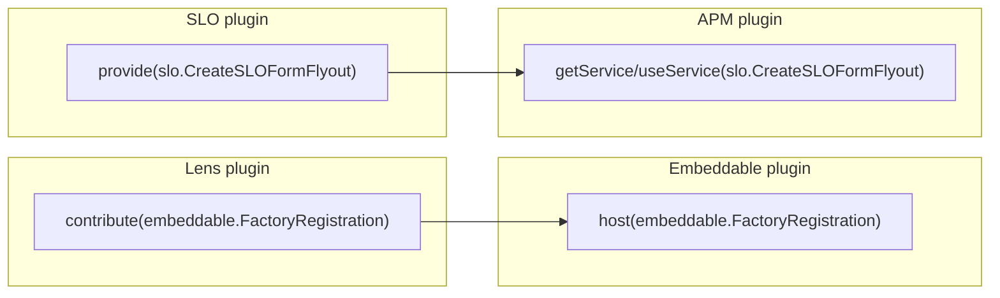

# Services and Extension Points: Analysis and Guide

This document explains the cross-plugin DI proof of concept on the
`exploration/di` branch. The mechanism is proven: plugins can share optional
contracts without forcing every relationship through classic plugin dependency
declarations in `kibana.jsonc`.

What is still open is the long-term governance and DX layer. The runtime
mechanism, manifest visibility model, and startup validation are concrete. The
helper package shape should still be treated as exploratory.

The branch now distinguishes two different patterns:

1. **Services**: one plugin owns and provides one contract; other plugins resolve
   that contract as a single value.
2. **Extension points**: one plugin owns and hosts a collection point; other
   plugins contribute implementations; the host resolves them as a collection.

---

## How it works

Normally, if Plugin A wants to use something from Plugin B, it has to declare
Plugin B as a dependency. That creates tight coupling and can produce awkward
dependency webs or bridge plugins.

With cross-plugin DI, the relationship is expressed through a typed token:

1. **Declare** the token in a shared types package.
2. **Register** it explicitly as either a service or an extension point.
3. **Resolve** it using APIs that preserve the intended semantics.

The platform wires these registrations through the DI hierarchy so that services
and contributions remain available across plugin scopes and request/application
forks.

---

## The two patterns

### 1. Services

Use a service when one plugin owns a contract and other plugins should resolve a
single implementation.

- Provider-side API: `createTokenFactory(...).service`, `provide`
- Consumer-side API: `getService`, `useService`, `injectService`
- Validation rule: a consumed service must have exactly one provider

This is the right fit for optional UI sharing, optional server capabilities, and
cross-plugin contracts that have a clear owner.

### 2. Extension points

Use an extension point when one plugin owns a collection point and other plugins
should contribute implementations into that collection.

- Host-side API: `createTokenFactory(...).extensionPoint`, `host`
- Contributor-side API: `contribute`
- Resolution API: `getExtensions`, `useExtensions`, `injectExtensions`
- Validation rule: contributed extension points must have exactly one host;
  zero contributions are valid

This is the right fit for registry replacement patterns like embeddable factory
registration.

---

## What problems this solves

### 1. Sharing optional UI or services across plugins

If APM wants to show an SLO flyout, it no longer needs a direct plugin
dependency on SLO. SLO provides a service token and APM resolves it as an
optional service.

### 2. Replacing optional classic start-contract checks

Many routes and components currently rely on patterns like `plugins.fleet?.start()`.
Service tokens replace that with a standard, type-safe lookup model:
"resolve this service if it exists; otherwise continue without it."

### 3. Breaking circular dependencies

Mutual optional relationships can now be expressed as two independent services
instead of a circular plugin dependency declaration. The Alpha/Beta example on
this branch demonstrates that pattern directly.

### 4. Replacing manual registries

Instead of forcing plugins to call host-owned registration APIs, a host plugin
can declare an extension point and resolve all contributions from DI. The
embeddable factory example on this branch demonstrates that pattern.

---

## Pros and cons

### Benefits

- **Different patterns have different APIs:** services and extension points are
  explicit on both the provider and consumer sides.
- **Fixes circular dependencies:** plugins can share optional contracts without
  declaring each other as required dependencies.
- **Easier migration:** classic `setup()` and `start()` contracts can still be
  bridged into DI.
- **Better testing:** tests can bind or mock a focused token instead of a whole
  plugin contract.
- **Clearer validation:** the platform can distinguish "exactly one provider"
  from "zero to many contributors."

### Trade-offs and risks

- **Hidden runtime coupling:** plugin relationships are not fully visible through
  `requiredPlugins` alone.
  Fix: `plugin.globals` now records services and extension points separately, and
  the linter keeps those declarations up to date.
- **Late errors remain possible:** a service may still fail at resolution time if
  the owning plugin is disabled or not loaded.
  Fix: startup validation surfaces missing providers and hosts before those
  runtime paths are hit. On the server, validation can warn or throw depending
  on configuration; in the browser, validation currently warns without
  preventing startup.
- **Browser loading still matters:** in the browser, the owning plugin's bundle
  still has to load.
  Fix: for now, `requiredBundles` may still be needed in browser scenarios.

---

## What this branch adds

To make the model explicit and safe, the branch adds:

1. **Two token kinds**
   - `createTokenFactory(...).service(...)`
   - `createTokenFactory(...).extensionPoint(...)`
2. **Explicit registration helpers**
   - `provide(...)`
   - `host(...)`
   - `contribute(...)`
3. **Explicit resolution helpers**
   - `getService(...)`, `useService(...)`, `injectService(...)`
   - `getExtensions(...)`, `useExtensions(...)`, `injectExtensions(...)`
4. **Kind-aware manifest tracking**
   - `plugin.globals.services.provides`
   - `plugin.globals.services.consumes`
   - `plugin.globals.extensionPoints.hosts`
   - `plugin.globals.extensionPoints.contributes`
5. **Kind-aware validation**
   - missing or duplicate service providers are flagged
   - missing or duplicate extension-point hosts are flagged

---

## The verdict

Cross-plugin DI is useful, but only when the architecture distinguishes the two
patterns it is modeling.

**Services** are the right abstraction for optional cross-plugin capabilities,
shared UI entry points, and mutual optional relationships.

**Extension points** are the right abstraction for registry replacement and
plugin contribution models.

The branch now demonstrates both:

1. **SLO ↔ APM** as a service-sharing pattern.
2. **Alpha ↔ Beta** as a mutual service pattern.
3. **Embeddable factory registration** as an extension-point pattern.

That distinction is what turns the branch from a generic "global DI" experiment
into a concrete proposal for services and extension points.

The recommended framing for review is:

- The runtime mechanism works and is worth evaluating.
- The manifest layer is about plugin contract visibility, not DI ideology.
- The helper package is optional sugar and should not be mistaken for the
  settled long-term API surface.
