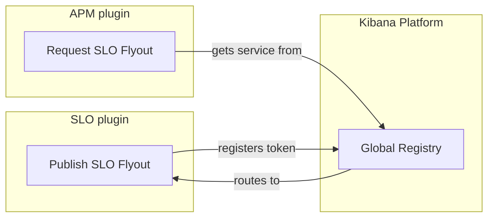

# Global DI: Analysis and Guide

This document explains the new "Global DI" approach tested in the `exploration/di` branch. The goal is to let plugins share services without having to explicitly list each other as dependencies in their `kibana.jsonc` files.

---

## How it works

Normally, if Plugin A wants to use a service from Plugin B, it has to declare Plugin B as a dependency. This creates tight connections and can lead to complex dependency webs.

With Global DI, we change the approach:
1. **Publish**: A plugin makes a service available globally using a special "token" (a unique identifier).
2. **Consume**: Any other plugin can ask for that token to use the service.

Behind the scenes, Kibana creates a bridge so the consuming plugin can access the publishing plugin's service automatically. The service is only requested when it's actually needed (lazy loading).

---

## What problems does this solve?

### 1. Showing one plugin's UI inside another plugin

Currently, if APM wants to show an SLO flyout, it has to depend on the SLO plugin. With Global DI, SLO just publishes its flyout, and APM consumes it. This works great for observability apps sharing UI, ML anomaly detection in the Infra app, etc.

### 2. Using optional services on the server

Many server routes check if an optional plugin is available before calling it (e.g., `plugins.fleet?.start()`). Global DI replaces this with a standard, type-safe way to ask for a service: "Give me this service if it exists, otherwise do nothing."

### 3. Fixing circular dependencies

Sometimes plugins need each other, which Kibana normally forbids (circular dependencies). We currently use awkward workarounds like dummy "sidecar" plugins or shared folders. Global DI fixes this by letting both plugins simply consume each other's globally published services.

### 4. Collecting plugins together (Registries)

Instead of having a central plugin that forces everyone to register with it (like `embeddable.registerFactory(...)`), plugins can just publish their factories to a shared global token. The central plugin then gathers them all up at once.

---

## Pros and Cons

### Benefits

- **Fixes Circular Dependencies:** Plugins can use each other's services without breaking Kibana's rules.
- **Easy Migration:** You can use Global DI alongside the classic `setup()` and `start()` lifecycle. You don't have to rewrite your whole plugin at once.
- **Better Testing:** It's easier to mock a single Global DI token in unit tests than to mock an entire plugin.
- **Clean Code:** Provides a standard, safe way to handle optional services.

### Trade-offs & Risks

- **Hidden Dependencies:** Because plugins don't list each other in `requiredPlugins`, it's harder for tools to know who depends on whom.
  *Fix:* We added `globals.published` and `globals.consumed` to `kibana.jsonc`, which are automatically updated by a linter.
- **Late Errors:** If a required plugin is missing, it might only crash when a user clicks a specific button, instead of failing immediately when Kibana starts.
  *Fix:* The platform now checks for missing services at startup and prints warnings.
- **Hard to Find Services:** Developers might not know what global services are available.
  *Fix:* We now generate a `global-tokens.json` file that lists every available global service.
- **Browser Loading Issues:** In the browser, Kibana only loads plugin code if it thinks it's needed. If there's no official dependency, the publishing plugin might never load, meaning the service won't exist.
  *Fix:* For now, you must use `requiredBundles` in your `kibana.jsonc` to force the browser to load the other plugin. In the future, Kibana will load these automatically when requested.

---

## What we added in this PoC

To make this safe and easy to use, we built:

1. **Automatic Bridges**: You don't have to rewrite your existing plugin services to use DI. The platform automatically bridges classic plugin `start` services into DI.
2. **Manifest Tracking**: `kibana.jsonc` now tracks `globals.published` and `globals.consumed`. A new linter automatically keeps these up to date based on your code.
3. **Naming Rules**: A lint rule ensures tokens follow a strict `<pluginId>.<ServiceName>` format so they don't clash.
4. **Startup Validation**: Kibana warns you at startup if you are trying to consume a global service that isn't provided by any enabled plugin.

---

## The Verdict

Global DI is a great way to share services between plugins.

**For the Server**: It's ready to use right now. It perfectly replaces the current `plugins.X?.start()` pattern.
**For the Browser**: It works well, but you still need to use `requiredBundles` to make sure the code loads. A future update will fix this.

We've already successfully used it in this branch to:
1. Share the SLO flyout with APM.
2. Replace the Embeddable factory registry.
3. Create an example of two plugins using each other (Alpha and Beta plugins).
