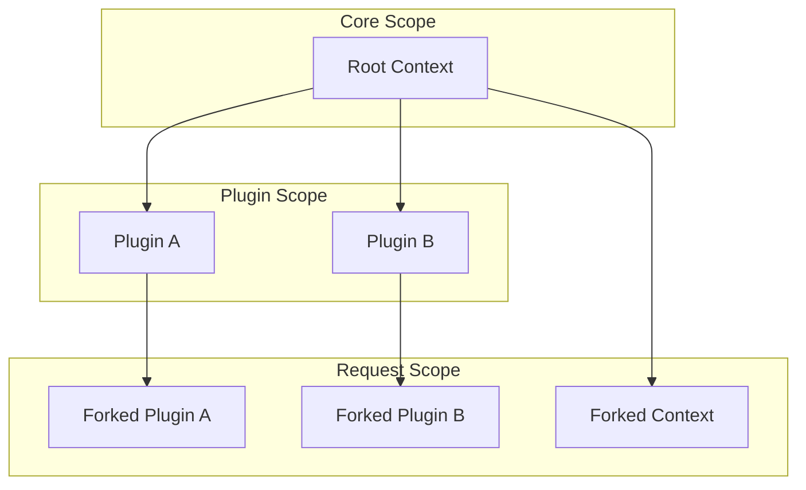

# Kibana's Dependency Injection Subsystem

This package documents Kibana's runtime DI subsystem: container hierarchy,
lifecycle tokens, resolution helpers, and the way plugin and core services are
wired through InversifyJS.

The plugin-author ergonomics for this proof of concept live alongside
[`@kbn/plugin-di`](../plugin/README.md); see its
[`GETTING_STARTED.md`](../plugin/GETTING_STARTED.md) for the authoring workflow.

## Motivation
- *Decoupling* should improve reusability, testability, and maintainability.
- Prevent *circular dependencies*.
- *Inversion of Control* should help to get rid of dependencies forwarding and build clear abstraction layers.
- *Clean Code* should provide declarativity and minimize the amount of boilerplate code.

## Dependencies
Kibana's DI subsystem is built on top of
[InversifyJS](https://www.npmjs.com/package/inversify).

- `@kbn/core-di` exposes runtime-facing primitives: resolution helpers,
  decorators, lifecycle tokens, and shared DI types.
- `@kbn/plugin-di` is a separate optional PoC helper package for plugin-author
  ergonomics such as `createTokenFactory(...)` and `declare(...)`.

Plugins can always use plain
[Container Modules](https://inversify.io/docs/api/container-module/) directly.
The helper package is convenience, not a competing DI runtime.

## Approach
The provided DI subsystem imposes declaring your services and their dependencies declaratively.

This approach is different from the classic one when plugins implement lifecycle stages. That does not abolish the current functionality but only changes how the code is organized.

That change is required to resolve most of the challenges related to circular dependencies. It also follows the Inversion of Control design principle, which should simplify the plugin's code as it encapsulates all the complexity related to the internal Kibana lifecycles.

The Dependency Injection Subsystem is not a replacement for the existing plugin API. All the services exposed using InversifyJS are accessible in the classic plugins, or the other way around. A plugin can use both simultaneously and gradually migrate to the declarative DI API.

## Implementation
The implementation utilizes the [hierarchical dependency injection](https://inversify.io/docs/fundamentals/di-hierarchy/) provided by InversifyJS. Every plugin has its own container inherited from the root one. That provides sufficient level of isolation with an option to share common services.


```mermaid
graph TD

subgraph Core Scope
Root[Root Context]
end

subgraph Plugin Scope
A[Plugin A]
B[Plugin B]
end

subgraph Request Scope
ForkA[Forked Plugin A]
ForkB[Forked Plugin B]
ForkContext[Forked Context]
end

Root --> A
Root --> B

A --> ForkA
B --> ForkB
Root --> ForkContext
```

There are two limitations in this setup:
1. There is no way to publish services registered in the plugin scope to make them available for other plugins.
2. The request-scoped services bound in the forked context will not be available in a forked plugin scope.

The internal module provided by the core services solves those problems by
introducing explicit cross-plugin contracts:

- **Services** for single-owner, single-value contracts.
- **Extension points** for single-host, multi-contributor contracts.

Those contracts are registered in a shared scope so every plugin container can
inherit them. They are resolved dynamically through the bound context so that
services bound in the request scope can still inject request-scope dependencies.

## Usage
### Get Started
To get started, create an empty plugin and declare a named export called
`services` in your `index.ts`. The plugin-author guide for the PoC lives in
[`@kbn/plugin-di/GETTING_STARTED.md`](../plugin/GETTING_STARTED.md).

The short version is:

- define cross-plugin tokens with `createTokenFactory('myPlugin')`
- author a plugin `services` module with `declare(({ bind, provide, host, contribute }) => ...)`

```ts
import { declare } from '@kbn/plugin-di';
import { inject, injectable } from 'inversify';

@injectable()
export class Greeting {
  greet(name: string): string {
    return `Hello, ${name}!`;
  }
}

export const services = declare(({ bind }) => {
  bind(Greeting).toSelf();
});
```

The service is now available to other `ContainerModule`s within the same plugin scope.

```ts
import { declare } from '@kbn/plugin-di';
import { inject, injectable } from 'inversify';
import { Greeting } from '@kbn/greeting';

@injectable()
class HelloWorld {
  constructor(@inject(Greeting) private greeting: Greeting) {}

  run() {
    this.greeting.greet('World');
  }
}

export const services = declare(({ bind }) => {
  bind(HelloWorld).toSelf();
});
```

> **Note:** Plugins may also export a `module` named export (`export const module = new ContainerModule(...)`) when they want to author bindings directly with plain Inversify. The `services = declare(...)` form is the blessed `@kbn/plugin-di` authoring path in this PoC; if both are present, `services` wins.

### Exposing Contracts
In order to expose services to already existing plugins, they should be returned as part of the contract via the `Setup` or `Start` services.

```ts
import { ContainerModule } from 'inversify';
import { Start } from '@kbn/core-di';
import { HelloWorld } from './src/hello-world';

export const module = new ContainerModule(({ bind }) => {
  bind(HelloWorld).toSelf();
  bind(Start).toResolvedValue(
    (helloWorld) => ({ helloWorld }),
    [HelloWorld]
  );
});
```

Plugins may define both classic and module-based contracts simultaneously.
This is to provide a seamless migration path from the classic approach.
In this case, the contract returned from the classic definition has precedence over the one defined in the container module.


### Lifecycle Hooks
It is possible to subscribe to the lifecycle events and run some initialization logic. This can be done via binding `OnSetup` or `OnStart` callbacks. It is allowed to bind multiple of the same kind.

There is no dedicated teardown hook alike `stop` in the classic plugins.
That's done in favor of the built-in [deactivation](https://inversify.io/docs/fundamentals/lifecycle/deactivation/) lifecycle hook.

When Kibana is stopping all the services within a container a being unbound, and hence, all the registered deactivation hooks are being called.
Note that within the request scope, the deactivation hooks will be called upon scope disposal after the request has been handled.

```ts
import { ContainerModule } from 'inversify';
import { OnSetup, OnStart } from '@kbn/core-di';
import { HelloWorld } from '@kbn/hello-world';
import { download } from './src/chromium',

export const module = new ContainerModule(({ bind }) => {
  bind(OnSetup).toConstantValue(download);
  bind(OnStart).toResolvedValue(
    (helloWorld) => () => console.log(helloWorld.run()),
    [HelloWorld]
  );
});
```

### Existing Plugins
The `PluginSetup` and `PluginStart` injection tokens can be used to inject existing plugins without migrating or adapting them. This is similar to accessing plugin dependencies from the lifecycle methods.

```ts
import { inject, injectable } from 'inversify';
import { PluginSetup } from '@kbn/core-di';
import { EmbeddableSetup } from '@kbn/embeddable-plugin/server';

@injectable()
class SomeService {
  constructor(@inject(PluginSetup('embeddable')) private embeddable: EmbeddableSetup) {}

  run() {
    // this.embeddable...
  }
}
```

### Core Services
The core services can be accessed in a similar manner, but instead, the `CoreSetup` and `CoreStart` tokens from `@kbn/core-di-browser` and `@kbn/core-di-server` should be used.

```ts
import { inject, injectable } from 'inversify';
import { CoreStart } from '@kbn/core-di-browser';
import type { HttpStart } from '@kbn/core-http-browser';

@injectable()
export class Greeting {
  constructor(@inject(CoreStart('http')) private readonly http: HttpStart) {}

  public greet(name: string): Promise<string> {
    return this.http.post<string>('/api/greeting', {
      body: JSON.stringify(name),
    });
  }
}
```

### HTTP Routing
The HTTP routes can be registered declaratively using the `Route` token from `@kbn/core-di-server`.
All the explicit routes bindings should be bound in the request [scope](https://inversify.io/docs/fundamentals/binding/#scope).

The DI service will register a wrapper that dynamically instantiates the bound route handler.
In this case, an isolated scope is created that should inherit all the plugin's services and global services from other plugins.

The current request and the response factory will be available in the request container via the `Request` and `Response` tokens, respectively.

After handling the request, the request scope is disposed automatically and all the services bound in the request container will be unbound asynchronously.

```ts
import { ContainerModule, inject, injectable } from 'inversify';
import { Request, Response, Route } from '@kbn/core-di-server';
import type { KibanaRequest, KibanaResponseFactory } from '@kbn/core-http-server';
import { Greeting } from '@kbn/greeting';

@injectable()
class GreetingRoute {
  static method = 'post' as const;
  static path = '/api/greeting';
  static validate = {
    // ...
  } as const;
  static options = {
    // ...
  } as const;
  static security = {
    // ...
  } as const;

  constructor(
    @inject(Greeting) private readonly greeting: Greeting,
    @inject(Request) private readonly request: KibanaRequest,
    @inject(Response) private readonly response: KibanaResponseFactory
  ) {}

  handle() {
    const greeting = this.greeting.greet(this.request.body);

    return this.response.ok({
      headers: { 'content-type': 'application/json' },
      body: JSON.stringify(greeting),
    });
  }
}

export const module = new ContainerModule(({ bind }) => {
  bind(Route).toConstantValue(GreetingRoute);
});
```

### Browser-Side Applications
The concept is the same as that of HTTP routing.
The `Application` token can register an application mount handler.
And the mount parameters can be accessed using the `ApplicationParameters` token.

```ts
import ReactDOM from 'react-dom';
import { ContainerModule, inject, injectable } from 'inversify';
import type { AppMountParameters, AppUnmount } from '@kbn/core-application-browser';
import { Application, ApplicationParameters } from '@kbn/core-di-browser';

@injectable()
class HelloWorldApplication {
  public static id = 'helloWorldApplication';
  public static title = 'Hello World';
  public static visibleIn = [];

  constructor(
    @inject(ApplicationParameters) private readonly params: AppMountParameters
  ) {}

  mount(): AppUnmount {
    const { element } = this.params;
    ReactDOM.render(
      /* ... */,
      element
    );

    return () => ReactDOM.unmountComponentAtNode(element);
  }
}

export const module = new ContainerModule(({ bind }) => {
  bind(Application).toConstantValue(HelloWorldApplication);
});
```

### React
The DI can be used from within a React application.
`@kbn/core-di-browser` provides `useContainer`, `useService`, and `useExtensions`
for resolving DI contracts in React components.

In order to use them, the corresponding context should be provided:
```tsx
import React from 'react';
import ReactDOM from 'react-dom';
import { inject, injectable } from 'inversify';
import { Context, CoreStart } from '@kbn/core-di-browser';

@injectable()
class HelloWorldApplication {
  // ...

  constructor(
    // ...
    @inject(CoreStart('injection')) private readonly di: CoreDiServiceStart
  ) {}

  mount() {
    ReactDOM.render(
      <Context.Provider value={this.di.getContainer()}>
        <HelloWorldApp />
      </Context.Provider>,
      this.params.element
    );

    // ...
  }
}
```

And then, `useService` can be used to resolve a single service from the plugin's
scope:
```tsx
import React from 'react';
import { useService } from '@kbn/core-di-browser';
import { HelloWorld } from '@kbn/hello-world';

export function HelloWorldApp() {
  const helloWorld = useService(HelloWorld);

  return (
    /* ... */
  );
}
```

If your plugin hosts an extension point, `useExtensions` resolves all registered
contributions as an array:

```tsx
import React from 'react';
import { useExtensions } from '@kbn/core-di-browser';
import { MyMenuItemsToken } from '@kbn/my-plugin-types';

export function MenuItemList() {
  const items = useExtensions(MyMenuItemsToken);

  return (
    /* ... */
  );
}
```

### Lazy Loading
Lazy loading can be achieved using the built-in InversifyJS features:
```ts
import { ContainerModule, ServiceIdentifier } from 'inversify';
import type { IHeavyService } from './heavy-service';

export const HeavyServiceToken = Symbol.for('HeavyService') as ServiceIdentifier<IHeavyService>;

export const module = new ContainerModule(({ bind }) => {
  bind(HeavyServiceToken)
    .toResolvedValue(() => import('./heavy-service').HeavyService)
    .inSingletonScope();
});
```

In this case, the services will be resolved asynchronously, and, hence, the destination code should take it into account:
```ts
import { ContainerModule, inject, injectable } from 'inversify';
import { OnSetup } from '@kbn/core-di';
import { HeavyServiceToken, type IHeavyService } from '@kbn/heavy-service';

@injectable()
class SomeService {
  constructor(@inject(HeavyServiceToken) private heavyService: IHeavyService) {}

  run() {
    // this.heavyService...
  }
}

export const module = new ContainerModule(({ bind }) => {
  bind(SomeService).toSelf();
  bind(OnSetup).toConstantValue(async (container) => {
    const someService = await container.getAsync(SomeService);

    someService.run();
  });
});
```

### Circular Dependencies
The DI should help resolve problems with circular dependencies.
Since plugins implemented using the container modules no longer depend on the actual implementation of their dependencies, the services can be injected using static tokens rather than classes:
```ts
import { ContainerModule, type ServiceIdentifier } from 'inversify';
import { SomeService } from './some-service';

export interface ISomeService {
  run(): void;
}

export const SomeServiceToken = Symbol.for('SomeService') as ServiceIdentifier<ISomeService>;

export const module = new ContainerModule(({ bind }) => {
  bind(SomeServiceToken).to(SomeService);
});
```

In this case, if `SomeService` depends on another service from a different plugin, which also has dependencies on `SomeService`, an intermediate package should be created to expose static injection tokens with public interfaces.
In other words, the solution would be to segregate injection tokens from the container module definition.

Another problem is circular dependency between two services.
It is an anti-pattern that highlights a more serious problem that should be resolved instead.
But if there is no other option, then it can be resolved by using the `onActivation` hook:
```ts
import { ContainerModule, inject, injectable, type ServiceIdentifier } from 'inversify';

export interface IGreeting {
  greet(): string;
}

export interface IUser {
  getName(): string;
  greet(): string;
}

@injectable()
class Greeting implements IGreeting {
  constructor(@inject(User) user: User) {}

  public greet(): string {
    return `Hello, ${this.user.getName()}!`;
  }
}

@injectable()
class TestUser implements IUser {
  #greeting!: Greeting;

  set greeting(value: Greeting) {
    this.#greeting = value;
  }

  public greet(): string {
    return this.#greeting.greet();
  }

  public getName(): string {
    return 'Test';
  }
}

export const GreetingToken = Symbol.for('Greeting') as ServiceIdentifier<IGreeting>;
export const UserToken = Symbol.for('User') as ServiceIdentifier<IUser>;

export const module = new ContainerModule(({ bind }) => {
  bind(GreetingToken).to(Greeting);
  bind(UserToken).to(TestUser).onActivation(({ get }, user) => {
    user.greeting = get(GreetingToken);
  });
});
```

In most cases, the underlying problem is either duplicating some functionality or insufficient decomposition.
With the decoupled container module configuration, it should be easier to detect that.
But if there is no other option to get away from the services composition, deferred dependency injection via the `onActivation` hook is an acceptable option since it does not break the Inversion of Control principle.

### Cross-Plugin Contracts

Cross-plugin DI introduces two explicit runtime patterns:

- **Services** for one-owner, one-value contracts resolved with
  `getService(...)`, `useService(...)`, and `injectService(...)`
- **Extension points** for one-host, many-contributor contracts resolved with
  `getExtensions(...)`, `useExtensions(...)`, and `injectExtensions(...)`

Those patterns are part of the runtime subsystem documented here. Plugins record
the contracts they provide, host, contribute, and consume in `plugin.globals`;
those declarations are generated by `node scripts/lint_packages --fix` and
validated by the platform at startup. The plugin-author workflow for defining
tokens and declaring providers, hosts, and contributions lives in
[`@kbn/plugin-di/GETTING_STARTED.md`](../plugin/GETTING_STARTED.md).

## Testing

### Unit tests — isolated container

Build an isolated `Container` directly from InversifyJS, bind mock values, then resolve the service under test.

```ts
import { Container } from 'inversify';
import { MyService } from './my_service';
import { DepToken, type IDep } from './tokens';

const dep: IDep = { doWork: jest.fn(() => 'mock') };

const container = new Container({ defaultScope: 'Singleton' });
container.bind(DepToken).toConstantValue(dep);
container.bind(MyService).toSelf();

const svc = container.get(MyService);
svc.run();
expect(dep.doWork).toHaveBeenCalled();
```

### React component tests

Wrap the component in a `Context.Provider` with an isolated test container:

```tsx
import { Container } from 'inversify';
import { render } from '@testing-library/react';
import { Context } from '@kbn/core-di-browser';
import { MyComponent } from './my_component';
import { MyServiceToken } from '@kbn/my-service-types';

const container = new Container({ defaultScope: 'Singleton' });
container.bind(MyServiceToken).toConstantValue({ doWork: () => 'ok' });

render(
  <Context.Provider value={container}>
    <MyComponent />
  </Context.Provider>
);
```

### Route handler tests

Instantiate the route class directly with mocked dependencies; no container setup required:

```ts
import { MyRoute } from './my_route';

const request = httpServerMock.createKibanaRequest();
const response = httpServerMock.createResponseFactory();
const myService = { doWork: jest.fn(() => ({ result: true })) };

const route = new MyRoute(myService, request, response);
const result = await route.handle();
expect(result).toMatchObject({ status: 200 });
```

## Examples
There is an [example](https://github.com/elastic/kibana/tree/main/examples/dependency_injection) plugin covering the complete injection flow.

The [Alpha](../../../../../examples/di_global_alpha) and
[Beta](../../../../../examples/di_global_beta) plugins demonstrate bidirectional
cross-plugin **service** resolution using `createTokenFactory(...).service(...)`,
`provide(...)`, and `injectService(...)`, including the hybrid
classic-plus-module pattern.

In production plugins, `slo` provides its flyout components as services
(`slo.CreateSLOFormFlyout`, `slo.SLODetailsFlyout`) that `apm` consumes with no
direct plugin dependency, projected from SLO's own `start()` contract.

The same primitives support **extension points** (one-host, many-contributor
contracts), which this effort exercises against real registry-style plugins.
