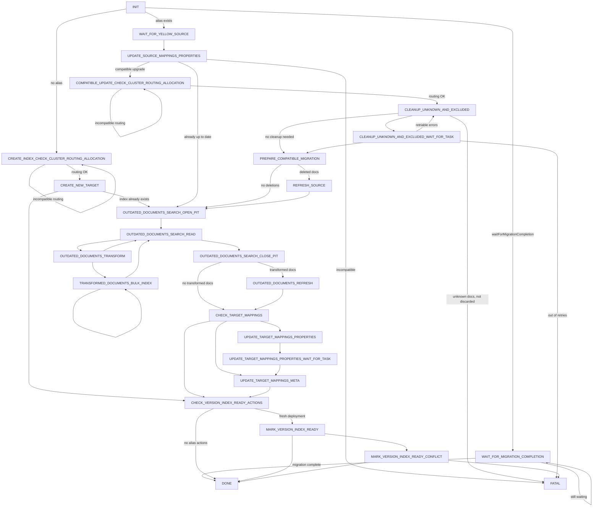

<!-- markdownlint-disable MD024 MD041 -->
- [Introduction](#introduction)
- [Algorithm steps](#algorithm-steps)
  - [State diagram](#state-diagram)
  - [INIT](#init)
  - [CREATE\_INDEX\_CHECK\_CLUSTER\_ROUTING\_ALLOCATION](#create_index_check_cluster_routing_allocation)
  - [CREATE\_NEW\_TARGET](#create_new_target)
  - [WAIT\_FOR\_MIGRATION\_COMPLETION](#wait_for_migration_completion)
  - [WAIT\_FOR\_YELLOW\_SOURCE](#wait_for_yellow_source)
  - [UPDATE\_SOURCE\_MAPPINGS\_PROPERTIES](#update_source_mappings_properties)
  - [COMPATIBLE\_UPDATE\_CHECK\_CLUSTER\_ROUTING\_ALLOCATION](#compatible_update_check_cluster_routing_allocation)
  - [CLEANUP\_UNKNOWN\_AND\_EXCLUDED](#cleanup_unknown_and_excluded)
  - [CLEANUP\_UNKNOWN\_AND\_EXCLUDED\_WAIT\_FOR\_TASK](#cleanup_unknown_and_excluded_wait_for_task)
  - [PREPARE\_COMPATIBLE\_MIGRATION](#prepare_compatible_migration)
  - [REFRESH\_SOURCE](#refresh_source)
  - [OUTDATED\_DOCUMENTS\_SEARCH\_OPEN\_PIT](#outdated_documents_search_open_pit)
  - [OUTDATED\_DOCUMENTS\_SEARCH\_READ](#outdated_documents_search_read)
  - [OUTDATED\_DOCUMENTS\_TRANSFORM](#outdated_documents_transform)
  - [TRANSFORMED\_DOCUMENTS\_BULK\_INDEX](#transformed_documents_bulk_index)
  - [OUTDATED\_DOCUMENTS\_SEARCH\_CLOSE\_PIT](#outdated_documents_search_close_pit)
  - [OUTDATED\_DOCUMENTS\_REFRESH](#outdated_documents_refresh)
  - [CHECK\_TARGET\_MAPPINGS](#check_target_mappings)
  - [UPDATE\_TARGET\_MAPPINGS\_PROPERTIES](#update_target_mappings_properties)
  - [UPDATE\_TARGET\_MAPPINGS\_PROPERTIES\_WAIT\_FOR\_TASK](#update_target_mappings_properties_wait_for_task)
  - [UPDATE\_TARGET\_MAPPINGS\_META](#update_target_mappings_meta)
  - [CHECK\_VERSION\_INDEX\_READY\_ACTIONS](#check_version_index_ready_actions)
  - [MARK\_VERSION\_INDEX\_READY](#mark_version_index_ready)
  - [MARK\_VERSION\_INDEX\_READY\_CONFLICT](#mark_version_index_ready_conflict)
  - [FATAL](#fatal)
  - [DONE](#done)
- [Manual QA Test Plan](#manual-qa-test-plan)
  - [1. Plugins enabled/disabled](#1-plugins-enableddisabled)

# Introduction

In the past, the risk of downtime caused by Kibana's saved object upgrade
migrations have discouraged users from adopting the latest features. v2
migrations aims to solve this problem by minimizing the operational impact on
our users.

To achieve this it uses a new migration algorithm where every step of the
algorithm is idempotent. No matter at which step a Kibana instance gets
interrupted, it can always restart the migration from the beginning and repeat
all the steps without requiring any user intervention. This doesn't mean
migrations will never fail, but when they fail for intermittent reasons like
an Elasticsearch cluster running out of heap, Kibana will automatically be
able to successfully complete the migration once the cluster has enough heap.

For more background information on the problem see the [saved object
migrations
RFC](https://github.com/elastic/kibana/blob/main/legacy_rfcs/text/0013_saved_object_migrations.md).

# Algorithm steps

The design goals for the algorithm was to keep downtime below 10 minutes for
100k saved objects while guaranteeing no data loss and keeping steps as simple
and explicit as possible.

The algorithm is implemented as a *state-action machine*, based on <https://www.microsoft.com/en-us/research/uploads/prod/2016/12/Computation-and-State-Machines.pdf>

The state-action machine defines it's behaviour in steps. Each step is a
transition from a control state s_i to the contral state s_i+1 caused by an
action a_i.

```text
s_i   -> a_i -> s_i+1
s_i+1 -> a_i+1 -> s_i+2
```

Given a control state s1, `next(s1)` returns the next action to execute.
Actions are asynchronous, once the action resolves, we can use the action
response to determine the next state to transition to as defined by the
function `model(state, response)`.

We can then loosely define a step as:

```javascript
s_i+1 = model(s_i, await next(s_i)())
```

When there are no more actions returned by `next` the state-action machine
terminates such as in the DONE and FATAL control states.

What follows is a list of all control states. For each control state the
following is described:

- *next action*: the next action triggered by the current control state
- *new control state*: based on the action response, the possible new control states that the machine will transition to

Since the algorithm runs once for each saved object index the steps below
always reference a single saved object index `.kibana`. When Kibana starts up,
all the steps are also repeated for the `.kibana_task_manager` index but this
is left out of the description for brevity.

## State diagram

The v2 algorithm supports three main paths after `INIT`:

1. **Fresh deployment** — no `.kibana` alias exists; create a new version index.
2. **Compatible version upgrade** — mappings changes are compatible; update documents in place on the existing index.
3. **Up-to-date restart** — version migration already completed; transform outdated documents and update mappings for newly enabled plugins.



## INIT

### Next action

`fetchIndices`

Fetch the saved object indices, mappings and aliases to find the source index
and determine whether we're performing a fresh deployment or migrating from an
existing v2 index.

### New control state

1. If `.kibana` is pointing to more than one index.

    → [FATAL](#fatal)

2. If `.kibana` is pointing to an index that belongs to a later version of
    Kibana .e.g. a 7.11.0 instance found the `.kibana` alias pointing to
    `.kibana_7.12.0_001`

    → [FATAL](#fatal)

3. If a `.kibana_<version>` alias exists that refers to a later version of Kibana
    (e.g. `.kibana_8.7.0` exists while running 8.6.1)

    → [FATAL](#fatal)

4. If `waitForMigrationCompletion` was set we're running on a background-tasks node and
    should not participate in the migration but instead wait for the ui node(s)
    to complete the migration.

    → [WAIT_FOR_MIGRATION_COMPLETION](#wait_for_migration_completion)

5. If the `.kibana` alias exists we're migrating from an existing v2 index
    and the migration source index is the index the `.kibana` alias points to.

    → [WAIT_FOR_YELLOW_SOURCE](#wait_for_yellow_source)

6. If there are no `.kibana` indices, this is a fresh deployment. Check cluster routing allocation and
    initialize a new saved objects index.

    → [CREATE_INDEX_CHECK_CLUSTER_ROUTING_ALLOCATION](#create_index_check_cluster_routing_allocation)

## CREATE_INDEX_CHECK_CLUSTER_ROUTING_ALLOCATION

### Next action

`checkClusterRoutingAllocationEnabled`

Check that shard allocation is enabled from cluster settings (`cluster.routing.allocation.enable`). Migrations need replica shards to be allocatable when creating new indices and waiting for green status.

If shard allocation is set to `all` (or unset), the migration continues to create the target index.

### New control state

1. If `cluster.routing.allocation.enable` has a compatible value.

    → [CREATE_NEW_TARGET](#create_new_target)

2. If it has a value that will not allow creating new *saved object* indices.

    → [CREATE_INDEX_CHECK_CLUSTER_ROUTING_ALLOCATION](#create_index_check_cluster_routing_allocation) (retry)

## CREATE_NEW_TARGET

### Next action

`createIndex`

Create the target index. This operation is idempotent; if the index already exists, we wait until its status turns green.

### New control state

1. If the index was created successfully.

    → [CHECK_VERSION_INDEX_READY_ACTIONS](#check_version_index_ready_actions)

2. If the index already exists (e.g. from a previous incomplete upgrade attempt).

    → [OUTDATED_DOCUMENTS_SEARCH_OPEN_PIT](#outdated_documents_search_open_pit)

3. If the action fails with a `index_not_green_timeout`.

    → [CREATE_NEW_TARGET](#create_new_target) (retry)

4. If the action fails with `cluster_shard_limit_exceeded`.

    → [FATAL](#fatal)

## WAIT_FOR_MIGRATION_COMPLETION

### Next action

`fetchIndices`

### New control state

1. If the ui node finished the migration.

    → [DONE](#done)

2. Otherwise wait 2s and check again.

    → [WAIT_FOR_MIGRATION_COMPLETION](#wait_for_migration_completion)

## WAIT_FOR_YELLOW_SOURCE

### Next action

`waitForIndexStatus` (status='yellow')

Wait for the source index to become yellow. This means the index's primary has been allocated and is ready for reading/searching. On a multi node cluster the replicas for this index might not be ready yet but since we're never writing to the source index it does not matter.

### New control state

1. If the action succeeds.

    → [UPDATE_SOURCE_MAPPINGS_PROPERTIES](#update_source_mappings_properties)

2. If the action fails with a `index_not_yellow_timeout`.

    → [WAIT_FOR_YELLOW_SOURCE](#wait_for_yellow_source) (retry)

## UPDATE_SOURCE_MAPPINGS_PROPERTIES

### Next action

`updateSourceMappingsProperties`

This action checks for source mappings changes and, if there are some, tries to patch the mappings.

- If there were no changes or the patch was successful, that reports either the changes are compatible or the source is already up to date, depending on the version migration completion state. Either way, it does not require reindexing to a new index.
- If the patch failed and the version migration is incomplete, it reports an incompatible state.
- If the patch failed and the version migration is complete, it reports an error as it means an incompatible mappings change in an already migrated environment. The latter usually happens when a new plugin is enabled that brings some incompatible changes or when there are incompatible changes in the development environment.

### New control state

1. If the mappings changes are compatible and the version migration is still in progress.

    → [COMPATIBLE_UPDATE_CHECK_CLUSTER_ROUTING_ALLOCATION](#compatible_update_check_cluster_routing_allocation)

2. If the mappings are already up to date (version migration already completed, or no mapping changes needed).

    → [OUTDATED_DOCUMENTS_SEARCH_OPEN_PIT](#outdated_documents_search_open_pit)

3. If the mappings are not updated due to incompatible changes and the version migration is still in progress.

    → [FATAL](#fatal)

4. If the mappings are not updated due to incompatible changes and the version migration is already completed.

    → [FATAL](#fatal)

## COMPATIBLE_UPDATE_CHECK_CLUSTER_ROUTING_ALLOCATION

### Next action

`checkClusterRoutingAllocationEnabled`

Same check as [CREATE_INDEX_CHECK_CLUSTER_ROUTING_ALLOCATION](#create_index_check_cluster_routing_allocation), but for the compatible upgrade path. Cleanup of unknown and excluded documents uses asynchronous delete-by-query tasks that require shard allocation. This step fails early with an explicit `[incompatible_cluster_routing_allocation]` message instead of blocking on generic Elasticsearch retries.

The Elasticsearch shard allocation cluster setting `cluster.routing.allocation.enable` needs to be unset or set to `all`. When set to `primaries`, `new_primaries` or `none`, cleanup tasks cannot allocate shards and the migration will retry until allocation is re-enabled or retries are exhausted.

### New control state

1. If `cluster.routing.allocation.enable` has a compatible value.

    → [CLEANUP_UNKNOWN_AND_EXCLUDED](#cleanup_unknown_and_excluded)

2. If it has a value that will not allow shard allocation.

    → [COMPATIBLE_UPDATE_CHECK_CLUSTER_ROUTING_ALLOCATION](#compatible_update_check_cluster_routing_allocation) (retry)

## CLEANUP_UNKNOWN_AND_EXCLUDED

### Next action

`cleanupUnknownAndExcluded`

This action searches for and deletes *saved objects* which are of unknown or excluded type.

- Saved objects become unknown when their type is no longer registered in the *typeRegistry*. This can happen when disabling plugins.
- Also, saved objects can be excluded from upgrade with the `excludeOnUpgrade` flag in their type definition.

In order to allow Kibana to discard unknown saved objects, users must set the [migrations.discardUnknownObjects](https://www.elastic.co/guide/en/kibana/current/resolve-migrations-failures.html#unknown-saved-object-types) flag.

### New control state

1. If unknown docs are found and Kibana is not configured to ignore them.

    → [FATAL](#fatal)

2. If the delete operation is launched and we can wait for it.

    → [CLEANUP_UNKNOWN_AND_EXCLUDED_WAIT_FOR_TASK](#cleanup_unknown_and_excluded_wait_for_task)

3. If no cleanup is needed.

    → [PREPARE_COMPATIBLE_MIGRATION](#prepare_compatible_migration)

## CLEANUP_UNKNOWN_AND_EXCLUDED_WAIT_FOR_TASK

### Next action

`waitForDeleteByQueryTask`

The cleanup task on the previous step is launched asynchronously, tracked by a specific `taskId`. On this step, we actively wait for it to finish, and we do that with a large timeout.

### New control state

1. If the task finishes before the timeout.

    → [PREPARE_COMPATIBLE_MIGRATION](#prepare_compatible_migration)

2. If we hit the timeout whilst waiting for the task to be completed.

    → [CLEANUP_UNKNOWN_AND_EXCLUDED_WAIT_FOR_TASK](#cleanup_unknown_and_excluded_wait_for_task) (retry)

3. If some errors occur whilst cleaning up, there could be other instances performing the cleanup in parallel, deleting the documents that we intend to delete. In that scenario, we will launch the operation again.

    → [CLEANUP_UNKNOWN_AND_EXCLUDED](#cleanup_unknown_and_excluded)

4. If we run out of retries.

    → [FATAL](#fatal)

## PREPARE_COMPATIBLE_MIGRATION

### Next action

`updateAliases`

At this point, we have successfully updated the index mappings. We are performing a *compatible migration*, aka updating *saved objects* in place on the existing index. In order to prevent other Kibana instances from writing documents whilst we update them, we remove the previous version alias. We also set the current version alias, which will cause other instances' migrators to directly perform an *up-to-date migration*.

### New control state

1. If the aliases are updated successfully and some documents have been deleted on the previous step.

    → [REFRESH_SOURCE](#refresh_source)

2. If the aliases are updated successfully and we did not delete any documents on the previous step.

    → [OUTDATED_DOCUMENTS_SEARCH_OPEN_PIT](#outdated_documents_search_open_pit)

3. If the alias was already deleted by another Kibana instance (`alias_not_found_exception`).

    → [REFRESH_SOURCE](#refresh_source) or [OUTDATED_DOCUMENTS_SEARCH_OPEN_PIT](#outdated_documents_search_open_pit) (same conditions as above)

4. When unexpected errors occur when updating the aliases.

    → [FATAL](#fatal)

## REFRESH_SOURCE

### Next action

`refreshIndex`

We are performing a *compatible migration*, and we discarded some unknown and excluded saved object documents. We must refresh the index so that subsequent queries no longer find these removed documents.

### New control state

1. If the index is refreshed successfully.

    → [OUTDATED_DOCUMENTS_SEARCH_OPEN_PIT](#outdated_documents_search_open_pit)

2. When unexpected errors occur during the refresh.

    → [FATAL](#fatal)

## OUTDATED_DOCUMENTS_SEARCH_OPEN_PIT

### Next action

`openPit`

Any saved objects that belong to previous versions are updated in the index.
This operation is performed in batches, leveraging the [Point in Time API](https://www.elastic.co/guide/en/elasticsearch/reference/current/point-in-time-api.html).

### New control state

1. If the PIT is created successfully.

    → [OUTDATED_DOCUMENTS_SEARCH_READ](#outdated_documents_search_read)

2. When unexpected errors occur whilst creating the PIT.

    → [FATAL](#fatal)

## OUTDATED_DOCUMENTS_SEARCH_READ

### Next action

`readWithPit(outdatedDocumentsQuery)`

Search for outdated saved object documents. Will return one batch of
documents.

If another instance has a disabled plugin it will reindex that plugin's
documents without transforming them. Because this instance doesn't know which
plugins were disabled by the instance that performed the migration, we need to search for outdated documents
and transform them to ensure that everything is up to date.

### New control state

1. Found outdated documents.

    → [OUTDATED_DOCUMENTS_TRANSFORM](#outdated_documents_transform)

2. There aren't any outdated documents left to read, and we can proceed with the flow.

    → [OUTDATED_DOCUMENTS_SEARCH_CLOSE_PIT](#outdated_documents_search_close_pit)

3. There aren't any outdated documents left to read, but we encountered *corrupt* documents or *transform errors*, and Kibana is not configured to ignore them (using `migrations.discardCorruptObjects` flag).

    → [FATAL](#fatal)

4. If we encounter an error of the form `es_response_too_large` whilst reading *saved object* documents, we retry with a smaller batch size.

    → [OUTDATED_DOCUMENTS_SEARCH_READ](#outdated_documents_search_read)

## OUTDATED_DOCUMENTS_TRANSFORM

### Next action

`transformDocs`

### New control state

1. If all of the outdated documents in the current batch are transformed successfully, or Kibana is configured to ignore *corrupt* documents and *transform* errors. We managed to break down the current set of documents into smaller batches successfully, so we can start indexing them one by one.

    → [TRANSFORMED_DOCUMENTS_BULK_INDEX](#transformed_documents_bulk_index)

2. If the batch contains corrupt documents or transform errors, and Kibana is not configured to discard them, we do not index them, we simply read the next batch, accumulating encountered errors.

    → [OUTDATED_DOCUMENTS_SEARCH_READ](#outdated_documents_search_read)

3. If we can't split the set of documents in batches small enough to not exceed the `maxBatchSize`, we fail the migration.

    → [FATAL](#fatal)

## TRANSFORMED_DOCUMENTS_BULK_INDEX

### Next action

`bulkOverwriteTransformedDocuments`

Once transformed we use an index operation to overwrite the outdated document with the up-to-date version. Optimistic concurrency control ensures that we only overwrite the document once so that any updates/writes by another instance which already completed the migration aren't overwritten and lost. The transformed documents are split in different batches, and then each batch is bulk indexed.

### New control state

1. We have more batches to bulk index.

    → [TRANSFORMED_DOCUMENTS_BULK_INDEX](#transformed_documents_bulk_index)

2. We have indexed all the batches of the current read operation. Proceed to read more documents.

    → [OUTDATED_DOCUMENTS_SEARCH_READ](#outdated_documents_search_read)

3. If bulk indexing fails with `unavailable_shards_exception`.

    → [TRANSFORMED_DOCUMENTS_BULK_INDEX](#transformed_documents_bulk_index) (retry)

4. If bulk indexing fails with `request_entity_too_large_exception`.

    → [FATAL](#fatal)

## OUTDATED_DOCUMENTS_SEARCH_CLOSE_PIT

### Next action

`closePit`

After reading, transforming and bulk indexing all saved objects, we can close our PIT.

### New control state

1. If we can close the PIT successfully, and we did update some documents.

    → [OUTDATED_DOCUMENTS_REFRESH](#outdated_documents_refresh)

2. If we can close the PIT successfully, and we did not update any documents.

    → [CHECK_TARGET_MAPPINGS](#check_target_mappings)

3. An unexpected error occurred whilst closing the PIT.

    → [FATAL](#fatal)

## OUTDATED_DOCUMENTS_REFRESH

### Next action

`refreshIndex`

We updated some outdated documents, we must refresh the target index to pick up the changes.

### New control state

1. If the index is refreshed successfully.

    → [CHECK_TARGET_MAPPINGS](#check_target_mappings)

2. When unexpected errors occur during the refresh.

    → [FATAL](#fatal)

## CHECK_TARGET_MAPPINGS

### Next action

`checkTargetTypesMappings`

Compare the calculated mappings' hashes against those stored in the `<index>.mappings._meta`.

### New control state

1. If calculated mappings don't match because top-level properties changed (e.g. `dynamic` or `_meta`).

    → [UPDATE_TARGET_MAPPINGS_PROPERTIES](#update_target_mappings_properties)

2. If calculated mappings don't match because some SO type mappings changed.

    → [UPDATE_TARGET_MAPPINGS_PROPERTIES](#update_target_mappings_properties)

3. If only new SO types were introduced (no existing type mappings changed).

    → [UPDATE_TARGET_MAPPINGS_META](#update_target_mappings_meta)

4. If calculated mappings and stored mappings match, we can skip directly to the next step.

    → [CHECK_VERSION_INDEX_READY_ACTIONS](#check_version_index_ready_actions)

## UPDATE_TARGET_MAPPINGS_PROPERTIES

### Next action

`updateAndPickupMappings`

If another instance has some plugins disabled it will disable the mappings of that plugin's types when creating the index. This action will
update the mappings and then use an update_by_query to ensure that all fields are "picked-up" and ready to be searched over.

### New control state

→ [UPDATE_TARGET_MAPPINGS_PROPERTIES_WAIT_FOR_TASK](#update_target_mappings_properties_wait_for_task)

## UPDATE_TARGET_MAPPINGS_PROPERTIES_WAIT_FOR_TASK

### Next action

`waitForPickupUpdatedMappingsTask`

### New control state

1. If the task completes successfully.

    → [UPDATE_TARGET_MAPPINGS_META](#update_target_mappings_meta)

2. If we hit a `wait_for_task_completion_timeout`.

    → [UPDATE_TARGET_MAPPINGS_PROPERTIES_WAIT_FOR_TASK](#update_target_mappings_properties_wait_for_task) (retry)

3. If the task completed with a retriable error.

    → [UPDATE_TARGET_MAPPINGS_PROPERTIES](#update_target_mappings_properties) (retry)

## UPDATE_TARGET_MAPPINGS_META

### Next action

`updateMappings`

Update the mapping `_meta` information with the hashes of the mappings for each plugin. Properties were already updated on the previous step.

### New control state

1. If the mappings are updated successfully.

    → [CHECK_VERSION_INDEX_READY_ACTIONS](#check_version_index_ready_actions)

2. When unexpected errors occur.

    → [FATAL](#fatal)

## CHECK_VERSION_INDEX_READY_ACTIONS

Check if the state contains some `versionIndexReadyActions` from the `INIT` action.

### Next action

`noop`

### New control state

1. If there are some `versionIndexReadyActions`, we performed a full migration and need to point the aliases to our newly migrated index.

    → [MARK_VERSION_INDEX_READY](#mark_version_index_ready)

2. If there are no `versionIndexReadyActions`, another instance already completed this migration and we only transformed outdated documents and updated the mappings in case a new plugin was enabled.

    → [DONE](#done)

## MARK_VERSION_INDEX_READY

### Next action

`updateAliases`

Atomically apply the `versionIndexReadyActions` using the _alias actions API. For a fresh deployment this adds the current and version aliases to the new target index. By performing these actions we guarantee that if multiple versions of Kibana started the upgrade in parallel, only one version will succeed.

### New control state

1. If all the actions succeed we're ready to serve traffic.

    → [DONE](#done)

2. If action (1) fails with `alias_not_found_exception` another instance already completed the migration.

    → [MARK_VERSION_INDEX_READY_CONFLICT](#mark_version_index_ready_conflict)

## MARK_VERSION_INDEX_READY_CONFLICT

### Next action

`fetchIndices`

Fetch the saved object indices.

### New control state

If another instance completed a migration from the same source we need to verify that it is running the same version.

1. If the current and version aliases are pointing to the same index the instance that completed the migration was on the same version and it's safe to start serving traffic.

    → [DONE](#done)

2. If the other instance was running a different version we fail the migration. Once we restart one of two things can happen: the other instance is an older version and we will restart the migration, or, it's a newer version and we will refuse to start up.

    → [FATAL](#fatal)

## FATAL

Unfortunately, this migrator failed at some step. Please check the logs and identify the cause. Once addressed, restart Kibana again to restart / resume the migration.

## DONE

Congratulations, this migrator finished the saved objects migration for its index.

# Manual QA Test Plan

## 1. Plugins enabled/disabled

Kibana plugins can be disabled/enabled at any point in time. We need to ensure
that Saved Object documents are migrated for all the possible sequences of
enabling, disabling, before or after a version upgrade.

### Test scenario 1 (enable a plugin after migration)

1. Start an old version of Kibana (< 7.11)
2. Create a document that we know will be migrated in a later version (i.e.
   create a `dashboard`)
3. Disable the plugin to which the document belongs (i.e `dashboard` plugin)
4. Upgrade Kibana to v7.11 making sure the plugin in step (3) is still disabled.
5. Enable the plugin from step (3)
6. Restart Kibana
7. Ensure that the document from step (2) has been migrated
   (`migrationVersion` contains 7.11.0)

### Test scenario 2 (disable a plugin after migration)

1. Start an old version of Kibana (< 7.11)
2. Create a document that we know will be migrated in a later version (i.e.
   create a `dashboard`)
3. Upgrade Kibana to v7.11 making sure the plugin in step (3) is enabled.
4. Disable the plugin to which the document belongs (i.e `dashboard` plugin)
5. Restart Kibana
6. Ensure that Kibana logs a warning, but continues to start even though there
   are saved object documents which don't belong to an enable plugin

### Test scenario 3 (multiple instances, enable a plugin after migration)

Follow the steps from 'Test scenario 1', but perform the migration with
multiple instances of Kibana

### Test scenario 4 (multiple instances, mixed plugin enabled configs)

We don't support this upgrade scenario, but it's worth making sure we don't
have data loss when there's a user error.

1. Start an old version of Kibana (< 7.11)
2. Create a document that we know will be migrated in a later version (i.e.
   create a `dashboard`)
3. Disable the plugin to which the document belongs (i.e `dashboard` plugin)
4. Upgrade Kibana to v7.11 using multiple instances of Kibana. The plugin from
   step (3) should be enabled on half of the instances and disabled on the
   other half.
5. Ensure that the document from step (2) has been migrated
   (`migrationVersion` contains 7.11.0)
<!-- markdownlint-enable MD024 MD041 -->
