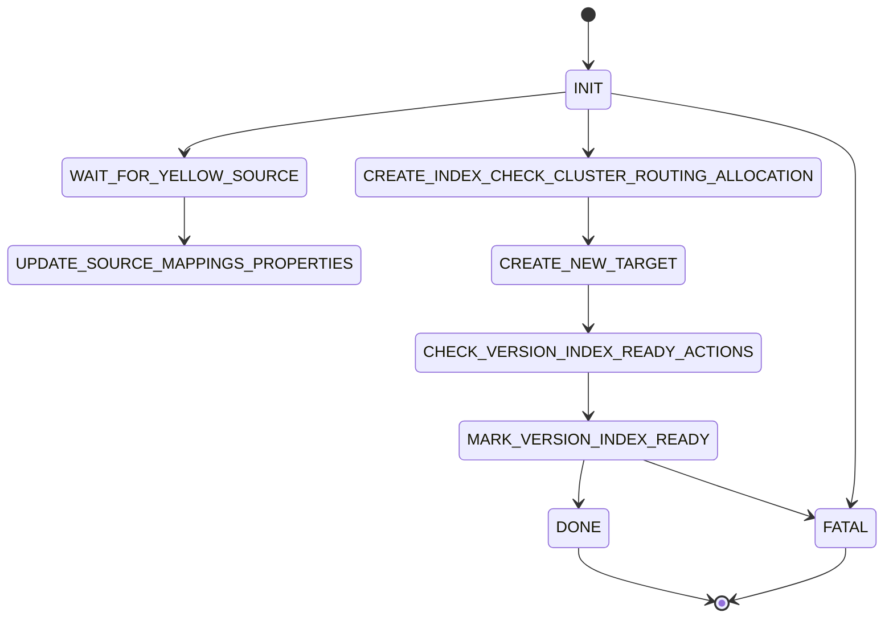

# v3 saved-object migration POC

> Experimental. Not wired into Kibana's runtime. Lives alongside the V2 migration
> runner (`../`) to explore an alternative shape: one file per state, the
> transition graph as data, transitions constrained by the type system, and an
> explicit correctness apparatus.
>
> The deeper proposal — comparison against V2 and ZDT, rejected alternatives,
> rationale — lives in `migrations_refactor.md` at the repo root. The conceptual
> lineage is Leslie Lamport, *Computation and State Machines*, especially §2.2
> (state-action behaviors) and §5.1.1 (inductive invariant method).

---

## What this is

The saved-object migration runner is a state machine. Each step makes a network
call (create index, reindex, transform documents, update aliases, …), observes
the response, and decides where to go next. V2 already implements this — but
the machine is spread across a large `model.ts` switch and a parallel `next.ts`
dispatch keyed by `controlState`.

v3 expresses the same machine differently:

- **One file per state** — each lives in `steps/`.
- **Graph as data** — `SUCCESSORS` in `successors.ts` is the single source of truth
  for legal transitions.
- **Type-constrained transitions** — a step physically cannot return a state
  outside its row in `SUCCESSORS` without a compile error.
- **Explicit correctness apparatus** — runtime invariants asserted in the loop
  driver, plus property-based test scaffolding (planned; skeleton in
  `successor_graph.test.ts`) over arbitrary `(state, response)` pairs.

---

## Mental model

Five concepts, each named for its call-site role:

| Concept   | Type                              | Lives in                | Role                                                                       |
| --------- | --------------------------------- | ----------------------- | -------------------------------------------------------------------------- |
| `State`   | discriminated union, one variant per state | `state.ts`, `steps/*.ts` | The migration's current control point plus the data it carries.            |
| `IO`      | interface of async functions      | `io.ts`                 | The side-effecting operations the machine can perform (ES calls).          |
| `Step`    | `{ action, transition }`          | `types.ts`, `steps/*.ts` | A recipe: which IO call to run, and how to interpret the response.         |
| `next`    | `(state, io) => Promise<State>`   | `next.ts`               | Looks up the step factory in the `STEPS` table (in `successors.ts`) using `state.name`, runs it, and returns the next state. The `satisfies Record<NonTerminalState['name'], …>` on `STEPS` is the single point of compile-time enforcement that every non-terminal state has a wired-up factory. |
| `runStep` | `(step) => Promise<State>`        | `types.ts`              | Awaits `action()`, feeds the response to `transition()`.                   |

The loop, in pseudocode:

```
state = createInitialState(retryAttempts)
assertInvariants(state)                         // Init ⇒ Inv
while state is not terminal:
  step  = STEP_FOR(state.name).step(state, io)  // recipe for one Lamport step
  state = await runStep(step)                   // execute action, run transition
  assertInvariants(state)                       // Inv ∧ Next ⇒ Inv′
return state                                    // DONE | FATAL
```

That's the entire runtime — `run_v3_migration.ts` is just this loop with the
real types filled in.

### Anchoring to Lamport

For readers familiar with the paper:

- `Name` is the **program-counter value** for that control point — the
  discriminant of the `State` union.
- `State` is the **state-with-PC** for that control point (Lamport models PC as
  part of state, not outside it).
- `step(state, io)` builds the **recipe** for one Lamport step ⟨s, α, t⟩, where
  `state` is `s`, `action()` produces the response that determines `α`, and
  `transition(response)` is `t`.
- The executed triple ⟨s, α, t⟩ is implicit in the loop driver. It's a
  documentation concept, not a TypeScript type — no caller needs it as a value,
  only the trace (`logs`) needs it as data.

---

## The state graph

> **Illustrative skeleton** — the actual graph has 26 states. See `successors.ts`
> (`SUCCESSORS` export) as the source of truth.

The simplified example below shows the pattern; the real graph includes
`WAIT_FOR_MIGRATION_COMPLETION`, `WAIT_FOR_YELLOW_SOURCE`,
`OUTDATED_DOCUMENTS_*`, `TRANSFORMED_DOCUMENTS_BULK_INDEX`, target mappings
states, and more:



The graph lives as data in `successors.ts`:

```ts
// Illustrative subset — see successors.ts for the full 26-state table.
export const SUCCESSORS = {
  [INIT.Name]: [WAIT_FOR_MIGRATION_COMPLETION.Name, WAIT_FOR_YELLOW_SOURCE.Name, ...],
  [WAIT_FOR_YELLOW_SOURCE.Name]: [UPDATE_SOURCE_MAPPINGS_PROPERTIES.Name, ...FATAL.Name],
  [CREATE_NEW_TARGET.Name]: [CHECK_VERSION_INDEX_READY_ACTIONS.Name, ...FATAL.Name],
  [MARK_VERSION_INDEX_READY.Name]: [DONE.Name, MARK_VERSION_INDEX_READY_CONFLICT.Name, FATAL.Name],
  [DONE.Name]: [],
  [FATAL.Name]: [],
} as const satisfies Record<StateName, readonly StateName[]>;
```

The `as const satisfies Record<StateName, …>` annotation does two jobs:

- `as const` preserves the exact literal edges so `SuccessorsOf<typeof Name>`
  resolves to a precise string-literal union (e.g. `'CHECK_SOURCE'` for `INIT`,
  not just `StateName`).
- `satisfies Record<StateName, …>` forces every `StateName` to appear as a key,
  so adding a new state to the `State` union without adding a row here is a
  compile error.

Each `step`'s transition return type is `StateOf<SuccessorsOf<typeof Name>>` —
**the type system rejects any transition that lands outside its row in
`SUCCESSORS`.** The table is also snapshot-tested, so intentional graph edits
show as a one-line diff in PR review.

---

## File layout

```
v3/
├── README.md                        ← this file
├── index.ts                         ← public API: runV3Migration + types
├── run_v3_migration.ts              ← loop driver
├── next.ts                          ← tiny loop driver; looks up STEPS[state.name]
├── state.ts                         ← State union, BaseState, transition helpers
├── types.ts                         ← Step, runStep, re-exports from successors
├── successors.ts                    ← SUCCESSORS, STEPS, STATE_INVARIANTS dispatch tables
├── io.ts                            ← IO interface + response unions
├── invariant_helper.ts              ← MigrationInvariantViolation, assertInvariant, clause
├── invariants.ts                    ← assertInvariants dispatcher + cross-cutting checks
├── assert_never.ts                  ← exhaustiveness helper
├── steps/
│   ├── init.ts                      ← Name, State, step factory
│   ├── check_source.ts
│   ├── create_target.ts             ← the self-loop retry pattern
│   ├── mark_ready.ts
│   ├── done.ts                      ← terminal: no step factory
│   └── fatal.ts                     ← terminal: no step factory
├── run_v3_migration.test.ts         ← end-to-end happy + retry + exhaustion
├── invariants.test.ts               ← negative assertInvariants cases
├── successor_graph.test.ts          ← SUCCESSORS snapshot + table + PBT
└── test_helpers.ts                  ← shared IO stub, factories, transitionCases
```

---

## Anatomy of a step file

Every non-terminal step exports four things, in this order. `check_source.ts`
end-to-end:

```ts
// 1. Discriminant value — what state.name compares against.
export const Name = 'CHECK_SOURCE' as const;

// 2. State variant — BaseState plus any step-specific fields.
//    Joined into `State` (the union) in state.ts.
export interface State extends BaseState {
  readonly name: typeof Name;
}

// 3. Successors derived from SUCCESSORS — constrains transition's return type.
type Successors = SuccessorsOf<typeof Name>;

// 4. Step factory — bundles action + transition with the current state.
export const step = (state: State, io: IO): Step<Successors, CheckSourceResponse> => ({
  action: () => io.checkSource(),
  transition: (response) => {
    switch (response.type) {
      case 'source_found':
        return transitionTo(
          resetRetry(appendLog(state, `v3 CHECK_SOURCE found ${response.sourceIndex}`)),
          CREATE_TARGET.Name,
          { sourceIndex: response.sourceIndex }
        );
      case 'source_missing':
        return transitionTo(
          appendLog(state, `v3 CHECK_SOURCE failed: ${response.reason}`),
          FATAL.Name,
          { reason: response.reason }
        );
      default:
        return assertNever(response);
    }
  },
});
```

A few things to notice:

- **`Name` is the only thing other step files import as a value.** They use it
  as the discriminant in `transitionTo(state, NEXT.Name, …)`. Everything else
  on a step module is imported `type`-only by its peers.
- **`step` returns a `Step`, it doesn't execute one.** Execution happens in
  `runStep` (called from `next`). The separation lets `transition` be a pure
  function of `(state, response)` while `action` carries the IO.
- **`action: () => io.checkSource()`** — wrapped in an arrow on purpose. A bare
  `action: io.checkSource` reference would break `this`-binding for any
  class-based `IO` implementation. The arrow is the only safe form.
- **`default: return assertNever(response)`** — if a new variant lands in
  `CheckSourceResponse`, TypeScript will refuse to compile this file until
  it's handled.

Terminal states (`DONE`, `FATAL`) don't export a `step` because there's
nothing to do. Their files contain only `Name` and `State`.

---

## Transitions

`transitionTo(carry, name, extras)` is the only sanctioned way to build the
next state:

```ts
transitionTo(
  resetRetry(appendLog(state, 'v3 CHECK_SOURCE found ...')),
  CREATE_TARGET.Name,
  { sourceIndex: response.sourceIndex }
)
```

It carries `BaseState` (retry counters, logs) from the current state, sets the
new `name`, and lets you supply exactly the step-specific fields the target
state needs. The type of `extras` is
`Omit<StateOf<TName>, keyof BaseState | 'name'>`, so:

- Adding a field to a target's `State` interface produces a TS error at every
  transition into it until the field is supplied — **no missing-field drift.**
- Passing an unknown field is a TS error — **no field baggage.**

Three small companions in `state.ts`:

- `appendLog(state, message)` — append to `state.logs`. Generic in `TState`, so
  it preserves the variant type.
- `resetRetry(state)` — zero `state.retryCount`.
- `incrementRetry(state)` — `retryCount + 1`.

All three are pure and composable: `incrementRetry(appendLog(state, '…'))` is
the idiomatic shape for a retry self-loop.

### Retries are self-loops

The retry pattern lives in `create_target.ts`:

```ts
case 'retryable_failure':
  if (state.retryCount >= state.retryAttempts) {
    return transitionTo(
      appendLog(state, `v3 CREATE_TARGET exhausted retries: ${response.message}`),
      FATAL.Name,
      { reason: response.message }
    );
  }
  return transitionTo(
    incrementRetry(appendLog(state, `v3 CREATE_TARGET retrying: ${response.message}`)),
    Name,                                       // self-loop
    { sourceIndex: state.sourceIndex }
  );
```

Retries are **explicit transitions** in the graph (`CREATE_TARGET → CREATE_TARGET`),
not a decorator that hides them. Every retry attempt:

- Appears in the `logs` trace.
- Passes through `next` and `runStep`.
- Is checked by `assertInvariants`.
- Is sampled by PBT.

The cost is ~10 extra lines per retry-capable step. The payoff is total
transparency: a `withRetry(action)` wrapper would make retries invisible to
the trace and harder to test. We chose the lines.

---

## IO

```ts
export interface IO {
  readonly init: () => Promise<InitResponse>;
  readonly checkSource: () => Promise<CheckSourceResponse>;
  readonly createTarget: (sourceIndex: string) => Promise<CreateTargetResponse>;
  readonly markReady: (targetIndex: string) => Promise<MarkReadyResponse>;
}
```

`IO` is the bundle of side-effecting operations. It's passed as a parameter to
`step(state, io)`, **not stored on `State`.** Three reasons:

- **Serializability.** `State` is plain data — we can log it, dump it on
  crash, replay it in a test, snapshot it. A live ES client reference on
  `State` would break all of that.
- **Testability.** Tests pass a stub `IO`. No globals, no mocks, no DI
  container. See `test_helpers.ts`.
- **Lamport faithfulness.** `IO` is the realization of the action label `α`.
  It's not part of `s` or `t`.

Responses are discriminated unions, always with `type` as the discriminant
(e.g. `CheckSourceResponse = SourceFoundResponse | SourceMissingResponse`).
New variants force exhaustive handling via `assertNever`.

---

## Correctness apparatus

Three layers, each catching a different class of bug.

### 1. Static — the type system

- `Step<TNext, TResponse>` is parameterized by `TNext extends StateName`. The
  transition return type is `StateOf<TNext>`. With `TNext = SuccessorsOf<typeof Name>`,
  **only states listed in `SUCCESSORS[Name]` can be returned.** Returning a
  non-successor is a compile error.
- `transitionTo`'s `extras` type forces every required field on the target
  state to be supplied and rejects unknown fields.
- `assertNever` forces exhaustive handling of response variants.
- Type-level regression tests in `__type_tests__/` lock these constraints; run
  package `type_check` after graph or `State` union edits.

### 2. Runtime — `invariants.ts` + `steps/*.ts`

`assertInvariants(state: State)` encodes Lamport's §5.1.1 inductive invariant.
It's called by `run_v3_migration.ts` once on the initial state and after every
transition:

```ts
let state: State = createInitialState(retryAttempts);
assertInvariants(state);              // Init ⇒ Inv

while (!isTerminalState(state)) {
  state = await next(state, io);
  assertInvariants(state);            // Inv ∧ Next ⇒ Inv′
}
```

**Cross-cutting checks** stay in `invariants.ts`: **base** (retry integers and
bounds), **migration-base** (non-empty config strings when `indexPrefix` is
present), **post-init** (`targetIndex`, `SourceExistsState` `Option` checks).
**Per-control-point checks** live beside each step's `Name` / `State` / `step`
as an exported `assertInvariants(state: State)` and are dispatched via
`STATE_INVARIANTS` in `successors.ts` (mirroring the `STEPS` table). Step
files import `assertInvariant` / `clause` from `invariant_helper.ts`, not from
`invariants.ts`, to avoid import cycles.

Runtime invariants encode contracts TypeScript cannot express (non-empty
strings, positive integers, `Option.isSome` at a given PC, cross-field
relations). Pure type duplicates (`Array.isArray(logs)`, unknown `state.name`)
are omitted. Graph shape (terminal empty rows, `FATAL` on non-terminals) is
compile-time (`SUCCESSORS satisfies …`) plus `successor_graph.test.ts` — not
re-checked in the loop.

**`retryCount ≤ retryAttempts` is skipped** for states that poll with
`delayRetryTransition(..., Number.MAX_SAFE_INTEGER, ...)` (task-wait /
shard-unavailable loops).

Always-on in this POC — migrations run once per Kibana upgrade, assertion cost
is microseconds, and the payoff is "fail fast on impossible state" rather than
"succeed silently with garbage."

### 3. Generative — property-based tests (planned)

`successor_graph.test.ts` has a skeleton for `@fast-check/jest` to sample
`Inv`-satisfying states and arbitrary responses, then check properties of the
transition. The PBT suite is not yet active (`describe.skip` / `it.todo`) —
the arbitraries and properties below describe the **intended** coverage once
test helpers cover the full V2-port graph:

| Property                                                                       | Asserts                                                                |
| ------------------------------------------------------------------------------ | ---------------------------------------------------------------------- |
| `assertInvariants(transition(s, r))`                                           | `Inv ∧ Next ⇒ Inv′` (§5.1.1)                                          |
| `SUCCESSORS[from.name] ∋ to.name`                                              | The static graph claim materializes at runtime                         |
| `to.logs.length >= from.logs.length`                                           | Logs are append-only (two-state invariant)                             |
| `to.retryAttempts === from.retryAttempts`                                      | Retry budget is immutable across a transition                          |
| `MARK_READY (ready) ⇒ to.targetIndex === from.targetIndex`                     | Fields propagate correctly through specific arrows                     |

Note the split: **single-state predicates live in `assertInvariants`,
two-state predicates live as PBT properties.** Logs monotonicity can't be
expressed as a function of one state.

The arbitraries respect the `Inv` precondition — `retryFields` ensures
`0 ≤ retryCount ≤ retryAttempts` by construction. Without that, we'd be
testing `Next ⇒ Inv′` for arbitrary states, not the inductive step. Hold onto
this pattern as the package grows.

### What gets caught where

| Bug                                              | Caught by                          |
| ------------------------------------------------ | ---------------------------------- |
| Transition into a non-successor state            | Type checker                       |
| Forgot a required field on the target state     | Type checker (`transitionTo`)      |
| Forgot a response variant                        | Type checker (`assertNever`)       |
| `retryCount > retryAttempts` (bounded states)    | `assertInvariants`                 |
| Empty `indexPrefix` / `targetIndex` / task IDs   | `assertInvariants`                 |
| `FATAL` without a reason                         | `assertInvariants`                 |
| Missing `FATAL` successor on a control point     | `successor_graph.test.ts`          |
| Lost a log entry across a transition             | PBT (logs monotonicity)            |
| Mutated `retryAttempts` mid-flight               | PBT (retry budget)                 |
| Lost `targetIndex` between MARK_READY and DONE   | PBT (propagation)                  |

---

## How to add a step

Concrete checklist for a new control point called `MY_STEP`:

1. Create `steps/my_step.ts`. Export `Name`, `State`, and `step`.
2. Add `MY_STEP.State` to the `State` union in `state.ts` (both import and
   union member).
3. If your step makes a new IO call, add its response types and method to
   `io.ts`. Responses must be discriminated unions with a `type` field.
4. Add a row to `SUCCESSORS` in `successors.ts` with the new state's outgoing
   edges. Add the new state to any source state's row that should be able to
   reach it. **If your step calls `handleRetryableFailure` /
   `delayRetryTransition`, include `MY_STEP.Name` in its own row** — a
   retryable failure is a self-loop transition in the graph.
5. Add a row to the `STEPS` table in `successors.ts` mapping the new state's
   `Name` to its `step` factory. The `satisfies` check will force you to.
6. If your state has step-specific runtime refinements (e.g. non-empty `pitId`),
   export `assertInvariants` from `steps/my_step.ts` and register it in
   `STATE_INVARIANTS` in `successors.ts`.
7. Add an arbitrary + at least one property to `successor_graph.test.ts` for
   any new transition shapes.
8. Update the snapshot in `successor_graph.test.ts` — Jest's
   `--updateSnapshot` will do this; verify the diff matches your intent.

Steps 1–5 are forced by the type system. Step 6 is forced by the existing
tests if you encode the constraint. Steps 7–8 are the only steps the type
checker doesn't enforce.

---

## Design decisions worth knowing

| Decision                                                                      | Why                                                                                                                                                                       |
| ----------------------------------------------------------------------------- | ------------------------------------------------------------------------------------------------------------------------------------------------------------------------- |
| `name` discriminant (not `controlState`)                                      | Idiomatic for TS discriminated unions; symmetric with per-step `INIT.Name` exports.                                                                                       |
| `Step` is the recipe, not Lamport's executed ⟨s, α, t⟩                        | The executed triple is implicit in the loop; no caller needs it as a TS value. Optimize for developer ergonomics, not formal purity.                                      |
| `IO` bundle passed in, not actions on `State`                                 | Keeps `State` serializable and tests trivial. `IO` realizes the Lamport action label, which isn't part of `s` or `t`.                                                     |
| Retries as explicit self-loops, not decorators                                | Retries stay visible in trace, subject to invariants, sampled by PBT.                                                                                                     |
| Top-level type aliases (`StateName`, `StateOf<T>`) instead of `State.Name` namespace | Kibana's eslint rule `@typescript-eslint/no-namespace` is on. Disabling it for aesthetic gain wasn't worth the convention break.                                          |
| `assertInvariants` always-on, not dev-gated                                   | Migrations run once per upgrade. Assertion cost is microseconds; failing fast on impossible state beats silently succeeding with garbage.                                  |
| `SUCCESSORS` as `const satisfies Record<StateName, …>`                        | Preserves exact literal edges for `SuccessorsOf<T>` while forcing coverage of every state. Snapshot-tested for human review.                                              |
| One file per state                                                            | Every property a reviewer cares about — what does this step do, where does it go, what does it call, what does it preserve — is answerable from the step's own file.       |

---

## Further reading

- `migrations_refactor.md` (repo root) — the full proposal, comparison against
  V2 and ZDT, rejected alternatives, and rationale.
- Leslie Lamport, *Computation and State Machines* — the conceptual lineage.
  §2.2 for state-action behaviors, §5.1.1 for the inductive invariant method
  this POC implements.
- `../src/model.ts`, `../src/next.ts` (V2) — what this POC is an alternative
  to. Useful context if you already know V2.
