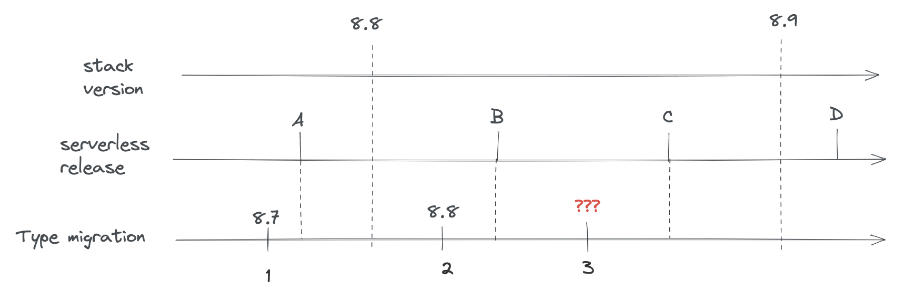

# savedObjects: Model Version API

## Table of contents

- [savedObjects: Model Version API](#savedobjects-model-version-api)
  - [Table of contents](#table-of-contents)
  - [Introduction](#introduction)
  - [What are model versions trying to solve?](#what-are-model-versions-trying-to-solve)
    - [1. SO type versioning was tightly coupled to stack versioning](#1-so-type-versioning-was-tightly-coupled-to-stack-versioning)
    - [2. The current migrations API is unsafe for the zero-downtime and backward-compatible requirements](#2-the-current-migrations-api-is-unsafe-for-the-zero-downtime-and-backward-compatible-requirements)
  - [Defining model versions](#defining-model-versions)
  - [Structure of a model version](#structure-of-a-model-version)
    - [changes](#changes)
      - [- mappings\_addition](#--mappings_addition)
      - [- mappings\_deprecation](#--mappings_deprecation)
      - [- data\_backfill](#--data_backfill)
      - [- data\_removal](#--data_removal)
      - [- unsafe\_transform](#--unsafe_transform)
    - [schemas](#schemas)
      - [forwardCompatibility](#forwardcompatibility)
      - [create](#create)
  - [Use-case examples](#use-case-examples)
    - [Adding a non-indexed field without default value](#adding-a-non-indexed-field-without-default-value)
    - [Adding an indexed field without default value](#adding-an-indexed-field-without-default-value)
    - [Adding an indexed field with a default value](#adding-an-indexed-field-with-a-default-value)
    - [Removing an existing field](#removing-an-existing-field)
  - [Testing model versions](#testing-model-versions)
    - [Tooling for unit tests](#tooling-for-unit-tests)
      - [Model version test migrator](#model-version-test-migrator)
    - [Tooling for integration tests](#tooling-for-integration-tests)
      - [Model version test bed](#model-version-test-bed)
  - [Limitations and edge cases in serverless environments](#limitations-and-edge-cases-in-serverless-environments)
    - [Using the `fields` option of the `find` savedObjects API](#using-the-fields-option-of-the-find-savedobjects-api)
    - [Using `bulkUpdate` for fields with large `json` blobs](#using-bulkupdate-for-fields-with-large-json-blobs)

## Introduction

The modelVersion API is a new way to define transformations (*"migrations"*) for your savedObject types, and will 
replace the "old" migration API after Kibana version `8.10.0` (where it will no longer be possible to register 
migrations using the old system).

The main purpose of this API is to address two problems of the old migration system regarding managed ("serverless") deployments:
- savedObjects model versioning is coupled to the stack versioning (migrations are registered per stack version)
- migration functions are not safe in regard to our BWC and ZDT requirements (Kibana N and N+1 running at the same time during upgrade)

This API also intend to address minor DX issues of the old migration system, by having a more explicit definition of saved Objects "versions".

## What are model versions trying to solve?

As explained in the previous section, the API is solving issues of the previous migration system regarding managed deployments:

### 1. SO type versioning was tightly coupled to stack versioning

With the previous migration system, migrations were defined per stack version, meaning that the "granularity" for defining
migrations was the stack version. You couldn't for example, add 2 consecutive migrations on `8.6.0` (to be executed at different points in time).

It was fine for on-prem distributions, given there is no way to upgrade Kibana to something else than a "fixed" stack version.

For our managed offering however, where we're planning on decoupling deployments and upgrades from stack versions 
(deploying more often, so more than once per stack release), it would have been an issue, as it wouldn't have been possible
to add a new migration in-between 2 stack versions.



We needed a way to decouple SO versioning from the stack versioning to support this, and model versions do by design.

### 2. The current migrations API is unsafe for the zero-downtime and backward-compatible requirements

On traditional deployments (on-prem/non-managed cloud), upgrading Kibana is done with downtime. 
The upgrade process requires shutting down all the nodes of the prior version before deploying the new one. 
That way, there is always a single version of Kibana running at a given time, which avoids all risks of data incompatibility
between version (e.g the new version introduces a migration that changes the shape of the document in a way that breaks compatibility
with the previous version)

For serverless however, the same process can't be used, as we need to be able to upgrade Kibana without interruption of service.
Which means that the old and new version of Kibana will have to cohabitate for a time.

This leads to a lot of constraints regarding what can, or cannot, be done with data transformations (migrations) during an upgrade. 
And, unsurprisingly, the existing migration API (which allows to register any kind of *(doc) => doc* transformations) was way too permissive and
unsafe given our backward compatibility requirements. 

## Defining model versions

As for old migrations, model versions are bound to a given [savedObject type](https://github.com/elastic/kibana/blob/f0eb5d695745f1f3a19ae6392618d1826ce29ce2/src/core/packages/saved-objects/server/src/saved_objects_type.ts#L23-L27)

When registering a SO type, a new [modelVersions](https://github.com/elastic/kibana/blob/f0eb5d695745f1f3a19ae6392618d1826ce29ce2/src/core/packages/saved-objects/server/src/saved_objects_type.ts#L149-L188)
property is available. This attribute is a map of [SavedObjectsModelVersion](https://github.com/elastic/kibana/blob/f0eb5d695745f1f3a19ae6392618d1826ce29ce2/src/core/packages/saved-objects/server/src/model_version/model_version.ts#L13-L21)
which is the top-level type/container to define model versions.

This map follows a similar `{ [version number] => version definition }` format as the old migration map, however 
a given SO type's model version is now identified by a single integer.

The first version must be numbered as version 1, incrementing by one for each new version.

That way:
- SO type versions are decoupled from stack versioning
- SO type versions are independent between types

*a **valid** version numbering:*
```ts
const myType: SavedObjectsType = {
  name: 'test',
  switchToModelVersionAt: '8.10.0',
  modelVersions: {
    1: modelVersion1, // valid: start with version 1
    2: modelVersion2, // valid: no gap between versions
  },
  // ...other mandatory properties
};
```

*an **invalid** version numbering:*
```ts
const myType: SavedObjectsType = {
  name: 'test',
  switchToModelVersionAt: '8.10.0',
  modelVersions: {
    2: modelVersion2, // invalid: first version must be 1
    4: modelVersion3, // invalid: skipped version 3
  },
  // ...other mandatory properties
};
```

## Structure of a model version

[Model versions](https://github.com/elastic/kibana/blob/f0eb5d695745f1f3a19ae6392618d1826ce29ce2/src/core/packages/saved-objects/server/src/model_version/model_version.ts#L13-L21)
are not just functions as the previous migrations were, but structured objects describing how the version behaves and what changed since the last one.

*A base example of what a model version can look like:*

```ts
const myType: SavedObjectsType = {
  name: 'test',
  switchToModelVersionAt: '8.10.0',
  modelVersions: {
    1: {
      changes: [
        {
          type: 'mappings_addition',
          addedMappings: {
            someNewField: { type: 'text' },
          },
        },
        {
          type: 'data_backfill',
          transform: someBackfillFunction,
        },
      ],
      schemas: {
        forwardCompatibility: fcSchema,
        create: createSchema,
      },
    },
  },
  // ...other mandatory properties
};
```

**Note:** Having multiple changes of the same type for a given version is supported by design 
        to allow merging different sources (to prepare for an eventual higher-level API)

*This definition would be perfectly valid:*

```ts
const version1: SavedObjectsModelVersion = {
  changes: [
    {
      type: 'mappings_addition',
      addedMappings: {
        someNewField: { type: 'text' },
      },
    },
    {
      type: 'mappings_addition',
      addedMappings: {
        anotherNewField: { type: 'text' },
      },
    },
  ],
};
```


It's currently composed of two main properties:

### changes

[link to the TS doc for `changes`](https://github.com/elastic/kibana/blob/f0eb5d695745f1f3a19ae6392618d1826ce29ce2/src/core/packages/saved-objects/server/src/model_version/model_version.ts#L22-L73)

Describes the list of changes applied during this version. 

**Important:** This is the part that replaces the old migration system, and allows defining when a version adds new mapping, 
mutates the documents, or other type-related changes.

The current types of changes are:

#### - mappings_addition

Used to define new mappings introduced in a given version.

*Usage example:*

```ts
const change: SavedObjectsModelMappingsAdditionChange = {
  type: 'mappings_addition',
  addedMappings: {
    newField: { type: 'text' },
    existingNestedField: {
      properties: {
        newNestedProp: { type: 'keyword' },
      },
    },
  },
};
```

**note:** *When adding mappings, the root `type.mappings` must also be updated accordingly (as it was done previously).*

#### - mappings_deprecation

Used to flag mappings as no longer being used and ready to be removed.

*Usage example:*

```ts
let change: SavedObjectsModelMappingsDeprecationChange = {
  type: 'mappings_deprecation',
  deprecatedMappings: ['someDeprecatedField', 'someNested.deprecatedField'],
};
```

**note:** *It is currently not possible to remove fields from an existing index's mapping (without reindexing into another index),
          so the mappings flagged with this change type won't be deleted for now, but this should still be used to allow
          our system to clean the mappings once upstream (ES) unblock us.*

#### - data_backfill

Used to populate fields (indexed or not) added in the same version.

*Usage example:*

```ts
let change: SavedObjectsModelDataBackfillChange = {
  type: 'data_backfill',
  transform: (document) => {
    return { attributes: { someAddedField: 'defaultValue' } };
  },
};
```

**note:** *Even if no check is performed to ensure it, this type of model change should only be used to 
           backfill newly introduced fields.*

#### - data_removal

Used to remove data (unset fields) from all documents of the type. 

*Usage example:*

```ts
let change: SavedObjectsModelDataRemovalChange = {
  type: 'data_removal',
  attributePaths: ['someRootAttributes', 'some.nested.attribute'],
};
```

**note:** *Due to backward compatibility, field utilization must be stopped in a prior release
           before actual data removal (in case of rollback). Please refer to the field removal migration example
           below in this document*

#### - unsafe_transform

Used to execute an arbitrary transformation function.

*Usage example:*

```ts
let change: SavedObjectsModelUnsafeTransformChange = {
  type: 'unsafe_transform',
  transformFn: (document) => {
    document.attributes.someAddedField = 'defaultValue';
    return { document };
  },
};
```

**note:** *Using such transformations is potentially unsafe, given the migration system will have
           no knowledge of which kind of operations will effectively be executed against the documents.
           Those should only be used when there's no other way to cover one's migration needs.*
           **Please reach out to the Core team if you think you need to use this, as you theoretically shouldn't.**

### schemas

[link to the TS doc for `schemas`](https://github.com/elastic/kibana/blob/f0eb5d695745f1f3a19ae6392618d1826ce29ce2/src/core/packages/saved-objects/server/src/model_version/schemas.ts#L13-L18)

The schemas associated with this version. Schemas are used to validate or convert SO documents at various
stages of their lifecycle.

The currently available schemas are:

#### forwardCompatibility

This is a new concept introduced by model versions. This schema is used for inter-version compatibility.

When retrieving a savedObject document from an index, if the version of the document is higher than the latest version
known of the Kibana instance, the document will go through the `forwardCompatibility` schema of the associated model version.

**Important:** These conversion mechanism shouldn't assert the data itself, and only strip unknown fields to convert the document to 
the **shape** of the document at the given version.

Basically, this schema should keep all the known fields of a given version, and remove all the unknown fields, without throwing.

Forward compatibility schema can be implemented in two different ways.

1. Using `config-schema`

*Example of schema for a version having two fields: someField and anotherField*

```ts
const versionSchema = schema.object(
  {
    someField: schema.maybe(schema.string()),
    anotherField: schema.maybe(schema.string()),
  },
  { unknowns: 'ignore' }
);
```

**Important:** Note the `{ unknowns: 'ignore' }` in the schema's options. This is required when using
`config-schema` based schemas, as this what will evict the additional fields without throwing an error.

2. Using a plain javascript function

*Example of schema for a version having two fields: someField and anotherField*

```ts
const versionSchema: SavedObjectModelVersionEvictionFn = (attributes) => {
  const knownFields = ['someField', 'anotherField'];
  return pick(attributes, knownFields);
}
```

**note:** *Even if highly recommended, implementing this schema is not strictly required. Type owners can manage unknown fields
          and inter-version compatibility themselves in their service layer instead.*

#### create

This is a direct replacement for [the old SavedObjectType.schemas](https://github.com/elastic/kibana/blob/f0eb5d695745f1f3a19ae6392618d1826ce29ce2/src/core/packages/saved-objects/server/src/saved_objects_type.ts#L85-L93)
definition, now directly included in the model version definition.

As a refresher the `create` schema is a `@kbn/config-schema` object-type schema, and is used to validate the properties of the document
during `create` and `bulkCreate` operations.

**note:** *Implementing this schema is optional, but still recommended, as otherwise there will be no validating when 
           importing objects*

## Use-case examples

These are example of the migration scenario currently supported (out of the box) by the system.

**note:** *more complex scenarios (e.g field mutation by copy/sync) could already be implemented, but without
          the proper tooling exposed from Core, most of the work related to sync and compatibility would have to be
          implemented in the domain layer of the type owners, which is why we're not documenting them yet.*

### Adding a non-indexed field without default value

We are currently in model version 1, and our type has 2 indexed fields defined: `foo` and `bar`.

The definition of the type at version 1 would look like:

```ts
const myType: SavedObjectsType = {
  name: 'test',
  namespaceType: 'single',
  switchToModelVersionAt: '8.10.0',
  modelVersions: {
    // initial (and current) model version
    1: {
      changes: [],
      schemas: {
        // FC schema defining the known fields (indexed or not) for this version
        forwardCompatibility: schema.object(
          { foo: schema.string(), bar: schema.string() },
          { unknowns: 'ignore' } // note the `unknown: ignore` which is how we're evicting the unknown fields
        ),
        // schema that will be used to validate input during `create` and `bulkCreate`
        create:  schema.object(
          { foo: schema.string(), bar: schema.string() },
        )
      },
    },
  },
  mappings: {
    properties: {
      foo: { type: 'text' },
      bar: { type: 'text' },
    },
  },
};
```

From here, say we want to introduce a new `dolly` field that is not indexed, and that we don't need to populate with a default value.

To achieve that, we need to introduce a new model version, with the only thing to do will be to define the 
associated schemas to include this new field.

The added model version would look like:

```ts
// the new model version adding the `dolly` field
let modelVersion2: SavedObjectsModelVersion = {
  // not an indexed field, no data backfill, so changes are actually empty
  changes: [],
  schemas: {
    // the only addition in this model version: taking the new field into account for the schemas
    forwardCompatibility: schema.object(
      { foo: schema.string(), bar: schema.string(), dolly: schema.string() },
      { unknowns: 'ignore' } // note the `unknown: ignore` which is how we're evicting the unknown fields
    ),
    create:  schema.object(
      { foo: schema.string(), bar: schema.string(), dolly: schema.string() },
    )
  },
};
```

The full type definition after the addition of the new model version: 

```ts
const myType: SavedObjectsType = {
  name: 'test',
  namespaceType: 'single',
  switchToModelVersionAt: '8.10.0',
  modelVersions: {
    1: {
      changes: [],
      schemas: {
        forwardCompatibility: schema.object(
          { foo: schema.string(), bar: schema.string() },
          { unknowns: 'ignore' }
        ),
        create:  schema.object(
          { foo: schema.string(), bar: schema.string() },
        )
      },
    },
    2: {
      changes: [],
      schemas: {
        forwardCompatibility: schema.object(
          { foo: schema.string(), bar: schema.string(), dolly: schema.string() },
          { unknowns: 'ignore' }
        ),
        create:  schema.object(
          { foo: schema.string(), bar: schema.string(), dolly: schema.string() },
        )
      },
    },
  },
  mappings: {
    properties: {
      foo: { type: 'text' },
      bar: { type: 'text' },
    },
  },
};
```

### Adding an indexed field without default value

This scenario is fairly close to the previous one. The difference being that working with an indexed field means
adding a `mappings_addition` change and to also update the root mappings accordingly.  

To reuse the previous example, let's say the `dolly` field we want to add would need to be indexed instead.

In that case, the new version needs to do the following:
- add a `mappings_addition` type change to define the new mappings
- update the root `mappings` accordingly
- add the updated schemas as we did for the previous example

The new version definition would look like: 

```ts
let modelVersion2: SavedObjectsModelVersion = {
  // add a change defining the mapping for the new field
  changes: [
    {
      type: 'mappings_addition',
      addedMappings: {
        dolly: { type: 'text' },
      },
    },
  ],
  schemas: {
    // adding the new field to the forwardCompatibility schema
    forwardCompatibility: schema.object(
      { foo: schema.string(), bar: schema.string(), dolly: schema.string() },
      { unknowns: 'ignore' }
    ),
    create:  schema.object(
      { foo: schema.string(), bar: schema.string(), dolly: schema.string() },
    )
  },
};
```

As said, we will also need to update the root mappings definition:

```ts
mappings: {
  properties: {
    foo: { type: 'text' },
    bar: { type: 'text' },
    dolly: { type: 'text' },
  },
},
```

the full type definition after the addition of the model version 2 would be:

```ts
const myType: SavedObjectsType = {
  name: 'test',
  namespaceType: 'single',
  switchToModelVersionAt: '8.10.0',
  modelVersions: {
    1: {
      changes: [
        {
          type: 'mappings_addition',
          addedMappings: {
            foo: { type: 'text' },
            bar: { type: 'text' },
          },
        },
      ],
      schemas: {
        forwardCompatibility: schema.object(
          { foo: schema.string(), bar: schema.string() },
          { unknowns: 'ignore' }
        ),
        create:  schema.object(
          { foo: schema.string(), bar: schema.string() },
        )
      },
    },
    2: {
      changes: [
        {
          type: 'mappings_addition',
          addedMappings: {
            dolly: { type: 'text' },
          },
        },
      ],
      schemas: {
        forwardCompatibility: schema.object(
          { foo: schema.string(), bar: schema.string(), dolly: schema.string() },
          { unknowns: 'ignore' }
        ),
        create:  schema.object(
          { foo: schema.string(), bar: schema.string(), dolly: schema.string() },
        )
      },
    },
  },
  mappings: {
    properties: {
      foo: { type: 'text' },
      bar: { type: 'text' },
      dolly: { type: 'text' },
    },
  },
};
```

### Adding an indexed field with a default value

Now a slightly different scenario where we'd like to populate the newly introduced field with a default value.

In that case, we'd need to add an additional `data_backfill` change to populate the new field's value
(in addition to the `mappings_addition` one):

```ts
let modelVersion2: SavedObjectsModelVersion = {
  changes: [
    // setting the `dolly` field's default value.
    {
      type: 'data_backfill',
      transform: (document) => {
        return { attributes: { dolly: 'default_value' } };
      },
    },
    // define the mappings for the new field
    {
      type: 'mappings_addition',
      addedMappings: {
        dolly: { type: 'text' },
      },
    },
  ],
  schemas: {
    // define `dolly` as an know field in the schema
    forwardCompatibility: schema.object(
      { foo: schema.string(), bar: schema.string(), dolly: schema.string() },
      { unknowns: 'ignore' }
    ),
    create:  schema.object(
      { foo: schema.string(), bar: schema.string(), dolly: schema.string() },
    )
  },
};
```

The full type definition would look like:

```ts
const myType: SavedObjectsType = {
  name: 'test',
  namespaceType: 'single',
  switchToModelVersionAt: '8.10.0',
  modelVersions: {
    1: {
      changes: [
        {
          type: 'mappings_addition',
          addedMappings: {
            foo: { type: 'text' },
            bar: { type: 'text' },
          },
        },
      ],
      schemas: {
        forwardCompatibility: schema.object(
          { foo: schema.string(), bar: schema.string() },
          { unknowns: 'ignore' }
        ),
        create:  schema.object(
          { foo: schema.string(), bar: schema.string() },
        )
      },
    },
    2: {
      changes: [
        {
          type: 'data_backfill',
          transform: (document) => {
            return { attributes: { dolly: 'default_value' } };
          },
        },
        {
          type: 'mappings_addition',
          addedMappings: {
            dolly: { type: 'text' },
          },
        },
      ],
      schemas: {
        forwardCompatibility: schema.object(
          { foo: schema.string(), bar: schema.string(), dolly: schema.string() },
          { unknowns: 'ignore' }
        ),
        create:  schema.object(
          { foo: schema.string(), bar: schema.string(), dolly: schema.string() },
        )
      },
    },
  },
  mappings: {
    properties: {
      foo: { type: 'text' },
      bar: { type: 'text' },
      dolly: { type: 'text' },
    },
  },
};
```

**Note:**  *if the field was non-indexed, we would just not use the `mappings_addition` change or update the mappings (as done in example 1)*

### Removing an existing field

We are currently in model version 1, and our type has 2 indexed fields defined: `kept` and `removed`.

The definition of the type at version 1 would look like:

```ts
const myType: SavedObjectsType = {
  name: 'test',
  namespaceType: 'single',
  switchToModelVersionAt: '8.10.0',
  modelVersions: {
    // initial (and current) model version
    1: {
      changes: [],
      schemas: {
        // FC schema defining the known fields (indexed or not) for this version
        forwardCompatibility: schema.object(
          { kept: schema.string(), removed: schema.string() },
          { unknowns: 'ignore' } // note the `unknown: ignore` which is how we're evicting the unknown fields
        ),
        // schema that will be used to validate input during `create` and `bulkCreate`
        create:  schema.object(
          { kept: schema.string(), removed: schema.string() },
        )
      },
    },
  },
  mappings: {
    properties: {
      kept: { type: 'text' },
      removed: { type: 'text' },
    },
  },
};
```

From here, say we want to remove the `removed` field, as our application doesn't need it anymore since a recent change.

The first thing to understand here is the impact toward backward compatibility:
Say that Kibana version `X` was still using this field, and that we stopped utilizing the field in version `X+1`.

We can't remove the data in version `X+1`, as we need to be able to rollback to the prior version at **any time**. 
If we were to delete the data of this `removed` field during the upgrade to version `X+1`, and if then, for any reason,
we'd need to rollback to version `X`,  it would cause a data loss, as version `X` was still using this field, but it would
no longer present in our document after the rollback.

Which is why we need to perform any field removal as a 2-step operation:
- release `X`: Kibana still utilize the field
- release `X+1`: Kibana no longer utilize the field, but the data is still present in the documents
- release `X+2`: The data is effectively deleted from the documents.

That way, any prior-version rollback (`X+2` to `X+1` **or** `X+1` to `X` is safe in term of data integrity)

The main question then, is what's the best way of having our application layer simply ignore this `removed` field during version `X+1`,
as we don't want this field (now non-utilized) to be returned from the persistence layer, as it could "pollute" the higher-layers
where the field is effectively no longer used or even known.

This can easily be done by introducing a new version and using the `forwardCompatibility` schema to "shallow" the field.

The `X+1` model version would look like:

```ts
// the new model version ignoring the `removed` field
let modelVersion2: SavedObjectsModelVersion = {
  changes: [],
  schemas: {
    forwardCompatibility: schema.object(
      { kept: schema.string() }, // `removed` is no longer defined here
      { unknowns: 'ignore' }
    ),
    create:  schema.object(
      { kept: schema.string() }, // `removed` is no longer defined here
    )
  },
};
```

The full type definition after the addition of the new model version:

```ts
const myType: SavedObjectsType = {
  name: 'test',
  namespaceType: 'single',
  switchToModelVersionAt: '8.10.0',
  modelVersions: {
    // initial (and current) model version
    1: {
      changes: [],
      schemas: {
        // FC schema defining the known fields (indexed or not) for this version
        forwardCompatibility: schema.object(
          { kept: schema.string(), removed: schema.string() },
          { unknowns: 'ignore' } // note the `unknown: ignore` which is how we're evicting the unknown fields
        ),
        // schema that will be used to validate input during `create` and `bulkCreate`
        create:  schema.object(
          { kept: schema.string(), removed: schema.string() },
        )
      },
    },
    2: {
      changes: [],
      schemas: {
        forwardCompatibility: schema.object(
          { kept: schema.string() }, // `removed` is no longer defined here
          { unknowns: 'ignore' }
        ),
        create:  schema.object(
          { kept: schema.string() }, // `removed` is no longer defined here
        )
      },
    }
  },
  mappings: {
    properties: {
      kept: { type: 'text' },
      removed: { type: 'text' },
    },
  },
};
```

then, in a **later** release, we can then deploy the change that will effectively remove the data from the documents:

```ts
// the new model version ignoring the `removed` field
let modelVersion3: SavedObjectsModelVersion = {
  changes: [ // define a data_removal change to delete the field
    {
      type: 'data_removal',
      removedAttributePaths: ['removed']
    }
  ],
  schemas: {
    forwardCompatibility: schema.object(
      { kept: schema.string() }, 
      { unknowns: 'ignore' }
    ),
    create:  schema.object(
      { kept: schema.string() }, 
    )
  },
};
```

The full type definition after the data removal would look like:

```ts
const myType: SavedObjectsType = {
  name: 'test',
  namespaceType: 'single',
  switchToModelVersionAt: '8.10.0',
  modelVersions: {
    // initial (and current) model version
    1: {
      changes: [],
      schemas: {
        // FC schema defining the known fields (indexed or not) for this version
        forwardCompatibility: schema.object(
          { kept: schema.string(), removed: schema.string() },
          { unknowns: 'ignore' } // note the `unknown: ignore` which is how we're evicting the unknown fields
        ),
        // schema that will be used to validate input during `create` and `bulkCreate`
        create:  schema.object(
          { kept: schema.string(), removed: schema.string() },
        )
      },
    },
    2: {
      changes: [],
      schemas: {
        forwardCompatibility: schema.object(
          { kept: schema.string() }, // `removed` is no longer defined here
          { unknowns: 'ignore' }
        ),
        create:  schema.object(
          { kept: schema.string() }, // `removed` is no longer defined here
        )
      },
    },
    3: {
      changes: [ // define a data_removal change to delete the field
        {
          type: 'data_removal',
          removedAttributePaths: ['removed']
        }
      ],
      schemas: {
        forwardCompatibility: schema.object(
          { kept: schema.string() },
          { unknowns: 'ignore' }
        ),
        create:  schema.object(
          { kept: schema.string() },
        )
      },
    }
  },
  mappings: {
    properties: {
      kept: { type: 'text' },
      removed: { type: 'text' },
    },
  },
};
```

## Testing model versions

Model versions definitions are more structured than the legacy migration functions, which makes them harder
to test without the proper tooling. This is why a set of testing tools and utilities are exposed
from the `@kbn/core-test-helpers-model-versions` package, to help properly test the logic associated
with model version and their associated transformations.

### Tooling for unit tests

For unit tests, the package exposes utilities to easily test the impact of transforming documents 
from a model version to another one, either upward or backward.

#### Model version test migrator

The `createModelVersionTestMigrator` helper allows to create a test migrator that can be used to 
test model version changes between versions, by transforming documents the same way the migration
algorithm would during an upgrade.

**Example:**

```ts
import { 
  createModelVersionTestMigrator, 
  type ModelVersionTestMigrator 
} from '@kbn/core-test-helpers-model-versions';

const mySoTypeDefinition = someSoType();

describe('mySoTypeDefinition model version transformations', () => {
  let migrator: ModelVersionTestMigrator;
  
  beforeEach(() => {
    migrator = createModelVersionTestMigrator({ type: mySoTypeDefinition });
  });
  
  describe('Model version 2', () => {
    it('properly backfill the expected fields when converting from v1 to v2', () => {
      const obj = createSomeSavedObject();

      const migrated = migrator.migrate({
        document: obj,
        fromVersion: 1,
        toVersion: 2,
      });

      expect(migrated.properties).toEqual(expectedV2Properties);
    });

    it('properly removes the expected fields when converting from v2 to v1', () => {
      const obj = createSomeSavedObject();

      const migrated = migrator.migrate({
        document: obj,
        fromVersion: 2,
        toVersion: 1,
      });

      expect(migrated.properties).toEqual(expectedV1Properties);
    });
  });
});
```

### Tooling for integration tests

During integration tests, we can boot a real Elasticsearch cluster, allowing us to manipulate SO
documents in a way almost similar to how it would be done on production runtime. With integration
tests, we can even simulate the cohabitation of two Kibana instances with different model versions
to assert the behavior of their interactions. 

#### Model version test bed

The package exposes a `createModelVersionTestBed` function that can be used to fully setup a
test bed for model version integration testing. It can be used to start and stop the ES server,
and to initiate the migration between the two versions we're testing.

**Example:**

```ts
import { 
  createModelVersionTestBed,
  type ModelVersionTestKit
} from '@kbn/core-test-helpers-model-versions';

describe('myIntegrationTest', () => {
  const testbed = createModelVersionTestBed();
  let testkit: ModelVersionTestKit;

  beforeAll(async () => {
    await testbed.startES();
  });

  afterAll(async () => {
    await testbed.stopES();
  });

  beforeEach(async () => {
    // prepare the test, preparing the index and performing the SO migration
    testkit = await testbed.prepareTestKit({
      savedObjectDefinitions: [{
        definition: mySoTypeDefinition,
        // the model version that will be used for the "before" version
        modelVersionBefore: 1,
        // the model version that will be used for the "after" version
        modelVersionAfter: 2,
      }]
    })
  });

  afterEach(async () => {
    if(testkit) {
      // delete the indices between each tests to perform a migration again
      await testkit.tearDown();
    }
  });

  it('can be used to test model version cohabitation', async () => {
    // last registered version is `1` (modelVersionBefore)
    const repositoryV1 = testkit.repositoryBefore;
    // last registered version is `2` (modelVersionAfter)
    const repositoryV2 = testkit.repositoryAfter;

    // do something with the two repositories, e.g
    await repositoryV1.create(someAttrs, { id });
    const v2docReadFromV1 = await repositoryV2.get('my-type', id);
    expect(v2docReadFromV1.attributes).toEqual(whatIExpect);
  });
});
```

**Limitations:**

Because the test bed is only creating the parts of Core required to instantiate the two SO
repositories, and because we're not able to properly load all plugins (for proper isolation), the integration
test bed currently has some limitations:

- no extensions are enabled
  - no security
  - no encryption
  - no spaces
- all SO types will be using the same SO index

## Limitations and edge cases in serverless environments

The serverless environment, and the fact that upgrade in such environments are performed in a way
where, at some point, the old and new version of the application are living in cohabitation, leads 
to some particularities regarding the way the SO APIs works, and to some limitations / edge case
that we need to document

### Using the `fields` option of the `find` savedObjects API

By default, the `find` API (as any other SO API returning documents) will migrate all documents before
returning them, to ensure that documents can be used by both versions during a cohabitation (e.g an old
node searching for documents already migrated, or a new node searching for documents not yet migrated).

However, when using the `fields` option of the `find` API, the documents can't be migrated, as some
model version changes can't be applied against a partial set of attributes. For this reason, when the
`fields` option is provided, the documents returned from `find` will **not** be migrated.

Which is why, when using this option, the API consumer needs to make sure that *all* the fields passed
to the `fields` option **were already present in the prior model version**. Otherwise, it may lead to inconsistencies
during upgrades, where newly introduced or backfilled fields may not necessarily appear in the documents returned
from the `search` API when the option is used.

   (*note*: both the previous and next version of Kibana must follow this rule then)

### Using `bulkUpdate` for fields with large `json` blobs

The savedObjects `bulkUpdate` API will update documents client-side and then reindex the updated documents.
These update operations are done in-memory, and cause memory constraint issues when
updating many objects with large `json` blobs stored in some fields. As such, we recommend against using
`bulkUpdate` for savedObjects that:
- use arrays (as these tend to be large objects)
- store large `json` blobs in some fields
