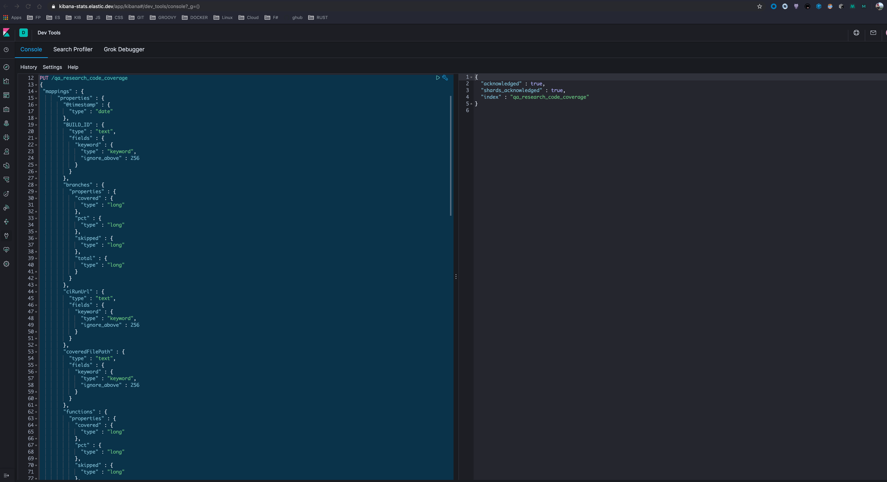

```
PUT /qa_research_code_coverage
{
 "mappings" : {
      "properties" : {
        "@timestamp" : {
          "type" : "date"
        },
        "BUILD_ID" : {
          "type" : "text",
          "fields" : {
            "keyword" : {
              "type" : "keyword",
              "ignore_above" : 256
            }
          }
        },
        "branches" : {
          "properties" : {
            "covered" : {
              "type" : "long"
            },
            "pct" : {
              "type" : "long"
            },
            "skipped" : {
              "type" : "long"
            },
            "total" : {
              "type" : "long"
            }
          }
        },
        "ciRunUrl" : {
          "type" : "text",
          "fields" : {
            "keyword" : {
              "type" : "keyword",
              "ignore_above" : 256
            }
          }
        },
        "coveredFilePath" : {
          "type" : "text",
          "fields" : {
            "keyword" : {
              "type" : "keyword",
              "ignore_above" : 256
            }
          }
        },
        "functions" : {
          "properties" : {
            "covered" : {
              "type" : "long"
            },
            "pct" : {
              "type" : "long"
            },
            "skipped" : {
              "type" : "long"
            },
            "total" : {
              "type" : "long"
            }
          }
        },
        "isTotal" : {
          "type" : "boolean"
        },
        "jsonSummaryPath" : {
          "type" : "text",
          "fields" : {
            "keyword" : {
              "type" : "keyword",
              "ignore_above" : 256
            }
          }
        },
        "lines" : {
          "properties" : {
            "covered" : {
              "type" : "long"
            },
            "pct" : {
              "type" : "long"
            },
            "skipped" : {
              "type" : "long"
            },
            "total" : {
              "type" : "long"
            }
          }
        },
        "path" : {
          "type" : "text",
          "fields" : {
            "keyword" : {
              "type" : "keyword",
              "ignore_above" : 256
            }
          }
        },
        "statements" : {
          "properties" : {
            "covered" : {
              "type" : "long"
            },
            "pct" : {
              "type" : "long"
            },
            "skipped" : {
              "type" : "long"
            },
            "total" : {
              "type" : "long"
            }
          }
        },
        "staticSiteUrl" : {
          "type" : "text",
          "fields" : {
            "keyword" : {
              "type" : "keyword",
              "ignore_above" : 256
            }
          }
        },
        "testRunnerType" : {
          "type" : "text",
          "fields" : {
            "keyword" : {
              "type" : "keyword",
              "ignore_above" : 256
            }
          }
        },
        "vcs" : {
          "properties" : {
            "author" : {
              "type" : "text",
              "fields" : {
                "keyword" : {
                  "type" : "keyword",
                  "ignore_above" : 256
                }
              }
            },
            "branch" : {
              "type" : "text",
              "fields" : {
                "keyword" : {
                  "type" : "keyword",
                  "ignore_above" : 256
                }
              }
            },
            "commitMsg" : {
              "type" : "text",
              "fields" : {
                "keyword" : {
                  "type" : "keyword",
                  "ignore_above" : 256
                }
              }
            },
            "sha" : {
              "type" : "text",
              "fields" : {
                "keyword" : {
                  "type" : "keyword",
                  "ignore_above" : 256
                }
              }
            },
            "vcsUrl" : {
              "type" : "text",
              "fields" : {
                "keyword" : {
                  "type" : "keyword",
                  "ignore_above" : 256
                }
              }
            }
          }
        }
      }
    }
}
```

Execute the above in Kibana Dev Tools, eg: 