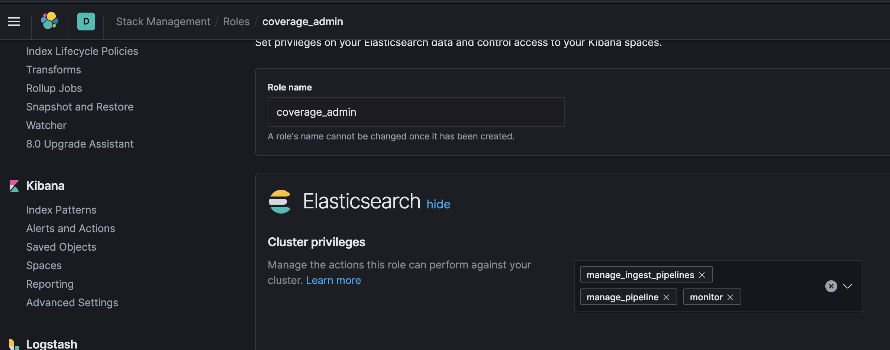

# Team Assignment Ingestion Pipeline

Team assignment will occur once per ci run.
Team assignment uses an ingest pipeline.

The coverage user has the coverage admin role.

This role must have the rights depicted below 
