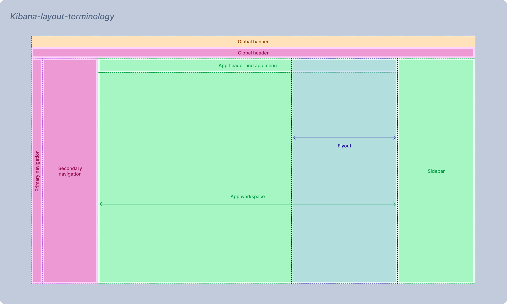

# Kibana layout

**Date**: 2026-05-21
**Author**: [@ek-so](https://github.com/katesosedova)
**Descriptio**n: Kibana layout structure and overview: how different pieces come together
**Relevant links**: [Chrome layout (core package)](../../core/packages/chrome/layout/layout_overview.mdx)
**Tags**: `kibana`, `dev`, `chrome`, `layout`, `grid`

---

## Product

### Overview

This document defines a unified terminology for Kibana’s updated layout and its core components. It provides a concise overview of how these components interact, influence each other, and operate together to form a seamless user experience. The Kibana layout is organized into two main areas, each with a specific role: **chrome** (which provides persistent global controls and wayfinding across all apps) and the **application workspace** (the area where applications are rendered). All layout components are designed to work together cohesively, shaping clear user expectations for how each part fits and functions within the overall system.

Kibana chrome supports two styles: the legacy **classic** chrome (still available but no longer actively developed) and the new **project** (solution-focused) chrome, which is the default and the basis for the guidelines below. The project chrome is actively enhanced and represents the recommended experience moving forward.

### Anatomy



**Chrome parts**

| Part | Purpose |
| --- | --- |
| Global header | Platform-level navigation and wayfinding (shared across Elastic surfaces) |
| [Side navigation](./side-navigation/README.md) | Deployment- and solution-level IA (Observability, Security, Elasticsearch, and similar)|
| [Sidebar](../../core/packages/chrome/sidebar/docs/sidebar.mdx) | Cross-app workflow tools that stay open while users move between pages (until closed)|
| Bottom bar | Reserved in the layout model; product use is not defined yet. |
 
**Application workspace parts**

| Part | Purpose |
| --- | --- |
| Application workspace | App-specific pages, tools, and in-page navigation. |
| Page header | *Guidelines tbd* |
| [App menu](../../core/packages/chrome/app-menu/app_menu.mdx) | Context-aware actions for the open app. |
| [Flyouts](https://eui.elastic.co/docs/components/containers/flyout/) | Temporary panels for secondary tasks or detail without leaving the current app flow. *(Kibana flyout guidelines TBD)* |

### Behaviour

**Responsiveness**

The layout does not reflow into a different structure at narrow widths — it stays the same grid, but individual parts adapt:

- **Navigation at small viewports (xs/s):** The side navigation automatically switches to collapsed mode (icons only). The collapse/expand toggle is hidden because there is no room to expand anyway.
- **Navigation overflow:** If there are more primary items than can fit in the available vertical height (for example, at a low browser zoom level or on a short screen), items are removed from the list and grouped into a "More" menu at the bottom. This is recalculated live whenever the nav container is resized.
- **Navigation width:** The grid column for navigation is either 48 px (collapsed), 100 px (expanded), or wider when a secondary panel is open alongside it (100 + 248 = 348 px). When the width changes, the application column gets exactly the remaining space — no manual math needed.
- **Application area:** Content in the application slot scrolls independently inside its own container. The rest of the chrome (header, navigation, sidebar) stays fixed and does not scroll with the page.
- **Sidebar:** If a sidebar is present it takes its own grid column. When it is closed, that column collapses to 0 px and the application area fills the freed space.

**Modal views**

Kibana uses two types of temporary panels, each with a clear, distinct purpose:

- **Modal windows ([EuiModal](https://eui.elastic.co/docs/containers/modal/)):** Used for important tasks that need the user's full attention. While a modal is open, everything else is blocked and dimmed out with a dark overlay. You must finish or close the modal before you can do anything else in the app.

- **Flyouts ([EuiFlyout](https://eui.elastic.co/docs/components/containers/flyout/)):** Used for side tasks or to show extra details, without taking you away from your main work. Flyouts open alongside the main content and don’t use a full-screen overlay, so you can still see (and sometimes interact with) the main application while the flyout is open.

---

## Engineering

### Architecture

The Kibana layout is a CSS grid rendered by `ChromeLayout` in `@kbn/core-chrome-layout-components`. The grid always occupies the full viewport (`100vw × 100vh`) and is sized by column and row tracks that react to runtime config:

```
banner     | banner      | banner
header     | header      | header
navigation | application | sidebar
footer     | footer      | footer
```

Each cell is a **slot** — an optional `ReactNode` or a render function that receives computed `LayoutState`. Slots that are absent collapse their track to `0px` automatically. Core (`GridLayout`) wires Chrome services and drives the config; plugins do not instantiate `ChromeLayout` directly.

Full render flow and state lifecycle: [Chrome layout (core package)](../../core/packages/chrome/layout/layout_overview.mdx).

### Key packages

| Package | Role |
| --- | --- |
| `@kbn/core-chrome-layout-components` | Public React primitives: `ChromeLayout`, `ChromeLayoutConfigProvider`, `useLayoutUpdate` |
| `@kbn/core-chrome-layout-constants` | Type-safe CSS variable helpers (`layoutVar`) |
| `@kbn/core-chrome-layout-utils` | Scroll helpers for the application container |
| `@kbn/core-chrome-layout` | Internal service (`GridLayout`) — not for direct plugin use |
| `@kbn/ui-side-navigation` | Side navigation component — see [side-navigation](./side-navigation/README.md) |
| `@kbn/core-chrome-sidebar` | Sidebar types and contracts (shared) |
| `@kbn/core-chrome-sidebar-components` | Sidebar React components and hooks: `Sidebar`, `useSidebar`, `useSidebarPanel`, `useSidebarWidth` |
| `@kbn/core-chrome-app-menu` | App menu service types |
| `@kbn/core-chrome-app-menu-components` | App menu React component (`AppMenuComponent`) |

### Layout configuration

`ChromeLayoutConfigProvider` supplies config (slot dimensions, `chromeStyle`) via React context. `ChromeLayout` derives `LayoutState` from config + which slots are present:

```tsx
import { ChromeLayout, ChromeLayoutConfigProvider } from '@kbn/core-chrome-layout-components';

<ChromeLayoutConfigProvider value={{ headerHeight: 48, navigationWidth: 100 }}>
  <ChromeLayout header={<Header />} navigation={<Navigation />} sidebar={<Sidebar />}>
    <AppContent />
  </ChromeLayout>
</ChromeLayoutConfigProvider>
```

Plugins that need to adjust a dimension at runtime (for example, to register an `applicationTopBar`) call `useLayoutUpdate()` instead of re-rendering the provider.

### CSS variables

`LayoutGlobalCSS` exposes all computed dimensions as CSS custom properties on `:root`. Use `layoutVar` from `@kbn/core-chrome-layout-constants` to read them — this avoids hardcoded offsets and keeps components correct when chrome changes (banner appears, sidebar opens, and so on):

```ts
import { layoutVar } from '@kbn/core-chrome-layout-constants';

const styles = css`
  height: ${layoutVar('application.content.height')};
  top: ${layoutVar('header.height')};
`;
```

Prefer layout variables over `100vh - X` arithmetic or chrome-style assumptions.

### Application scroll container

The main scroll root is the application slot, not `document`. Use `@kbn/core-chrome-layout-utils` to interact with it:

- `getScrollContainer()` — resolves the active scroll root
- `scrollTo`, `scrollToTop`, `getScrollPosition` — scroll the app area

Attach scroll listeners and virtual list observers to the app container so they work consistently across classic and project chrome styles.

### EUI flyout positioning

Core layout applies global overrides to EUI flyouts and overlay masks so they align with the application area rather than the full viewport — overlay masks sit below the header, right-side flyouts use application offsets, and push flyouts pad the app scroll container. These overrides are applied automatically; plugin teams do not need extra configuration.
