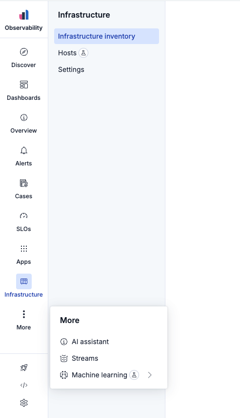
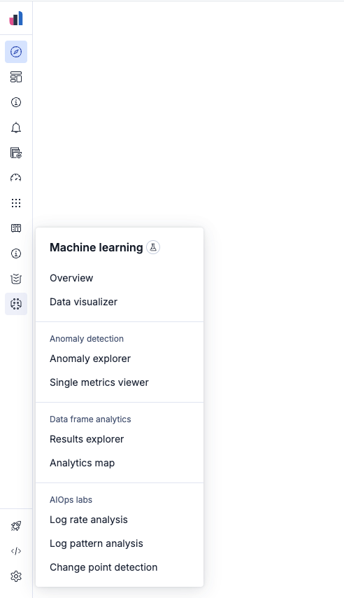

# Expanded and collapsed modes

## Overview

Side navigation has two display modes. **Expanded** is the default: primary items show icons and labels, and the secondary panel can remain visible alongside the page content. **Collapsed** narrows the primary bar to icons only and shows secondary content in hover popovers instead of a persistent panel.

## Expanded mode

- Primary items display **icon + label** in the top area.
- Selecting a primary item with children opens the **secondary side panel** to the right of the primary bar; it stays visible while the user navigates within that context.
- Footer (bottom) items use **icon-only** presentation with tooltips on hover.

## Collapsed mode

- Primary **labels are hidden**; only icons remain.
- The secondary panel **does not persist**; child destinations appear in a **popover on hover** (with exceptions for the selected item — see [primary menu](./primary-menu.md#interaction-matrix)).
- Increases horizontal space for main content, flyouts, and assistants.

## Collapse and expand

Users toggle modes with the collapse control in the navigation. The collapsed preference is persisted (chrome service / `localStorage` in Kibana) so it survives page refreshes.

On **xs** and **s** breakpoints, navigation is **forced collapsed** regardless of user preference.

## Secondary panel width

When resizable secondary navigation ships, target constraints are:

| Constraint | Value |
| --- | --- |
| Default width | 240px |
| Minimum | 200px |
| Maximum | 360px |

The user-chosen width is stored in pixels so sparse content still reserves consistent space.

> **Note:** The current implementation uses a fixed panel width (`SIDE_PANEL_WIDTH = 248px` in code). Treat resizable as planned behavior until engineering confirms parity.

## Auto-collapse with workspace width

When the main application workspace is **1000px or less**, secondary navigation collapses automatically and the manual expand/collapse affordance for the secondary panel is removed, so primary content keeps adequate width.

See [Workspace chrome guidelines](https://docs.elastic.dev).
