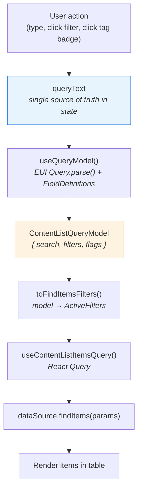
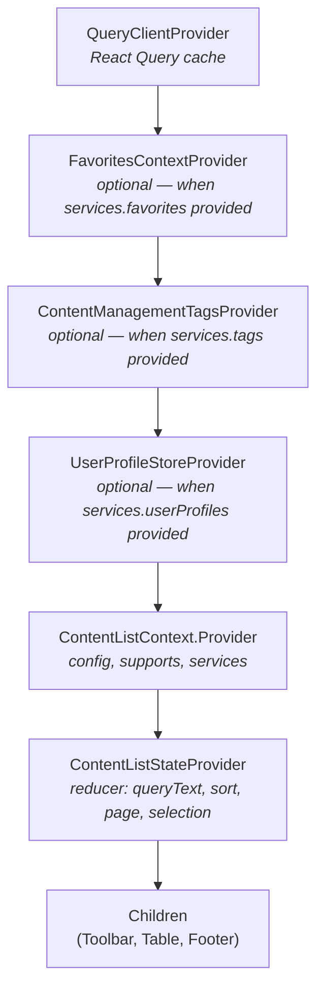
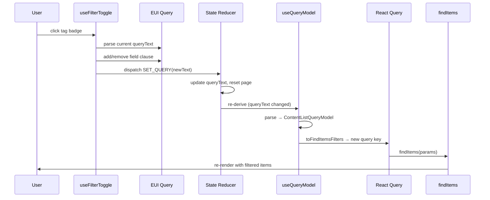

# Content List — How It Works

A composable, provider-based UI for listing, searching, filtering, and sorting Kibana saved objects (dashboards, maps, visualizations, etc.). Consumers declare which columns and filters they want via JSX; the system handles state, querying, and rendering.

Today the only consumer is the **Dashboard listing page**. The design supports any saved-object type.

## Package Map

| Package | Purpose |
|---------|---------|
| `kbn-content-list-provider` | Core: state management, query model, filtering hooks, services |
| `kbn-content-list-provider-client` | Client-side adapter — wraps an existing `findItems` function with client-side filtering, sorting, and pagination |
| `kbn-content-list-table` | Table component with composable column presets (`Name`, `UpdatedAt`, `CreatedBy`, `Starred`, `Actions`) |
| `kbn-content-list-toolbar` | Toolbar with composable filter presets (`Tags`, `Starred`, `CreatedBy`, `Sort`) and search bar |
| `kbn-content-list-docs` | Storybook stories and interactive playground |
| `kbn-content-list-mock-data` | Mock items, services, and helpers for stories and tests |

## Data Flow

This is the critical path. Every user action (typing in the search bar, clicking a filter, clicking a tag badge in the table) follows this flow:



**Why is `queryText` a string?** Because `EuiSearchBar` is controlled by a text string, not structured state. Maintaining a parallel structured filter object would create two-way sync bugs. Instead, the structured `ContentListQueryModel` is *derived on demand* from the text — never stored.

## Provider Tree

The `ContentListProvider` component nests several context providers. The order matters — each layer depends on the one above it.



## Filter Toggle Round-Trip

When a user clicks a tag badge in the table (or a user avatar, or a filter popover option), the toggle follows this round-trip:



## Query Model Pipeline

The query model is a three-step pipeline that converts user-visible text into API parameters:

### Step 1: Field Definitions

`useFieldDefinitions()` builds resolver functions from registered services:

- **Tag field** — resolves tag IDs ↔ tag names via `services.tags.getTagList()`
- **CreatedBy field** — resolves UIDs ↔ emails via `UserProfileStore`
- **Starred flag** — maps `is:starred` ↔ `starredOnly: true`

Each `FieldDefinition` provides three functions: `resolveIdToDisplay`, `resolveDisplayToId`, and optionally `resolveFuzzyDisplayToIds`.

### Step 2: Parse

`useQueryModel(queryText)` uses EUI's `Query.parse()` with a schema built from field definitions. It extracts:

- **Field clauses** (`tag:production`, `-createdBy:jane@elastic.co`) → resolves display values to internal IDs
- **Flag clauses** (`is:starred`) → boolean flags
- **Remaining text** → free-text search

Result: a `ContentListQueryModel` — a plain JSON object with `{ search, filters, flags }`.

### Step 3: Convert

`toFindItemsFilters(model)` converts the model to the `ActiveFilters` shape expected by `findItems()`:

```
queryText: "createdBy:jane@elastic.co is:starred dashboard"
       ↓ parse
model: { search: "dashboard", filters: { createdBy: { include: ["u_jane"], exclude: [] } }, flags: { starred: true } }
       ↓ convert
activeFilters: { search: "dashboard", createdBy: { include: ["u_jane"] }, starredOnly: true }
```

## Composable UI Pattern

Columns and filters are declared as JSX children using a **preset pattern**. The parent component parses children to resolve presets into EUI config objects.

```tsx
<ContentListTable title="Dashboards">
  <Column.Starred />
  <Column.Name showDescription showTags />
  <Column.CreatedBy />
  <Column.UpdatedAt />
  <Column.Actions>
    <Action.Edit />
    <Action.Delete />
  </Column.Actions>
</ContentListTable>

<ContentListToolbar>
  <Filters>
    <Filters.Starred />
    <Filters.Tags />
    <Filters.CreatedBy />
    <Filters.Sort />
  </Filters>
</ContentListToolbar>
```

These are **declarative, non-rendering components** — their props are read by the parent's resolver, not rendered directly. This enables:

- Consumers compose only the columns/filters they need
- Order in JSX determines display order
- Each preset checks `supports` flags and returns `undefined` if its service is unavailable (graceful degradation)

## UserProfileStore

The `UserProfileStore` is a synchronous-read, async-populate cache for user profiles. It exists because:

1. `FieldDefinition.resolveIdToDisplay(uid)` is called **synchronously** inside `useMemo` during query model derivation
2. But user profiles are fetched **asynchronously** from the server

The store bridges this gap:

- **After items fetch**: UIDs from items are extracted and passed to `ensureLoaded(uids)` — populates the cache for table cell avatars
- **During query parsing**: `resolve(uid)` reads synchronously from the cache — returns the cached profile or falls back to the raw UID

When the store updates (new profiles loaded), consumers re-render and the derived model re-resolves with the new data.

## Custom Fields: Consumer-Provided Filter Dimensions

Consumers can register additional filter dimensions via `features.fields` and `features.flags` on `ContentListProvider`. These are merged with the built-in definitions (tag, createdBy, starred) and participate in query parsing automatically.

```tsx
// Visualization listing adds a "type" filter:
const typeField: FieldDefinition = {
  fieldName: 'type',
  resolveIdToDisplay: (id) => vizTypes.get(id)?.title ?? id,
  resolveDisplayToId: (title) => vizTypes.findByTitle(title)?.id,
};

<ContentListProvider features={{ fields: [typeField] }} ... />
// Enables `type:bar` in the search bar and adds "type" to ActiveFilters.
```

Because `FieldDefinition` is the same interface used internally for tags and createdBy, custom fields get full include/exclude support, fuzzy matching, and query text round-tripping for free. The consumer only needs to:
1. Provide a `FieldDefinition` with resolver functions
2. Handle the corresponding `filters[fieldName]` in their `findItems`
3. (Optionally) provide a filter renderer component for the toolbar popover

## Adding a New Built-in Filter

To add a new built-in filter dimension (e.g., `updatedBy`), follow the `createdBy` pattern:

1. **Field Definition** — In `query_model/use_query_model.ts`, add a new `FieldDefinition` to `useFieldDefinitions()` with resolver functions for the new field.

2. **ActiveFilters handling** — The `toFindItemsFilters()` bridge is generic — it maps any `model.filters[fieldName]` to `activeFilters[fieldName]`. No changes needed unless the field requires special mapping.

3. **Data source** — Update `findItems` (or the client strategy) to filter by the new field when `filters.updatedBy` is present.

4. **Filter UI** — Create a filter renderer component (see `created_by_filter_renderer.tsx` as a model). Register it as a preset in `filters.ts`.

5. **Column UI** (optional) — Create a column cell component if the field should appear as a table column. Register it as a preset in `column/part.ts`.

6. **Feature flag** — Add a `supports` flag if the feature should be conditionally enabled based on service availability.
