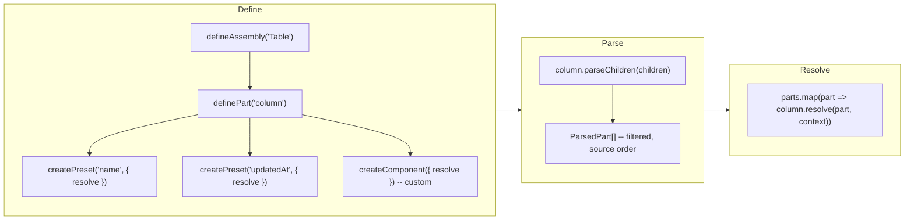

# Getting started with `@kbn/content-list-assembly`

## Table of contents

- [What is a declarative component?](#what-is-a-declarative-component)
- [Key terms](#key-terms)
- [When to use this pattern](#when-to-use-this-pattern)
- [Recommended directory structure](#recommended-directory-structure)
- [Mental model](#mental-model)
- [Walkthrough: adding a pre-built column to an existing assembly](#walkthrough-adding-a-pre-built-column-to-an-existing-assembly)
- [Walkthrough: building a new assembly from scratch](#walkthrough-building-a-new-assembly-from-scratch)
- [Common pitfalls](#common-pitfalls)
- [What to read next](#what-to-read-next)

## What is a declarative component?

A **declarative component** is a React component that returns `null`. It exists solely to carry configuration via props. A parent component (the "assembly") reads its children, identifies declarative components by static Symbol properties, extracts their props, and uses the resulting configuration to render the actual UI.

Instead of this:

```tsx
// Prop-based: flat, rigid, hard to extend.
<MyToolbar
  filters={['sort', 'tags']}
  sortDirection="asc"
  tagFilter="featured"
/>
```

You write this:

```tsx
// Declarative: composable, visual, order matters.
<MyToolbar>
  <Filters>
    <Filters.Sort direction="asc" />
    <Filters.Tags selected="featured" />
  </Filters>
</MyToolbar>
```

The children look like the UI they configure. **JSX order is rendering order.** The assembly decides how to render them.

> **Further reading**
>
> - [Compound Components with React Hooks](https://kentcdodds.com/blog/compound-components-with-react-hooks) -- the broader pattern family, by Kent C. Dodds.
> - [Recharts](https://recharts.org/) -- real-world library where `<XAxis>`, `<Tooltip>`, and `<Line>` configure `<LineChart>` as children.

## Key terms

| Term | Definition | Example |
|------|------------|---------|
| **Assembly** | A named parent component that parses its children for configuration. | `ContentListTable` parses `Column` children to build table columns. |
| **Part** | A category of declarative component within an assembly. Parts return `null` and carry attributes via props. Typed with a preset-to-props mapping. | `'column'` is a part of the table assembly. |
| **Preset** | A named variant for a pre-built part. Props type is inferred from the mapping on `definePart`. | `'name'` identifies the `Column.Name` preset; `'sort'` identifies `Filters.Sort`. |
| **Instance ID** | A unique identity for each parsed element. Resolved from `props.id`, the `preset`, or auto-generated. | `'name'`, `'save'`, `'button-1'`. |

## When to use this pattern

**Use it when:**

- The component has many optional, composable features (columns, filters, actions) and consumers pick a subset.
- Ordering matters and should be visible in JSX rather than buried in an array index.
- You want progressive complexity -- simple usage requires minimal code, full customization is available through additional children and props.
- New features should not grow the parent component's prop surface.

**Don't use it when:**

- There are only 2-3 fixed options. A boolean or enum prop is simpler.
- Ordering is irrelevant or always the same.
- Configuration is a single flat object. Plain props are fine.

## Recommended directory structure

Each part gets its own directory named after the part. The directory contains:

- `part.ts` -- part definition, preset-to-props mapping, and base component (if any).
- One file per preset, named after the preset (e.g., `save.ts`, `dropdown.ts`).
- `index.ts` -- explicit exports for the directory.

```
action_bar/
  assembly.ts
  action_bar.tsx
  button/
    part.ts              # definition + mapping + base component
    save.ts              # preset
    delete.ts            # preset
    index.ts
  filter/
    part.ts
    dropdown.ts
    toggle.ts
    index.ts
  spacer/
    part.ts              # definition + component (no presets)
    index.ts
  index.ts
```

## Mental model

Three named layers. TypeScript constrains each layer. Symbols handle runtime identification internally.



1. **Consumer writes JSX.** Declarative children describe *what* should appear and in *what order*.
2. **Part parses children.** `part.parseChildren()` walks children, identifies parts by static Symbol properties, and returns only the parts matching this part type. (Use `assembly.parseChildren()` when you need all part types interleaved.)
3. **Part resolves.** `part.resolve()` dispatches to the `resolve` callback registered via `createPreset` or falls back to the one from `createComponent`. No manual dispatch maps or casts needed.

## Walkthrough: adding a pre-built column to an existing assembly

This walkthrough adds a hypothetical "Updated at" column to the existing `ContentListTable` assembly.

### Step 1: add the props type to the mapping

In `column/part.ts`, add the new preset to the `ColumnPresets` mapping:

```typescript
// kbn-content-list-table/src/column/part.ts

import { table } from '../assembly';
import type { NameColumnProps } from './name/name_builder';
import type { UpdatedAtColumnProps } from './updated_at/updated_at_builder';

export interface ColumnPresets {
  name: NameColumnProps;
  updatedAt: UpdatedAtColumnProps;  // <-- new
}

export const column = table.definePart<ColumnPresets>({ name: 'column' });
```

### Step 2: create the preset with a resolve callback

```typescript
// kbn-content-list-table/src/column/updated_at/updated_at_builder.ts

import { column } from '../part';
import type { ColumnBuilderContext } from '../types';

export interface UpdatedAtColumnProps {
  width?: string;
  title?: string;
}

// Props type comes from the mapping -- no explicit generic needed.
// The `resolve` callback converts declared attributes into an EUI column.
export const UpdatedAtColumn = column.createPreset({
  name: 'updatedAt',
  resolve: (attributes, context) => ({
    field: 'updatedAt',
    name: attributes.title ?? 'Last updated',
    width: attributes.width,
    sortable: context.supports?.sorting ?? true,
  }),
});
```

No separate builder map needed. The `column.resolve()` method dispatches automatically.

### Step 3: consumer usage

```tsx
<ContentListTable>
  <Column.Name width="300px" />
  <Column.UpdatedAt />
</ContentListTable>
```

The order in JSX determines the column order in the table.

## Walkthrough: building a new assembly from scratch

This walkthrough builds a minimal `ActionBar` assembly.

### Step 1: define the assembly and parts

```typescript
// action_bar/assembly.ts
import { defineAssembly } from '@kbn/content-list-assembly';

export const actionBar = defineAssembly({ name: 'ActionBar' });
```

```typescript
// action_bar/button/part.ts
import { actionBar } from '../assembly';

interface SaveButtonProps {
  onClick?: () => void;
}

interface DeleteButtonProps {
  onClick?: () => void;
  confirmMessage?: string;
}

export interface ButtonPresets {
  save: SaveButtonProps;
  delete: DeleteButtonProps;
}

export const button = actionBar.definePart<ButtonPresets>({ name: 'button' });
```

### Step 2: create presets with resolve callbacks

```typescript
// action_bar/button/save.ts
import { button } from './part';
import { EuiButton } from '@elastic/eui';

// Props type inferred from ButtonPresets. The resolve callback
// converts declared attributes into rendered output.
export const SaveButton = button.createPreset({
  name: 'save',
  resolve: ({ onClick }) => <EuiButton onClick={onClick}>Save</EuiButton>,
});
```

```typescript
// action_bar/button/delete.ts
import { button } from './part';
import { EuiButton } from '@elastic/eui';

export const DeleteButton = button.createPreset({
  name: 'delete',
  resolve: ({ onClick }) => (
    <EuiButton color="danger" onClick={onClick}>Delete</EuiButton>
  ),
});
```

### Step 3: parse and resolve

```tsx
// action_bar/action_bar.tsx
import type { FC, ReactNode } from 'react';
import { EuiFlexGroup, EuiFlexItem } from '@elastic/eui';
import { actionBar } from './assembly';
import { button } from './button/part';

interface ActionBarProps {
  children?: ReactNode;
}

const ActionBarComponent: FC<ActionBarProps> = ({ children }) => {
  const items = actionBar.parseChildren(children);

  return (
    <EuiFlexGroup gutterSize="s">
      {items.map((item) => {
        if (item.type === 'child') return item.node;

        // Resolve dispatches to the preset's resolve callback -- no casts.
        const rendered = button.resolve(item);
        if (rendered) {
          return (
            <EuiFlexItem key={item.instanceId} grow={false}>
              {rendered}
            </EuiFlexItem>
          );
        }

        return null;
      })}
    </EuiFlexGroup>
  );
};
```

### Step 4: consumer usage

```tsx
const { Button } = ActionBar;

<ActionBar>
  <Button.Save onClick={handleSave} />
  <Button.Delete onClick={handleDelete} />
</ActionBar>
```

## Common pitfalls

### Do not wrap declarative components with `React.memo()` or HOCs

Declarative components carry their identity via static `Symbol.for()` properties on the function object. Wrappers like `React.memo()`, `forwardRef()`, and higher-order components create a new function that does not carry those statics, causing the component to silently disappear from the assembly output.

Since declarative components return `null` and have no render cost, `React.memo()` provides no benefit anyway. If you must use an HOC, use `hoist-non-react-statics` or manually copy the Symbol properties.

In development, a console warning will appear if a part has no resolver, which can help diagnose this issue.

### Non-part children are supported

Assemblies can accept regular React nodes alongside declarative parts. `assembly.parseChildren()` preserves non-part children as `{ type: 'child', node }` items in source order, and the renderer decides what to do with them -- render them inline, reposition them, or ignore them. See Recipe 6 for a worked example.

The two parsing helpers handle non-part children differently:

- **`assembly.parseChildren()`** -- returns the full interleaved result including non-part children. In development, it warns for unrecognized function component children by default. If your renderer handles non-part children intentionally, pass `{ supportsOtherChildren: true }` to suppress the warning.
- **`part.parseChildren()`** -- filters to only matching parts and discards everything else. In development, it warns for function component children that are being discarded, since these are the most likely to be placed accidentally.

## What to read next

- [README.md](README.md) -- API reference and design decisions.
- [RECIPES.md](RECIPES.md) -- Copy-paste patterns for common tasks.
