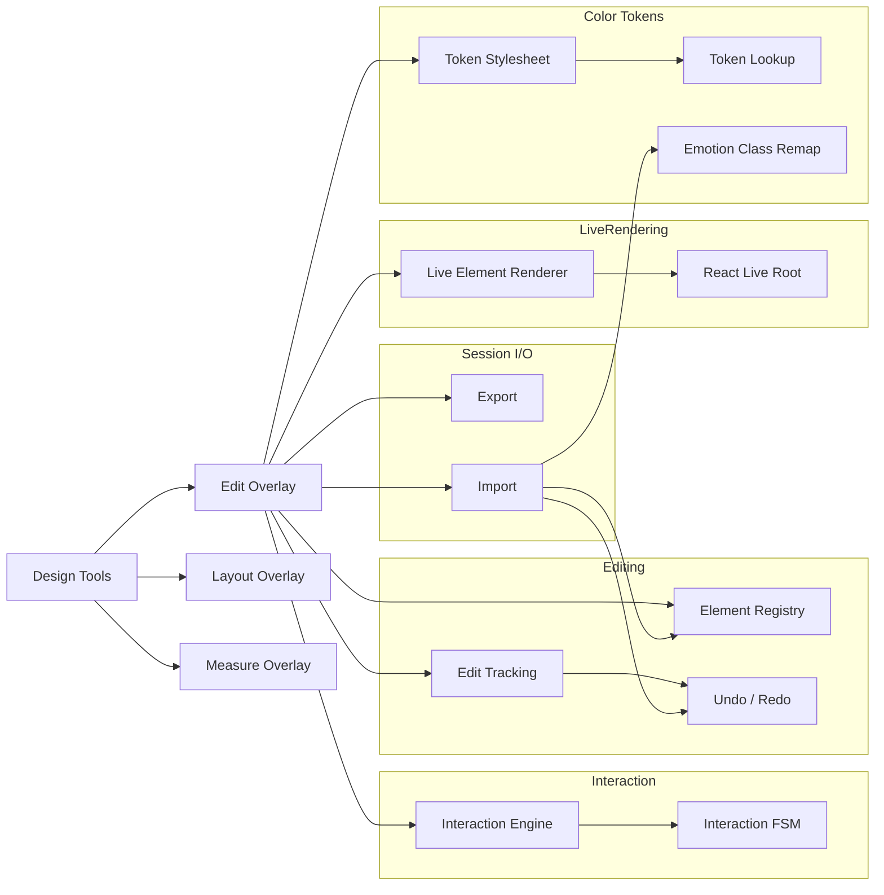

# @kbn/design-tools

Developer toolbar design tools addon - an interactive DOM editor overlaid on Kibana pages that supports dragging, resizing, duplicating, inline editing (styles, text, HTML attributes), inserting live EUI components, and full undo/redo.

## Keyboard Shortcuts

| Shortcut | Action |
|---|---|
| `Escape` | Exit current mode / deselect |
| `Delete` / `Backspace` | Delete selected element |
| `Enter` | Open edit modal for selected element |
| `Cmd+D` (`Ctrl+D`) | Duplicate hovered element |
| `Cmd+Z` (`Ctrl+Z`) | Undo |
| `Cmd+Shift+Z` (`Ctrl+Shift+Z`) | Redo |
| `Cmd+.` (`Ctrl+.`) | Toggle measure mode |
| `Shift` (during drag) | Free move without grid snapping |

## Architecture

### Key Architectural Concepts

#### Mutable Ref State

The interaction layer (`useInteractionMachine`, `ElementRegistry`, interaction FSM) is stored in refs instead of React state to keep pointer interactions responsive. Dragging, resizing, and hover updates run continuously without triggering React renders, and state is only synced back to React when something needs to be reflected in the UI (like selection, cursor state, or overlays).

#### Interaction State Machine

A finite state machine governs all pointer interactions: `idle → hover → pending-drag → drag` (with a 3 px dead-zone threshold) and `hover + resize handle → resize`. The FSM is stored in a ref and transitions are exhaustive - every `pointerMove` / `pointerDown` / `pointerUp` is a deterministic state transition, which prevents race conditions between drag, resize, and hover logic.

#### Element Sessions & Registry

Every element the user touches gets an `ElementSession` - a per-element state container tracking position deltas (`dx`, `dy`, `dw`, `dh`), ownership type, edit history, and optional live React metadata. The `ElementRegistry` is a `Map<HTMLElement, ElementSession>` that acts as the single source of truth for all managed elements. Sessions come in four flavors:

| Session Type | `isDuplicate` | `referenceEl` | Owns Element? | Use Case |
|---|---|---|---|---|
| Drag | `false` | original | Yes (clone) | User drags a page element - original hidden, clone visible |
| Duplicate | `true` | source | Yes | Cmd+D copy of an existing element |
| Live/Insert | `true` | (optional) | Yes + cleanup | Library component rendered with a live React root |
| Promoted Edit | `false` | original | Yes (clone) | Edit modal save on an original element - promoted to a managed clone |

#### Live Elements

Static clones lose all interactivity - a cloned `<EuiSwitch>` can't toggle. "Live elements" solve this by rendering the actual React component into a fresh `createRoot` with a full `EuiProvider`, keeping event handlers alive. The wrapper div gets a `data-devtool-live` attribute so the overlay can distinguish it from static clones.

State transfer between live elements (e.g. when duplicating a toggled switch) uses `useSerializableState` - a drop-in `useState` replacement that syncs values to `data-state-*` attributes on the live wrapper. On duplication, these attributes are read from the source and injected into the new instance via `SerializedStateContext`.

#### Color Token Stylesheet

EUI components use Emotion CSS-in-JS, which bakes color values into hashed class names (`css-abc123-euiButton`). When the user edits colors through the design tools color picker, values need to stay in sync with EUI's token system. The solution:

1. **`syncTokenStylesheet()`** injects a `<style>` element into `<head>` declaring CSS custom properties (`--dt-textParagraph`, `--dt-backgroundBasePlain`, etc.) for every EUI color token in the current color mode.
2. **`color_token_lookup`** maps between hex values and token names, so the color picker can show token names and the edited styles can reference `var(--dt-tokenName)` instead of hardcoded hex.
3. **`remap_emotion_classes`** handles cross-color-mode imports: Emotion class hashes change between light/dark mode (because the CSS content includes color values), so this module matches classes by their stable label suffix (e.g. `euiButton`) and remaps stale hashes to current-mode equivalents.

This means clones styled with `var(--dt-*)` automatically update when the color mode changes - no DOM walk needed.

#### Edit Tracking & Undo/Redo

Every edit records the **original value before applying changes** (store-then-mutate pattern), enabling full reversal of user actions.

- **`StyleEdit`**: captures `element`, CSS `property`, `original` value, and `originalPriority`
- **`TextEdit`**: captures the `Text` node and its original content
- **`MediaEdit`**: captures the `Element`, attribute name, and original value

The `UndoRedoStack` maintains a linear history of transactions in a `useRef`, allowing edits to be recorded without triggering React renders. It exposes a `useSyncExternalStore` subscription so toolbar controls stay in sync with available undo/redo state.

Supported transaction types include `move`, `resize`, `edit`, `duplicate`, `delete`, `clone`, and `import`. An `edit` transaction bundles style, text, and media changes together; when it promotes an original element to a managed clone, the `promotedFrom` field lets undo tear down the clone and restore the original. An `import` transaction captures snapshots of all imported sessions and soft-deletions, so the entire file import can be atomically undone (removing all imported elements and un-hiding deleted ones) or redone. The stack is responsible only for ordering and history; applying and reverting changes is handled by executor functions.

#### Draft History (Edit Modal)

The edit modal uses a **draft history** system — a local `UndoRedoStack` instance that lives only while the modal is open. This gives users granular undo/redo within the modal while collapsing all changes into a single bulk `EditTransaction` on save.

**How it works:**

1. Each individual change (color, dimension, text, media) pushes a `DraftEdit` to the local stack via `useDraftHistory`. The edit applies the visual change to the preview clone and records `before`/`after` values.
2. `Cmd+Z` / `Cmd+Shift+Z` (captured in a capture-phase listener with `stopPropagation` to avoid triggering the main overlay's undo) reverses or re-applies individual draft edits on the preview clone and syncs the editor UI state.
3. Undo/redo buttons in the modal footer provide mouse-driven access with label tooltips.
4. Reset actions (reset color, reset dimension, reset text node) are recorded as regular draft edits — they can be undone too.
5. On **Save**, `flattenDraftEdits()` computes the **net effect** per `(element, property)` pair — deduplicating intermediate changes and filtering out no-ops where the value returned to its original — then produces the `StyleChange[]`, `TextNodeChange[]`, and `MediaChange[]` arrays passed to `onSave`, which become a single `EditTransaction` on the main stack.
6. On **Cancel**, the draft stack is discarded with the modal (the preview clone is ephemeral).

**Key types:**

| Type | Fields | Purpose |
|---|---|---|
| `DraftStyleEdit` | `element`, `cloneElement`, `property`, `before`, `after` | Background color, dimensions, overflow |
| `DraftTextEdit` | `index`, `originalNode`, `cloneNode`, `field`, `before`, `after` | Text content, color, font-size, font-weight |
| `DraftMediaEdit` | `index`, `originalElement`, `cloneElement`, `attribute`, `before`, `after` | Image src, SVG href, icon type |

#### Truncation And Text Reflow

Preview and managed edit flows intentionally remove layout freezing after text and size edits so containers can grow to fit content.

- Text reflow unfreezes width and height on the edited text parent and descendants.
- Text reflow also unfreezes ancestor chains toward the managed/preview root with context-aware root behavior: root height is unfrozen for growth; root width is unfrozen only for no-wrap text contexts; root width remains fixed for wrapping text contexts.
- Style reflow (`width`, `height`, `padding`, `margin`) unfreezes descendants and ancestor chains to keep implicit hug-like growth.
- Truncation detection includes class-based and computed-style checks (`text-overflow: ellipsis`, `-webkit-line-clamp`).
- Clone truncation neutralization strips truncation classes and applies inline overrides (`text-overflow: clip`, line-clamp reset); `overflow: visible` is only forced when truncation is detected by stripped classes or connected computed styles.
- Truncation measurement expands clone bounds in both axes (`scrollWidth` and `scrollHeight`) before the preview wrapper min-size is computed.

#### Component Library

The library (`components/edit/library/`) provides pre-built EUI component descriptors (buttons, switches, cards, accordions, etc.) as `ReactElement` values. When the user inserts one, it's rendered live via `renderEuiComponentLive()`, making it fully interactive on the canvas. Each library entry uses `useSerializableState` for any toggleable state so it survives duplication and export/import.