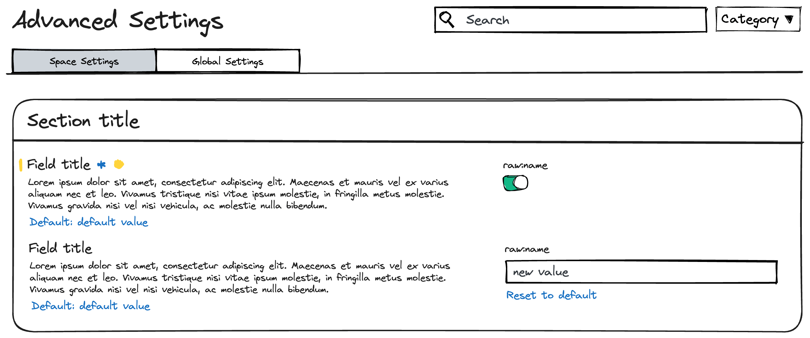

## Description

This package contains a component for rendering and manipulating a single UiSetting in the Advanced Settings UI.

For reference, this is an example of the current Advanced Settings UI:

*Advanced Settings as a form.*

## Implementation

A `FormRow` represents a single UiSetting, and is responsible for rendering the UiSetting's label, description, and equivalent value input. It displays the state of any unsaved change, (e.g. error).  It also handles the logic for updating the UiSetting's value in a consuming component through the `onFieldChange` handler.

*Anatomy of a `FormRow`*

## Notes

- This implementation was extracted from the `advancedSettings` plugin.
- The type for a `UiSettingMetadata` is limited due to the permissive nature of the [`UiSettingsParam` type](packages/core/ui-settings/core-ui-settings-common/src/ui_settings.ts).
- The source includes notations of several bugs which will surface if the assumptions about default settings from Kibana change.

## Testing 

- Code coverage stands at 95%.
- Storybook stories are included.  Run `yarn storybook management` to view them.