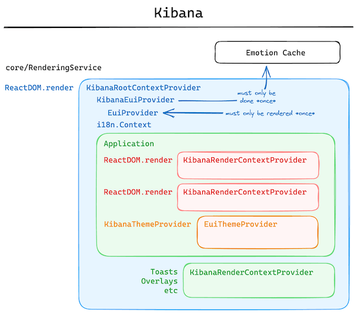

## Notes:
- This document describes the **legacy** React context providers that make available the common services needed for internal components. 
- A replacement service is available from SharedUX that abstracts the dependencies needed for a fully-loaded React context: <DocLink id="kibDevRenderingService" />.

## Description

Kibana uses React Context to manage several global states.  Those states have been divided into several reusable components in relevant packages.

- <DocLink id="react/context/root" text="`KibanaRootContextProvider`" /> - A root context provider for Kibana.  This is the top level context provider that wraps the entire application.  It is responsible for initializing all of the other contexts and providing them to the application.
- <DocLink id="react/context/render" text="`KibanaRenderContextProvider`" /> - A render context provider for Kibana.  This context is designed to be used with ad-hoc renders of React components, (usually with `ReactDOM.render`).
- <DocLink id="react/context/theme" text="`KibanaThemeContextProvider`" /> - A theme context provider for Kibana.  A corollary to EUI's `EuiThemeProvider`, it uses Kibana services to ensure the EUI Theme is customized correctly.

## Deprecated Context Providers

- `KibanaStyledComponentsThemeProvider` - A styled components theme provider for Kibana.  This package is supplied for compatibility with legacy code, but should not be used in new code.