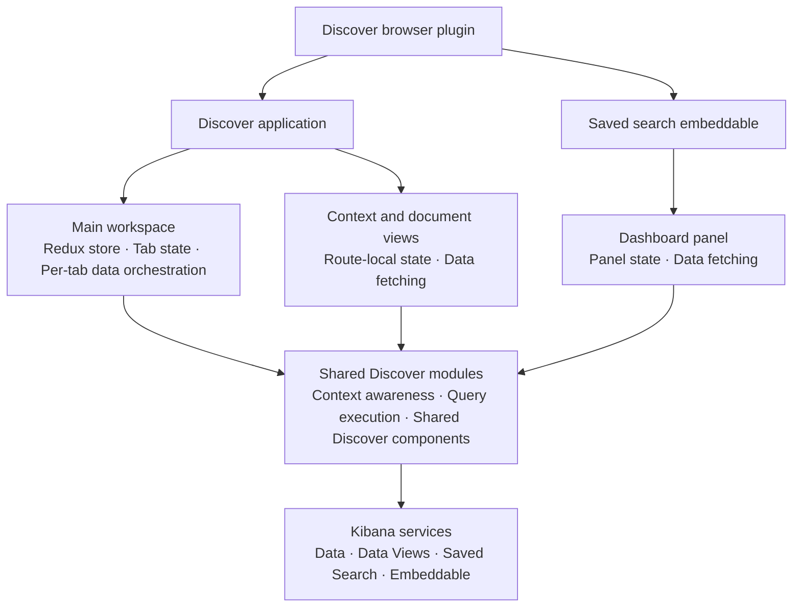
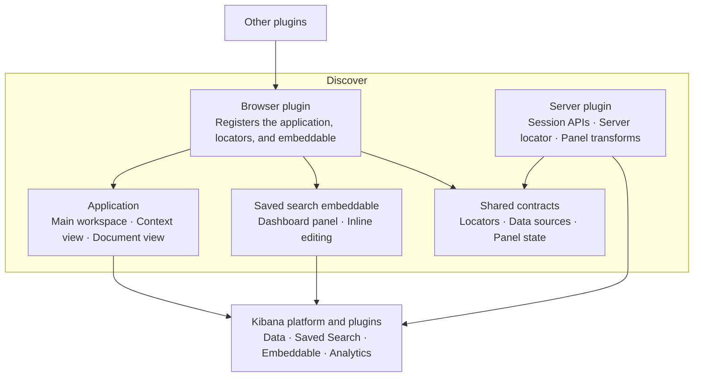

# Discover

Discover is Kibana's data exploration application: a dynamic chart area above a document table with rich content, for querying and exploring Elasticsearch data. It runs in two query modes, classic (data view with KQL/Lucene) and ES|QL. It also ships the saved search embeddable that renders Discover sessions on dashboards.

Owned by [`@elastic/kibana-data-discovery`](https://github.com/orgs/elastic/teams/kibana-data-discovery).

## Key concepts

- **Discover session:** a tabbed workspace for data exploration, persisted via the [`savedSearch`](../../shared/saved_search) plugin (historically called a "saved search").
- **Discover tabs:** the main organizational structure and way of working in Discover. A session holds one or more tabs, built on [`@kbn/unified-tabs`](../../../packages/shared/kbn-unified-tabs).
- **Classic mode vs ES|QL mode:** the active mode is derived from whether the current query is an ES|QL query. Data fetching branches accordingly (see [Architecture](#architecture-at-a-glance)).
- **Context awareness:** Discover's primary extension framework. Profiles resolved at the root, data source, and document levels adapt its UI and behavior to the surrounding context. See [`public/context_awareness/README.md`](./public/context_awareness/README.md).
- **Saved search embeddable:** the panel that renders a Discover session on dashboards. See [`public/embeddable`](./public/embeddable).

## Architecture at a glance

- **Plugin lifecycle:**
  - `setup` in [`public/plugin.tsx`](./public/plugin.tsx) registers the `discover` application, the share plugin locators, the saved search embeddable, and the context awareness profile services.
  - `start` returns the public contract, `{ locator, DiscoverContainer }`.
  - [`server/plugin.ts`](./server/plugin.ts) registers HTTP routes, the server side embeddable factory, and the server locator.
  - Client services are assembled in [`public/build_services.ts`](./public/build_services.ts).
- **Routes:** [`public/application/discover_router.tsx`](./public/application/discover_router.tsx) maps URLs to five apps:
  - `main`: the main workspace with chart area and document table.
  - `context`: surrounding documents view.
  - `doc`: single document view.
  - `view_alert`: alert notification forwarding.
  - `not_found`: fallback route.
- **State layering (main app):** state is split into three layers rather than a single container:
  - Serializable Redux internal state store ([`redux/internal_state.ts`](./public/application/main/state_management/redux/internal_state.ts)).
  - Per tab runtime state manager of non-serializable RxJS subjects ([`redux/runtime_state.tsx`](./public/application/main/state_management/redux/runtime_state.tsx)).
  - Per tab data state container that orchestrates fetching ([`discover_data_state_container.ts`](./public/application/main/state_management/discover_data_state_container.ts)).
- **Data fetching:** a trigger observable drives `fetchAll`, which branches on query mode and pushes results into the RxJS data subjects consumed by the UI.

### Browser architecture

### Plugin architecture

## Extending Discover

Discover exposes a deliberately thin runtime contract (`DiscoverSetup` and `DiscoverStart` in [`public/types.ts`](./public/types.ts)). Real extensibility happens through these surfaces:

- **Context awareness (Discover profiles):** the primary framework for adapting Discover per solution, data source, and document. See the [context awareness README](./public/context_awareness/README.md), the [extension points inventory](./public/context_awareness/EXTENSION_POINTS_INVENTORY.md), and the [developer docs](./public/context_awareness/DEV_DOCS.md).
- **`discoverShared` feature registry:** a layer with no plugin dependencies where solutions (Observability, Security, etc.) register UI features that Discover pulls in, avoiding cyclic dependencies. See the [`discover_shared` README](../discover_shared/README.md).
- **The locator:** `DISCOVER_APP_LOCATOR` ([`common/app_locator.ts`](./common/app_locator.ts)) lets other plugins deep link into Discover in a specific state; there is a separate ES|QL locator ([`common/esql_locator.ts`](./common/esql_locator.ts)).
- **Saved search embeddable:** `SEARCH_EMBEDDABLE_TYPE` and `SearchEmbeddableApi` (exported from [`public/embeddable`](./public/embeddable)) for rendering Discover on dashboards.

> The `DiscoverContainer` component on the `start` contract is **deprecated**. Prefer context awareness or the embeddable over embedding Discover directly.

## Project tree

### [public](./public)

Client only code. Loading Discover executes [`public/application/main`](./public/application/main).

- **[/application](./public/application):** one folder per route.
  - **[/main](./public/application/main):** the main workspace, containing the chart area and document table.
  - **[/context](./public/application/context):** surrounding documents view.
  - **[/doc](./public/application/doc):** single document view.
  - **[/view_alert](./public/application/view_alert):** forwarding links from alert notifications.
  - **[/not_found](./public/application/not_found):** fallback route.
- **[/components](./public/components):** React components shared across more than one app.
- **[/context_awareness](./public/context_awareness):** the context awareness framework (has its own [README](./public/context_awareness/README.md)).
- **[/customizations](./public/customizations):** a deprecated framework for embedding and customizing Discover.
- **[/embeddable](./public/embeddable):** the saved search embeddable, rendered on dashboards.
- **[/ebt_manager](./public/ebt_manager):** product telemetry (EBT events; see [Telemetry](#telemetry)).
- **[/agent_builder](./public/agent_builder):** registers Discover's ES|QL results attachment UI with the agent builder plugin.
- **[/hooks](./public/hooks):** React hooks used across apps.
- **[/plugin_imports](./public/plugin_imports):** lazy loaded chunks the plugin class dynamically imports.
- **[/utils](./public/utils):** utilities used across more than one app.

### [server](./server)

Server only code.

- **[/api](./server/api):** HTTP routes for Discover sessions.
- **[/embeddable](./server/embeddable):** server side embeddable factory, schema, and transforms.
- **[/locator](./server/locator):** server side extensions of the Discover app locator.
- **[/sample_data](./server/sample_data):** Sample Data Registry registrations for Discover saved objects.
- **[/capabilities_provider.ts](./server/capabilities_provider.ts):** capabilities definition for Core.
- **[/ui_settings.ts](./server/ui_settings.ts):** advanced settings and their defaults.

### [common](./common)

Code shared by client and server.

- **[/constants.ts](./common/constants.ts):** general constants.
- **[/data_sources](./common/data_sources):** data source (data view or ES|QL) types and utils.
- **[/app_locator.ts](./common/app_locator.ts)** and **[/esql_locator.ts](./common/esql_locator.ts):** URL service locators for deep linking into Discover.

## Related packages

Discover composes a set of reusable packages, several of which have their own docs:

| Package                                                                                                                                           | Purpose                                          |
| ------------------------------------------------------------------------------------------------------------------------------------------------- | ------------------------------------------------ |
| [`@kbn/unified-histogram`](../../../packages/shared/kbn-unified-histogram)                                                                        | The chart area above the table.                  |
| [`@kbn/unified-field-list`](../../../packages/shared/kbn-unified-field-list)                                                                      | The fields sidebar.                              |
| [`@kbn/unified-data-table`](../../../packages/shared/kbn-unified-data-table)                                                                      | The document table.                              |
| [`@kbn/unified-doc-viewer`](../../../packages/shared/kbn-unified-doc-viewer) and the [`unifiedDocViewer` plugin](../unified_doc_viewer/README.md) | The document flyout and single document view.    |
| [`@kbn/unified-tabs`](../../../packages/shared/kbn-unified-tabs)                                                                                  | The tabs bar.                                    |
| [`@kbn/discover-utils`](../../../packages/shared/kbn-discover-utils)                                                                              | Shared Discover types, utils, and mocks.         |
| [`@kbn/discover-contextual-components`](../../../packages/shared/kbn-discover-contextual-components)                                              | Contextual components used by Discover profiles. |

## Testing

We cover most code with sociable (integration style) unit tests that exercise as many real dependencies as possible, and rely on [shared mocks](./public/__mocks__) where a fixture is needed or a real dependency is impractical. End to end tests are reserved for core workflows, smoke tests, and behavior that is hard to cover otherwise.

- **Unit (Jest):** co-located `*.test.ts(x)` files across the plugin, discovered via [`jest.config.js`](./jest.config.js). Run one with `node scripts/jest <path to test>`.
- **UI and API (Scout / Playwright):** [`test/scout`](./test/scout), split by feature area (`core`, `data_grid`, `esql`, etc.). Prefer Scout over FTR for new UI and API tests.
- **Functional (FTR):** [`src/platform/test/functional/apps/discover`](../../../test/functional/apps/discover) and [`x-pack/platform/test/functional/apps/discover`](../../../../../x-pack/platform/test/functional/apps/discover).

## Telemetry

Discover reports product telemetry through three channels: custom EBT events, standard `performance_metric` events for durations, and `trackUiMetric` UI counters for legacy usage counts. Registrations live in [`public/ebt_manager`](./public/ebt_manager).

See [`public/ebt_manager/README.md`](./public/ebt_manager/README.md) for the full catalog of events, fields, and schemas.

## Feature flags and configuration

Feature flag keys are re-exported as constants from [public/constants.ts](./public/constants.ts). These are the feature flags used by Discover:

| Flag key                        | Constant                                  | Description                                                      |
| ------------------------------- | ----------------------------------------- | ---------------------------------------------------------------- |
| `discover.cascadeLayoutEnabled` | `CASCADE_LAYOUT_ENABLED_FEATURE_FLAG_KEY` | Enables the cascaded documents layout.                           |
| `discover.isEsqlDefault`        | `IS_ESQL_DEFAULT_FEATURE_FLAG_KEY`        | Makes ES\|QL the default query mode.                             |

Discover also exposes plugin config options, defined in [server/config.ts](./server/config.ts):

| Config key                                | Type       | Description                                           |
| ----------------------------------------- | ---------- | ----------------------------------------------------- |
| `discover.enableUiSettingsValidations`    | `boolean`  | Enables validation of Discover related UI settings.   |
| `discover.experimental.enabledProfiles`   | `string[]` | Experimental context awareness profile IDs to enable. |
| `discover.experimental.ruleFormV2Enabled` | `boolean`  | Enables the v2 rule form in Discover (obsolete).      |
