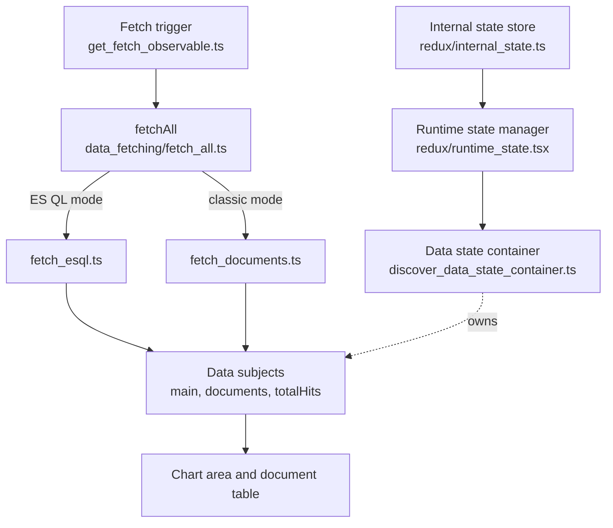

# Discover

Discover is Kibana's data exploration application: a dynamic chart area above a document table with rich content, for querying and exploring Elasticsearch data. It runs in two query modes, classic (data view with KQL/Lucene) and ES|QL. It also ships the saved search embeddable that renders Discover sessions on dashboards.

Owned by [`@elastic/kibana-data-discovery`](https://github.com/orgs/elastic/teams/kibana-data-discovery).

## Key concepts

- **Discover session:** a tabbed workspace for data exploration, persisted via the [`savedSearch`](../../shared/saved_search) plugin (historically called a "saved search").
- **Discover tabs:** the main organizational structure and way of working in Discover. A session holds one or more tabs, built on [`@kbn/unified-tabs`](../../../packages/shared/kbn-unified-tabs).
- **Classic mode vs ES|QL mode:** the active mode is derived from whether the current query is an ES|QL query. Data fetching branches accordingly (see [Architecture](#architecture-at-a-glance)).
- **Context awareness:** Discover's primary extension framework. Profiles resolved at the root, data source, and document levels adapt its UI and behavior to the surrounding context. See [`public/context_awareness/README.md`](./public/context_awareness/README.md).
- **Saved search embeddable:** the panel that renders a Discover session on dashboards. See [`public/embeddable`](./public/embeddable).

## Architecture at a glance

- **Plugin lifecycle:**
  - `setup` in [`public/plugin.tsx`](./public/plugin.tsx) registers the `discover` application, the share plugin locators, the saved search embeddable, and the context awareness profile services.
  - `start` returns the public contract, `{ locator, DiscoverContainer }`.
  - [`server/plugin.ts`](./server/plugin.ts) registers HTTP routes, the server side embeddable factory, and the server locator.
  - Client services are assembled in [`public/build_services.ts`](./public/build_services.ts).
- **Routes:** [`public/application/discover_router.tsx`](./public/application/discover_router.tsx) maps URLs to five apps:
  - `main`: the main workspace with chart area and document table.
  - `context`: surrounding documents view.
  - `doc`: single document view.
  - `view_alert`: alert notification forwarding.
  - `not_found`: fallback route.
- **State layering (main app):** state is split into three layers rather than a single container:
  - Serializable Redux internal state store ([`redux/internal_state.ts`](./public/application/main/state_management/redux/internal_state.ts)).
  - Per tab runtime state manager of non-serializable RxJS subjects ([`redux/runtime_state.tsx`](./public/application/main/state_management/redux/runtime_state.tsx)).
  - Per tab data state container that orchestrates fetching ([`discover_data_state_container.ts`](./public/application/main/state_management/discover_data_state_container.ts)).
- **Data fetching:** a trigger observable drives `fetchAll`, which branches on query mode and pushes results into the RxJS data subjects consumed by the UI.

## Extending Discover

Discover exposes a deliberately thin runtime contract (`DiscoverSetup` and `DiscoverStart` in [`public/types.ts`](./public/types.ts)). Real extensibility happens through these surfaces:

- **Context awareness (Discover profiles):** the primary framework for adapting Discover per solution, data source, and document. See the [context awareness README](./public/context_awareness/README.md), the [extension points inventory](./public/context_awareness/EXTENSION_POINTS_INVENTORY.md), and the [developer docs](./public/context_awareness/DEV_DOCS.md).
- **`discoverShared` feature registry:** a layer with no plugin dependencies where solutions (Observability, Security, etc.) register UI features that Discover pulls in, avoiding cyclic dependencies. See the [`discover_shared` README](../discover_shared/README.md).
- **The locator:** `DISCOVER_APP_LOCATOR` ([`common/app_locator.ts`](./common/app_locator.ts)) lets other plugins deep link into Discover in a specific state; there is a separate ES|QL locator ([`common/esql_locator.ts`](./common/esql_locator.ts)).
- **Saved search embeddable:** `SEARCH_EMBEDDABLE_TYPE` and `SearchEmbeddableApi` (exported from [`public/embeddable`](./public/embeddable)) for rendering Discover on dashboards.

> The `DiscoverContainer` component on the `start` contract is **deprecated**. Prefer context awareness or the embeddable over embedding Discover directly.

## Project tree

### [public](./public)

Client only code. Loading Discover executes [`public/application/main`](./public/application/main).

- **[/application](./public/application):** one folder per route.
  - **[/main](./public/application/main):** the main workspace, containing the chart area and document table.
  - **[/context](./public/application/context):** surrounding documents view.
  - **[/doc](./public/application/doc):** single document view.
  - **[/view_alert](./public/application/view_alert):** forwarding links from alert notifications.
  - **[/not_found](./public/application/not_found):** fallback route.
- **[/components](./public/components):** React components shared across more than one app.
- **[/context_awareness](./public/context_awareness):** the context awareness framework (has its own [README](./public/context_awareness/README.md)).
- **[/customizations](./public/customizations):** a deprecated framework for embedding and customizing Discover.
- **[/embeddable](./public/embeddable):** the saved search embeddable, rendered on dashboards.
- **[/ebt_manager](./public/ebt_manager):** product telemetry (EBT events; see [Telemetry](#telemetry)).
- **[/agent_builder](./public/agent_builder):** registers Discover's ES|QL results attachment UI with the agent builder plugin.
- **[/hooks](./public/hooks):** React hooks used across apps.
- **[/plugin_imports](./public/plugin_imports):** lazy loaded chunks the plugin class dynamically imports.
- **[/utils](./public/utils):** utilities used across more than one app.

### [server](./server)

Server only code.

- **[/api](./server/api):** HTTP routes for Discover sessions.
- **[/embeddable](./server/embeddable):** server side embeddable factory, schema, and transforms.
- **[/locator](./server/locator):** server side extensions of the Discover app locator.
- **[/sample_data](./server/sample_data):** Sample Data Registry registrations for Discover saved objects.
- **[/capabilities_provider.ts](./server/capabilities_provider.ts):** capabilities definition for Core.
- **[/ui_settings.ts](./server/ui_settings.ts):** advanced settings and their defaults.

### [common](./common)

Code shared by client and server.

- **[/constants.ts](./common/constants.ts):** general constants.
- **[/data_sources](./common/data_sources):** data source (data view or ES|QL) types and utils.
- **[/app_locator.ts](./common/app_locator.ts)** and **[/esql_locator.ts](./common/esql_locator.ts):** URL service locators for deep linking into Discover.

## Related packages

Discover composes a set of reusable packages, several of which have their own docs:

| Package                                                                                                                                           | Purpose                                          |
| ------------------------------------------------------------------------------------------------------------------------------------------------- | ------------------------------------------------ |
| [`@kbn/unified-histogram`](../../../packages/shared/kbn-unified-histogram)                                                                        | The chart area above the table.                  |
| [`@kbn/unified-field-list`](../../../packages/shared/kbn-unified-field-list)                                                                      | The fields sidebar.                              |
| [`@kbn/unified-data-table`](../../../packages/shared/kbn-unified-data-table)                                                                      | The document table.                              |
| [`@kbn/unified-doc-viewer`](../../../packages/shared/kbn-unified-doc-viewer) and the [`unifiedDocViewer` plugin](../unified_doc_viewer/README.md) | The document flyout and single document view.    |
| [`@kbn/unified-tabs`](../../../packages/shared/kbn-unified-tabs)                                                                                  | The tabs bar.                                    |
| [`@kbn/discover-utils`](../../../packages/shared/kbn-discover-utils)                                                                              | Shared Discover types, utils, and mocks.         |
| [`@kbn/discover-contextual-components`](../../../packages/shared/kbn-discover-contextual-components)                                              | Contextual components used by Discover profiles. |

## Testing

We cover most code with sociable (integration style) unit tests that exercise as many real dependencies as possible, and rely on [shared mocks](./public/__mocks__) where a fixture is needed or a real dependency is impractical. End to end tests are reserved for core workflows, smoke tests, and behavior that is hard to cover otherwise.

- **Unit (Jest):** co-located `*.test.ts(x)` files across the plugin, discovered via [`jest.config.js`](./jest.config.js). Run one with `node scripts/jest <path to test>`.
- **UI and API (Scout / Playwright):** [`test/scout`](./test/scout), split by feature area (`core`, `data_grid`, `esql`, etc.). Prefer Scout over FTR for new UI and API tests.
- **Functional (FTR):** [`src/platform/test/functional/apps/discover`](../../../test/functional/apps/discover) and [`x-pack/platform/test/functional/apps/discover`](../../../../../x-pack/platform/test/functional/apps/discover).

## Telemetry

Discover uses custom EBT events for product telemetry, standard `performance_metric` events for durations, and `trackUiMetric` UI counters for legacy usage counts. EBT registrations live in [public/ebt_manager/discover_ebt_manager_registrations.ts](./public/ebt_manager/discover_ebt_manager_registrations.ts).

All Discover EBT events can include the `discover_context` context provider. Its `discoverProfiles` field contains the active Discover context awareness profile IDs.

### Custom EBT Events

Each custom EBT event has an event type and a schema. The `eventName` field, when present, is the action name inside that event type.

#### `discover_field_usage`

Tracks field interactions in Discover, including table column selection/removal and filter creation.

| Event name           | Description                                    |
| -------------------- | ---------------------------------------------- |
| `dataTableSelection` | A field was added to the Discover table.       |
| `dataTableRemoval`   | A field was removed from the Discover table.   |
| `filterAddition`     | A filter was created from a field interaction. |

| Field             | Type                 | Description                                                                     |
| ----------------- | -------------------- | ------------------------------------------------------------------------------- |
| `eventName`       | `keyword`            | Field usage action.                                                             |
| `fieldName`       | `keyword` (optional) | ECS field name when known, or `<non-ecs>` for non-ECS fields.                   |
| `filterOperation` | `keyword` (optional) | Filter operation when `eventName` is `filterAddition`: `+`, `-`, or `_exists_`. |

#### `discover_query_fields_usage`

Tracks field names extracted from submitted KQL and ES|QL queries.

| Event name  | Description                                   |
| ----------- | --------------------------------------------- |
| `kqlQuery`  | A KQL query was analyzed for field usage.     |
| `esqlQuery` | An ES\|QL query was analyzed for field usage. |

| Field        | Type        | Description                                                                                                                           |
| ------------ | ----------- | ------------------------------------------------------------------------------------------------------------------------------------- |
| `eventName`  | `keyword`   | Query language analyzed: `kqlQuery` or `esqlQuery`.                                                                                   |
| `fieldNames` | `keyword[]` | Field names found in the query. ECS fields are recorded by name, non-ECS fields as `<non-ecs>`, and free-text KQL as `__FREE_TEXT__`. |

#### `discover_query_performance`

Tracks timing and request-shape metadata when Discover completes a main fetch request or a fetch-more request. The same fetches are also reported as standard `performance_metric` events.

| Event name                     | Description                                      |
| ------------------------------ | ------------------------------------------------ |
| `discoverFetchAll`             | A main Discover fetch completed (table + chart). |
| `discoverFetchAllRequestsOnly` | A main Discover fetch completed (table only).    |
| `discoverFetchMore`            | A fetch-more request completed (table only).     |

| Field                | Type                 | Description                                                                                              |
| -------------------- | -------------------- | -------------------------------------------------------------------------------------------------------- |
| `eventName`          | `keyword`            | Query performance action.                                                                                |
| `duration`           | `integer`            | Fetch duration in milliseconds.                                                                          |
| `queryRangeSeconds`  | `long`               | Absolute time range covered by the query, in seconds.                                                    |
| `phraseQueryCount`   | `integer`            | Number of phrase queries found in inspected Elasticsearch requests.                                      |
| `multiMatchTypes`    | `keyword[]`          | Multi-match query types found in inspected Elasticsearch requests.                                       |
| `fetchType`          | `keyword`            | Fetch implementation: `fetchTextBased` for ES\|QL fetches, or `fetchDocuments` for classic mode fetches. |
| `querySourceCommand` | `keyword` (optional) | ES\|QL source command, such as `FROM`, `TS`, or `PROMQL`; omitted when unavailable.                      |

#### `discover_profile_resolved`

Tracks context awareness profile resolution at root, data source, or document level. Duplicate resolutions for the same level/profile are skipped.

| Event name | Description                                                                               |
| ---------- | ----------------------------------------------------------------------------------------- |
| None       | This event type does not include `eventName`; `contextLevel` and `profileId` describe it. |

| Field          | Type      | Description                                                                           |
| -------------- | --------- | ------------------------------------------------------------------------------------- |
| `contextLevel` | `keyword` | Profile resolution level, such as `rootLevel`, `dataSourceLevel`, or `documentLevel`. |
| `profileId`    | `keyword` | Resolved active profile ID.                                                           |

#### `discover_tabs`

Tracks tab lifecycle and navigation interactions in Discover.

| Event name                  | Description                                               |
| --------------------------- | --------------------------------------------------------- |
| `tabCreated`                | A new Discover tab was created.                           |
| `tabClosed`                 | A Discover tab was closed.                                |
| `tabSwitched`               | The active Discover tab changed.                          |
| `tabReordered`              | A Discover tab was moved to a new position.               |
| `tabDuplicated`             | A Discover tab was duplicated.                            |
| `tabClosedOthers`           | All other Discover tabs were closed.                      |
| `tabClosedToTheRight`       | Discover tabs to the right of the target tab were closed. |
| `tabRenamed`                | A Discover tab was renamed.                               |
| `tabsLimitReached`          | The maximum number of open Discover tabs was reached.     |
| `tabsKeyboardShortcutsUsed` | A keyboard shortcut was used for tab navigation.          |
| `tabsRestoredOnLoad`        | Discover tabs were restored when the app loaded.          |
| `tabSelectRecentlyClosed`   | A recently closed Discover tab was selected.              |

| Field                | Type                 | Description                                                                                |
| -------------------- | -------------------- | ------------------------------------------------------------------------------------------ |
| `eventName`          | `keyword`            | Tab action.                                                                                |
| `totalTabsOpen`      | `integer` (optional) | Total number of open tabs at the time of the event.                                        |
| `remainingTabsCount` | `integer` (optional) | Number of tabs remaining after the event.                                                  |
| `closedTabsCount`    | `integer` (optional) | Number of tabs closed in a single action.                                                  |
| `tabId`              | `keyword` (optional) | Unique identifier of the tab.                                                              |
| `fromIndex`          | `integer` (optional) | Original index of the tab being moved.                                                     |
| `toIndex`            | `integer` (optional) | New index of the tab being moved.                                                          |
| `shortcutUsed`       | `keyword` (optional) | Tab keyboard shortcut used: `moveLeft`, `moveRight`, `moveHome`, `moveEnd`, or `closeTab`. |

#### `discover_cascade`

Tracks cascaded document expansion/collapse, opt-out, and open-in-new-tab actions.

| Event name                                   | Description                                                    |
| -------------------------------------------- | -------------------------------------------------------------- |
| `cascaded_documents_expanded`                | Cascaded documents were expanded.                              |
| `cascaded_documents_collapsed`               | Cascaded documents were collapsed.                             |
| `cascaded_documents_opt_out`                 | The user opted out of cascaded documents.                      |
| `cascaded_documents_open_in_new_tab_clicked` | The open-in-new-tab action was clicked for cascaded documents. |

| Field       | Type                 | Description                                           |
| ----------- | -------------------- | ----------------------------------------------------- |
| `eventName` | `keyword`            | Cascade action.                                       |
| `tabId`     | `keyword`            | ID of the tab where the cascade interaction occurred. |
| `nodeId`    | `keyword` (optional) | ID of the cascaded document node, when applicable.    |

#### `discover_in_dashboard`

Tracks Discover session saves from a dashboard and tab switches inside embedded Discover panels.

| Event name     | Description                                               |
| -------------- | --------------------------------------------------------- |
| `savedSession` | A Discover session was saved from a dashboard.            |
| `tabSwitched`  | The active tab changed inside an embedded Discover panel. |

| Field               | Type                 | Description                                                     |
| ------------------- | -------------------- | --------------------------------------------------------------- |
| `eventName`         | `keyword`            | Dashboard embedding action.                                     |
| `dashboardId`       | `keyword` (optional) | Dashboard identifier.                                           |
| `embeddablePanelId` | `keyword` (optional) | Embeddable panel instance identifier within the dashboard.      |
| `savedSessionId`    | `keyword` (optional) | Discover session identifier; present for `savedSession` events. |
| `tabSwitchedFromId` | `keyword` (optional) | Source tab identifier; present for `tabSwitched` events.        |
| `tabSwitchedToId`   | `keyword` (optional) | Destination tab identifier; present for `tabSwitched` events.   |

### Standard Performance Metrics

These events are reported through `reportPerformanceMetricEvent` and use the shared `performance_metric` event type. Query performance fetches are also reported as the custom `discover_query_performance` EBT event described above.

| Event name                     | Description                                      |
| ------------------------------ | ------------------------------------------------ |
| `discoverLoadSavedSearch`      | A Discover tab finished loading.                 |
| `discoverSurroundingDocsFetch` | A Surrounding documents fetch completed.         |
| `discoverFetchAll`             | A main Discover fetch completed (table + chart). |
| `discoverFetchAllRequestsOnly` | A main Discover fetch completed (table only).    |
| `discoverFetchMore`            | A fetch-more request completed (table only).     |

| Field                    | Type                   | Description                                                                                                                                                                                                         |
| ------------------------ | ---------------------- | ------------------------------------------------------------------------------------------------------------------------------------------------------------------------------------------------------------------- |
| `eventName`              | `keyword`              | Performance metric action.                                                                                                                                                                                          |
| `duration`               | `integer`              | Event duration in milliseconds.                                                                                                                                                                                     |
| `meta.fetchType`         | `keyword` (optional)   | Fetch type. For `discoverSurroundingDocsFetch`: `all`, `predecessors`, `successors`, or `context`. For query performance events: `fetchTextBased` for ES\|QL fetches, or `fetchDocuments` for classic mode fetches. |
| `meta.multi_match_types` | `keyword[]` (optional) | Multi-match query types found in inspected Elasticsearch requests for query performance events.                                                                                                                     |
| `key1`                   | `keyword` (optional)   | Set to `query_range_secs` for query performance events.                                                                                                                                                             |
| `value1`                 | `long` (optional)      | Absolute time range covered by the query, in seconds, when `key1` is `query_range_secs`.                                                                                                                            |
| `key2`                   | `keyword` (optional)   | Set to `phrase_query_count` for query performance events.                                                                                                                                                           |
| `value2`                 | `integer` (optional)   | Number of phrase queries found in inspected Elasticsearch requests when `key2` is `phrase_query_count`.                                                                                                             |

### UI Counters

These counters are reported with `usageCollection.reportUiCounter('discover', ...)` through `trackUiMetric`.

| Metric type | Event name                     | Description                                                |
| ----------- | ------------------------------ | ---------------------------------------------------------- |
| `click`     | `field_statistics_view_click`  | The user switched to the field statistics view.            |
| `click`     | `pattern_analysis_view_click`  | The user switched to the pattern analysis view.            |
| `click`     | `documents_view_click`         | The user switched to the documents view.                   |
| `click`     | `esql:try_btn_clicked`         | The user switched from data view mode to ES\|QL mode.      |
| `click`     | `esql:back_to_classic_clicked` | The user switched from ES\|QL mode back to data view mode. |
| `click`     | `esql_filter_added`            | A filter was added while in ES\|QL mode.                   |
| `click`     | `filter_added`                 | A filter was added while in data view mode.                |
| `loaded`    | `field_statistics_loaded`      | The field statistics table loaded.                         |
| `loaded`    | `pattern_analysis_loaded`      | The pattern analysis table loaded.                         |
| `count`     | `ad_hoc_data_view`             | Discover rendered with an ad hoc data view.                |

## Feature flags and configuration

Feature flag keys are re-exported as constants from [public/constants.ts](./public/constants.ts). These are the feature flags used by Discover:

| Flag key                        | Constant                                  | Description                                                      |
| ------------------------------- | ----------------------------------------- | ---------------------------------------------------------------- |
| `discover.cascadeLayoutEnabled` | `CASCADE_LAYOUT_ENABLED_FEATURE_FLAG_KEY` | Enables the cascaded documents layout.                           |
| `discover.embeddableTransforms` | `EMBEDDABLE_TRANSFORMS_FEATURE_FLAG_KEY`  | Enables saved object transforms for the saved search embeddable. |
| `discover.isEsqlDefault`        | `IS_ESQL_DEFAULT_FEATURE_FLAG_KEY`        | Makes ES\|QL the default query mode.                             |

Discover also exposes plugin config options, defined in [server/config.ts](./server/config.ts):

| Config key                                | Type       | Description                                           |
| ----------------------------------------- | ---------- | ----------------------------------------------------- |
| `discover.enableUiSettingsValidations`    | `boolean`  | Enables validation of Discover related UI settings.   |
| `discover.experimental.enabledProfiles`   | `string[]` | Experimental context awareness profile IDs to enable. |
| `discover.experimental.ruleFormV2Enabled` | `boolean`  | Enables the v2 rule form in Discover (obsolete).      |
