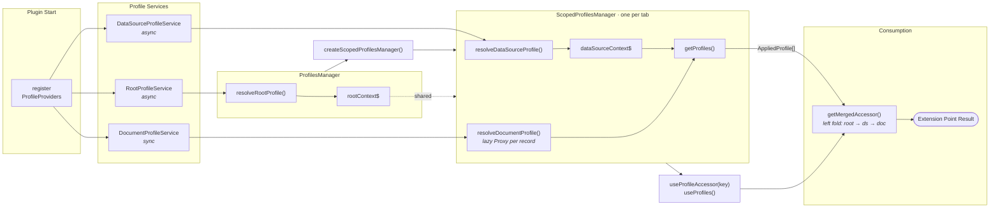

# Context Awareness Framework — Developer Guide

> Internal reference for maintainers of the framework itself.
> For consumer-facing guidance (registering profiles, extension points), see [`README.md`](./README.md).

## File map

```
context_awareness/
├── types.ts                  # Profile interface — all extension point signatures
├── composable_profile.ts     # ComposableProfile, AppliedProfile, getMergedAccessor
├── toolkit.ts                # ContextAwarenessToolkit — actions injected by the host
├── profile_service.ts        # BaseProfileService, ProfileService (sync), AsyncProfileService
├── profiles/                 # Per-level provider types and service subclasses
├── profiles_manager/         # ProfilesManager + ScopedProfilesManager
├── hooks/                    # React integration (useProfiles, useProfileAccessor, useRootProfile)
├── profile_providers/        # All profile provider implementations + registration
│   ├── common/               #   Solution-agnostic providers
│   ├── observability/        #   Observability providers
│   ├── security/             #   Security providers
│   └── example/              #   Example/reference providers
├── inspector/                # Profiles inspector panel (dev tooling)
└── utils/                    # Shared utilities
```

## Core type hierarchy

Understanding the type chain is critical. Here is the progression from the raw `Profile` interface to what Discover actually calls at runtime:

```
Profile                      (types.ts)
  The full extension point contract. Every key is a function signature.

  ↓ Partial<>

PartialProfile               (composable_profile.ts)
  A profile doesn't have to implement every extension point.

  ↓ wrap each value in ComposableAccessor<TPrev, TContext>

ComposableProfile<TProfile, TContext>
  What profile providers define. Each method receives (prev, { context, toolkit }).

  ↓ bind context via Proxy in BaseProfileService.getProfile()

AppliedProfile
  Context is bound; each method now only receives (prev).
  This is what ProfilesManager stores and passes to getMergedAccessor.
```

### `getMergedAccessor`

The merge is a left fold over an ordered `AppliedProfile[]` — `[root, dataSource, document]`:

```ts
profiles.reduce((nextAccessor, profile) => {
  const currentAccessor = profile[key];
  return currentAccessor ? currentAccessor(nextAccessor) : nextAccessor;
}, baseImpl);
```

Each profile's accessor receives the accumulated result of all previous levels as `prev`. The final return value is what Discover uses. This means:

- The **root** profile's `prev` is the base implementation.
- The **data source** profile's `prev` is the root's result (or base if root didn't implement the extension point).
- The **document** profile's `prev` is the data source's result (or whichever above level last implemented it).

## Profile services

Three `BaseProfileService` subclasses exist, one per context level:

| Service                    | Sync/Async | `resolve` runs                                    | Provider type          |
| -------------------------- | ---------- | ------------------------------------------------- | ---------------------- |
| `RootProfileService`       | Async      | Once on app init, re-runs on solution nav change  | `AsyncProfileProvider` |
| `DataSourceProfileService` | Async      | On data view or ES\|QL query change, before fetch | `AsyncProfileProvider` |
| `DocumentProfileService`   | Sync       | Per record, after fetch                           | `ProfileProvider`      |

`BaseProfileService` stores an ordered `providers[]` array. `resolve()` iterates providers sequentially and returns the context from the **first match** (`isMatch: true`). Order in the registration array directly controls priority.

### `getProfile()` and the Proxy

`BaseProfileService.getProfile(params)` looks up the provider by `profileId` from the context, then returns a `Proxy` over the provider's `ComposableProfile`. The Proxy intercepts property access: for each key, it returns a function `(prev) => accessor(prev, params)`, effectively binding the `ComposableAccessorParams` (context + toolkit). This produces an `AppliedProfile`.

## ProfilesManager / ScopedProfilesManager

### Lifecycle

```
Plugin start
  └─ createProfileServices()
       └─ new ProfilesManager(root, dataSource, document)
            │
            ├─ resolveRootProfile(solutionNavId)  ← called by useRootProfile hook
            │    └─ rootProfileService.resolve(params)
            │    └─ stores rootContext$ (BehaviorSubject)
            │
            └─ createScopedProfilesManager()  ← one per Discover tab / dashboard panel
                 └─ new ScopedProfilesManager(rootContext$, getRootProfile, ...)
                      │
                      ├─ resolveDataSourceProfile(params)
                      │    └─ dataSourceProfileService.resolve({...params, rootContext})
                      │    └─ stores dataSourceContext$ (BehaviorSubject)
                      │
                      ├─ resolveDocumentProfile(record)
                      │    └─ documentProfileService.resolve({...params, rootContext, dataSourceContext})
                      │    └─ returns Proxy'd record with lazy `.context` property
                      │
                      ├─ getProfiles({ record? })  → [rootApplied, dsApplied, docApplied]
                      └─ getProfiles$()             → Observable of the above
```

### Architecture diagram



### Key design decisions

- **Root context is shared** across all scoped managers via `BehaviorSubject`. When root re-resolves (e.g. solution nav change), all scoped managers see the update through their subscription.
- **Deduplication**: Both `ProfilesManager` and `ScopedProfilesManager` serialize resolution params and skip re-resolution when params haven't changed (`isEqual` check on serialized form).
- **Abort on supersede**: Async resolution uses an `AbortController`. If a new resolution starts before the previous completes, the previous is aborted (`AbortReason.REPLACED`). The aborted result is silently discarded.
- **Document context is lazy**: `resolveDocumentProfile` returns a `Proxy` over the record. The `context` property is resolved on first access, not eagerly. This avoids unnecessary work for records that are never expanded.
- **Error fallback**: If any resolution throws, the error is logged and the **default context** for that level is used. The app never crashes from a resolution failure.

## Registration pipeline

```
plugin.tsx  getDiscoverServicesWithProfiles()
  → import('./context_awareness/profile_providers')
  → createProfileProviderSharedServices(deps)       // async init of shared services
  → registerProfileProviders({...})
      → createRootProfileProviders(providerServices)       // returns ordered array
      → createDataSourceProfileProviders(providerServices)
      → createDocumentProfileProviders(providerServices)
      → registerEnabledProfileProviders() × 3              // filters + registers
```

`registerEnabledProfileProviders` filters out:

1. Providers with `isExperimental: true` unless their `profileId` is in `enabledExperimentalProfileIds` (from `kibana.yml`).
2. Providers with `restrictedToProductFeature` whose feature isn't active (serverless pricing tier check).

**Array order = resolution priority.** The first provider whose `resolve` returns `isMatch: true` wins.

## React integration

### `useRootProfile`

Subscribes to `chrome.getActiveSolutionNavId$()`. On each emission, calls `profilesManager.resolveRootProfile()`. Returns a discriminated union — either `{ rootProfileLoading: true }` or `{ rootProfileLoading: false, getDefaultAdHocDataViews, getDefaultEsqlQuery }`. Discover's entry point gates rendering on this.

### `useProfiles` / `useProfileAccessor`

`useProfiles` reads from `ScopedProfilesManager` (obtained via `useScopedServices()` React context). It subscribes to `getProfiles$()` and re-renders when the profile array reference changes.

`useProfileAccessor(key, options?)` wraps `getMergedAccessor` — it returns a function that, given a base implementation, produces the merged result for the specified extension point key. Components call this like:

```ts
const getCellRenderers = useProfileAccessor('getCellRenderers');
const cellRenderers = getCellRenderers(() => ({}))({ dataView, density, rowHeight });
```

For document-level extension points, pass `{ record }` in options to include the document profile:

```ts
const getDocViewer = useProfileAccessor('getDocViewer', { record });
```

### Non-React consumption

Outside React (e.g. state management utils), call `getMergedAccessor` directly with `scopedProfilesManager.getProfiles()`.

## Adding a new extension point

1. **Define the signature** in the `Profile` interface in `types.ts`. The method receives its params and returns a result. Define any new param/result interfaces in the same file.
2. **Decide which context levels** can implement it. If only root and data source (not document), define the method on `Profile` but not on `DocumentProfile` (document profiles use `Pick<Profile, ...>` to restrict available keys). Update the `Pick` in `document_profile.ts` if the document level should support it.
3. **Provide a base implementation** at the call site. When calling `getMergedAccessor` or `useProfileAccessor`, you pass a base fallback — this is what `prev` resolves to if no profile implements the extension point.
4. **Consume the accessor** in the appropriate Discover component via `useProfileAccessor(key)` (React) or `getMergedAccessor(profiles, key, base)` (non-React).
5. **Update `EXTENSION_POINTS_INVENTORY.md`** with a new section describing the extension point.

No changes to the framework internals (`composable_profile.ts`, `profile_service.ts`, `profiles_manager/`) are needed. The generic types propagate automatically from the `Profile` interface.

## Adding a new context level

This is rare and significant. Steps:

1. **Define the profile type, context, params, provider, and service** in a new file under `profiles/`, following the pattern of existing levels. Choose sync (`ProfileService`) or async (`AsyncProfileService`) based on whether resolution can block.
2. **Add the new service** to `ProfilesManager` or `ScopedProfilesManager` constructor depending on scope. Wire up resolution, context storage (`BehaviorSubject`), and abort handling.
3. **Update `getProfiles()`** to include the new level's `AppliedProfile` in the returned array. Position determines merge order.
4. **Update `registerProfileProviders`** to accept and register providers for the new level.
5. **Update `ContextualProfileLevel`** enum in `consts.ts`.
6. **Update EBT tracking** in `ScopedProfilesManager.trackActiveProfiles`.

## The toolkit

`ContextAwarenessToolkit` is injected by the host (Discover app or embeddable) and provides action callbacks (`openInNewTab`, `updateESQLQuery`, `addFilter`, etc.). It's passed through `ComposableAccessorParams` alongside `context`.

The toolkit is created per `ScopedProfilesManager` at creation time and is immutable for its lifetime.

`EMPTY_CONTEXT_AWARENESS_TOOLKIT` (no-op actions) is **only** used for the root profile accessors returned directly from `ProfilesManager.resolveRootProfile()` — specifically `getDefaultAdHocDataViews` and `getDefaultEsqlQuery`, which are consumed before any scoped manager exists (e.g. during app initialization). When the root profile is accessed through a `ScopedProfilesManager` (which is how all other extension points reach it), `createScopedProfilesManager` passes the real toolkit to `rootProfileService.getProfile()`, so root profile extension points receive a fully populated toolkit in that path.

When adding new toolkit actions:

1. Add the method to `ContextAwarenessToolkitActions` in `toolkit.ts`.
2. Provide the implementation when constructing the toolkit (in the runtime state setup code).
3. The action is then available to all extension point implementations via `params.toolkit.actions`.

## Error handling

- **Resolution errors** (thrown from `resolve`): Caught in `ProfilesManager` / `ScopedProfilesManager`. Logged via `logResolutionError`. The default context for that level is used as fallback.
- **Extension point errors** (thrown from profile methods): Not caught by the framework. These propagate to the calling component. Extension point implementations are responsible for their own error handling.
- **Abort handling**: Superseded async resolutions are silently discarded — the result is ignored if the abort signal has fired.

## EBT (Event-Based Telemetry)

`ScopedProfilesManager` tracks:

- **Profile resolution events**: Emitted per level when a profile resolves, via `trackContextualProfileResolvedEvent({ contextLevel, profileId })`.
- **Active profiles context**: Updated on data source resolution via `updateProfilesContextWith([rootId, dataSourceId])`, which sets the EBT context for all subsequent events in that session.

The `ScopedDiscoverEBTManager` is injected at scoped manager creation time.

## Testing

- **Unit tests** for `composable_profile.ts`, `profile_service.ts`, `profiles_manager.ts`, `record_has_context.ts`, `extend_profile_provider.ts`, `register_enabled_profile_providers.ts`, and hooks live alongside their source files.
- **Mocks** are in `__mocks__/`. Use these when testing components that depend on the framework.
- **When modifying framework internals**, run the existing test suite to catch regressions:
  ```
  yarn test:jest src/platform/plugins/shared/discover/public/context_awareness/
  ```
- **When adding extension points**, add consumption tests in the relevant Discover component tests, not in the framework tests. The framework tests verify the generic merging and resolution mechanics — extension point behavior is tested at the call site.

## Inspector

The `inspector/` directory implements a profiles inspector panel accessible from Discover's inspector drawer. It shows the currently resolved profiles for each context level. This is useful for debugging which profiles matched and in what order.
