# Discover extension points — quick reference

A concise, non-technical map of the Discover Profile extension points (what they change, when to use them, and what they return).

**Source types:** [`types.ts`](./types.ts)

## How to use this guide

- **"Changes"** = where the extension shows up in the UI or behavior.
- **"Use when"** = typical business scenario.
- **"Returns"** = what your implementation must return (shape/type).

---

## App wrapper — `getRenderAppWrapper`

**Changes:** Wraps the entire Discover app (React providers, banners).

**Use when:** You need profile-specific context, theme, or messaging.

**Returns:** `FunctionComponent<PropsWithChildren<{}>>`

**Screenshot:**
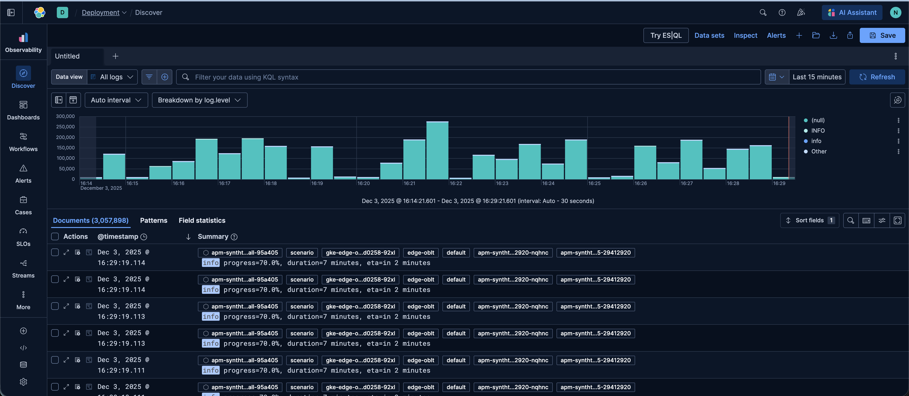

**Implementation examples:**
- [Security root profile](profile_providers/security/security_root_profile/profile.tsx)
- [Observability root profile](profile_providers/observability/observability_root_profile/profile.tsx)
- [Example root profile](profile_providers/example/example_root_profile/profile.tsx)

---

## Default app state — `getDefaultAppState`

**Changes:** Initial columns, row height, breakdown field, chart visibility.

**Use when:** Preconfigure defaults per team/use case.

**Returns:** `{ columns?, rowHeight?, breakdownField?, hideChart? }`

**Screenshot:**
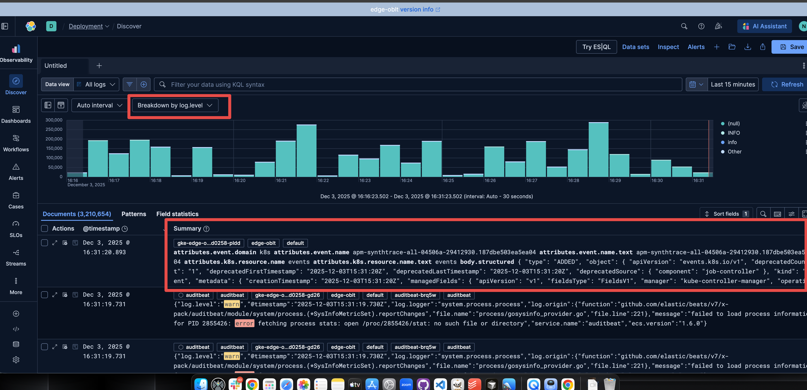

**Implementation examples:**
- [Logs data source profile](profile_providers/observability/logs_data_source_profile/accessors/get_default_app_state.ts)
- [Security data source profile](profile_providers/security/accessors/get_default_app_state.ts)

---

## Default ad‑hoc data views — `getDefaultAdHocDataViews`

**Changes:** Adds preset entries in the Data View picker (e.g., "All logs").

**Use when:** Onboarding; one‑click access to common sources.

**Returns:** `Array of DataViewSpec-like objects with stable id`

**Screenshot:**

**Implementation examples:**
- [Observability root profile](profile_providers/observability/observability_root_profile/accessors/get_default_ad_hoc_data_views.ts)
- [Classic nav root profile](profile_providers/common/classic_nav_root_profile/accessors/get_default_ad_hoc_data_views.ts)

---

## Chart

### Modify chart (Lens) — `getModifiedVisAttributes`

**Changes:** The chart's Lens attributes (type, metrics, styling).

**Use when:** Prefer a domain‑specific default visualization.

**Returns:** `TypedLensByValueInput['attributes']`

**Screenshot:**
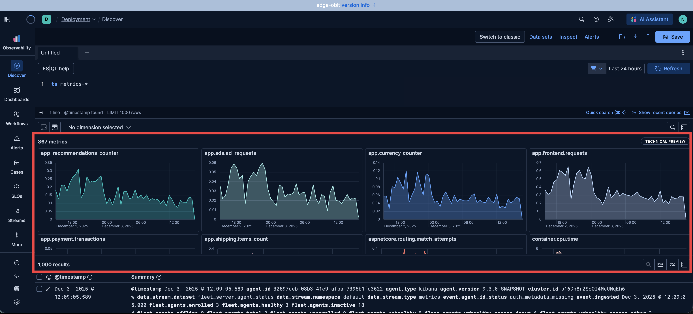

**Implementation examples:**
- [Metrics data source profile](profile_providers/common/metrics_data_source_profile/profile.ts)

---

### Chart section configuration — `getChartSectionConfiguration`

**Changes:** Chart area UI and behavior (custom component/actions).

**Use when:** Add buttons like "Open in new tab" or swap chart section.

**Returns:** `ChartSectionConfiguration` (can use `actions.openInNewTab`, `actions.updateESQLQuery`)

**Implementation examples:**
- [Metrics data source profile](profile_providers/common/metrics_data_source_profile/accessor/chart_section.tsx)
- [Traces data source profile](profile_providers/observability/traces_data_source_profile/accessors/chart_session.tsx)

---

## Data grid

### Cell renderers — `getCellRenderers`

**Changes:** Per‑field cell visuals (badges, formatting, links).

**Use when:** Make key fields readable/actionable at a glance.

**Returns:** `CustomCellRenderer` mapping (field name -> renderer)

**Screenshot:**
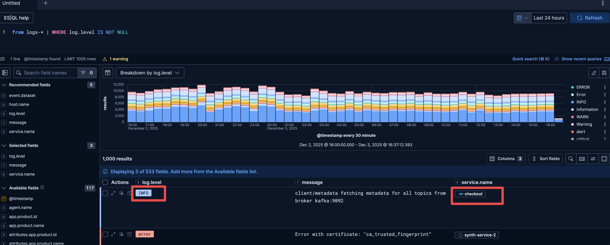

**Implementation examples:**
- [Logs data source profile](profile_providers/observability/logs_data_source_profile/accessors/get_cell_renderers.tsx)
- [Traces data source profile](profile_providers/observability/traces_data_source_profile/accessors/get_cell_renderers.tsx)
- [Patterns data source profile](profile_providers/common/patterns_data_source_profile/profile.ts)

---

### Row indicator — `getRowIndicatorProvider`

**Changes:** Row highlighting (e.g., red for errors).

**Use when:** Visually flag important records.

**Returns:** `UnifiedDataTableProps['getRowIndicator'] | undefined`

**Screenshot:**
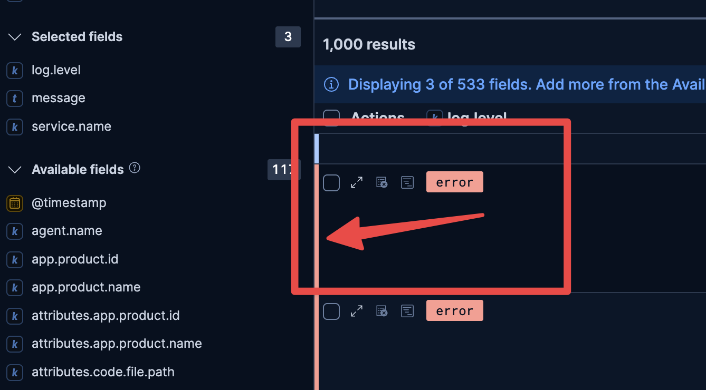

**Implementation examples:**
- [Logs data source profile](profile_providers/observability/logs_data_source_profile/accessors/get_row_indicator_provider.ts)

---

### Row leading controls — `getRowAdditionalLeadingControls`

**Changes:** Extra buttons at the start of each row.

**Use when:** Quick per‑row actions (open flyout, add filter).

**Returns:** `UnifiedDataTableProps['rowAdditionalLeadingControls'] | undefined`

**Screenshot:**
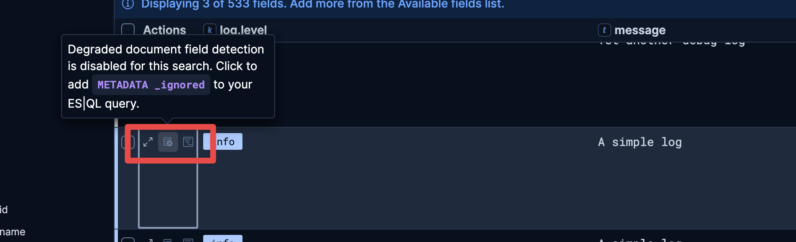

**Implementation examples:**
- [Logs data source profile](profile_providers/observability/logs_data_source_profile/accessors/get_row_additional_leading_controls.ts)

---

### Additional cell actions — `getAdditionalCellActions`

**Changes:** Extra actions in a cell's popover.

**Use when:** "Search for this value", "Open in investigation", etc.

**Returns:** `AdditionalCellAction[]` (`id`, `getDisplayName`, `getIconType`, `isCompatible?`, `execute`)

**Screenshot:**
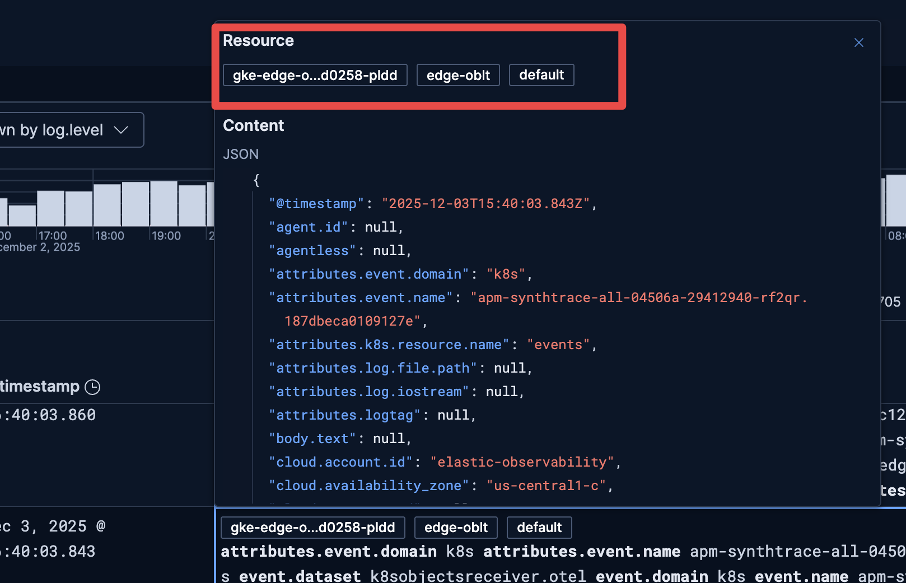

**Implementation examples:**
- See [types.ts](./types.ts) for the `AdditionalCellAction` interface definition

---

### Pagination — `getPaginationConfig`

**Changes:** How results load: `'singlePage' | 'multiPage' | 'infinite'`.

**Use when:** Infinite scroll for exploration; multi‑page for control.

**Returns:** `{ paginationMode }`

**Screenshot:**
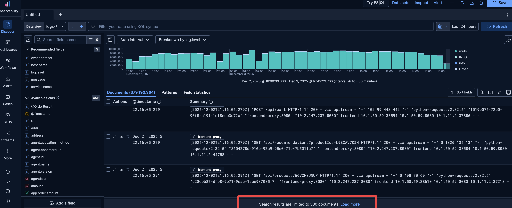

**Implementation examples:**
- [Logs data source profile](profile_providers/observability/logs_data_source_profile/accessors/get_pagination_config.ts)

---

## Document viewer (flyout)

### Doc viewer — `getDocViewer`

**Changes:** Flyout title and tabs (add/modify).

**Use when:** Add "Related events", "Stack trace", "Analysis".

**Returns:** `{ title?, docViewsRegistry(prev) => DocViewsRegistry }`

**Screenshot:**

**Implementation examples:**
- [Log document profile](profile_providers/observability/log_document_profile/accessors/get_doc_viewer.tsx)
- [Traces document profile](profile_providers/observability/traces_document_profile/document_profile/accessors/doc_viewer.tsx)
- [Observability document profile](profile_providers/observability/observability_document_profile/document_profile/accessors/doc_viewer.tsx)
- [Observability root profile](profile_providers/observability/observability_root_profile/accessors/get_doc_viewer.tsx)

---

## Top nav

### App menu — `getAppMenu`

**Changes:** Up to two custom top‑nav actions.

**Use when:** Export, open custom app, open new tab, alerting shortcuts.

**Returns:** `{ appMenuRegistry(prev) => AppMenuRegistry }` (params include `dataView`, `adHocDataViews`, `isEsqlMode`, `authorizedRuleTypeIds`)

**Screenshot:**
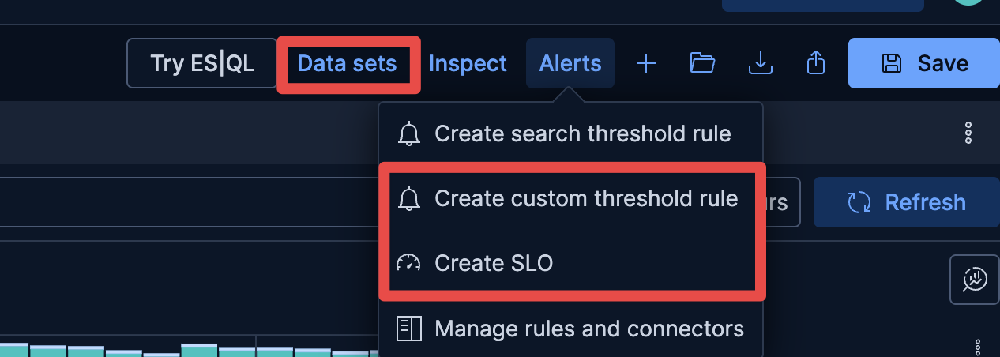

**Implementation examples:**
- [Observability root profile](profile_providers/observability/observability_root_profile/accessors/get_app_menu.tsx)

---

## Columns

### Columns configuration — `getColumnsConfiguration`

**Changes:** Header labels, icons, and metadata for columns.

**Use when:** Rename headers, add icons, improve tooltips.

**Returns:** `CustomGridColumnsConfiguration`

**Screenshot:**
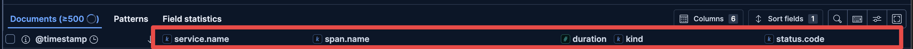

**Implementation examples:**
- [Logs data source profile](profile_providers/observability/logs_data_source_profile/accessors/get_columns_configuration.tsx)
- [Traces data source profile](profile_providers/observability/traces_data_source_profile/accessors/get_columns_configuration.tsx)

---

## Field list

### Recommended fields — `getRecommendedFields`

**Changes:** "Recommended" section in the Field List.

**Use when:** Surface domain‑critical fields.

**Returns:** `{ recommendedFields: string[] }`

**Screenshot:**
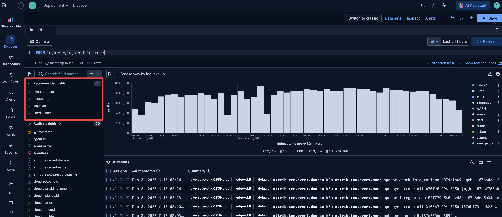

**Implementation examples:**
- [Logs data source profile](profile_providers/observability/logs_data_source_profile/accessors/get_recommended_fields.ts)
