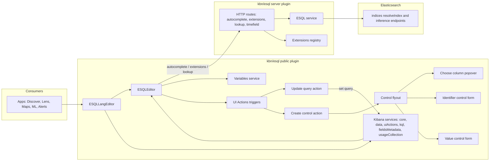
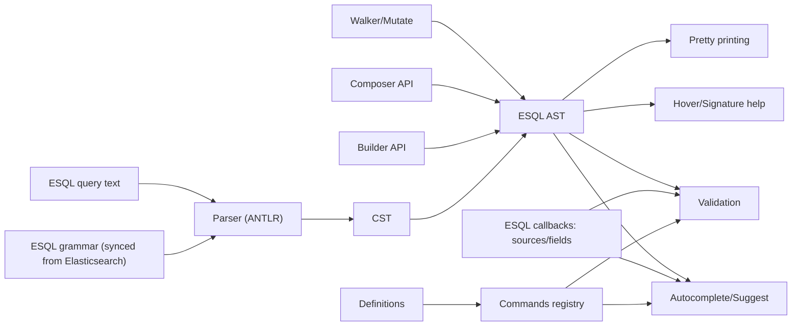

# ES|QL (@kbn/esql)

Shared plugin providing the ES|QL editor, triggers, and server-side extensions/auto-complete APIs.

## Public API
- Main component: `ESQLLangEditor` (`public/create_editor.tsx`)
- Entry point: `public/index.ts`
- Use when embedding ES|QL in apps (Lens, Maps, ML, Alerts, Unified Search).

## Server API
Server-side routes and extensions registry live under `server/`.
Key routes include:
- `/internal/esql/autocomplete/join/indices`
- `/internal/esql/autocomplete/timeseries/indices`
- `/internal/esql/autocomplete/inference_endpoints/{taskType}`
- `/internal/esql_registry/extensions/{query}`

Extensions registry:
- Solution-scoped (es, oblt, security, workplaceai).
- Only returns indices that exist in the instance.

## Key concepts
- ES|QL editor is UI-only; data fetching is owned by the consuming app.
- Triggers for controls and query updates live in `public/triggers/`.
- Registry is the integration point for recommended queries and fields.

## Data flow and components

## Change guidance
- Add new commands using `ADD_COMMAND_GUIDE.md`.
- Grammar updates come from Elasticsearch; keep changes isolated and well-tested.
- Respect solution scoping when registering extensions.

## Testing
- Unit tests: `jest.config.js`
- Integration tests: `jest.integration.config.js`
- Tests live in `public/**`, `server/**`, and `server/integration_tests/**`.
- Example: `yarn test:jest src/platform/plugins/shared/esql`
- If a verifier sub-agent exists (e.g., `kibana-verifier` or `verifier`), run it and include its findings in the test notes.

## Escalation
If changes affect editor integrations or extension registry behavior, coordinate with the owning solution teams.

## References
- `src/platform/plugins/shared/esql/README.md`
- `src/platform/plugins/shared/esql/server/README.md`
- `src/platform/plugins/shared/esql/ADD_COMMAND_GUIDE.md`
- `src/platform/packages/shared/kbn-esql-language/README.md`
- `src/platform/packages/shared/kbn-esql-language/src/parser/README.md`
- `src/platform/packages/shared/kbn-esql-language/src/language/README.md`
- `src/platform/packages/shared/kbn-esql-language/src/commands/README.md`
- `src/platform/packages/shared/kbn-esql-language/src/composer/README.md`

## kbn-esql-language package guide
Package location: `src/platform/packages/shared/kbn-esql-language`

This package owns ES|QL parsing, AST utilities, and editor-facing language features
used by the ES|QL plugin and other consumers.

### What lives here
- Parser (ANTLR-based) → CST/AST + syntax validation, highlighting metadata.
- AST utilities: builder, walker, mutation, and pretty-printing.
- Language features: validation, autocomplete, hover, signature help.
- Commands: definitions and registry for ES|QL commands.
- Composer API: safe, parameterized ES|QL builder for app code.

### kbn-esql-language data flow

### Key behavior
- Parser produces partial AST even with invalid queries; `withFormatting` attaches
  comments/whitespace to nodes for editor features.
- Validation can degrade gracefully when callbacks (sources/fields) are missing;
  keep this in mind when wiring UI services.
- Autocomplete works best-effort on invalid queries and may return empty results
  when correction fails.
- Composer prefers tagged templates with parameter holes to avoid injection.

### Local demos
- ES|QL AST Inspector: `yarn storybook esql_ast_inspector`
- Kibana examples: `yarn start --run-examples` (navigate to ES|QL AST Inspector)

### Testing
- Whole package: `yarn test:jest src/platform/packages/shared/kbn-esql-language/`
- Targeted: `yarn jest:tests src/platform/packages/shared/kbn-esql-language/path/to/test/file`
- Validation tests update `src/validation/esql_validation_meta_tests.json` and should
  be re-run when they change.
