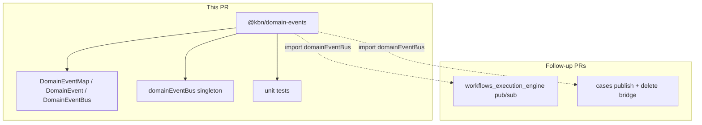

# Introduce `@kbn/domain-events` package

## Scope (confirmed)

- **In scope:** new package only (`@kbn/domain-events`)
- **Out of scope:** platform plugin, workflows engine subscriber/publisher, Cases migration, `emitEvent` wrapper, any edits to existing plugins

The [RFC](src/platform/plugins/shared/workflows_execution_engine/docs/rfc_shared_event_bus.md) describes the full end-state; this PR delivers the **neutral contract + implementation** that future consumers will depend on.



---

## 1. Scaffold the package

From repo root:

```bash
node scripts/generate package @kbn/domain-events \
  --owner @elastic/workflows-eng \
  --type server \
  --group platform \
  --visibility shared
```

This creates [`src/platform/packages/shared/kbn-domain-events/`](src/platform/packages/shared/kbn-domain-events/) with `kibana.jsonc` (`type: "shared-server"`), `package.json`, `tsconfig.json`, `jest.config.js`, and a stub `index.ts`.

Then run `yarn kbn bootstrap`.

**Reference packages for structure:** [`kbn-sse-utils`](src/platform/packages/shared/kbn-sse-utils/) (small API surface), [`kbn-io-ts-utils`](src/platform/packages/shared/kbn-io-ts-utils/) (`src/` submodules + co-located tests).

**`tsconfig.json` `kbn_references`:** add `@kbn/core` (for `Logger`, `KibanaRequest`) and `@kbn/zod` (for payload schemas).

---

## 2. Public API (match RFC contract)

**Multi-entry import model** — domain events are imported by subpath (same pattern as `@kbn/zod/v4`). The package root is for the bus only; `events/index.ts` is for the aggregated map only (no domain re-exports).

| Consumer need | Import from |
|---|---|
| Event type, schema, guard for a domain | `@kbn/domain-events/events/cases`, `@kbn/domain-events/events/workflows`, … |
| `DomainEventMap`, `DomainEventType`, `domainEventPayloadSchemas` | `@kbn/domain-events/events` |
| `domainEventBus` singleton + envelope types | `@kbn/domain-events` |

```ts
// publisher (Cases — future)
import { domainEventBus } from '@kbn/domain-events';
import { CASE_CREATED_EVENT_TYPE, isCaseCreatedPayload } from '@kbn/domain-events/events/cases';

// subscriber needing payload shape or schema by event type (engine — future)
import { domainEventPayloadSchemas } from '@kbn/domain-events/events';
import type { DomainEventMap, DomainEventType, EventPayload } from '@kbn/domain-events/events';

type FinishedPayload = EventPayload<'workflows.workflowFinished'>; // same as DomainEventMap['workflows.workflowFinished']
const result = domainEventPayloadSchemas['workflows.workflowFinished'].safeParse(unknownPayload);
```

Physical layout resolves subpaths via folder structure (`events/cases/index.ts` → `@kbn/domain-events/events/cases`), matching how `@kbn/zod/v4` maps to `kbn-zod/v4/`.

### Event types — federated by domain (`src/events/`)

Event payloads and type discriminators live in **one file per event**, grouped under domain folders. Filenames are `snake_case`; event type strings keep the RFC `domain.action` camelCase convention (e.g. `cases.caseCreated`).

```
src/events/
  index.ts                          # DomainEventMap + domainEventPayloadSchemas (no domain re-exports)
  cases/
    index.ts                        # domain public API: constants, schemas, guards, CasesDomainEventMap
    case_created.ts
    case_updated.ts
  workflows/
    index.ts                        # domain public API: WorkflowsDomainEventMap + per-event exports
    workflow_started.ts
    workflow_finished.ts
    step_started.ts
    step_finished.ts
```

**Per-event file pattern** — each file exports exactly three runtime artifacts plus derived types:

| Export | Role |
|---|---|
| **Event type** | `CASE_CREATED_EVENT_TYPE` — stable `domain.action` string constant |
| **Payload schema** | `caseCreatedPayloadSchema` — Zod object (`.strict()`), single source of truth for shape |
| **Guard** | `isCaseCreatedPayload` — runtime type guard via `schema.safeParse(value).success` |

```ts
// src/events/cases/case_created.ts
import { z } from '@kbn/zod/v4';

/** 1. Event type */
export const CASE_CREATED_EVENT_TYPE = 'cases.caseCreated' as const;

/** 2. Payload schema */
export const caseCreatedPayloadSchema = z
  .object({
    caseId: z.string(),
    owner: z.string(),
    title: z.string(),
  })
  .strict();

export type CaseCreatedPayload = z.infer<typeof caseCreatedPayloadSchema>;

/** 3. Guard */
export const isCaseCreatedPayload = (value: unknown): value is CaseCreatedPayload =>
  caseCreatedPayloadSchema.safeParse(value).success;

/** Map fragment — payload type derived from schema, not duplicated */
export interface CaseCreatedDomainEventMap {
  [CASE_CREATED_EVENT_TYPE]: CaseCreatedPayload;
}
```

Conventions:
- Schema names: `{eventName}PayloadSchema` (camelCase, matches filename).
- Guard names: `is{EventName}Payload` (e.g. `isWorkflowFinishedPayload`).
- Use `z.object({ ... }).strict()` so unknown fields are rejected (same rule as [workflows trigger `eventSchema`](src/platform/plugins/shared/workflows_extensions/common/trigger_registry/types.ts)).
- Payload `type` is always `z.infer<typeof …PayloadSchema>` — never a hand-written duplicate interface.
- Guards validate **payload** only; event envelope (`type` + `payload` + optional `request`) is the publisher's responsibility. Subscribers that receive untrusted input can check `event.type === CASE_CREATED_EVENT_TYPE && isCaseCreatedPayload(event.payload)`.

**Domain index** — intersect fragments for that domain:

```ts
// src/events/cases/index.ts
import type { CaseCreatedDomainEventMap } from './case_created';
import type { CaseUpdatedDomainEventMap } from './case_updated';

export type CasesDomainEventMap = CaseCreatedDomainEventMap & CaseUpdatedDomainEventMap;

type CasesDomainEventMapSchemas = {
  [K in keyof CasesDomainEventMap]: z.ZodType<CasesDomainEventMap[K]>;
};

export {
  CASE_CREATED_EVENT_TYPE,
  caseCreatedPayloadSchema,
  isCaseCreatedPayload,
} from './case_created';
export type { CaseCreatedPayload } from './case_created';
// ... re-export type constant, schema, guard, and payload type for each event

/** Runtime schema map for this domain — keys are event type strings */
export const casesEventPayloadSchemas = {
  [CASE_CREATED_EVENT_TYPE]: caseCreatedPayloadSchema,
  [CASE_UPDATED_EVENT_TYPE]: caseUpdatedPayloadSchema,
} as const satisfies CasesDomainEventMapSchemas;
```

**Events index** — aggregate type map + runtime schema object; **do not** re-export domain modules:

```ts
// src/events/index.ts
import type { z } from '@kbn/zod/v4';
import type { CasesDomainEventMap } from './cases';
import type { WorkflowsDomainEventMap } from './workflows';
import { casesEventPayloadSchemas } from './cases';
import { workflowsEventPayloadSchemas } from './workflows';

/** Type-level map: event type → payload shape */
export type DomainEventMap = CasesDomainEventMap & WorkflowsDomainEventMap;

export type DomainEventType = keyof DomainEventMap;

/** Convenience alias for payload lookup by event type */
export type EventPayload<T extends DomainEventType> = DomainEventMap[T];

/**
 * Runtime object map: event type → Zod payload schema.
 * Consumers use this to validate or introspect payload shape by event type at runtime.
 */
export const domainEventPayloadSchemas = {
  ...casesEventPayloadSchemas,
  ...workflowsEventPayloadSchemas,
} as const satisfies DomainEventPayloadSchemas;

type DomainEventPayloadSchemas = {
  [K in DomainEventType]: z.ZodType<DomainEventMap[K]>;
};
```

**Dual-map model:**

| Map | Kind | Lookup | Use |
|---|---|---|---|
| `DomainEventMap` / `EventPayload<T>` | TypeScript (compile-time) | `EventPayload<'cases.caseCreated'>` | Typing handlers, publishers, generic utilities |
| `domainEventPayloadSchemas` | Runtime object | `domainEventPayloadSchemas[event.type]` | Validate unknown payloads, trigger matching, tooling |

The `satisfies DomainEventPayloadSchemas` constraint keeps the runtime map keys and Zod outputs aligned with `DomainEventMap` — a drift between schema and type map fails typecheck.

Consumers that need case-specific constants/schemas import `@kbn/domain-events/events/cases`. Consumers that need cross-domain lookup by event type import `@kbn/domain-events/events`.

**Initial event files (RFC lifecycle set):**

| File | Event type constant | Payload |
|---|---|---|
| `cases/case_created.ts` | `cases.caseCreated` | `{ caseId, owner, title }` |
| `cases/case_updated.ts` | `cases.caseUpdated` | `{ caseId, updatedFields }` |
| `workflows/workflow_started.ts` | `workflows.workflowStarted` | `{ spaceId, workflowId, workflowRunId }` |
| `workflows/workflow_finished.ts` | `workflows.workflowFinished` | `{ spaceId, workflowId, workflowRunId, status }` |
| `workflows/step_started.ts` | `workflows.stepStarted` | `{ spaceId, workflowRunId, stepId, stepType }` |
| `workflows/step_finished.ts` | `workflows.stepFinished` | `{ spaceId, workflowRunId, stepId, stepType, status: 'completed' \| 'failed' }` |

Each row also exports `{name}PayloadSchema` and `is{Name}Payload`.

Adding a new event = add one file under the domain folder + wire it into that domain's `index.ts` (map fragment, re-exports, and one entry in `{domain}EventPayloadSchemas`). Update `events/index.ts` only when adding a **new domain** (one new spread + type intersection).

### Bus contract — `src/types.ts` + package root `index.ts`

Generic bus types import the aggregated map from `./events` (internal); package root re-exports bus surface only:

```ts
// src/types.ts
import type { KibanaRequest } from '@kbn/core/server';
import type { DomainEventMap, DomainEventType } from './events';

export type { DomainEventMap, DomainEventType } from './events';

export interface DomainEvent<T extends DomainEventType = DomainEventType> {
  type: T;
  payload: DomainEventMap[T];
  request?: KibanaRequest;
}

export interface DomainEventBus {
  publish<T extends DomainEventType>(event: DomainEvent<T>): void;
  subscribe<T extends DomainEventType>(
    type: T,
    handler: (event: DomainEvent<T>) => void | Promise<void>
  ): () => void;
}
```

```ts
// index.ts (package root) — singleton + bus types only; no domain event re-exports
export { domainEventBus } from './src/domain_event_bus_impl';
export type { DomainEvent, DomainEventBus } from './src/types';
```

Notes:
- `request` lives **on the event** (RFC shape), not as a separate publish arg (differs from alerting_v2's `TContext` pattern).
- Publishers import event constants from `@kbn/domain-events/events/{domain}` — no magic strings at call sites.
- `DomainEventMap`, `EventPayload`, and `domainEventPayloadSchemas` are **not** re-exported from package root; import from `@kbn/domain-events/events` when needed.
- The bus does **not** validate payloads on `publish` in this PR; schemas and guards are exported for consumers (engine trigger matching, bridges, tests). Optional bus-side validation is a follow-up.
- New domains get a new folder under `src/events/` (e.g. `alerting/`) with their own `index.ts` fragment; root `events/index.ts` adds one intersection line.

### Singleton — `src/domain_event_bus_impl.ts`

```ts
class DomainEventBusImpl implements DomainEventBus { ... }

/** One bus per Kibana Node process; all importers share this instance. */
export const domainEventBus = new DomainEventBusImpl();
```

Consumers import `domainEventBus` directly — no factory call, no platform plugin, no plugin dependency injection.

---

## 3. Implementation — `src/domain_event_bus_impl.ts`

Implement `DomainEventBus` using patterns proven in [`alerting_v2/server/lib/events/event_bus/event_bus.ts`](x-pack/platform/plugins/shared/alerting_v2/server/lib/events/event_bus/event_bus.ts), adapted to the RFC API:

| Behavior | Approach |
|---|---|
| Non-blocking publish | Dispatch handlers via `setImmediate` so `publish()` returns before handler work runs |
| Handler isolation | Each handler wrapped in try/catch; log via injected `Logger`; never throw to publisher or siblings |
| Async handlers | `await` handler if it returns a Promise; catch rejections |
| Reserved types | Reject `error`, `newListener`, `removeListener` (Node EventEmitter semantics) |
| Emitter safety | `EventEmitterAsyncResource` with `captureRejections: true` + permanent `'error'` listener |
| Unsubscribe | `subscribe` returns `() => void`; idempotent; removes only the wrapped handler |
| Validation | Refuse publish when `type` is missing/non-string; log at debug/warn |

**Intentional deviation from RFC prose:** the RFC describes synchronous `EventEmitter` invocation (and documents that as a known limitation). The alerting_v2 implementation already solves the "publisher must not block on subscriber I/O" requirement with `setImmediate`. Use async dispatch — it matches RFC *intent* (fire-and-forget) better than literal sync emit.

**Do not copy** alerting_v2's Inversify wiring, `TContext` extra args, or `Subscription` object — keep the RFC's simpler `(event) => handler` + `() => unsubscribe` API.

---

## 4. Unit tests — `src/domain_event_bus_impl.test.ts`

Port the test scenarios from [`event_bus.test.ts`](x-pack/platform/plugins/shared/alerting_v2/server/lib/events/event_bus/event_bus.test.ts), using a local test `DomainEventMap` (or `jest` module mock) so tests don't depend on production event types:

- publish/subscribe: matching type invoked, other types ignored, multiple handlers per type
- `publish()` returns before handlers run (`flushAsync` helper with double `setImmediate`)
- error isolation: sync throw and rejected Promise don't stop siblings
- unsubscribe: stops future invocations, doesn't affect siblings; double-unsubscribe is no-op
- reserved event types refused
- invalid events (missing `type`) refused without throwing
- async handlers awaited without surfacing errors

**Event schema/guard tests** — `src/events/cases/cases.test.ts` (one test file per domain):

- guard accepts valid payload, rejects missing/extra/wrong-type fields
- `domainEventPayloadSchemas[type]` validates the same payloads as the per-event guard
- `satisfies` alignment: each schema key exists in `DomainEventMap` and `z.infer<schema>` matches `DomainEventMap[key]`

Run:

```bash
node scripts/jest src/platform/packages/shared/kbn-domain-events
node scripts/check.js --scope=local
```

---

## 5. What we explicitly do NOT touch

| Area | Reason |
|---|---|
| [`workflows_execution_engine`](src/platform/plugins/shared/workflows_execution_engine/) | Follow-up: subscriber + lifecycle publisher |
| [`cases/server/events/event_bus.ts`](x-pack/platform/plugins/shared/cases/server/events/event_bus.ts) + [`event_bridge.ts`](x-pack/platform/plugins/shared/cases/server/workflows/triggers/event_bridge.ts) | Follow-up: migrate to shared bus |
| [`workflows_extensions`](src/platform/plugins/shared/workflows_extensions/) `emitEvent` | Follow-up: optional wrapper over `publish` |
| [`alerting_v2`](x-pack/platform/plugins/shared/alerting_v2/) private bus | Separate effort; reference only |

---

## 6. Follow-up (not this PR)

1. **Engine integration** — `import { domainEventBus } from '@kbn/domain-events'`; subscribe to inbound domain events (trigger registry), publish lifecycle events after repository writes.
2. **Cases migration** — replace private bus + bridge with `domainEventBus.publish(...)`.
3. **Event registry governance** — process for teams adding a new file under `src/events/{domain}/` (RFC open question).

---

## File layout (final)

```
src/platform/packages/shared/kbn-domain-events/
  kibana.jsonc
  package.json
  tsconfig.json
  jest.config.js
  index.ts                      # domainEventBus singleton + DomainEvent / DomainEventBus types
  src/
    types.ts                    # DomainEvent, DomainEventBus (imports map from events/)
    events/
      index.ts                  # DomainEventMap, EventPayload, domainEventPayloadSchemas
      cases/
        index.ts                # subpath entry @kbn/domain-events/events/cases
        case_created.ts
        case_updated.ts
      workflows/
        index.ts                # subpath entry @kbn/domain-events/events/workflows
        workflow_started.ts
        workflow_finished.ts
        step_started.ts
        step_finished.ts
    domain_event_bus_impl.ts    # DomainEventBusImpl + exported domainEventBus singleton
    domain_event_bus_impl.test.ts
```
