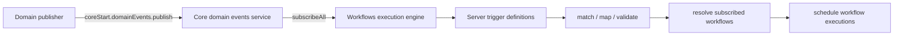

# RFC: Workflow Triggers From Domain Events

> Workflow triggers consume Core domain events, map them to workflow trigger payloads, resolve subscribed workflows, and schedule matching executions. This document covers workflow-specific wiring; the underlying bus is described in [Core Domain Events Service](./rfc_shared_event_bus.md).

**Status:** Implemented / evolving
**Authors:** Workflows Engine Team
**Last updated:** 2026-06-25

## Summary

- **What:** The workflows execution engine subscribes to domain events and turns matching events into workflow trigger executions.
- **Where:** Trigger definitions live in plugins such as Cases; runtime matching and scheduling lives in `src/platform/plugins/shared/workflows_execution_engine/server/trigger_events`.
- **How:** Server trigger definitions declare a `domainEventType`, optional `shouldHandleDomainEvent`, and optional `mapEvent`. The engine subscribes with `core.domainEvents.subscribeAll` and dispatches each event to matching trigger definitions.
- **Why:** Domain publishers do not call workflows APIs directly. They publish domain facts, and workflows decide which trigger definitions and workflow subscriptions apply.

## Relationship To The Event Bus

The Core domain-events service provides only publish/subscribe. It does not know about workflows, trigger IDs, KQL conditions, workflow subscriptions, event-chain depth, or scheduling.

Workflow trigger handling adds those workflow-specific concerns on top:



## Setup-Time Subscription

During plugin setup, the workflows execution engine subscribes to every domain event:

```ts
core.domainEvents.subscribeAll((event) =>
  this.triggerEventHandler?.handleDomainEvent(event)
);
```

The subscription must be registered in `setup()` so handlers are installed before runtime events are published. `triggerEventHandler` is created later in `start()`, so the setup-time callback delegates through an optional field.

## Server Trigger Definitions

A workflow trigger definition connects a workflow trigger ID to a domain event type.

```ts
export const commentsAddedTriggerDefinition = createServerTriggerDefinition({
  ...commentsAddedTriggerCommonDefinition,
  domainEventType: COMMENTS_ADDED_EVENT_TYPE,
});
```

Fields used by domain-event-backed triggers:

| Field | Role |
| --- | --- |
| `id` | Workflow trigger ID used by workflow definitions, for example `cases.commentsAdded`. |
| `domainEventType` | Domain event type the trigger listens to, for example `cases.commentsAdded`. |
| `eventSchema` | Trigger payload schema exposed to workflow authors and used for validation. |
| `shouldHandleDomainEvent` | Optional predicate for deciding whether a concrete domain event instance should fire this trigger. |
| `mapEvent` | Optional mapper from domain event payload to trigger payload. |

When omitted, every event of `domainEventType` is a candidate. When present, the
trigger only fires for events that pass the predicate. For example,
`workflows.failed` listens to `workflows.terminated`, but matches only
terminated events whose payload has `status === 'failed'`; completed, cancelled,
timed-out, and skipped terminal events are ignored by that trigger.

## Runtime Flow

`TriggerEventHandler.handleDomainEvent` processes each event as follows:

1. Find trigger definitions whose `domainEventType` equals `event.type`.
2. Apply `shouldHandleDomainEvent` when a trigger has one.
3. Build the trigger payload with `trigger.mapEvent?.(event) ?? event.payload`.
4. Resolve the space from the event request.
5. Resolve or continue event-chain context for recursion/depth control.
6. Validate the trigger payload against the trigger schema.
7. Resolve workflow subscriptions for the trigger ID and space, including KQL conditions.
8. Schedule matching workflow executions.
9. Report trigger-event dispatch telemetry.

This keeps the event bus generic while preserving the existing workflow trigger semantics.

## Cases Trigger Definitions

Cases workflow triggers are backed directly by domain event constants:

| Workflow trigger | Domain event | Mapping notes |
| --- | --- | --- |
| `cases.caseCreated` | `CASE_CREATED_EVENT_TYPE` | Uses domain payload as trigger payload. |
| `cases.caseUpdated` | `CASE_UPDATED_EVENT_TYPE` | Uses domain payload as trigger payload. |
| `cases.caseStatusUpdated` | `CASE_STATUS_CHANGED_EVENT_TYPE` | Uses dedicated status-change domain event. |
| `cases.attachmentsAdded` | `ATTACHMENTS_ADDED_EVENT_TYPE` | Maps legacy attachment type `user` to `comment`. |
| `cases.commentsAdded` | `COMMENTS_ADDED_EVENT_TYPE` | Uses dedicated comments domain event. |

`cases.commentsAdded` no longer filters `cases.attachmentsAdded`; comments are now a first-class domain event with payload `{ caseId, owner, commentIds }`.

## Cases Domain Event Publishers

Cases publishes through `DomainEventsServiceStart`, usually via `CasesClientArgs.domainEvents`.

### Case Creation

Case bulk create publishes `cases.caseCreated` once per created case after the case response is decoded.

```ts
clientArgs.domainEvents.publish({
  type: 'cases.caseCreated',
  payload: {
    caseId: createdCase.id,
    owner: createdCase.owner,
  },
  request: clientArgs.request,
});
```

### Case Updates And Status Changes

`publishCaseUpdatedDomainEvents` publishes `cases.caseUpdated` for every case update. If the update includes a real status transition, it also publishes `cases.caseStatusChanged`.

```ts
domainEvents.publish({
  type: CASE_UPDATED_EVENT_TYPE,
  payload,
  request,
});

if (caseStatusChangedPayload) {
  domainEvents.publish({
    type: CASE_STATUS_CHANGED_EVENT_TYPE,
    payload: caseStatusChangedPayload,
    request,
  });
}
```

### Attachments And Comments

Attachment creation publishes `cases.attachmentsAdded`. Legacy `user` attachments are normalized to `comment` for the attachment event payload.

When the normalized attachment type is `comment`, Cases also publishes `cases.commentsAdded`.

```ts
clientArgs.domainEvents.publish({
  type: ATTACHMENTS_ADDED_EVENT_TYPE,
  payload: {
    caseId: updatedCase.id,
    attachmentIds,
    attachmentType: enhancedAttachmentType,
    owner: updatedCase.owner,
  },
  request: clientArgs.request,
});

if (enhancedAttachmentType === 'comment') {
  clientArgs.domainEvents.publish({
    type: COMMENTS_ADDED_EVENT_TYPE,
    payload: {
      caseId: updatedCase.id,
      owner: updatedCase.owner,
      commentIds: attachmentIds,
    },
    request: clientArgs.request,
  });
}
```

## Workflow Lifecycle Domain Events

The workflows execution engine is also a domain-event publisher. It publishes lifecycle facts through `coreStart.domainEvents.publish` after execution state changes.

Current publish paths:

- `workflows.workflowStarted` is published when a workflow execution starts.
- `workflows.terminated` is published once when a non-test workflow reaches a terminal status.

The event catalog also defines `workflows.stepStarted` and `workflows.stepFinished`; those are available catalog entries for step lifecycle instrumentation, but this document should not imply they are already emitted by the current execution path unless the corresponding publisher is added.

## Trigger And Event Catalog

### Cases

| Domain event | Domain payload | Workflow trigger payload |
| --- | --- | --- |
| `cases.caseCreated` | `{ caseId, owner }` | Same as domain payload. |
| `cases.caseUpdated` | `{ caseId, owner, updatedFields? }` | Same as domain payload. |
| `cases.caseStatusChanged` | `{ caseId, owner, previousStatus, status }` | Same as domain payload. |
| `cases.attachmentsAdded` | `{ caseId, owner, attachmentIds, attachmentType }` | Same fields, with normalized `attachmentType`. |
| `cases.commentsAdded` | `{ caseId, owner, commentIds }` | Same as domain payload. |

### Workflows Lifecycle

| Domain event | Payload summary | Current publisher state |
| --- | --- | --- |
| `workflows.workflowStarted` | `{ spaceId, workflowId, workflowRunId }` | Published by execution runtime. |
| `workflows.terminated` | `{ status, workflow, execution, error }` | Published by execution runtime for non-test terminal executions. |
| `workflows.stepStarted` | `{ spaceId, workflowRunId, stepId, stepType }` | Catalog entry; publisher pending. |
| `workflows.stepFinished` | `{ spaceId, workflowRunId, stepId, stepType, status }` | Catalog entry; publisher pending. |

## Operational Notes

- Domain event handlers run asynchronously, but scheduling workflows still consumes resources on the publishing node.
- Domain events are node-local. If Task Manager runs a workflow on node B, lifecycle event handlers run on node B, not on the node that accepted the original HTTP request.
- Workflow trigger handlers should use stable IDs from payloads and durable storage instead of relying on in-memory state from another node.
- Work that must be retried or survive process failure should be scheduled through Task Manager.

## Migration State

Completed or in progress:

- Workflows execution engine subscribes to all domain events during setup.
- `TriggerEventHandler` routes matching domain events through trigger definitions.
- Cases trigger definitions use `domainEventType` constants from `@kbn/domain-events/events/cases`.
- Cases publishes create/update/status/attachment/comment domain events.
- Workflows publishes workflow started and terminated lifecycle events.

Remaining considerations:

- Remove stale private Cases bus code once all old call sites and tests are gone.
- Decide whether `workflows.stepStarted` and `workflows.stepFinished` should be emitted by the current runtime manager or remain catalog-only until a concrete consumer lands.
- Keep `workflows_extensions.emitEvent` compatibility only as long as existing callers need it; new integrations should prefer domain events and trigger definitions.
