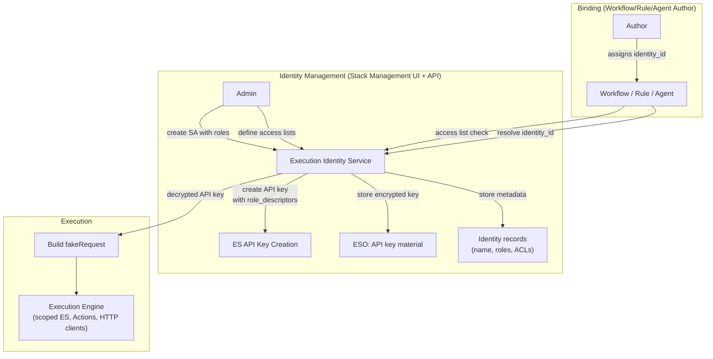

# RFC: Configurable Execution Identity (Service Accounts)

**Status:** Draft
**Authors:** Workflows Team
**Date:** 2026-03-29
**Epic:** [#15718 - Configurable Workflow Execution Identity](https://github.com/elastic/security-team/issues/15718)
**PoC Branch:** [feature/poc-execution-identity](https://github.com/shahargl/kibana/tree/feature/poc-execution-identity)

---

## TL;DR

Background execution identity in Kibana (workflows, alerting, agent builder) is tied to whoever last saved/triggered the resource. If that user leaves or their permissions change, things break silently. There is no way to scope permissions or decouple execution from a human.

**Recommendation:** A platform-level Execution Identity service (new shared Kibana plugin) providing named service accounts with scoped permissions, access lists, and lifecycle management. Under the hood, backed by ES API keys. The Kibana-side architecture is validated by a working PoC.

**Key finding:** ES API keys are always limited by the creator's privileges (`limited_by`). For the interim, `grantAsInternalUser` with an admin session works. For the long term, the ES service account infrastructure already supports what we need -- independent principals with their own role descriptors, no `limited_by`. The [ES Service Account spec](https://docs.google.com/document/d/17V5lN-Ao7LZh-H6PDr9Dgw4CDCVd6pFcpBgV9ngz410) was explicitly designed for user-defined accounts; what's missing is the CRUD APIs to create them.

**Open topics:** Plugin ownership (platform IAM vs workflows team), UIAM compatibility for serverless, cross-team adoption (alerting, agent builder), migration path for existing resources.

---

## Problem Statement

Background execution identity across Kibana is **implicit and fragile**. Every feature that runs work in the background -- workflows, alerting rules, agent builder actions -- derives its execution identity from the human user who last saved or triggered the resource.

This creates three distinct problems:

### Problem 1: Identity Fragility

If User A creates a workflow and User B edits a typo, scheduled runs silently switch to User B's permissions. The core issue is that workflows and alerting rules **regenerate API keys on every save**, tying execution identity to whoever last saved the resource.

Note: ES API keys themselves are resilient -- they capture a **snapshot** of the creator's privileges at creation time and continue to work even if the creator's roles change or the user is deleted. The fragility is in how Kibana features use them (regenerating on save), not in the ES primitive itself.

In alerting, when a rule creator is deleted: alerting does NOT listen for user deletion, and the API key continues to work with its snapshot of the deleted user's privileges. If someone then re-saves the rule, a new key is generated from the saver's session -- coupling the rule to yet another human.

### Problem 2: No Permission Scoping

There is no way to say "this workflow should only have read access to `.alerts-*`." The workflow runs with the full permissions of whoever last saved it -- typically a superuser. This violates the principle of least privilege.

### Problem 3: No Shared Abstraction

Workflows, Alerting, and Agent Builder each manage identity differently. There is no shared "service account" concept. Each team that needs stable background identity must reinvent API key management, storage, and lifecycle handling.

### Who Is Affected

| Feature | Current Identity Model | Problem |
|---|---|---|
| Workflows (scheduled) | API key of whoever last saved the workflow | Fragile, no scoping |
| Workflows (manual) | Triggering user's session | No persistence, no scoping |
| Alerting rules | API key of whoever last saved the rule | Fragile, orphaned on user deletion |
| Agent Builder | Passes triggering request to workflows | Inherits upstream fragility |
| SigEvents / Automation | Event-triggered, uses event source identity | Undefined for system events |

---

## Solutions Considered

### 1. ES Native Service Accounts

Extend the existing `elastic/kibana`, `elastic/fleet-server` mechanism to support user-defined service accounts. These are independent identities not tied to any user -- exactly what we need. **Not available today:** hardcoded and not user-creatable. This is the ideal long-term solution and requires an ES feature request.

### 2. ES `run_as` Impersonation

Submit requests as a dedicated ES user. **Not viable:** requires a real ES user to stay active (same fragility we're fixing), and no Kibana feature uses this pattern today.

### 3. ES API Keys (Chosen Approach)

Create ES API keys with scoped permissions. This is the mechanism Task Manager and Alerting already use for background execution. **Viable with a known limitation:** ES always limits a key's permissions to the creator's own privileges, so the SA's effective permissions depend on who creates it. We have workarounds for this (see "The Intersection Problem" in the Solution section) and a long-term path via solution #1.

---

## Solution: Platform-Level Execution Identity Service

### Overview

A new shared Kibana plugin (`execution_identity`) that provides configurable service account identity for any background/automated execution. Not workflows-specific -- designed for workflows, alerting, agent builder, and future consumers.

The service provides a **Kibana-layer abstraction** over ES API keys: named identities, RBAC-gated management, access lists, lifecycle management, and audit-friendly resolution.

### The Intersection Problem

ES API keys always intersect permissions with the creator's privileges (`limited_by`). Since Kibana connects to ES as `kibana_system`, and `kibana_system` does not have access to arbitrary user indices (e.g. `logs-*`, custom indices), creating keys via `asInternalUser` produces keys that cannot access those indices -- even if the `role_descriptors` request it.

This means the **creator's identity matters** when creating an API key.

**Interim approach:** `grantAsInternalUser` with the admin's session. Since SA creation is restricted to admins (typically superusers), the intersection is a no-op -- the SA gets exactly the `role_descriptors`. This works across all deployment types (on-prem, ECH, serverless). The key captures a snapshot of the admin's privileges at creation time, so it remains stable even if the admin's roles later change.

**Long-term:** User-creatable ES service accounts (solution #1 from "Solutions Considered"). Service accounts have their own role descriptors with no `limited_by` -- eliminating the intersection problem entirely. The [ES Service Account Technical Specification](https://docs.google.com/document/d/17V5lN-Ao7LZh-H6PDr9Dgw4CDCVd6pFcpBgV9ngz410) explicitly designed the architecture to support user-defined accounts in the future, and the namespace model (`{namespace}/{service}`) already accommodates this. What's needed is the CRUD APIs for user-defined namespaces and index storage for SA definitions.

### Architecture



### How It Works

1. **Admin creates SA** in Stack Management with a name, description, `role_descriptors` (ES + Kibana privileges), and an access list.
2. **Platform creates API key** with the configured `role_descriptors`. The key is encrypted and stored via ESO.
3. **Author binds SA to workflow** by setting `execution_identity: sa-name` in YAML. The binding check verifies the author is on the access list.
4. **At execution time**, the engine resolves the SA name -> decrypts the API key -> builds a `fakeRequest` -> all downstream clients (`asScoped`, `getActionsClientWithRequest`, etc.) use the SA's credentials.

### Privilege Escalation Prevention

Two gates, inspired by GCP's model where SA creation, role binding, and usage (`actAs`) are separated so that none intersect with the creator's own permissions:

1. **Gate 1 -- SA creation**: Only users with `manage_execution_identities` Kibana privilege can create/edit SAs.
2. **Gate 2 -- SA binding**: When a workflow author assigns an SA, the system checks the access list. Only authorized users/roles can bind. This prevents a low-privilege user from running a workflow with high-privilege SA permissions.

### YAML Integration

```yaml
name: Alert Triage
execution_identity: soc-responder
triggers:
  - type: manual
steps:
  - id: search_alerts
    elasticsearch.search:
      index: .alerts-*
      body: { query: { match_all: {} } }
```

The YAML editor provides autocomplete for `execution_identity:`, showing available SAs filtered by the author's access list.

---

## The Intersection Problem (ES Dependency)

### What We Found

ES API key creation always intersects with the creator's privileges. There is no way to create an API key with arbitrary permissions independent of who creates it:

| Method | Key Owner | `limited_by` | Works for user indices? |
|---|---|---|---|
| `createApiKey` via `asInternalUser` | `kibana_system` | `kibana_system`'s role | No -- limited to `.kibana*`, `.workflows-*`, `.alerts*`, etc. |
| `grantAsInternalUser(adminRequest)` | The admin | Admin's role snapshot | Yes, if admin is superuser |
| ES native service accounts | Platform | None | Yes, but not user-creatable |

### Interim Approach

Use `grantAsInternalUser` with the admin's session. Since SA creation is restricted to admins (typically superusers), the intersection is a no-op. The SA's effective permissions equal the `role_descriptors`. The key captures a snapshot of the admin's privileges, so it remains stable regardless of future role changes or user deletion.

**Trade-off:** ES audit shows the admin as the key owner, not a system identity. Kibana-level audit compensates for this (see Audit Gap section).

### What We Need From ES (Long-Term)

**User-creatable service accounts** extending `_security/service_account`. The [ES Service Account spec](https://docs.google.com/document/d/17V5lN-Ao7LZh-H6PDr9Dgw4CDCVd6pFcpBgV9ngz410) already designed for this: the namespace model (`{namespace}/{service}`) separates built-in (`elastic/`) from user-defined accounts, the authentication and token infrastructure is in place, and SA authorization uses role descriptors with no `limited_by`. What's needed is the CRUD APIs for user-defined accounts and index storage for their definitions.

### What We Need From UIAM

For serverless parity, UIAM needs to either:
1. Recognize ES service account tokens directly, or
2. Support creating UIAM API keys with arbitrary `role_descriptors` (currently UIAM keys are role-scoped, not privilege-scoped)

This is an open question for the cross-team discussion.

---

## The Audit Gap

### Current State

ES audit logs show the API key owner (the admin who created the SA), not the SA name or workflow context. Workflows log to their own execution indices with `executedBy` resolved from the request, but do not use Kibana's `security.audit` service.

### What We Need to Build

- **Kibana-level audit events**: SA creation, modification, deletion, binding to workflow, unbinding, execution with SA identity
- **Full identity chain per execution**: `triggering_user -> workflow -> SA -> API key -> ES operations`
- **Integration with `security.audit`** for ECS-formatted audit events
- **Named API keys**: The key name (`execution-identity: soc-responder`) appears in ES audit, providing correlation even without Kibana-level events

---

## Spaces and Service Accounts

API keys are global ES credentials, but their `role_descriptors` can include space-scoped Kibana application privileges:

- SA creation UI includes a space selector mapping to `resources: ['space:foo']` in role descriptors
- A workflow in Space B cannot use an SA scoped to Space A -- the auth check fails
- Binding check verifies: (1) user is on access list, AND (2) SA has privileges in the workflow's space

---

## Threat Model Summary

| Threat | Severity | Mitigation | Status |
|---|---|---|---|
| Unauthorized SA creation | High | Kibana privilege gate | Designed |
| Unauthorized binding | High | Access list check at save time | Designed |
| ESO key compromise | High | Same as existing ESO threats | Accepted |
| Orphaned SA | Medium | Audit UI, creator tracking | Needs design |
| In-flight deletion | Low | Document behavior; key invalidated | Accepted |
| Direct document tampering | Medium | Runtime re-validation | Needs design |
| Rotation race | Low | Two-phase rotation with grace period | Needs design |
| Shared SA blast radius | Medium | Operational: scope SAs narrowly | Guidance |
| SA enumeration | Low | Privilege-gated listing | Needs design |
| Cross-space abuse | Medium | Binding check includes space | Needs design |

Full threat model with attack scenarios and mitigations is in the [design doc](../../../../../../.cursor/plans/workflow_identity_brainstorm_ccb24014.plan.md).

---

## PoC Results

The PoC branch (`feature/poc-execution-identity`) validates the Kibana-side architecture:

### What Works

| Component | Status | Notes |
|---|---|---|
| New `execution_identity` plugin | Working | CRUD API, ESO storage, encrypted key material |
| Stack Management UI | Working | List view, create flyout with ES + Kibana privilege picker, JSON fallback |
| Workflow schema (`execution_identity` field) | Working | On `WorkflowSchemaBase`, `EsWorkflowSchema`, storage mapping |
| YAML editor autocomplete | Working | Same pattern as `connector-id`, fetches SAs on mount |
| Runtime resolution (`setup_dependencies.ts`) | Working | Resolves SA name -> decrypt key -> build `fakeRequest` |
| Fail-secure behavior | Working | If resolution fails, workflow fails (no fallback to user identity) |

### ES Limitation and Interim Approach

- `createApiKey` via `asInternalUser` creates keys limited to `kibana_system`'s privileges -- cannot access arbitrary user indices
- Interim: `grantAsInternalUser` with admin session -- works across all deployment types, key captures admin's privilege snapshot at creation time
- Long-term: user-creatable ES service accounts (infrastructure already exists, CRUD APIs needed)

### Files Changed (PoC)

| Area | Files | Change |
|---|---|---|
| New plugin | `x-pack/platform/plugins/shared/execution_identity/*` | Full plugin: server (routes, service, ESO type), public (management UI) |
| Workflow schema | `kbn-workflows/types/v1.ts`, `kbn-workflows/spec/schema.ts` | `execution_identity` field |
| Storage | `workflows_management/server/storage/workflow_storage.ts` | ES mapping + `WorkflowProperties` |
| Persistence | `workflows_management/server/api/workflows_management_service.ts` | Extract `execution_identity` from YAML on create/update |
| Autocomplete | `workflows_management/public/widgets/workflow_yaml_editor/lib/autocomplete/*` | Line parser, context, suggestions for `execution_identity:` |
| State | `workflows_management/public/entities/workflows/store/workflow_detail/*` | Redux slice, thunk, types for execution identities |
| Page | `workflows_management/public/pages/workflow_detail/ui/workflow_detail_page.tsx` | Load execution identities on mount |
| Runtime | `workflows_execution_engine/server/execution_functions/setup_dependencies.ts` | Resolve SA -> API key -> `fakeRequest` |
| Types | `workflows_execution_engine/server/types.ts`, `workflow_context_manager/types.ts` | `executionIdentity` on deps |
| Plugin wiring | `workflows_execution_engine/server/plugin.ts`, `kibana.jsonc` | Wire `executionIdentity` into all dependency construction sites |

---

## Scope: What This RFC Covers vs What Remains

### Covered by This RFC

- SA CRUD (create, list, get, delete)
- Encrypted storage of API key material via ESO
- API key creation via `grantAsInternalUser`
- Stack Management UI for SA management
- Workflow YAML schema and editor autocomplete
- Runtime identity resolution in the execution engine
- Fail-secure behavior (no fallback to user identity)
- Threat model and escalation prevention design

### Not Covered (Future Work)

| Remaining Work | Priority | Notes |
|---|---|---|
| ES feature request for independent SA primitive | **Critical** | The key ES dependency -- without this, SAs are Kibana-layer abstractions over user-bound API keys |
| Access lists / binding checks | High | Currently no enforcement on who can bind an SA |
| Kibana-level audit events | High | SA lifecycle + execution identity chain |
| Key rotation | Medium | Two-phase rotation with grace period |
| Disable/enable toggle | Medium | Soft kill switch without deletion |
| Step-level identity override | Medium | Per-step restriction within workflow SA |
| Alerting / RNA adoption | Medium | Requires cross-team alignment |
| Agent Builder integration | Medium | Honor workflow identity when invoking |
| Space scoping in access lists | Medium | Space-aware binding checks |
| UIAM compatibility | High | Serverless parity -- UIAM needs to either recognize ES SA tokens or support arbitrary `role_descriptors` on UIAM keys |
| Migration for existing workflows | Medium | Backfill creator identity on existing resources. Grafana's approach -- auto-migrating all API keys to SAs at startup with server-level locking -- is a useful reference. |

---

## Cross-Team Dependencies

| Team | Ask | Priority |
|---|---|---|
| **ES Security** | Expose user-creatable service accounts (infrastructure exists, CRUD APIs needed) | Critical |
| **UIAM** | Support for ES SA tokens in serverless, or arbitrary `role_descriptors` on UIAM keys | High |
| **Platform IAM** | Ownership of the `execution_identity` plugin; Cloud vs Project scope | High |
| **ResponseOps (RNA)** | Would alerting adopt this for rule execution identity? | High |
| **Agent Builder** | Would agents use SA identity when invoking workflows? | Medium |
| **SigEvents** | Would event-driven automations use SA identity? | Medium |

---

## Known Limitations

1. **SA is not a true independent identity (yet).** Until ES exposes user-creatable service accounts, every SA is backed by an API key tied to a user via `limited_by`. The Kibana abstraction hides this, and the interim approach (`grantAsInternalUser` with superuser admin) makes it functionally equivalent. The ES service account infrastructure already exists for built-in accounts and was designed for extensibility.

2. **`fakeRequest` limitations are inherited.** The SA resolves to a `fakeRequest`, which has known issues: `auth.isAuthenticated` is false, space derivation is fragile, UIAM can break. A long-term `ExecutionContext` type would be cleaner but requires platform-wide changes.

3. **`role_descriptors` UX complexity.** Unlike Grafana's simple Viewer/Editor/Admin model, our SA permissions span ES cluster/index privileges AND Kibana feature/space privileges. The PoC UI uses combo boxes + JSON fallback, but the full UX needs design work.

4. **No automatic migration.** Existing workflows and rules have no SA. The transition must be opt-in initially, with a migration path designed for the "run as creator" default.
