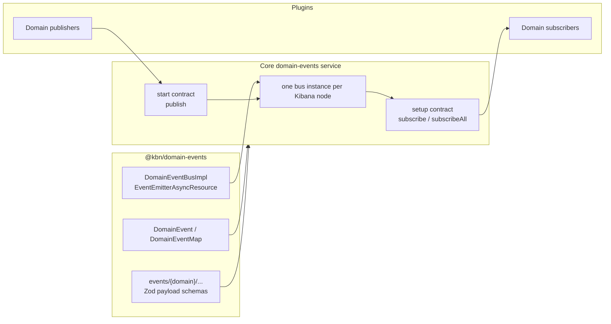
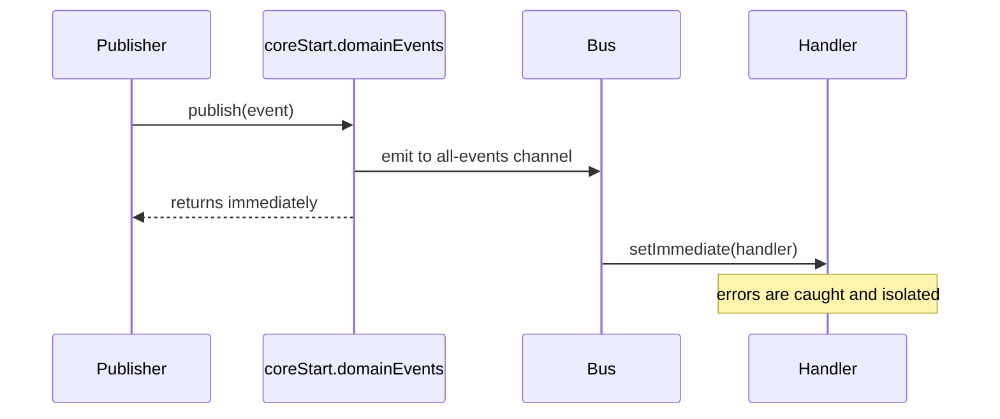
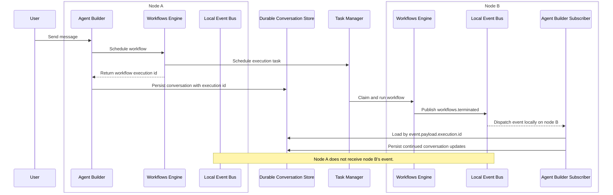

# RFC: Core Domain Events Service

> A shared, in-process publish/subscribe layer for Kibana domain events. Event
> types and payload schemas live in `@kbn/domain-events`; plugin access is
> exposed by Core as `core.domainEvents` during setup and `coreStart.domainEvents`
> during runtime.

**Status:** Implemented / evolving
**Authors:** Workflows Engine Team
**Last updated:** 2026-06-25

## Summary

- **What:** A node-local Core service for publishing and subscribing to typed domain events.
- **Where:** Core owns the service lifecycle in `src/core/packages/domain-events`; the shared `@kbn/domain-events` package owns the event envelope, catalog, schemas, and in-memory bus implementation.
- **How:** Plugins register subscribers from `setup()` through `core.domainEvents.subscribe` or `core.domainEvents.subscribeAll`, and publish runtime facts through `coreStart.domainEvents.publish`.
- **Why:** Publishers announce domain facts without importing consumers. Consumers react without being wired into publisher code.
- **Not:** Cross-node distribution, persistence, retries, ordering guarantees, backpressure, or a replacement for Task Manager / Elasticsearch.

Workflow-specific trigger routing is covered separately in [Workflow Triggers From Domain Events](./rfc_domain_event_workflow_triggers.md).

## Current Architecture

The plugin-facing API lives in Core. That gives Kibana one bus instance per node, aligns subscriptions with plugin setup lifecycle, and prevents arbitrary runtime imports from becoming an unmanaged service boundary.



### Package Layout

| Path | Role |
| --- | --- |
| `src/platform/packages/shared/kbn-domain-events` | Shared event envelope types, event catalog, payload schemas, and `DomainEventBusImpl`. |
| `src/platform/packages/shared/kbn-domain-events/events/index.ts` | Aggregates domain event maps and payload schemas into `DomainEventMap` and `domainEventPayloadSchemas`. |
| `src/platform/packages/shared/kbn-domain-events/events/{domain}` | Per-domain event type constants, payload schemas, payload types, and type guards. |
| `src/core/packages/domain-events/server` | Public Core server contract exported as `@kbn/core-domain-events-server`. |
| `src/core/packages/domain-events/server-internal` | Core service implementation. Owns the per-node `DomainEventBusImpl` instance. |
| `src/core/packages/domain-events/server-mocks` | Typed Jest mocks for setup/start contracts. |

## Core Contracts

The plugin-facing service is split by Core lifecycle.

```ts
export interface DomainEventsServiceSetup {
  subscribe<T extends DomainEventType>(
    type: T,
    handler: (event: DomainEvent<T>) => void | Promise<void>
  ): void;

  subscribeAll(handler: (event: DomainEvent) => void | Promise<void>): void;
}

export interface DomainEventsServiceStart {
  publish<T extends DomainEventType>(event: DomainEvent<T>): void;
}
```

Key points:

- Subscriptions are setup-only. Plugins register handlers in `setup()` so they are installed before runtime publishing begins.
- `subscribe` and `subscribeAll` intentionally return `void` to plugins. There is no plugin-level unsubscribe API.
- Publishing is start/runtime-only. Domain code receives `DomainEventsServiceStart` through normal Core start dependencies and calls `publish`.
- The internal `DomainEventBusImpl` still has unsubscribe support as an implementation detail, but Core does not expose it to plugins.

## Event Envelope And Catalog

`@kbn/domain-events` defines the shared envelope:

```ts
export interface DomainEvent<T extends DomainEventType = DomainEventType> {
  type: T;
  payload: DomainEventMap[T];
  request: KibanaRequest;
}
```

Each domain contributes a map and schemas under `events/{domain}/`. The root catalog combines them:

```ts
export type DomainEventMap = CasesDomainEventMap & WorkflowsDomainEventMap;
export type DomainEventType = keyof DomainEventMap;

export const domainEventPayloadSchemas = {
  ...casesEventPayloadSchemas,
  ...workflowsEventPayloadSchemas,
};
```

Schemas are catalog data for consumers that need runtime validation. The bus itself remains a lightweight dispatch layer; it does not persist, validate, or enrich payloads.

## Dispatch Semantics

The bus is an in-process `EventEmitterAsyncResource` wrapper.



- `publish()` returns immediately.
- Handlers run asynchronously via `setImmediate`.
- A throwing or rejecting handler is isolated from publishers and sibling handlers.
- Events are local to the Kibana node where `publish()` is called.
- There is no durability. If the process exits after publish and before a handler finishes its work, that work is lost.
- Subscribers that need guaranteed work should schedule Task Manager tasks from their handler.

## Plugin Usage

### Subscribing

Plugins subscribe during setup:

```ts
export class MyPlugin {
  public setup(core: CoreSetup) {
    core.domainEvents.subscribe('cases.caseCreated', (event) => {
      void this.handleCaseCreated(event);
    });

    core.domainEvents.subscribeAll((event) => {
      void this.observeDomainEvent(event);
    });
  }
}
```

A handler can defer to services created in `start()` as long as it tolerates them being unset before start completes:

```ts
core.domainEvents.subscribeAll((event) => {
  void this.startedHandler?.handleDomainEvent(event);
});
```

Plugins can also access `CoreStart` from setup-registered callbacks by closing
over `core.getStartServices()`. The workflows execution engine uses this pattern
for setup-registered task runners, where the callback awaits start services
before initializing runtime dependencies:

```ts
core.domainEvents.subscribeAll((event) => {
  void (async () => {
    const [coreStart, pluginsStart] = await core.getStartServices();
    await this.handleDomainEvent(event, coreStart, pluginsStart);
  })();
});
```

If most subscribers need start services, the domain-events setup contract could
also make this explicit by passing them to handlers:

```ts
core.domainEvents.subscribeAll((event, { coreStart, pluginsStart }) => {
  void this.handleDomainEvent(event, coreStart, pluginsStart);
});
```

That would keep registration in `setup()` while avoiding each subscriber having
to close over and await `core.getStartServices()` manually.

### Publishing

Plugins publish from runtime code through the Core start contract:

```ts
coreStart.domainEvents.publish({
  type: CASE_UPDATED_EVENT_TYPE,
  payload: {
    caseId,
    owner,
    updatedFields,
  },
  request,
});
```

Domain services that are not plugin classes should receive `DomainEventsServiceStart` through their existing dependency object.

## Event Type Naming And Versioning

- Event type strings use `domain.action` camelCase, for example `cases.caseCreated` and `workflows.terminated`.
- Domains add files under `@kbn/domain-events/events/{domain}/` and aggregate them into that domain's `DomainEventMap`.
- Payload schemas should be strict and exported with the payload type and type guard.
- Additive payload changes are allowed when subscribers can tolerate them.
- Breaking payload changes require a new event type or an explicit versioned event.

## What This Is Not

| Mechanism | Role |
| --- | --- |
| Domain events service | Neutral in-process publish/subscribe between Kibana code on one node. |
| `@kbn/domain-events` | Shared type catalog and bus implementation package, not the plugin-facing service. |
| Task Manager | Durable, retried, scheduled work for handlers that need delivery guarantees. |
| Elasticsearch | Cross-node source of truth. The bus never holds global state. |

## Known Limitations

1. **Single-node only.** Subscribers only see events published on their own Kibana node. Every node registers the same setup subscribers, but events do not fan out across the cluster.
2. **No delivery guarantees.** Fire-and-forget. If the process dies before a handler finishes, the handler's work may be lost.
3. **No plugin unsubscribe.** Subscriptions are lifecycle-bound to plugin setup. This keeps the public API small and avoids runtime subscription churn.
4. **Async handler dispatch.** Handlers run via `setImmediate`; slow handlers still consume resources on the publishing node.
5. **No ordering across event types.** Related events are only ordered by the publisher's local execution path on a single node.
6. **Payload coupling remains.** Subscribers depend on payload shape even though they do not import publisher code. The central catalog and schemas are the compatibility boundary.

### Cross-node Example

In a multi-node Kibana cluster, publish and handle always happen on the node running the publishing code.

| Step | Node | What happens |
| --- | --- | --- |
| 1 | A | A request or task causes a plugin to publish a domain event. |
| 2 | A | Subscribers registered on node A handle the event asynchronously. |
| 3 | B | Node B does not receive the event from node A. Consumers needing global visibility must use durable storage. |

Implications:

- Subscribe on every node during setup.
- Correlate by stable IDs, not in-memory state on the node that accepted the original HTTP request.
- Use Elasticsearch, saved objects, or another durable store for global state.
- Schedule Task Manager work from the handler when work must be retried or must survive process failure.

### Agent Builder Use Case

Agent Builder is a concrete example of the intended cross-node pattern. A user
conversation starts on node A, Agent Builder schedules a workflow, and stores
the returned workflow execution id in durable conversation state. Task Manager
later runs that workflow on node B. When the workflow terminates, the workflows
engine publishes `workflows.terminated` on node B's local domain events service.



The important design point is that the bus is only the local notification
mechanism. The cross-node handoff works because `workflows.terminated` carries
a durable correlation id and Agent Builder persists conversation state before
the workflow completes.

## Migration State

Completed or in progress:

- Core domain-events service exists with setup/start contracts.
- `@kbn/domain-events` contains the shared envelope, bus implementation, and event catalogs.
- Publishers can publish through `DomainEventsServiceStart`.
- Subscribers can subscribe during setup through `DomainEventsServiceSetup`.

Remaining considerations:

- Keep event catalog ownership federated by domain.
- Avoid adding delivery semantics to the bus; durable work belongs in Task Manager or persistent storage.
