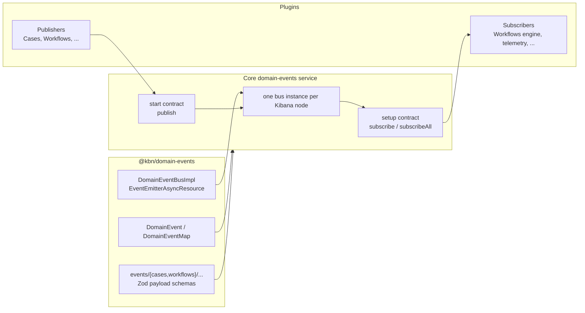
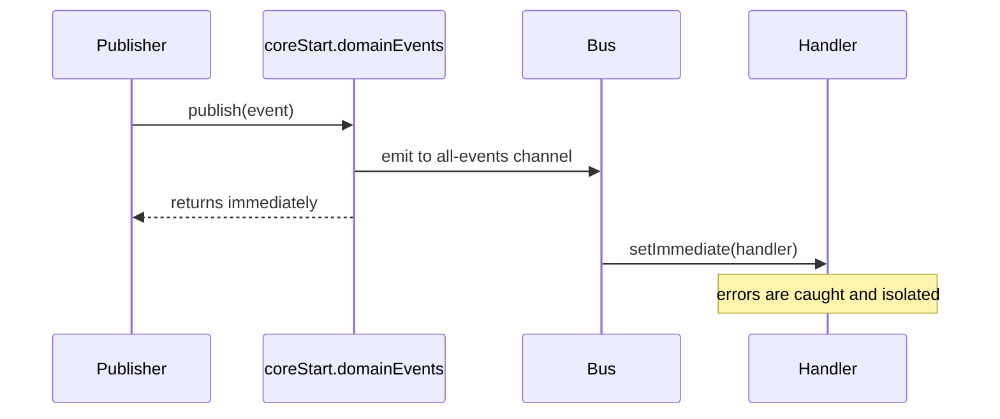

# RFC: Core Domain Events Service

> A shared, in-process publish/subscribe layer for Kibana domain events. Event
> types and payload schemas live in `@kbn/domain-events`; plugin access is
> exposed by Core as `core.domainEvents` during setup and `coreStart.domainEvents`
> during runtime.

**Status:** Implemented / evolving
**Authors:** Workflows Engine Team
**Last updated:** 2026-06-25

## Summary

- **What:** A node-local Core service for publishing and subscribing to typed domain events.
- **Where:** Core owns the service lifecycle in `src/core/packages/domain-events`; the shared `@kbn/domain-events` package owns the event envelope, catalog, schemas, and in-memory bus implementation.
- **How:** Plugins register subscribers from `setup()` through `core.domainEvents.subscribe` or `core.domainEvents.subscribeAll`, and publish runtime facts through `coreStart.domainEvents.publish`.
- **Why:** Publishers announce domain facts without importing consumers. Consumers react without being wired into publisher code.
- **Not:** Cross-node distribution, persistence, retries, ordering guarantees, backpressure, or a replacement for Task Manager / Elasticsearch.

## Current Architecture

The plugin-facing API lives in Core. That gives Kibana one bus instance per node, aligns subscriptions with plugin setup lifecycle, and prevents arbitrary runtime imports from becoming an unmanaged service boundary.



### Package Layout

| Path | Role |
| --- | --- |
| `src/platform/packages/shared/kbn-domain-events` | Shared event envelope types, event catalog, payload schemas, and `DomainEventBusImpl`. |
| `src/platform/packages/shared/kbn-domain-events/events/index.ts` | Aggregates domain event maps and payload schemas into `DomainEventMap` and `domainEventPayloadSchemas`. |
| `src/platform/packages/shared/kbn-domain-events/events/cases` | Cases event type constants, payload schemas, and payload types. |
| `src/platform/packages/shared/kbn-domain-events/events/workflows` | Workflows event type constants, payload schemas, and payload types. |
| `src/core/packages/domain-events/server` | Public Core server contract exported as `@kbn/core-domain-events-server`. |
| `src/core/packages/domain-events/server-internal` | Core service implementation. Owns the per-node `DomainEventBusImpl` instance. |
| `src/core/packages/domain-events/server-mocks` | Typed Jest mocks for setup/start contracts. |

## Core Contracts

The plugin-facing service is split by Core lifecycle.

```ts
export interface DomainEventsServiceSetup {
  subscribe<T extends DomainEventType>(
    type: T,
    handler: (event: DomainEvent<T>) => void | Promise<void>
  ): void;

  subscribeAll(handler: (event: DomainEvent) => void | Promise<void>): void;
}

export interface DomainEventsServiceStart {
  publish<T extends DomainEventType>(event: DomainEvent<T>): void;
}
```

Key points:

- Subscriptions are setup-only. Plugins register handlers in `setup()` so they are installed before runtime publishing begins.
- `subscribe` and `subscribeAll` intentionally return `void` to plugins. There is no plugin-level unsubscribe API.
- Publishing is start/runtime-only. Domain code receives `DomainEventsServiceStart` through normal Core start dependencies and calls `publish`.
- The internal `DomainEventBusImpl` still has unsubscribe support as an implementation detail, but Core does not expose it to plugins.

## Event Envelope And Catalog

`@kbn/domain-events` defines the shared envelope:

```ts
export interface DomainEvent<T extends DomainEventType = DomainEventType> {
  type: T;
  payload: DomainEventMap[T];
  request: KibanaRequest;
}
```

Each domain contributes a map and schemas under `events/{domain}/`. The root catalog combines them:

```ts
export type DomainEventMap = CasesDomainEventMap & WorkflowsDomainEventMap;
export type DomainEventType = keyof DomainEventMap;

export const domainEventPayloadSchemas = {
  ...casesEventPayloadSchemas,
  ...workflowsEventPayloadSchemas,
};
```

Schemas are catalog data for runtime validation by consumers such as the workflows trigger handler. The bus itself remains a lightweight dispatch layer; it does not persist or enrich payloads.

## Dispatch Semantics

The bus is an in-process `EventEmitterAsyncResource` wrapper.



- `publish()` returns immediately.
- Handlers run asynchronously via `setImmediate`.
- A throwing or rejecting handler is isolated from publishers and sibling handlers.
- Events are local to the Kibana node where `publish()` is called.
- There is no durability. If the process exits after publish and before a handler finishes its work, that work is lost.
- Subscribers that need guaranteed work should schedule Task Manager tasks from their handler.

## Plugin Usage

### Subscribing

Plugins subscribe during setup:

```ts
export class MyPlugin {
  public setup(core: CoreSetup) {
    core.domainEvents.subscribe('cases.caseCreated', (event) => {
      void this.handleCaseCreated(event);
    });

    core.domainEvents.subscribeAll((event) => {
      void this.observeDomainEvent(event);
    });
  }
}
```

The handler can defer to services that are only created in `start()`, as long as the handler tolerates the value being undefined before start completes. The workflows execution engine uses this pattern: it registers a setup-time `subscribeAll` handler that delegates to `this.triggerEventHandler`, which is initialized in `start()`.

```ts
core.domainEvents.subscribeAll((event) =>
  this.triggerEventHandler?.handleDomainEvent(event)
);
```

### Publishing

Plugins publish from runtime code through the Core start contract:

```ts
coreStart.domainEvents.publish({
  type: CASE_UPDATED_EVENT_TYPE,
  payload: {
    caseId,
    owner,
    updatedFields,
  },
  request,
});
```

Domain services that are not plugin classes should receive `DomainEventsServiceStart` through their existing dependency object. Cases does this through `CasesClientArgs.domainEvents`.

## Cases On The Bus

Cases now publishes several domain events directly to `DomainEventsServiceStart`. The old private `CasesEventBus` still exists in the tree, but the active publisher paths are moving to the shared Core service.

### Case Creation

Case bulk create publishes `cases.caseCreated` once per created case after the case response is decoded.

```ts
clientArgs.domainEvents.publish({
  type: 'cases.caseCreated',
  payload: {
    caseId: createdCase.id,
    owner: createdCase.owner,
  },
  request: clientArgs.request,
});
```

### Case Updates And Status Changes

`publishCaseUpdatedDomainEvents` publishes `cases.caseUpdated` for every case update. If the update includes a real status transition, it also publishes `cases.caseStatusChanged`.

```ts
domainEvents.publish({
  type: CASE_UPDATED_EVENT_TYPE,
  payload,
  request,
});

if (caseStatusChangedPayload) {
  domainEvents.publish({
    type: CASE_STATUS_CHANGED_EVENT_TYPE,
    payload: caseStatusChangedPayload,
    request,
  });
}
```

### Attachments And Comments

Attachment creation publishes `cases.attachmentsAdded`. Legacy `user` attachments are normalized to `comment` for the attachment event payload.

When the normalized attachment type is `comment`, Cases also publishes the dedicated `cases.commentsAdded` event. This makes comments a first-class domain event instead of a workflow-only projection of attachments.

```ts
clientArgs.domainEvents.publish({
  type: ATTACHMENTS_ADDED_EVENT_TYPE,
  payload: {
    caseId: updatedCase.id,
    attachmentIds,
    attachmentType: enhancedAttachmentType,
    owner: updatedCase.owner,
  },
  request: clientArgs.request,
});

if (enhancedAttachmentType === 'comment') {
  clientArgs.domainEvents.publish({
    type: COMMENTS_ADDED_EVENT_TYPE,
    payload: {
      caseId: updatedCase.id,
      owner: updatedCase.owner,
      commentIds: attachmentIds,
    },
    request: clientArgs.request,
  });
}
```

## Workflows On The Bus

The workflows execution engine is both a subscriber and a publisher.

### Inbound: Domain Event To Workflow Trigger

During setup, the engine subscribes to all domain events:

```ts
core.domainEvents.subscribeAll((event) =>
  this.triggerEventHandler?.handleDomainEvent(event)
);
```

`TriggerEventHandler.handleDomainEvent` then:

1. Finds registered workflow trigger definitions whose `domainEventType` matches the event type.
2. Applies any trigger-level `matchesDomainEvent` filter.
3. Maps the domain event payload through `mapEvent` when needed.
4. Validates the trigger payload.
5. Resolves subscribed workflows for the current space and KQL condition.
6. Schedules matching workflow executions.

A single domain event can fan out to multiple workflow triggers when multiple trigger definitions reference the same `domainEventType`.

### Cases Workflow Trigger Definitions

Cases workflow triggers are now backed directly by domain event constants:

| Trigger | Domain event |
| --- | --- |
| `cases.caseCreated` | `CASE_CREATED_EVENT_TYPE` |
| `cases.caseUpdated` | `CASE_UPDATED_EVENT_TYPE` |
| `cases.caseStatusUpdated` | `CASE_STATUS_CHANGED_EVENT_TYPE` |
| `cases.attachmentsAdded` | `ATTACHMENTS_ADDED_EVENT_TYPE` |
| `cases.commentsAdded` | `COMMENTS_ADDED_EVENT_TYPE` |

`cases.attachmentsAdded` still maps legacy attachment type `user` to `comment` for workflow payloads. `cases.commentsAdded` no longer filters `cases.attachmentsAdded`; it listens to the dedicated comments domain event.

### Outbound: Workflow Lifecycle Events

The engine publishes workflow lifecycle events through `coreStart.domainEvents.publish`.

Current publish paths:

- `workflows.workflowStarted` is published when a workflow execution starts.
- `workflows.terminated` is published once when a non-test workflow reaches a terminal status.

The event catalog also defines `workflows.stepStarted` and `workflows.stepFinished`; those are available catalog entries for step lifecycle instrumentation, but this RFC should not imply they are already emitted by the current execution path unless the corresponding publisher is added.

## Current Event Catalog

### Cases

| Type | Payload summary |
| --- | --- |
| `cases.caseCreated` | `{ caseId, owner }` |
| `cases.caseUpdated` | `{ caseId, owner, updatedFields? }` |
| `cases.caseStatusChanged` | `{ caseId, owner, previousStatus, status }` |
| `cases.attachmentsAdded` | `{ caseId, owner, attachmentIds, attachmentType }` |
| `cases.commentsAdded` | `{ caseId, owner, commentIds }` |

### Workflows

| Type | Payload summary |
| --- | --- |
| `workflows.workflowStarted` | `{ spaceId, workflowId, workflowRunId }` |
| `workflows.terminated` | `{ status, workflow, execution, error }` |
| `workflows.stepStarted` | `{ spaceId, workflowRunId, stepId, stepType }` |
| `workflows.stepFinished` | `{ spaceId, workflowRunId, stepId, stepType, status }` |

## Event Type Naming And Versioning

- Event type strings use `domain.action` camelCase, for example `cases.caseCreated` and `workflows.terminated`.
- Domains add files under `@kbn/domain-events/events/{domain}/` and aggregate them into that domain's `DomainEventMap`.
- Payload schemas should be strict and exported with the payload type and type guard.
- Additive payload changes are allowed when subscribers can tolerate them.
- Breaking payload changes require a new event type or an explicit versioned event.

## What This Is Not

| Mechanism | Role |
| --- | --- |
| Domain events service | Neutral in-process publish/subscribe between Kibana code on one node. |
| `@kbn/domain-events` | Shared type catalog and bus implementation package, not the plugin-facing service. |
| Task Manager | Durable, retried, scheduled work for handlers that need delivery guarantees. |
| Workflow event logger | Ops/debug logging to a data stream, not a plugin-to-plugin bus. |
| Elasticsearch | Cross-node source of truth. The bus never holds global state. |

## Known Limitations

1. **Single-node only.** Subscribers only see events published on their own Kibana node. Every node registers the same setup subscribers, but events do not fan out across the cluster.
2. **No delivery guarantees.** Fire-and-forget. If the process dies before a handler finishes, the handler's work may be lost.
3. **No plugin unsubscribe.** Subscriptions are lifecycle-bound to plugin setup. This keeps the public API small and avoids runtime subscription churn.
4. **Async handler dispatch.** Handlers run via `setImmediate`; slow handlers still consume resources on the publishing node.
5. **No ordering across event types.** Related events are only ordered by the publisher's local execution path on a single node.
6. **Payload coupling remains.** Subscribers depend on payload shape even though they do not import publisher code. The central catalog and schemas are the compatibility boundary.

### Cross-node Example: Agent Builder And Workflow Lifecycle

In a multi-node Kibana cluster, publish and handle always happen on the node running the publishing code.

| Step | Node | What happens |
| --- | --- | --- |
| 1 | A | User interacts with Agent Builder; AB starts a workflow through the workflows API. |
| 2 | A | The engine persists the execution and schedules Task Manager work. |
| 3 | B | Task Manager claims the task. The engine runs the workflow and publishes `workflows.workflowStarted` on node B. |
| 4 | B | Subscribers registered on node B handle the event. |
| 5 | A | Node A does not receive the event from node B. Consumers needing global visibility must use durable storage. |

Implications:

- Subscribe on every node during setup.
- Correlate by stable IDs such as workflow run id, not in-memory state on the node that accepted the original HTTP request.
- Use Elasticsearch, saved objects, or workflow execution indices for global state.
- Schedule Task Manager work from the handler when the work must be retried or must survive process failure.

## Migration State

Completed or in progress:

- Core domain-events service exists with setup/start contracts.
- `@kbn/domain-events` contains the shared envelope, bus implementation, and event catalogs.
- Workflows execution engine subscribes to all domain events during setup and routes matching events through trigger definitions.
- Cases publishes create/update/status/attachment/comment domain events through `DomainEventsServiceStart`.
- Workflows publishes workflow started and terminated lifecycle events.

Remaining considerations:

- Remove stale private Cases bus code once all old call sites and tests are gone.
- Decide whether `workflows.stepStarted` and `workflows.stepFinished` should be emitted by the current runtime manager or remain catalog-only until a concrete consumer lands.
- Keep `workflows_extensions.emitEvent` compatibility only as long as existing callers need it; new integrations should prefer domain events and trigger definitions.
