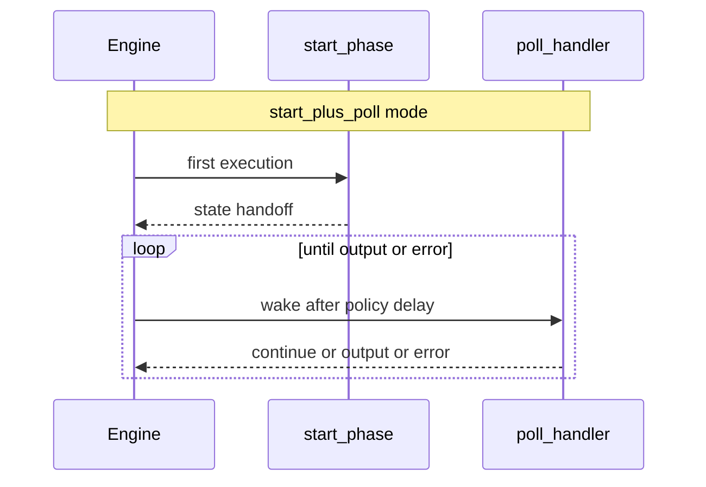

# Contributing and requirements for custom steps

## Important: Internal vs External Steps

**⚠️ IMPORTANT CONVENTION**: The `workflows_extensions` plugin contains **internal, workflows-team owned** step implementations only. These are located in:
- `server/steps/` - Internal server-side step handlers
- `public/steps/` - Internal public-side step definitions

**External teams should NOT implement custom steps inside the `workflows_extensions` plugin.** Instead, external teams must:

1. **Create steps in their own plugin** - Steps should be implemented in a plugin owned and maintained by the team that will maintain the step
2. **Register via plugin contract** - Use the `workflows_extensions` plugin contract to register steps from your external plugin, just like the example in `examples/workflows_extensions_example/README.md`

This separation ensures:
- Clear ownership boundaries
- Proper maintenance responsibilities
- Better code organization
- Reduced coupling between teams

See [Contributing Custom Step Types](#contributing-custom-step-types) below for the correct way to implement external steps.

## Contributing Custom Step Types

This section provides a complete guide for contributors who want to add custom step types to the workflows system.

### Step 1: Define Common Step Definition

Create a shared definition file (e.g., `common/step_types/my_step.ts`) that contains the step ID and schemas:

```typescript
import { z } from '@kbn/zod/v4';
import type { CommonStepDefinition } from '@kbn/workflows-extensions/common';

/**
 * Step type ID for your custom step.
 * Must follow namespaced format: '<namespace>.<action>' (kebab-case namespace, camelCase action)
 */
export const MyStepTypeId = 'my-namespace.myCustomStep';

/**
 * Input schema for the step.
 * Defines what parameters the step accepts.
 */
export const InputSchema = z.object({
  message: z.string(),
  count: z.number().optional(),
  mode: z.enum(['partial', 'full'])
});

/**
 * Output schema for the step.
 *
 * Defines the structure and types of data that this step will return.
 * This schema is used for validation and type checking to ensure data consistency
 * across workflow steps.
 */
 * Defines all possible structures the step returns.
 */
export const OutputSchema = z.union([
    z.object({
    result: z.string(),
  }),
  z.object({
    partialResult: z.string(),
  })
]);

export type MyStepInput = z.infer<typeof InputSchema>;
export type MyStepOutput = z.infer<typeof OutputSchema>;

/**
 * Config schema for the step (optional).
 * Defines config properties that appear at the step level (outside the `with` block).
 * Example: `id`.
 */
export const ConfigSchema = z.object({
  'id': z.string(),
});

/**
 * Common step definition shared between server and public.
 */
export const myStepCommonDefinition: CommonStepDefinition = {
  id: MyStepTypeId,
  inputSchema: InputSchema,
  outputSchema: OutputSchema,
  configSchema: ConfigSchema, // Optional: only needed if step has config properties
};
```

### Step 2: Implement Server-Side Definition

Server-side custom steps use one of two definition helpers:

- **Single-shot** — `createServerStepDefinition` with a `handler` (synchronous or fast work).
- **Durable start/poll** — `createPollServerStepDefinition` with `poll` and optionally `start`, `policy`, and `ceilings` (async work that wakes in `WAITING` until complete).

For long-running or async work, use `createPollServerStepDefinition` instead — see [Durable start/poll custom steps](#durable-startpoll-custom-steps-createpollserverstepdefinition). Do not add `start` or `poll` to `createServerStepDefinition` definitions.

The example below uses **single-shot** `createServerStepDefinition`. Create the server-side implementation (e.g., `server/step_types/my_step.ts`):

```typescript
import type { ServerStepDefinition, StepHandler } from '@kbn/workflows-extensions/server';
import { ExecutionError } from '@kbn/workflows/server';
import { myStepCommonDefinition } from '../../common/step_types/my_step';

export const getMyStepDefinition = (coreSetup: CoreSetup) =>
  createServerStepDefinition({
    ...myStepCommonDefinition,
    handler: async (context) => {
      try {
        const [coreStart, depsStart] = await coreSetup.getStartServices();
        const { http } = coreStart;
        const { message, count } = context.input;

        // Access workflow context
        const workflowContext = context.contextManager.getContext();

        // Use the scoped Elasticsearch client if needed
        const esClient = context.contextManager.getScopedEsClient();

        // Log information
        context.logger.info(`Processing step with message: ${message}`);

        // Perform your step logic here
        const result = `Processed: ${message}${count ? ` (count: ${count})` : ''}`;

        return { output: { result } };
      } catch (error) {
        context.logger.error('My step execution failed', error);
        return { error };
      }
    },
  });
```

### Step 3: Implement Public-Side Definition

Create the public-side definition (e.g., `public/step_types/my_step.ts`):

```typescript
import React from 'react';
import type { PublicStepDefinition } from '@kbn/workflows-extensions/public';
import { i18n } from '@kbn/i18n';
import { MyStepTypeId, myStepCommonDefinition } from '../../common/step_types/my_step';

import { StepMenuCatalog } from '@kbn/workflows-extensions/public';

export const myStepDefinition: PublicStepDefinition = {
  ...myStepCommonDefinition,
  icon: React.lazy(() =>
    import('@elastic/eui/es/components/icon/assets/star').then(({ icon }) => ({ default: icon }))
  ),
  label: i18n.translate('myPlugin.myStep.label', {
    defaultMessage: 'My Custom Step',
  }),
  description: i18n.translate('myPlugin.myStep.description', {
    defaultMessage: 'Performs a custom action in workflows',
  }),
  documentation: {
    details: i18n.translate('myPlugin.myStep.documentation.details', {
      defaultMessage: 'This step processes messages and returns results.',
    }),
    examples: [
      `## Basic usage
\`\`\`yaml
- name: process_message
  type: ${MyStepTypeId}
  with:
    message: "Hello World"
\`\`\``,
    ],
  },
  actionsMenuCatalog: StepMenuCatalog.kibana, // Optional: determines which catalog the step appears under in the actions menu
};
```

**Important**: Icons must be custom components or images imported from EUI, not passed as strings. The workflows app does not fully support built-in `EuiIconType` strings (e.g., `'star'`) yet. See [EUI icon consumption guide](https://github.com/elastic/eui/blob/main/wiki/consuming-eui/README.md#failing-icon-imports) for details.

#### Advanced Example with Dynamic Output Schema

For steps that need different output schemas based on input parameters, you can use `dynamicOutputSchema`. This function is evaluated **in the workflows editor UI** to provide real-time schema validation and autocomplete based on the current step configuration. Here's an example of a data transformation step:

```typescript
import React from 'react';
import type { PublicStepDefinition } from '@kbn/workflows-extensions/public';
import { i18n } from '@kbn/i18n';
import { MyStepTypeId, myStepCommonDefinition } from '../../common/step_types/my_step';

import { StepMenuCatalog } from '@kbn/workflows-extensions/public';

export const myStepDefinition: PublicStepDefinition = {
  ...myStepCommonDefinition,
  icon: React.lazy(() =>
    import('@elastic/eui/es/components/icon/assets/star').then(({ icon }) => ({ default: icon }))
  ),
  label: i18n.translate('myPlugin.myStep.label', {
    defaultMessage: 'My Custom Step',
  }),
  description: i18n.translate('myPlugin.myStep.description', {
    defaultMessage: 'Performs a custom action in workflows',
  }),
  documentation: {
    details: i18n.translate('myPlugin.myStep.documentation.details', {
      defaultMessage: 'This step processes messages and returns results.',
    }),
    examples: [
      `## Basic usage
\`\`\`yaml
- name: process_message
  type: ${MyStepTypeId}
  with:
    message: "Hello World"
\`\`\``,
    ],
  },
  actionsMenuCatalog: StepMenuCatalog.kibana, // Optional: determines which catalog the step appears under in the actions menu
  editorHandlers: {
    dynamicSchema: {
      getOutputSchema: ({ input }) => {
        if (input.mode == 'partial') {
          return z.object({
            partialResult: z.string(),
          });
        }

        return z.object({
          result: z.string(),
        });
      },
    },
  },
};
```

### Custom Property Selection

Custom steps can provide property-level selection handlers for both config properties (step-level, outside `with`) and input properties (inside `with`). The selection interface provides a unified API for entity selection that handles:

- **Search**: Autocomplete suggestions when the user types
- **Resolution**: Entity lookup when loading or pasting values
- **Decoration**: Visual feedback and metadata display in the editor

#### Property Handler Structure

Property handlers are defined in the `editorHandlers` object of the public step definition:

```typescript
import { createPublicStepDefinition } from '@kbn/workflows-extensions/public';

export const myStepDefinition = createPublicStepDefinition({
  ...myStepCommonDefinition,
  // ... other properties (icon, label, description, documentation)
  editorHandlers: {
    // Handlers for config properties (step-level, outside `with`)
    config: {
      'property.path': {
        selection: {
          search: async (input, context) => { /* ... */ },
          resolve: async (value, context) => { /* ... */ },
          getDetails: async (value, context, option) => { /* ... */ },
        },
      },
    },
    // Handlers for input properties (inside `with`)
    input: {
      property: {
        selection: {
          search: async (input, context) => { /* ... */ },
          resolve: async (value, context) => { /* ... */ },
          getDetails: async (value, context, option) => { /* ... */ },
        },
      },
    },
  },
});
```

**Note**: Property paths support dot notation for nested objects. For example, if your `configSchema` is:

```typescript
z.object({
  agent: z.object({
    id: z.string(),
  }),
});
```

Use `'agent.id'` as the property key in `editorHandlers.config`.

#### Implementing Selection

The `selection` interface provides three functions that work together:

**1. `search`** - Provides autocomplete options when the user types:

```typescript
editorHandlers: {
  config: {
    'agent-id': {
      selection: {
        search: async (input: string, context: SelectionContext) => {
          const agents = await agentService.search(input);
          return agents.map((agent) => ({
            value: agent.id,
            label: agent.name,
            description: agent.description,
            documentation: agent.documentation,
          }));
        },
        // ...
      },
    },
  },
},
```

**2. `resolve`** - Resolves an entity by its value (used on load, paste, etc.):

```typescript
resolve: async (value: string, context: SelectionContext) => {
  const agent = await agentService.get(value);
  if (!agent) {
    return null;
  }
  return {
    value: agent.id,
    label: agent.name,
    description: agent.description,
  };
},
```

**3. `getDetails`** - Provides detailed information for decoration and metadata:

```typescript
getDetails: async (value, context, option) => {
  if (option) {
    return {
      message: `Successfully connected to ${option.label}`,
      links: [
        { text: 'Edit agent', path: `/app/agent-builder/agents/${option.value}` },
        { text: 'Create agent', path: `/app/agent-builder/agents/new` },
        { text: 'Manage agents', path: `/app/agent-builder/agents` },
      ],
    };
  }
  return {
    message: `Agent ID "${value}" not found. Please select an existing agent or create a new one.`,
    links: [
      { text: 'Create agent', path: `/app/agent-builder/agents/new` },
      { text: 'Manage agents', path: `/app/agent-builder/agents` },
    ],
  };
},
```

#### Complete Example

```typescript
editorHandlers: {
  config: {
    'agent-id': {
      selection: {
        search: async (input: string, context: SelectionContext) => {
          const agents = await agentService.search(input);
          return agents.map((agent) => ({
            value: agent.id,
            label: agent.name,
            description: agent.description,
          }));
        },
        resolve: async (value: string, context: SelectionContext) => {
          const agent = await agentService.get(value);
          return agent
            ? {
                value: agent.id,
                label: agent.name,
                description: agent.description,
              }
            : null;
        },
        getDetails: async (
          value: string,
          context: SelectionContext,
          option: SelectionOption | null
        ) => {
          if (option) {
            return {
              message: `✓ Agent connected: ${option.label}`,
              links: [
                { text: 'Edit agent', path: `/agents/${option.value}` },
                { text: 'Manage agents', path: '/agents' },
              ],
            };
          }
          return {
            message: `Agent "${value}" not found`,
            links: [
              { text: 'Create agent', path: '/agents/new' },
              { text: 'Manage agents', path: '/agents' },
            ],
          };
        },
      },
    },
  },
},
```

#### Type Definitions

```typescript
interface SelectionOption {
  /** The value that will be stored in the YAML */
  value: string;
  /** The label displayed in the UI */
  label: string;
  /** Description shown in completion popup or tooltips (optional) */
  description?: string;
  /** Extended documentation shown in side panel (optional) */
  documentation?: string;
}

interface SelectionDetails {
  /** Message to display (e.g., "✓ Agent connected" or "Agent not found") */
  message: string;
  /** Links to related actions (e.g., "Edit agent", "Create agent") */
  links?: Array<{
    /** Link text */
    text: string;
    /** Link path (relative or absolute URL) */
    path: string;
  }>;
}

interface StepSelectionValues {
  /** Root-level step properties (everything outside the `with` block). */
  config: Record<string, unknown>;
  /** Properties nested under the `with` block. */
  input: Record<string, unknown>;
}

interface SelectionContext {
  /** The step type ID (e.g., "ai.runAgent", "one-chat.invoke") */
  stepType: string;
  /** The property scope ("config" or "input") */
  scope: 'config' | 'input';
  /** The property key (e.g., "agent-id") */
  propertyKey: string;
  /** Sibling values of the current step, keyed by scope (see `dependsOnValues` below). */
  values: StepSelectionValues;
}
```

**`dependsOnValues` (optional on `selection`):** Declare dot paths such as `config.proxy.ssl` or `input.owner` when your handlers need other fields from the step definition. The editor then passes only those paths in `context.values` (and uses them for cache keys). If omitted, `context.values` is `{ config: {}, input: {} }` and handlers should not rely on sibling fields unless you list them here.

`context.values` gives handlers access to the requested sibling property values.
For example, if you set `dependsOnValues: ['input.owner']` and the YAML step has `with: { owner: securitySolution }`, the handler can read `context.values.input.owner`. Missing properties are `undefined`.

#### Example Implementation

For a complete working example, see the `external_step` implementation in `examples/workflows_extensions_example`:

- Common definition: `examples/workflows_extensions_example/common/step_types/external_step.ts`
- Public definition with `editorHandlers`: `examples/workflows_extensions_example/public/step_types/external_step.ts`

#### Performance considerations: editor caching

The workflows YAML editor uses two in-memory layers to reduce duplicate work while typing. **Search result lists** are keyed by step type, property scope, property key, and a fingerprint of **`context.values`** (from `dependsOnValues`, or empty when none are declared). The list is reused until replaced (no time-based expiry). **Custom-property validation** additionally keeps a **~30s TTL** cache of the combined **`resolve` + `getDetails`** outcome per logical field (step instance id, step type, scope, property key, scalar value, and the same `context.values` fingerprint). That way, changing unrelated YAML elsewhere does not re-run handlers for unchanged fields, and stale “not found” states do not linger forever.

**`search`**

- After `search` returns, its options are stored under the search cache key above so the same completion list and per-option metadata can be reused.
- If you use **`dependsOnValues`**, only those sibling fields are included in `context.values` and in the cache key—so unrelated edits elsewhere in the step do not force a new search for cache purposes.

**`resolve`**

- When validation needs to turn a stored value into a `SelectionOption`, it first looks up that value in the **cached search options list** for the same step type, scope, property key, and `context.values` fingerprint (if the user recently opened completions, the option may already be there).
- **`resolve` runs only when** there is no matching option in that list. It is not invoked on every keystroke across the whole workflow when unrelated content changes, thanks to the keying described above.

**`getDetails`**

- During validation, **`getDetails` is covered by the validation-outcome cache** together with `resolve`: when semantic inputs are unchanged within the TTL, neither runs again—including when `resolve` previously returned `null`.
- Implement **`getDetails` without extra network calls** when `option` is present: use `option.label`, `option.value`, and `context` to build messages and links. Reserve API calls for the **`option === null`** path (e.g. explaining that a pasted id could not be resolved). That keeps hover and error text responsive and avoids redundant fetches.

**Validation pass (`workflows_management`)**

- On each YAML edit, the editor re-runs validation for custom properties. The validation-outcome cache stores the **`resolve` + `getDetails`** result per field as described above. While those inputs are unchanged (e.g. you edit a different step), **`resolve` and `getDetails` are not called again** for that property—including when `resolve` previously returned `null`.

### Step 4: Register in Plugin Setup

Register the step definitions in both server and public plugin setup:

Both `registerStepDefinition` contracts (server and public) accept either a **direct definition** or an **async loader** of the form `() => Promise<Definition | undefined>`. Use the loader form when you need to:

- Keep the step module out of your plugin's main bundle (defer the import).
- Conditionally register the step based on something only known at runtime (feature flag, license, capabilities, etc.). **Resolve the loader with `undefined` to skip the registration silently** — no error is thrown and no entry is added to the registry.

Loader rejections (and any error thrown while inserting the resolved definition into the registry) are caught and logged via the plugin logger; they do **not** propagate to the caller. This way a single broken loader cannot prevent other steps — or workflow execution as a whole — from working. Consumers that need to wait for all pending registrations can `await workflowsExtensions.isReady()`; it always resolves once every loader has settled.

**Server-side** (`server/plugin.ts`):

```typescript
import type { Plugin, CoreSetup, CoreStart } from '@kbn/core/server';
import type { WorkflowsExtensionsServerPluginSetup } from '@kbn/workflows-extensions/server';
import { getMyStepDefinition } from './workflows/step_types/my_step';

export interface MyPluginServerSetupDeps {
  workflowsExtensions: WorkflowsExtensionsServerPluginSetup;
}

export class MyPlugin implements Plugin {
  public setup(core: CoreSetup, plugins: MyPluginServerSetupDeps) {
    // Sync registration — definition is built up-front
    plugins.workflowsExtensions.registerStepDefinition(getMyStepDefinition(core));

    // Async / conditional registration — resolve with `undefined` to skip
    plugins.workflowsExtensions.registerStepDefinition(async () => {
      const isFeatureFlagEnabled = await checkFeatureFlag();
      if (!isFeatureFlagEnabled) {
        return undefined; // Skip step registration
      }
      const { getMyOptionalStepDefinition } = await import(
        './workflows/step_types/my_optional_step'
      );
      return getMyOptionalStepDefinition(core);
    });
  }
}
```

The workflow execution engine awaits `workflowsExtensions.isReady()` before reading a workflow execution, so handlers registered through async loaders are guaranteed to be available when the engine runs.

**Public-side** (`public/plugin.ts`):

Prefer the loader form so the step module (and its dependencies, e.g. zod) are not pulled into your plugin's main bundle. As on the server, the loader can resolve with `undefined` to skip registration:

```typescript
import type { Plugin, CoreSetup, CoreStart } from '@kbn/core/public';
import type { WorkflowsExtensionsPublicPluginSetup } from '@kbn/workflows-extensions/public';

export interface MyPluginPublicSetupDeps {
  workflowsExtensions: WorkflowsExtensionsPublicPluginSetup;
}

export class MyPlugin implements Plugin {
  public setup(_core: CoreSetup, plugins: MyPluginPublicSetupDeps) {
    // Recommended: register via async loader to keep step module + zod out of main bundle
    plugins.workflowsExtensions.registerStepDefinition(() =>
      import('./workflows/step_types/my_step').then((m) => m.myStepDefinition)
    );

    // Conditional registration — resolve with `undefined` to skip
    plugins.workflowsExtensions.registerStepDefinition(async () => {
      const isFeatureFlagEnabled = await checkFeatureFlag();
      if (!isFeatureFlagEnabled) {
        return undefined; // Skip step registration
      }
      const { myOptionalStepDefinition } = await import(
        './workflows/step_types/my_optional_step'
      );
      return myOptionalStepDefinition;
    });

    // Alternatively: sync registration (pulls step module into main bundle)
    // import { myStepDefinition } from './workflows/step_types/my_step';
    // plugins.workflowsExtensions.registerStepDefinition(myStepDefinition);
  }
}
```

Loaders are resolved in the background after setup. The workflows app awaits `workflowsExtensions.isReady()` before rendering, so step definitions are available when the UI runs.

For complete examples of conditional async registration on both sides, see `examples/workflows_extensions_example/server/step_types/index.ts` and `examples/workflows_extensions_example/public/step_types/index.ts`.

### Step 5: Get Approval

All custom step definitions must be approved by the workflows-eng team. See the [Step Definition Approval Process](#step-definition-approval-process) section below.

### Example Implementation

See `examples/workflows_extensions_example` for a complete working example of a custom step type implementation.

## Using Step Definitions

### Client-Side: Accessing Step Definitions

In your UI components:

```typescript
import { useKibana } from '@kbn/kibana-react-plugin/public';

function MyComponent() {
  const { workflowsExtensions } = useKibana().services;

  // Get all registered steps
  const allSteps = workflowsExtensions.getAllStepDefinitions();

  // Get definition for a specific step
  const stepDefinition = workflowsExtensions.getStepDefinition('my-namespace.myCustomStep');
  if (stepDefinition) {
    console.log(stepDefinition.label); // "My Custom Step"
    console.log(stepDefinition.icon); // React component
  }

  // Check if a step is registered
  if (workflowsExtensions.hasStepDefinition('my-namespace.myCustomStep')) {
    // Step is available
  }
}
```

**Waiting for async step definitions:** If your app mounts before step definitions are needed, you can await `workflowsExtensions.isReady()` before rendering. That ensures all step definitions registered via async loaders have resolved. The workflows app does this in its mount so the step registry is ready when the UI runs.

The same `isReady()` method exists on the server start contract. The workflow execution engine already awaits it before reading a workflow execution; you only need to call it directly if you read the registry from another server-side entry point that runs before async loaders have settled.

## Step Type Requirements

### Workflow YAML Naming Conventions

The following naming conventions apply to workflow YAML. They ensure consistency where the workflows team owns the schema, while allowing inherited formats from external contracts (OpenAPI, connectors, platform-owned APIs).

| Area | Convention | Notes |
|------|-------------|-------|
| **Workflow Config keys** (root + step config outside `with`) | **kebab-case** for multi-word keys | Keys we own: `on-failure`, `connector-id`, `agent-id`, `timeout`, etc. |
| **Step Input** (`with:` params) | **kebab-case** or **snake_case** recommended | Inherited formats from OpenAPI/connectors/platform contracts are allowed. |
| **Step Type** (`type:` value) | `<namespace>.<action>` | **kebab-case** for namespace, **camelCase** for action. Inherited forms allowed. |

**Examples:**

```yaml
# Config keys (we own) — kebab-case
- name: send_notification
  type: my-namespace.sendNotification    # namespace: kebab-case, action: camelCase
  connector-id: slack         # kebab-case
  on-failure: continue
  with:
    channel-id: '#alerts'             # kebab-case or snake_case for our params
    message: Hello
```

**Inherited formats:** When step inputs come from external schemas (e.g., OpenAPI-generated params, connector specs), use the format defined by that contract. The conventions above apply to workflow-owned keys and to custom step params we define.

### Step Type IDs

Step type IDs must follow a namespaced format to avoid conflicts:

- Format: `<namespace>.<action>` — use **kebab-case** for the namespace, **camelCase** for the action
- ✅ Good: `"my-namespace.sendNotification"`, `"custom-feature.processData"`
- ⚠️ Allowed: Inherited forms from OpenAPI/connectors/platform-owned contracts
- ❌ Bad: `"myStep"`, `"step"` (too generic, no namespace)

### Config vs Inputs: Mental Model

When designing a step, you need to decide which parameters should be **config** properties (step-level in YAML) and which should be **inputs** (in the `with` section). Here's the recommended mental model:

**Config (step-level properties):**
Use config to **control step behavior** - how/when/who the step executes:

- Execution context (e.g., `connector-id: 'slack'`, `agent-id: 'agent-123'`)
- Execution mode (e.g., `mode: 'batch'`, `strategy: 'parallel'`)

**Built-in step-level config examples:**

- `if`: Conditional execution (e.g., `if: '${{ steps.check.output.passed }}'`)
- `foreach`: Iteration over collections (e.g., `foreach: '${{ steps.list.output.items }}'`)
- `on-failure`: Error handling policy with `continue`, `retry`, or `fallback` strategies
- `timeout`: Execution time limits (e.g., `timeout: 30s`)

**Inputs (the `with` section):**
Use inputs for **what/where to process** - the step's payload:

- Target destinations (e.g., `index`, `channel`, `namespace`, `bucket`)
- Data to process (e.g., `document`, `message`, `query`, `payload`)
- Processing parameters (e.g., `severity`, `priority`, `format`, `options`)
- Dynamic values from previous steps or context

**Example:**

```yaml
# Config properties (step-level) - Control step behavior
- name: send_notification
  type: my-namespace.sendNotification
  connector-id: slack # Config: which connector to use (controls behavior)
  mode: async # Config: execution mode (controls behavior)
  timeout: 10s # Config: time limit (controls behavior)
  # Inputs (with section) - What/Where to process
  with:
    channel: '#alerts' # Input: WHERE - target destination
    message: ${{ steps.process.output.alert }} # Input: WHAT - data to send
    priority: high # Input: WHAT - processing parameter

- name: process_data
  type: my-namespace.processData
  if: steps.previous.output.data.length > 10 # Config: by which condition to run this step (control behavior)
  agent-id: data-processor-1 # Config: which agent to use (controls behavior)
  strategy: parallel # Config: processing strategy (controls behavior)
  # Inputs (with section) - What/Where to process
  with:
    index: logs-* # Input: WHERE - data source
    query: 'status:error' # Input: WHAT - data to process
    outputIndex: processed-* # Input: WHERE - output destination
    transform: # Input: WHAT - transformation logic
      field: timestamp
      format: iso8601
```

**Note:** This mental model is a guideline, not a strict rule. Teams have flexibility in choosing what makes sense for their specific step types. The key is consistency within your plugin's step definitions.

### Type Safety

The step type ID used in the server registry **must match** the one used in the public registry. TypeScript will help catch mismatches at compile time, but it's critical to use the same string value in both registrations.

### Handler Implementation

Your step handler is a `StepHandler` function that receives a `StepHandlerContext` and returns a `StepHandlerResult`:

```typescript
import type { StepHandler } from '@kbn/workflows-extensions/server';

const myStepHandler: StepHandler = async (context) => {
  // Access validated input
  const { message } = context.input;

  // Access workflow context
  const workflowContext = context.contextManager.getContext();

  // Use scoped Elasticsearch client
  const esClient = context.contextManager.getScopedEsClient();

  // Log information
  context.logger.info('Processing step');

  // Return result or error
  return {
    output: { result: 'success' },
  };
};
```

### Error Handling

Step handlers can return errors in their result, or throw errors directly. The workflow execution engine automatically catches thrown errors and converts them to `ExecutionError`, so you don't need to handle conversion manually.

However, if you need to throw or return an error with a **custom error type** or **additional details** for better debugging and error categorization, you can use the `ExecutionError` class from `@kbn/workflows/server`.

#### Standard Error Handling (No ExecutionError Required)

For most cases, you can simply throw errors or return them. When a raw error is thrown or returned, it will be automatically converted to `ExecutionError` with the following mapping:

- `ExecutionError.type` = `Error.name` (e.g., `'TypeError'`, `'RangeError'`)
- `ExecutionError.message` = `Error.message`
- `ExecutionError.details` = `undefined` (no additional details)

```typescript
import type { StepHandler } from '@kbn/workflows-extensions/server';

const myStepHandler: StepHandler = async (context) => {
  // Option 1: Let errors propagate (recommended for simplicity)
  const result = await someOperation(); // Throws on error - automatically caught
  return { output: { result } };

  // Option 2: Catch and return errors explicitly
  try {
    const result = await someOperation();
    return { output: { result } };
  } catch (error) {
    context.logger.error('Step execution failed', error);
    // Standard errors are automatically converted to ExecutionError
    return { error };
  }
};
```

#### Custom Errors with Type and Details

Use `ExecutionError` when you need to provide structured error information with custom types and additional context. You can either throw it or return it:

```typescript
import { ExecutionError } from '@kbn/workflows/server';

const myStepHandler: StepHandler = async (context) => {
  const { userId, action } = context.input;

  // Option 1: Throw ExecutionError (recommended for validation errors)
  if (!userId) {
    throw new ExecutionError({
      type: 'ValidationError',
      message: 'User ID is required',
      details: {
        field: 'userId',
        providedValue: userId,
      },
    });
  }

  // Option 2: Return ExecutionError in result
  const user = await fetchUser(userId);
  if (!user.hasPermission(action)) {
    return {
      error: new ExecutionError({
        type: 'PermissionError',
        message: `User ${userId} does not have permission to perform ${action}`,
        details: {
          userId,
          action,
          userPermissions: user.permissions,
          requiredPermission: action,
        },
      }),
    };
  }

  // Proceed with step logic
  const result = await performAction(user, action);
  return { output: { result } };
};
```

You can also wrap standard errors with additional context:

```typescript
const myStepHandler: StepHandler = async (context) => {
  const { userId, action } = context.input;

  try {
    const user = await fetchUser(userId);
    const result = await performAction(user, action);
    return { output: { result } };
  } catch (error) {
    context.logger.error('Failed to process user action', error);

    // If already an ExecutionError, re-throw or return it
    if (error instanceof ExecutionError) {
      throw error; // or: return { error };
    }

    // Wrap standard errors with additional context
    throw new ExecutionError({
      type: 'ProcessingError',
      message: `Failed to process action for user ${userId}`,
      details: {
        userId,
        action,
        originalError: error instanceof Error ? error.message : String(error),
      },
    });
  }
};
```

#### ExecutionError Properties

The `ExecutionError` class supports the following properties:

- **`type`** (required): A string identifying the error category (e.g., `'ValidationError'`, `'PermissionError'`, `'NetworkError'`)
- **`message`** (required): A human-readable error message describing what went wrong
- **`details`** (optional): An object containing additional context about the error (e.g., field names, user IDs, failed values)

#### When to Use ExecutionError

- ✅ **DO** use `ExecutionError` when you need custom error types (e.g., `'ValidationError'`, `'PermissionError'`)
- ✅ **DO** use `ExecutionError` when you need to include additional error context in the `details` object
- ✅ **DO** use `ExecutionError` for categorizing errors in a structured way
- ✅ **DO** provide meaningful `type` values that help identify the error category
- ✅ **DO** include relevant context in the `details` object for debugging
- ⛔ **DON'T** use `ExecutionError` for standard errors that don't need custom types or details (they're converted automatically)
- ⛔ **DON'T** use generic error types like `'Error'` when a more specific type applies

### Step Handler Context

The `context` parameter provides access to runtime services and step information:

- **`context.input`**: Validated input (type inferred from `inputSchema`)
- **`context.contextManager`**: Access to workflow state and services:
  - `getContext()`: Full workflow context
  - `getScopedEsClient()`: Scoped Elasticsearch client
  - `renderInputTemplate()`: Evaluate template strings
  - `getFakeRequest()`: Fake KibanaRequest for other services
  - `callKibanaApi(params)`: Call a Kibana API route on this Kibana instance (see [Calling Kibana APIs](#calling-kibana-apis-callkibanaapi))
- **`context.logger`**: Scoped logger (`debug`, `info`, `warn`, `error`)
- **`context.abortSignal`**: AbortSignal for cancellation support
- **`context.stepId`**: Current step instance identifier
- **`context.stepType`**: Step type identifier (e.g., `'my-namespace.myCustomStep'`)

### Calling Kibana APIs (`callKibanaApi`)

`context.contextManager.callKibanaApi(params)` lets a custom step invoke any registered Kibana HTTP route, authenticated as the workflow's fake request. Use this when the step needs to consume a Kibana API for which the owning plugin does not (yet) expose a request-scoped client on its start contract — instead of reinventing URL building, auth, and event-chain header propagation.

```typescript
const result = await context.contextManager.callKibanaApi<{ id: string }>({
  method: 'POST',
  path: '/api/cases',
  body: { title: context.input.title, owner: 'cases' },
});
// result = { status: 200, headers: {...}, body: { id: 'case-1' } }
```

**Contract (stable):**

- Throws `Error('HTTP <status>: <body>')` on any non-2xx response (except 304, treated like 204).
- Returns `{ status, headers, body }`. `body` is parsed JSON for JSON content types, a `string` for non-JSON text bodies, a `Buffer` for binary content types, and `{}` for 204/304.
- Cross-cutting headers (`Authorization`, `Content-Type`, `kbn-xsrf`, `x-elastic-internal-origin`, event-chain headers) are managed by the engine and cannot be overridden by caller-supplied `headers`.
- The implementation may evolve (for example, moving from network `fetch` to an in-process Kibana HTTP API). The API surface above will not change.

**Not supported (use the `kibana.request` YAML step instead):**

- Multipart / `form_data` uploads
- Custom fetcher options (TLS, redirects, keep-alive, undici Agent options)
- Streaming / SSE responses
- Overriding URL resolution (the request always targets this Kibana instance)

If you already have a request-scoped client from another plugin's start contract (for example `alerting.getRulesClientWithRequest`, `cases.getCasesClientWithRequest`), prefer that — it is strongly typed and skips the HTTP layer entirely. `callKibanaApi` exists for the general case where such a client does not exist.

### Cancellation Cleanup (`onCancel`)

Steps can provide an optional `onCancel` handler for explicit cancellation cleanup. This is useful for steps that hold external resources (e.g., spawned child operations, long-running connections) that need teardown when the workflow is cancelled.

`onCancel` is called **after** the step's `abortSignal` fires and `run()` completes — it is never invoked in parallel with `run()`. Steps that complete normally (without cancellation) skip `onCancel` entirely.

```typescript
const myStepDefinition = createServerStepDefinition({
  ...myStepCommonDefinition,
  handler: async (context) => {
    // Main step logic — observe context.abortSignal for cooperative cancellation
    const result = await doWork(context.abortSignal);
    return { output: { result } };
  },
  onCancel: async (context) => {
    // Cleanup logic — called only when the workflow is cancelled
    context.logger.info('Cancelling spawned operations');
    await cancelSpawnedOperations(context);
  },
});
```

**Key points:**

- `onCancel` receives the same `StepHandlerContext` as `handler`, so it has access to `input`, `config`, and all runtime services
- Implementations must be **idempotent** — `onCancel` may be called more than once in edge cases
- Errors thrown in `onCancel` are logged but do **not** disrupt the cancellation flow
- Steps without `onCancel` are unaffected — no changes required for existing step implementations

For cancellation on **start/poll** steps, see [Cancellation cleanup for start/poll steps](#cancellation-cleanup-oncancel-for-startpoll-steps).

### Public-Side Definition Requirements

The public definition must include:

- `id`: Step type identifier (must match server-side)
- `label`: User-facing label (i18n recommended)
- `inputSchema`: Zod schema for input validation
- `outputSchema`: Zod schema for output validation
- `configSchema`: (Optional) Zod schema for config properties (properties outside the `with` block)
- `icon`: (Optional) React component (can be imported from EUI assets, not a direct string), preferably lazy loaded using `React.lazy`.
- `description`: (Optional) user-facing description
- `documentation`: (Optional) documentation with details and examples
- `actionsMenuCatalog`: (Optional) The catalog under which the step is displayed in the actions menu. Must be one of `StepMenuCatalog.elasticsearch`, `StepMenuCatalog.external`, `StepMenuCatalog.ai`, or `StepMenuCatalog.kibana`. Defaults to `StepMenuCatalog.kibana` if not provided.
- `editorHandlers`: (Optional) Property handlers for custom completion and validation. See [Custom Property Selection](#custom-property-selection) for details.
  - `config`: Handlers for config properties (step-level, outside `with`)
  - `input`: Handlers for input properties (inside `with`)
  - `dynamicSchema`: Dynamic schema handlers (e.g., `getOutputSchema`)

## Durable start/poll custom steps (`createPollServerStepDefinition`)

Use this section when a step cannot finish in a single handler invocation: you **start** work, then **check status on a schedule** until the job completes or fails. The execution engine persists author state, moves the step to `WAITING` between polls, and wakes it according to `policy`.

See also [Step 2: Implement Server-Side Definition](#step-2-implement-server-side-definition) in the contributor walkthrough.

**Good fits:** async exports/reports, ML or Osquery actions, connector jobs, any upstream API that returns a job id and a status endpoint.

**Poor fits:** quick synchronous work — use [`createServerStepDefinition`](#step-2-implement-server-side-definition) with `handler` instead.

Do **not** mix APIs on one definition: poll-based steps omit `handler` and are built with `createPollServerStepDefinition` only.

| Helper | Server shape | Returns from `start` / `poll` |
|--------|--------------|-------------------------------------|
| `createServerStepDefinition` | `handler` | `StepHandlerResult` — `{ output }` or `{ error }` |
| `createPollServerStepDefinition` | `poll` (required), `start`, `policy`, `ceilings` (optional — see defaults) | `DurablePhaseResult` — see below |



### Step 1: Common definition

Same as single-shot steps: define `id`, `inputSchema`, `outputSchema`, and optional UI metadata in `common/step_types/`. See [Step 1: Define Common Step Definition](#step-1-define-common-step-definition).

### Step 2: Server definition with `createPollServerStepDefinition`

Import `createPollServerStepDefinition` from `@kbn/workflows-extensions/server`. Spread your common definition and add `poll` (and optionally `start`, `policy`, `ceilings`, `stateSchema`, `onCancel`).

**Registration defaults** (`PollStepDefaults`, applied inside `createPollServerStepDefinition` when fields are omitted):

| Field | Default | Notes |
|-------|---------|--------|
| `policy` | `{ strategy: 'fixed', intervalMs: 1_000 }` | 1 s between polls |
| `ceilings.maxAttempts` | `60` | ~1 min of 1 s polls if the step never completes |
| `ceilings.maxWaitMs` | `60_000` | Caps any single sleep to 1 min |

You can omit `policy` and `ceilings` entirely for quick prototypes; **override both for production** (exports, ML jobs, etc.). Import `PollStepDefaults` from `@kbn/workflows-extensions/server` to spread and tweak a single field (e.g. `{ ...PollStepDefaults.ceilings, maxAttempts: 120 }`).

**Execution modes**

| Mode | Fields | Behavior |
|------|--------|----------|
| **`start` + `poll`** | `start`, `poll` (+ optional `policy` / `ceilings`) | `start` may return `{ output }` / `{ error }` immediately, or `{ state }` to hand off. The first `poll` runs on the **next** wake-up (not in the same turn as `start`). |
| **`poll` only** | `poll` (+ optional `policy` / `ceilings`) | No `start`. `poll` runs on first execution, then on each scheduled wake-up until done. |

**`DurablePhaseResult`** (return type for both `start` and `poll`):

- **`{ output }`** — success; must match `outputSchema`.
- **`{ error }`** — failure; step fails with that error.
- **`PollContinueResult`** — continue in `WAITING` (schedule another wake-up). Any of:
  - **`undefined`** — continue polling; keep the previously persisted author state (same as returning `{}` without `output` / `error`).
  - **`{ state?, nextPollDelayMs? }`** — continue and optionally update state or override the next delay. Omit `state` to keep prior author state. If `nextPollDelayMs` is a positive number, the **next** wake-up uses that delay from now; otherwise spacing follows `policy`. The override applies to **one** sleep only — the poll `attempt` counter still increments, and the wake-up after that uses `policy` computed from the updated attempt (for exponential policies, backoff continues from the incremented attempt, not from the override value).

Optional **`stateSchema`**: a `z.object({ ... })` used **only for TypeScript inference** of author state passed between `start` and `poll` invocations. It types `context.state` in `poll` and the `state` field on `{ state }` continuations from `start` / `poll`. The engine does **not** validate author state at runtime — authors are responsible for returning a consistent shape.

**`poll` context** (`PollContext`): extends `StepHandlerContext` with:

- **`state`** — author state from the previous `start` / `poll` (typed from `stateSchema` when provided; `undefined` on the first poll of a poll-only step).
- **`attempt`** — 0-based index of this `poll` invocation (does not count `start`).

**`policy`** (optional at author time; defaults to `PollStepDefaults.policy`; fixed at definition time, not overridable from workflow YAML):

- **`fixed`** — `{ strategy: 'fixed', intervalMs: number }` — same delay between every poll.
- **`exponential`** — `{ strategy: 'exponential', initialMs, maxMs, multiplier?, jitter? }` — delay grows by `multiplier` (default `2`), capped at `maxMs`. With `jitter: true`, delay is randomized in `[computed/2, computed]` ms (same jitter helper as on-failure retry).

**`ceilings`** (optional at author time; defaults to `PollStepDefaults.ceilings`; per-field merge — omit `ceilings` for all defaults, or pass `{ maxAttempts: 12 }` to override one field and keep the other default):

- **`maxAttempts`** — engine safety limit on how many times `poll` may run. When exceeded, the step fails with a generic execution error (workflow users see the same failure shape as any other step). Prefer returning `{ error }` from `poll` (or `start`) with an integration-specific message when the upstream job fails or times out.
- **`maxWaitMs`** — upper bound on **one** sleep until the next wake-up (from **now**). Caps delays from `policy` or a per-poll `nextPollDelayMs` override when they would be longer; does **not** fail the step. Distinct from exponential policy `maxMs`, which caps backoff growth in the policy itself.

### Cancellation cleanup (`onCancel`) for start/poll steps

Optional `onCancel` on `createPollServerStepDefinition` uses the same `StepHandlerContext` signature as single-shot steps.

When the **workflow is cancelled**, `onCancel` is invoked **regardless of phase** — while `start` is active (`RUNNING`), while the step is suspended between polls (`WAITING`), or before the next scheduled wake-up. Use it to cancel external jobs (exports, ML tasks, Osquery actions, etc.) started in `start` or tracked in author `state`, without waiting for the next poll.

- Implementations must be **idempotent**.
- Errors are logged and do **not** block cancellation.

```typescript
import { createPollServerStepDefinition } from '@kbn/workflows-extensions/server';

export const myAsyncStep = createPollServerStepDefinition({
  ...myAsyncStepCommonDefinition,
  start: async ({ input, logger }) => {
    const jobId = await startExport(input.indexPattern);
    return { state: { jobId } };
  },
  poll: async (context) => {
    const status = await getExportStatus(context.state!.jobId);
    if (status.ready) {
      return { output: { downloadPath: status.path } };
    }
    return { state: { jobId: context.state!.jobId } };
  },
  policy: { strategy: 'fixed', intervalMs: 5000 },
  ceilings: { maxAttempts: 60, maxWaitMs: 300_000 },
  onCancel: async (context) => {
    context.logger.info('Workflow cancelled — aborting export if still running');
    // await cancelExport(context.input, persistedState...);
  },
});
```

### Reference implementation (`workflows_extensions_example`)

A runnable **simulated async report** step ships in the example plugin:

| Artifact | Path |
|----------|------|
| Common (schemas, YAML example) | `examples/workflows_extensions_example/common/step_types/durable_poll_step.ts` |
| Server (`start` + `poll`) | `examples/workflows_extensions_example/server/step_types/durable_poll_step.ts` |
| Public (UI metadata) | `examples/workflows_extensions_example/public/step_types/durable_poll_step.ts` |
| Step type id | `example.durablePollDemo` |
| Poll-only common | `examples/workflows_extensions_example/common/step_types/poll_only_job_step.ts` |
| Poll-only server | `examples/workflows_extensions_example/server/step_types/poll_only_job_step.ts` |
| Poll-only public | `examples/workflows_extensions_example/public/step_types/poll_only_job_step.ts` |
| Poll-only step type id | `example.pollOnlyJobDemo` |

Run Kibana with `yarn start --run-examples`, open **Developer examples** → **Workflows Extensions Example**, and use the **Async report (start + poll demo)** or **Wait for async job (poll-only demo)** step in the editor.

**Demo vs production**

| Demo behavior | Typical production equivalent |
|---------------|------------------------------|
| `start` queues a fake `requestId`, returns `{ state: { phase: 'queued', ... } }` | POST to export/report API or enqueue a background task |
| `poll` advances `phase` until `simulatedRenderPolls` | GET job status from Elasticsearch or an upstream service |
| `{ output: { documentDownloadPath, ... } }` | Final artifact URL and metadata |
| `policy: { strategy: 'fixed', intervalMs: 2000 }` | Override `PollStepDefaults` (1 s) for demo pacing |
| `ceilings: { maxAttempts: 12, maxWaitMs: 20_000 }` | Override defaults (60 attempts / 60 s cap) for a short demo |

**Workflow YAML**

```yaml
- name: export_slow_errors
  type: example.durablePollDemo
  with:
    indexPattern: "logs-*"
    simulatedRenderPolls: 4
```

**Server excerpt** (abbreviated from the example):

```typescript
import { createPollServerStepDefinition } from '@kbn/workflows-extensions/server';

export const durablePollStepDefinition = createPollServerStepDefinition({
  ...durablePollStepCommonDefinition,
  stateSchema: z.object({ requestId: z.string(), phase: z.enum(['queued', 'rendering', 'finalizing']) }),
  start: async ({ input, logger }) => {
    const requestId = `rpt_${Date.now().toString(36)}_…`;
    return { state: { requestId, queryWindow: input.indexPattern, phase: 'queued', submittedAt: new Date().toISOString() } };
  },
  poll: async (context) => {
    if (context.attempt < context.input.simulatedRenderPolls - 1) {
      return { state: { ...context.state!, phase: context.attempt === 0 ? 'rendering' : 'finalizing' } };
    }
    return { output: { requestId: context.state!.requestId, documentDownloadPath: '…', totalHits: 42, generatedAt: new Date().toISOString() } };
  },
  policy: { strategy: 'fixed', intervalMs: 2000 },
  ceilings: { maxAttempts: 12, maxWaitMs: 20_000 },
});
```

**Poll-only variant** (`example.pollOnlyJobDemo`): when the job id is already in `input`, omit `start` and use `poll` from the first execution. See `examples/workflows_extensions_example/server/step_types/poll_only_job_step.ts` for a runnable simulated transform/snapshot wait loop.

### Step 3: Public definition and registration

Public registration is identical to single-shot steps: `createPublicStepDefinition` with the same common `id` and schemas. See [Public-Side Definition Requirements](#public-side-definition-requirements) and register via the `workflows_extensions` plugin contract in your plugin `setup` (same as `examples/workflows_extensions_example/README.md`).

## Step Definition Approval Process

All custom step definitions must be approved by the workflows-eng team before being merged. This is enforced through a Scout API test that validates registered steps against a set of approved hashes.

### How It Works

1. **Registration Detection**: When you register a new step or change an existing step definition (id, label, schemas, category, documentation, etc.), the test will detect it during CI runs.

2. **Definition Hash**: The test generates a SHA256 hash of each step's definition and exposes it on the `internal/workflows_extensions/step_definitions` endpoint as `definitionHash`. Any meaningful change to the definition produces a new hash.

3. **Per-step approval files**: Each approved step is stored in its own file under:

   ```
   test/scout/api/fixtures/approved_step_definitions/<step.id>.txt
   ```

   The file contains a single line: the approved `definitionHash` for that step. One file per step means PRs that add or update different steps never conflict on a shared list.

### Adding a New Step or Updating an Existing One

1. **Run the approval test locally** so it prints the exact commands you need:

   ```bash
   node scripts/scout.js run-tests --arch stateful --domain classic \
     --config src/platform/plugins/shared/workflows_extensions/test/scout/api/playwright.config.ts
   ```

   When a step is unapproved (new id or changed hash), the test fails with a message like:

   ```
   Found 1 unapproved step definition(s). Run the following command(s) from your kibana directory and request review from the workflows-eng team:

   echo <definitionHash> > src/platform/plugins/shared/workflows_extensions/test/scout/api/fixtures/approved_step_definitions/my-namespace.myCustomStep.txt
   ```

2. **Run the printed `echo` command(s) from your kibana directory.** This creates (or overwrites) the per-step approval file with the new hash.

3. **Re-run the test** to confirm it passes.

4. **Commit the new/updated file** under `approved_step_definitions/` and request approval from the workflows-eng team in your PR.

If you change a step's definition later, only its own approval file needs updating — repeat the steps above.

### Running the Approval Test

To run the test locally:

```bash
# Start servers and run tests
node scripts/scout.js run-tests --arch stateful --domain classic --config src/platform/plugins/shared/workflows_extensions/test/scout/api/playwright.config.ts

# Or start servers separately, then run tests
node scripts/scout.js start-server --arch stateful --domain classic
node scripts/playwright test --config src/platform/plugins/shared/workflows_extensions/test/scout/api/playwright.config.ts --project local
```

The test prints one `echo … > …` command per offending step, ready to copy-paste from your kibana directory.

