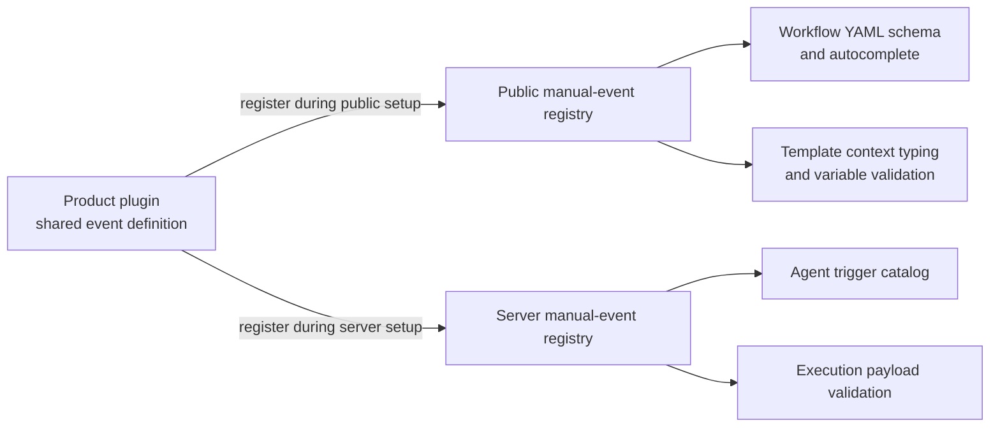
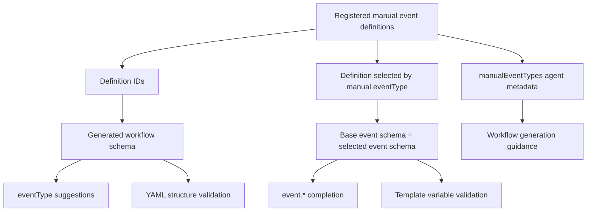
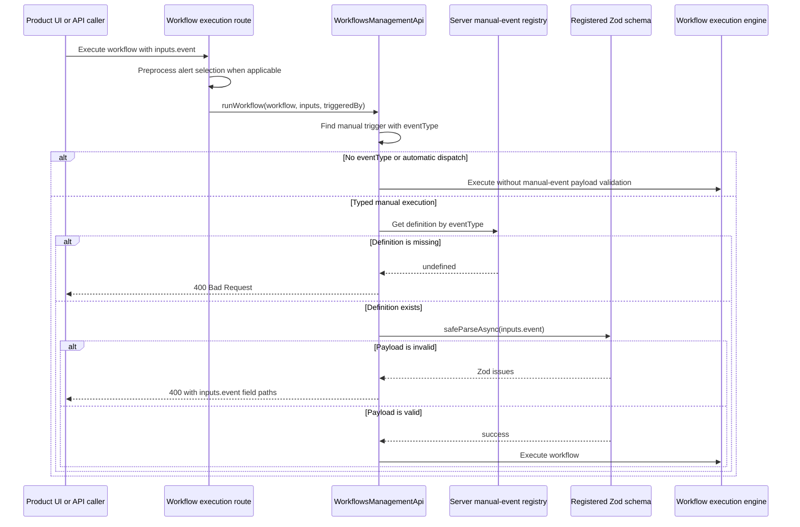
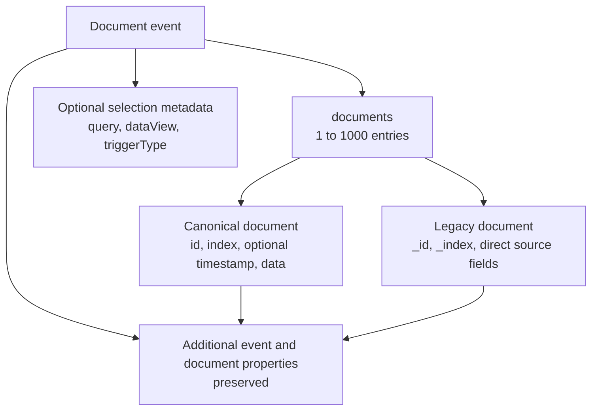

# Typed manual workflow event contracts

This document explains the architecture introduced by
[PR #286086](https://github.com/elastic/kibana/pull/286086). The change lets a workflow
declare the shape of the event payload supplied by a product when that product explicitly runs the
workflow.

## Problem

Manual workflows previously accepted `inputs.event`, but the workflow did not identify which
product contract the payload followed. As a result:

- the YAML editor could not offer product-specific `event.*` fields;
- workflow validation could not check references to product event fields;
- workflow-generation agents could not discover the available manual event shapes; and
- the server accepted malformed product payloads until a step failed while using them.

The new optional `eventType` property connects a manual trigger to a registered Zod event schema:

```yaml
triggers:
  - type: manual
    eventType: cases.case

steps:
  - name: log_case
    type: console
    with:
      message: "Case {{ event.caseId }}"
```

`eventType` is a contract selector, not a new trigger. The workflow still runs only when a caller
explicitly executes it. Registering a manual event definition does not emit events, subscribe the
workflow to events, or change event-driven dispatch.

## Architecture

A product owns one shared `ManualWorkflowEventDefinition` and registers that definition during both
the public and server plugin setup lifecycles.



The common definition contains four fields:

```ts
interface ManualWorkflowEventDefinition<EventSchema extends z.ZodType = z.ZodType> {
  id: string;
  eventSchema: EventSchema;
  title: string;
  description: string;
}
```

- `id` is the stable, globally unique value written to workflow YAML.
- `eventSchema` is the Zod object schema for `inputs.event`.
- `title` and `description` provide human-readable discovery metadata.

### Registry lifecycle and invariants

Both registries:

- accept registrations only during plugin setup and freeze when the plugin starts;
- reject duplicate IDs;
- require a Zod object schema;
- require non-empty titles and descriptions; and
- require a namespaced ID such as `cases.updated`, with a maximum length of 512 characters.

The public registry additionally accepts an async loader so a product can keep its event definition
out of its initial browser bundle. `workflows_management` waits for the public extensions registry
before creating application services.

Two platform definitions are registered automatically:

- `workflows.alert`, backed by the existing `AlertEventSchema`;
- `workflows.document`, backed by the new `DocumentEventSchema`.

## Authoring and discovery flow

Registered definitions are used in two related but distinct ways: the definition IDs describe the
manual trigger itself, while the selected definition's schema describes `event.*`.



### YAML schema generation

The workflow schema builders now receive the registered manual event IDs. For `type: manual`, they
generate `eventType` as a union of:

1. an enum containing the currently registered IDs, which supplies editor suggestions; and
2. a bounded string fallback, which preserves compatibility with workflows whose definition is not
   currently registered.

This fallback is intentional. An unknown `eventType` remains parseable and can be edited, restored
from change history, or loaded when an optional product plugin is unavailable. A manual execution
using that unknown type is rejected by the server.

Workflow validation also rejects a definition containing more than one manual trigger with an
`eventType`. A workflow may still contain multiple untyped manual triggers or combine one typed
manual trigger with scheduled, alert, or event-driven triggers.

### Event context typing

When the editor sees a manual trigger with `eventType`, it looks up the public definition and
combines its object shape with the base event context. This makes nested values such as
`event.case.id` available to autocomplete and template validation.

Manual events do not receive the event-driven `timestamp` field. Custom event-driven triggers keep
their existing behavior, including timestamp typing.

Schema-path traversal now understands open Zod objects and records. This is important for document
events because both of these paths are valid:

```text
event.documents[0].data.arbitraryField
event.documents[0].legacySourceField
```

### Agent metadata

The trigger-definition tools now fetch manual event definitions as well as trigger definitions.
Their response for the built-in `manual` trigger includes:

- the generated trigger schema containing `eventType`;
- a `manualEventTypes` list with each ID, label, description, and event context JSON Schema; and
- guidance to choose an `eventType` when the workflow expects a typed product payload.

Both Agent Builder workflow integrations use the same shared formatter, so editor and agent
guidance derive from the same registrations.

## Runtime execution flow

Payload validation happens immediately before a manual workflow is handed to the execution engine.



Validation applies to direct manual execution and test execution. It runs after route-level alert
preprocessing, so `workflows.alert` validates the expanded alert event rather than the UI's compact
alert ID selection. The gate is called by `runWorkflow` (including `executeWorkflow`) and
`testWorkflow`; scheduling, bulk scheduling, and managed-workflow execution paths call the
execution engine without this manual-event validation. Test execution has no automatic-dispatch
marker, so it always applies the typed manual contract when one is declared.

The server:

1. finds manual triggers that declare `eventType`;
2. rejects more than one typed manual trigger as a defensive check;
3. skips manual payload validation when `triggeredBy` identifies a non-manual dispatch;
4. resolves the event definition from the server registry;
5. runs `safeParseAsync` against `inputs.event`; and
6. converts missing definitions and Zod failures into
   `ManualWorkflowEventValidationError`.

The parse is a validation gate: the original event object, rather than Zod's parsed output, is
passed to the execution engine. This preserves caller-supplied compatibility fields and avoids
silently applying schema transforms or defaults at the API boundary.

Workflow routes return that error as HTTP 400. Validation messages retain precise paths, for
example:

```text
Invalid payload for manual workflow event type "cases.updated":
inputs.event.case.id: Invalid input: expected string, received undefined
```

The execution engine is not called after a validation failure.

## Generic alert and document contracts

### `workflows.alert`

The alert contract reuses `AlertEventSchema`. Its event includes:

- `alerts`;
- `rule`;
- `params`; and
- `spaceId`.

The schema remains intentionally permissive for evolving alert documents: alert entries and
`params` may contain values not modeled by the current Zod schema.

The existing alert execution route still accepts a compact UI selection containing alert IDs and
indices. It fetches and expands those alerts, builds the canonical alert event, and then passes that
event through the new runtime validation.

### `workflows.document`

The document contract introduces a canonical envelope for running workflows against selected
Elasticsearch documents:

```yaml
event:
  documents:
    - id: document-1
      index: logs-*
      timestamp: 2026-08-18T12:00:00.000Z
      data:
        message: hello
  query: "message: hello"
  dataView: logs-*
```



The schema is deliberately bounded but open:

- the `documents` array must contain between 1 and 1,000 entries;
- typed IDs, index names, timestamps, query text, data-view names, and data field names have explicit
  length bounds;
- canonical documents require `id`, `index`, and `data`;
- legacy documents with `_id` and `_index` remain valid;
- `_id` and `_index` aliases are accepted on canonical documents; and
- passthrough properties preserve direct `_source` fields and existing product-specific metadata.

Because the legacy union branch treats other fields as passthrough data, a legacy document may
contain source fields named `id`, `index`, `timestamp`, or `data` with non-canonical types. This is
intentional migration compatibility; only documents using the canonical branch receive canonical
field validation.

The Discover hit-selection builder now emits the canonical fields and compatibility fields
together: `id`/`index`/`data`, `_id`/`_index`, and direct source properties. Existing templates can
continue reading direct fields while new workflows can use the stable `data` envelope.

## Compatibility and scope

The change is additive for workflow definitions:

- `eventType` is optional;
- untyped manual workflows retain their permissive event behavior;
- registered IDs are suggestions, not a closed enum;
- legacy document aliases and direct source fields remain accepted; and
- automatic trigger scheduling does not use the manual event registry;
- `scheduleWorkflow`, `bulkScheduleWorkflow`, and managed-workflow execution remain outside the
  runtime validation gate; and
- route preprocessing failures, such as missing selected alerts, remain separate from contract
  validation errors.

The following concepts remain separate:

- **Manual event definition:** describes a payload supplied during explicit execution.
- **Event-driven trigger definition:** subscribes workflows to emitted events.
- **Manual `inputs`:** user-declared parameters available through `inputs.*`.
- **Manual `event`:** product-supplied context available through `event.*`.
- **`executionContext`:** a separate correlation reference; it is not exposed to templates.

## Registering a product event

Define the contract in code shared by the product's public and server plugins:

```ts
import { i18n } from '@kbn/i18n';
import type { ManualWorkflowEventDefinition } from '@kbn/workflows-extensions/common';
import { z } from '@kbn/zod/v4';

export const caseManualEventDefinition: ManualWorkflowEventDefinition = {
  id: 'cases.case',
  eventSchema: z.object({
    caseId: z.string(),
    owner: z.string(),
  }),
  title: i18n.translate('cases.manualWorkflowEvent.title', {
    defaultMessage: 'Case',
  }),
  description: i18n.translate('cases.manualWorkflowEvent.description', {
    defaultMessage: 'Runs manually from a case.',
  }),
};
```

Register the same definition during both setup lifecycles:

```ts
plugins.workflowsExtensions.registerManualWorkflowEventDefinition(caseManualEventDefinition);
```

Public and server registration must remain aligned:

- the public schema controls authoring guidance;
- the server schema is authoritative for execution validation.

## Test coverage added by the PR

The change adds focused Jest coverage for:

- manual trigger parsing, registered-ID suggestions, and the single-typed-trigger invariant;
- canonical, legacy, open, and bounded document event payloads;
- public and server registry validation, duplicate detection, async loading, and lifecycle freezing;
- generated workflow schemas and open `event.documents[*]` variable paths;
- editor event-context typing and unknown-definition fallback;
- agent trigger metadata for registered manual event types;
- alert and document selection payload construction;
- direct, test, and automatic execution paths;
- missing definitions, malformed payloads, and field-level validation messages; and
- HTTP 400 conversion without starting the execution engine.

## Main implementation locations

- Shared trigger and event schemas:
  `src/platform/packages/shared/kbn-workflows/spec/schema/triggers/`
- Shared definition type and built-in definitions:
  `src/platform/plugins/shared/workflows_extensions/common/`
- Public and server registries:
  `src/platform/plugins/shared/workflows_extensions/{public,server}/manual_workflow_event_registry/`
- Workflow schema generation:
  `src/platform/plugins/shared/workflows_management/common/schema.ts`
- Editor context construction:
  `src/platform/plugins/shared/workflows_management/public/features/workflow_context/lib/get_workflow_context_schema.ts`
- Agent trigger metadata:
  `src/platform/plugins/shared/workflows_management/common/build_trigger_definitions_for_agent.ts`
- Runtime payload validation:
  `src/platform/plugins/shared/workflows_management/server/api/workflows_management_api.ts`
- Route error mapping:
  `src/platform/plugins/shared/workflows_management/server/api/routes/utils/route_error_handlers.ts`
