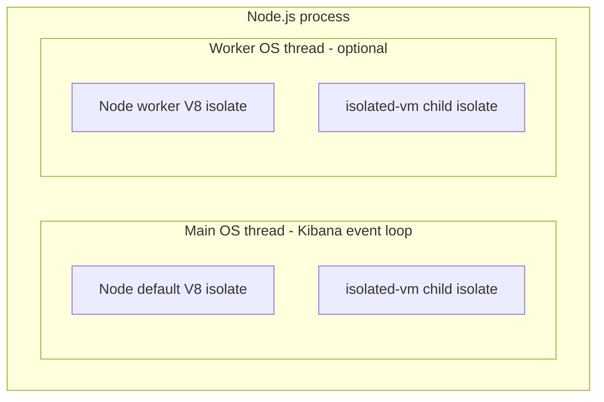

# `isolated-vm` without `worker_threads`: threading and infinite-loop analysis

Analysis for the `scripts.javaScript` step (`workflows_extensions`).  
Context: Kibana crash `Assertion failed: (environment != nullptr), function GetCurrent, file environment.h, line 202` when combining `worker_threads` + `isolated-vm` on forced teardown (`worker.terminate()`).

---

## Short answers

| Question | Answer |
|---|---|
| Does `isolated-vm` without a worker run in a **separate thread**? | **No** (not by default). It runs in a **separate V8 isolate** (separate heap/GC), usually on the **same OS thread** that called it. |
| Can you still stop an infinite loop without a worker? | **Yes**, via `script.runSync({ timeout })` or `script.run({ timeout })`. V8 interrupts execution after the timeout. |
| Is that safe for Kibana on the main thread? | **Partially.** Timeout stops the script, but **`runSync` blocks the Node event loop** for up to the timeout duration. |
| Should we drop the worker? | **Likely yes** for stability (avoids `worker.terminate()` + `isolated-vm` teardown crash), but you trade event-loop blocking unless you use **`script.run()` async** (thread pool). |

---

## Terminology: isolate ≠ thread

These are different isolation mechanisms:



| Concept | What it isolates | OS thread |
|---|---|---|
| **V8 isolate** (`isolated-vm`) | Heap, GC, global objects | Runs on whichever thread invokes `runSync` / `run` |
| **`worker_threads`** | Entire Node environment + heap | **Dedicated OS thread** |
| **Child process** | Full process memory, fds, etc. | Separate process |

`isolated-vm` README comparison table marks it as **Isolated: yes**, **Multithreaded: yes** — but “multithreaded” refers to async APIs delegating to a **libuv thread pool**, not “every script automatically runs on its own thread.”

---

## What happens without `worker_threads`

Current implementation ([`execute_script_in_isolate.js`](./execute_script_in_isolate.js)) uses:

```javascript
compiled.runSync(ivmContext, { timeout: PING_TIMEOUT_MS, copy: true });
```

If this runs on the **Kibana main thread** (handler calls it directly):

### Memory

- **Still enforced during execution** via `new ivm.Isolate({ memoryLimit: 8 })`.
- Child isolate heap is separate from the main Kibana heap.
- A memory bomb is killed inside the isolate (soft cap ~8 MB, hostile code may use more before termination per `isolated-vm` docs).

### Infinite loops / long CPU

- **`timeout` on `runSync`** tells V8 to interrupt the script after N ms.
- A `while (true) {}` loop **will stop** after `PING_TIMEOUT_MS` (3 s today).
- **But:** for those 3 seconds the **main thread is blocked** inside `runSync`.
  - No other JavaScript on that thread runs (HTTP handlers, Task Manager callbacks, timers, etc.).
  - In Kibana this is a **latency / availability** problem, not a “script runs forever” problem.

### `console.log` bridge

- `log.applySync` callbacks run on the **same thread** as the isolate.
- During `applySync`, that thread is still blocked.
- No `worker.terminate()` race — cleanup is `isolate.dispose()` in `finally`, which is the supported path.

### Async alternative: `script.run()` instead of `runSync`

From `isolated-vm` docs:

> Synchronous functions will **block your thread** while the method runs.  
> Asynchronous functions return a Promise while the work runs in a **separate thread pool**.

| API | Blocks caller thread? | Timeout works? | Fits async step handler? |
|---|---|---|---|
| `runSync({ timeout })` | **Yes** — entire timeout window | Yes | Awkward (blocks event loop) |
| `run({ timeout })` | **No** — uses thread pool | Yes | **Good** — `await script.run(...)` |
| `runIgnored({ timeout })` | Fire-and-forget | Yes | Poor (swallows errors) |

**Recommendation if dropping the worker:** switch to **`await compiled.run(context, { timeout, copy: true })`** so script CPU time happens off the main event loop, while keeping memory limits and clean `dispose()`.

---

## What the worker added (and why it crashes)

Current stack:

```
javascript_script_runner.ts
  → new Worker(javascript_worker.js)
      → execute_script_in_isolate.js
          → isolated-vm
```

### Benefits of the worker

| Benefit | Explanation |
|---|---|
| **Event-loop isolation** | `runSync` blocking happens on worker thread, not Kibana main thread |
| **Blast radius** | Worker OOM (`ERR_WORKER_OUT_OF_MEMORY`) can be contained |
| **Ping watchdog** | If worker event loop is wedged, parent can `worker.terminate()` |

### Why it crashes Kibana

On timeout, abort, or cancel, the runner calls **`worker.terminate()`** — a **hard thread kill**.

If the worker is inside `runSync`, `log.applySync`, or `isolate.dispose()`, `isolated-vm` native teardown races with Node worker shutdown. This matches [isolated-vm issue #464](https://github.com/laverdet/isolated-vm/issues/464):

> GC timing unfortunate during **teardown of a NodeJS worker thread** that runs code in a **separate isolate**.

Result: `environment != nullptr` assertion → **whole process abort**.

The workflow log you saw:

```
Marked workflow execution … FAILED after workflow:run retry (attempts=2) - prior run was interrupted
```

is **task recovery after the crash**, not the cause ([`task_recovery.ts`](../../../../workflows_execution_engine/server/lib/task_recovery.ts)).

---

## Can you prevent infinite running without a worker?

**Yes.** Three independent mechanisms:

| Mechanism | Without worker | With worker (today) |
|---|---|---|
| **`isolated-vm` `timeout`** | Stops script in isolate after N ms | Same, but on worker thread |
| **Workflow `abortSignal`** | Must cooperatively end `await run()` or still block if `runSync` | `worker.terminate()` — **crash risk** |
| **Ping watchdog** | Not needed if using `run()` async on thread pool | Parent kills worker — **crash risk** |

For `while (true) {}`:

- **`runSync` + timeout on main thread:** script stops in 3 s, **main thread blocked 3 s**.
- **`run` + timeout (async):** script stops in 3 s, **main event loop free**.
- **Worker + `runSync` + `worker.terminate()`:** script may stop, but **process may crash**.

---

## Option comparison

| Approach | Memory limit (during run) | Stops infinite loop | Main thread blocked | Kibana crash risk (known) |
|---|---|---|---|---|
| `node:vm` only | Unreliable | VM timeout only | Yes (same thread) | Low |
| `worker_threads` + `node:vm` | Unreliable | Ping + VM timeout | No | Low |
| **`worker_threads` + `isolated-vm`** (current) | **Yes** | Yes | No | **High** on `worker.terminate()` |
| **`isolated-vm` + `runSync` on main** | **Yes** | Yes | **Yes** (up to timeout) | Low |
| **`isolated-vm` + `run()` async on main** | **Yes** | Yes | **No** (thread pool) | Low |
| **Child process** + vm/isolate | Yes (with OS limits) | Yes (kill process) | No | Low (worker process dies) |

---

## Recommendations

### 1. Preferred fix for stability: drop `worker_threads`, keep `isolated-vm`

- Call `executeScriptInIsolate` from the step handler on the main thread.
- **Use `script.run()` (async) with `timeout`**, not `runSync`, to avoid blocking the event loop.
- Keep `isolate.dispose()` in `finally`.
- Rely on workflow `abortSignal` to reject the pending promise (cannot interrupt `runSync` mid-flight without isolate APIs; async `run` is easier to race with cancellation).
- Remove ping watchdog and `worker.terminate()` — they become unnecessary and were the crash vector.

### 2. If you must keep a worker

- Do **not** call `worker.terminate()` while an isolate may be active.
- Add a `{ type: 'cancel' }` message; worker disposes isolate and exits cleanly.
- Only `terminate()` after a grace period if worker does not exit.

### 3. Kibana startup flag

`isolated-vm` requires `--no-node-snapshot` on Node 20+. Worth adding to Kibana `NODE_OPTIONS`, but it does **not** fix the worker-teardown race by itself.

---

## Summary

- **`isolated-vm` without `worker_threads` does not give you a separate OS thread** if you use `runSync` — it gives a **separate V8 heap** on the calling thread.
- **Infinite loops are stoppable** via `timeout` on `runSync` or `run`, without a worker.
- **Without a worker, `runSync` blocks Kibana's event loop** for up to the timeout; use **`script.run()` async** to avoid that.
- **The worker was protecting the event loop but introduced a fatal native crash** when combined with forced `worker.terminate()` during `isolated-vm` teardown.
- **Dropping the worker and using async `isolated-vm` run** is the most balanced fix: real memory limits, loop timeout, no teardown race, no event-loop blocking.

---

## References

- [`execute_script_in_isolate.js`](./execute_script_in_isolate.js) — current sandbox
- [`javascript_script_runner.ts`](./javascript_script_runner.ts) — worker + ping watchdog
- [isolated-vm README](https://github.com/laverdet/isolated-vm) — `timeout`, sync vs async, memory limits
- [isolated-vm #464 — environment can be null on worker teardown](https://github.com/laverdet/isolated-vm/issues/464)
- [`task_recovery.ts`](../../../../workflows_execution_engine/server/lib/task_recovery.ts) — “prior run was interrupted” log
