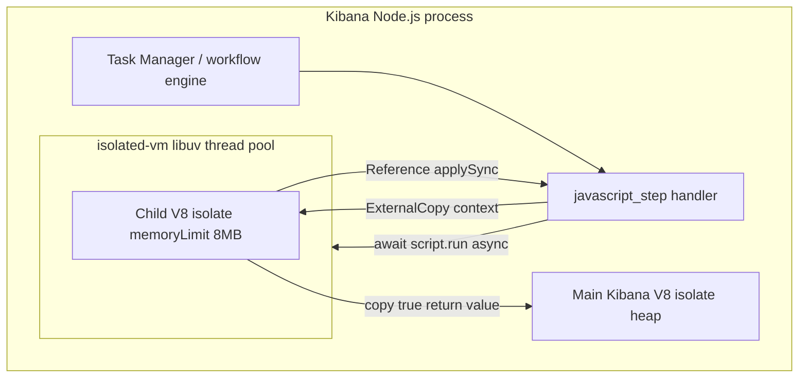

# `scripts.javaScript` — security and ship-readiness analysis

Analysis of the current implementation:

- `[execute_script_in_isolate.ts](./execute_script_in_isolate.ts)`
- `[javascript_step.ts](./javascript_step.ts)`
- Engine integration via `[custom_step_impl.ts](../../../../workflows_execution_engine/server/step/custom_step_impl.ts)` and `[node_implementation.ts](../../../../workflows_execution_engine/server/step/node_implementation.ts)`

**Date:** 2026-06-15  
**Question:** Are we safe to ship? Will hostile scripts crash the main Kibana process?

---

## Executive summary


| Question                                               | Answer                                                                                                                                                          |
| ------------------------------------------------------ | --------------------------------------------------------------------------------------------------------------------------------------------------------------- |
| **Safe to ship as-is?**                                | **No — not without additional hardening.**                                                                                                                      |
| **Will it crash the main process in the common case?** | **Unlikely** compared to the prior `worker_threads` + `worker.terminate()` design. Teardown uses `isolate.dispose()` in `finally`, which is the supported path. |
| **Can it still crash or take down Kibana?**            | **Yes, in edge cases** — catastrophic isolate OOM defaults to `process.abort()`, and `--no-node-snapshot` is not wired into Kibana startup.                     |
| **Is arbitrary code execution contained?**             | **Partially.** No `require` / `process` / `fetch` in the child isolate, but scripts can burn CPU/memory and invoke host callbacks (`__logBridge__`).            |
| **Who can run scripts?**                               | Users with **Enterprise** license and `**workflow_execute`** (or broader workflow write) privileges who can author or trigger workflows containing this step.   |


**Recommendation:** Treat as **experimental / behind a flag** until the blockers in [§6 Required before ship](#6-required-before-ship) are addressed.

---

## Mitigations implemented (2026-06-15)

| Control | Implementation |
|---|---|
| **Console-only logging** | `__logBridge__` is set during setup, captured in a closure for `globalThis.console`, then removed via `jail.delete('__logBridge__')`. User scripts see only `console.*`. |
| **Log volume cap** | Host-side silent drop after **100** total `console.*` emissions per script run (`MAX_CONSOLE_LOG_COUNT`). Step does not fail when cap is exceeded. |
| **Script CPU timeout** | `compiled.run({ timeout: 5000 })` — 5 s hard limit (`SCRIPT_EXECUTION_TIMEOUT_MS`). |

**Residual risk after mitigations:** Tight `console.*` or `applySync` loops can still burn CPU until the 5 s timeout. String-based memory bombs are still not reliably blocked by `memoryLimit: 8`.

---

## Architecture (current)




| Property             | Value                                                                    |
| -------------------- | ------------------------------------------------------------------------ |
| Isolation mechanism  | Separate V8 isolate (`isolated-vm`)                                      |
| OS thread            | Script CPU runs on **libuv thread pool**, not a dedicated worker process |
| Memory cap (isolate) | `memoryLimit: 8` (MB)                                                    |
| Script API           | `compiled.run(ctx, { copy: true, promise: true })` — **no `timeout`**    |
| Cancellation         | `abortSignal` → `isolate.dispose()`                                      |
| Cleanup              | `isolate.dispose()` in `finally`                                         |
| Host bridges         | `console.*` → step logger; full `StepContext` copied in                  |


---

## Threat model

### Attacker profile

- Authenticated Kibana user who can **create/update workflows** and **execute** them.
- Minimum bar: Enterprise license + `workflow_execute` sub-feature privilege (`[features.ts](../../../../workflows_management/server/features.ts)`).

### Attacker goals

1. Escape sandbox → read secrets, call Kibana APIs, RCE.
2. Deny service → CPU, memory, logs, thread pool exhaustion.
3. Crash Kibana process.

### Out of scope (assumed controls)

- Platform authn/authz for workflow APIs.
- Space isolation for workflow definitions.
- Approved handler hash gate (`[approved_step_definitions.ts](../../../test/scout/api/fixtures/approved_step_definitions.ts)`).

---

## What is well defended

### 1. No worker `terminate()` crash vector

Dropping `worker_threads` and using `isolate.dispose()` removes the known `environment != nullptr` native abort when killing a worker mid-isolate (`[isolated_vm_without_worker_analysis.md](./isolated_vm_without_worker_analysis.md)`, [isolated-vm #464](https://github.com/laverdet/isolated-vm/issues/464)).

**Verdict:** Major stability improvement over the previous design.

### 2. No direct Node.js API access in the isolate

Reproduction (child isolate):


| Probe            | Result      |
| ---------------- | ----------- |
| `typeof require` | `undefined` |
| `typeof process` | `undefined` |
| `typeof fetch`   | `undefined` |


**Verdict:** No trivial escape to Node builtins.

### 3. Wrapper breakout is not a clean escape

Injecting `})(); … //` into user script produces a **syntax error** (`Illegal return statement`), not host code execution.

**Verdict:** Naive wrapper escape fails. (This is not a formal proof against all parser tricks; see [§4.3](#43-script-injection-into-wrapper).)

### 4. Prototype pollution stays in the child isolate

`Object.prototype.pwned = true` inside the script does not affect the main Kibana isolate.

### 5. Workflow cancellation stops tight loops (when abort fires)

`while (true) {}` + `abortSignal` after 100 ms → step returns cancellation error (covered by unit tests).

Engine monitoring (`[run_node.ts](../../../../workflows_execution_engine/server/workflow_execution_loop/run_node.ts)`) races step execution with timeout/cancel monitors and aborts `stepExecutionRuntime.abortController`.

### 6. Oversized **return values** are rejected after copy (Layer 2)

`[node_implementation.ts](../../../../workflows_execution_engine/server/step/node_implementation.ts)` enforces `max-step-size` (default **10 MB**) on serialized output **after** `_run` returns.

A `return 'A'.repeat(50MB)` is copied into the main process, then the step fails with `StepSizeLimitExceeded` — it does not persist, but see [§4.2](#42-copy-true-copies-return-values-onto-the-main-heap).

### 7. `ArrayBuffer` bombs are limited inside the isolate

`new ArrayBuffer(100MB)` inside the isolate fails with `Array buffer allocation failed` — the strictest part of `memoryLimit`.

---

## Vulnerabilities and gaps

### 4.1 `memoryLimit: 8` does not reliably cap string heap usage

**Severity:** High (DoS)  
**Main process crash:** No (isolate only), unless catastrophic OOM path triggers [§4.6](#46-catastrophic-oom-can-abort-the-process).

**Observed behavior:**

```js
const chunks = 'A'.repeat(1024 * 1024 * 100);
return chunks.length; // succeeds — returns 104857600
```

Meanwhile:

```js
new ArrayBuffer(1024 * 1024 * 100); // fails inside isolate
```

**Root cause (isolated-vm internals):**

- `memoryLimit` is enforced primarily via a custom `**ArrayBuffer::Allocator`** and **deferred heap checks** after GC.
- V8 **string** allocations can exceed the nominal cap; isolated-vm documents the limit as a **guideline** (hostile code may use **2–3×** before termination).
- `NearHeapLimitCallback` can extend V8 heap headroom by **+1 GB** before hard termination.
- Post-run heap checks in `HeapCheck::Epilogue` run only when **ArrayBuffer-backed memory changed**, so pure-string scripts may skip that path.

**Impact:** Single-script transient heap spikes (~100 MB+) inside the child isolate; repeated runs amplify pressure on the **process** (native heap + thread pool), even though the main V8 heap is separate.

---

### 4.2 `copy: true` copies return values onto the main heap

**Severity:** Medium–High (DoS)  
**Main process crash:** Unlikely single-shot; possible under concurrency + large copies.

`script.run({ copy: true })` **serializes the script result into the main Node isolate** before Layer 2 size checks.

Sequence for `return 'A'.repeat(50MB)`:

1. ~50 MB allocated in child isolate (may succeed — see §4.1).
2. ~50 MB copied into main process during `copy`.
3. Layer 2 rejects output > 10 MB default.
4. Main heap briefly held large allocation + serialization work.

**Impact:** Memory pressure and GC churn on the **Kibana main heap**, not a stable crash, but exploitable with parallel workflow runs.

---

### 4.3 Script injection into wrapper

**Severity:** Low (today)  
**Main process crash:** No

Current wrapper:

```ts
(async function () {
  ${script}
})()
```

User script is **concatenated**, not passed as a string literal. Malicious content can break out of the intended function body in theory (e.g. injecting `})` sequences).

Today, tested breakout attempts fail at **compile** or **parse** time rather than executing host code. This should be monitored; safer pattern is `compileScript` on user code wrapped via `new ivm.Script` with explicit function boundary or `evalClosure` with no string interpolation.

---

### 4.4 Exposed host reference: `__logBridge__` — mitigated

**Severity:** Medium (DoS) — **partially mitigated**  
**Main process crash:** No

**Previous risk:** `__logBridge__` was left on the jail global; user scripts could call `applySync` directly.

**Current behavior:** Bridge is installed via `jail.set`, console closures capture it in a local `logBridge` const, then `jail.delete('__logBridge__')` removes global access. Scripts only have `console.*`.

**Remaining risk:** Log flooding is capped at 100 emissions (silent drop thereafter). CPU burn from continued `console.*` calls is bounded by the 5 s script timeout, not by the log cap alone.

---

### 4.5 Script execution timeout — mitigated

**Severity:** High (DoS) — **mitigated**  
**Main process crash:** No  
**Event loop:** No block (async `run` uses thread pool)

Current code:

```ts
compiled.run(ivmContext, {
  copy: true,
  promise: true,
  timeout: SCRIPT_EXECUTION_TIMEOUT_MS, // 5_000
});
```

| Attack | Stops when |
|---|---|
| `while (true) {}` | **5 s** (`Script execution timed out.`) or earlier via `abortSignal` |
| `await new Promise(() => {})` | Same |
| `for(;;) console.log('x')` | 5 s timeout; only first 100 logs persisted |

Per-step YAML `timeout:` and workflow `settings.timeout` can still abort earlier via `abortSignal`.

---

### 4.6 Catastrophic OOM can `abort()` the process

**Severity:** Critical (ship blocker)  
**Main process crash:** **Yes**

`isolated-vm` README:

> If you receive [a catastrophic error] you should log the error, stop serving requests, finish outstanding work, and end the process by calling `process.abort()`.

Native `OOMErrorCallback` in isolated-vm calls `abort()` when no `onCatastrophicError` handler is registered.

Current code:

```ts
const isolate = new ivm.Isolate({ memoryLimit: SCRIPT_MEMORY_LIMIT_MB });
// onCatastrophicError: not set
```

**Impact:** A pathological heap state inside the child isolate can **terminate the entire Kibana process**, not just the workflow step.

**Mitigation:** Provide `onCatastrophicError` that logs, marks isolate dead, and **does not** call `process.abort()` unless product policy explicitly accepts process-level failure (isolated-vm itself warns this state may be unrecoverable).

---

### 4.7 Missing `--no-node-snapshot` in Kibana startup

**Severity:** High (ship blocker for Node 20+)  
**Main process crash:** Possible at isolate creation / first use

`isolated-vm` requires `NODE_OPTIONS=--no-node-snapshot` on Node 20+. Kibana 9.x uses Node 24; repo `NODE_OPTIONS` does not include this flag (`[.buildkite/scripts/common/env.sh](../../../../../../../.buildkite/scripts/common/env.sh)` sets only `--max-old-space-size`).

**Impact:** Runtime failures or undefined behavior when the step is first exercised in a real server process (tests pass only because Jest sets the flag manually).

---

### 4.8 Host data copied into the sandbox

**Severity:** ~~Medium (data exposure) / Medium (memory)~~ **Mitigated**  
**Main process crash:** No

**Mitigation:** No workflow or step input is copied into the isolate. The sandbox receives only the script source and a transient `__logBridge__` reference used to install `console.*` (removed from the global object before user code runs). User scripts cannot read `[StepContext](../../../../../../packages/shared/kbn-workflows/spec/schema.ts)`, step `with:` values, or any other host-supplied data.

**Residual risk:** Scripts can still return arbitrarily large values (subject to `max-step-size`) and allocate memory inside the isolate.

---

### 4.9 No script source size limit

**Severity:** Low–Medium  
**Main process crash:** No

`config.script` is an unbounded string. Very large scripts increase compile time and memory at compile time on the main thread (before `run`).

---

### 4.10 Concurrent executions multiply resource use

**Severity:** Medium  
**Main process crash:** Under sustained attack, possible via cumulative memory / thread pool / catastrophic OOM

Each workflow execution creates its own isolate. No global concurrency cap for script steps. N parallel runs ≈ N × (isolate overhead + peak allocations + thread-pool occupancy).

---

## Main-process crash risk matrix


| Scenario                                         | Crashes main Kibana process? | Notes                                                             |
| ------------------------------------------------ | ---------------------------- | ----------------------------------------------------------------- |
| Infinite `while(true)` loop                      | **No**                       | Burns thread-pool CPU until abort; event loop stays free          |
| `worker.terminate()` during isolate (old design) | **Yes**                      | **Removed** in current design                                     |
| `isolate.dispose()` on cancel / `finally`        | **No**                       | Supported teardown path; unit tests pass                          |
| Catastrophic isolate OOM                         | **Yes**                      | `abort()` without `onCatastrophicError` handler                   |
| Missing `--no-node-snapshot`                     | **Possible**                 | Environment-dependent                                             |
| Return 50 MB string                              | **No** (usually)             | Brief main-heap spike; step fails size check                      |
| `ArrayBuffer` OOM in isolate                     | **Rare / edge**              | Typically throws inside isolate; catastrophic path if V8 gives up |
| `__logBridge__` spam                             | **No**                       | Bridge removed from global; log cap at 100                        |
| Malicious wrapper escape to `require`            | **No** (today)               | Tested probes undefined                                           |


**Bottom line for “shouldn’t crash the main process anyhow”:** The design is **directionally correct** (no hard thread kill), but **cannot be guaranteed** until catastrophic OOM handling and Node startup flags are fixed.

---

## Comparison to prior worker-based design


|                              | Worker + `terminate()`         | Current (async `run`, `dispose`)              |
| ---------------------------- | ------------------------------ | --------------------------------------------- |
| Event-loop blocking          | No                             | No                                            |
| Known native crash on cancel | **High**                       | **Low**                                       |
| Memory limit (strings)       | Soft                           | Soft (same underlying isolated-vm)            |
| CPU hang without timeout     | **5 s** script timeout       | Until abort if step/workflow timeout is shorter                   |
| Process OOM                  | Worker may die                 | Catastrophic path can `abort()` whole process |


---

## Required before ship

Priority ordered:

1. **Add `--no-node-snapshot` to Kibana `NODE_OPTIONS`** for all server processes (dev, CI, production).
2. **Register `onCatastrophicError`** on `new ivm.Isolate({...})` — log, dispose, fail step; avoid `process.abort()` unless security accepts full restart.
3. ~~**Add `timeout` to `compiled.run()`**~~ — **Done:** 5 s default (`SCRIPT_EXECUTION_TIMEOUT_MS`).
4. **Cap `config.script` size** (e.g. 256 KB–1 MB) before compile.
5. **Document `memoryLimit` limitations** for workflow authors; consider rejecting or bounding large string patterns if feasible.
6. ~~**Hide `__logBridge__` from global**~~ — **Done:** setup + `jail.delete`; console-only access.
7. **Feature flag / `stability: experimental`** until soak testing completes.
8. **Consider** output size check *before* `copy: true` (e.g. return handle + size probe) to reduce main-heap spikes.

---

## Nice to have

- Global concurrency limit for active script isolates per Kibana node.
- `onCancel` handler (redundant if `finally` always runs, but explicit for engine contract).
- Safer wrapper: no string interpolation of user script into source.
- Soak / fuzz tests (OOM, dispose-during-run, concurrent isolates).
- Security review of who may use `scripts.javaScript` in managed vs user-authored workflows.

---

## Test evidence (local reproduction)

Environment: Node 24.14.1, `isolated-vm@6.1.2`, `NODE_OPTIONS=--no-node-snapshot`.


| Test                                        | Result                                                             |
| ------------------------------------------- | ------------------------------------------------------------------ |
| `'A'.repeat(100MB); return length`          | Success (104857600) — **memory limit not enforced for strings**    |
| `new ArrayBuffer(100MB)`                    | `Array buffer allocation failed`                                   |
| `return 'A'.repeat(50MB)` with `copy: true` | Copied to main; would fail Layer 2 `max-step-size` (10 MB default) |
| `while(true)` without abort                 | Still running after 3 s (no `timeout` on `run`)                    |
| `__logBridge__.applySync(...)`              | Host callback invoked                                              |
| `typeof require/process/fetch`              | `undefined`                                                        |


---

## Verdict


| Ship?                      | Condition                                                                                           |
| -------------------------- | --------------------------------------------------------------------------------------------------- |
| **No (current state)**     | Missing startup flag, missing run timeout, catastrophic OOM → `abort()`, soft string memory limits. |
| **Yes (with mitigations)** | After §6 items 1–3 at minimum, plus experimental flag and monitoring.                               |


The move away from `worker.terminate()` **materially reduces** the known Kibana crash. It does **not** yet meet a strict “hostile script must never crash the main process” bar.

---

## References

- `[execute_script_in_isolate.ts](./execute_script_in_isolate.ts)`
- `[javascript_step.ts](./javascript_step.ts)`
- `[isolated_vm_without_worker_analysis.md](./isolated_vm_without_worker_analysis.md)`
- [isolated-vm README — memoryLimit, timeout, `--no-node-snapshot](https://github.com/laverdet/isolated-vm)`
- [isolated-vm #464 — worker teardown](https://github.com/laverdet/isolated-vm/issues/464)
- `[node_implementation.ts](../../../../workflows_execution_engine/server/step/node_implementation.ts)` — Layer 2 output size enforcement
- `[workflows_management/server/features.ts](../../../../workflows_management/server/features.ts)` — privileges

