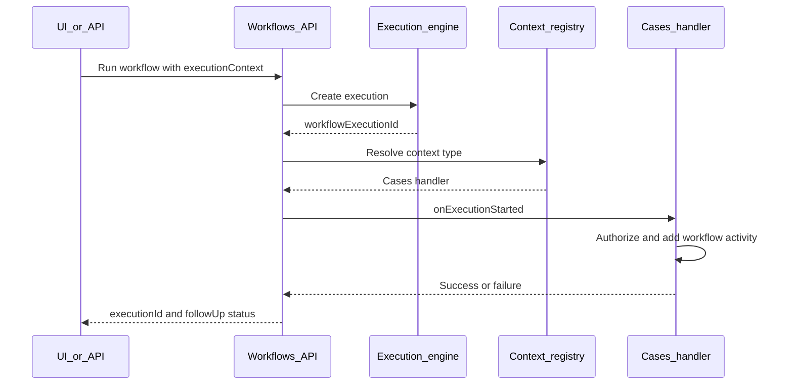

# Context-aware workflow executions

**Status:** Implemented

**Primary owners:** Workflows, Cases

**First consumer:** Cases

## Summary

Workflow executions need a stable way to identify the product entity from which they were started. Today, callers can place arbitrary values in workflow inputs or metadata, but those values are not a supported correlation contract and cannot be efficiently queried.

This implementation adds:

1. A small, typed `executionContext` reference on every execution.
2. Exact context filters on the workflow executions API.
3. An optional server-side lifecycle handler for context-specific follow-up work.
4. `RunWorkflowPanel` support for the same context accepted by the HTTP API.
5. A modular registration pattern so a plugin can add a context without changing Workflows core.

Cases is the first consumer. Case-level runs use `cases.case`; observable and attachment-owned runs use a specific origin with the case as parent. This allows both origin-level and case-wide history and lets Cases add a dedicated `workflow` activity after a workflow starts, regardless of whether the run originated in the UI or through the API.

## Motivation

The existing run path supports:

```json
{
  "inputs": {
    "event": {
      "caseId": "case-123",
      "owner": "securitySolution"
    }
  },
  "metadata": {
    "source": "cases"
  }
}
```

This is insufficient as a context contract:

- `inputs` are workflow data and differ by trigger or caller.
- `metadata` is arbitrary, is not mapped in the executions index, and is omitted from execution list responses.
- `RunWorkflowPanel` does not currently pass metadata.
- There is no supported exact-match API for “all executions associated with this case.”
- UI callbacks are client-only. They do not run when the same workflow is started directly through the API.

## Goals

- Associate a workflow execution with its exact originating entity and an optional queryable parent.
- List executions across workflows for a given context.
- Use the same execution and follow-up behavior for UI and direct API callers.
- Allow the context owner to perform request-scoped follow-up work after an execution ID is created.
- Make new contexts independently registerable, testable, and owned by the providing plugin.
- Preserve current workflow inputs and runtime behavior.
- Keep product-specific logic out of Workflows.

## Non-goals

- Storing arbitrary product state in the execution context.
- Making workflow execution and product follow-up transactional.
- Waiting for a workflow to reach a terminal state.
- Replacing workflow inputs, event payloads, or metadata.
- Adding a generic callback supplied in an HTTP request.

## Terminology

- **Workflow runtime context:** The existing execution snapshot containing `event`, `inputs`, outputs, and engine state.
- **Execution context:** A small reference to the exact product entity associated with the run.
- **Parent context:** An optional one-level reference used to roll specific origins up to a containing entity.
- **Context handler:** Server code registered by the owning plugin to perform optional validation or post-start work.
- **Follow-up:** Work performed after the workflow execution ID has been created, such as adding a case workflow activity.

## Contract

### Shared type

```ts
export interface WorkflowExecutionContext {
  /**
   * Globally unique entity type owned by a plugin.
   * Example: "cases.case".
   */
  type: string;

  /**
   * Space-local identifier of the entity.
   * Example: a case ID.
   */
  id: string;

  /**
   * Optional containing entity used for broader correlation queries.
   * Example: the case containing an observable.
   */
  parent?: {
    type: string;
    id: string;
  };
}
```

Primary and parent fields are non-empty and bounded at the HTTP boundary. Context types should use a plugin-scoped name to avoid collisions. Parent references are intentionally limited to one level.

The reference intentionally contains no arbitrary `data` property. Trigger-specific or attachment-specific values remain in `inputs`; non-queryable correlation details may remain in `metadata`.

### Run API

`POST /api/workflows/workflow/{id}/run`

```json
{
  "inputs": {
    "event": {
      "caseId": "case-123",
      "owner": "securitySolution"
    }
  },
  "executionContext": {
    "type": "cases.observable",
    "id": "observable-789",
    "parent": {
      "type": "cases.case",
      "id": "case-123"
    }
  }
}
```

`executionContext` is optional for backward compatibility.

The successful response remains authoritative once `workflowExecutionId` is present:

```json
{
  "workflowExecutionId": "execution-456",
  "followUp": {
    "status": "succeeded"
  }
}
```

`followUp` is omitted when no context handler ran. If post-start work fails, the route still returns the execution ID:

```json
{
  "workflowExecutionId": "execution-456",
  "followUp": {
    "status": "failed"
  }
}
```

Returning an error after the execution has started would encourage callers to retry and create duplicate executions. The underlying follow-up error is logged server-side; clients may show a warning without treating the workflow start as failed.

### Search API

The cross-workflow execution search accepts an exact context pair:

```http
GET /api/workflows/workflow/executions?contextType=cases.case&contextId=case-123
```

Rules:

- `contextType` and `contextId` must be supplied together.
- Both values are bounded and validated.
- Matching is exact and space-scoped.
- A pair matches either the primary reference or its parent. Querying `cases.case/case-123` therefore includes runs started from the case and from its specific child origins.
- Existing status, time, user, KQL, pagination, and sort filters remain composable.
- Existing `readExecution` and managed-execution authorization remains unchanged.

Execution list items include `executionContext`, allowing a consumer to retain correlation without fetching every execution detail.

## Persistence and querying

The execution document gains a dedicated top-level field:

```json
{
  "id": "execution-456",
  "workflowId": "workflow-789",
  "executionContext": {
    "type": "cases.observable",
    "id": "observable-789",
    "parent": {
      "type": "cases.case",
      "id": "case-123"
    }
  }
}
```

The executions index maps primary and parent properties as keywords:

```ts
executionContext: {
  type: 'object',
  dynamic: false,
  properties: {
    type: { type: 'keyword' },
    id: { type: 'keyword' },
    parent: {
      type: 'object',
      dynamic: false,
      properties: {
        type: { type: 'keyword' },
        id: { type: 'keyword' },
      },
    },
  },
}
```

A dedicated mapping is preferred over `metadata` because:

- arbitrary metadata is deliberately not indexed;
- a fixed mapping avoids mapping explosion;
- callers receive a typed and documented contract;
- the query service can build exact term filters without accepting raw field names.

Existing execution documents have no `executionContext` and simply do not match context-filtered searches. No backfill is required.

## Context handler registry

`workflows_extensions` provides the boundary between generic Workflows code and product-specific behavior.

```ts
export interface WorkflowExecutionContextDefinition<TType extends string = string> {
  type: TType;

  onExecutionStarted?: (params: {
    request: KibanaRequest;
    executionContext: WorkflowExecutionContext & { type: TType };
    workflow: {
      id: string;
      name: string;
    };
    workflowExecutionId: string;
    inputs: Record<string, unknown>;
  }) => Promise<void>;
}
```

Definitions are created with a shared helper so the type literal is retained and registration validation is consistent:

```ts
export const casesExecutionContextDefinition = createWorkflowExecutionContextDefinition({
  type: 'cases.case',
  onExecutionStarted: async (params) => {
    // Cases-owned follow-up.
  },
});

workflowsExtensions.registerExecutionContextDefinition(casesExecutionContextDefinition);
```

The registry is frozen at plugin start, matching the existing workflow step and trigger registries. Duplicate context types are rejected with an error that identifies both registrations.

### Modular ownership model

Each context is a vertical module owned by the plugin that defines the entity. Workflows owns only the base contract, persistence, lookup, and lifecycle dispatch.

Recommended module shape:

```text
<plugin>/
├── common/workflows/execution_context/
│   ├── constants.ts              # stable type id
│   ├── context.ts                # typed factory
│   └── index.ts                  # explicit public exports
├── server/workflows/execution_context/
│   ├── definition.ts             # lifecycle handler
│   ├── register.ts               # setup registration
│   └── definition.test.ts
└── public/workflows/execution_context/
    ├── use_execution_context.ts  # optional UI helper
    └── index.ts
```

Small plugins may colocate these files, but the responsibilities remain separate:

- **Common:** stable type constant and a typed context factory.
- **Server:** authorization and lifecycle side effects.
- **Public:** optional helpers for supplying the context to shared UI.
- **Workflows:** generic storage, querying, and dispatch only.

For example:

```ts
export const CASE_WORKFLOW_EXECUTION_CONTEXT_TYPE = 'cases.case' as const;

export const createCaseWorkflowExecutionContext = (
  caseId: string
): WorkflowExecutionContext & {
  type: typeof CASE_WORKFLOW_EXECUTION_CONTEXT_TYPE;
} => ({
  type: CASE_WORKFLOW_EXECUTION_CONTEXT_TYPE,
  id: caseId,
});

export const createObservableWorkflowExecutionContext = (
  observableId: string,
  caseId: string
): WorkflowExecutionContext => ({
  type: 'cases.observable',
  id: observableId,
  parent: createCaseWorkflowExecutionContext(caseId),
});
```

Call sites use the factory instead of repeating string literals. Renaming or validating a product context therefore remains local to its owner.

### Registration API

The setup contract is intentionally additive:

```ts
interface WorkflowsExtensionsServerPluginSetup {
  registerExecutionContextDefinition(
    definition: WorkflowExecutionContextDefinition
  ): void;
}
```

The start contract exposes read-only resolution to Workflows:

```ts
interface WorkflowsExtensionsServerPluginStart {
  getExecutionContextDefinition(
    type: string
  ): WorkflowExecutionContextDefinition | undefined;
  getAllExecutionContextDefinitions(): WorkflowExecutionContextDefinition[];
}
```

No switch statement, Cases import, or list of known context types exists in Workflows. Adding a context requires only a new plugin-owned module and one setup registration call.

Handlers may close over `core.getStartServices()` when they need start contracts, following the existing lazy workflow step registration pattern. This avoids adding product dependencies to `workflows_management` or `workflows_extensions`.

### Adding another context

To add a context such as a security alert, a plugin:

1. Defines a stable namespaced type, for example `security.alert`.
2. Exports a typed `createAlertWorkflowExecutionContext(alertId)` factory.
3. Optionally implements an `onExecutionStarted` handler in its server module.
4. Registers the definition during plugin setup.
5. Passes the factory result to `RunWorkflowPanel` or the run API.
6. Uses the shared context query hook to list related executions.
7. Tests its own authorization and follow-up behavior with shared registry test utilities.

Steps 3 and 4 are optional when the context is needed only for correlation. Workflows core does not change.

### Extensibility constraints

- A context type has exactly one owner and at most one registered server definition.
- Type IDs are permanent API identifiers and use `<plugin>.<entity>` naming.
- The base indexed shape remains `{ type, id, parent? }`; product fields do not extend the index mapping.
- Context handlers cannot replace execution creation or alter another context handler.
- Lifecycle additions must be added to the generic definition contract rather than as product-specific hooks.
- Registry mocks and a `createWorkflowExecutionContextDefinition` test helper are provided by `workflows_extensions`.

The Workflows server:

1. Validates the request body.
2. Starts and persists the workflow execution.
3. Resolves the handler by `executionContext.type`.
4. Awaits `onExecutionStarted`, if registered.
5. Returns the execution ID and follow-up status.

Unknown context types remain valid correlation references but have no follow-up handler. This keeps context useful to external API consumers without requiring code registration.

## End-to-end flow



Both `RunWorkflowPanel` and external callers use this route. There is no client-only side-effect path.

## Shared UI

`RunWorkflowPanel` gains an optional `executionContext` prop and forwards it through `useRunWorkflow`:

```tsx
<RunWorkflowPanel
  inputs={workflowInputs}
  executionContext={{
    type: 'cases.observable',
    id: observableId,
    parent: { type: 'cases.case', id: caseId },
  }}
  onClose={closePanel}
/>
```

The existing `onExecute` callback keeps its current pre-mutation meaning so existing telemetry and menu-closing consumers do not change behavior.

The shared UI package also exposes a context-scoped query hook:

```ts
useWorkflowExecutions({
  executionContext: { type: 'cases.case', id: caseId },
  statuses,
  page,
  size,
});
```

The hook wraps the structured API parameters. Consumers do not need to construct KQL or know index field names.

This implementation does not require `RunWorkflowPanel` itself to render execution history. Cases may render the returned executions in its own activity or attachments surface.

## Cases integration

### Context choice

Case-level runs use the case as their primary context. Runs started from a more specific entity use that entity as primary and retain the case as parent:

```ts
const caseContext = createCaseWorkflowExecutionContext(caseId);
const observableContext = createObservableWorkflowExecutionContext(observableId, caseId);
const alertContext = createAlertWorkflowExecutionContext(alertId, caseId);
const commentContext = createCommentWorkflowExecutionContext(commentId, caseId);
const attachmentContext = createAttachmentWorkflowExecutionContext(attachmentId, caseId);
```

Cases owns these stable context types:

- `cases.case`;
- `cases.observable`;
- `cases.alert`;
- `cases.alerts`;
- `cases.comment`;
- `cases.attachment`.

The specific ID supports origin-level history while the `cases.case` parent preserves case-wide history. Querying by the case context returns both direct case runs and runs from any of these child origins.

Generic embedded components do not infer their host context. For example, the Security Solution alert table remains Cases-agnostic. Its Cases attachment surface provides an optional resolver that combines a selected alert ID with the enclosing case ID. The alert workflow panel consumes that resolver when present; the same table used elsewhere omits the resolver and remains uncorrelated unless its own host supplies one. Multi-alert runs use the `cases.alerts` collection context rather than attributing the execution to an arbitrary selected alert.

### Activity follow-up

Cases registers the same handler for every Cases context type. After the execution starts, the handler:

1. Gets a request-scoped `CasesClient`.
2. Resolves the case ID from the primary case context or its required `cases.case` parent.
3. Calls `client.userActions.recordWorkflowExecution()` with the case, workflow, execution, and exact origin IDs.
4. Resolves the case and owner through the client rather than trusting an owner from the request body.
5. Persists a standalone Cases user action with `type: 'workflow'`; no attachment or comment saved object is created.
6. Renders the workflow name as a new-tab execution link and names the exact origin type in the activity. Observable details use the configured human-readable type label and render inline. The embedding application may supply one optional Cases callback for solution-owned activity actions, such as opening an alert flyout or navigating to the case alerts table.

Using `CasesClient` is required because it applies:

- owner-scoped Cases authorization;
- user attribution;
- case user-action limits;
- the dedicated workflow user-action builder;
- standard Cases event emission.

The handler must not write user-action saved objects directly.

### Event-chain behavior

The dedicated workflow activity does not create an attachment and therefore does not emit `cases.attachmentsAdded` or `cases.commentsAdded`. Workflows still attaches event-chain context containing the newly created execution ID and workflow ID to the request before invoking the handler, so any future context handler that emits workflow events participates in existing cycle protection.

### Authorization outcome

Starting a workflow and writing case activity use different privileges. The UI continues to require workflow execute plus the appropriate Cases update permission. The Cases client remains the final server-side authorization boundary.

If the workflow starts but Cases rejects or fails the activity write, the API returns the execution ID with `followUp.status: "failed"`. The UI should show:

- workflow started successfully; and
- case activity could not be updated.

## Server-side callers

Internal plugins that execute workflows through `WorkflowsManagementApi.executeWorkflow` use the same context contract and handler dispatch. The HTTP route and server API must converge on one implementation so behavior does not drift.

Event-triggered workflows may also attach an execution context in the future, but automatically deriving contexts from arbitrary event payloads is outside the initial scope.

## Security considerations

- Context values are caller supplied and must never grant access.
- Context handlers must authorize against the original request.
- Context-filtered search remains protected by workflow execution read privileges and space scoping.
- A user who can read workflow executions can already read execution detail context; adding the reference to list results does not introduce a new privilege tier.
- Context type and ID lengths are bounded to prevent unbounded-input abuse.
- No arbitrary context object is indexed.
- Follow-up error details are logged but not returned to avoid leaking product internals.
- Cases resolves the stored case owner server-side and does not trust `inputs.event.owner`.

## Failure semantics

| Failure point | Result |
|---|---|
| Invalid context shape | `400`; no execution is created |
| Workflow missing, disabled, or invalid | Existing error response; no execution is created |
| Execution creation fails | Existing error response |
| No handler registered | Execution starts; `followUp` omitted |
| Context follow-up succeeds | Execution starts; `followUp.status` is `succeeded` |
| Context follow-up fails | Execution starts; `followUp.status` is `failed`; error is logged |

Follow-up handlers should be idempotent where practical. The initial Cases comment should include the execution ID and avoid creating a second activity entry if the same handler is retried internally.

## Backward compatibility

- `executionContext` is optional on run APIs and stored documents.
- Existing UI consumers require no changes.
- Existing execution list clients tolerate the additive DTO field.
- Existing documents remain readable and searchable.
- No index backfill is required.
- `metadata` remains available for current callers.

## Observability

Workflows should log:

- context type;
- workflow and execution IDs;
- handler duration;
- handler outcome;
- errors with the originating plugin logger where possible.

Metrics should use bounded context type values and must not include context IDs.

The existing workflow-run audit record remains the source of truth for the execution request. Cases activity is a product-facing correlation entry, not a replacement for audit logging.

## Testing strategy

### Shared types and engine

- Validate accepted, missing, empty, and oversized context fields.
- Persist and restore `executionContext`.
- Verify mappings with `dynamic: false`.
- Preserve context through task scheduling and execution updates.

### Workflows API

- Run with and without context.
- Invoke the matching handler exactly once after execution creation.
- Register and resolve multiple independent context definitions.
- Reject duplicate context type registrations and freeze registrations after setup.
- Verify an unknown context remains queryable without invoking a handler.
- Return success and failed follow-up outcomes without losing the execution ID.
- Reject half-specified search context filters.
- Match exact primary contexts and exact parent contexts without cross-pairing type and ID.
- Combine context filters with status, time range, pagination, and managed-execution filtering.
- Include context in list DTOs.

### Shared UI

- Forward `executionContext` from `RunWorkflowPanel`.
- Preserve manual-input behavior.
- Preserve the existing `onExecute` timing.
- Query executions with structured context parameters.
- Display a warning for failed follow-up without showing the workflow run as failed.

### Cases

- Use specific observable, alert, comment, and attachment contexts with a `cases.case` parent.
- Resolve owner and authorization through `CasesClient`.
- Add one `workflow` activity containing the workflow, execution, and exact origin identity.
- Return the same result for UI and direct API runs.
- Verify a failed activity write does not hide the started execution.

## Rollout

1. Add shared types, persistence, mapping, and API filters.
2. Add the context registry, definition helper, mocks, and post-start dispatch.
3. Add `RunWorkflowPanel` and query-hook support.
4. Add the plugin-owned Cases context module and update existing Cases entry points to use its factory.
5. Adopt the appropriate specific context in attachment-owned workflow actions.
6. Validate extensibility with a second no-op context fixture that requires no Workflows core changes.
7. Add and render the dedicated `workflow` Cases user-action type without creating a comment attachment.

## Alternatives considered

### Query arbitrary metadata

Rejected because metadata is intentionally open-ended and currently unmapped. Mapping arbitrary metadata risks field explosion, while leaving it unmapped cannot support efficient exact queries.

### Derive context from workflow inputs

Rejected because input shapes vary by trigger and workflow. The engine should not understand product-specific paths such as `event.caseId`.

### Client-only success callbacks

Rejected because direct API callers would not produce the same product follow-up behavior.

### Cases-specific run endpoint

Rejected as the primary design because every product would need its own orchestration route and shared UI override. A generic server lifecycle keeps the public run contract consistent while context handlers retain product ownership.

### Fail the run request when follow-up fails

Rejected because the workflow has already started. Returning an error would make retries unsafe and obscure the execution ID needed for diagnosis.

### Wait for terminal workflow status

Rejected for the initial implementation. Completion callbacks require a separate durable lifecycle and retry design; this implementation only covers work immediately after execution creation.
