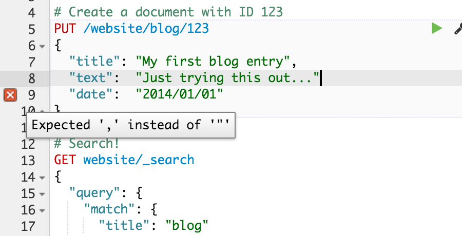

Console
=====

A JSON aware developer's interface to Elasticsearch. Comes with handy machinery such as syntax highlighting, API suggestions,
formatting and code folding.

Screenshots
-----

### Handy API suggestions

Console offers handy contextual suggestion to the Elasticsearch API.


### Format validation

Sometimes it is hard to find that little missing comma. Console automatically highlights and explains invalid input.



### Scope collapsing

Working on a big JSON query can be distracting. Using the mouse or via a handy keyboard shortcut (Ctrl/Cmd+Option+0)
, Console allows you to focus on a sub section and fold others away.


### Auto formatting

Type your commands however you want and let Console format them for you.


### Submit multiple requests at once

When testing or trying things out you frequently need to repeat the same sequence of commands.
Just write them all in Console, select and submit multiple requests to Elasticsearch.


### Copy and Paste cURL commands

Once done, you can copy one or more requests as cURL commands (and of course paste them back)


Results in:

```
# Delete all data in the `website` index
curl -XDELETE "http://localhost:9200/website"

# Create a document with ID 123
curl -XPUT "http://localhost:9200/website/blog/123" -d'
{
  "title": "My first blog entry",
  "text":  "Just trying this out...",
  "date":  "2014/01/01"
}'
```


Documentation
--------

~~Visit [elastic.co](https://www.elastic.co/guide/en/sense/current/index.html) for the full documentation.~~ We are working on getting the docs merged into kibana's.
