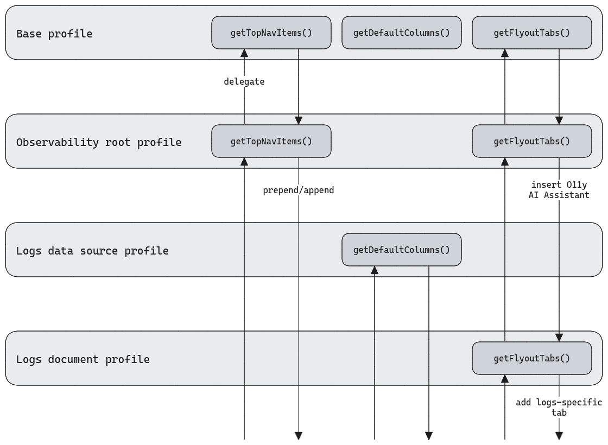
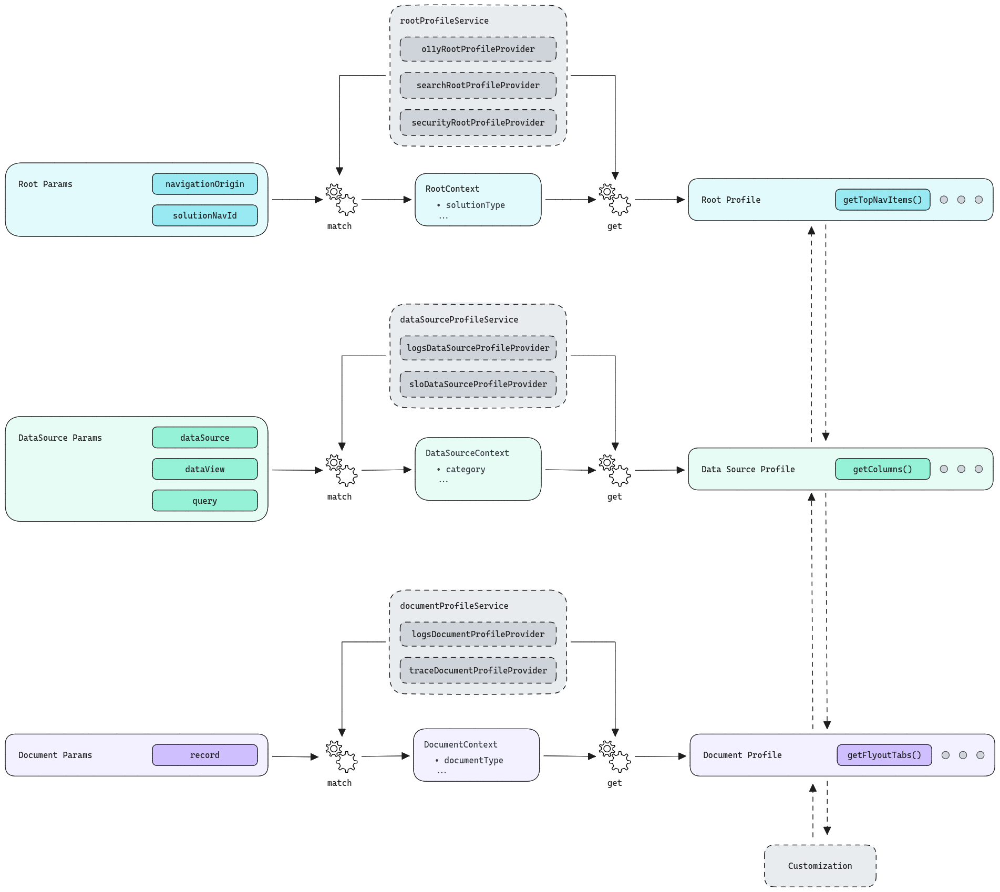

# Discover context awareness

## Summary

The Discover context awareness framework allows Discover's UI and functionality to adapt to the surrounding context of the page, including solution type, data source, current search parameters, etc., in order to provide curated data exploration experiences across a variety of data types and scenarios. Support for this is implemented through a system of profiles that map to distinct context levels, and extension points that provide interfaces for customizing specific aspects of Discover.

## Concepts

### Context levels

We currently support three levels of context in Discover:

- Root context:
  - Based on the current solution type, navigational parameters, etc.
  - Resolved at application initialization and on parameter changes.
  - Runs synchronously or asynchronously.
- Data source context:
  - Based on the current ES|QL query or data view.
  - Resolved on ES|QL query or data view change, before data fetching occurs.
  - Runs synchronously or asynchronously.
- Document context:
  - Based on individual ES|QL records or ES documents.
  - Resolved individually for each ES|QL record or ES document after data fetching runs.
  - Runs synchronously only.

### Composable profiles

To support application extensibility based on context, we've introduced the concept of "composable profiles". Composable profiles are implementations of a core `Profile` interface (or a subset of it) containing all of the available extension points Discover supports. A composable profile can be implemented at any context level through a "profile provider", responsible for defining the composable profile and its associated context resolution method. The context resolution method, named `resolve`, determines if its composable profile is a match for the current Discover context, and returns related metadata in a `context` object.

Definitions for the core `Profile` interface are located in the [`types.ts`](types.ts) file.

Definitions for the available profile provider types are located in the [`profiles`](./profiles) folder.

### Merged accessors

Composable profiles operate similarly to middleware in that each of their extension point implementations are passed a `prev` argument, which can be called to access the results from profiles at previous context levels, and allows overwriting or composing a final result from the previous results. The method Discover calls to trigger the extension point merging process and obtain a final result from the combined profiles is referred to as a "merged accessor".

The following diagram illustrates the extension point merging process:

Definitions for composable profiles and the merging routine are located in the [`composable_profile.ts`](./composable_profile.ts) file.

### Supporting services

The context awareness framework is driven by two main supporting services called `ProfileService` and `ProfilesManager`.

Each context level has a dedicated profile service, e.g. `RootProfileService`, which is responsible for accepting profile provider registrations and running through each provider in order during context resolution to identify a matching profile.

A single `ProfilesManager` is instantiated on Discover load, or one per saved search panel in a dashboard. The profiles manager is responsible for the following:

- Managing state associated with the current Discover context.
- Coordinating profile services and exposing resolution methods for each context level.
- Providing access to the combined set of resolved profiles.
- Deduplicating profile resolution attempts with identical parameters.
- Error handling and fallback behaviour on profile resolution failure.

`ProfileService` definitions and implementation are located in the [`profiles_service.ts`](./profile_service.ts) file.

The `ProfilesManager` implementation is located in the [`profiles_manager.ts`](./profiles_manager.ts) file.

### Bringing it all together

The following diagram models the overall Discover context awareness framework and how each of the above concepts come together:

## Registering a profile

In order to register a Discover profile, follow these steps:

1. Identify at which [context level](#context-levels) your profile should be implemented.
2. Create a subfolder for your profile provider within the [`profile_providers`](./profile_providers) folder. Common Discover providers should be created within the `profile_providers/common` subfolder, while solution specific providers should be created within a `profile_providers/{SOLUTION_TYPE}` subfolder, e.g. `profile_providers/security/security_root_profile`.
3. Create a `profile.ts(x)` file within your provider subfolder that exports a factory function which optionally accepts a `ProfileProviderServices` parameter and returns your provider implementation, e.g. `createSecurityRootProfileProvider(services: ProfileProviderServices) => RootProfileProvider`.
4. **If your provider is not ready for GA or should only be enabled for specific configurations, make sure to set the `isExperimental` flag to true in your profile provider.** This will ensure the profile is disabled by default, and can be enabled in `kibana.yml` like this: `discover.experimental.enabledProfiles: [{YOUR_PROFILE_ID}]`.
5. Call and return the result of your provider factory function from the corresponding factory function in [`register_profile_providers.ts`](./profile_providers/register_profile_providers.ts), e.g. `createRootProfileProviders`.

Existing profiles can be extended using the [`extendProfileProvider`](./profile_providers/extend_profile_provider.ts) utility, allowing multiple sub profiles to be composed from a shared parent profile.

Example profile provider implementations are located in [`profile_providers/example`](./profile_providers/example).

## Code sharing

One of the core ideas of the context awareness framework is that Discover is still a single application which should know about which profiles it supports and directly import the code needed to support them. This is why profile registrations are all handled internally to the plugin instead of having a registration system exposed through the plugin contract. This approach comes with several main benefits:

- There is a single, central place where all registrations happen, which is much easier to maintan versus scattered registrations.
- The Data Discovery team remains aware of which profiles exist and what changes are made. This is critical to ensure the Data Discovery team is able to provide adequate customer and SDH support for Discover.
- Common code and utilities can be easily shared across profiles since they need to be accessible to Discover by default, rather than being scattered throughout various plugin codebases.

It also comes with an important drawback: **Discover cannot depend on other plugins (e.g. solution plugins) to import code for profiles due to the dependency graph issues it would create.**

This means that in an ideal situation, the code for Discover profiles should either live directly within the Discover codebase, or within dedicated packages which Discover imports from:

- When adding solution specific code directly to the Discover codebase, it should be done in an organized way in order to support shared ownership. For example, the [`profile_providers/security`](./profile_providers/security) folder contains code specific to Security Solution maintained profiles, and an override has been added to the [`CODEOWNERS`](/.github/CODEOWNERS) file to reflect the shared ownership of this folder.
- When creating a dedicated package for some profile code, the maintaining team can retain full ownership over the package, and Discover is only responsible for importing the functionality and adding it to the associated profile registration.
