# Form lib

## Documentation

The documentation can be accessed at: https://docs.elastic.dev/form-lib/welcome


### Run locally

In order to run the documentation locally

1. Fork and clone the elastic docs repo https://github.com/elastic/docs.elastic.dev
2. `cp sources.json sources-dev.json`
3. Edit the "elastic/kibana" section inside `source-dev.json`

```
// From this
{
  "type": "github",
  "location": "elastic/kibana"
}

// to this
{
  "type": "file",
  "location": "../../<root-kibana-repo>", 
  // optional, if you want a faster build you can only include the form lib docs
  "subdirs": [
    "src/plugins/es_ui_shared/static/forms/docs"
  ]
}
```

4. Follow the "Getting started" instructions (https://github.com/elastic/docs.elastic.dev#getting-started)
5. `yarn dev` to launch the docs server

## Field value change sequence diagram

```mermaid
sequenceDiagram
actor User
User ->> UseField: change <input /> value
UseField ->> useField: setValue()
useField ->> useField: run field formatters
useField ->> useField: update state: value
useField ->> useField: create new "field" (FieldHook)
useField ->> useField: useEffect(): "field" changed
useField ->> useForm: addField(path, field)
useForm ->> useForm: update "fieldsRef" map object
useForm ->> useForm: update "formData$" observable
useForm ->> useFormData: update state: formData
useFormData -->> User: onChange() (optional handler passed to useFormdata())
par useEffect
useField ->> UseField: call "onChange" prop
and useEffect
useField ->> useField: update state: isPristine: false
useField ->> useField: update state: isChangingValue: true
useField ->> useForm: validateFields()
note right of useForm: Validate the current field + any other field<br>declared in the "fieldsToValidateOnChange"
useForm -->> useField: validate()
useField ->> useField: update state: isValid true|false
useField ->> useForm: update state: isValid undefined|true|false
useField ->> useField: update state: isChangingValue: false
and useEffect
useField ->> useField: update state: isModified: true|false
end
User ->> User: useEffect() -- >useFormData state update
```

