# Form lib

## Documentation

The documentation can be accessed at: https://docs.elastic.dev/form-lib/welcome


### Run locally

In order to run the documentation locally

1. Follow the guide to setup a Docsmobile site at https://docs.elastic.dev/docs/setup
2. Create a root folder "nav" with a `nav-form-lib.docnav.json` file in it. Copy the content from https://github.com/elastic/docs.elastic.dev/blob/main/nav/nav-form-lib.docnav.json
3. Edit the `site-config/nav.json` file and add the "nav-form-lib" to the "structure" array

```

"structure": ["nav-docs", "nav-content", "nav-form-lib"],
```

3. Create a `sources-dev.json` file **at the root** of the repo (not inside the "site-config" folder) and add the following

```
{
  "sources": [
    {
      "type": "file",
      "location": "../nav"
    },
    {
      "type": "file",
      "location": "../../<root-of-kibana-repo>",
      "subdirs": [
          "src/plugins/es_ui_shared/static/forms/docs"
      ]
    }
  ]
}
```

4. Start the dev server with `yarn dev` 

## Field value change sequence diagram

```mermaid
sequenceDiagram
actor User
User ->> UseField: change <input /> value
UseField ->> useField: setValue()
useField ->> useField: run field formatters
useField ->> useField: update state: value
useField ->> useField: create new "field" (FieldHook)
useField ->> useField: useEffect(): "field" changed
useField ->> useForm: addField(path, field)
useForm ->> useForm: update "fieldsRef" map object
useForm ->> useForm: update "formData$" observable
useForm ->> useFormData: update state: formData
useFormData -->> User: onChange() (optional handler passed to useFormdata())
par useEffect
useField ->> UseField: call "onChange" prop
and useEffect
useField ->> useField: update state: isPristine: false
useField ->> useField: update state: isChangingValue: true
useField ->> useForm: validateFields()
note right of useForm: Validate the current field + any other field<br>declared in the "fieldsToValidateOnChange"
useForm -->> useField: validate()
useField ->> useField: update state: isValid true|false
useField ->> useForm: update state: isValid undefined|true|false
useField ->> useField: update state: isChangingValue: false
and useEffect
useField ->> useField: update state: isModified: true|false
end
User ->> User: useEffect() -- >useFormData state update
```

