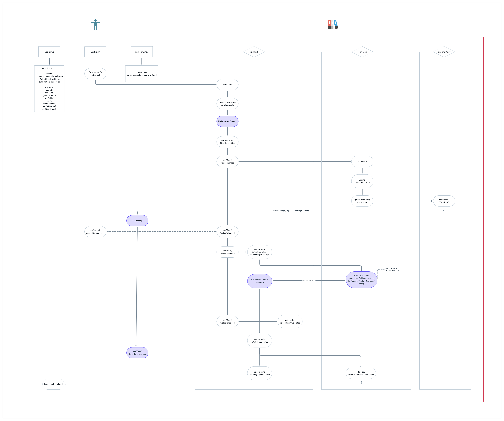

The core exposes the main building blocks (hooks and components) needed to build your form.

It is important to note that the core **is not** responsible for rendering UI. Its responsibility is to return form and fields **state and handlers** that you can connect to React components. The core of the form lib is agnostic of any UI rendering the form.

In Kibana we work with [the EUI component library](https://elastic.github.io/eui) so we have created <DocLink id="formLibHelpersComponents" text="field components"/> that wrap EUI form input components. With these components, connection with the form lib is already done for you.  

## Main building blocks

The three required components to build a form are:

- <DocLink id="formLibCoreUseForm" text="useForm()"/> hook to declare a new <DocLink id="formLibCoreFormHook" text="form"/>
- <DocLink id="formLibCoreFormComponent" text="<Form />"/> component that will wrap your form and create a context for it
- <DocLink id="formLibCoreUseField" text="<UseField />"/> component to declare a <DocLink id="formLibCoreFieldHook" text="field"/>

Let's see them in action before going into details

```js
import { useForm, Form, UseField } from 'src/plugins/es_ui_shared/public';

export const UserForm = () => {
  const { form } = useForm(); // 1

  return (
    <Form form={form}> // 2
      <UseField path="name" /> // 3 
      <UseField path="lastName" />

      <button onClick={form.submit}>Submit</button>
    </Form>
  );
};
```

1. We use the `useForm` hook to declare a new form.
2. We then wrap our form with the `<Form />` component, providing the `form` that we have just created.
3. Finally, we declared two fields with the `<UseField />` component, providing a unique `path` for each one of them.

If you were to run this code in the browser and click on the "Submit" button nothing would happen as we haven't defined any handler to execute when submitting the form. Let's do that now along with providing a `UserFormData` interface to the form, which we will get back in our `onSubmit` handler.

```js
import { useForm, Form, UseField, FormConfig } from 'src/plugins/es_ui_shared/public';

interface UserFormData {
  name: string;
  lastName: string;
}

export const UserForm = () => {
  const onFormSubmit: FormConfig<UserFormData>['onSubmit'] = async (data, isValid) => {
    console.log("Is form valid:", isValid);
    if (!isValid) {
      // Maybe show a callout?
      return;
    }

    console.log("Form data:", data);
  };

  const { form } = useForm({ onSubmit: onFormSubmit });

  return (
    <Form form={form}>
      ...
      <button onClick={form.submit}>Submit</button>
    </Form>
  );
};
```

Great! We have our first working form. No state to worry about, just a simple declarative way to build our fields.

Those of you who are attentive might have noticed that the above form _does_ render the fields in the UI although we said earlier that the core of the form lib is not responsible for any UI rendering. This is because the `<UseField />` has a fallback mechanism to render an `<input type="text" />` and hook to the field `value` and `onChange`. Unless you have styled your `input` elements and don't require other field types like `checkbox` or `select`, you will probably want to <DocLink id="formLibExampleStyleFields" text="customize"/> how the the `<UseField />` renders. We will see that in a future section.

## Field value change sequence diagram

{/*The elastic docs system does not support yet rendering "mermaid" diagram
in .mdx I've asked the docs engineers how to enable it and will follow up on it.
In the meantime we will use the Whimsical exported image.*/}

