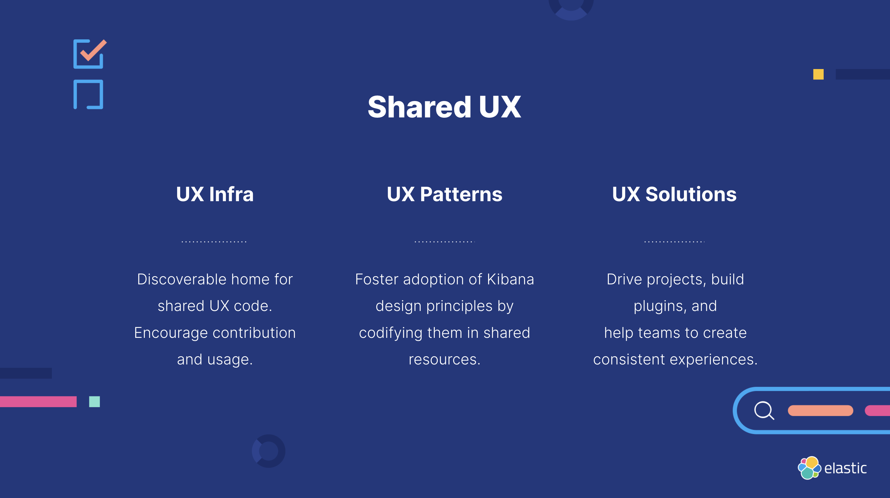

## Areas of Focus

### UX Infrastructure

- Create and maintain a discoverable home for shared code that complete user experiences.
- Encourage contribution and usage.

<DocCallOut>
  Read more about our infrastructure <DocLink id="sharedUX/Infrastructure" tooltip text="here" />.
</DocCallOut>

### UX Patterns

- Work with design specialists to understand and communicate new and existing designs.
- Foster adoption of design principles by codifying them in shared resources.

<DocCallOut>
  Read more about our patterns <DocLink id="sharedUX/Patterns" tooltip text="here" />.
</DocCallOut>

### UX Solutions

- Drive common projects.
- Build and support common plugins.
- Help teams to create consistent user experiences.

<DocCallOut>
  Read more about our solutions <DocLink id="sharedUX/Solutions" tooltip text="here" />.
</DocCallOut>

## Meet the team

You can tag our team on Github with the [@elastic/sharedux](https://github.com/orgs/elastic/teams/shared-ux) identifier.

| Name | Role | GitHub | Location |
|------|------|--------|----------|
| Clint Andrew Hall | Tech Lead | [@clintandrewhall](https://github.com/clintandrewhall) | Kansas City, MO, USA |
| Raya Fratkina | Team Lead | [@rayafratkina](https://github.com/rayafratkina) | |
| Alex Francoeur | Product Lead | [@alexfrancoeur](https://github.com/alexfrancoeur) | |
| Caroline Horn | Design Lead | [@cchaos](https://github.com/cchaos) | |
| Maja Grubic | Engineer | [@majagrubic](https://github.com/majagrubic) | |
| Rachel Shen | Engineer | [@rshen](https://github.com/rshen91) | |
| Sebastien Loix | Engineer | [@sebelga](https://github.com/sebelga) | |