# Value lists in lookup indices: API reference

This document describes the endpoints the proposal adds and how the existing item endpoints behave on a list stored in a lookup index. The proposal itself is in `value_lists_lookup_indices_proposal.md`; the implementation notes are in `x-pack/solutions/security/plugins/lists/server/services/lookup/README.md`.

Every request below runs in a Kibana space. The examples use the `default` space, a list id of `ports` (type `integer_range`), and the names that follow from them:

| Name | Value |
|---|---|
| Container document | `ports` in `.lists-default` |
| Concrete index | `.value-list-v2-default-ports` |
| Alias | `.items-default-ports` |

The concrete index is created once and never renamed. The alias exists while the list is shared and is removed when the list is restricted. Reads and writes from the request path use the alias while it exists and the concrete index otherwise, so the calling user's privileges apply. Index creation, index deletion, alias changes, mapping upgrades, and the background task run as the Kibana system user.

## Conventions

- The three new endpoints are internal, version `1`. Requests carry `elastic-api-version: 1`, `kbn-xsrf: <any>`, and `x-elastic-internal-origin: <any>`.
- All three require the Security `lists` feature privilege `all`.
- An error response has the Kibana shape `{ "message": string, "statusCode": number, "attributes"?: object }`. When an endpoint refuses with a report, the report is under `attributes`.
- `dryRun: true` never changes anything and always answers 200 with the report a real call would act on.
- `force: true` proceeds past the checks a plain call refuses on. It never disables the privilege check on `_unrestrict` or on list deletion.

## `POST /internal/lists/_migrate`

Copies a legacy list from the current `.items-<space>` stream into its own lookup index. The copy is non-destructive: the legacy rows stay where they are.

Request body:

| Field | Type | Default | Meaning |
|---|---|---|---|
| `id` | string | required | The list id. |
| `restrict` | boolean | `false` | Restrict the list right after the migration, with the checks `_restrict` applies. |
| `force` | boolean | `false` | Migrate although a check would refuse. Values the lookup grammar rejects are left out and reported. |
| `dryRun` | boolean | `false` | Return the full report and change nothing. |

The checks run cheapest first:

1. The referencing rule scan. An exception rule whose API key cannot read the alias blocks. An indicator match rule that reads the list through `.items-<space>` and names it in its threat query blocks. A failed scan blocks. An indicator match rule that reads `.items-<space>` without naming the list is a warning. A plain call that is blocked here answers 409 before reading a single item.
2. The value scan. The legacy items are streamed and each value is checked against the lookup grammar for the list type. The scan counts the rejected values and keeps the first 100 as a sample. Any rejected value blocks a plain call.
3. With `dryRun`, the report is returned here, with a `restriction` preflight when `restrict` is set.
4. The copy. The concrete index and alias are created. An index left by an interrupted migration, which no list owns, is removed first. Items are copied in batches through the alias. With `force`, rejected values are dropped and counted in `migration.dropped`. Then the storage descriptor is written on the container document. A failure anywhere in this step deletes the new index and leaves the list legacy.
5. For a range type, the coalesce rebuild task is scheduled.
6. With `restrict`, the restrict runs with its own checks. A blocked restrict answers 409 with the migration result under `attributes`, so the caller knows the list is migrated but still shared.

Response 200:

```json
{
  "id": "ports",
  "migration": {
    "alreadyLookup": false,
    "index": ".value-list-v2-default-ports",
    "alias": ".items-default-ports",
    "itemsCopied": 3,
    "dropped": { "count": 0, "sample": [] }
  },
  "referencingRules": { "level": "none", "rules": [] },
  "warningLevel": "none",
  "warning": null,
  "restriction": null
}
```

Response 200 with `dryRun`:

```json
{
  "id": "ports",
  "dryRun": true,
  "blocked": true,
  "blockers": ["2 value(s) are not accepted spellings for this list type and would be left out: \"abc\", \"1-\". Edit them first, or pass force to migrate without them."],
  "referencingRules": { "level": "maybe", "rules": [{ "id": "…", "name": "…", "reason": "threat_index_maybe" }] },
  "rejectedValues": { "count": 2, "sample": ["abc", "1-"] },
  "warningLevel": "maybe",
  "warning": "Some indicator match rules read \".items-default\" as a threat index and may reference this list: …",
  "restriction": { "blocked": false, "blockers": [], "callerCanRead": true, "index": ".value-list-v2-default-ports" }
}
```

Errors:

| Status | When | `attributes` |
|---|---|---|
| 400 | The feature flag is off. | none |
| 404 | The list does not exist. | none |
| 409 | Blocked by the rule scan (plain call). | `{ id, referencingRules, rejectedValues: null, warningLevel }` |
| 409 | Blocked by rejected values, or by both checks on a forced or dry run turned real. | `{ id, referencingRules, rejectedValues: { count, sample }, warning, warningLevel }` |
| 409 | Migrated, but the requested restrict is blocked. | `{ id, migration, referencingRules, restriction, warningLevel }` |
| 409 | The concrete index or alias name is already taken by another list, or the container document changed under the migration. | none |

`referencingRules.level` is one of `referenced`, `maybe`, `unverified`, `none`. Each entry in `rules` has `id`, `name`, `reason` (`exception`, `threat_index`, or `threat_index_maybe`), and, when a key check ran, `canRead` and `apiKeyOwner`.

## `POST /internal/lists/_restrict`

Removes the alias, so only roles that grant read on the concrete index reach the list.

Request body:

| Field | Type | Default | Meaning |
|---|---|---|---|
| `id` | string | required | The list id. |
| `force` | boolean | `false` | Restrict although the caller or a referencing rule's key cannot read the concrete index. |
| `dryRun` | boolean | `false` | Return the report and change nothing. |

Two checks run in parallel before any change: whether the caller can read the concrete index (a caller who cannot would lose their own access), and the referencing rule scan with a key check against the concrete index. Either failing blocks a plain call. A list that is already restricted answers 200 with `changed: false`, after dropping an alias an interrupted earlier restrict may have left behind.

The change itself is two writes in a fixed order: the storage descriptor loses the alias first, then the alias is removed. A reader that sees the new descriptor before the alias is gone still reaches the index by its concrete name, while the reverse order would leave a window where the descriptor names an alias that no longer exists.

Response 200:

```json
{
  "id": "ports",
  "access": "restricted",
  "index": ".value-list-v2-default-ports",
  "alias": null,
  "callerCanRead": true,
  "changed": true,
  "dryRun": false,
  "message": "1 rule(s) reference this list.",
  "referencingRules": { "level": "none", "rules": [{ "id": "…", "name": "…", "reason": "exception", "canRead": true }] }
}
```

Errors:

| Status | When | `attributes` |
|---|---|---|
| 400 | The list is a legacy list. Migrate it first. | none |
| 404 | The list does not exist. | none |
| 409 | The caller cannot read the concrete index, or a referencing rule's key cannot. | The same body as a 200, with `access: "shared"`, `changed: false`, and a `message` naming the blockers and the remedy. |

## `POST /internal/lists/_unrestrict`

Adds the alias back and records it, returning the list to the shared state.

Request body: `{ "id": string }`.

The caller must be able to read the restricted concrete index. Restricting is an Elasticsearch boundary, so the operations that undo it, this one and list deletion, are not open to every list writer. The change is two writes in the reverse order of restrict: the alias is added first, then the descriptor records it.

Response 200:

```json
{
  "id": "ports",
  "access": "shared",
  "index": ".value-list-v2-default-ports",
  "alias": ".items-default-ports",
  "changed": true
}
```

Errors:

| Status | When |
|---|---|
| 400 | The list is a legacy list. |
| 403 | The caller cannot read the concrete index. |
| 404 | The list does not exist. |

## Existing endpoints on a lookup list

The public list and item endpoints keep their paths, bodies, and response shapes. This section records what differs when the list is a lookup list.

| Endpoint | Difference |
|---|---|
| `POST /api/lists` | With the flag on, the list is created in its own lookup index and the response carries `storage: { type: "lookup_index", locator: { index, alias } }`. 409 when either name exists already. |
| `DELETE /api/lists?id=` | Deletes the concrete index along with the container document. 403 when the caller cannot read the list through its alias or, once restricted, its concrete index. The check runs before exception references are stripped. |
| `POST /api/lists/items` | The item id is `sha256(list id + canonical value)`, prefixed `src:` on a range list. A value outside the accepted grammar answers 400 `list item invalid: …`. The response carries `created_at`, `created_by`, `updated_at`, `updated_by`. Writing a value that exists already moves its update stamps and keeps its creation stamps. |
| `PUT`, `PATCH /api/lists/items` | The id is located across the space's lookup indices. A new value yields a new id, and the old id stops resolving. `meta` is not stored. |
| `GET /api/lists/items?id=` | Located the same way. 404 when no lookup index holds the id. |
| `DELETE /api/lists/items?id=` | Removes the document the id names. On a range list that is the authored range. |
| `DELETE /api/lists/items?list_id=&value=` | On an equality list, one document. On a range list, every authored range that contains the value, which is what the current implementation attempts. Today that request answers 400 whenever a range matches, because the current code rebuilds its delete query from the range strings it found. A range string such as `10.0.0.0/24` is rejected by Elasticsearch on both storages and the error is returned as is. 404 when nothing matches. |
| `GET /api/lists/items/_find` | Pages with the same cursor as today. `sort_field` accepts `value` and the four stamps. |
| `POST /api/lists/items/_import` | Lines the grammar rejects are dropped and the rest are written, as today. Without `list_id`, a lookup list named after the file is created. 400 when a legacy list of that name exists. |

## Storage reference

### Index

Every lookup list is one index with these settings:

| Setting | Value | Why |
|---|---|---|
| `index.mode` | `lookup` | The mode `LOOKUP JOIN` requires. It fixes the index at one primary shard. |
| `index.auto_expand_replicas` | `0-1` | One replica wherever a second data node exists, none on a single node. |
| `mappings.dynamic` | `strict` | A document with an unmapped field is rejected, so a mapping change is always explicit. `ensureLookupIndexCurrent` adds fields a later build introduced to an index created before them. |
| Lifecycle | none | No ILM policy and no data stream lifecycle. The list is reference data kept whole. |

### Names

The list id is normalized once, at provisioning: lowercased, every character outside `a-z`, `0-9`, `.`, `_`, `-` replaced by `-`, and leading `-`, `_`, `+`, `.` removed. An id with nothing left answers 400. The list id itself is never rewritten; the two names are recorded on the container document and read from there.

| Name | Pattern | Example |
|---|---|---|
| Concrete index | `.value-list-v2-<space id>-<normalized id>` | `.value-list-v2-default-ports` |
| Alias | `.items-<space id>-<normalized id>` | `.items-default-ports` |

An index name is limited to 255 bytes, so a list id of about 230 characters fails to provision. Two ids that normalize to the same name collide, and the second create answers 409.

### The container document

The list's document in `.lists-<space>` carries the storage descriptor:

```json
{
  "id": "ports",
  "type": "integer_range",
  "storage": {
    "type": "lookup_index",
    "locator": { "index": ".value-list-v2-default-ports", "alias": ".items-default-ports" }
  }
}
```

A missing `storage` field reads as `{ "type": "data_stream" }`, which is every list created before this feature. A restricted list has no `alias` in its locator. The field is written only by create, migrate, restrict, and unrestrict, and it is not accepted by the public update and patch endpoints. Because a list user holds Elasticsearch write on the container, the field is verified on every read: the names are recomputed from the space id and the list id, and a descriptor that names anything else is refused with 500 and never handed to the system user.

### Equality and native types

One document for each distinct value. The 23 non range types map `value` to the Elasticsearch field type of the same name (`keyword`, `ip`, `long`, `date`, `boolean`, `geo_point`, ...).

| Field | Type | Meaning |
|---|---|---|
| `_id` | | `sha256(<list id> + "\n" + <canonical value>)`, hex. This is the item id the API returns. |
| `value` | the list type | The value as serialized for the field. The spelling of the last write is kept. |
| `created_at`, `created_by` | `date`, `keyword` | Set by the first write of the value and never moved. |
| `updated_at`, `updated_by` | `date`, `keyword` | Moved by every write of the value. |

The canonical value is the one fixed spelling the grammar maps every accepted spelling to, the spelling Elasticsearch keeps when it stores the value: `::1` and `0:0:0:0:0:0:0:1` share one document on an `ip` list. The accepted spellings and canonical forms of each type are tabulated in the proposal.

```json
{ "_id": "05c4f188…", "value": "192.168.5.5", "created_at": "2026-09-25T20:21:21.126Z", "created_by": "elastic", "updated_at": "2026-09-25T20:21:21.126Z", "updated_by": "elastic" }
```

### Range types

The six range types (`ip_range`, `date_range`, `integer_range`, `long_range`, `float_range`, `double_range`) store four kinds of document in one index, told apart by `kind`. The bound fields take the scalar type of the range (`ip` for `ip_range`, `date` for `date_range`, and so on).

| `kind` | `_id` | Fields | Written by |
|---|---|---|---|
| `source` | `src:` + `sha256(<list id> + "\n" + <trimmed value>)` | `value` (keyword, the authored range, trimmed), `src_start`, `src_end` (parsed bounds), `src_range` (the same bounds as one range field, queried by containment), the four stamps | The request path, on every write |
| `coalesced` | `sha256(<range_start> + "-" + <range_end>)` | `range_start`, `range_end` (disjoint bounds, the join target), `built_by` (the id of the task run that wrote it) | The task only |
| `dirty` | `dirty:` + random UUID | `range_start`, `range_end` (a region owed a rebuild) | The request path, after the source write |
| `state` | `__state` | `source_version` (moved by every source write), `coalesced_version` (the source version the coalesced set was last built from), `status` (`dirty` or `clean`) | Both: the request path bumps it, the task records it clean |

The source id hashes the trimmed authored string, so `10.0.0.0/24` and `10.0.0.0-10.0.0.255` are two sources with two ids even though they cover the same addresses. Export returns the authored strings.

The documents of the worked examples' starting state:

```json
{ "_id": "src:c352…", "kind": "source", "value": "1-100", "src_start": 1, "src_end": 100, "src_range": { "gte": 1, "lte": 100 }, "created_at": "…", "created_by": "elastic", "updated_at": "…", "updated_by": "elastic" }
{ "_id": "src:9bc7…", "kind": "source", "value": "50-200", "src_start": 50, "src_end": 200, "src_range": { "gte": 50, "lte": 200 }, "created_at": "…", "created_by": "elastic", "updated_at": "…", "updated_by": "elastic" }
{ "_id": "src:3a74…", "kind": "source", "value": "500-510", "src_start": 500, "src_end": 510, "src_range": { "gte": 500, "lte": 510 }, "created_at": "…", "created_by": "elastic", "updated_at": "…", "updated_by": "elastic" }
{ "_id": "e3b0…", "kind": "coalesced", "range_start": 1, "range_end": 200, "built_by": "5f1c…" }
{ "_id": "7a2e…", "kind": "coalesced", "range_start": 500, "range_end": 510, "built_by": "5f1c…" }
{ "_id": "__state", "kind": "state", "source_version": 3, "coalesced_version": 3, "status": "clean" }
```

Right after the insert of `150-300` in the first worked example, and before the task runs, the index also holds:

```json
{ "_id": "src:f5c4…", "kind": "source", "value": "150-300", "src_start": 150, "src_end": 300, "src_range": { "gte": 150, "lte": 300 }, "created_at": "…", "created_by": "elastic", "updated_at": "…", "updated_by": "elastic" }
{ "_id": "dirty:2c0e…", "kind": "dirty", "range_start": 150, "range_end": 300 }
{ "_id": "__state", "kind": "state", "source_version": 4, "coalesced_version": 3, "status": "dirty" }
```

Which documents each reader uses:

| Reader | Documents |
|---|---|
| V1 membership, inline filter and post filter | `source`, through `src_range` |
| Items table, read by id, export | `source`, through `value` |
| The future `LOOKUP JOIN` | `coalesced`, through `range_start` and `range_end` |
| The task | all four kinds |

## Request time swimlanes

Each diagram shows what happens between the request and the response. For a range list, the response returns before the coalesced projection is rebuilt; the rebuild is the task in the next section. Membership checks read the authored values, so a rule sees the change as soon as the response returns.

### Migrate

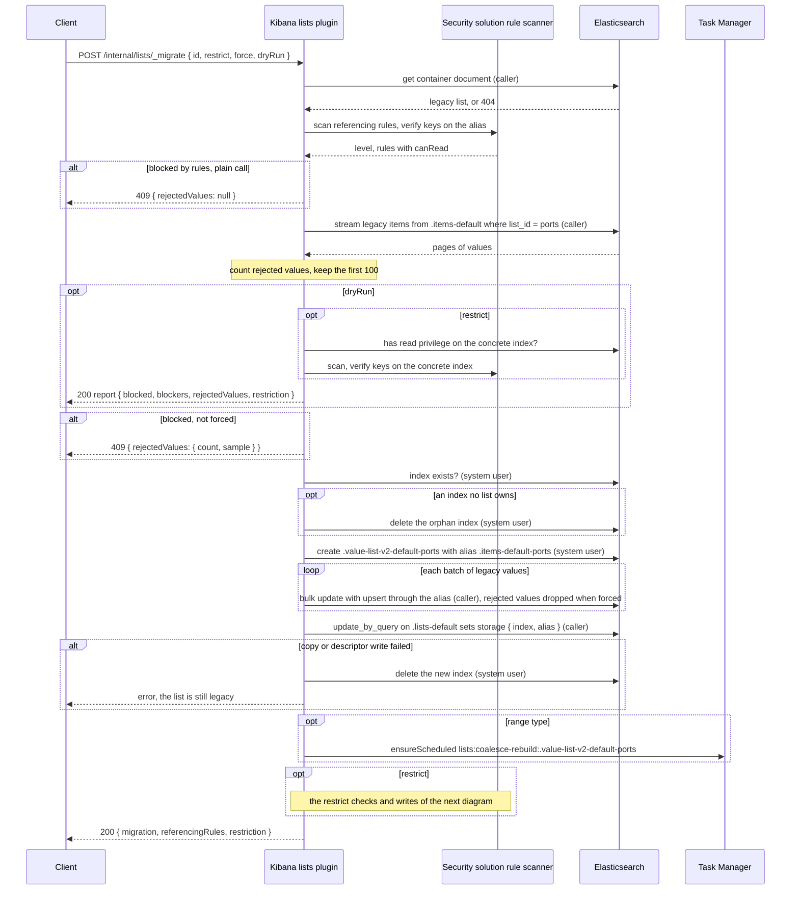
```mermaid
sequenceDiagram
    participant C as Client
    participant K as Kibana lists plugin
    participant S as Security solution rule scanner
    participant ES as Elasticsearch
    participant TM as Task Manager

    C->>K: POST /internal/lists/_migrate { id, restrict, force, dryRun }
    K->>ES: get container document (caller)
    ES-->>K: legacy list, or 404
    K->>S: scan referencing rules, verify keys on the alias
    S-->>K: level, rules with canRead
    alt blocked by rules, plain call
        K-->>C: 409 { rejectedValues: null }
    end
    K->>ES: stream legacy items from .items-default where list_id = ports (caller)
    ES-->>K: pages of values
    Note over K: count rejected values, keep the first 100
    opt dryRun
        opt restrict
            K->>ES: has read privilege on the concrete index?
            K->>S: scan, verify keys on the concrete index
        end
        K-->>C: 200 report { blocked, blockers, rejectedValues, restriction }
    end
    alt blocked, not forced
        K-->>C: 409 { rejectedValues: { count, sample } }
    end
    K->>ES: index exists? (system user)
    opt an index no list owns
        K->>ES: delete the orphan index (system user)
    end
    K->>ES: create .value-list-v2-default-ports with alias .items-default-ports (system user)
    loop each batch of legacy values
        K->>ES: bulk update with upsert through the alias (caller), rejected values dropped when forced
    end
    K->>ES: update_by_query on .lists-default sets storage { index, alias } (caller)
    alt copy or descriptor write failed
        K->>ES: delete the new index (system user)
        K-->>C: error, the list is still legacy
    end
    opt range type
        K->>TM: ensureScheduled lists:coalesce-rebuild:.value-list-v2-default-ports
    end
    opt restrict
        Note over K,S: the restrict checks and writes of the next diagram
    end
    K-->>C: 200 { migration, referencingRules, restriction }
```

### Restrict

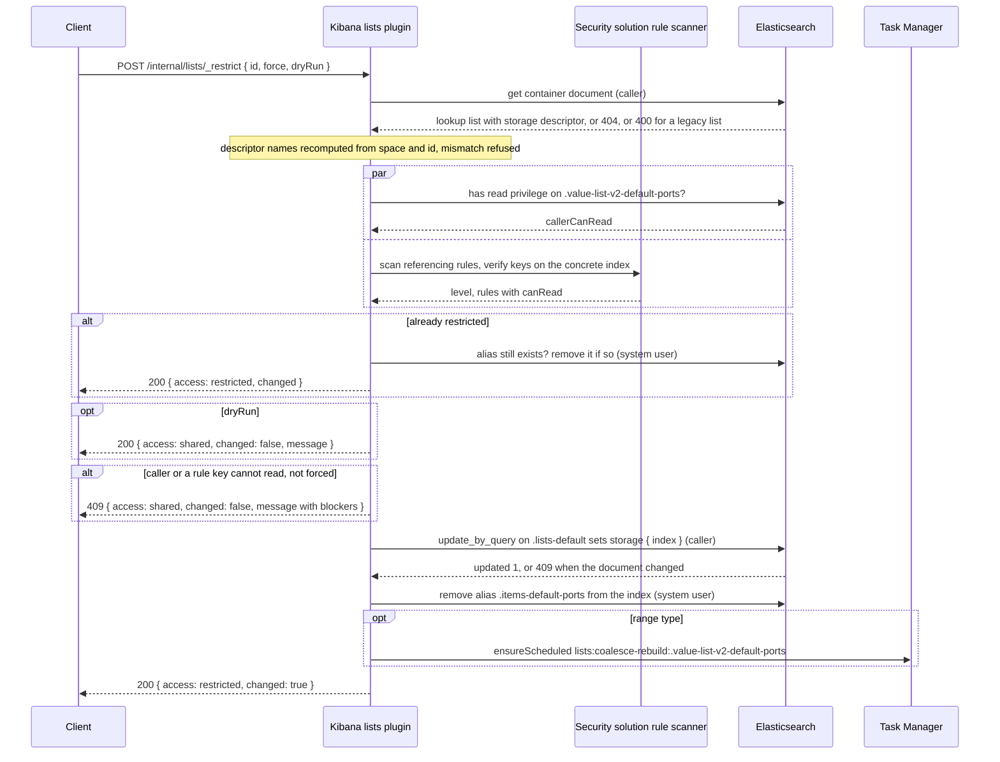
```mermaid
sequenceDiagram
    participant C as Client
    participant K as Kibana lists plugin
    participant S as Security solution rule scanner
    participant ES as Elasticsearch
    participant TM as Task Manager

    C->>K: POST /internal/lists/_restrict { id, force, dryRun }
    K->>ES: get container document (caller)
    ES-->>K: lookup list with storage descriptor, or 404, or 400 for a legacy list
    Note over K: descriptor names recomputed from space and id, mismatch refused
    par
        K->>ES: has read privilege on .value-list-v2-default-ports?
        ES-->>K: callerCanRead
    and
        K->>S: scan referencing rules, verify keys on the concrete index
        S-->>K: level, rules with canRead
    end
    alt already restricted
        K->>ES: alias still exists? remove it if so (system user)
        K-->>C: 200 { access: restricted, changed }
    end
    opt dryRun
        K-->>C: 200 { access: shared, changed: false, message }
    end
    alt caller or a rule key cannot read, not forced
        K-->>C: 409 { access: shared, changed: false, message with blockers }
    end
    K->>ES: update_by_query on .lists-default sets storage { index } (caller)
    ES-->>K: updated 1, or 409 when the document changed
    K->>ES: remove alias .items-default-ports from the index (system user)
    opt range type
        K->>TM: ensureScheduled lists:coalesce-rebuild:.value-list-v2-default-ports
    end
    K-->>C: 200 { access: restricted, changed: true }
```

### Unrestrict

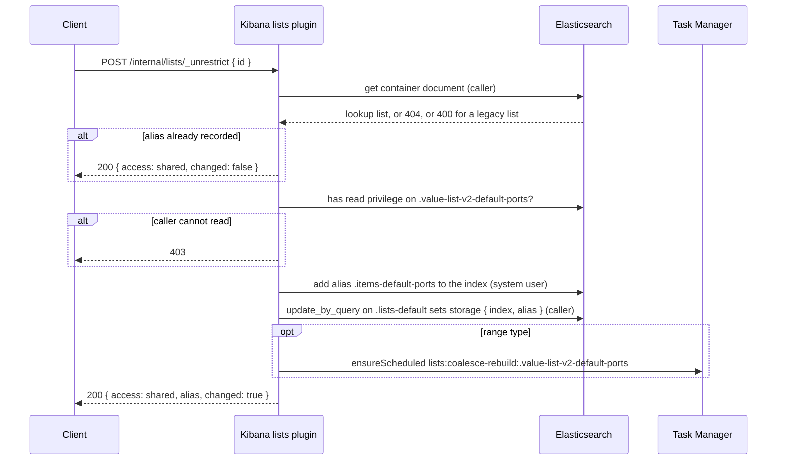
```mermaid
sequenceDiagram
    participant C as Client
    participant K as Kibana lists plugin
    participant ES as Elasticsearch
    participant TM as Task Manager

    C->>K: POST /internal/lists/_unrestrict { id }
    K->>ES: get container document (caller)
    ES-->>K: lookup list, or 404, or 400 for a legacy list
    alt alias already recorded
        K-->>C: 200 { access: shared, changed: false }
    end
    K->>ES: has read privilege on .value-list-v2-default-ports?
    alt caller cannot read
        K-->>C: 403
    end
    K->>ES: add alias .items-default-ports to the index (system user)
    K->>ES: update_by_query on .lists-default sets storage { index, alias } (caller)
    opt range type
        K->>TM: ensureScheduled lists:coalesce-rebuild:.value-list-v2-default-ports
    end
    K-->>C: 200 { access: shared, alias, changed: true }
```

### Create and delete a list

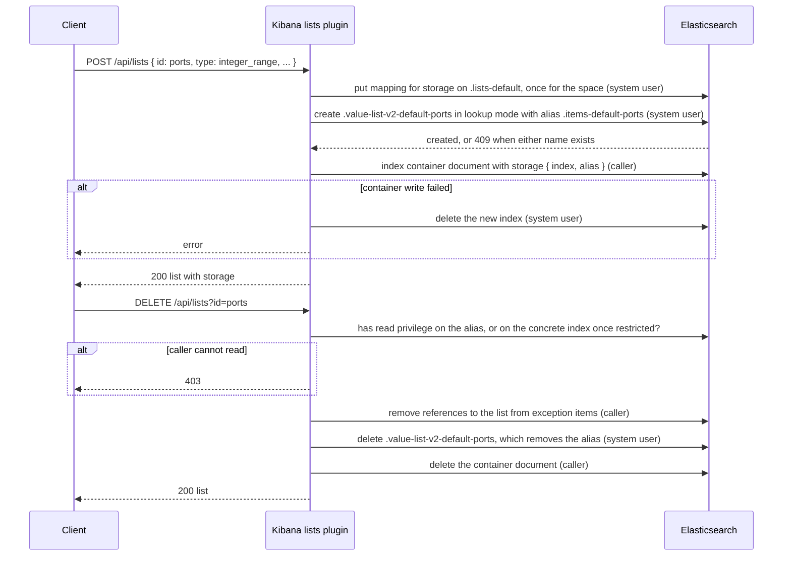
```mermaid
sequenceDiagram
    participant C as Client
    participant K as Kibana lists plugin
    participant ES as Elasticsearch

    C->>K: POST /api/lists { id: ports, type: integer_range, ... }
    K->>ES: put mapping for storage on .lists-default, once for the space (system user)
    K->>ES: create .value-list-v2-default-ports in lookup mode with alias .items-default-ports (system user)
    ES-->>K: created, or 409 when either name exists
    K->>ES: index container document with storage { index, alias } (caller)
    alt container write failed
        K->>ES: delete the new index (system user)
        K-->>C: error
    end
    K-->>C: 200 list with storage

    C->>K: DELETE /api/lists?id=ports
    K->>ES: has read privilege on the alias, or on the concrete index once restricted?
    alt caller cannot read
        K-->>C: 403
    end
    K->>ES: remove references to the list from exception items (caller)
    K->>ES: delete .value-list-v2-default-ports, which removes the alias (system user)
    K->>ES: delete the container document (caller)
    K-->>C: 200 list
```

### Create an item

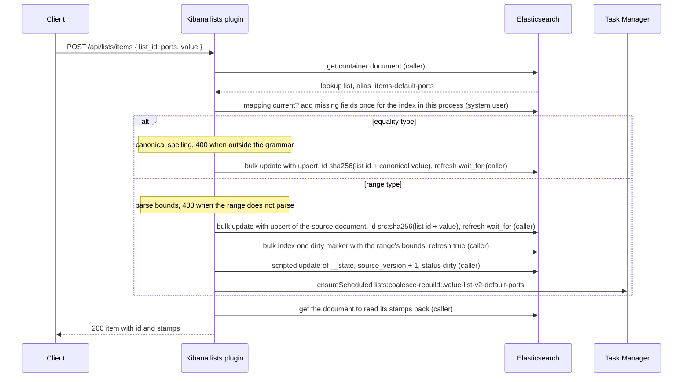
```mermaid
sequenceDiagram
    participant C as Client
    participant K as Kibana lists plugin
    participant ES as Elasticsearch
    participant TM as Task Manager

    C->>K: POST /api/lists/items { list_id: ports, value }
    K->>ES: get container document (caller)
    ES-->>K: lookup list, alias .items-default-ports
    K->>ES: mapping current? add missing fields once for the index in this process (system user)
    alt equality type
        Note over K: canonical spelling, 400 when outside the grammar
        K->>ES: bulk update with upsert, id sha256(list id + canonical value), refresh wait_for (caller)
    else range type
        Note over K: parse bounds, 400 when the range does not parse
        K->>ES: bulk update with upsert of the source document, id src:sha256(list id + value), refresh wait_for (caller)
        K->>ES: bulk index one dirty marker with the range's bounds, refresh true (caller)
        K->>ES: scripted update of __state, source_version + 1, status dirty (caller)
        K->>TM: ensureScheduled lists:coalesce-rebuild:.value-list-v2-default-ports
    end
    K->>ES: get the document to read its stamps back (caller)
    K-->>C: 200 item with id and stamps
```

### Update an item by id

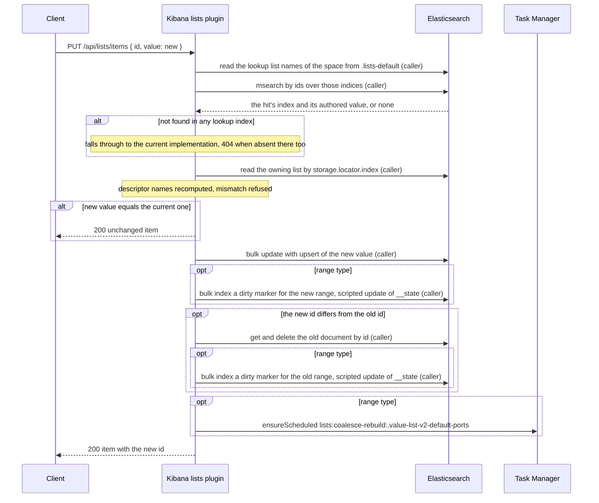
```mermaid
sequenceDiagram
    participant C as Client
    participant K as Kibana lists plugin
    participant ES as Elasticsearch
    participant TM as Task Manager

    C->>K: PUT /api/lists/items { id, value: new }
    K->>ES: read the lookup list names of the space from .lists-default (caller)
    K->>ES: msearch by ids over those indices (caller)
    ES-->>K: the hit's index and its authored value, or none
    alt not found in any lookup index
        Note over K: falls through to the current implementation, 404 when absent there too
    end
    K->>ES: read the owning list by storage.locator.index (caller)
    Note over K: descriptor names recomputed, mismatch refused
    alt new value equals the current one
        K-->>C: 200 unchanged item
    end
    K->>ES: bulk update with upsert of the new value (caller)
    opt range type
        K->>ES: bulk index a dirty marker for the new range, scripted update of __state (caller)
    end
    opt the new id differs from the old id
        K->>ES: get and delete the old document by id (caller)
        opt range type
            K->>ES: bulk index a dirty marker for the old range, scripted update of __state (caller)
        end
    end
    opt range type
        K->>TM: ensureScheduled lists:coalesce-rebuild:.value-list-v2-default-ports
    end
    K-->>C: 200 item with the new id
```

### Delete an item by id

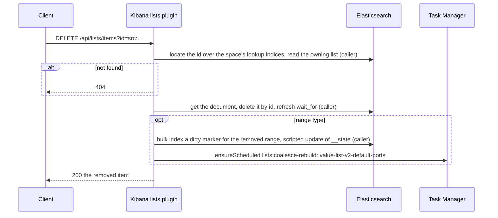
```mermaid
sequenceDiagram
    participant C as Client
    participant K as Kibana lists plugin
    participant ES as Elasticsearch
    participant TM as Task Manager

    C->>K: DELETE /api/lists/items?id=src:…
    K->>ES: locate the id over the space's lookup indices, read the owning list (caller)
    alt not found
        K-->>C: 404
    end
    K->>ES: get the document, delete it by id, refresh wait_for (caller)
    opt range type
        K->>ES: bulk index a dirty marker for the removed range, scripted update of __state (caller)
        K->>TM: ensureScheduled lists:coalesce-rebuild:.value-list-v2-default-ports
    end
    K-->>C: 200 the removed item
```

### Delete items by value on a range list

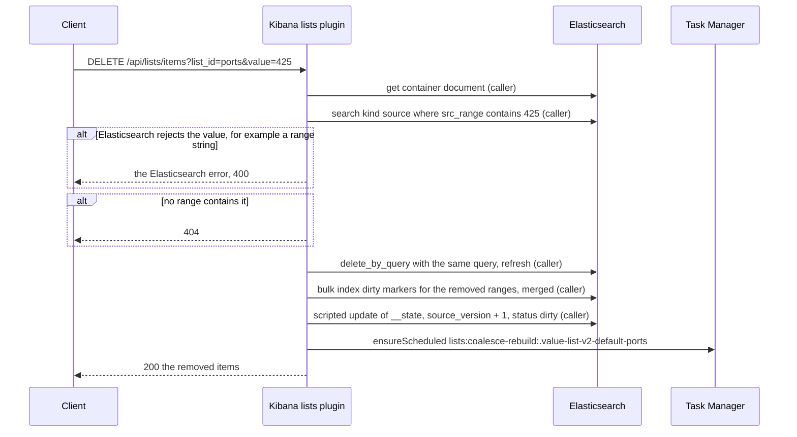
```mermaid
sequenceDiagram
    participant C as Client
    participant K as Kibana lists plugin
    participant ES as Elasticsearch
    participant TM as Task Manager

    C->>K: DELETE /api/lists/items?list_id=ports&value=425
    K->>ES: get container document (caller)
    K->>ES: search kind source where src_range contains 425 (caller)
    alt Elasticsearch rejects the value, for example a range string
        K-->>C: the Elasticsearch error, 400
    end
    alt no range contains it
        K-->>C: 404
    end
    K->>ES: delete_by_query with the same query, refresh (caller)
    K->>ES: bulk index dirty markers for the removed ranges, merged (caller)
    K->>ES: scripted update of __state, source_version + 1, status dirty (caller)
    K->>TM: ensureScheduled lists:coalesce-rebuild:.value-list-v2-default-ports
    K-->>C: 200 the removed items
```

### Import

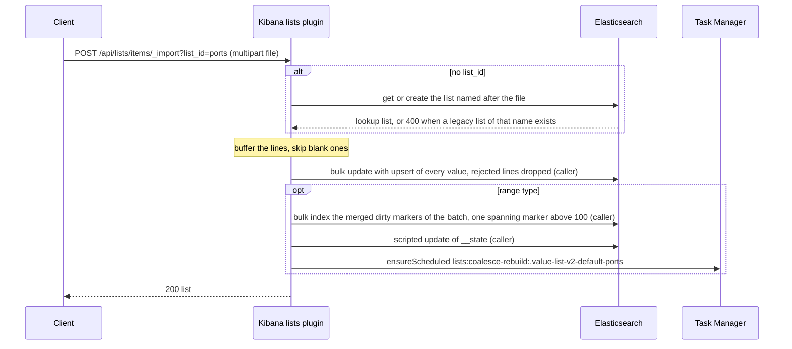
```mermaid
sequenceDiagram
    participant C as Client
    participant K as Kibana lists plugin
    participant ES as Elasticsearch
    participant TM as Task Manager

    C->>K: POST /api/lists/items/_import?list_id=ports (multipart file)
    alt no list_id
        K->>ES: get or create the list named after the file
        ES-->>K: lookup list, or 400 when a legacy list of that name exists
    end
    Note over K: buffer the lines, skip blank ones
    K->>ES: bulk update with upsert of every value, rejected lines dropped (caller)
    opt range type
        K->>ES: bulk index the merged dirty markers of the batch, one spanning marker above 100 (caller)
        K->>ES: scripted update of __state (caller)
        K->>TM: ensureScheduled lists:coalesce-rebuild:.value-list-v2-default-ports
    end
    K-->>C: 200 list
```

## The coalesce rebuild task

The task is `lists:coalesce-rebuild`, keyed by the concrete index, so a list has exactly one task whether it is shared or restricted. Task Manager runs one instance at a time. The task is the only writer of `coalesced` documents, which is what makes the incremental algorithm correct: the coalesced set is disjoint whenever the task reads it.

Scheduling: a write calls `ensureScheduled` with the deterministic id, which is a no-op when the task document exists, then asks Task Manager to run it now. A task that is running refuses that request, so the scheduler retries the enqueue three times, three seconds apart. A task that exhausted its attempts is removed first and re-created.

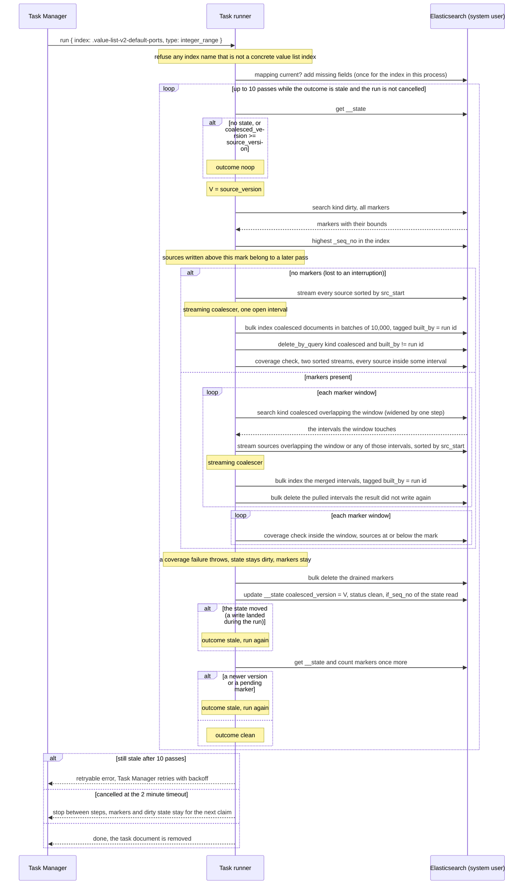
```mermaid
sequenceDiagram
    participant TM as Task Manager
    participant T as Task runner
    participant ES as Elasticsearch (system user)

    TM->>T: run { index: .value-list-v2-default-ports, type: integer_range }
    Note over T: refuse any index name that is not a concrete value list index
    T->>ES: mapping current? add missing fields (once for the index in this process)
    loop up to 10 passes while the outcome is stale and the run is not cancelled
        T->>ES: get __state
        alt no state, or coalesced_version >= source_version
            Note over T: outcome noop
        end
        Note over T: V = source_version
        T->>ES: search kind dirty, all markers
        ES-->>T: markers with their bounds
        T->>ES: highest _seq_no in the index
        Note over T: sources written above this mark belong to a later pass
        alt no markers (lost to an interruption)
            T->>ES: stream every source sorted by src_start
            Note over T: streaming coalescer, one open interval
            T->>ES: bulk index coalesced documents in batches of 10,000, tagged built_by = run id
            T->>ES: delete_by_query kind coalesced and built_by != run id
            T->>ES: coverage check, two sorted streams, every source inside some interval
        else markers present
            loop each marker window
                T->>ES: search kind coalesced overlapping the window (widened by one step)
                ES-->>T: the intervals the window touches
                T->>ES: stream sources overlapping the window or any of those intervals, sorted by src_start
                Note over T: streaming coalescer
                T->>ES: bulk index the merged intervals, tagged built_by = run id
                T->>ES: bulk delete the pulled intervals the result did not write again
            end
            loop each marker window
                T->>ES: coverage check inside the window, sources at or below the mark
            end
        end
        Note over T: a coverage failure throws, state stays dirty, markers stay
        T->>ES: bulk delete the drained markers
        T->>ES: update __state coalesced_version = V, status clean, if_seq_no of the state read
        alt the state moved (a write landed during the run)
            Note over T: outcome stale, run again
        end
        T->>ES: get __state and count markers once more
        alt a newer version or a pending marker
            Note over T: outcome stale, run again
        else
            Note over T: outcome clean
        end
    end
    alt still stale after 10 passes
        T-->>TM: retryable error, Task Manager retries with backoff
    else cancelled at the 2 minute timeout
        T-->>TM: stop between steps, markers and dirty state stay for the next claim
    else
        T-->>TM: done, the task document is removed
    end
```

Why the marker is written before the version bump: the task reads the version before it reads the markers. A marker visible before its bump costs at most one extra window. A bump visible before its marker would let the task record clean with that window unprocessed.

Why new intervals are written before stale ones are deleted: an interruption leaves a superset of intervals, which matches too much, rather than a hole, which matches too little. The next run pulls the overlapping intervals, new and stale, and deletes the ones the recomputed result does not contain.

## Worked examples

Every example runs on the list `ports`, type `integer_range`, in the `default` space. The list starts with these authored ranges and this coalesced projection:

| Kind | Documents |
|---|---|
| source | `1-100`, `50-200`, `500-510` |
| coalesced | `1-200`, `500-510` |
| `__state` | `source_version: 3`, `coalesced_version: 3`, `status: clean` |

Integers are discrete, so two ranges that touch exactly (`1-100` and `101-150`) also merge. Each example continues from the state the previous one left. In every diagram the response returns at the line marked so, and everything below that line runs asynchronously in the task, after the response, as the Kibana system user.

### Insert `150-300`

Before: sources `1-100`, `50-200`, `500-510`. After: coalesced `1-300`, `500-510`.

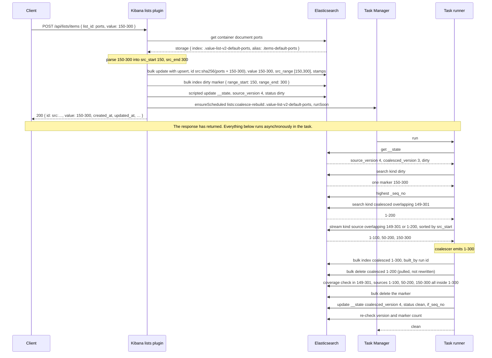
```mermaid
sequenceDiagram
    participant C as Client
    participant K as Kibana lists plugin
    participant ES as Elasticsearch
    participant TM as Task Manager
    participant T as Task runner

    C->>K: POST /api/lists/items { list_id: ports, value: 150-300 }
    K->>ES: get container document ports
    ES-->>K: storage { index: .value-list-v2-default-ports, alias: .items-default-ports }
    Note over K: parse 150-300 into src_start 150, src_end 300
    K->>ES: bulk update with upsert, id src:sha256(ports + 150-300), value 150-300, src_range [150,300], stamps
    K->>ES: bulk index dirty marker { range_start: 150, range_end: 300 }
    K->>ES: scripted update __state, source_version 4, status dirty
    K->>TM: ensureScheduled lists:coalesce-rebuild:.value-list-v2-default-ports, runSoon
    K-->>C: 200 { id: src:…, value: 150-300, created_at, updated_at, … }
    Note over C,T: The response has returned. Everything below runs asynchronously in the task.
    TM->>T: run
    T->>ES: get __state
    ES-->>T: source_version 4, coalesced_version 3, dirty
    T->>ES: search kind dirty
    ES-->>T: one marker 150-300
    T->>ES: highest _seq_no
    T->>ES: search kind coalesced overlapping 149-301
    ES-->>T: 1-200
    T->>ES: stream kind source overlapping 149-301 or 1-200, sorted by src_start
    ES-->>T: 1-100, 50-200, 150-300
    Note over T: coalescer emits 1-300
    T->>ES: bulk index coalesced 1-300, built_by run id
    T->>ES: bulk delete coalesced 1-200 (pulled, not rewritten)
    T->>ES: coverage check in 149-301, sources 1-100, 50-200, 150-300 all inside 1-300
    T->>ES: bulk delete the marker
    T->>ES: update __state coalesced_version 4, status clean, if_seq_no
    T->>ES: re-check version and marker count
    T-->>TM: clean
```

### Update `50-200` to `400-450` by id

Before: sources `1-100`, `50-200`, `150-300`, `500-510`; coalesced `1-300`, `500-510`. After: sources `1-100`, `150-300`, `400-450`, `500-510`; coalesced `1-100`, `150-300`, `400-450`, `500-510`.

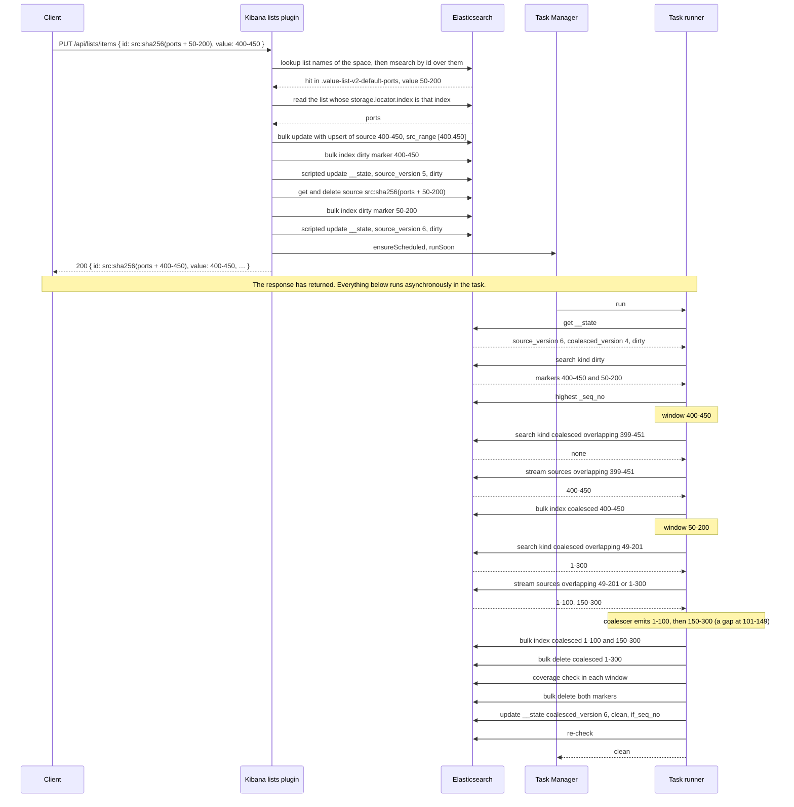
```mermaid
sequenceDiagram
    participant C as Client
    participant K as Kibana lists plugin
    participant ES as Elasticsearch
    participant TM as Task Manager
    participant T as Task runner

    C->>K: PUT /api/lists/items { id: src:sha256(ports + 50-200), value: 400-450 }
    K->>ES: lookup list names of the space, then msearch by id over them
    ES-->>K: hit in .value-list-v2-default-ports, value 50-200
    K->>ES: read the list whose storage.locator.index is that index
    ES-->>K: ports
    K->>ES: bulk update with upsert of source 400-450, src_range [400,450]
    K->>ES: bulk index dirty marker 400-450
    K->>ES: scripted update __state, source_version 5, dirty
    K->>ES: get and delete source src:sha256(ports + 50-200)
    K->>ES: bulk index dirty marker 50-200
    K->>ES: scripted update __state, source_version 6, dirty
    K->>TM: ensureScheduled, runSoon
    K-->>C: 200 { id: src:sha256(ports + 400-450), value: 400-450, … }
    Note over C,T: The response has returned. Everything below runs asynchronously in the task.
    TM->>T: run
    T->>ES: get __state
    ES-->>T: source_version 6, coalesced_version 4, dirty
    T->>ES: search kind dirty
    ES-->>T: markers 400-450 and 50-200
    T->>ES: highest _seq_no
    Note over T: window 400-450
    T->>ES: search kind coalesced overlapping 399-451
    ES-->>T: none
    T->>ES: stream sources overlapping 399-451
    ES-->>T: 400-450
    T->>ES: bulk index coalesced 400-450
    Note over T: window 50-200
    T->>ES: search kind coalesced overlapping 49-201
    ES-->>T: 1-300
    T->>ES: stream sources overlapping 49-201 or 1-300
    ES-->>T: 1-100, 150-300
    Note over T: coalescer emits 1-100, then 150-300 (a gap at 101-149)
    T->>ES: bulk index coalesced 1-100 and 150-300
    T->>ES: bulk delete coalesced 1-300
    T->>ES: coverage check in each window
    T->>ES: bulk delete both markers
    T->>ES: update __state coalesced_version 6, clean, if_seq_no
    T->>ES: re-check
    T-->>TM: clean
```

### Delete `150-300` by id

Before: sources `1-100`, `150-300`, `400-450`, `500-510`; coalesced `1-100`, `150-300`, `400-450`, `500-510`. After: sources and coalesced both lose `150-300`.

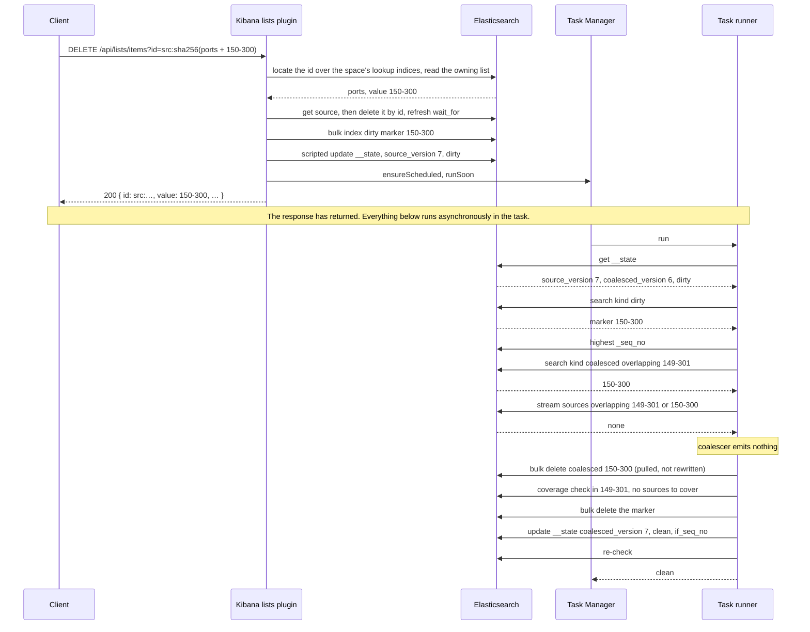
```mermaid
sequenceDiagram
    participant C as Client
    participant K as Kibana lists plugin
    participant ES as Elasticsearch
    participant TM as Task Manager
    participant T as Task runner

    C->>K: DELETE /api/lists/items?id=src:sha256(ports + 150-300)
    K->>ES: locate the id over the space's lookup indices, read the owning list
    ES-->>K: ports, value 150-300
    K->>ES: get source, then delete it by id, refresh wait_for
    K->>ES: bulk index dirty marker 150-300
    K->>ES: scripted update __state, source_version 7, dirty
    K->>TM: ensureScheduled, runSoon
    K-->>C: 200 { id: src:…, value: 150-300, … }
    Note over C,T: The response has returned. Everything below runs asynchronously in the task.
    TM->>T: run
    T->>ES: get __state
    ES-->>T: source_version 7, coalesced_version 6, dirty
    T->>ES: search kind dirty
    ES-->>T: marker 150-300
    T->>ES: highest _seq_no
    T->>ES: search kind coalesced overlapping 149-301
    ES-->>T: 150-300
    T->>ES: stream sources overlapping 149-301 or 150-300
    ES-->>T: none
    Note over T: coalescer emits nothing
    T->>ES: bulk delete coalesced 150-300 (pulled, not rewritten)
    T->>ES: coverage check in 149-301, no sources to cover
    T->>ES: bulk delete the marker
    T->>ES: update __state coalesced_version 7, clean, if_seq_no
    T->>ES: re-check
    T-->>TM: clean
```

### Delete by value `425`

Before: sources `1-100`, `400-450`, `500-510`; coalesced the same three. After: `400-450` is gone from both, because it is the only range that contains `425`.

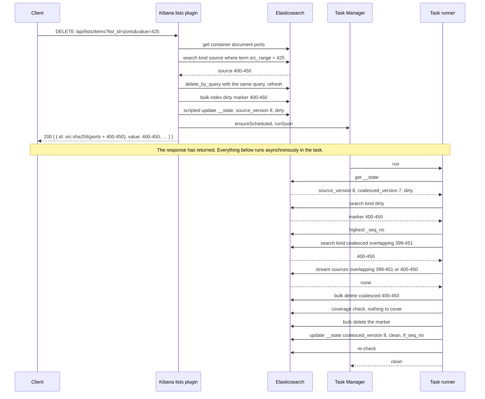
```mermaid
sequenceDiagram
    participant C as Client
    participant K as Kibana lists plugin
    participant ES as Elasticsearch
    participant TM as Task Manager
    participant T as Task runner

    C->>K: DELETE /api/lists/items?list_id=ports&value=425
    K->>ES: get container document ports
    K->>ES: search kind source where term src_range = 425
    ES-->>K: source 400-450
    K->>ES: delete_by_query with the same query, refresh
    K->>ES: bulk index dirty marker 400-450
    K->>ES: scripted update __state, source_version 8, dirty
    K->>TM: ensureScheduled, runSoon
    K-->>C: 200 [ { id: src:sha256(ports + 400-450), value: 400-450, … } ]
    Note over C,T: The response has returned. Everything below runs asynchronously in the task.
    TM->>T: run
    T->>ES: get __state
    ES-->>T: source_version 8, coalesced_version 7, dirty
    T->>ES: search kind dirty
    ES-->>T: marker 400-450
    T->>ES: highest _seq_no
    T->>ES: search kind coalesced overlapping 399-451
    ES-->>T: 400-450
    T->>ES: stream sources overlapping 399-451 or 400-450
    ES-->>T: none
    T->>ES: bulk delete coalesced 400-450
    T->>ES: coverage check, nothing to cover
    T->>ES: bulk delete the marker
    T->>ES: update __state coalesced_version 8, clean, if_seq_no
    T->>ES: re-check
    T-->>TM: clean
```

### Import a file with `90-120`, `abc`, `600-700`

Before: sources `1-100`, `500-510`; coalesced the same. After: `abc` is dropped, sources `1-100`, `90-120`, `500-510`, `600-700`; coalesced `1-120`, `500-510`, `600-700`.

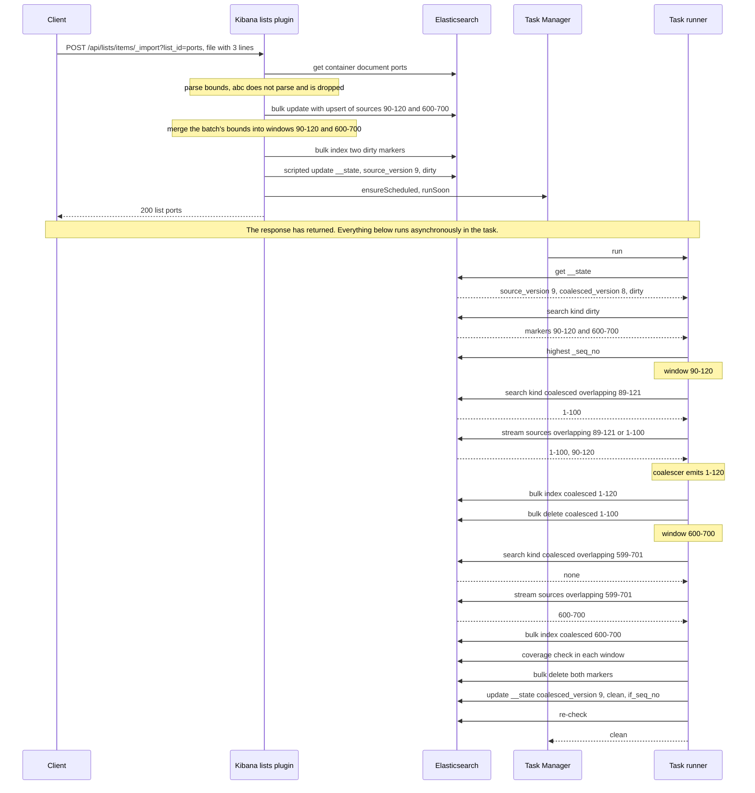
```mermaid
sequenceDiagram
    participant C as Client
    participant K as Kibana lists plugin
    participant ES as Elasticsearch
    participant TM as Task Manager
    participant T as Task runner

    C->>K: POST /api/lists/items/_import?list_id=ports, file with 3 lines
    K->>ES: get container document ports
    Note over K: parse bounds, abc does not parse and is dropped
    K->>ES: bulk update with upsert of sources 90-120 and 600-700
    Note over K: merge the batch's bounds into windows 90-120 and 600-700
    K->>ES: bulk index two dirty markers
    K->>ES: scripted update __state, source_version 9, dirty
    K->>TM: ensureScheduled, runSoon
    K-->>C: 200 list ports
    Note over C,T: The response has returned. Everything below runs asynchronously in the task.
    TM->>T: run
    T->>ES: get __state
    ES-->>T: source_version 9, coalesced_version 8, dirty
    T->>ES: search kind dirty
    ES-->>T: markers 90-120 and 600-700
    T->>ES: highest _seq_no
    Note over T: window 90-120
    T->>ES: search kind coalesced overlapping 89-121
    ES-->>T: 1-100
    T->>ES: stream sources overlapping 89-121 or 1-100
    ES-->>T: 1-100, 90-120
    Note over T: coalescer emits 1-120
    T->>ES: bulk index coalesced 1-120
    T->>ES: bulk delete coalesced 1-100
    Note over T: window 600-700
    T->>ES: search kind coalesced overlapping 599-701
    ES-->>T: none
    T->>ES: stream sources overlapping 599-701
    ES-->>T: 600-700
    T->>ES: bulk index coalesced 600-700
    T->>ES: coverage check in each window
    T->>ES: bulk delete both markers
    T->>ES: update __state coalesced_version 9, clean, if_seq_no
    T->>ES: re-check
    T-->>TM: clean
```

### Migrate a legacy `ip_range` list

The list `bad-nets` lives in the current `.items-default` stream with three rows: `10.0.0.0/24`, `10.0.0.128-10.0.1.255`, `10.0.5.0/24`. No rule references it.

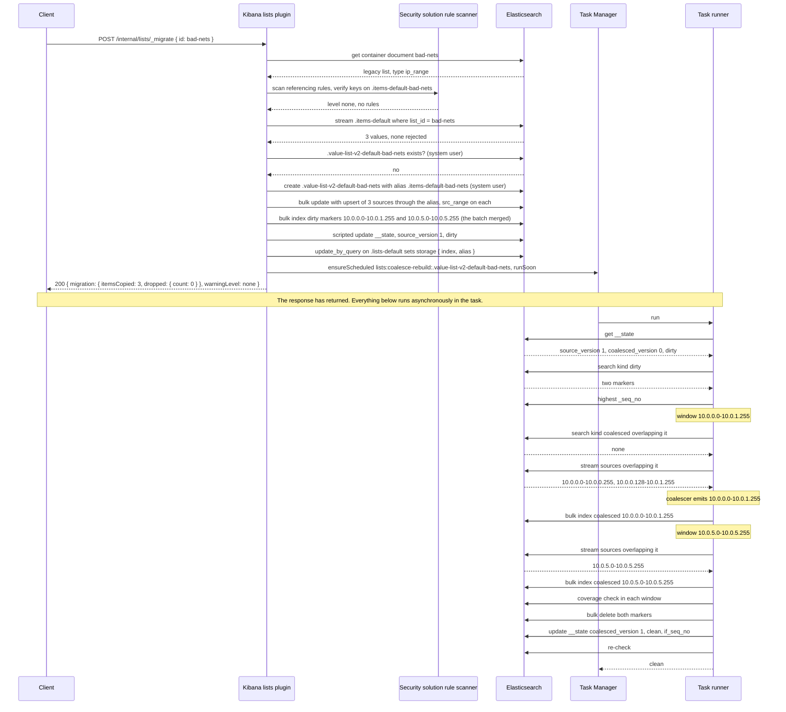
```mermaid
sequenceDiagram
    participant C as Client
    participant K as Kibana lists plugin
    participant S as Security solution rule scanner
    participant ES as Elasticsearch
    participant TM as Task Manager
    participant T as Task runner

    C->>K: POST /internal/lists/_migrate { id: bad-nets }
    K->>ES: get container document bad-nets
    ES-->>K: legacy list, type ip_range
    K->>S: scan referencing rules, verify keys on .items-default-bad-nets
    S-->>K: level none, no rules
    K->>ES: stream .items-default where list_id = bad-nets
    ES-->>K: 3 values, none rejected
    K->>ES: .value-list-v2-default-bad-nets exists? (system user)
    ES-->>K: no
    K->>ES: create .value-list-v2-default-bad-nets with alias .items-default-bad-nets (system user)
    K->>ES: bulk update with upsert of 3 sources through the alias, src_range on each
    K->>ES: bulk index dirty markers 10.0.0.0-10.0.1.255 and 10.0.5.0-10.0.5.255 (the batch merged)
    K->>ES: scripted update __state, source_version 1, dirty
    K->>ES: update_by_query on .lists-default sets storage { index, alias }
    K->>TM: ensureScheduled lists:coalesce-rebuild:.value-list-v2-default-bad-nets, runSoon
    K-->>C: 200 { migration: { itemsCopied: 3, dropped: { count: 0 } }, warningLevel: none }
    Note over C,T: The response has returned. Everything below runs asynchronously in the task.
    TM->>T: run
    T->>ES: get __state
    ES-->>T: source_version 1, coalesced_version 0, dirty
    T->>ES: search kind dirty
    ES-->>T: two markers
    T->>ES: highest _seq_no
    Note over T: window 10.0.0.0-10.0.1.255
    T->>ES: search kind coalesced overlapping it
    ES-->>T: none
    T->>ES: stream sources overlapping it
    ES-->>T: 10.0.0.0-10.0.0.255, 10.0.0.128-10.0.1.255
    Note over T: coalescer emits 10.0.0.0-10.0.1.255
    T->>ES: bulk index coalesced 10.0.0.0-10.0.1.255
    Note over T: window 10.0.5.0-10.0.5.255
    T->>ES: stream sources overlapping it
    ES-->>T: 10.0.5.0-10.0.5.255
    T->>ES: bulk index coalesced 10.0.5.0-10.0.5.255
    T->>ES: coverage check in each window
    T->>ES: bulk delete both markers
    T->>ES: update __state coalesced_version 1, clean, if_seq_no
    T->>ES: re-check
    T-->>TM: clean
```

The legacy rows in `.items-default` are untouched. An indicator match rule that reads them through `.items-default` keeps matching that frozen copy until it is pointed at `.value-list-v2-default-bad-nets`.

### Restrict `ports`

No source changes, so the task has nothing to do.

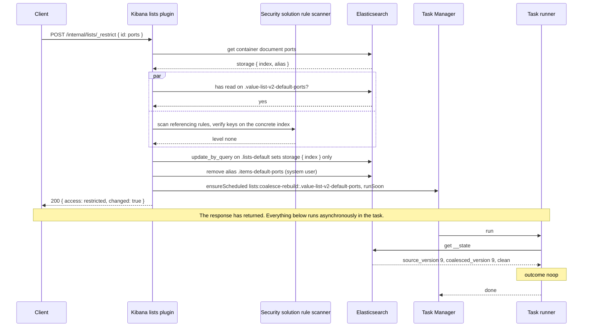
```mermaid
sequenceDiagram
    participant C as Client
    participant K as Kibana lists plugin
    participant S as Security solution rule scanner
    participant ES as Elasticsearch
    participant TM as Task Manager
    participant T as Task runner

    C->>K: POST /internal/lists/_restrict { id: ports }
    K->>ES: get container document ports
    ES-->>K: storage { index, alias }
    par
        K->>ES: has read on .value-list-v2-default-ports?
        ES-->>K: yes
    and
        K->>S: scan referencing rules, verify keys on the concrete index
        S-->>K: level none
    end
    K->>ES: update_by_query on .lists-default sets storage { index } only
    K->>ES: remove alias .items-default-ports (system user)
    K->>TM: ensureScheduled lists:coalesce-rebuild:.value-list-v2-default-ports, runSoon
    K-->>C: 200 { access: restricted, changed: true }
    Note over C,T: The response has returned. Everything below runs asynchronously in the task.
    TM->>T: run
    T->>ES: get __state
    ES-->>T: source_version 9, coalesced_version 9, clean
    Note over T: outcome noop
    T-->>TM: done
```

The task id did not change: it is derived from the concrete index, which the restrict left as it was.

## Error catalogue

Errors reach the client as `{ "message", "statusCode" }`, with `attributes` where noted above. Messages are quoted as the code produces them; `<…>` marks a value filled in at run time.

### 400

| Message | Raised by | Meaning |
|---|---|---|
| `list item invalid: <reason>` | Item create, update, patch | The value is outside the accepted grammar of the list type. The reasons are listed below. |
| `list item invalid: "<value>" is not a valid <type> value` | Item create, update, patch, import target check | A range value that does not parse: not `start-end`, not a CIDR block, a start after its end, a date outside the supported range, or a mixed IPv4 and IPv6 range. |
| `list item invalid: <n> value(s) are not accepted for type <type>: …` | `_migrate` | A legacy value the grammar rejects appeared in the copy after the value scan passed. Rerun the migration. |
| `list id "<id>" has no characters usable in an index name` | List create, `_migrate` | The id normalizes to nothing. |
| `Lookup indices are not enabled (xpack.lists.enableLookupIndices)` | `_migrate` | The feature flag is off. |
| `list "<id>" is a legacy data stream list. Migrate it before restricting it` | `_restrict` | |
| `list "<id>" is not a lookup list` | `_unrestrict` | |
| `list "<file name>" exists as a legacy list. Pass list_id to import into it` | Import without `list_id` | The file name matches a legacy list. |
| The Elasticsearch message, for example `'10.0.0.0/24' is not an IP string literal.` | Delete by value on a range list | The value is a range string, which a range field cannot be queried by. Delete the item by its id instead. |

Grammar reasons in `list item invalid: <reason>`:

| Reason | Types |
|---|---|
| `"<value>" is not an IP address`, `"<value>" is not an IPv6 address` | `ip` |
| `"<value>" has a zone id, which is not stored` | `ip` |
| `"<value>" is not an IPv4-mapped IPv6 address of the form ::ffff:a.b.c.d` | `ip` |
| `"<value>" is not a number`, `"<value>" is out of range`, `"<value>" is out of range for <type>` | numeric types |
| `"<value>" is not a whole number` | `byte`, `short`, `integer`, `long` |
| `"<value>" is out of range for half_float` | `half_float` |
| `"<value>" is not a date`, `"<value>" is not a valid date`, `"<value>" is not an ISO 8601 date or epoch milliseconds` | `date`, `date_nanos` |
| `"<value>" has an offset beyond 18:00` | `date`, `date_nanos` |
| `"<value>" is not true or false` | `boolean` |
| `the value is empty`, `the value contains a line break` | every type |

### 403

| Message | Raised by | Meaning |
|---|---|---|
| `list "<id>" is restricted to roles that can read "<name>", which this user cannot` | `_unrestrict`, `DELETE /api/lists` | The caller cannot read the list through its alias, or through its concrete index once restricted. The operations that undo a restriction are not open to every list writer. |
| The Elasticsearch message | Item writes | The caller has no write privilege on the alias or concrete index. A bulk item failure is raised with the item's own status, so a 429 or 503 from Elasticsearch is passed through the same way. |

### 404

| Message | Raised by |
|---|---|
| `list "<id>" not found` | `_migrate`, `_restrict`, `_unrestrict` |
| `list item id: "<id>" not found` | `PUT`, `PATCH /api/lists/items`, when no lookup index of the space holds the id and the current implementation does not either |
| `list item with id: "<id>" not found` | `DELETE /api/lists/items?id=`, same condition |
| `list item id: "<id>" does not exist` | `GET /api/lists/items?id=`, same condition |
| `list_id: "<id>" item of <value> does not exist` | `GET /api/lists/items?list_id=&value=` |
| `list_id: "<id>" with <value> was not found` | `DELETE /api/lists/items?list_id=&value=`, when no document, or no containing range, matches |

### 409

| Message | Raised by | Meaning |
|---|---|---|
| `"<name>" already exists. The list id normalizes to a name another list or index uses; choose a different id` | List create, `_migrate` | The concrete index or alias name is taken. Two ids that normalize alike, or the loser of two concurrent creates. |
| `"<alias>" already exists and is not this list's alias` | `_unrestrict` | Another index owns the alias name. |
| `the storage descriptor of list "<id>" was not updated; retry the operation` | `_migrate`, `_restrict`, `_unrestrict` | The container document changed under the write, or the list vanished. Nothing else was changed. |
| `Migration is blocked: <blockers> Pass force to migrate anyway, or dryRun to see the full report.` | `_migrate`, plain call blocked by the rule scan | `attributes.rejectedValues` is `null`, the value scan did not run. |
| `Migration is blocked: <blockers> Pass force to migrate anyway.` | `_migrate`, blocked by rejected values, or by both checks on a dry run turned real | `attributes.rejectedValues` is `{ count, sample }`. |
| `Migrated, but not restricted. <restrict message>` | `_migrate` with `restrict: true` | The list is a lookup list now and still shared. `attributes.migration` holds the migration result. |
| `Restricting is blocked: <blockers>. <remedy> Pass force to restrict anyway.` | `_restrict` | The caller or a referencing rule's key cannot read the concrete index. The remedy names the roles to grant and asks for the rules to be saved so their keys refresh. |

### 500

These indicate a bug or a hand edited descriptor, never user input. The system user is not handed the name.

| Message | Raised by |
|---|---|
| `list "<id>" has a storage descriptor naming "<name>", which is not this list's index; the descriptor was not written by the lists plugin` | Every read of a list whose descriptor does not match the names recomputed from the space and the list id |
| `"<name>" is not a value list lookup index name`, `"<name>" is not a value list alias name` | Index create and delete, alias add and remove, mapping upgrade, task scheduling and task run |
| `could not check alias "<alias>": <Elasticsearch message>` | `_restrict` rerun on an already restricted list, with the status Elasticsearch returned |

### Task failures

These never reach an HTTP response. They appear in the Kibana log and in the task document's attempts.

| Message | Meaning |
|---|---|
| `coalesced set of <index> does not cover <n> source(s); first: <start>-<end>` | The coverage check found a source outside every coalesced interval. The run fails, the state stays dirty, the markers stay, and Task Manager retries. |
| `coalesced rebuild for <index> still behind after 10 passes` | Writes kept landing during the run. Reported as retryable, Task Manager retries with backoff. |
| `coalesced rebuild for <index> stopped at the task timeout` | The run was cancelled at the 2 minute timeout between steps. The next claim resumes from the markers. |
| `coalesced rebuild for <index> is still running; the next write re-enqueues it` | The scheduler could not enqueue a run within its three retries because the task was running. The next write to the list schedules it. |
| `failed to schedule coalesced rebuild for <index>: <message>` | Task Manager refused the enqueue. The write itself succeeded. |
| `cannot schedule coalesced rebuild for <index>: Task Manager unavailable` | The plugin started without Task Manager. |
