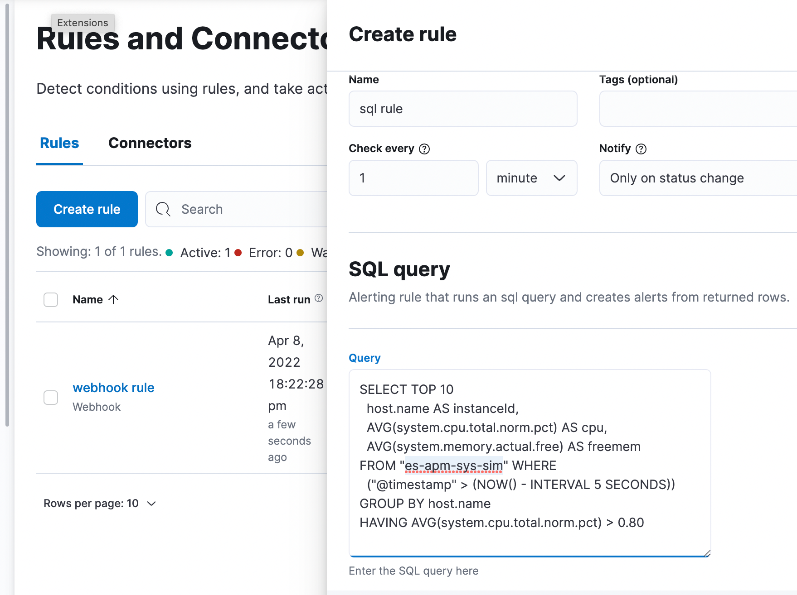

# SQL Alerting Rule 

_part of [on-week 2022@1 - Patrick Mueller](./README.md)_

_this was a dust-off-and-polish effort; the original code is here: https://github.com/pmuellr/kbn-sample-plugins/blob/master/plugins/alert_type_examples/server/alert_types/essql.ts; cleaned things up and added some (not great) UX_

Adds a Kibana alerting rule that uses SQL, with the resulting SQL columns
selecting both the alert id (AKA alert instance id, like a host name) and
context variables.

The column named `instanceId` must be included in the selected columns, and
will be used as the instance id of the alert.  The SQL query should only return
one row for each value.

The remaining columns will be used as context variables for the alert.

As an example, we'll build a rule which does a query over an index with
documents with the following fields:

- `@timestamp`
- `host.name`
- `system.cpu.total.norm.pct` _(between 0.0 and 1.0)_
- `system.memory.actual.free` _(bytes)_
- `system.memory.total` _(bytes)_

A command-line tool [`es-apm-sys-sim`](https://github.com/pmuellr/es-apm-sys-sim)
can be used to generate these documents with values changing over time. 

Here's a query you can use with the new rule, which you'll find grouped with
the other Alerting Example rule types, at the top of the list.  Assuming you've
launched Kibana with `--run-examples`.

    SELECT 
      TOP 10 
      host.name AS instanceId, 
      AVG(system.cpu.total.norm.pct) AS cpu, 
      AVG(system.memory.actual.free) AS freemem 
    FROM "es-apm-sys-sim" 
    WHERE 
      ("@timestamp" > (NOW() - INTERVAL 5 SECONDS)) 
    GROUP BY host.name 
    HAVING 
      AVG(system.cpu.total.norm.pct) > 0.80

This SQL query rule is basically the same thing as the index threshold query
with parameters:

    when:          average(system.cpu.total.norm.pct)
    grouped over:  top 10 values of 'host.name'
    condition:     is above 0.8
    for the last:  5 seconds

The human version: alert when the average of a host's CPU over 5 seconds is > 80%.

Note we "renamed" the columns using `AS`, because it's difficult to
access context variables with `.` in their name from mustache.  Well,
impossible - today.  Yes, there's an issue open :-).  But you'd want
one for the `cpu` and `freemem` columns anyway.

It's also odd - to me - to have to put the `AVG(system.cpu.total.norm.pct)`
comparison in a `HAVING` clause.  I first tried in the `WHERE` clause,
but was informed with error messages that it needed to go in `HAVING`.
So that was a nice experience!  And me probably showing off my SQL noob-i-ness.

One nice difference from the index threshold rule,
is the sql rule assigns context variables from the column
names; so in this case, we have both `cpu` and `freemem` as context variables,
but with the index threshold rule we'll only have the cpu value available as
`context.value`.  This is a frequent ask from customers - accessing _other_
associated data in an action's mustache template, from an alert.

On the downside, we had to encode the timestamp range into the SQL itself,
whereas it seems like it would be generally nicer to not to have a rule author
have to deal with this.  We could probably make use of the
[`filter` option](https://www.elastic.co/guide/en/elasticsearch/reference/current/sql-search-api.html#sql-search-api-request-body)
to add the time range filter to the rule, however the rule user would also have
to specify the window value in a separate parameter.  Probably good, but
also probably have an option to **not** require this.

Because this is using a 1s interval, you can avoid warnings about that overly short interval with the config setting:

    xpack.alerting.rules.minimumScheduleInterval.value: '1s'

Add an action, such as server log, with the following value for the message:

    rule {{alertName}} triggered for {{alertInstanceId}}; cpu: {{context.cpu}};
    free memory: {{context.freemem}}      

Note we're referencing the columns from the SQL result as context variables!

Once this rule has been added, and the cpu for some of the hosts goes over 0.80, the following server logs will be generated:

    Server log: rule sql rule example triggered for host-1; cpu: 0.8500000238418579; free memory: 340000
    Server log: rule sql rule example triggered for host-2; cpu: 0.949999988079071; free memory: 380000

## relevant code

https://github.com/pmuellr/kibana/blob/7e3da41a3787b60ef56c925c67f163686616e3ee/x-pack/examples/ow22_pmuellr/server/rule_types/sql_rule.ts#L1-L98