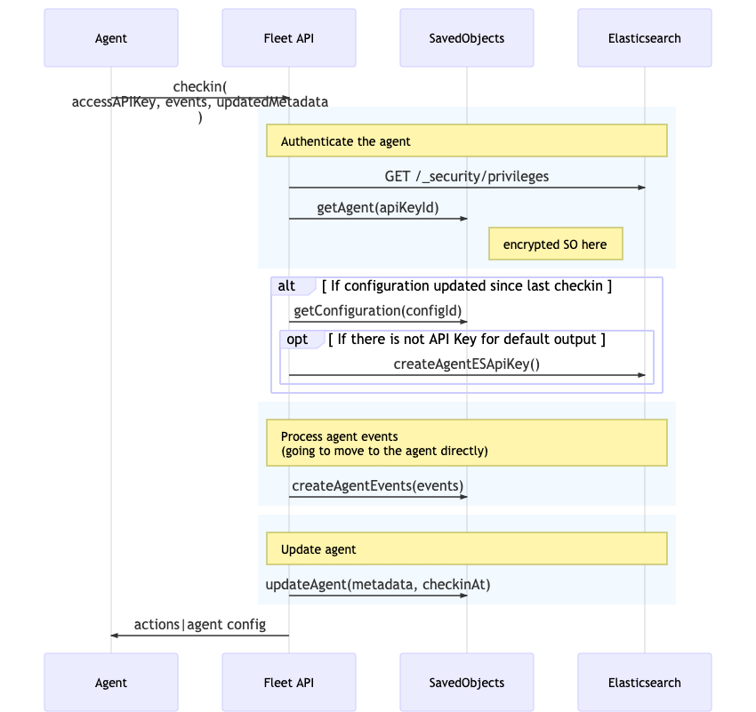

# Fleet <-> Agent Interactions

## Agent enrollment and checkin

Fleet workflow:

- an agent enroll to fleet using an enrollmentAPiKey
- Every n seconds agent is polling the checkin API to send events and check for new configuration

### Agent enrollment

An agent can enroll using the REST Api provided by fleet.
When an agent enroll Fleet:

- verify the API Key is a valid ES API key
- retrieve the SO associated to this api key id (this SO contains the configuration|policy id)
- create an ES ApiKey for accessing kibana during checkin
- create an ES ApiKey to send logs and metrics to the defalt output
- Save the new agent in a SO with keys encrypted inside the agent

### Agent checkin

Agent are going to poll the checkin API to send events and check for new configration. To checkin agent are going to use the REST Api provided by fleet.

When an agent checkin fleet:

- verify the access API Key is a valid ES API key
- retrieve the agent (SO associated to this api key id)
- Insert events SO
- create an ES ApiKey to send logs and metrics to the defalt output
- Save the new agent in a SO with keys encrypted inside the agent

### Agent acknowledgement

This is really similar to the checkin (same auth mecanism) and it's used for agent to acknowlege action received during checkin

## Other interactions

### Agent Configuration update

