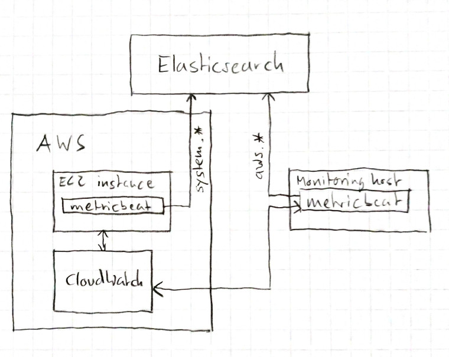

# metricbeat / aws

This guide explains how to set up
* `metricbeat` on a AWS instance to report `system` metrics
* `metricbeat` on your local machine to report `aws` metrics through CloudWatch and the `aws` module

This is helpful to develop and test the following features in the Kibana Infrastructure UI:
* returning cloud metrics from the `metadata` and `metrics` endpoints
* showing cloud metrics on the node detail page
* showing cloud metrics on the inventory overview page (waffle map and list view)

This guide assumes:
* a linux environment, but mac os x should be very similar
* a running `elasticsearch` instance accessible from an AWS instance to send metrics data to (e.g. on Elastic Cloud)

The information in this guide was valid on July 15 2019.

## Goal

The purpose of this setup is to have data describing an AWS instance coming from two different sources:
- `metricbeat` running on the instance itself, reporting `system` metrics. The documents sent from this machine will contain cloud metadata enabled by the `add_cloud_metadata` flag.
- Cloud metrics provided by AWS CloudWatch, collected by `metricbeat` running on a different node. The documents sent from this machine will contain cloud metadata added by the `aws` module.

To display cloud metrics together with the system metrics collected on the AWS instance itself, we need to match the documents by looking at the cloud metadata added in both cases.