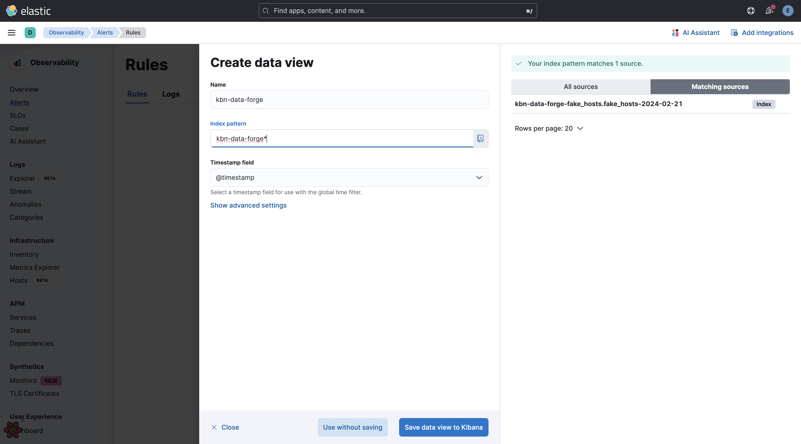
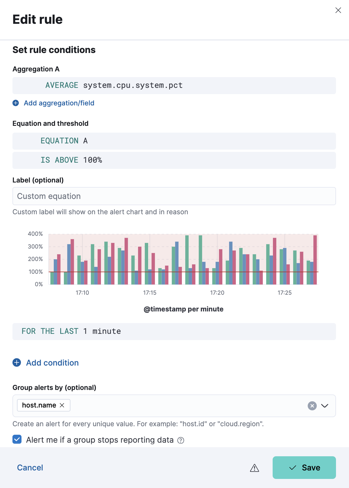
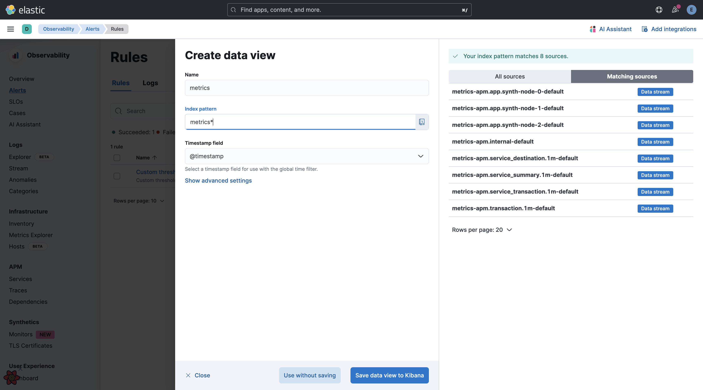
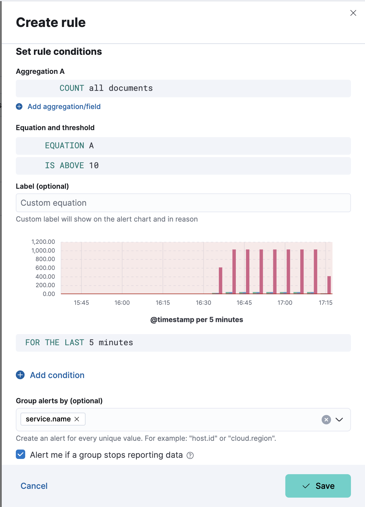

# Custom threshold rule

Custom threshold rule is GA since 8.13.

## Development & testing

### With data forge

> [!TIP]
> The following commands uses [kbn-data-forge](../../../../packages/kbn-data-forge/README.md) to generate some data for testing Custom threshold rule.

Basic command to generate host data for 7 hosts:
```sh
node x-pack/scripts/data_forge.js \
  --events-per-cycle 7 \
  --lookback now-20m \
  --install-kibana-assets \
  --dataset fake_hosts
```

Get help with the data forge tool: `node x-pack/scripts/data_forge.js --help`

#### Create a Custom threshold rule

- First create a data view as shown below:

  

- Then you can adjust the rule to alert based on CPU usage:

  

### With synthtrace

> [!TIP]
> The following commands uses [kbn-apm-synthtrace](../../../../packages/kbn-apm-synthtrace) to generate some data for testing Custom threshold rule.

Basic command to generate APM data for 3 services:
```sh
node scripts/synthtrace simple_trace.ts --local --live
```

#### Create a Custom threshold rule

- First create a data view as shown below:

  

- Then you can adjust the rule to alert based on CPU usage:

  
